# 因为这种小馆子，上海才上海

- 原文链接: https://mp.weixin.qq.com/s?__biz=MjM5NTYxODQyMA==&mid=2653454943&idx=1&sn=e490e3d42203e9a3ce4f864407dbc93d&chksm=bc1410d3f2e107a7f75349d0466c25a78ef8d0dcc4da01f6441e3ff5d32347eee3b4849e3b7e&scene=27#wechat_redirect
- 浏览量: N/A
- 点赞数: N/A
- 评论数: N/A
- 转发数: N/A

## 正文

每周写点消费笔记

以下是本人的日常消费笔记没有广告软文请放心食用

作为一个在上海待了 20 多年的杭州人，

一开始来读大学对上海是目瞪狗呆的。

复旦的校园当时眯眯小，

宿舍嘛破破烂烂，

上海同学见我第一句话

就是问是我杭州哪个区的？？？

（哈哈哈这个地图梗，现在懂的人是不是不多了？

周末既没有山爬，又没有船划，

更没有林间绿地大片草坪上的吊床，

同学叫我出去玩，是去复兴公园的钱柜！

我：？？？

20 年过去，复兴公园从台湾人

开满夜店的娱乐公园，

（《繁花》的执行导演程亮作为向明毕业生，就此拍过一部淮海路

变成了国资投资为主的潮店区。

图：小红书用户@普通市民 Vera

而我，也安于在各种午间和朋友

约梧桐区的小馆子。

饭后坐在路边戴好墨镜晒太阳，喝冰咖啡，

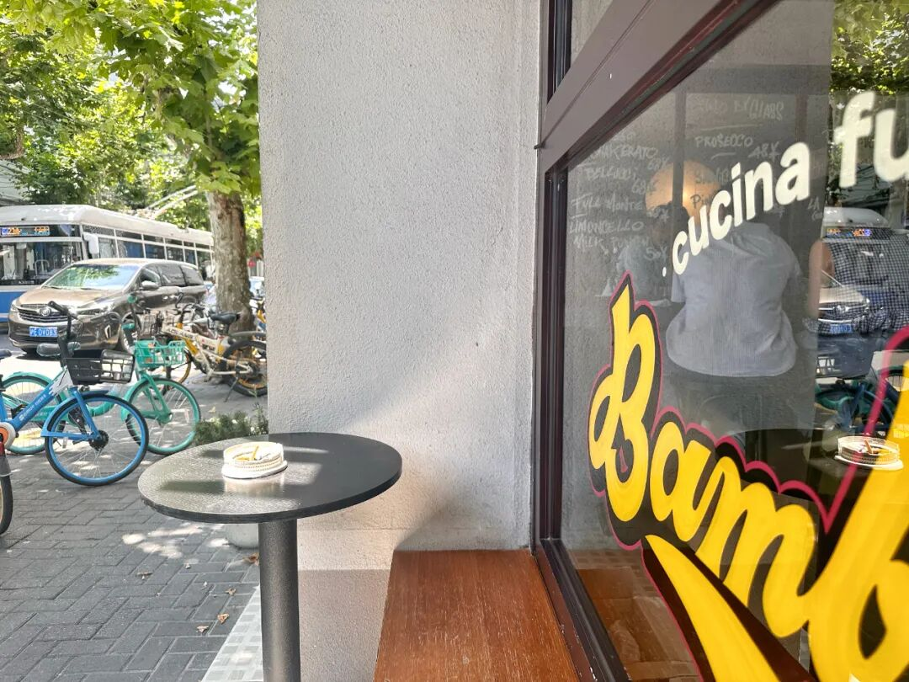

并真的会偶遇住上只角的前同事，

分食路口对面时髦店里买的泡菜三明治！

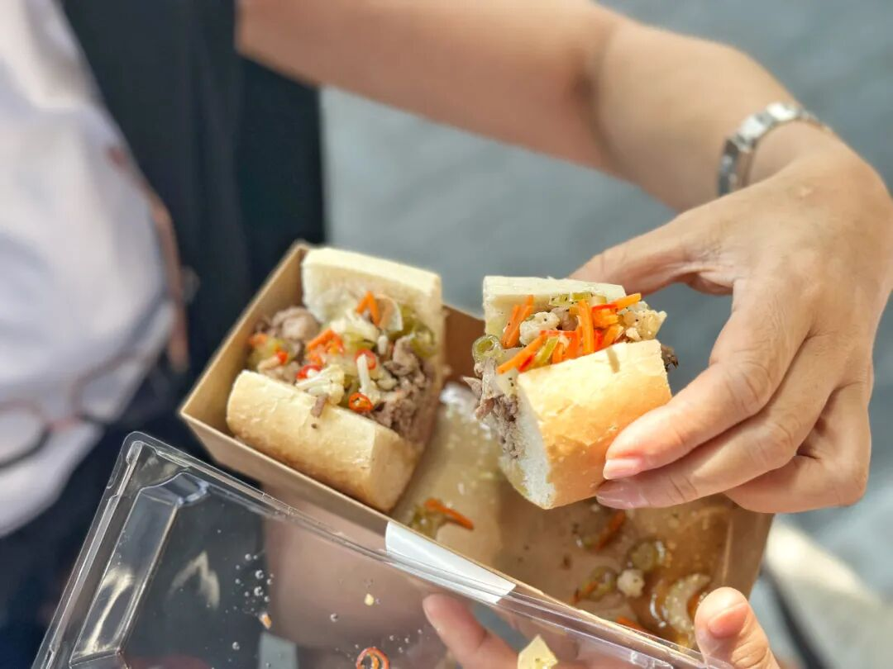

去年初去巴黎，

专门在 2 区玛黑区租普通民宿住了几天。

这里布满梧桐、老法式住宅建筑，

以及时髦小馆子和设计师小店

和上海的衡复风貌区完全没有区别。

连小馆子的人均消费，都是二三百人民币，

沪区汇率实锤！

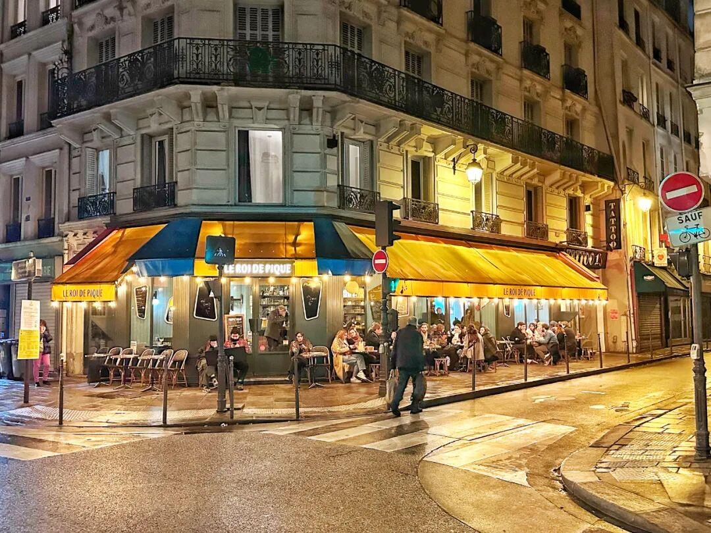

昨天刚吃的小馆子，

是胖胖的罗马籍主厨开的。

图：点评商家上传视频博主@Alexx雷意大利人。主厨说是之前超级小酒馆 Juke 的。

我在点评上刷到，

发现它有名为「朝鲜蓟」的菜，

很意大利当地，上海很少见，

就去了一下，果然整个菜单和调味，

吃起来都很意大利～

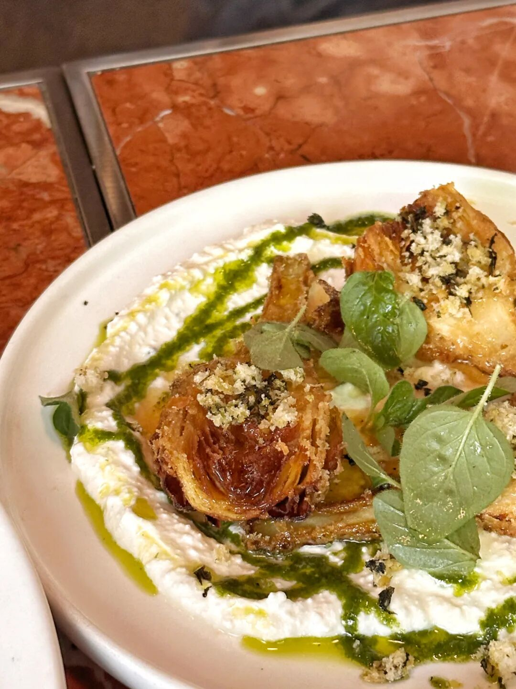

大爷没开门时就在店门口抽烟聊天儿，

开门了就进厨房。人工也像欧洲一样很省，

楼上下只有一个服务员，

花臂但是态度很客气～

朝鲜蓟，在当地可以吃新鲜的，

在上海食材没法这么厉害，

就给你裹浆油炸一下，

沾上好橄榄油、调得非常香的酸奶酱。

生牛肉薄片搭配松子，

上海也很少见。吃下来更下酒：

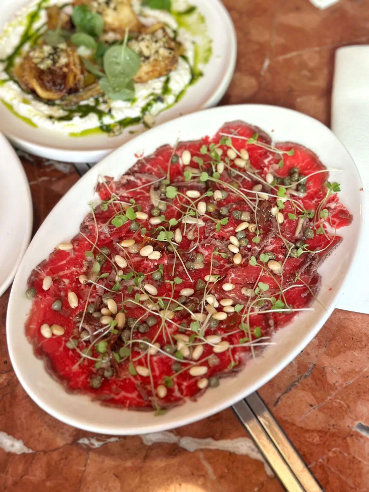

佛卡夏面包是要单点的，

但是哦，地地道道，香香喷喷，

哦我死了我死了！！

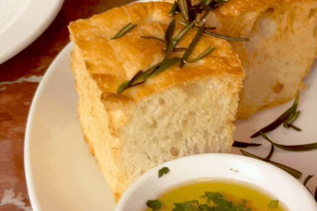

主菜我们点了个炖牛脸肉，

是牛脸肉切丁，拌上意大利风格独有的香料，

和胡萝卜洋葱丁炒香后封上酥皮一起炖，

还有一根牛骨可以挖骨髓吃：

这肉真的极其入味又好香，

调味很地道，真的，放上海小馆外籍主厨界

也是极有特色的好吃！

其它点了章鱼腿，

烤得就那样。但是配的腌菜酸甜可口，

像水果！

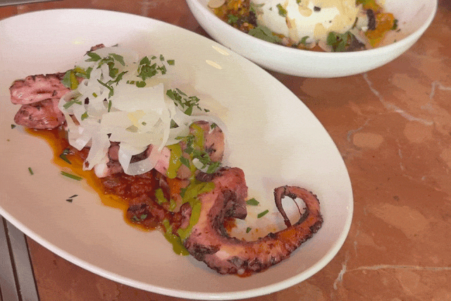

‍布拉塔芝士，配的腌甜椒香料都棒，

不过上海布拉塔原料有限，

和乌鲁木齐吃的，

用新疆当地水牛奶发酵的比，

差远了hhh

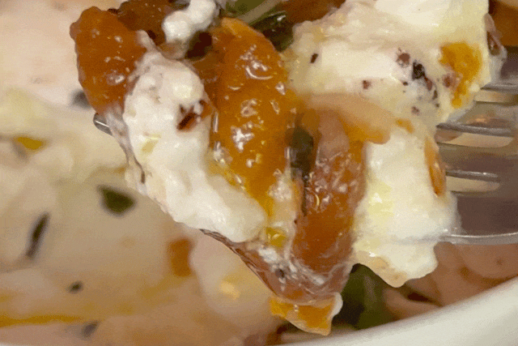

秋天想去意大利一个个村的奶和黄油吃过来～～

甜点点的香草奶冻，

香草籽密密麻麻：

三个人分了一瓶皮埃蒙特的冰镇白葡萄酒，

真的仿佛意大利的夏天。

即使放在上海的梧桐区，

这家小店也是地道得出众的。

十分欧洲，相当 chill。

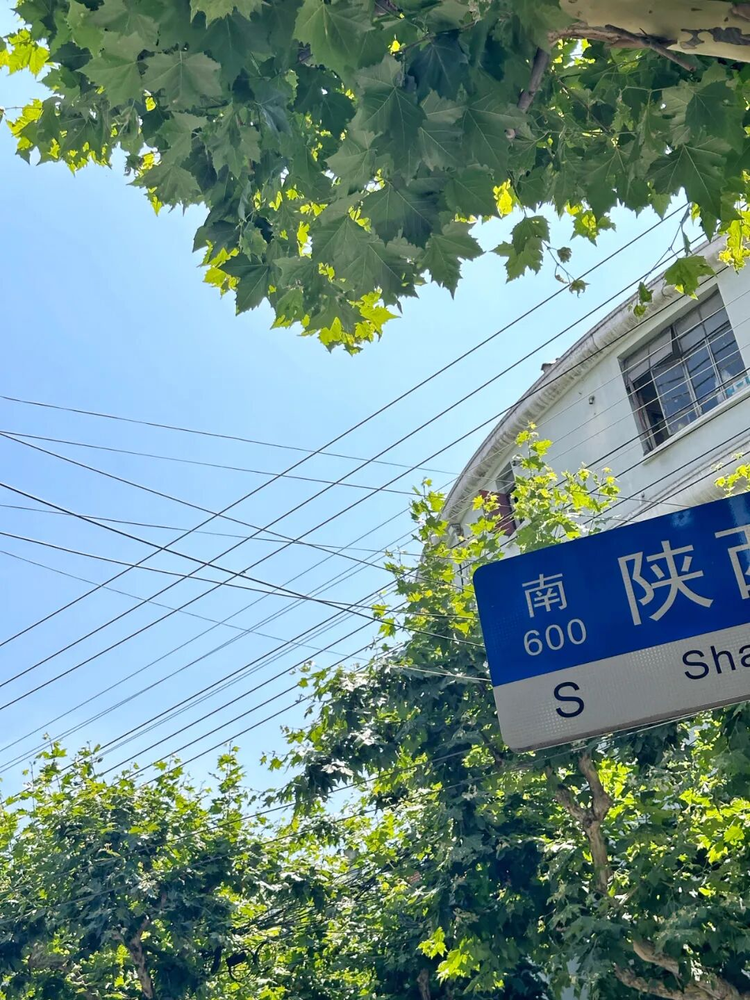

哈哈不过也因为当地风格，

意面是中国人吃不惯式的夹生，

想吃熟点的话，可以告诉厨房。

意面酱超超超香～～

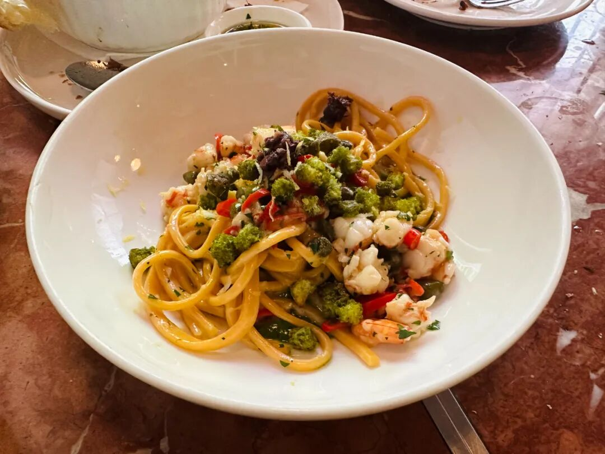

店名叫 Bambino。

在点评上订位要付订金（十分外国

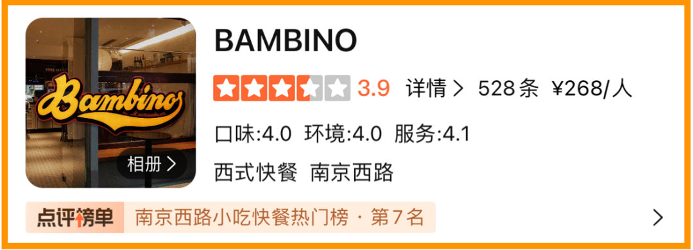

回头，整理一版我的上海小酒馆

100 道菜单吧！

毕竟自从疫情被放出来之后，

我天天都在小酒馆流连，

酒量从一杯葡萄酒到轻松半瓶。。。

经历了很多小酒馆的兴起、衰落或者屹立。

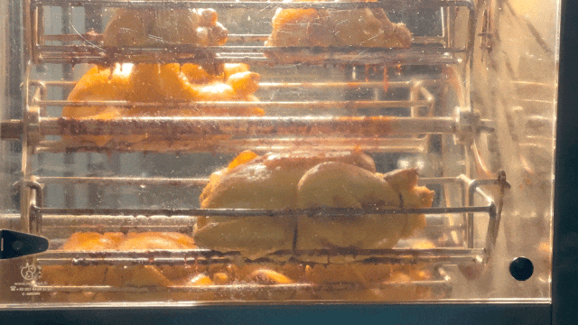

巴黎玛黑区的烤鸡，每次去都想吃都饱得要死没吃。。

其实最近上海气候很不错，

不冷也不热，

短袖坐路边喝冰酒冰咖啡都好，

来玩啊～～～～

题 外

两个水果，一个快结束了 86 折，
一个现货了价格会调高哦～
新疆小白杏众多，

我司只选核心产区轮台长大的，

因日照时间长、昼夜温差大，

酝酿出了浓郁的甜。

皮薄，肉厚，

还有珍贵的、蜂蜜般的香气！

咬一口就尝得出区别！

都是树上熟！！

且可能因为有补贴的关系，
全部选择顺丰空运，每份运费才 17 元！！
（比飞我的运费便宜了百倍hhh
大部分地区两三天左右送达！！

吃它！！

饱记·新疆轮台小白杏购买方式如下👇现货 86 折！！！！

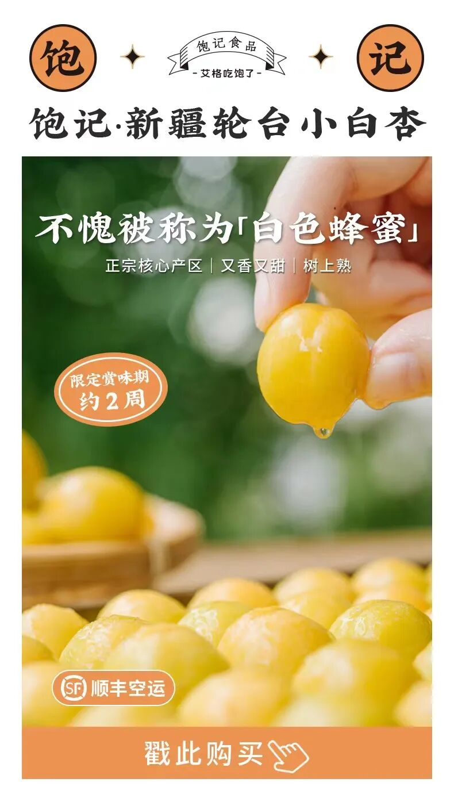

同样矜贵的还有！六月以来后台被问了八百遍的，饱记·仙居东魁大杨梅
终于要熟成啦！！

产区正宗，个头大，果味浓。

包邮区顶流名不虚传！尝过便知！
饱记·仙居东魁大杨梅早鸟价！！86 折！购买方式如下
共有四种规格：优质大杨梅，单枚在 23-29g，两种重量可选，颗粒包装，2.3 斤装，共计 45 枚；4.6斤装，共计 90 枚。首次尝试充氮气调包装！更大程度锁住新鲜！甄选顶梅，6 斤篮装，个头稍小，但早熟、风味浓，很受喜欢。特大杨梅王，市面稀有、比乒乓球还大，每棵树上就一两颗左右，量少，2.7斤装，共计36枚，单枚在 35g 以上。
现在下单，21 日起按顺序发货！

戳图买它！！！👇

本文的研究员

闻 佳

就是那个研究院嘴里「挑剔的老板」。

关于食物，不是比你懂得更多一些，只是比你花了更多的冤枉钱。

用好吃的方式吃一生

祖国各地好风物

文章转载请加微信「baojiclub」

