# 在老钱的度假区，三天花掉 5000 块

- 原文链接: https://mp.weixin.qq.com/s?__biz=MjM5NTYxODQyMA==&mid=2653465869&idx=1&sn=d7fd2a5284bd4158660250f7987356f8&chksm=bce7a90849015d72c232b4addd636cd21bb0787e172006911abdd99ee8456a2776df570e147d&scene=27#wechat_redirect
- 浏览量: N/A
- 点赞数: N/A
- 评论数: N/A
- 转发数: N/A

## 正文

杭州三日指南

没有广告软文

所有消费笔记均经多次匿名测试请放心食用

哈哈容我标题党一下，

说的是杭州。

编辑嘱咐我干点活，

说春节期间万一大家想过去溜达呢？

比如哪家酒店窗子里的西湖风景好，

什么路线喝茶赏西湖最妙，

也可以收藏一下嘻嘻。

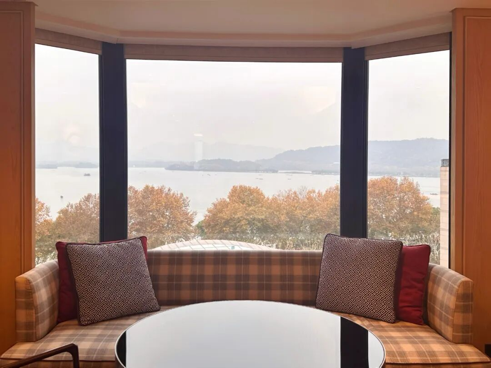

杭州和上海一样，

其实也是个移民城市。

如今杭州会说杭州话的，

要比上海能讲上海话的还少。

但你问我这样出生在上城区巷子里的杭州人，

三代以前是哪里的，

其实也都不是杭州的，

比如我家就是绍兴的。

近十年来杭州天天被吐槽美食荒漠，

要我说，也只是近十几年西边

大公司涌入了大量移民，

时间太短，除了贵价杭州店

和预制连锁餐厅之外，

还没有形成任何一个主流的美食流派。

时间太短了呀，你看就连深圳

这几十年来也没形成什么好吃的。。。

终于近年有了椰子鸡和湖南菜hh

所以去杭州，

还得像老底子外地人民打开杭州的方式一样，

去看西湖边密密麻麻的名人故居。

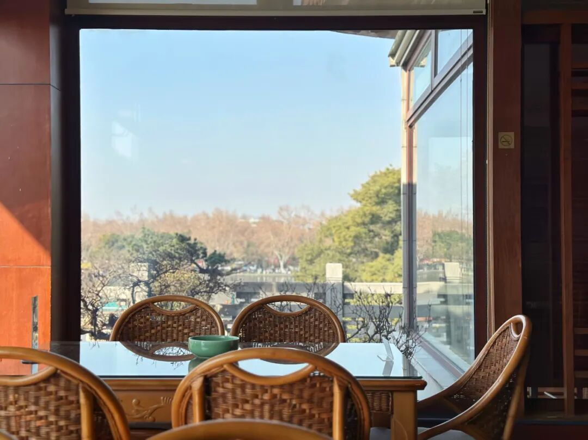

比如湖滨最繁华地带的园林，

以前是大商人黄楚九的私宅，

龙虎人丹和上海大世界都是他创办的。

如今是杭州市政府的国营茶馆。

你看这有钱人家的露台风景，

看上去就是美貌无比。

价格说高不高说低也不低，

最低 280元/位，

有茶和无限续的水果零食，

山核桃相当好，是正宗临安货，

（倒确实也没有我们的好

市府接待吃的也是同款，

所以他家喝茶最舒服。

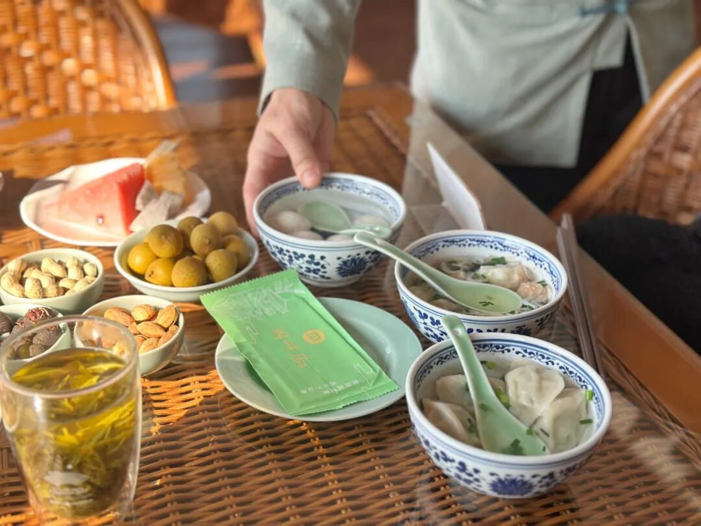

点心也含在套餐里，

有厨子现做的小馄饨和定胜糕：

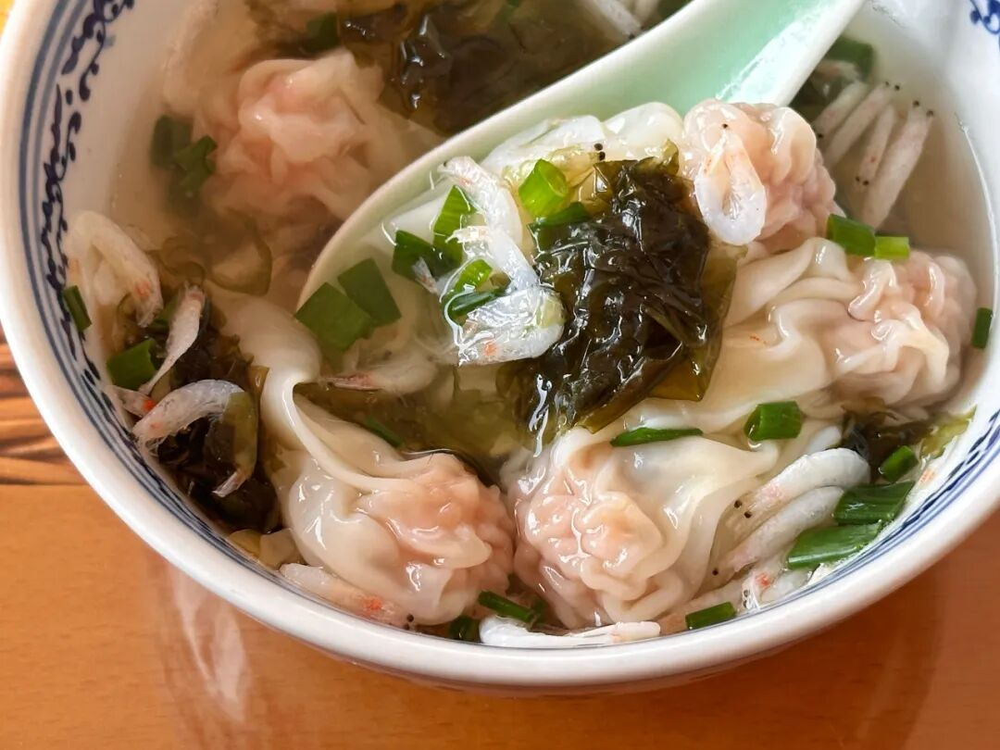

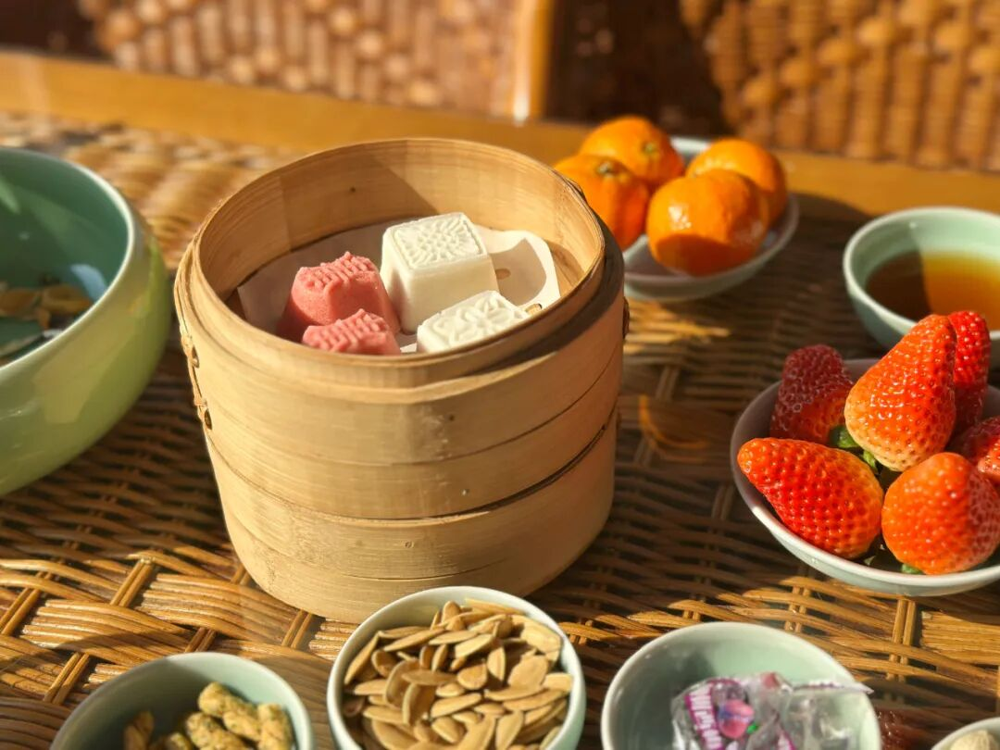

尤其是他们家茶叶蛋，

一锅老卤足足茶叶，真得香。

小时候我们都得在巷子口

老太婆的煤饼炉上才买得到。

现在想吃这一口，居然还得到这里来。。。

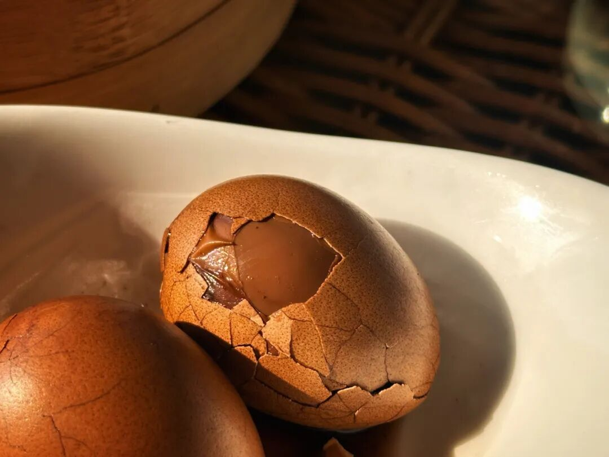

出了湖畔居，

可以沿湖滨、北山路一直散步到新新饭店。

很多游客走到断桥即止步不前。

实际上，一路往新新饭店。

过西泠桥去一次孤山和西泠印社，

也才是一路听得到杭州话的路线。

傍晚时的孤山绝美。

对面新新饭店当年大概类似上海和平饭店，

贵宾名流云集。

现也仍是国营饭店，

不过我不推荐住就是了。

住宿，以前我一直沉迷于

西湖国宾馆的 1 号楼。

你看，房间就是这么老干部风。

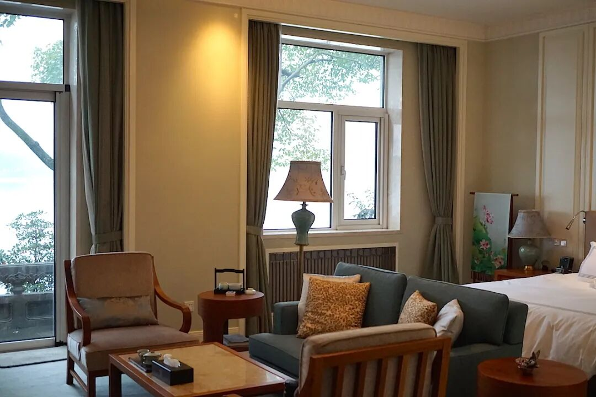

但是窗外小小露台，

伸手一尺就是西湖，而且难得是安静。

国宾馆庄子大，紫薇厅做杭州菜好吃，

我们也都是知道的。

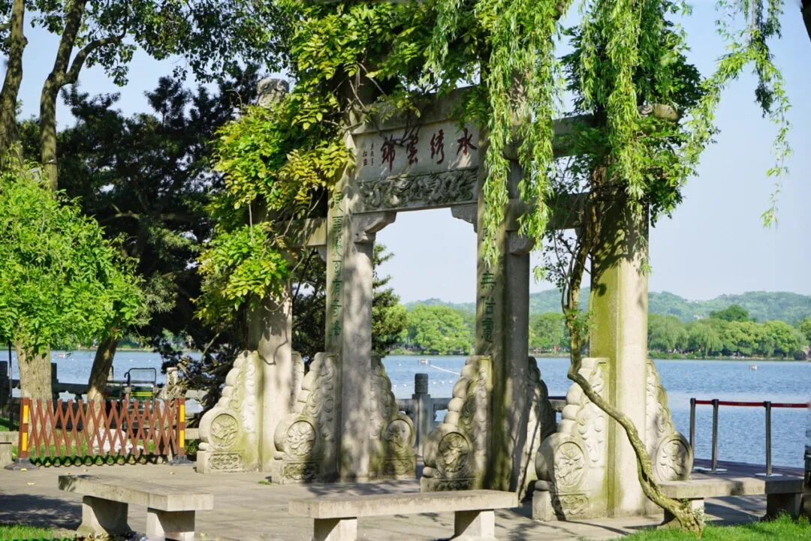

其它国宾馆比如雷峰塔下西子宾馆，

我也住过。

园子是真美，餐厅也好吃。

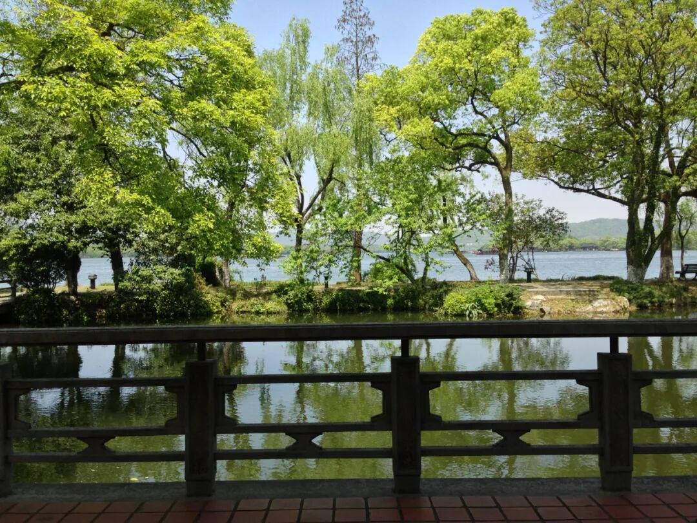

就是湖景房离公共湖区太近，

一大早就能被划船的游人笑醒。

其它如柳莺里、大华饭店也是类似的问题。

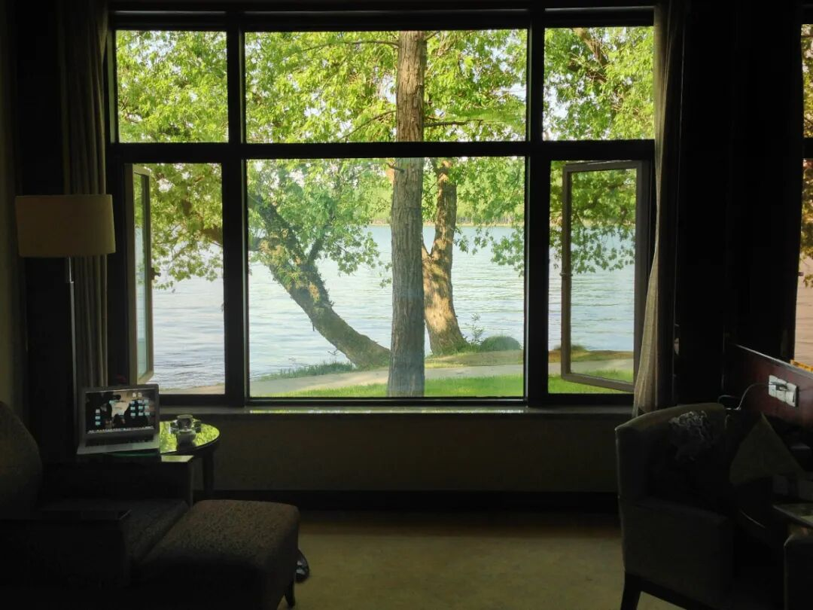

这两年我偏好住湖滨君悦的嘉宾轩。

住了两次，入住时前台就会自动留

八楼正中的这一间客房。

有这样的一窗无敌湖景，美如水墨，

简直不想出门。

住君悦有一点好，

走 5 分钟，就有一家杭州家常菜馆菲乐，

开了 26 年，至今也多为杭州顾客。

一般我只点三个菜：

醉膏蟹，他家酱油加糖醋姜末的水淋淋腌法，

是杭州家常手艺。

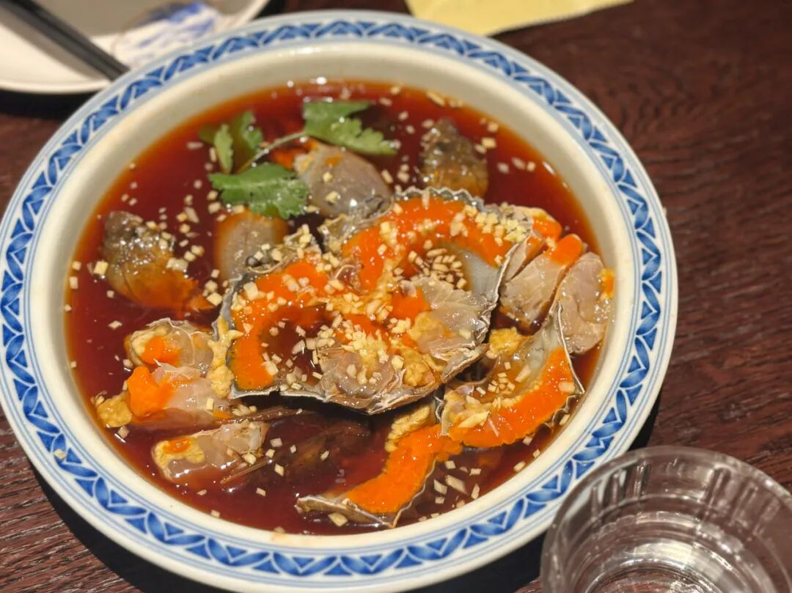

菜梗炒猪肝，

就要外面馆子大火爆炒出香嫩猪肝，

带着锅气的甜甜冬天小青菜，

一般店里吃不到。

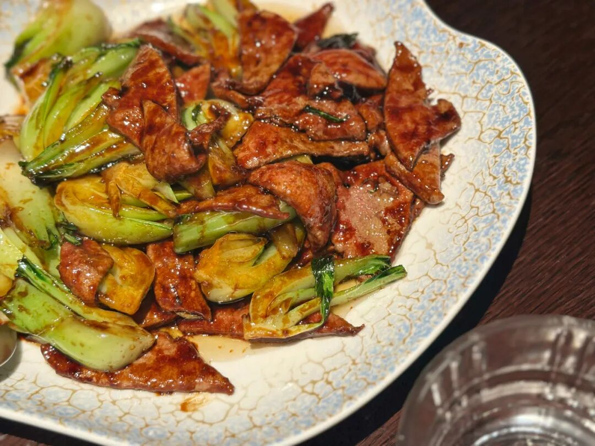

梭子蟹番茄豆腐煲，

他家发明的家常菜。

我自己都会做：菜场梭子蟹切块油煎煎，

这油再炒带皮番茄出沙，

把蟹块放回去再放一盒切块的内酯嫩豆腐，

讲究点再加点天目笋干，

以前转塘汽车站老太太挑担下来卖的，

加一大锅清水煮开即可。

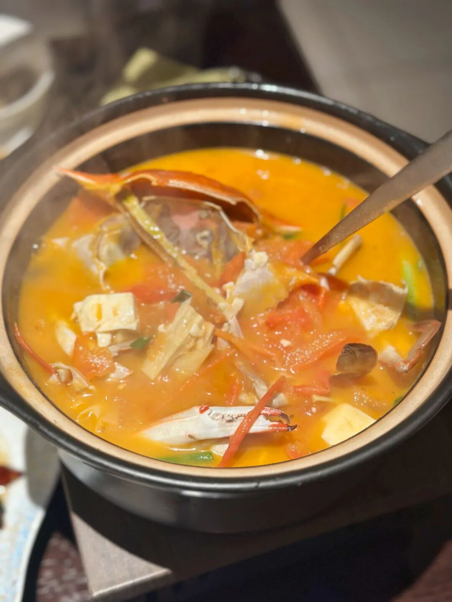

杭州就是这点家常小菜翻花样的路数，

你可千万别没事点什么西湖醋鱼炸响铃，

预计不会满意。

至于楼外楼，很多人不知道，

楼外楼有四楼，

每层楼的厨子都不一样。

一楼二楼劝大家千万别去吃，

早就预制菜了。

20 年前我上大学就会带楼外楼同款超市预制菜，

现在游客去也吃这些啊，何必呢。

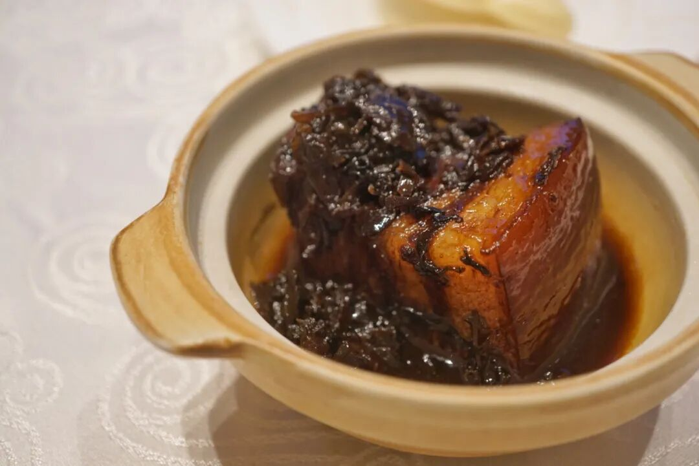

三楼全是包厢，菜都是现做的，

也基本都是杭州顾客，

喜欢订来做家宴。

四楼一般只作接待不开放，

我几年前沾光吃过一次，

那可真的是杭州菜科班大师的烹饪水平。

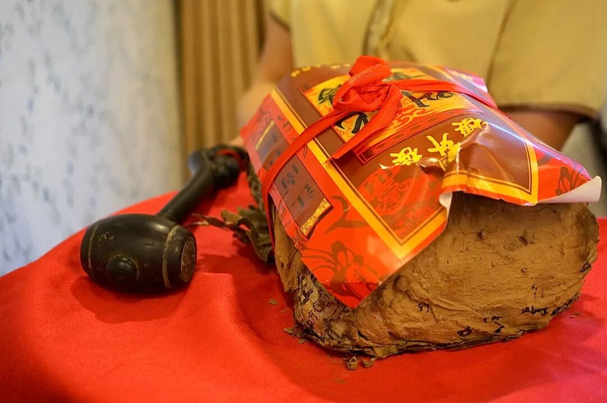

但一样是市府定点接待，

湖畔居坦荡全开放让市民订，

还打个旗号叫人民的茶楼。

（确实，哪朝代的大商人在这么核心的湖面垄断一块，都很夸张

楼外楼就不行。

不信你看，这四楼风景老钱不？

嘻嘻嘻。反正大家没事别去就行了。

好吃的杭州菜馆，

我还是推荐去江南驿排排队。

老板兼大厨十几年如一日地精进厨艺，

真挺厉害，

是整个包邮区都绝对值得一去的小饭馆。

他家菜我推荐四个。

第一个是酱三门青蟹，

调味颇丰。

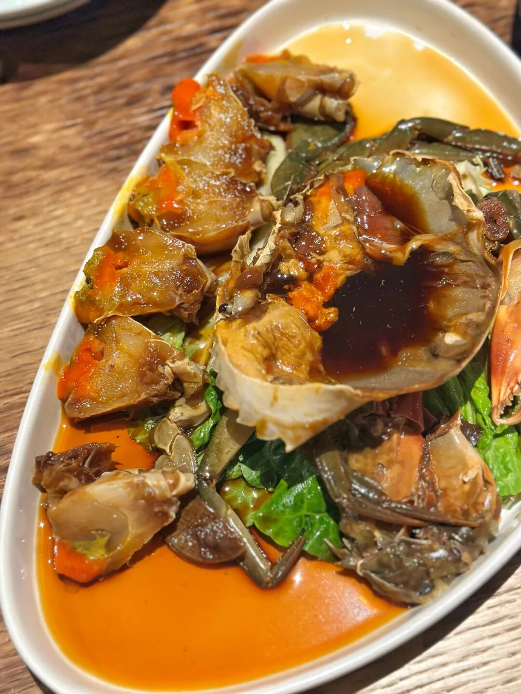

第二是蒸鱼。

首选青花椒蒸白水鱼，

这鱼肉质细嫩但土腥味大，

要做得好非得店家秘制蒸鱼调味。

江南驿这条，和上海顺意蒸的，

是我在整个包邮区吃过无数白水鱼里最喜欢的。

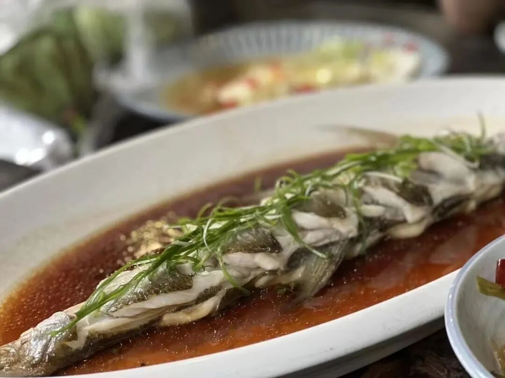

如果卖完了，

试试这条肉饼蒸鳜鱼。

千岛湖水库大鳜鱼，

是我认识的淮扬和广东大厨都盛赞的食材。

虾酱发酵轻腌肉饼，

配上一条条香喷喷的葱，

我们两个人吃了三碗米饭！

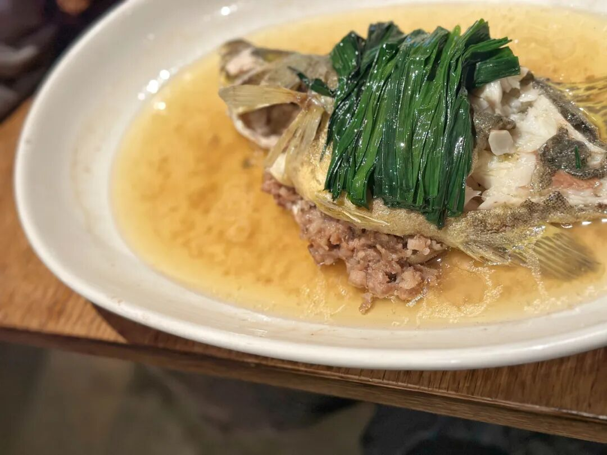

第三就是经典的椒麻鸡了。

现做手撕走地鸡，

椒麻调味浓郁又清爽，

十几年前还显家常，

现在一口就知是大厨功力。

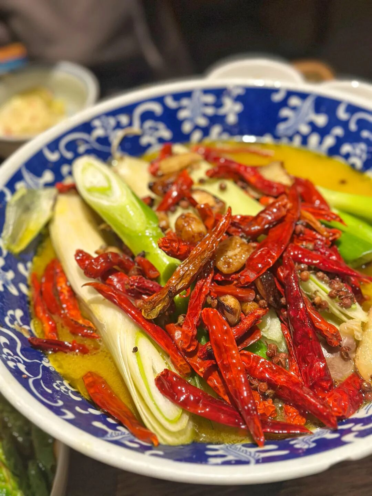

他家是真不放一粒味精，

就是靠老板一天天地精进厨艺磨出来的调味。

第四款酸辣包心菜，

酸辣酱汁极为入味又清甜，

十几年的老菜了，

国际厨艺流行的发酵概念人家当年就在玩，

着实有点东西。

最后呢，临走推荐去方老大老店排个队，

非饭点去排起来快。

他家就是浇头现炒加一口老卤加碱水面，

高盐勾火爆炒，香得不得了！

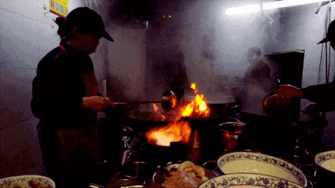

这个茄汁拌面是我离开杭州读书后

才发明出来的。。

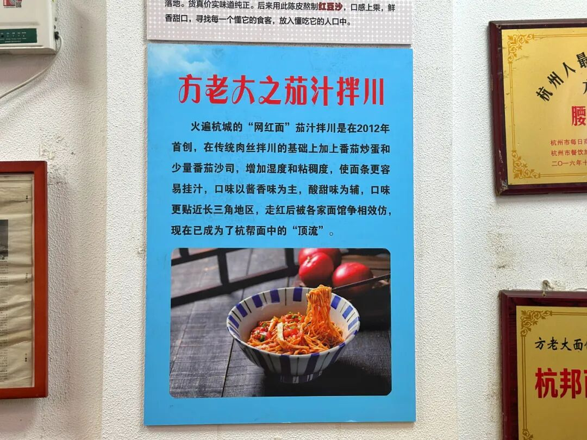

除了真的非常非常咸之外，

就是很汹涌，很香，很好吃。

推荐家常的炒腰花浇头，要双份！

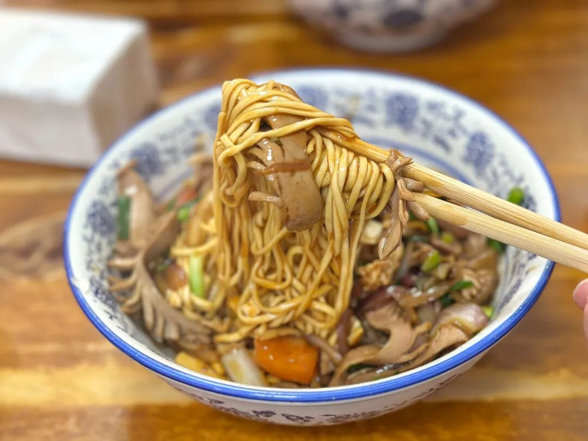

虾爆鳝他家不行，炒得焦糊糊的。

米其林评委还推荐陈皮大肉，

就是加了陈皮的大块东坡肉，

我试了下感觉太油腻，

似未煸炒走油，不推荐。

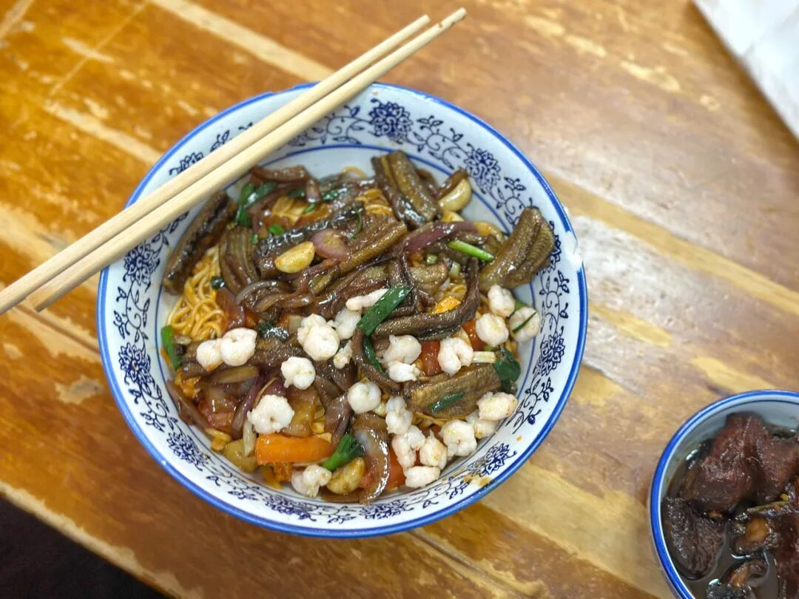

东坡肉，还是要去吃西湖国、

西子宾馆两家中餐厅的梅干菜蒸版本，

是真的肥肉一点不腻，

一次能吃掉一大方！

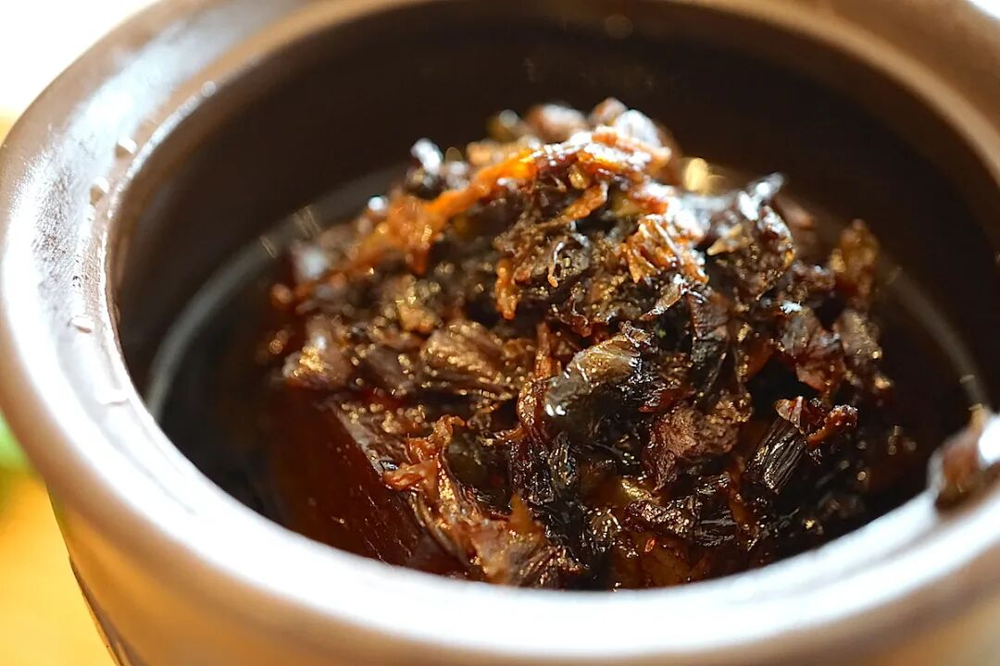

杭州就是真的美。

希望每个人都能在杭州

拍到自己的年度风景照片，嘻嘻嘻

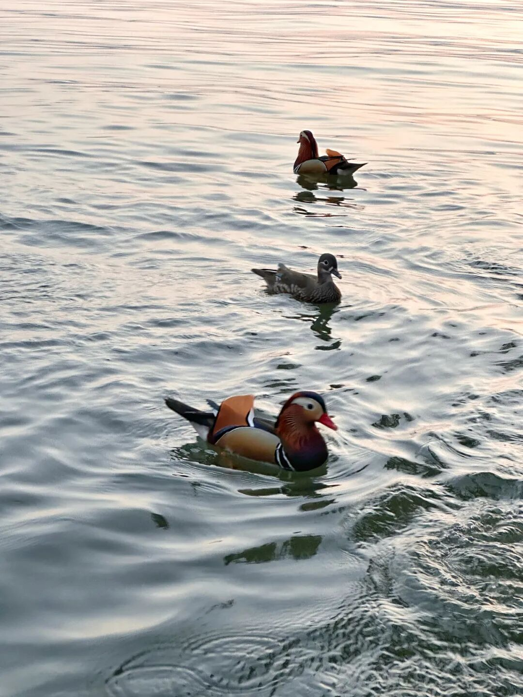

题 外

欣赏完老板的西湖摄影集，

轮到我薯角敲锣打鼓啦！

千呼万唤的饱记年货礼盒，

天🐱有赞同折扣！

限时单盒立减 58 元！

双盒立减 126 元！

今年冬天的富平柿饼现货中！

新年限时 85 折！

一年只此一季的文昌老母鸡，

限时闪购 86 折！

只剩最后 2 天！

很厉害的海鲜礼盒，

舟山渔场野生海捕，

也有新年限时 86 折！

其他适合空调房吃吃的水果看这里👇

难得一寻的蜜蜜甜冬日葡萄，

拿过金奖的上海白鹤红颜草莓，

来自广西融安的脆蜜金桔。

足以颠覆自小到大的金桔风味印象！

还有今年份的象山红美人，

入口似果冻般嫩嫩滑滑～

现在都有限时 9 折！

此外刚补货的 75% 木姜子黑巧克力，

90 天短保质期的大师凤梨酥，

还有刚补货新到的饱记腊味们，

也都有限时 9 折冲冲！

饱记·年货礼盒

单盒立减 58 元

双盒立减 126 元

戳图下单购买👇

饱记·富平柿饼

购买方式如下

年货节限时 85 折！！！

戳图购买👇

饱记·海南文昌老母鸡

26 号起按顺序发货！

限时早鸟 86 折！！！

戳图购买👇

饱记·2025 海鲜礼盒购买方式如下限时早鸟 86 折！！！

戳图购买👇

饱记·冬日蜜蜜甜葡萄

限时 9 折！！！

新年紫气东来！！！

戳图购买👇

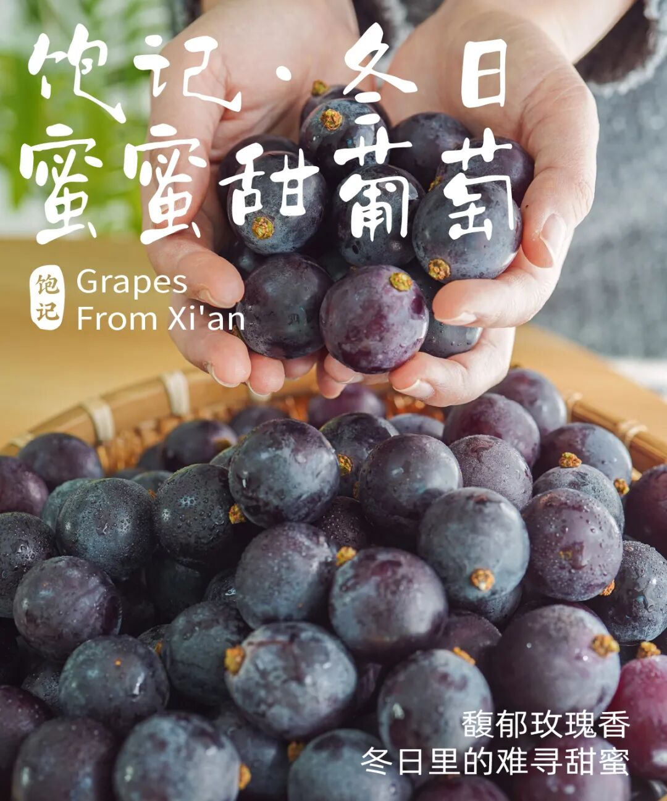

饱记·红颜草莓限时吃水果 9 折！！！新年莓有烦恼！！
戳图购买👇

饱记·融安脆蜜金桔限时吃水果 9 折！！！新年大桔大利！！！
戳图购买👇

饱记·象山红美人柑橘限时吃水果 9 折！！！
戳图购买👇

饱记·新鲜到货凤梨酥

限时 9 折！！！
戳图购买👇

饱记·云南木姜子75%黑巧克力

购买方式如下

限时 9 折！！

戳图下单购买👇

或🍑🍑🍑搜索

「艾格吃饱了」

饱记·手工腊肠

购买方式如下👇

限时全年地板价

戳图下单购买👇

或🍑🍑🍑搜索

「艾格吃饱了」

饱记·玫瑰露酒腊肉&腊排骨

购买方式如下👇

限时全年地板价

戳图下单购买👇

或🍑🍑🍑搜索

「艾格吃饱了」

本文的研究员

闻 佳就是那个研究院嘴里「挑剔的老板」。关于食物，不是比你懂得更多一些，只是比你花了更多的冤枉钱。

用好吃的方式吃一生

祖国各地好风物

文章转载请加微信「baojiclub」

