# 天山脚下的绿洲，挂满小糖包

- 原文链接: https://mp.weixin.qq.com/s?__biz=MjM5NTYxODQyMA==&mid=2653454899&idx=1&sn=0f626e853e7b55e4456f9102ae0f26cc&chksm=bc7ca2624d6204f4250457c8f6f41bbce81d8cb2950e3b963cfc82877e7ca7d0d45dbdd5ec88&scene=27#wechat_redirect
- 浏览量: N/A
- 点赞数: N/A
- 评论数: N/A
- 转发数: N/A

## 正文

一个杏子一包蜜

一个尽情安利自我的公众号

以下是没事干研究院的风物研究报告请放心食用

大家好，见字如晤，今天寄送一张迟来的出差明信片！（我的打工速度：平邮

还记得小时候曾沉迷于《七剑下天山》，
前阵子尾随老板到新疆，终于见到天山本山，
怎么……光秃秃的！

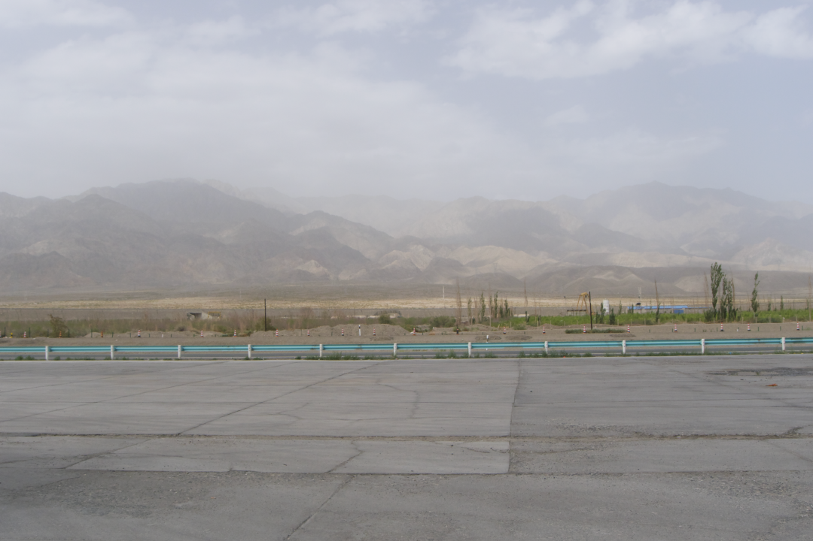

沿着苍茫山脉一路开过去，
就到了小白杏的核心产区轮台。沙土被远远甩到身后，眼前是一片绿油油的密林～此前此景，让我不禁感慨：这不得吃晕过去？

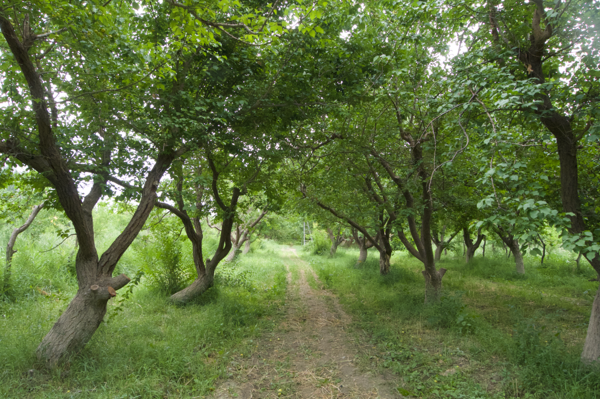

眼下正是小白杏成熟时节，果子挂了满树，林子里到处是浓郁的杏子香气，有点像......踢翻一桶刚酿好的蜂蜜？

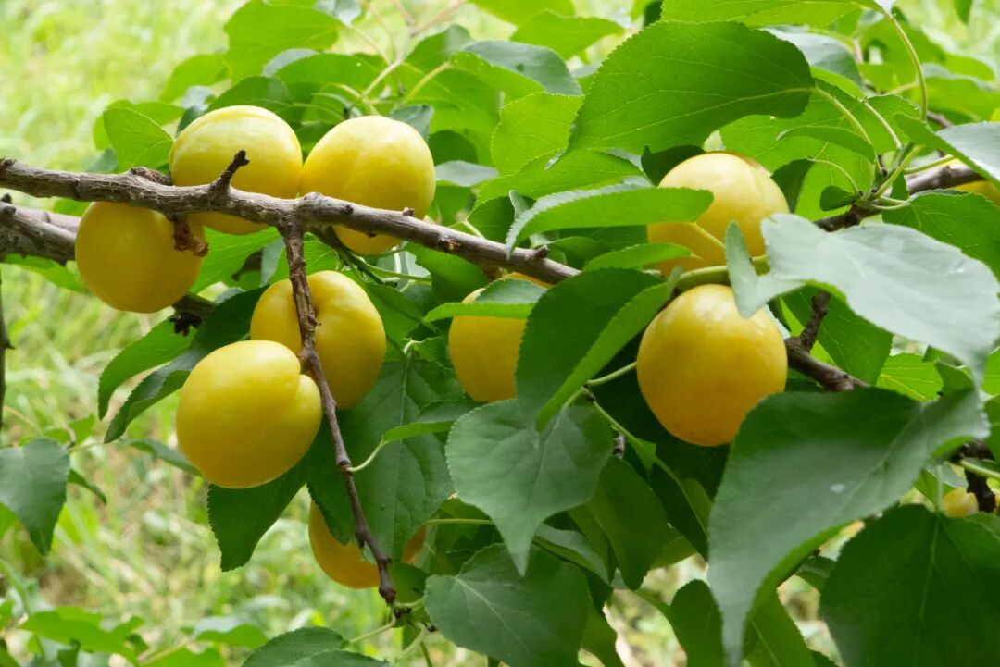

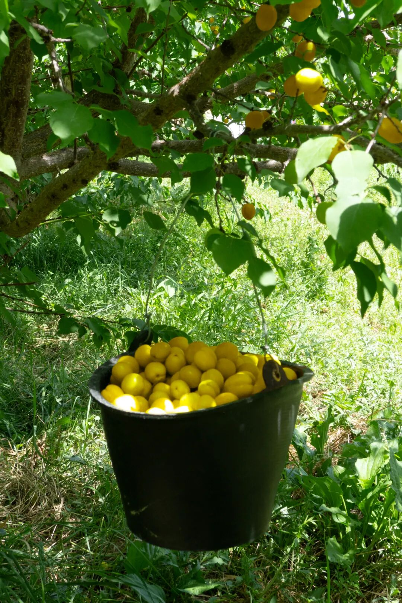

当地朋友说，这里是天山脚下的绿洲，山上每日都会下雨、下雪，
融化的雪水自山顶流下，汇成暗河，
于是灌溉了一片土地～

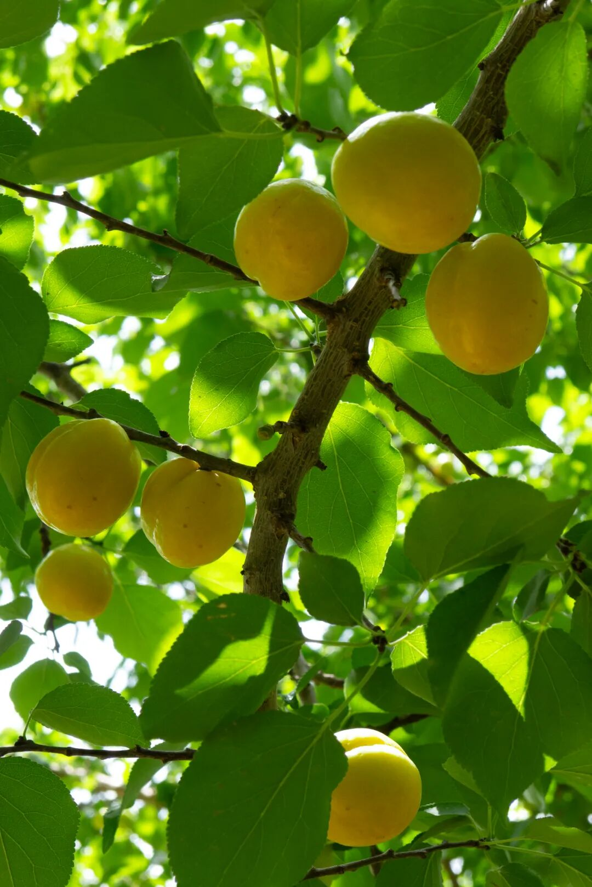

再加上白天热冒汗晚上暖宝宝的昼夜温差，
产出的小白杏，浓甜有滋味，
皮薄！肉厚！汁多！每一颗都是晶莹小糖包：

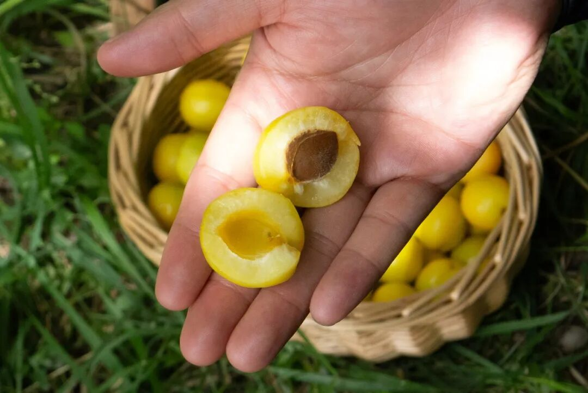

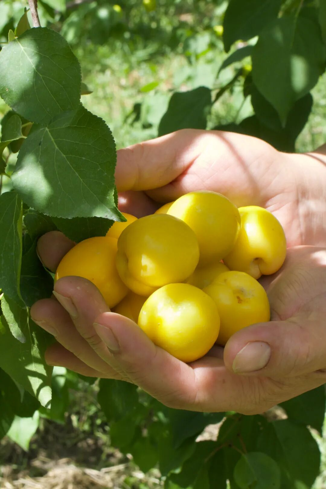

本薯在林子里边摘边吃，
顺便帮大家视察了一下今年的果子长势！圆润得很！就是果季短！再吃几天就要没了！

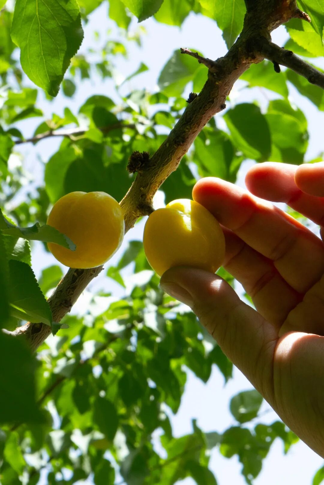

种植大哥说，这些杏树几乎都是两千多年来野生树种，

这两年才有些种植管理，

因为自然条件得天独厚，

随便长长就甜香得不得了！

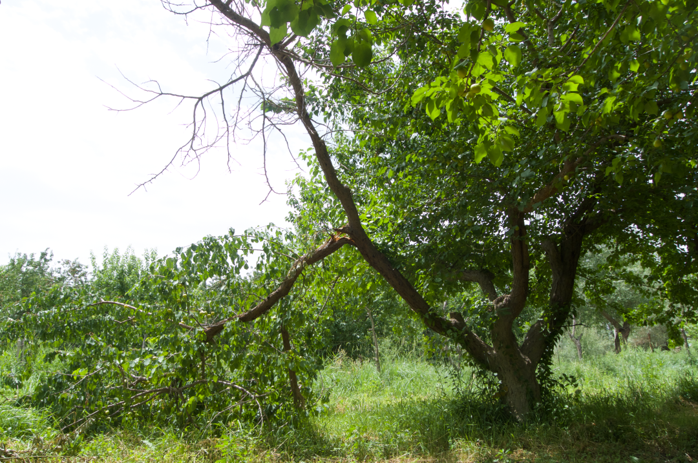

（靠天吃饭吧也有一些风险，前几天刮大风，这棵树就被吹折了
摘好的果子交由阿姨们精心拣选，饱记的标准是一箱里分三个熟度，三分之一是树上完熟的，拿到就赶紧吃，香软，蜜蜜甜，糖度能达到 19！剩下的分别是黄中带绿的和偏绿的，常温下放两三天！不要进冰箱！

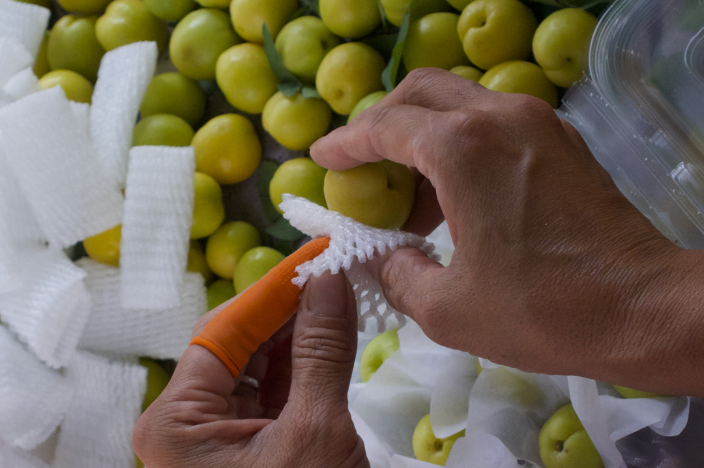

要不说轮台的小白杏有名气呢～之前试过很多其他果园的杏子，摘下来放再久都甜不了～

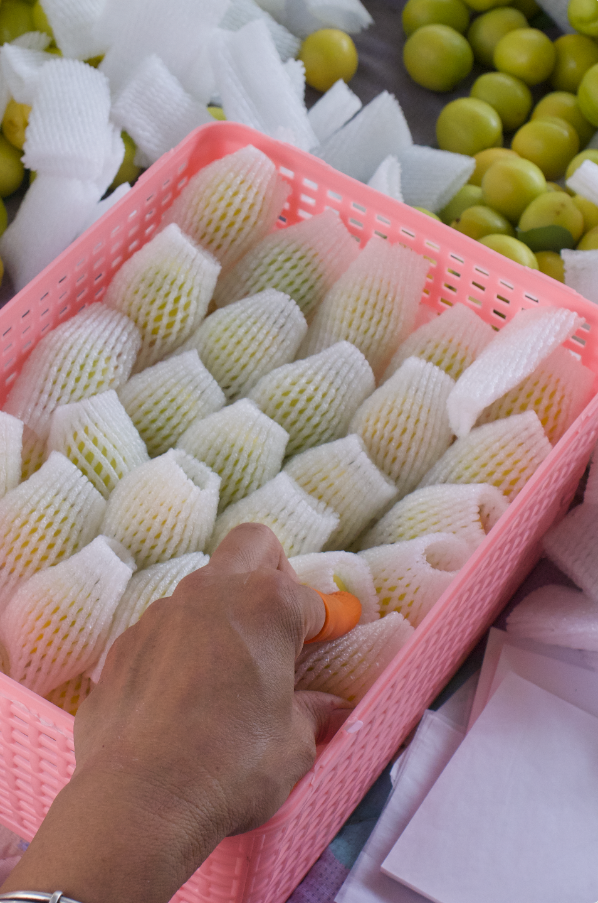

那天阳光很好，种植大哥变魔术似的，转头掏出包装盒，现摘现挑了一箱饱记小白杏让我们拍，不忘提醒：欸对对对，就是要这样影影绰绰～（摄影师：哥，咱俩换工作吧

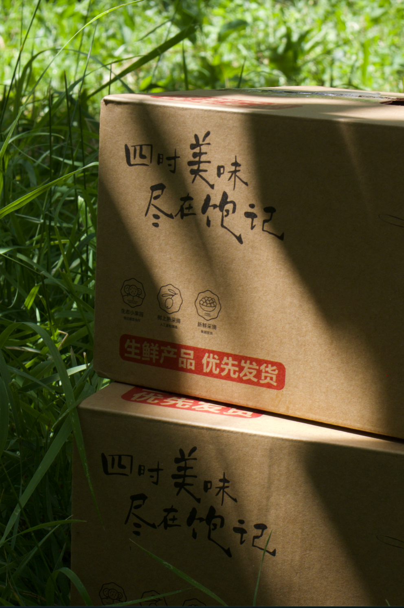

所以，你们吃到的和我在树下吃到的，
没有任何区别！！

说不定还会买到一两粒本薯摘的？？

（油腻发言：怎么样心动吗？

时令不等人，再吃几天就没啦～

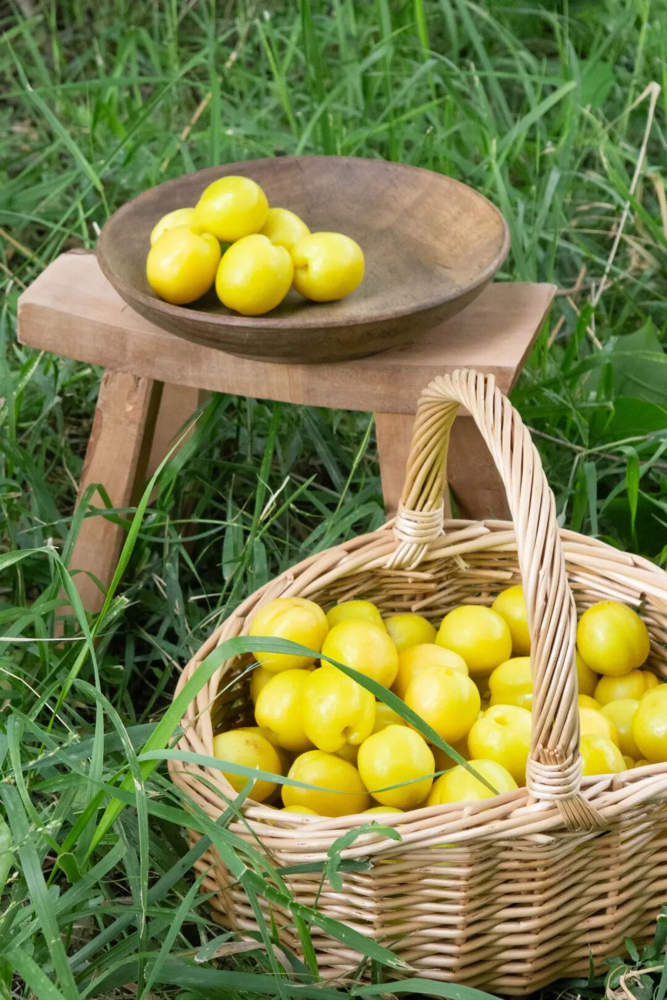

最后附赠一张采摘大哥的满分摆拍！

这里的人和杏子一样甜嘻嘻～

下次还来！

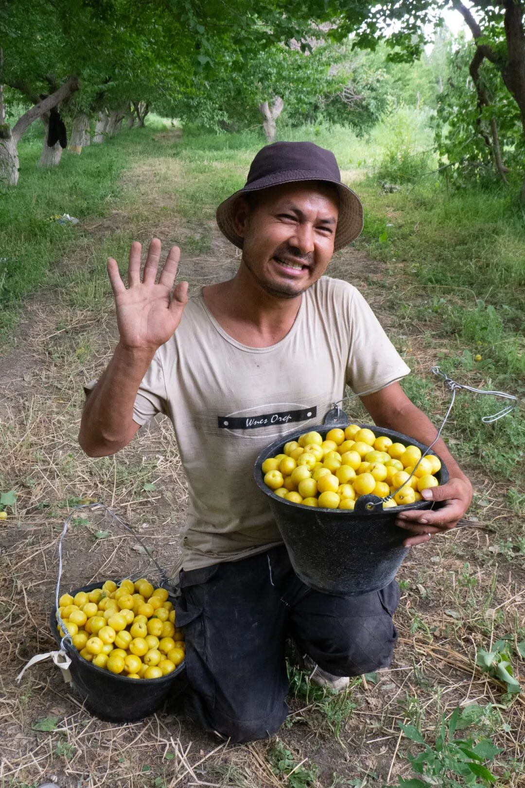

饱记·新疆轮台小白杏购买方式如下👇现货 86 折！！！！
小白杏众多，

我司只选核心产区轮台长大的，

因日照时间长、昼夜温差大，

酝酿出了浓郁的甜。

皮薄，肉厚，

还有珍贵的、蜂蜜般的香气！

咬一口就尝得出区别！

都是树上熟！！

且可能因为有补贴的关系，
全部选择顺丰空运，每份运费才 17 元！！
（比飞我的运费便宜了百倍hhh
大部分地区两三天左右送达！！

吃它！！

戳图买它！！！👇

题 外

同样矜贵的还有！六月以来后台被问了八百遍的，饱记·仙居东魁大杨梅
终于要熟成啦！！

产区正宗，个头大，果味浓。

包邮区顶流名不虚传！尝过便知！
饱记·仙居东魁大杨梅早鸟价！！86 折！购买方式如下
共有四种规格：优质大杨梅，单枚在 23-29g，两种重量可选，颗粒包装，2.3 斤装，共计 45 枚；4.6斤装，共计 90 枚。首次尝试充氮气调包装！更大程度锁住新鲜！甄选顶梅，6 斤篮装，个头稍小，但早熟、风味浓，很受喜欢。特大杨梅王，市面稀有、比乒乓球还大，每棵树上就一两颗左右，量少，2.7斤装，共计36枚，单枚在 35g 以上。
现在下单，21 日起按顺序发货！

戳图买它！！！👇

本文的研究员

薯角

我下天山，与你来见

用好吃的方式吃一生

祖国各地好风物

文章转载请加微信「baojiclub」

