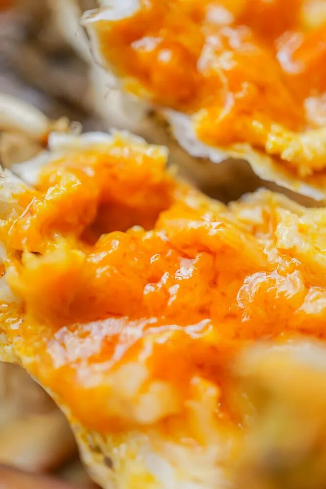
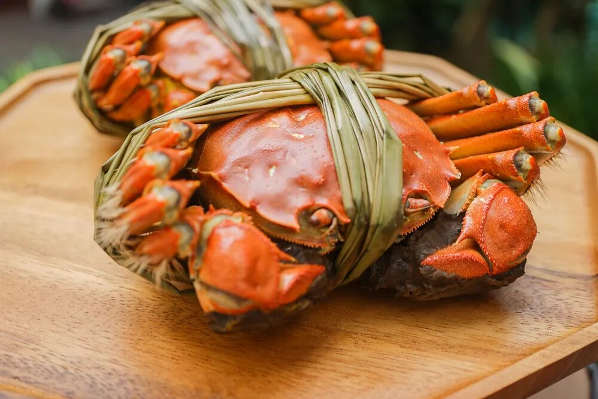
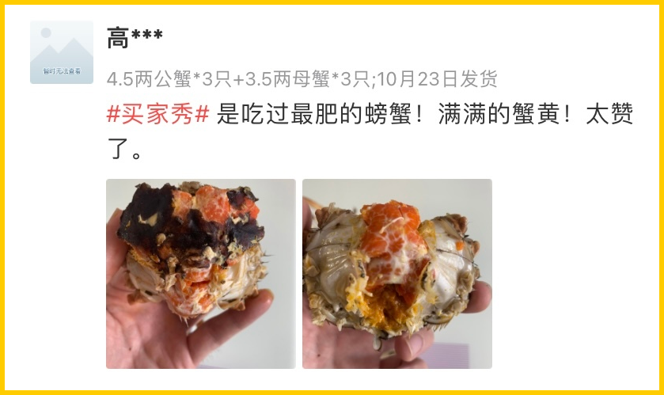
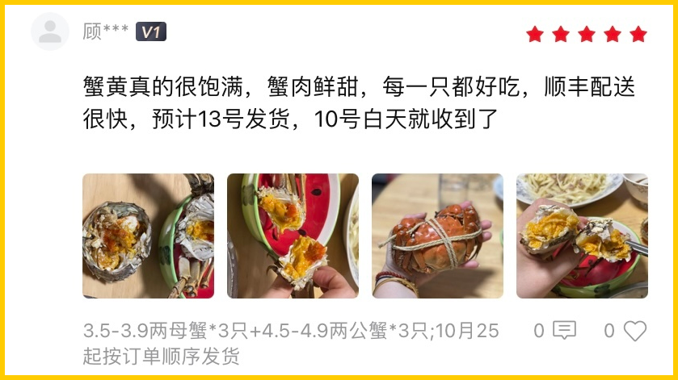
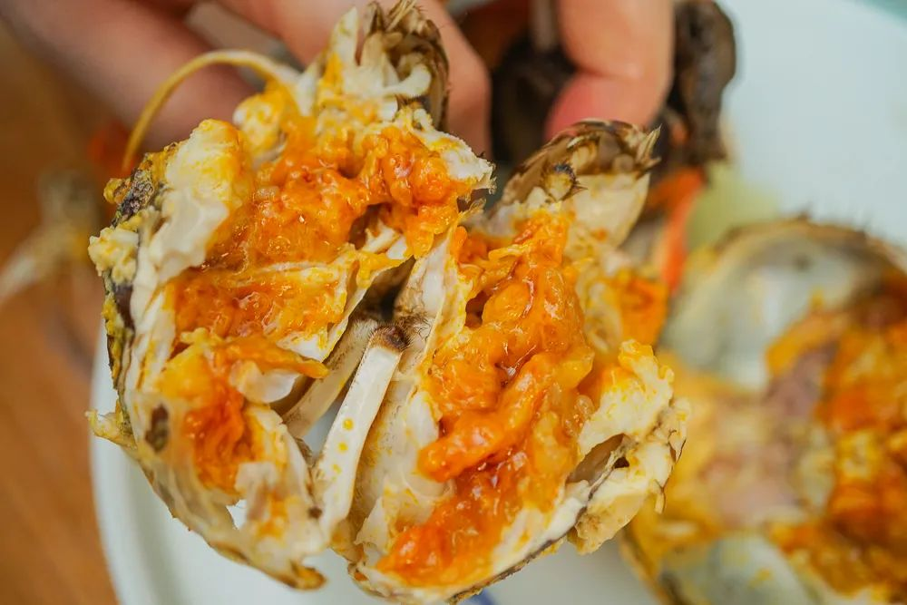
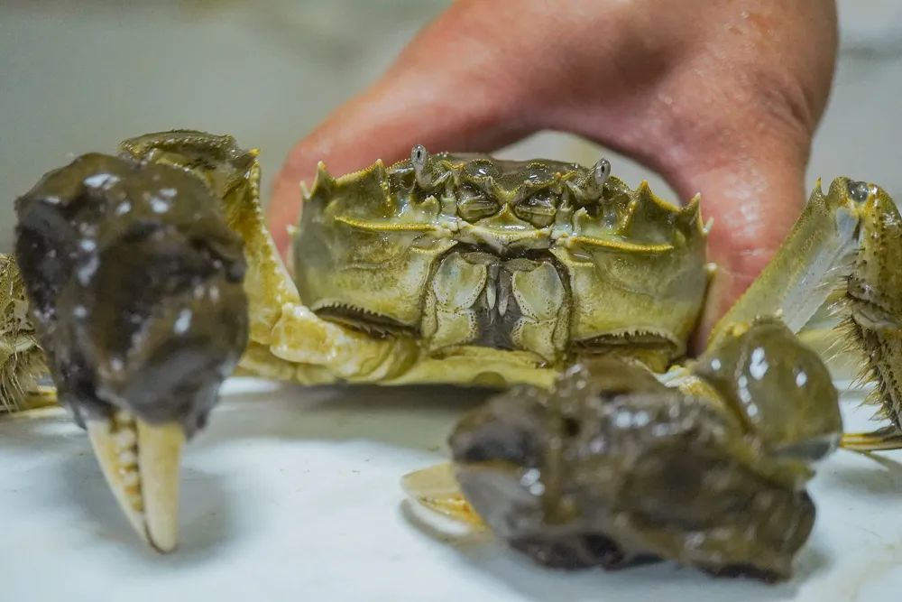
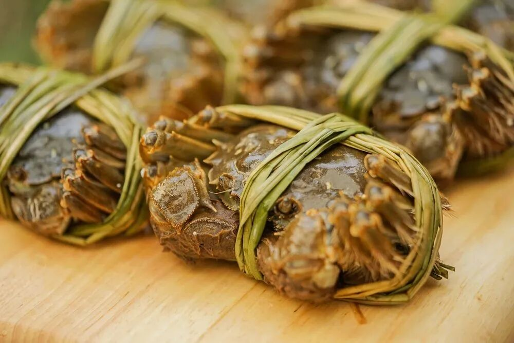
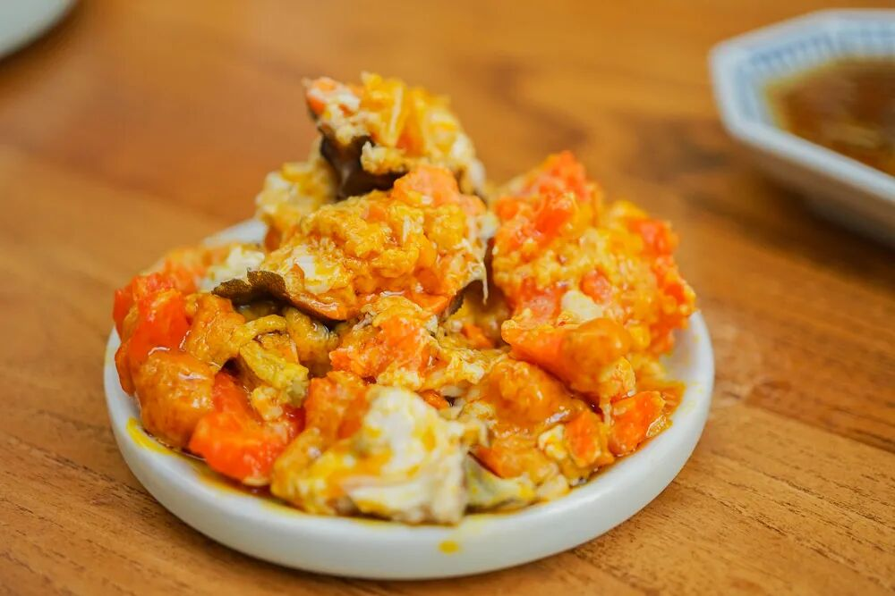
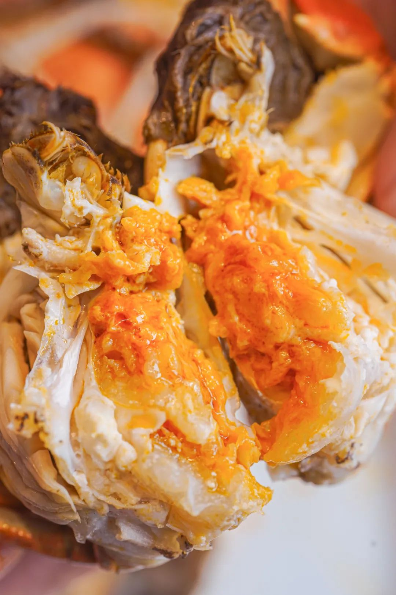
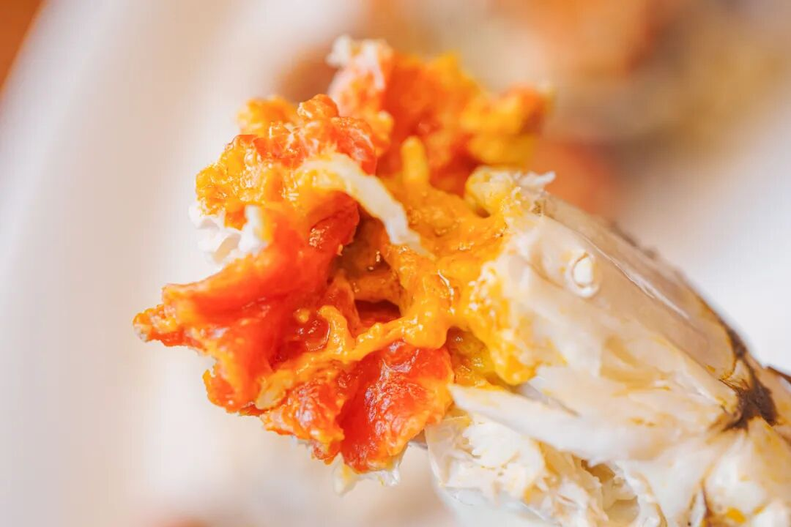

# 好吃不贵，啃起来不心疼

- 原文链接: https://mp.weixin.qq.com/s?__biz=MjM5NTYxODQyMA==&mid=2653462222&idx=1&sn=01f6394f0fb0bf0831495dd24043f91a&chksm=bcb09601fc0bf348bc00822379a8ac372d8a1d95f13724654a5a9f3d8095bdf91a444f99436f&scene=27#wechat_redirect
- 浏览量: N/A
- 点赞数: N/A
- 评论数: N/A
- 转发数: N/A

## 正文

吃点好的

一个尽情安利自我的公众号

以下是没事干研究院的风物研究报告请放心食用
每到冬天，薯角我只信奉一句名言：人不能白白活着，但可以白白胖胖地活着。

今天的卖货 KPI！先给大家伙儿整上一些性价比之选，贴贴秋膘过过瘾！最重要的是：价格美丽，啃起来不心疼！

看满屏的蟹黄黄黄黄黄黄…...
来自一个宝藏小众产区：淮安洪泽湖！总的来说就是，好吃！不贵！自家猛吃好爽！

🦀🦀🦀

1.性价比的王：

洪泽湖大闸蟹！

🦀🦀🦀

比起阳澄湖动不动近 200 元一对，且货源真假难辨，洪泽湖不仅价格更美丽，
品质也都稳定靠谱多了！

自己说不算，后台的真实好评奉上啊👇

又称为「贵客比我会拍」系列，随手一拆就是满膏满黄！（谄媚脸

洪泽湖大闸蟹，主打一个「鲜」字！

吃起来自带微咸，

蟹味是汹涌的鲜浓。

推荐搭配镇江香醋，把鲜味简单钓出来，就很香很香很香很香很香！

为啥呢？因为洪泽湖本身湖大水深、风高浪急，（不查不知道，一查竟在中国五大淡水湖里排第四位！所以这蟹生存不易，

基本上是半野生的状态。

图源@洪泽政府网
其实每个湖里都可以有好吃螃蟹，
最关键还是得挑！

我司专门委托的挑蟹佬，

一辈子都在与螃蟹打交道，

看一眼、摸一摸就知道这蟹好不好。

合作伙伴同时供货上海国营大酒店，

是行业内专业人士认可的货源！

但饱记要的发货品质比酒店还要更好（骄傲脸

只要湖里顶尖蟹的前 10%。

挑完了，还有至关重要的一步：上岸吐苦水！

不急着发货，

上岸了再精养两三天喂喂玉米，

让螃蟹把苦水都吐出来，

这样你们收到后吃起来就只有鲜和甜！

总之，溢价少，肉质好，性价比高。在苏北蟹里，品质更高，规格更大，口碑更硬。

死蟹我们是绝对不会发的，吃了少说也会拉肚子。今年增加了很多包邮区外的客人，也跟大家嘱咐一嘴啊！第一收到怎么判断螃蟹还活着呢？就是戳它的眼睛！哪怕是在冰箱冰过，只要眼睛动了就还活着！

第二螃蟹必须带着绳子去蒸，要不然它会在锅里挣扎，然后断腿的地方就会流出很多精华，
这个就太可惜了！！

啊啊啊啊啊啊啊，这种可以把蟹黄挖出来堆成一座小山的快乐，希望大家都能体会！

虽然双十一过完了，但薯角我给大家薅来一个限时三天的周末 88 折！（快夸我快夸我快夸我现在买更划算，
趁螃蟹肥，大家抓紧吃啊！

饱记·洪泽湖大闸蟹购买方式如下👇限时三天 88 折
戳图下单购买👇或🍑🍑🍑搜索「艾格吃饱了」

🦀🦀🦀

2.送礼请客两相宜：

太湖流域精挑

🦀🦀🦀

但如果你还有一些送礼请客需求，就看看苏南标杆美味太湖流域大闸蟹吧！即使在包邮区也都横着走，拿出去体体面面没在怕的！
毕竟连上海老牌吃蟹国营大店王宝和也说

自己的蟹是「太湖流域」

一个热知识：大闸蟹分两种——湖蟹和塘蟹，

湖蟹是在天然湖泊中围网养殖，

塘蟹是在人工水塘中养殖。

味道根本比不了。

很多米其林黑珍珠餐厅也都因为阳澄湖禁养，

在用各个流域的蟹，

比如金湖，「太湖流域」等。。。

（因为真正的太湖湖底也禁养了

为什么不追赫赫有名的「阳澄湖」呢？

原因很简单，

阳澄湖不给养啊。。。

现在很多自称阳澄湖的，

其实都是岸上塘养的，

虽然有标，但根本就是塘蟹啊。

我司这蟹在指定的 3000 亩湖里长大，

活溪入水，清水整湖放养。

湖底与阳澄湖底类型近似👇

所以不容易有土腥气！

蟹肉、蟹黄

吃得出明显的清甜滋味。

关键也是得人工精挑！

饱记只要最优秀的前 10%！

我司的信誉有盛泽当地村里的书记保证！

为了给村民谋福利，

书记不时就去帮咱们亲自视察和监督，

大家现在看到的和最后收到的没啥区别！

「每一只都要挑选，确保万无一失」。

（书记原话👆

和洪泽湖一样，

上岸的螃蟹，还会再养几天！

喂一喂玉米，

让螃蟹把苦水都出来，

才给大家发哦！

这样收到的螃蟹蒸出来就是甜的！

不苦不腥！

虽然成本又上去了呵呵。。。。。。

卖了这阵子，

除了少量死蟹，

（签收时联系客服按只赔付

没有风味上的差评！！

什么蟹王府、王宝和，老板通通试过，

真的不如我们嘿嘿～

老板朋友让她鉴定某品牌蟹她的回复👇

这阵子正是一年里最肥的时候，

新增 6 只装，

帮大家把价格也打了下来！！

再给一个限时三天 88 折！

虽然自家一直吃还是会略心疼，

（这得啥家庭啊。。。

但送礼请客就显得咱都大大方方儿啊！

（此处为东北口音

饱记·太湖流域大闸蟹购买方式如下👇限时三天 88 折
戳图下单购买👇或🍑🍑🍑搜索「艾格吃饱了」

题 外

大家好，

这个时节好东西不少（单押

双十一过后的心意返场折扣直接来！

不用凑单不用研究！

限时三天闪购的正宗海南椰子鸡，

终于回归的有小时候番茄味的云南西红柿，

坚持真材实料、天然肠衣的手工腊肠，
能做煲仔饭和火锅的玫瑰露酒腊肉&腊排骨还有打遍天下无敌手的山核桃！我司卷中卷产品，
拿到外面去都能打得很！具体你们看商详，最重要是还有些限时返场折扣再薅老板一回！冲！

饱记·海南椰子鸡

限时早鸟 86 折！！！

限时闪购三天！

预计 11.20 起发货

戳图买它👇

饱记·云南西红柿购买方式如下双十一同价 86 折！！
戳图购买👇

饱记·手工腊肠购买方式如下👇
三款口味，各有各的特点。用的黑猪肉、天然肠衣、玫瑰露酒...酒香腊肠，酒香浓郁，
有四六和二八这两个肥瘦比例可选。
滇式腊肠用了不少贵价的辛香料，同事说超适合拿来做西班牙海鲜饭，
试过加辣肠后升华了。
戳图下单购买👇或🍑🍑🍑搜索「艾格吃饱了」

饱记·玫瑰露酒腊肉&腊排骨购买方式如下👇
戳图下单购买👇或🍑🍑🍑搜索「艾格吃饱了」

饱记·临安山核桃

购买方式如下👇

戳图买它👇

或到🍑🍑🍑

搜索「艾格吃饱了」

本文的研究员

薯角送礼只送——

用好吃的方式吃一生

祖国各地好风物

文章转载请加微信「baojiclub」

