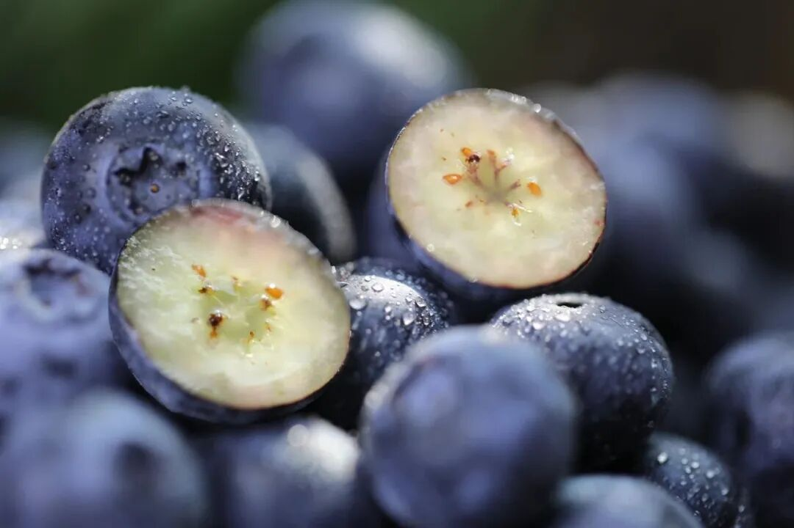
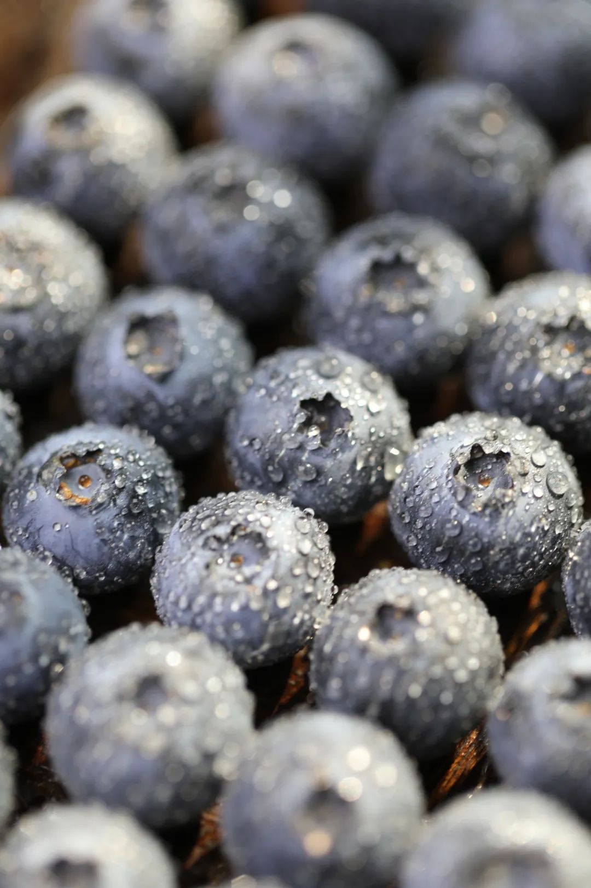
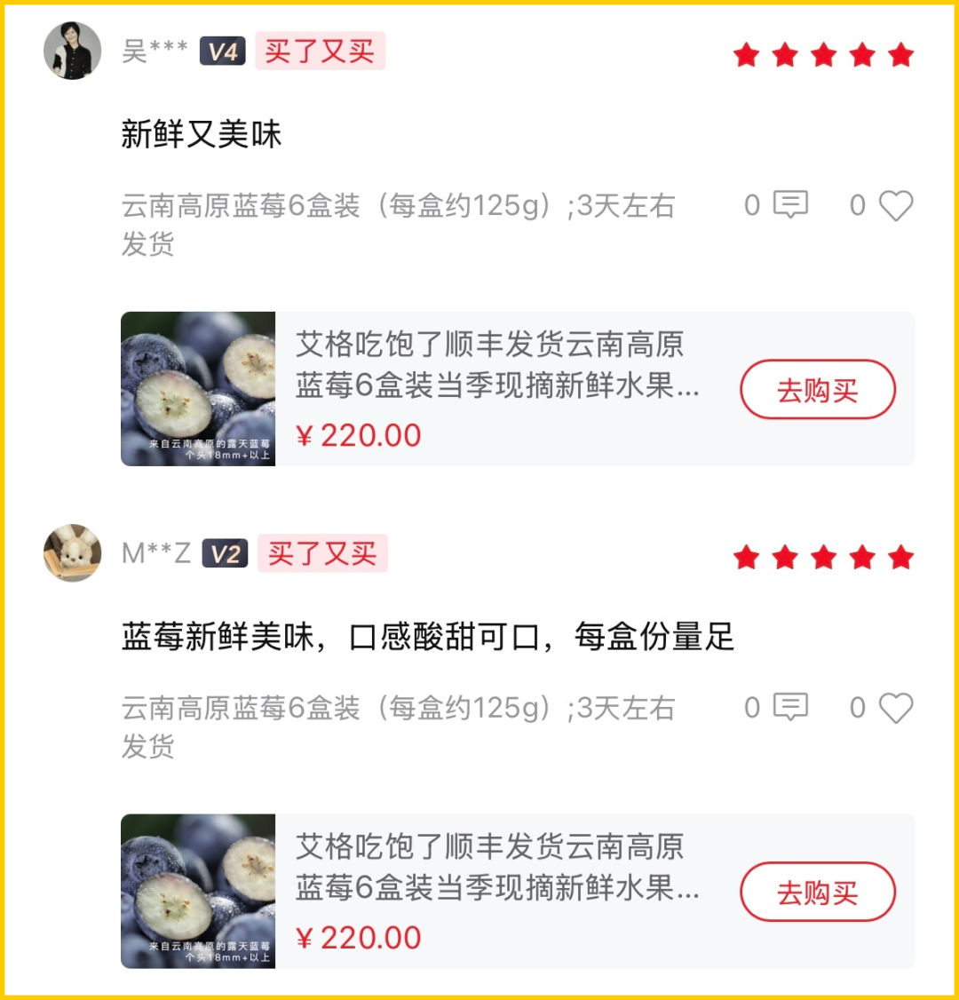
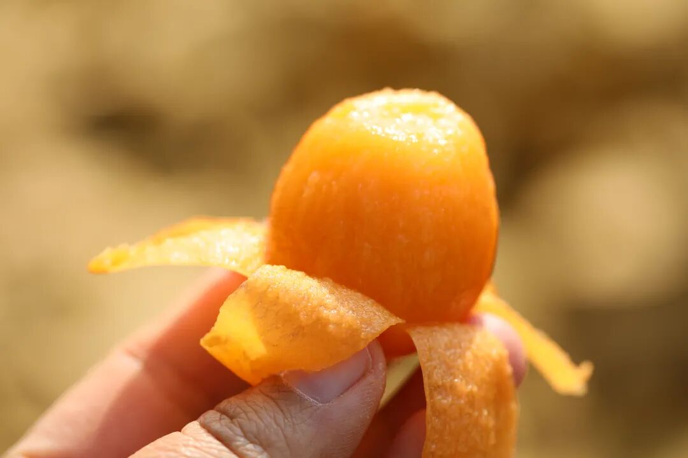
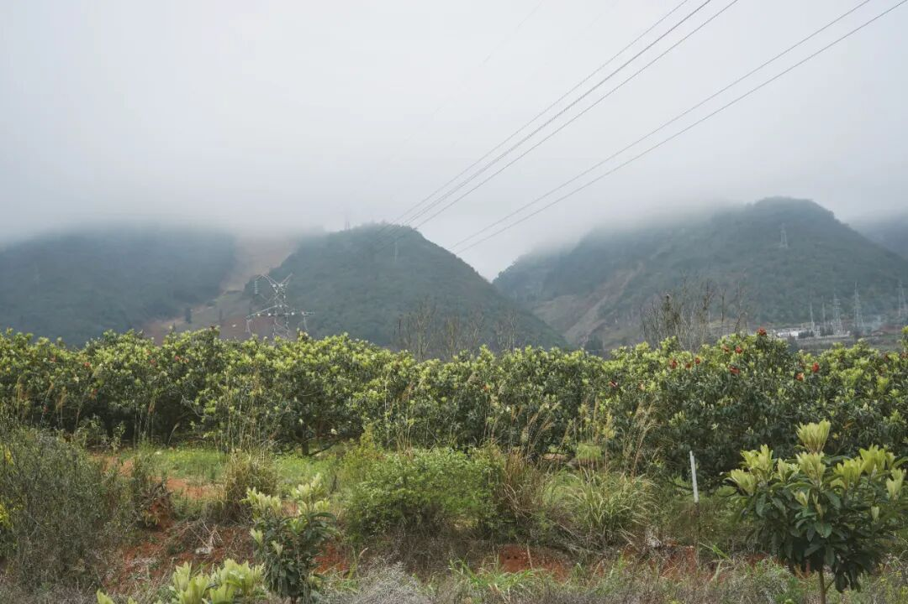
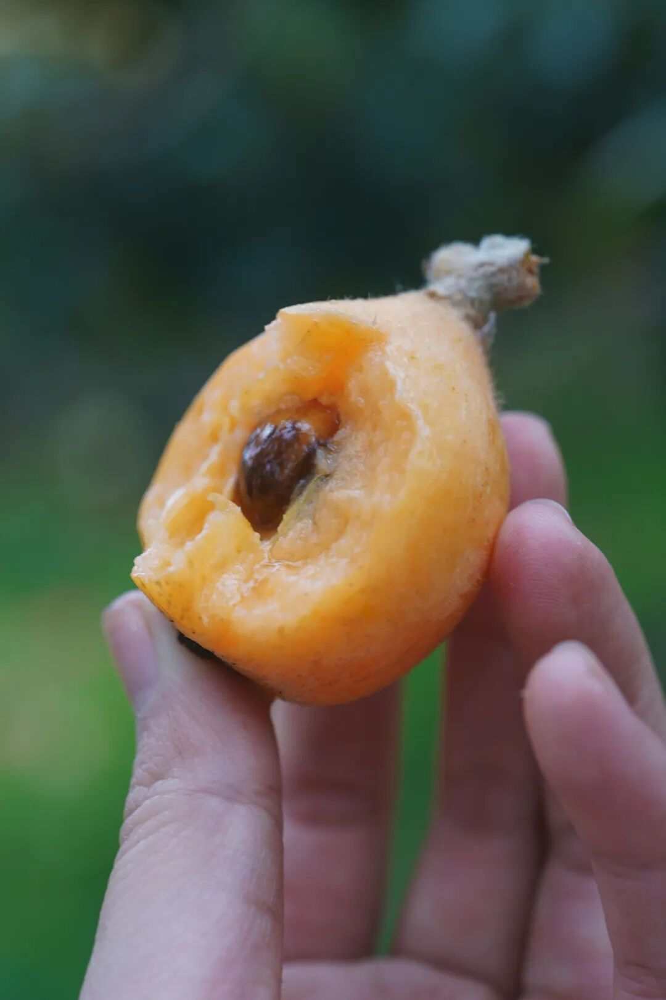
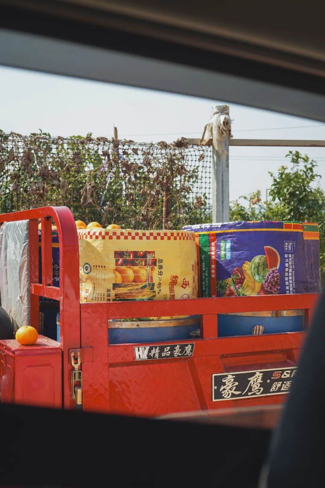

# 好吃，得劲儿，这水果又到尾声

- 原文链接: https://mp.weixin.qq.com/s?__biz=MjM5NTYxODQyMA==&mid=2653467650&idx=1&sn=b185517f783e4fa036125656683efcac&chksm=bc1cf1a3a221fd7568b55ec46317c67eccb6825b961d933d7d6b85648e6dad3af5eebf661647&scene=27#wechat_redirect
- 浏览量: N/A
- 点赞数: N/A
- 评论数: N/A
- 转发数: N/A

## 正文

我不舍得

一个尽情安利自我的公众号

以下是没事干研究院的风物研究报告请放心食用
是这样的，来自云南高原的蓝莓，吃着吃着又到尾声啦。最后这一批，品质好，
且因老天赏饭吃降了一波价，
想吃现在就下手！

首先，

在吃我饱记蓝莓之前，

本薯不知道原来蓝莓

是有浓浓花香味儿的！

后来一问产品经理，

才知道我们都是露天树上熟，

当天现摘现发的。。

你们去商场买，

就不可能给到你这个熟度。

要考虑出货周期的。

个头基本都在18mm+，

人工挑选过，

送人也拿得出手。

老读者都知道，

我司合作的果园，

那都是卷王标准。

这款蓝莓也不例外。

来自日照充足的云南高原，

选的是露天果园，物理种植。

无膨大，无催熟， 无农药，

老人孩子都可以放心吃。

一吃即知：

新鲜，脆甜，

浓郁花果香。。。

请看后台的读者好评👇（都是真实的都是真实的

对了，新鲜蓝莓表面会有一层白霜。

相当于蓝莓的保护剂，

新鲜的蓝莓才会有哦～

吃之前洗洗就行，不碍事。

饱记·云南高原蓝莓限时吃水果 9 折！！！五天内发货！！

戳图购买👇

同样因为天气好降价了的还有——好吃到让人拍大腿的蒙自花长虹枇杷！风味好浓甜！我今天必须要好好说道。

都说五月枇杷满树金，

一般枇杷都是在五六月成熟上市，

但是，

云南蒙自这个好山好水好地方，

独特的自然环境造就了能够现在吃的枇杷。

请大家记住它的名字：花长虹！

此物皮薄如纸，

轻轻便可剥开。

内里金黄的果肉，

饱满多汁，娇艳动人。

一口咬下，蜜甜蜜甜的，

美死我也。

不是我说，可与白玉争锋！

（主要最近吃不到嘻嘻

它种在蒙自海拔 1600 米的高原上，之前问过果农大哥：咱为啥非得种这么高啊？大哥微微一笑：海拔高的地方温度低，果子在树时间长，果子才能自然积累糖分啊。。

土呢，看着平平无奇，其实是云南特有的红土地。沙质含量高，还有微量元素，在这样的土里长出来的果子，吸收了更多的营养，才好吃。

给大家看看云南的红土地

树选的是 15 年高山老树，

生态种植，不打农药，

也就是说，

每颗枇杷都是树上挂果，自然成熟！

果农大哥（骄傲脸：

我们只用老树来结果，外面那种小树长出来的果子，不行的。

不打农药，勤劳智慧的云南果农选择把苜蓿花和大豆种在果园里，这些就是天然的氮肥，用来肥地。另外还给每个枇杷果都套了袋，这是为了防止虫子和鸟吃，所以果子上一点农药都没有。

我们辛勤的果农伯伯们，

每日清晨上山采摘，

采摘下来之后，

还要进行二次筛选，

有虫眼的、个头过小的都会被一一筛掉。

所以，

你们拿到手的都是新鲜现摘，

品相最佳，

且个头 19g 以上的精品果子。。。

总而言之，云南枇杷，不输的。请大家都去买，好吗？（词穷了谁懂？现在还有限时吃水果 9 折！以及，也就卖这一两个月了！外面很难买到的！（反正本薯觉得买不到

饱记·蒙自花长虹枇杷

购买方式如下

限时吃水果 9 折！！！

戳图购买👇

顺便跟大家提一下，来自精品小果园的云南沃柑！

鲜甜，爆汁，

浓浓的橘子味儿。

沃柑主产地在广西，

但是要我说，

云南种出来绝对不输！！！

得天独厚肥沃的红土地，

以及充足毒辣的阳光，

大家都知道，农作物靠天吃饭吧，

阳光强烈的地方，

长出来的果子才好吃。

不仅如此，

我们选用的还是沃柑里面的晚熟品种，

什么意思呢？

就是从结果到成熟，在树时间更长，

给它晒足晒透！果子自然更浓甜！

更让本薯震惊的是，

云南人也真的是有一些自己的种植技术

在身上的！

我们合作的果农来自苗族，

为了让果子更好吃，

他们甚至把中药药材都用上了！

图中这些有黄馑，重楼，白芨等中药药材，铺在树的根部。

我问这是什么原理？

果农大哥神秘一笑，我们自己研究的！

：）

哦懂了，秘方是吧。

中药啥的本薯不懂，

(猜测主要还是起保湿透气作用。。

总之这沃柑就是好吃，汁水巨多，

口感浓甜，还不是那种死甜，

九分甜中带一丝丝酸，

口感层次非常丰富。

果园里随意地养着鸡鸭鹅，

用来吃虫吃草，

这样就不用再人工化肥除草。

肥料也是用的当地的羊粪发酵肥，

比人工化肥丰富，土壤还不会板结，

果子根系吸收的营养更多，

还不会毁地。

这都是祖祖辈辈传下来的智慧啊。

环保，绿色，生态，健康，

既长出了好吃的果子，

还不伤害土地。

这里再强调一下，

我饱记的沃柑，

除了种植过程绿色环保，

也都是现摘现发的新鲜果，

饱记·云南晚熟沃柑

购买方式如下

限时吃水果 9 折！！！

戳图购买👇

题 外

朋友们春天好啊！

没吃够的看这里👇早春糯唧唧顶流，我饱记青团买了吗？

趁现在限时 85 折！

一个月仅开放一次闪购的海南椰子鸡！最后两天！限时早鸟 86 折！
刚冒出来的临安天目山雷笋，

米其林餐厅师傅第三年回购，

不焯水就鲜甜！

现在也有限时 9 折！

刚好配真材实料的饱记腊肠，

限时地板价 8 折！

或者试试好吃不贵的

玫瑰露酒腊肉&腊排骨，

更是限时地板价 7 折！

回到童年的铁盒蛋卷，

产品经理卷出来的鸭舌、麻花、猪肉脯，

都给一个限时 7 折！！

还有些适合时令水果👇

上周刚到的卷中卷红玉芒果，

娇艳可人的雷州木瓜，

好吃不怕胖的广西芭乐，

人称「水果冰淇淋」的凤梨释迦！

清新浓郁的万人迷上海金奖草莓👇

现在也有限时 9 折！

此外 90 天短保质期的大师凤梨酥，

也都有限时 9 折冲冲！

饱记·妈妈牌青团

现货中！

限时 85 折！！！

戳图或去🍑🍑🍑搜索

「艾格吃饱了」

下单购买👇

饱记·海南椰子鸡限时早鸟 86 折！！！限时闪购 5 天！预计 3.14 发货
戳图买它👇

饱记·2025 临安天目山雷笋

购买方式如下

限时吃笋 9 折！！！

戳图购买👇

饱记·手工腊肠购买方式如下👇限时地板价 8 折！！！！
戳图下单购买👇或🍑🍑🍑搜索「艾格吃饱了」

饱记·玫瑰露酒腊肉&腊排骨购买方式如下👇限时地板价 7 折！！
戳图下单购买👇或🍑🍑🍑搜索「艾格吃饱了」

饱记·海南红玉芒果

购买方式如下

限时吃水果 9 折！！！

戳图购买👇

饱记·湛江雷州木瓜

购买方式如下

限时吃水果 9 折！！

戳图购买👇

饱记·凤梨释迦购买方式如下限时吃水果 9 折！！！
戳图购买👇

饱记·广西芭乐

双拼&奶油芭乐

限时吃水果 9 折！！

戳图购买👇

饱记·红颜草莓限时吃水果 9 折！！！节日莓有烦恼！！
戳图购买👇

饱记·限定铁盒酥酥蛋卷

购买方式如下

限时 7 折！！！

戳图购买👇

饱记·年味零食7 折专区！！
购买方式如下
戳图购买👇

饱记·新鲜到货凤梨酥

限时 9 折！！！
戳图购买👇

本文的研究员

薯角啊！赞美春天！

用好吃的方式吃一生

祖国各地好风物

文章转载请加微信「baojiclub」

