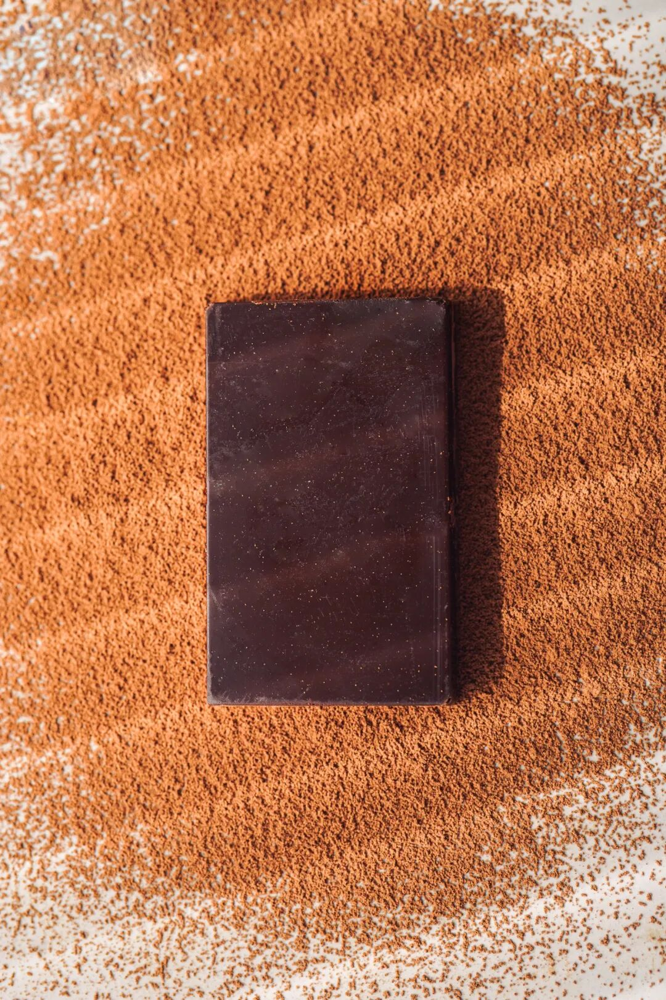
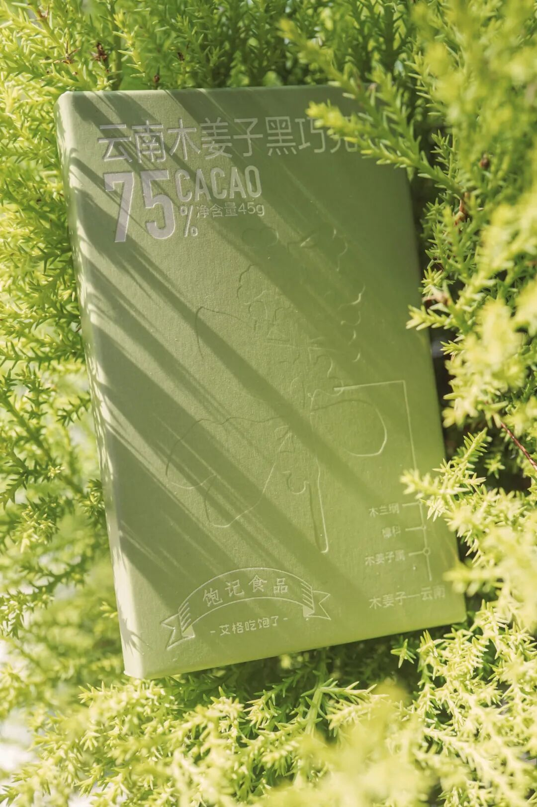

# 好吃，顺心顺意的那种好吃

- 原文链接: https://mp.weixin.qq.com/s?__biz=MjM5NTYxODQyMA==&mid=2653462086&idx=1&sn=30b984ccd70e8afe4085b9a5e1d52702&chksm=bc784aeb4c3f339c85a8959f07e1938da8afdf7779440d5cd2177a9c5d1db9784f7feb21a465&scene=27#wechat_redirect
- 浏览量: N/A
- 点赞数: N/A
- 评论数: N/A
- 转发数: N/A

## 正文

外面还是买不到！

一个尽情安利自我的公众号

以下是没事干研究院的风物研究报告请放心食用
众多周知，本薯对我们尊贵的饱记客人，向来是有求必应！有殷勤必献

（请笑纳

这不，前阵子线下活动被问了八百遍的黑巧克力，后台天天催👇薯角我悄悄努力半个多月，（主要是督促老板干活
今天！它它它终于来啦～

外面买不到的
饱记·云南木姜子 75% 黑巧克力！是那种浑然天成的好吃嘿嘿～

重要的话放前面说！
配料表简单，
没有大家关心的“代可可脂”

来，配料表都给大家直接呈上👆
为了写好这篇激动人心的推文，本薯特意点开了淘宝巧克力商家的「问大家」！
一些市面上的常见困惑，这就来为大家解答～

问题其一：酸味重吗？很多人买黑巧，最怕入口有涩酸味，这样嚼起来就不香。

所以产品同事这次在开发的时候，只想纯粹去还原大家心中可可该有的感觉！香味要足，入口不过分甜腻也不会涩口。最后选的这款 75% 的高可可含量奶巧，包容度更高，适口度更好，平衡奶巧的甜和黑巧的苦且保证顺滑，
总之，就是那种方方面面都让家长顺心顺意的“好小孩”！

问题其二：感觉好吃吗？风味体验嘛～完全见仁见智，本薯只能尽可能给大家还原下入口的感受！

这款黑巧的特别之处，便在于加入了云南香料木姜子油！常吃西南菜的朋友一嚼就会想起来了。
木姜子的香气清新得不得了，有点像柠檬和香茅的结合体？这次调试了很多次，
最后让木姜子主要呈现出的就是香气，尤其尾调，醇厚的可可过后，有明亮欢快的木姜子清香收尾！

问题其三：减肥能吃吗？感觉减肥其实什么都能吃。。。
只是吃啥都得适量吃？这款一盒 45g 的参考热量是 281 卡，大家自行判断哈！

问题其四：适合送人吗？送送送！
尤其秋冬送爱健身的朋友，简直能量补充好伴侣！

看这清新自然的纸盒设计，送礼自留两相宜👇

塞口袋里不占地，随身揣着走，随时充能！

每盒里有 4 小块，聚餐饭后给朋友分分，夺松弛惬意的小甜点啊～

好了，今天就努力到这儿，剩下你们自行看商详吧！老规矩，
给大家来个限时早鸟 86 折！！前阵子问的朋友们呢？都给我买啊啊啊啊啊！

饱记·云南木姜子75%黑巧克力购买方式如下限时早鸟 86 折！！
戳图下单购买👇或🍑🍑🍑搜索「艾格吃饱了」

题 外

大家好，

这个时节好东西不少（单押

双十一过后的心意返场折扣直接来！

不用凑单不用研究！

苏南蟹标杆美味：太湖流域大闸蟹苏北蟹宝藏性价比之选：洪泽湖大闸蟹

终于回归的有小时候番茄味的云南西红柿，

坚持真材实料、天然肠衣的手工腊肠，
能做煲仔饭和火锅的玫瑰露酒腊肉&腊排骨还有打遍天下无敌手的山核桃！我司卷中卷产品，
拿到外面去都能打得很！具体你们看商详，最重要是还有些限时返场折扣再薅老板一回！冲！

饱记·云南西红柿购买方式如下双十一同价 86 折！！
戳图购买👇

饱记·太湖流域大闸蟹购买方式如下👇限时 9 折
戳图下单购买👇或🍑🍑🍑搜索「艾格吃饱了」

饱记·洪泽湖大闸蟹购买方式如下👇限时 9 折
戳图下单购买👇或🍑🍑🍑搜索「艾格吃饱了」

饱记·手工腊肠购买方式如下👇
三款口味，各有各的特点。用的黑猪肉、天然肠衣、玫瑰露酒...酒香腊肠，酒香浓郁，
有四六和二八这两个肥瘦比例可选。
滇式腊肠用了不少贵价的辛香料，同事说超适合拿来做西班牙海鲜饭，
试过加辣肠后升华了。
戳图下单购买👇或🍑🍑🍑搜索「艾格吃饱了」

饱记·玫瑰露酒腊肉&腊排骨购买方式如下👇
戳图下单购买👇或🍑🍑🍑搜索「艾格吃饱了」

饱记·临安山核桃

双十一同价

戳图买它👇

或到🍑🍑🍑

搜索「艾格吃饱了」

本文的研究员

薯角生活就像一盒巧克力🍫

用好吃的方式吃一生

祖国各地好风物

文章转载请加微信「baojiclub」

