# 好甜，像老板的命一样

- 原文链接: https://mp.weixin.qq.com/s?__biz=MjM5NTYxODQyMA==&mid=2653461129&idx=1&sn=2d3161b177bf158b99e9f14309a2e202&chksm=bcd7b9b7a4b1116aa5c0b8c4b42408a88ef309328f22da03cc2d4d8d519833d139f3bd2879c7&scene=27#wechat_redirect
- 浏览量: N/A
- 点赞数: N/A
- 评论数: N/A
- 转发数: N/A

## 正文

好吃又好喝

一个尽情安利自我的公众号

以下是没事干研究院的风物研究报告请放心食用

最近大降温！

趁此机会给大家推荐一些

温和润喉的好物啊！

甜滋滋又好入口，

有甘甜、清甜、酸甜、蜜甜，

最重要是现在

小🍊序都给双十一地板价，

算下来比老板们的命还甜？

「秋天的甜」其一：

新上的饱记·罗汉果普洱！

宅家时爱不释手，

是一杯容易被低估的小甜水。

里面是晒干了的罗汉果、

云南陈年熟普还有浙江胎菊！

没有另外加糖，

入口却甘润清新，

不自觉就一口接一口喝了好多！

茶叶这东西，

做不了假，

好喝全来自于真材实料。

比如这枚神奇的罗汉果，

产自广西金江村。

有着香蕉和花生的清甜味。

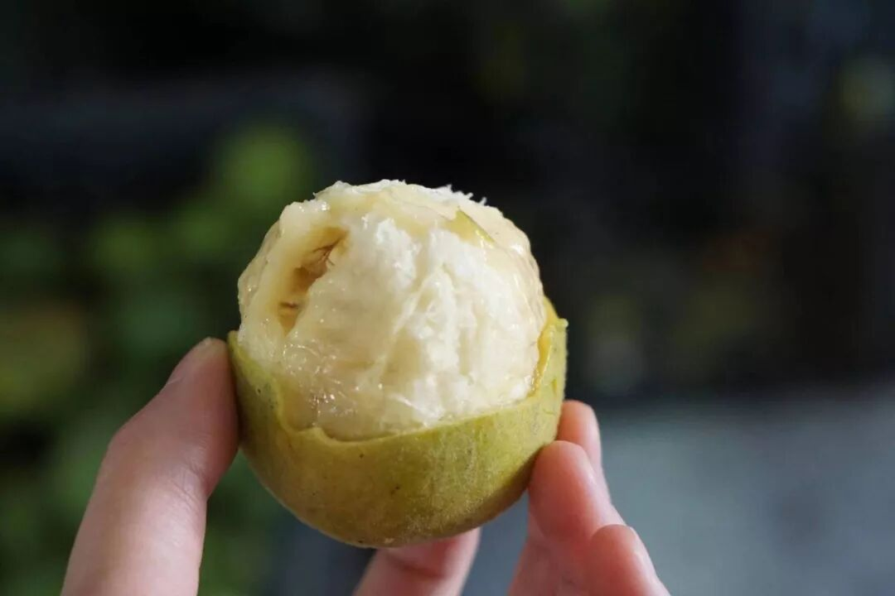

金江村地处龙脊镇东部，

是前往桂林龙脊梯田景区的必经之地，

当地几乎家家户户都在种罗汉果，

平时就用山泉水浇灌它们。

当地人会把罗汉果烤干之后，

直接泡水喝。

我们就用这种整颗敲碎、再烤干的罗汉果，

来入茶！

选用云南临沧凤庆

陈放七八年的熟普洱，

条索紧细匀整，色泽红褐润显毫。

再配以整朵的上等胎菊，啊好美～金黄灿烂像秋天～

习惯性拿盖碗来泡，

倒茶，注水，

很快空气里就漫出普洱茶的香气～

入口有很明显的胎菊清甜，

罗汉果在其间若隐若现，

带一点点冰凉感，

像给嘴巴开了加湿器？

会回甘的甜，

怎么喝都不会腻。

这次还升级了包装小金罐，

送礼也显得咱大大方方儿的！

（此处代入东北口音👆

虽然是「新人出道」，

凑热闹也给到一个双十一价！

全年地板价！

信我！秋冬必须喝起来！

饱记·罗汉果普洱（小金罐）购买方式如下👇双十一同价限时 86 折！！
戳图即可购买👇或打开 🍑🍑🍑 搜索「艾格吃饱了」

「秋天的甜」其二：

我司回购率极高的桂花乌龙小金罐！

福州同事的原话：

这茶完全经得起盖碗的考验！

和市面上都是细末的调味茶不是一回事，

必须细细品味！

来自后台用户的

真实反馈👇

茶叶用的是六年陈炭焙铁观音，

同事专程跑到福建安溪，在平均海拔超过 1200 米的戴云山脉深处卷出来。茶农分三次焙火逼出茶香，最后陈放六年，耐心等待火气褪去，把蜜韵养足～

金桂，是每年寒露前后新鲜打的，早上五六点日出前打下来，运回后剔除花梗树叶，仔细拣选后才可与茶叶拼和。

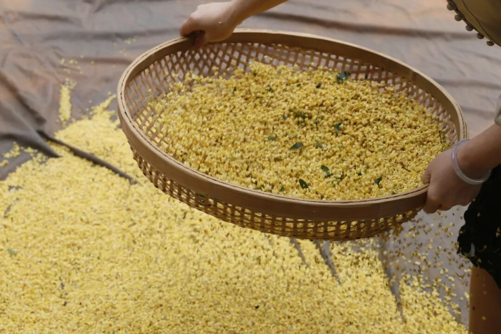

然后请来福州当地家中五代制茶的老茶人，以传统古法窨制，一层金桂一层茶～

早期刚开始，我们做的是一窨一提（下花量 70 斤），后来再到两窨一提（下花量 230 斤），这次老板下了血本，直接做了三道窨制的（下花量300斤）！100 斤的茶要用300 斤桂花分三次窨制！！

（洒的不是花，是钱。。。

但懂的都懂，老福州人做花茶，讲究见花香不见花，饱记也是同样标准，桂花萎蔫后都会以手工挑除，只在烘干后额外洒入干桂花～费时费力得很！

（这么好看，不要命啦？

用盖碗泡，哇～桂花的香气完全被激发，直窜入鼻尖！带着一点花的自然甜味～入口茶汤微稠，舌侧香气余韵不绝，观音茶的回甘源源不断！

总之，闻起来是甜的，喝起来却有烤过的醇厚滋味！本当它是办公茶叶，没想到茶底这么好，还耐泡得很！立即决定囤几罐在家！

还可以搭着柚子小种红茶买！组合更划算！用的是武夷山的花香小种红茶。茶叶鲜度很高，传统手工精制，一芽一叶。

泡出来是这样的，远远都能闻到饱满的柚子香气！冷热皆可。但同样最推荐盖碗泡法！

当然你也可以像董洁一样，（是的它可是上了董洁直播间！一个人的时候拿出喜欢的杯子品品，
给自己小小的仪式感？总之优雅永不过时

也是双十一地板价 86 折，大人们！请用茶吧！
饱记·桂花乌龙（小金罐）购买方式如下👇双十一同价限时 86 折！！
升级版小金罐，送礼自留都满足。
两种规格：单罐装：桂花乌龙（1盒）组合装：
桂花乌龙（1盒）+柚子小种红茶（1盒）
戳图即可购买👇或打开 🍑🍑🍑 搜索「艾格吃饱了」

「秋天的甜」其三：

果味极其浓郁，

甚至赢过新疆的西北勒苹果！当地发来喜报：最近已到这果的口味巅峰期，甜度更明显，溏心概率也会更大，甚至还会出现 250g 的超大果，随机给大家发！

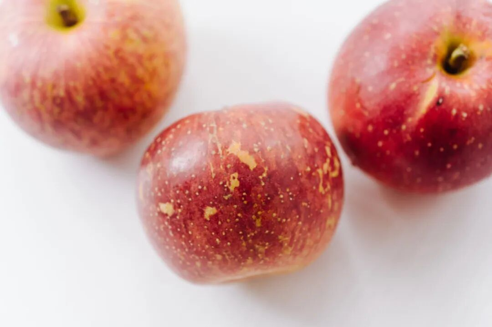

会吃的朋友已经吃过几波了，

现在不管看风味还是看价格，

都是回购的最好时节👇

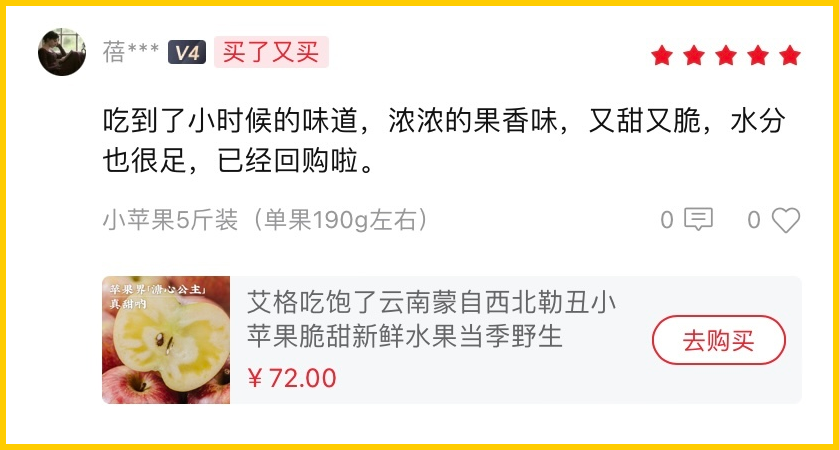

果子长在云南红河州

一个海拔近 3 千米的村子里，整条山都是白色的大石头，却种出了有小时候味道的好苹果。

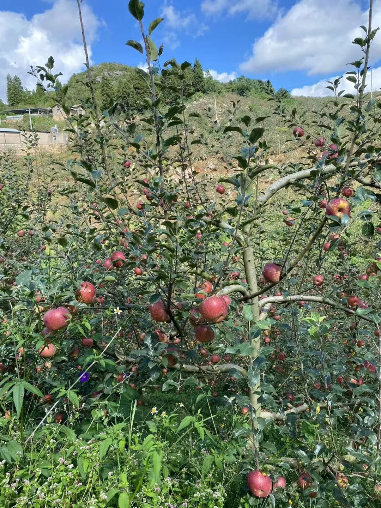

不是那种傻甜，和勃艮第的葡萄一样，石灰岩地貌与干爽的早晚温差内陆气候，给予了它足够的酸度，风味层次非常之丰富。

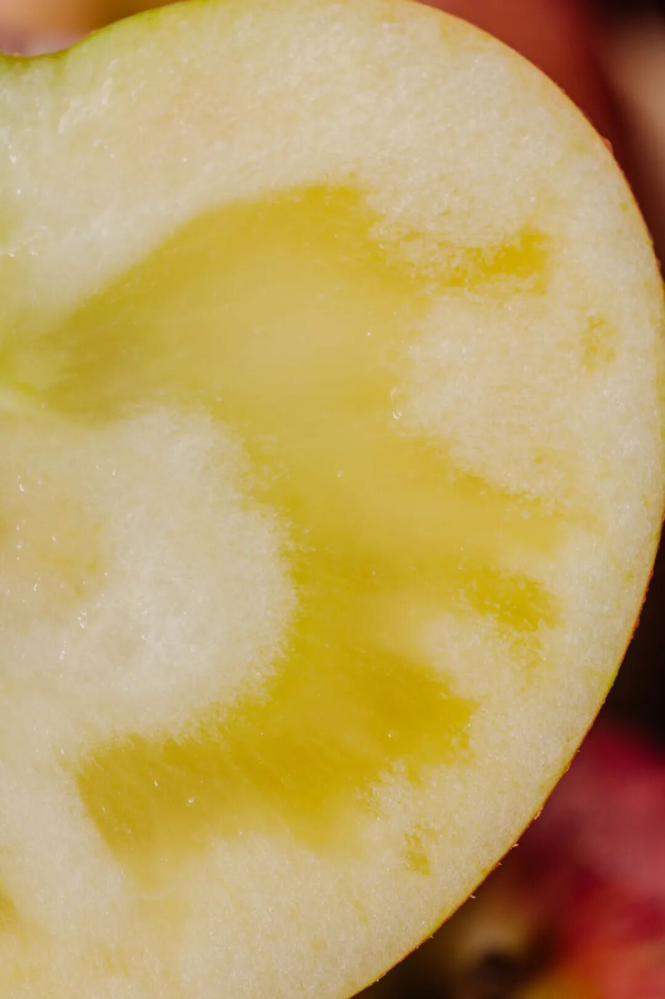

苹果界「溏心公主」，皮薄肉脆，多汁不绵，不打蜡，自然全熟发货除了丑之外没有任何缺点，是新鲜与阳光的苹果本果。

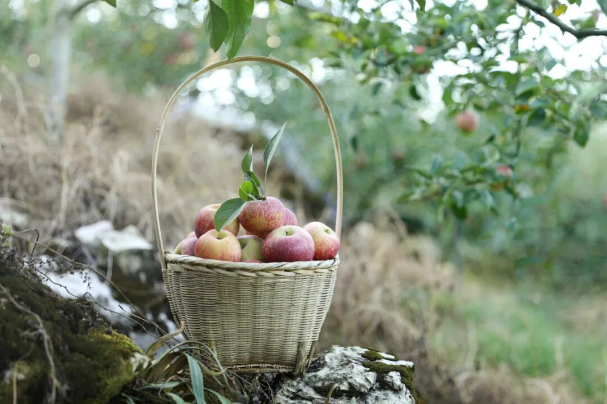

随手测出来的糖度👇

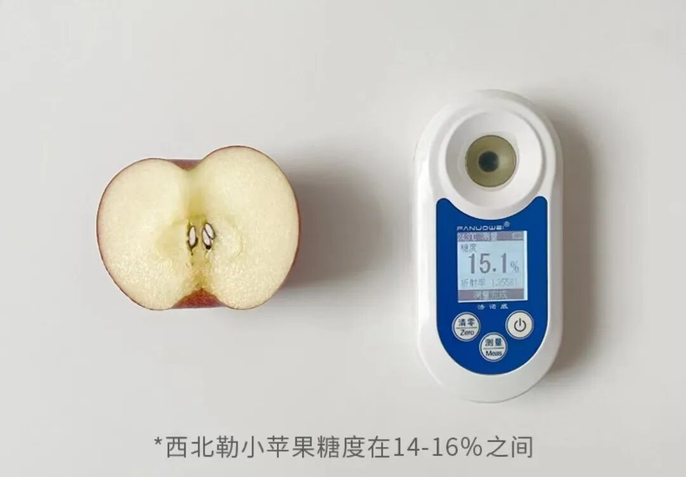

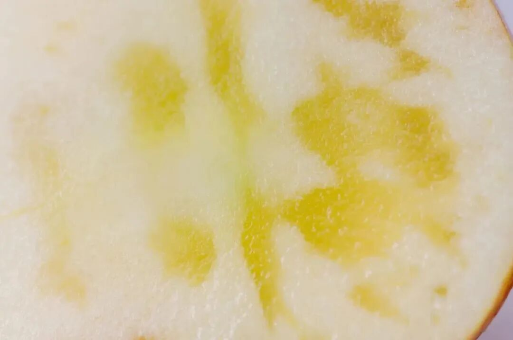

反正。我司的水果，从来就是卷。来个双十一同价限时 86 折！注重内在美的速买

饱记·西北勒小苹果口味巅峰期👇双十一同价限时 86 折！！
戳图买它！！👇
或到🍑🍑🍑搜索「艾格吃饱了」

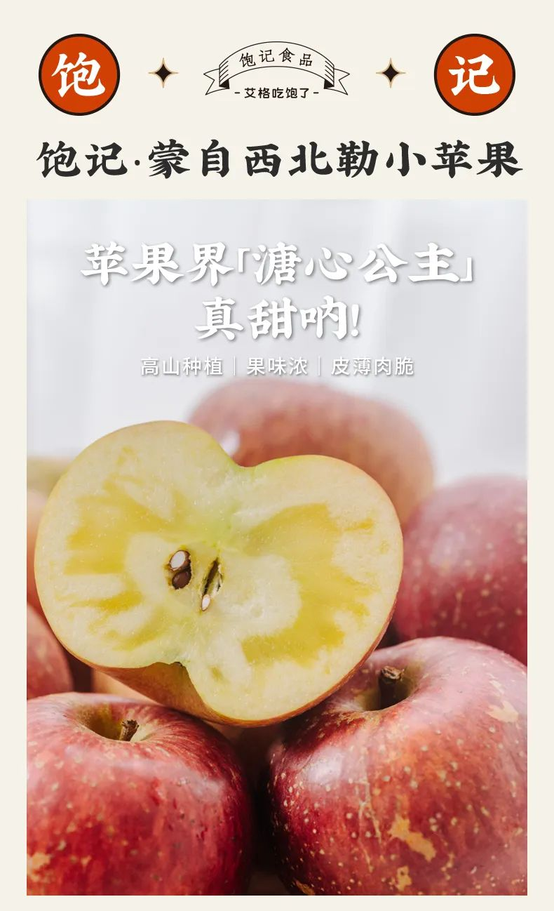

「秋天的甜」其四：

这个六两一颗大胖梨，

也就是大名鼎鼎的

秋月梨，饱记做了几年了。

今年改了更卷的果园！

来自山东莱西，

又一个著名梨乡！

讲究自然环境+科学种植，

当地果农种植技术成熟，

全程都有合作社进行技术指导哦～

白白胖胖，

冰糖甜风味，

咬开都是一汪汪的甜汁儿，

随手抽一颗测测，

糖度 12 以上。

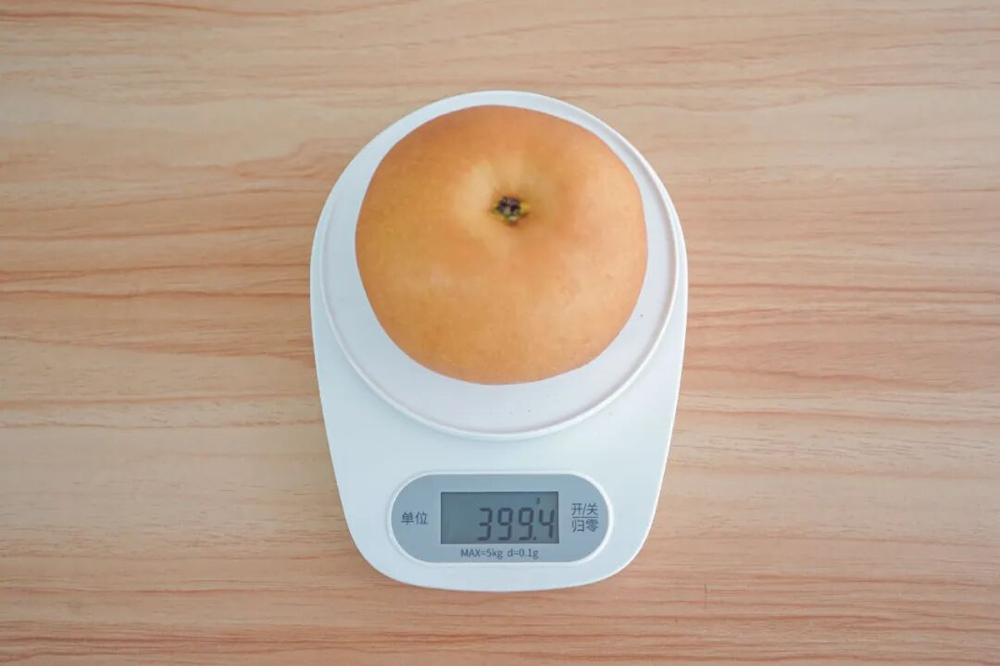

主要是脆嫩，

吃起来多汁，几乎无梨渣。

这个品质，

产地新鲜直发，

和水果店超市的随便比吧。。。

双十一同价限时 86 折！

你看看多适合上班吃！

赶紧润润那骂老板的嗓子（？

饱记·秋月梨
购买方式如下双十一同价限时 86 折！！
戳图买它！！👇
或到🍑🍑🍑搜索「艾格吃饱了」

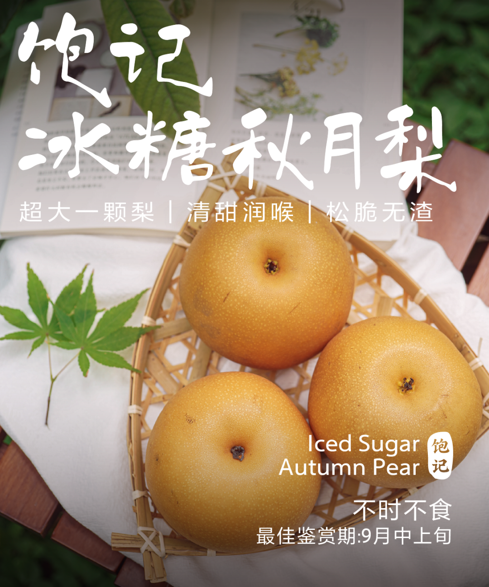

天🐱双十一第一波已经结束，

我司在小🍊序接着打折！

且是直截了当地打。

大家直戳小🍊序购买！

早买早享受！

第一波吃完还能赶上第二波回购！

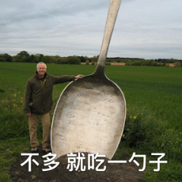

题 外

还有人不知道我司线下活动已经开始了吗！！

本薯为了出门摸鱼，

已经提前给大家探过路了，

一句话总结：

逛得尽兴、玩得开心、吃得过瘾！

首先可以抽奖！

那种中奖率百分百的抽奖。

其次可以吃吃喝喝，

都是好吃正宗的云南小点，

还在现场学到了好些

云贵高原香料知识！

这就是我们为人气云南餐厅浩海火烧云设计承办的

的「香料花园」活动！

详情可戳👇

上海秋天最幸福的街区，来逛来玩！！！

本周末，

在上海市中心的芮欧百货一楼的

风之溪谷区域（静安公园隔壁）。

来玩来见面！

香料花园·超值门票

购买方式如下👇

戳图买它👇

本文的研究员

薯角秋天该很好

用好吃的方式吃一生

祖国各地好风物

文章转载请加微信「baojiclub」

