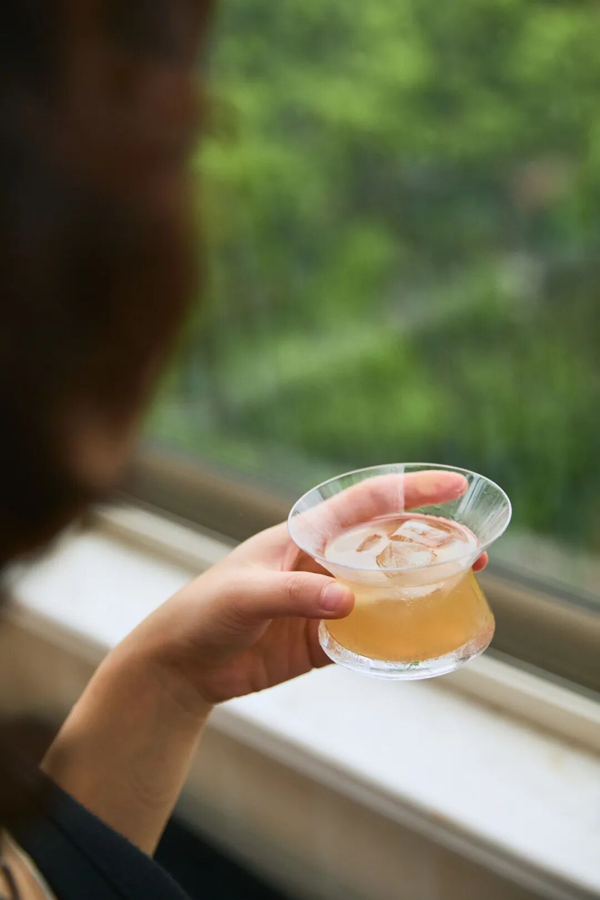
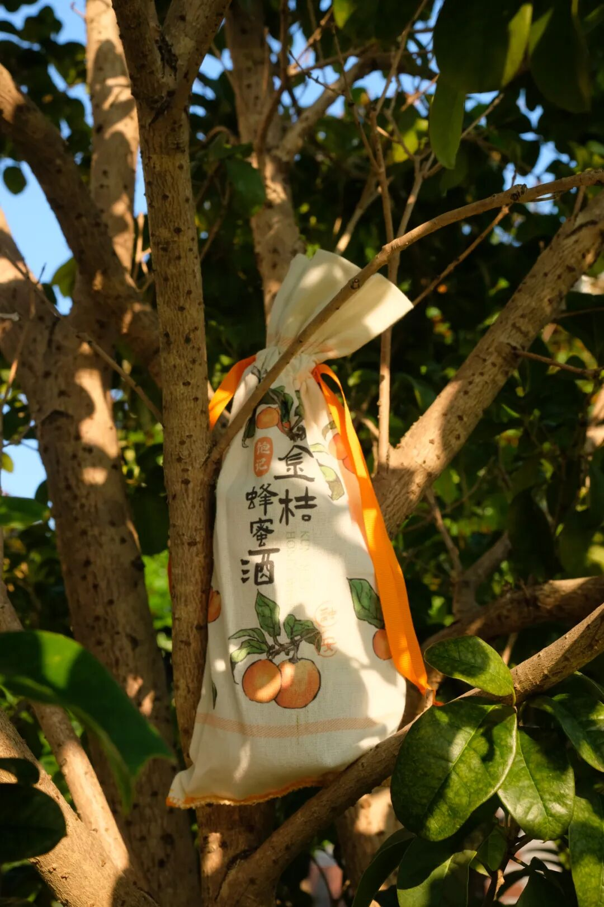
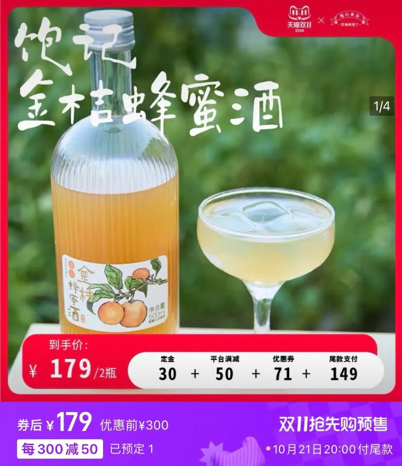
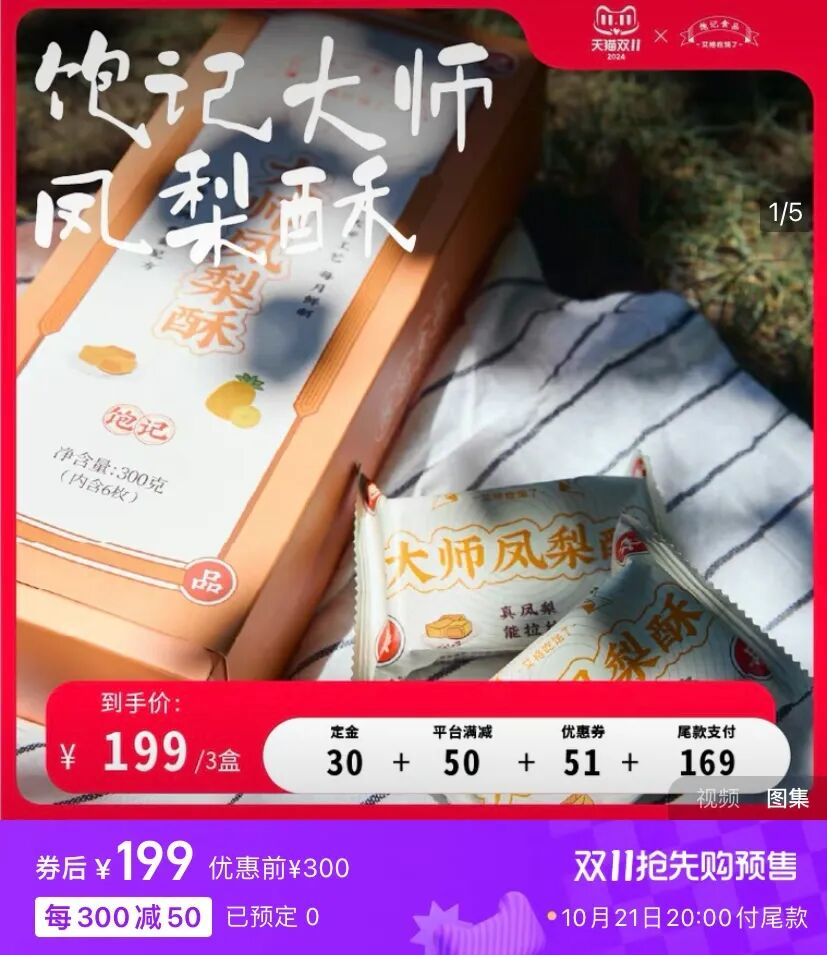
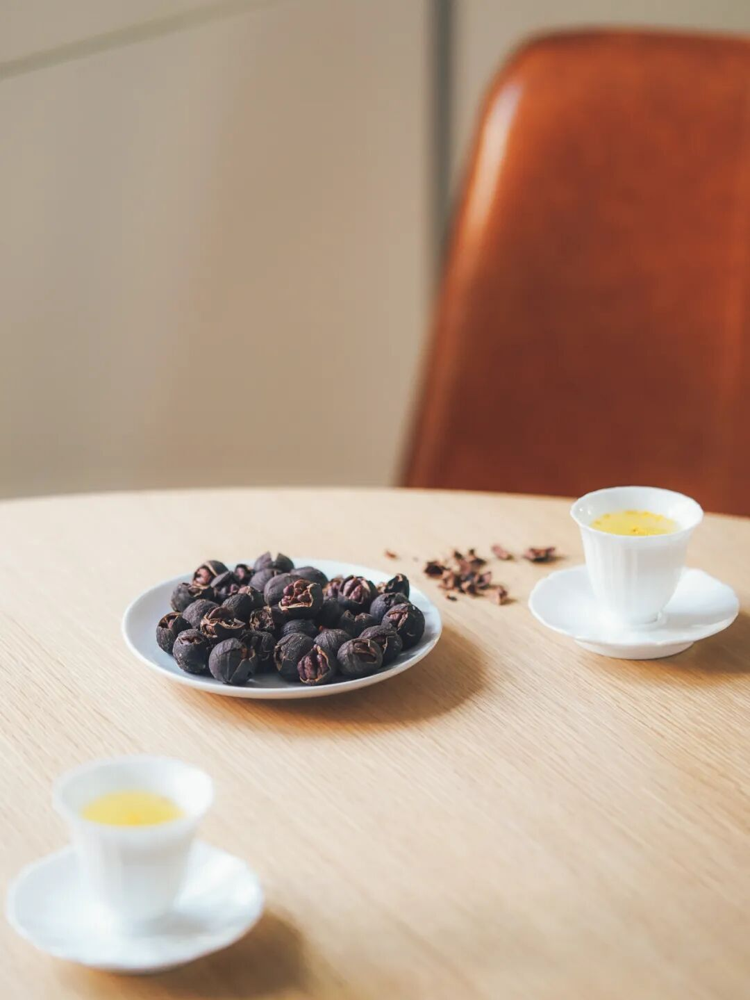

# 好累，想把公司卖掉

- 原文链接: https://mp.weixin.qq.com/s?__biz=MjM5NTYxODQyMA==&mid=2653460345&idx=1&sn=c5327f41734f3625e048e18433ee3e1f&chksm=bcec60b1963a8cd4796a30fefaa102642e63171b067ee4710b8e1eb6e0f5a1ce91813505b7a1&scene=27#wechat_redirect
- 浏览量: N/A
- 点赞数: N/A
- 评论数: N/A
- 转发数: N/A

## 正文

全年最低价

一个尽情安利自我的公众号

以下是没事干研究院的风物研究报告请放心食用

好累，

双十一为什么 15 号就开始？？？？

行吧，别无他法

地板价走起！

不想上班了，

只想把这公司卖掉。

（运营同事给的优惠价格表直接看👇

抢先购定金预售第一波，

本薯薅着运营同事，

给到销冠三样的

全年最低价，

（比早鸟 86 折还要再便宜！！

快，从工位上站起来给我买！

双十一定金预售
现在开启
从现在到下周，双十一进入定金预售阶段，21 号尾款结算每满 300-50帮大家算过了，现在定金下单，肯定最便宜！都是地板价！

这一瓶「外面买不到」的——饱记·金桔蜂蜜酒。堪称产品同事的得意之作。从上半年开始，费了好些功夫，跑完融安跑四川，跟酒厂磨出来。

金桔的风味，

是从融安自采了 3000 斤

正宗融安滑皮金桔，

果脆、芯甜、籽少，

拉到四川酒厂酿制。

蜂蜜也有来头，用的四川本土产蜂蜜，在高山凉爽的气候下发酵酿制，甜而不腻，鼻尖能闻到丰盈的蜂蜜香嗷～

还用上了传统葡萄酒酿法，

整颗金桔浸皮萃取，

从而使更多果实风味向酒液转移，

带来浓郁柑桔香气。

最后卷了一下包装，设计了定制束口袋，送礼自留皆适宜，酒喝完了收杂物也没问题！

日常价 118 一瓶，

这次不到 200 就能拿下两瓶！

初秋小酌囤点！

饱记·金桔蜂蜜酒

购买方式如下

地板价 179/2瓶

尾款结算满 300-50

复制淘口令下单购买👇58🗝233U3l9dq2U🗝

再说这个酒香鸭舌，

包邮区糟卤口味！

灵感来自《红楼梦》里宝玉喜爱的下酒小菜～

秋冬里配杯小酒，

超惬意！

专门盯着南京的厂找，

因为全世界他们最懂鸭子。

最后定的是一家老师傅开的厂，

厂里有一锅 30 多年的老卤！

这个就叫家底儿～

鸭舌原料舍近求远，

用的内蒙古的鸭，

吃草～鸭舌肥嫩没有腥气！

所有的香料，

都直接从同仁堂、太乙堂两家中药房采买，

不是市场上那些脏脏没味儿的糙货！

传统方式吊糟，

就真的是糟香鸭舌的包装版！

完全没有真空鸭袋的辣鸡食品味！

不腥，很香，微咸，带酒意～

鸭舌边边上还有酒香味儿的冻～～

包邮区的朋友肯定爱！

日常价 49.9 才得一袋！

这次直接上五袋装，200 出头，

放零食柜里随时吃！

饱记·酒香鸭舌

购买方式如下

地板价 219.9/5袋

尾款结算满 300-50

复制淘口令下单购买👇29£BUaJ3l9X3tJ₴

最后是这款好评如流水的大师凤梨酥！最新一批 9 月到货，用料实在，
所以只有 90 天短保质期哦。

用的是台湾凤梨酥盲品大赛冠军配方，
选的都是新鲜土凤梨馅，
果肉含量大于 40%！
你一入口就能吃到浓浓的凤梨本味。

我司很喜欢吃凤梨酥的同事说，
吃过很多种凤梨酥，
芝士味浓郁的、果肉纤维多的、奶香味重的，
但都没有一口咬下去
酸甜跳跃的凤梨酥来得印象深刻。
是的，我饱记凤梨酥，
能让人吃出欣喜雀跃的感觉！

酸甜可口，果香浓郁，
真实会拉丝。
酥皮奶香饱满，酥润化渣，
像是在吃松软的黄油曲奇。

老人小孩也都能吃，
送人或自家吃吃都挺好哇～日常价是 82.8 一盒，这次立省快 50 元，
再等尾款凑满减，超划算！

饱记·大师凤梨酥

购买方式如下

地板价 199/3盒

尾款结算满 300-50

复制淘口令下单购买👇18🗝Gi2y3l9W1jG₴

好了，重点都标得明明白白了，
一年仅此一次的福利，打开🍑🍑🍑搜索「艾格吃饱了」！到时候还可以配山核桃一起下单👇

我司山核桃，

本薯可以淡定地说，打遍天下无敌手。

老板喊上浙江农林大学

山核桃研究所的老师们一起整，

细数下来，

也有 11 个年头了～

酥脆生香，吃几罐都不会腻，且都是今年刚炒的新货，送礼自留两相宜嘿嘿～快快快！
助力打工人的 KPI！

题 外

懒得打开淘宝的，本薯也给你准备好了！今年新炒的山核桃，

直戳下方图片就有限时 9 折！！

还有上周新来的

丑苹果和库尔勒香梨，

来自云南的蒙自西北勒小苹果，
甜中带有酸度，果味极其浓郁，甚至还有溏心！喝天山雪水长大的新疆库尔勒香梨，又甜又润，嫩得连皮也能吃！

都薅来一个限时 9 折！！

下单后不用等！快冲！

饱记·临安山核桃购买方式如下👇限时 9 折！！
戳图买它👇或到🍑🍑🍑搜索「艾格吃饱了」

饱记·西北勒小苹果购买方式如下限时 9 折！！
戳图买它！！👇
或到🍑🍑🍑搜索「艾格吃饱了」

饱记·新疆库尔勒香梨
购买方式如下限时 9 折！！
戳图买它！！👇
或到🍑🍑🍑搜索「艾格吃饱了」

本文的研究员

薯角我的爱车——购物车

用好吃的方式吃一生

祖国各地好风物

文章转载请加微信「baojiclub」

