# 如果天天吃这个，班也是可以上的：）

- 原文链接: https://mp.weixin.qq.com/s?__biz=MjM5NTYxODQyMA==&mid=2653471290&idx=1&sn=1bd03a0cd03bf9cdd2e5f32c334fbd0b&chksm=bc4aa13af891b099d8a7c0e96c9c8d9b479b84219325305e74f9b67b1eef168847a02ad8d930&scene=27#wechat_redirect
- 浏览量: N/A
- 点赞数: N/A
- 评论数: N/A
- 转发数: N/A

## 正文

好久不见

一个尽情安利自我的公众号

以下是没事干研究院的风物研究报告请放心食用

朋友准备好了吗？

接下来我也要开始卷了！

这个时节厉害货色太多，本薯表面波澜不兴，内心已经想着掏空你们的口袋

今天就先给大家上架这枚甜滋滋的小糖包！饱记新疆轮台小白杏！本薯可以自信地说，市面上的根本比不了～

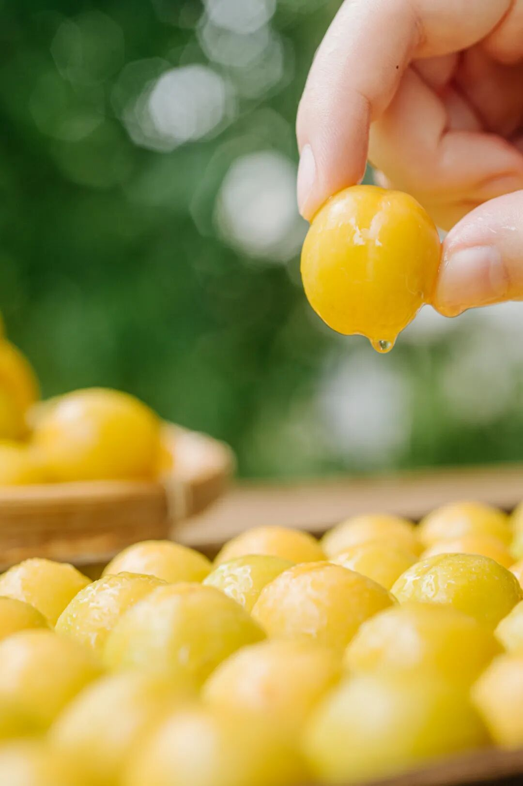

之前朋友买过别家小白杏，说，酸，没啥滋味，不够甜。直到吃上我司小白杏，她说：这是我吃过最好吃的小白杏。。你们公司是不是遍地都是这个。。能不能给我搬点。。。

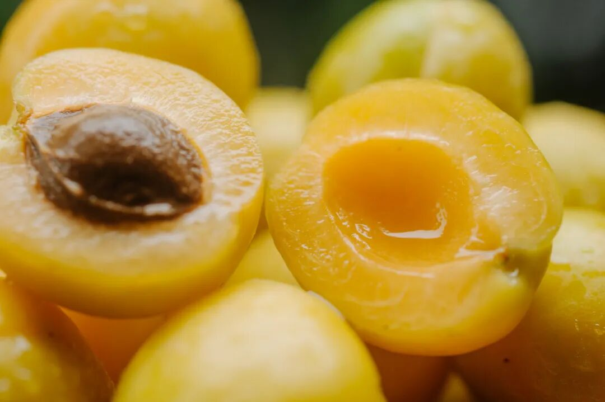

饱记的小白杏，

是翻遍了新疆轮台库车两大产区后

找出来的优中之优选！

首先是甜，

种在天山脚下的绿洲，

日照时间长、昼夜温差大，再加上天山雪水的滋润，所以这里产的小白杏，
皮薄，肉厚，甜蜜蜜～

除了甜嫩之外，

饱记的小白杏还有珍贵的、

如蜂蜜般的香气。

这就是树熟要求～～

也就是说，在长熟之前，它们都可以在树上大躺平，

每天沐浴西北的阳光。

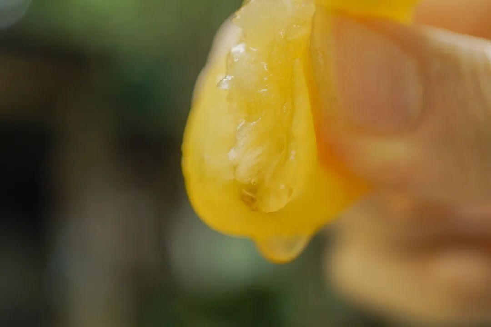

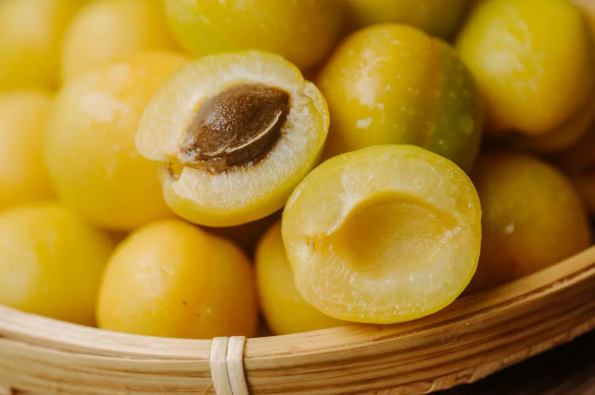

摘好的果子交由阿姨们精心拣选，饱记的标准是一箱里分三个熟度，三分之一是树上完熟的，拿到就赶紧吃，香软，蜜蜜甜!剩下的分别是黄中带绿的和偏绿的，常温下放两三天！不要进冰箱！

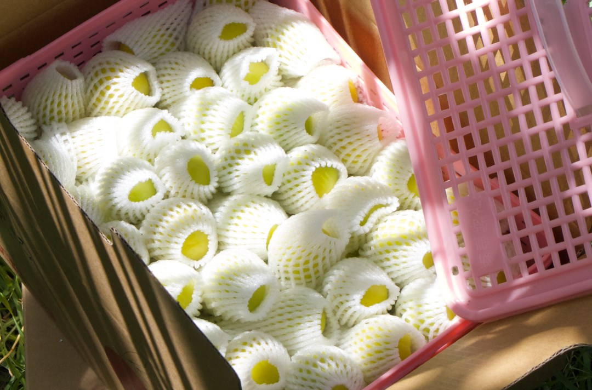

要不说轮台的小白杏有名气呢～之前试过很多其他果园的杏子，摘下来放再久都甜不了～

可惜这么好吃的小水果，一年也就 2 周左右可吃，不想等明年的，建议快冲！

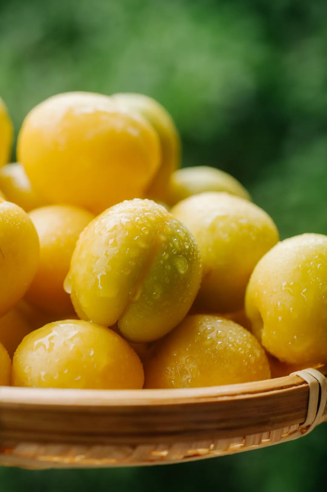

还是老规矩，限时早鸟 86 折！要我说，如果能天天吃上这司的小白杏，这种卷里卷气的稿子有啥不能写的

饱记·新疆小白杏

限时早鸟 86 折！！！

戳图买它👇

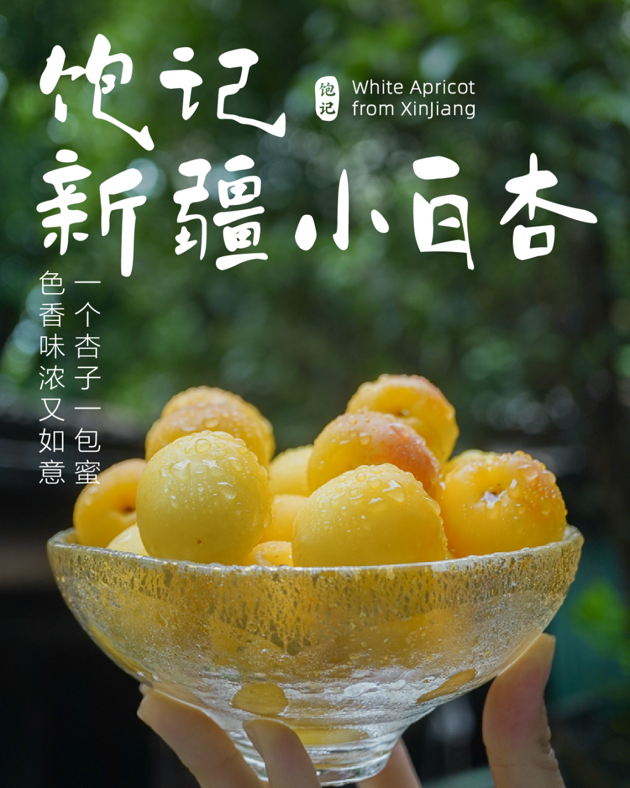

再跟大家提一嘴，这个比鸡蛋还大的荔枝王，
新鲜，好吃，杨贵妃都吃不到的！唯一缺点就是果期极短：再吃两三天差不多就没啦！！！

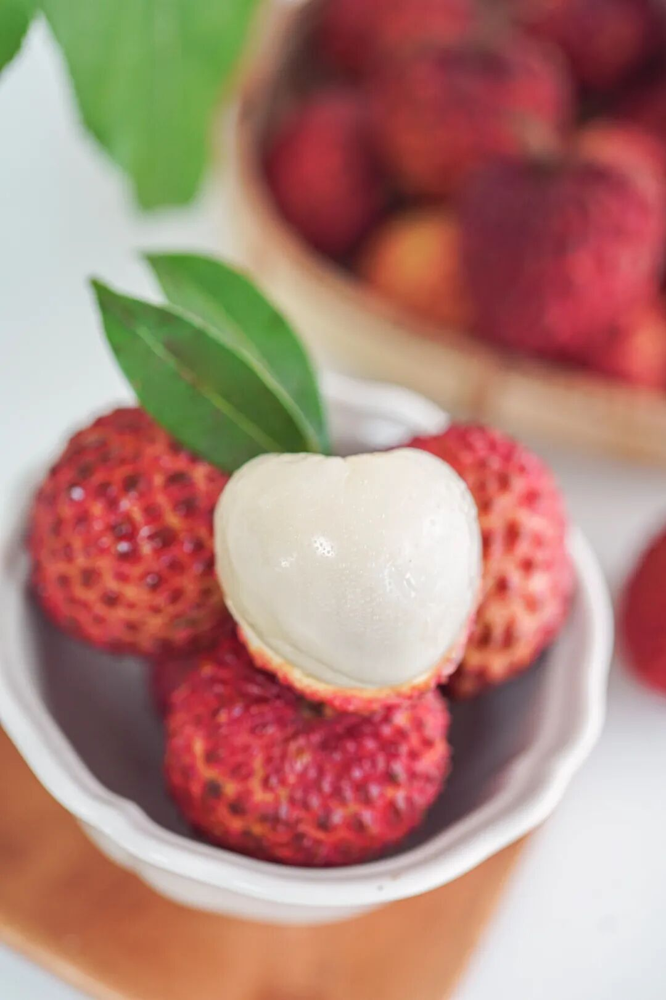

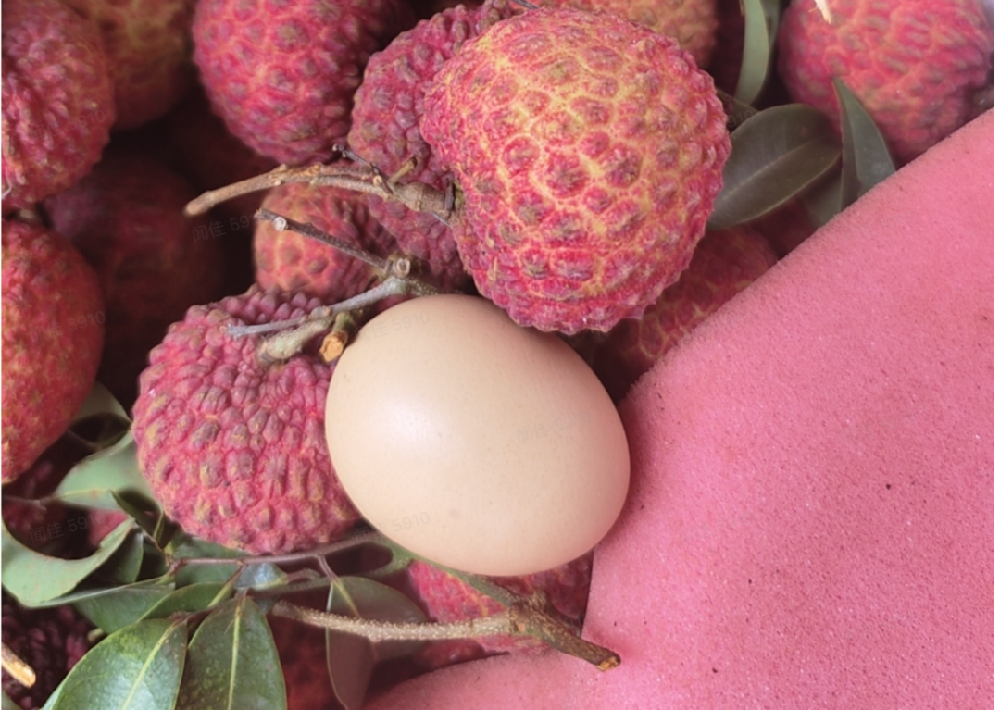

这果子来海口市永兴镇，

此地至今仍有荔枝王的母树。

目前这种超大个头荔枝被引种到两广各地，

但公认种植水平最成熟的，还是永兴镇。

一般荔枝王比不得～

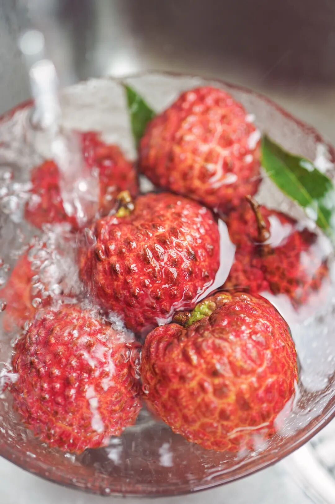

很多人觉得荔枝王酸，但饱记要求，
糖度要在 14-16 发货～
入口蜜蜜甜。

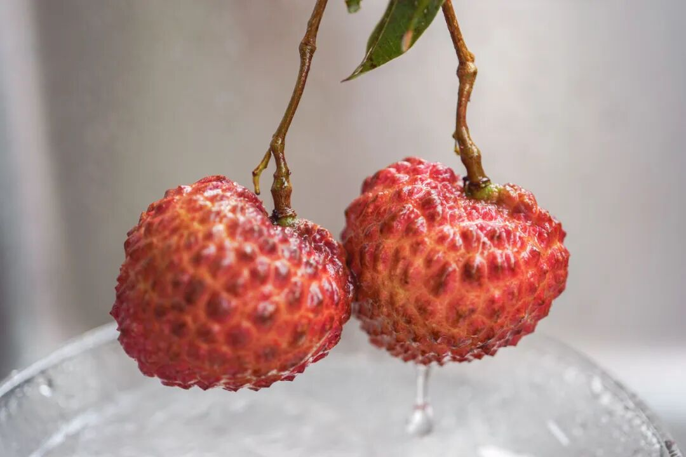

老规矩，颗颗都是树上熟，再用京东荔枝空运专线，

不打保鲜剂，

争分夺秒到你手上。

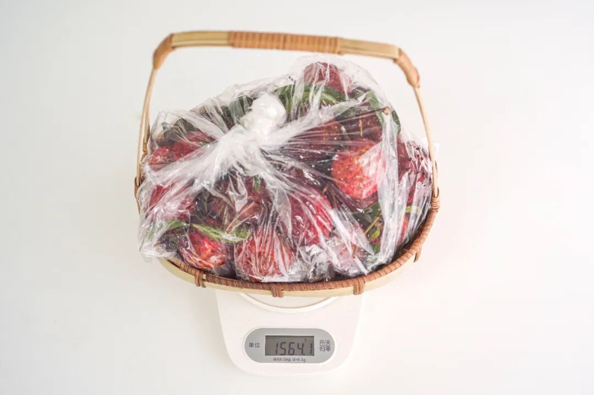

PS：海南荔枝王，运费是没有补贴的。

而且海南人民也不想卖给我们。。。

可能因为水溶蛋白少，

海南人民认为它「吃了不上火」，

就永兴的产量，优级果都是出来就被抢光的，

送老师送领导送病人。。。

所以确实不便宜，

看你要不要尝这个「和鸡蛋一样大」的鲜荔枝了！

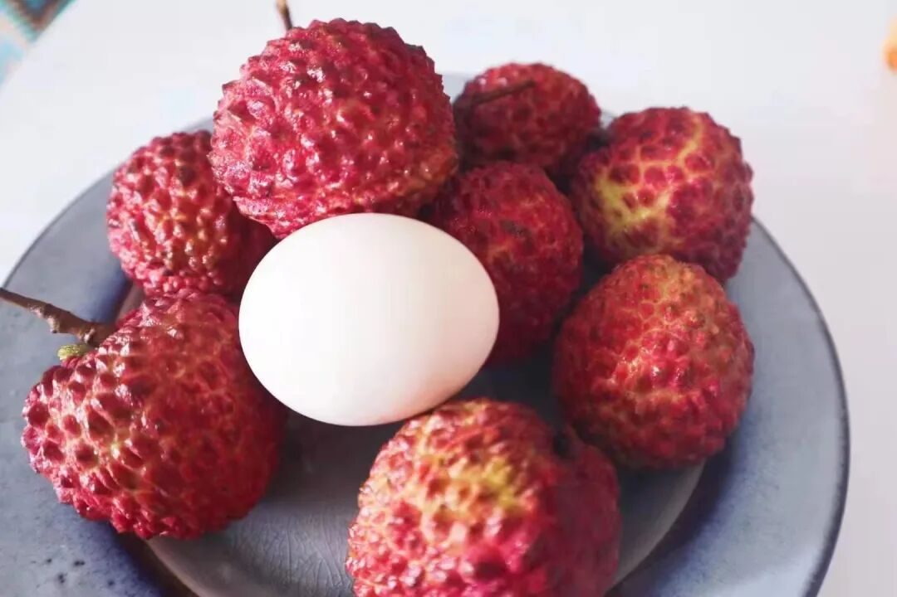

但咱退一步想，

以前一骑红尘、千门次第开的奢侈，

一般人搞，就是僭越！

现在花几十块就行！

总之，

今年的超强荔枝季，

从这里拉开帷幕了！

限时早鸟 86 折！

想吃的趁这一周速冲！

饱记·海南永兴火山荔枝王

现货中！！！

限时早鸟 86 折！！！

戳图买它👇

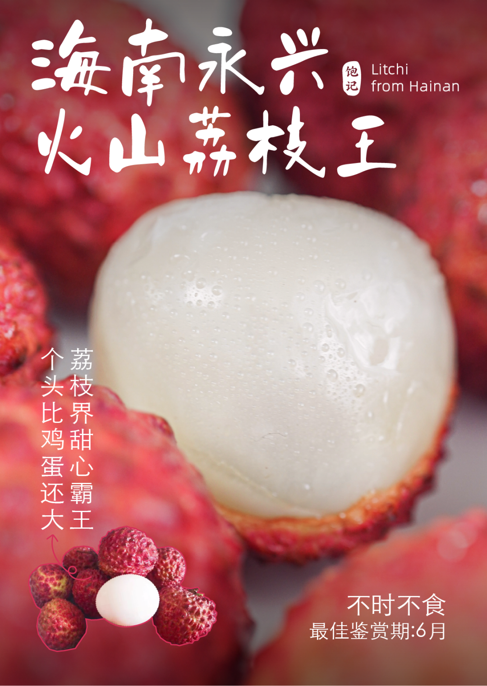

题 外

朋友们！！

本薯还有折扣奉上！

天🐱618活动又又来了，

我司直截了当打折！

🍑平台全场 85 折！

以下为有赞折扣直通车！

本月份的海南椰子鸡！

比外面餐厅还好吃！

给大家限时闪购 5 天！

如果你还想趁此机会囤好茶，蒙顶甘露&梅家坞龙井，单件 86 折两件 8 折！突然熟了的云南西红柿，配鸭蛋炒正正好，是小时候阳光里长大的浓郁番茄味儿，
限时早鸟 86 折！！拿过上海金奖的金山小皇冠西瓜，

爆汁清甜还有瓜鲜味！

也拿过上海金奖的金山小番茄，

难得回归的泰国超甜多汁金柚，

卷中卷红玉芒果，

娇艳可人的雷州木瓜，

现在都有限时活动 86 折！

饱记·海南椰子鸡

限时早鸟 86 折！！！

限时闪购 5 天！

预计 6.14 发货

戳图买它👇

饱记·多汁泰国金柚

购买方式如下

限时吃水果 86 折！！

戳图购买👇

饱记·梅家坞龙井&蒙顶甘露限时单件 86 折！！！两件 8 折！！

戳图购买👇

饱记·金山小皇冠西瓜

购买方式如下

限时早鸟 86 折！！！！

戳图买它👇

饱记·云南西红柿

购买方式如下

限时早鸟 86 折！！

戳图购买👇

饱记·金山五彩小番茄购买方式如下限时 86 折！！
戳图购买👇

饱记·海南红玉芒果购买方式如下限时吃水果 86 折！！！
戳图购买👇

饱记·湛江雷州木瓜

购买方式如下

限时吃水果 86 折！！

戳图购买👇

本文的研究员

薯角我想我知道夏天的味道

用好吃的方式吃一生

祖国各地好风物

文章转载请加微信「baojiclub」

