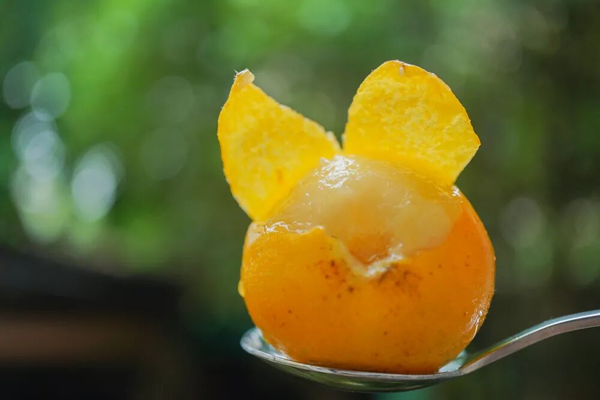
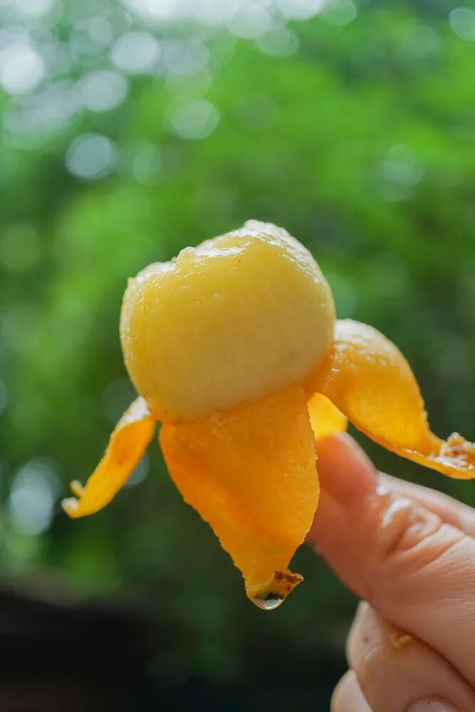
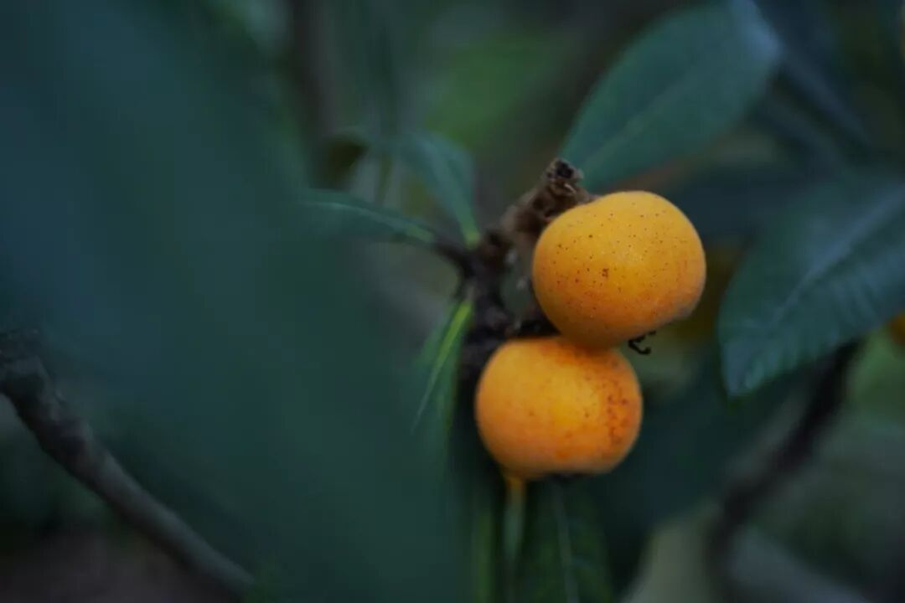
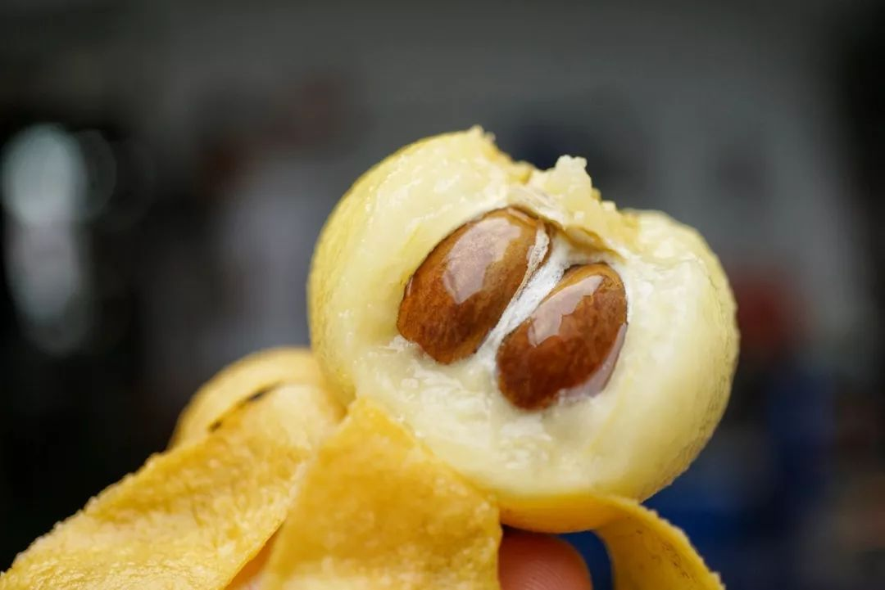
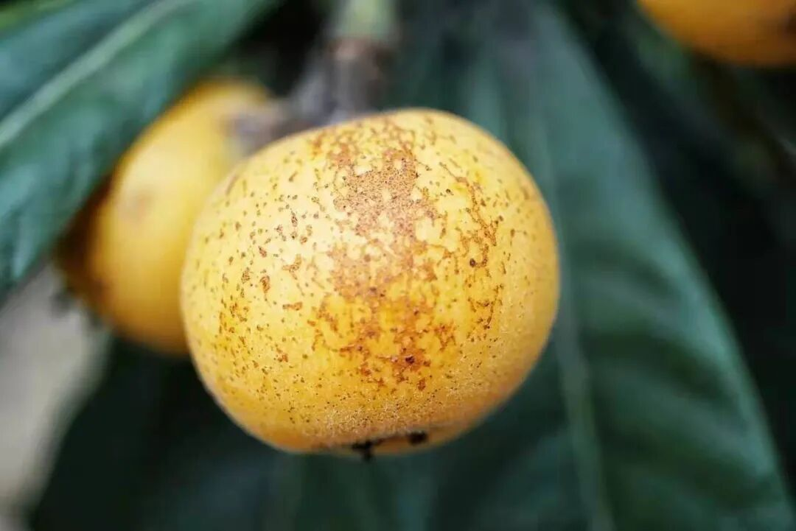

# 姑苏东山有白玉，只剩最后两天

- 原文链接: https://mp.weixin.qq.com/s?__biz=MjM5NTYxODQyMA==&mid=2653471103&idx=2&sn=b44f614f2e1c292db995bcce21ad6b42&chksm=bc5b27869352db4b21b33c4cbff5327ce1daaff28e0bd11752511d9666611670746ba8bcdefc&scene=27#wechat_redirect
- 浏览量: N/A
- 点赞数: N/A
- 评论数: N/A
- 转发数: N/A

## 正文

吃完又等一年

一个尽情安利自我的公众号

以下是没事干研究院的风物研究报告请放心食用
大家伙盼了一整年的正宗苏州东山白玉枇杷！果期只剩最后两天！29 号下午截单，卖完明年见啦！

好好好，这果子每年都吃不够！贴心如我，赶紧再来提醒一下，想吃的朋友们抓紧啊啊啊啊啊～最后一小批，吃完就没！

饱记的东山白玉枇杷，不是市面上那种大路货。连苏州本地朋友都不一定买得到。因为它一来自苏州东山山坡核心产区，二都是精选 20 年以上老树，所产枇杷风味更胜一筹，味道鲜甜，重点是果味超浓。

请看！第一批吃上的老客人们新鲜给出的好评👇

对比过市面上其他白玉枇杷，好几家甜是甜，但仅仅就是甜。果园大哥的原话是：你想要甜还不容易，
但要果味浓，才难呢。然后拉着我聊土地谈气候。。。

为什么饱记敢说自己的好？且听本薯再抄陈述一遍！只要吃到它，你就明白为啥这么一个果子，可以让人惦记一整年。

白玉枇杷到处有卖，为什么我饱记的值得等？

且听本薯来给你掰掰！
原因一：苏州枇杷数东山

东山枇杷，

因其得天独厚的自然地理条件

苏州人本来就觉得更好。

原因二：东山枇杷，又以山坡为佳

枇杷园产区还分山坡上与山脚下，

饱记只选山坡传统枇杷园。

它们产量更低，仅有固定的约两千亩

苏州当地称山脚下的平地果园为「池塘枇杷」，

是填平鱼塘而改，

数量十倍山上甚至更多，

但土质、阳光、树龄都远远不及山坡果园。

原因三：东山枇杷数双湾，

只给老客户，饱记第七年！

双湾村又是整个东山

最闻名遐迩的产区。

每年水果商贩都大量往村里跑，

但全村这一点点产量，

都给到了老客户，

饱记已是第七年！

原因四：老树枇杷才好吃！

饱记只用 20 年树龄以上的老树！

叠加原因一二三。。。

我饱记的东山枇杷品质，

确实苏州人都不一定买得到！

好了。不多说。今年准备了 3 个规格：中果尝鲜，大果满足，特大送礼最佳！强调一下，中果不仅风味不减，且大概率还更为鲜浓哦～

今年果园减产，果子普遍偏小一些，最小的中果规格，果味最浓！送人的话特大果则包体面！PS：25g+的特大果是果园独家留给我司的，产量极为有限，最容易吃没～珍惜！

每箱称重净重 1400g±100g，一颗颗都给你放在这种格子里。
如果格子没满，不是没装满，是净重已达！

最后讲一下存储：饱记照例要求按熟度阶梯发货。
最熟的，像这样颜色深黄，到手就吃！

不要多洗，剥皮就吃！枇杷沾水味道会淡！！

熟枇杷到手就吃，最多放一天。其它在避光常温（摄氏 15-23 度）通风处保存，
整箱 3-4 天吃完！！！如果表面还有小绒毛，不是发霉，是枇杷本身的哦～

有一些枇杷表面会有褐色斑点，这叫日晒斑。是糖分累积的表现，只会更加甜！不售后～～～～～

行了行了，剩下的你们自己看商详！果期太短照旧限时早鸟 86 折！总之，果子越小越浓甜！果子越大越饱满！大家按需挑选抓紧吃！

饱记·苏州东山白玉枇杷

购买方式如下

限时早鸟 86 折！！

戳图购买👇

题 外

朋友们！！！

天🐱618活动规则搞不来

我司都是直截了当打折！大家速冲！

今年的饱记粽子！限时吃粽 88 折！突然熟了的云南西红柿，小时候阳光里长大的浓郁番茄味儿，
限时早鸟 86 折！！

还有些只有最近这一阵可吃的水果👇

拿过上海金奖的金山小皇冠西瓜，

爆汁清甜还有瓜鲜味！

也拿过上海金奖的金山小番茄，

难得回归的泰国超甜多汁金柚，

瓜肉软糯的翡翠冰淇淋甜瓜，

无渣不麻嘴的海南金钻凤梨，

连盐水都不用泡。

卷中卷红玉芒果，

娇艳可人的雷州木瓜，

现在也有限时 86 折！

饱记·口碑湖州大粽预售中

现货中！！！

限时吃粽 88 折！！！！

戳图买它👇

饱记·金山小皇冠西瓜

购买方式如下

限时早鸟 86 折！！！！

戳图买它👇

饱记·云南西红柿

购买方式如下

限时早鸟 86 折！！

戳图购买👇

饱记·多汁泰国金柚

购买方式如下

限时吃水果 86 折！！

戳图购买👇

饱记·金山五彩小番茄购买方式如下限时 86 折！！
戳图购买👇

饱记·翡翠冰淇淋甜瓜购买方式如下限时吃水果 86 折！！
戳图购买👇

饱记·花香脆甜蓝莓购买方式如下限时吃水果 86 折！！
戳图购买👇

饱记·海南金钻凤梨

购买方式如下

限时吃水果 86 折！！

戳图购买👇

饱记·海南红玉芒果购买方式如下限时吃水果 86 折！！！
戳图购买👇

饱记·湛江雷州木瓜

购买方式如下

限时吃水果 86 折！！

戳图购买👇

本文的研究员

薯角我想我知道夏天的味道

用好吃的方式吃一生

祖国各地好风物

文章转载请加微信「baojiclub」

