# 它怎么悄悄变好吃了。。。

- 原文链接: https://mp.weixin.qq.com/s?__biz=MjM5NTYxODQyMA==&mid=2653463921&idx=1&sn=540ed51cb0257bea6f92058f9d5902d5&chksm=bc4f10a72626e9dfd2468ad706189c60ebfe0c51c0471129501a9d4d3bb3a35f9f034f7790d9&scene=27#wechat_redirect
- 浏览量: N/A
- 点赞数: N/A
- 评论数: N/A
- 转发数: N/A

## 正文

大吉大利

一个尽情安利自我的公众号

以下是没事干研究院的风物研究报告请放心食用
最近又从这司薅到一样好吃的，发自心底想感叹一句：谢谢，各位农林研发人！如果没有你们，我薯角哪能过上这好日子？

为啥这么说呢？因为这一枚来自广西融安的脆蜜金桔。足以颠覆自小到大的金桔风味印象！不麻嘴，不涩口，
从皮到芯都纯甜！

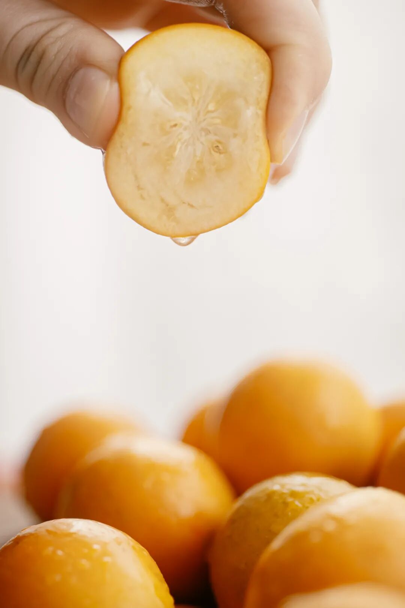

金桔界的第三代稀有品种，口感和以往吃过的都不同，
没有入口就让人龇牙咧嘴的桔皮味，从芯子到脆皮都是蜜蜜甜的。

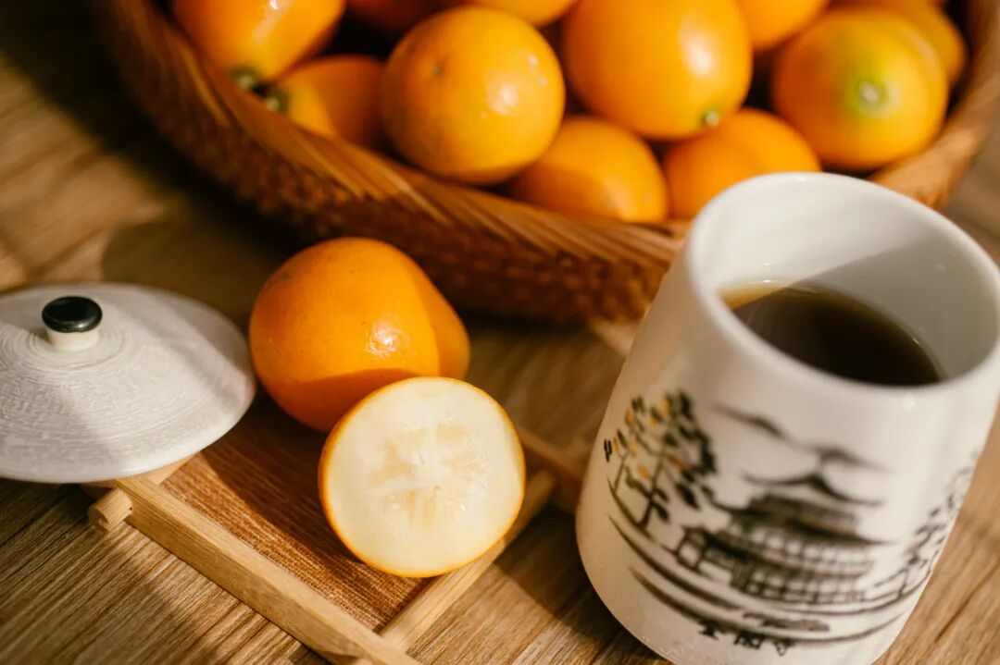

皮脆薄，肉厚，且无核化渣！
一咬 biu 汁，超鲜爽，像在啃冰糖心的小苹果，越吃越稀罕~

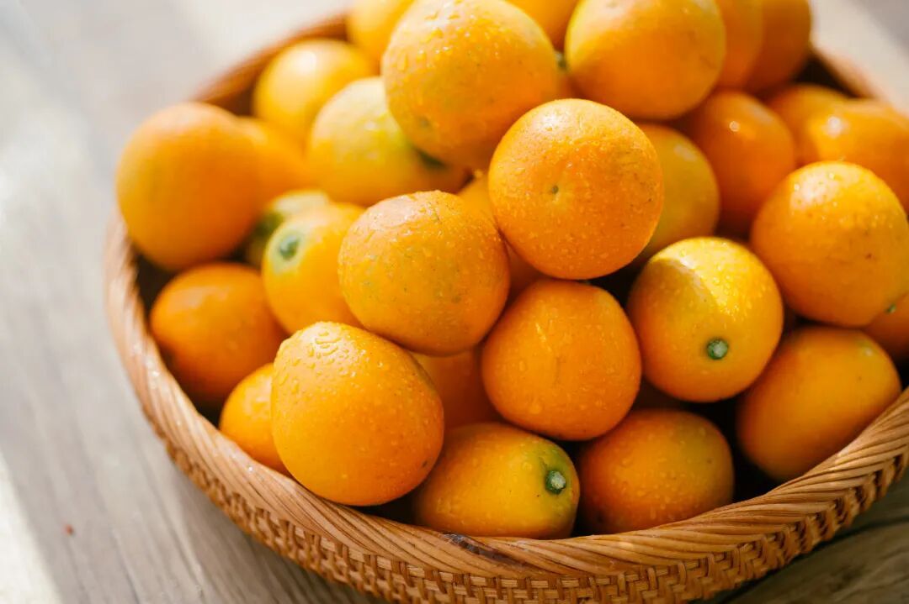

感谢广西山水和科学家，经过了七年的选育，让金桔果子不断优化，这才有我们清甜小炸弹第三代。

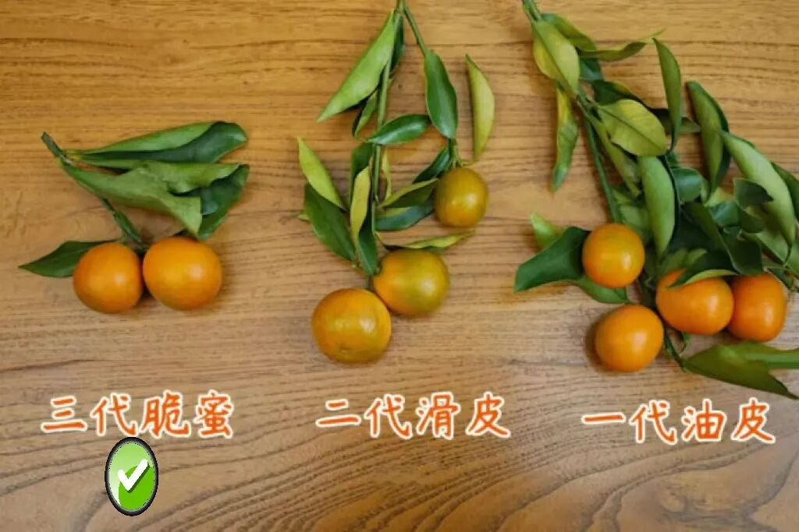

一代油皮金桔：桔皮又粗又麻嘴，小时候苦着脸尝过的味道，就是它。不适合直接吃，现在都拿去加工。二代滑皮金桔：滋味清甜，清爽型，金桔香显。三代脆蜜金桔：身型梨状，蜜甜型，近这几年才出现的，产量非常小。
虽名为脆蜜金桔，外表并不是整颗都灿黄哦，它也是会带绿的。但是每一颗果子，从皮到芯都可以直接啃着吃，糖度能达到 20 以上。

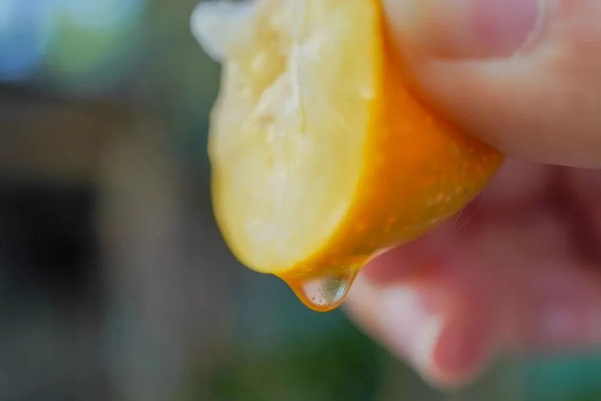

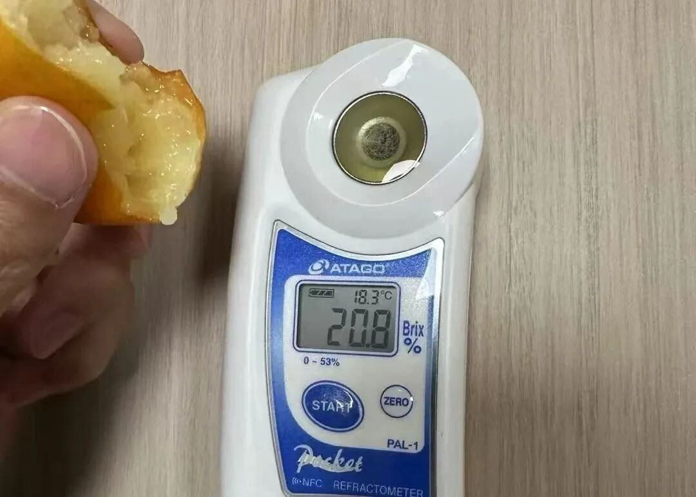

也许你在 X 果园买过，也许你在 X 马买过。但不重要，薯角我也都买过。还是骄傲地说，饱记的生鲜水果，是一定要保持所有渠道随便比的程度！

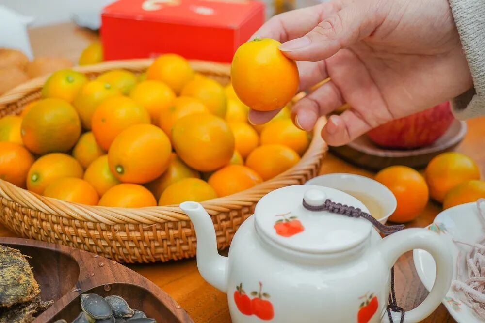

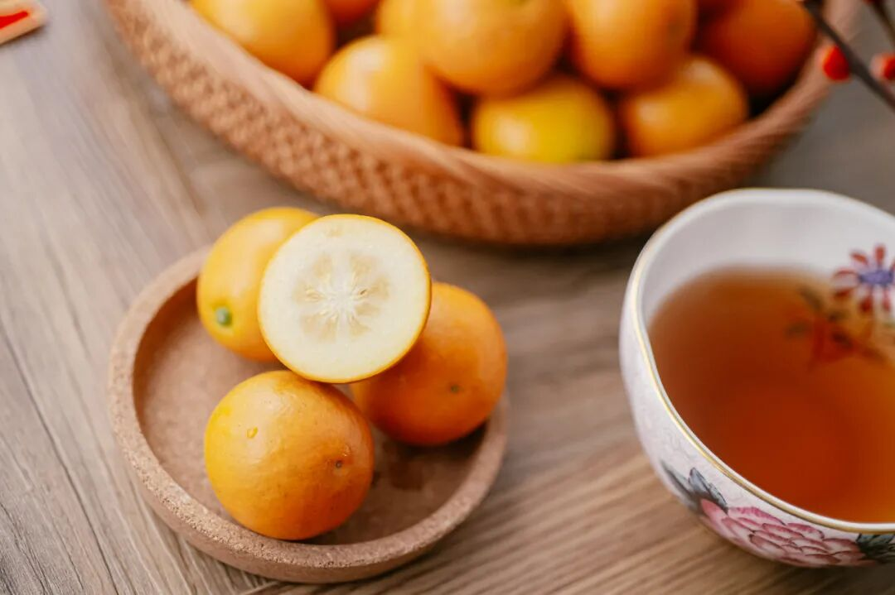

不过无论什么品种，要好吃还是得靠精筛！为了这份好口感，我司永远会去卷产地，只卷核心产区的精品果园！融安金桔这家能入选，也是因其风土、品种与管理。

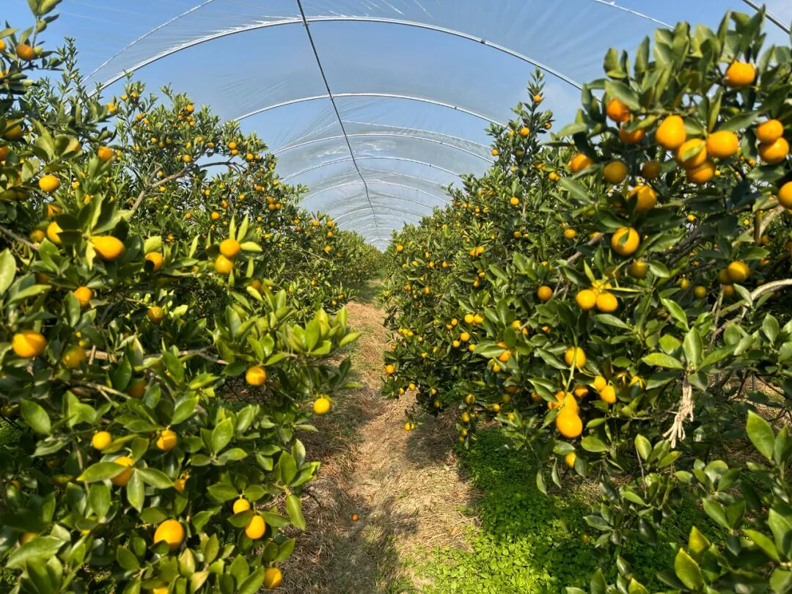

它是融安县第一个

成功种出脆蜜金桔的果园（母本园），

果园里都是 8+ 年老树，

保证品种纯正果味浓。

老树果园平时都得上锁，以防被盗，这枝条在外一斤能卖 ¥1000！

脆蜜金桔要好吃，

既讲究种植技术和气候，也看枝条来源！

非母本园的果子，

就有更大的可能性不甜麻嘴、无水分，

吃完还要吐渣。

而我司卷的果园直接跳过这部分烦恼，

获得过柳州市脆蜜金桔优质果品质量评比“特等奖”。

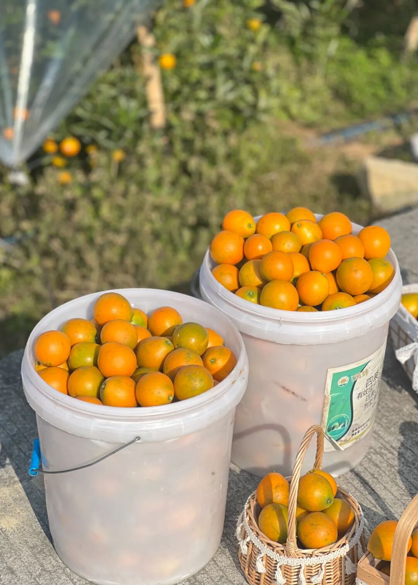

讲究科学化种植，施有机肥，

老人小孩都放心吃啊！

每一颗果子发出前，还要经过两道人工筛选，只发好果！

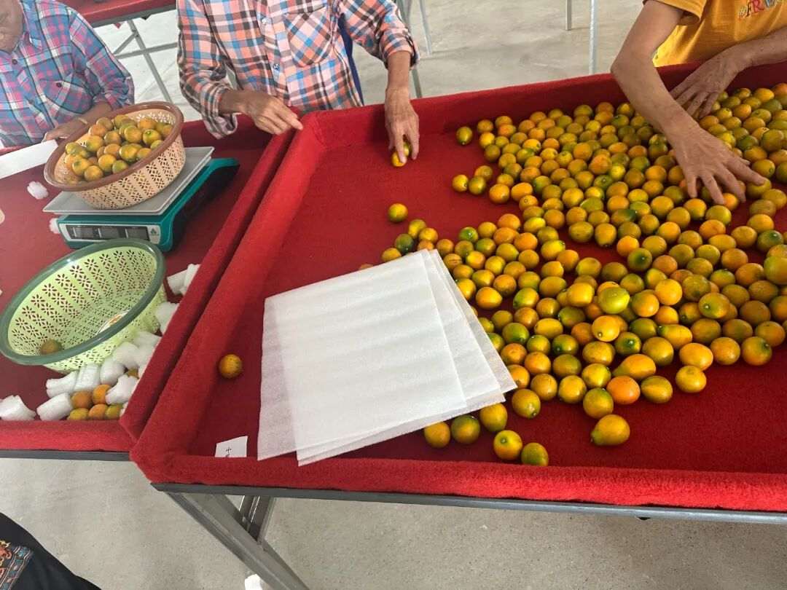

果子分为 4 种规格，越大越稀有！一口一颗，十分爽口，吃起来特别容易上瘾！

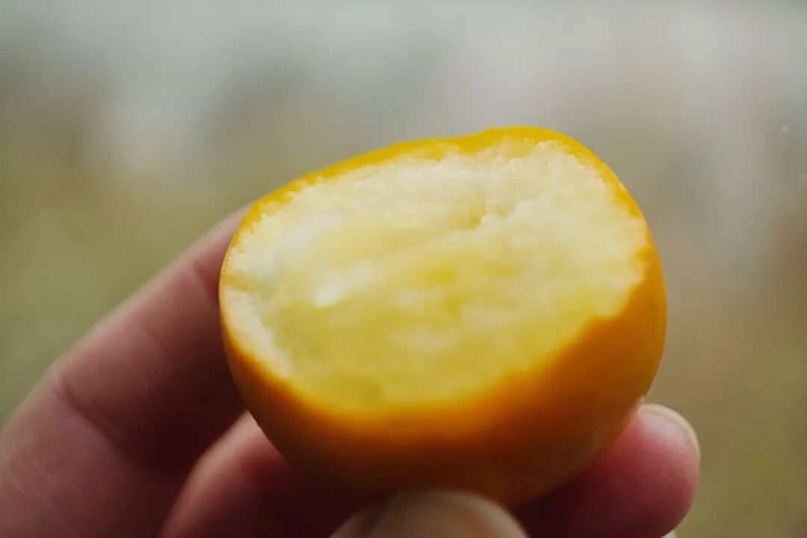

老规矩，给大家吆喝来限时早鸟 86 折，这果子好吃还有好寓意，送礼自留两相宜，买它！！！

饱记·融安脆蜜金桔购买方式如下

限时早鸟 86 折！！！

戳图购买👇

题 外

还有还有！

适合暖气房、空调房吃吃的水果看这里👇

上周刚到的广西双拼芭乐，

扎实的冰激凌球口感！

涌泉蜜桔，米其林同款！

但价格却帮大家打了下来！

真正的汁水如泉涌！空调房里吃正合适！

此外还有今年份的象山红美人，

入口似果冻般嫩嫩滑滑～

都给大家薅一个冬日甜润水果 86 折！

只到本周五！

此外本月该抓紧时间吃的大闸蟹，

今年包邮区两个宝藏产区！

苏南蟹标杆美味：太湖流域大闸蟹

苏北蟹宝藏性价比之选：洪泽湖大闸蟹

趁这会儿蟹肥膏满，冲！

坚持真材实料、天然肠衣的手工腊肠，
能做煲仔饭和火锅的玫瑰露酒腊肉&腊排骨

还有打遍天下无敌手的山核桃！

我司卷中卷产品，
拿到外面去都能打得很！
饱记·广西双拼芭乐购买方式如下限时吃水果 86 折！！！
戳图购买👇

饱记·涌泉蜜桔
购买方式如下限时吃水果 86 折！！！
戳图购买👇

饱记·象山红美人柑橘购买方式如下限时吃水果 86 折！！！
戳图购买👇

饱记·洪泽湖大闸蟹

购买方式如下

满足装洪泽湖大闸蟹：

3 两母蟹，4 两公蟹。

性价比之选！

劲爽装洪泽湖大闸蟹：

3.5 两母蟹，4.5 两公蟹。

饱记热销款。

尊享装洪泽湖大闸蟹：

4 两母蟹，5 两公蟹；

或 5 两母蟹，6 两公蟹。

实际超重，量极极极少，送礼佳品。

人工精挑，

上岸后静养一两日更鲜美，

每日限量 100 箱。

顺丰快递发货，新鲜看得见。

戳图下单购买👇或🍑🍑🍑搜索「艾格吃饱了」

饱记·太湖流域大闸蟹

购买方式如下

三种搭配：

满足装，

3-3.4 两母蟹，4-4.4 两公蟹，

吃过解馋。

劲爽装，

3.5-3.9 两母蟹，4.5-4.9 两公蟹，

可以拍照发朋友圈争奇斗艳。

尊享装，

4-4.4 两母蟹，5-5.4 两公蟹，

顶格水准，适合送礼。

人工精挑，

上岸后静养一两日更鲜美，

每日限量 50 箱。

拼的就是手速。

顺丰快递发货，

新鲜看得见。

戳图下单购买👇或🍑🍑🍑搜索「艾格吃饱了」

饱记·手工腊肠

购买方式如下👇

戳图下单购买👇

或🍑🍑🍑搜索

「艾格吃饱了」

饱记·腊排骨

购买方式如下👇

戳图下单购买👇

或🍑🍑🍑搜索

「艾格吃饱了」

饱记·临安山核桃

购买方式如下👇

戳图买它👇

或到🍑🍑🍑

搜索「艾格吃饱了」

本文的研究员

薯角多吃点，好过冬

用好吃的方式吃一生

祖国各地好风物

文章转载请加微信「baojiclub」

