# 实现草莓自由，周末我们在这里等你

- 原文链接: https://mp.weixin.qq.com/s?__biz=MjM5NTYxODQyMA==&mid=2653464386&idx=1&sn=7397de31c0fddccd35dc9e46ba55bda0&chksm=bc756ec237956cadf1ef55555cc05ed96ad05df8b4f44c3cc37b5242f60b09185f6ab191beca&scene=27#wechat_redirect
- 浏览量: N/A
- 点赞数: N/A
- 评论数: N/A
- 转发数: N/A

## 正文

快来和我们见面！

一个尽情安利自我的公众号

以下是没事干研究院的风物研究报告请放心食用
新年到来之前，和我们见面吧！本周末在上海徐汇区天钥桥路口袋公园，我司为上海农业展览馆承办的上海地产优质农产品市集。有吃有逛有玩，还有时令草莓吃到饱！

拿过国家级金奖和上海市级金奖的草莓，

有绿色食品认证，

颗颗都饱满红艳，

咬一口香甜又多汁～

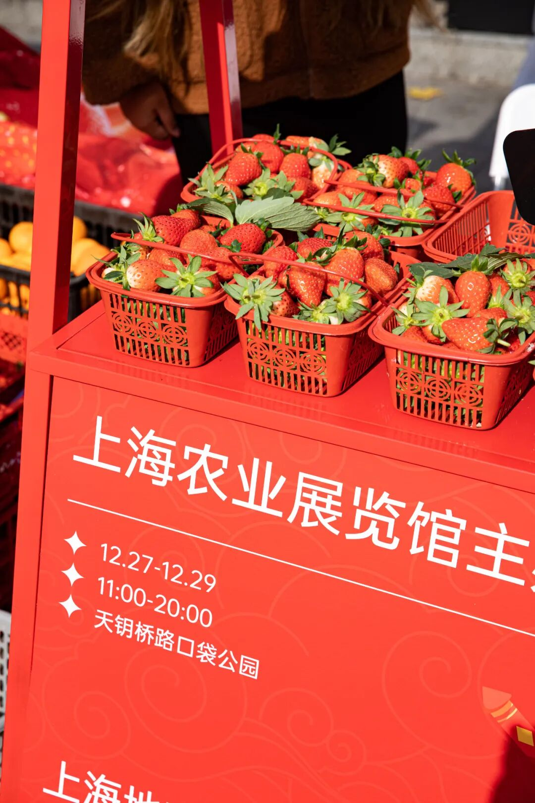

来了就可以试吃！

只要从旁边经过，

就能闻到一阵草莓甜香，

好香好香好香～

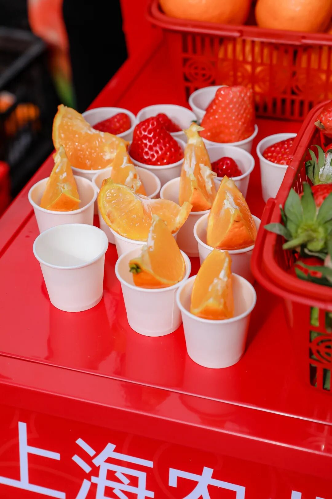

还有供给多家米其林餐厅的金奖羊肉，

没有膻味，

肉质细嫩多汁！

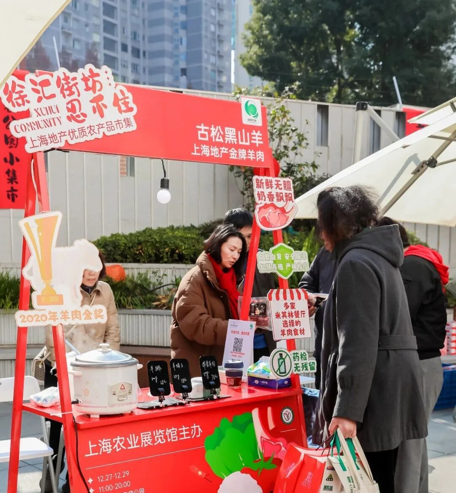

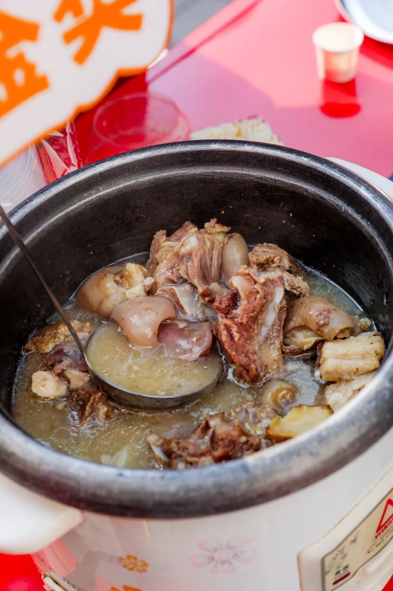

现煮一大锅，

老板超大方，

试吃直接按碗给！

（少食座直接饱了。。。

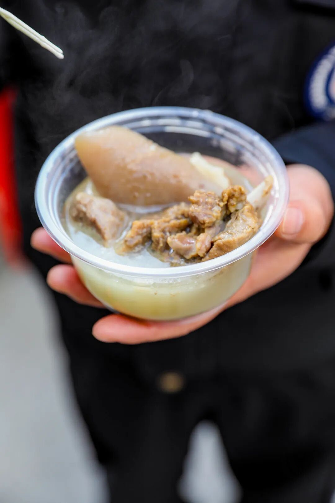

闵行大米，

曾获 2022 年中晚熟大米金奖，

入口软糯有嚼劲不粘牙，

还有一点点微微甜意，

也是现场直接吃！

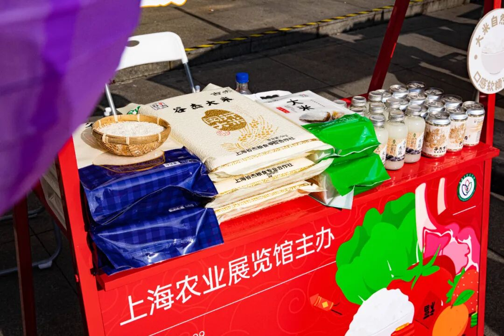

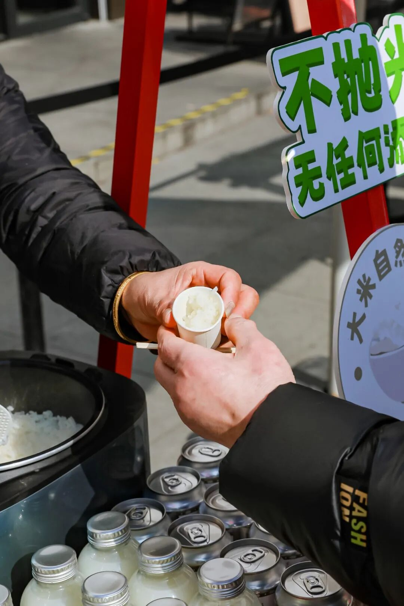

还有各种新鲜蔬菜水果，

有小时候味道的浦东番茄，

以及自家散养鸡下的蛋👇

样样有来头！

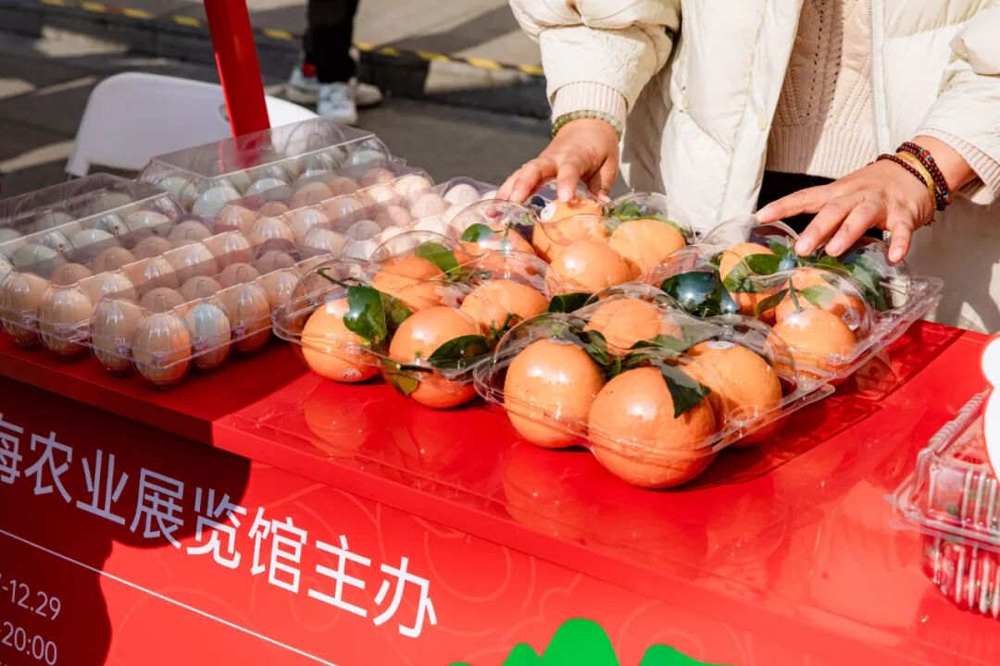

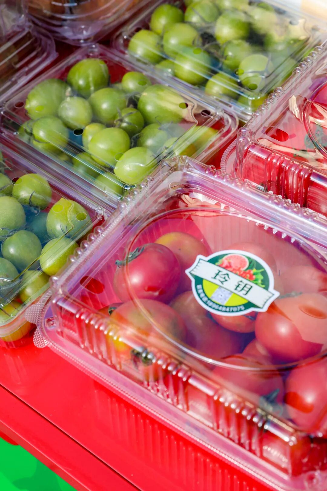

上海农业展览馆为地产优质农产品

举办各种展会、品鉴宣传推介活动。

比如「上海市地产优质农产品品鉴评优」活动，

就是从全上海几百家合作社中，

选出最新鲜好吃的农产品。

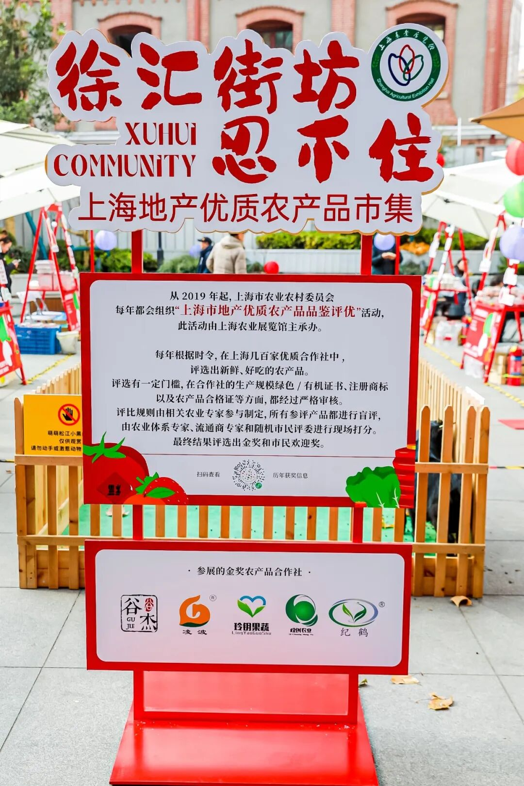

现场的各类产品，

都是各个区精心培育选拔出来的小骄傲，

周末买了自家吃吃正合适！

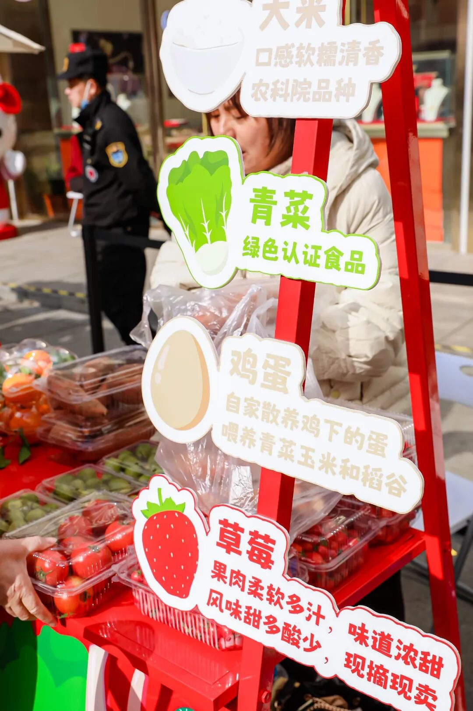

吃吃逛逛，

还可以 rua 两只小羊👇

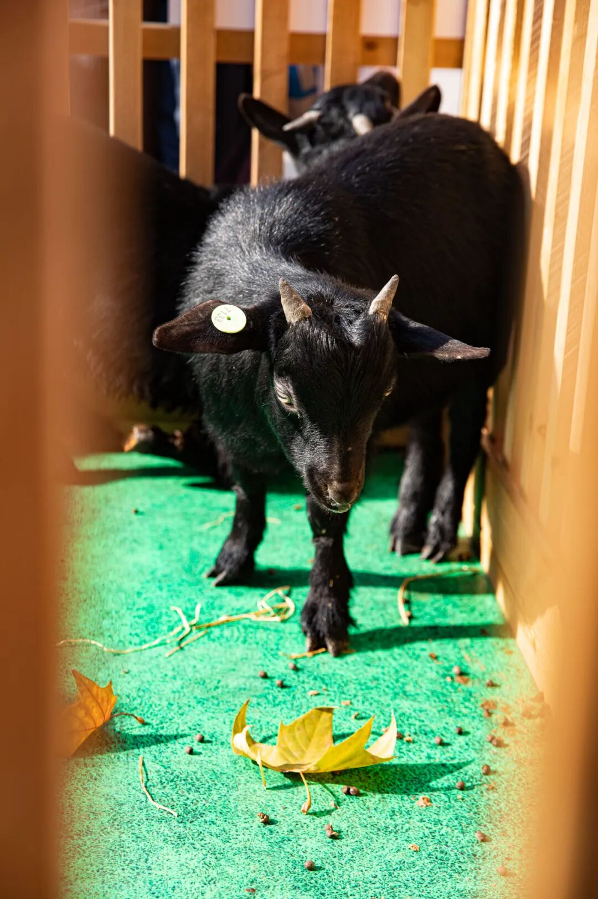

或者和朋友、家人猜猜灯谜，答案可在服务台询问哦！

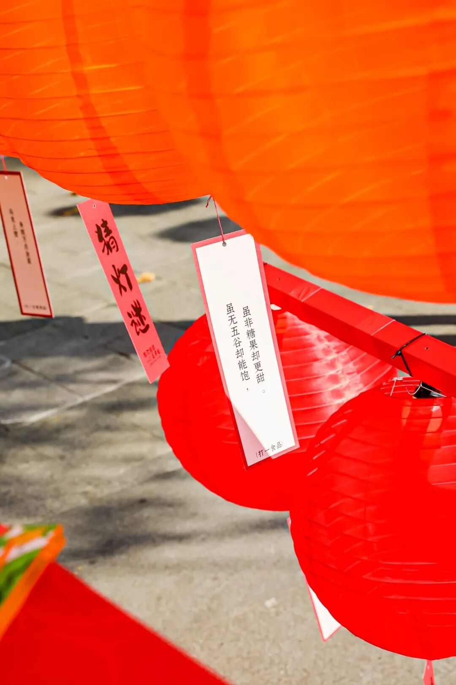

还有免费金奖大米领👇每日限量打卡，分上午场和下午场！

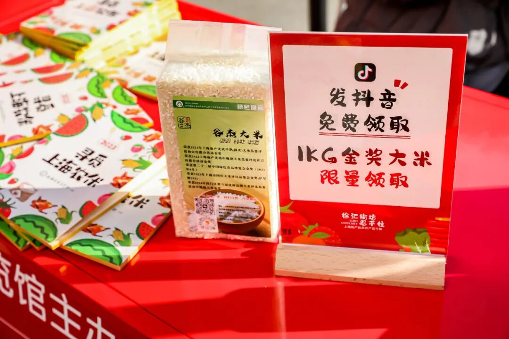

虽然现场都有大方试吃，但根本忍不住剁手，一盒接一盒，同事也抱了一大堆回家。别宅了，快出来玩！

本文的研究员

薯角多吃点，好过冬

用好吃的方式吃一生

祖国各地好风物

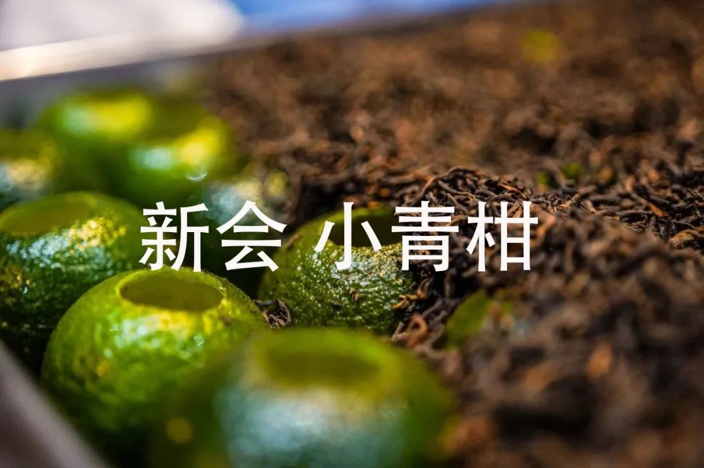

文章转载请加微信「baojiclub」

