# 就喜欢这种大厨不顾人死活的店。。。

- 原文链接: https://mp.weixin.qq.com/s?__biz=MjM5NTYxODQyMA==&mid=2653471103&idx=1&sn=f3226e4e18b796c266c0b7320de4a808&chksm=bc3c972a97d9424381c5491df767c556c960902400347e80e7525daf5471fbd7e3a27fd87c86&scene=27#wechat_redirect
- 浏览量: N/A
- 点赞数: N/A
- 评论数: N/A
- 转发数: N/A

## 正文

神奇

没有广告软文

所有消费笔记均经多次匿名测试请放心食用

最近偶然吃到一家「居酒屋」，

第一次去吓得我。。。。

因为我把菜单上所有的价格刺客

都精准地点了一桌。。。

埋单时服务员说首次来有个点评 84 折券

才敢去了第二次。

但第二次后渐入佳境，

连吃六七次才来写hh

主厨明显法餐出身，非常努力和坚持。

菜单上你既能看到这种海盐毛豆，

18 块一大盘！

用黄油烤过的，焦香豆子嫩！

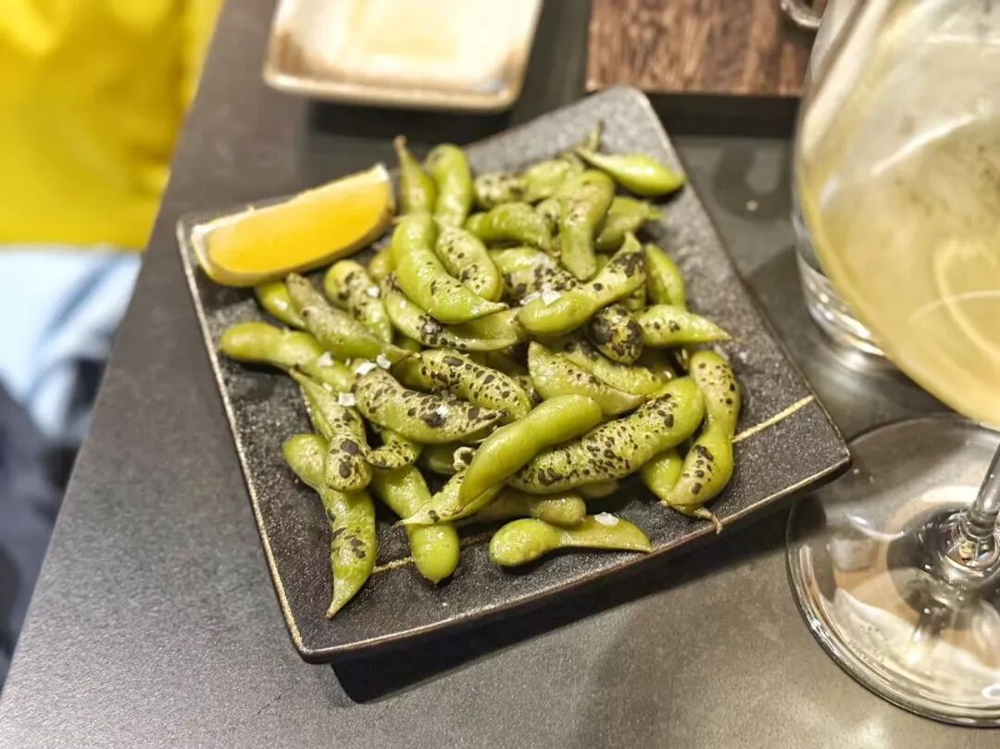

主菜里的 300 天澳洲西冷

加整根牛骨髓，

才开 288 块。。。

肉应该有简单熟成，

五分熟和肉香都极到位～

再加上他们 118 元畅饮的葡萄酒单，

像我这种酒蒙子一次点三四杯

法国的维欧尼、宁夏的霞多丽，

酸度香气矿岩味一个不缺，

岂不等于老板搞不好要倒贴？？？

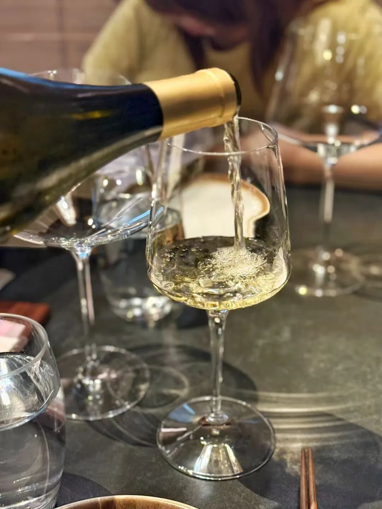

梧桐区正常价位的菜也有，

但有明显好吃到！

比如这个 68 块的花菜排，

虽然主要食材是花菜不贵，

但是这么大枝又很嫩，而且酱汁明显是

加了很多很多浓缩牛肉汁的，

又香又赞～

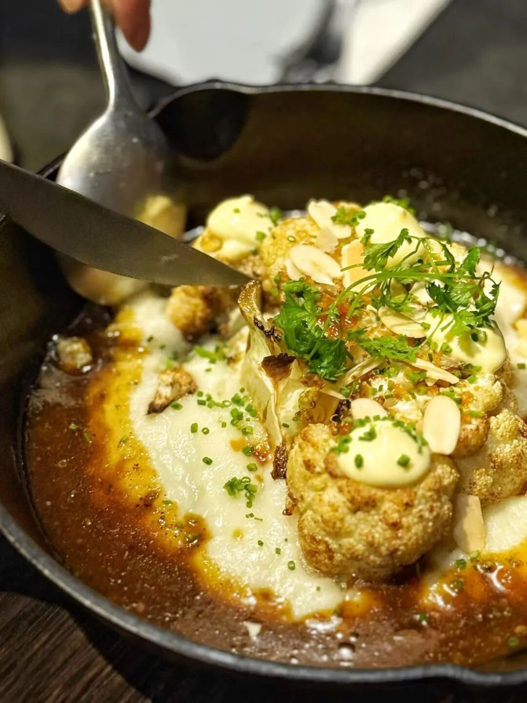

蔬菜里有还有一个便宜的烤芥兰，

配的蛋黄酱和烤香的洋葱片，

是我和广东大厨去吃人家都赞许的！

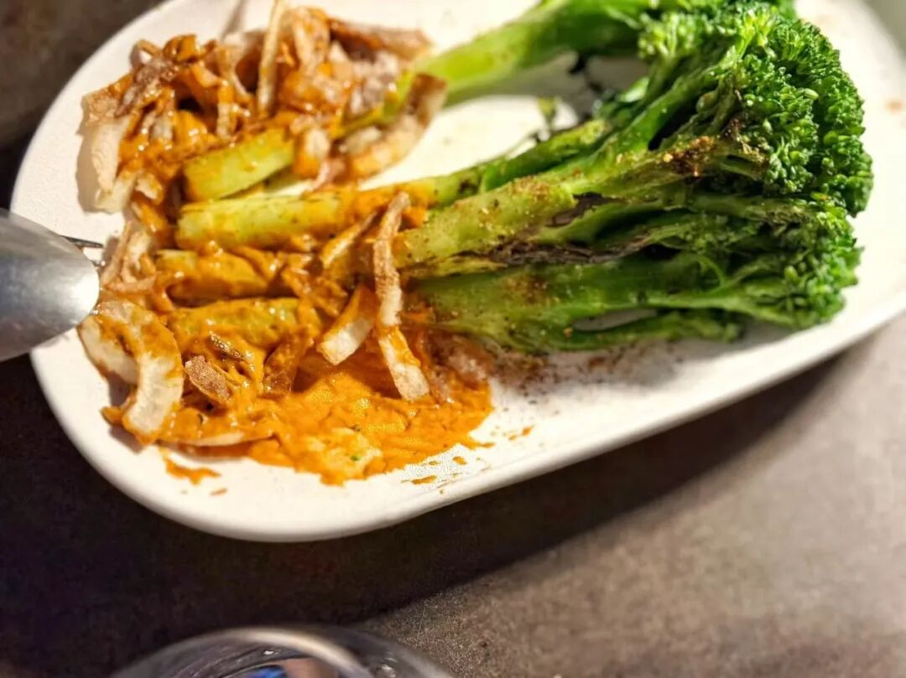

这个 98 元的牛肝菌意面，

酱汁调得我对主厨的基本功是佩服的！

非常非常香，我一人轻松干一盘。

问了，说意面不是手工的。

我就想问，谁拦着主厨了？？？

不要纠结，这种宽面有什么难的？

鸭蛋硬麦粉现揉现压一下，

手工一切，加 20 块上去我可！

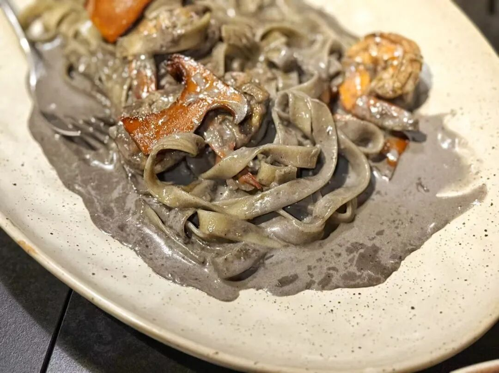

以及别忘了这个活杀现烤白烧鳗鱼饭，

是好吃的，打包带回去都好吃！

法餐功底的日本料理，

现在本来就是全世界认可的餐饮方式，

连很多法国大厨都在学。

但肯定没有亚洲主厨做得出色。

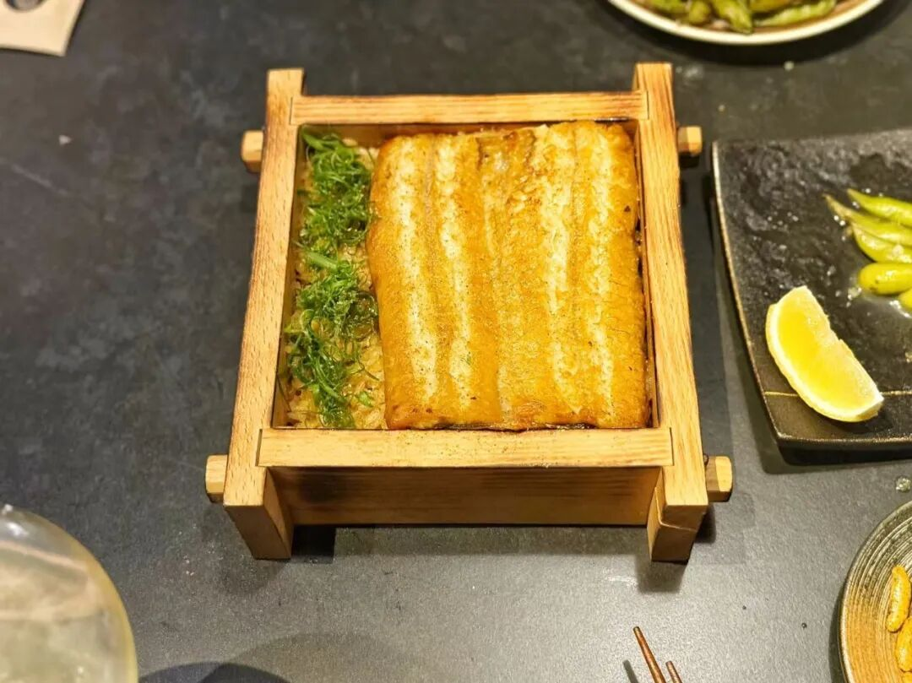

但是我精准点出来的价格刺客呢，

可能代表着主厨对厨艺的追求吧hh

比如这个烤鸽子，68 块。

上来小小半个。。。

（哈哈我这是两份

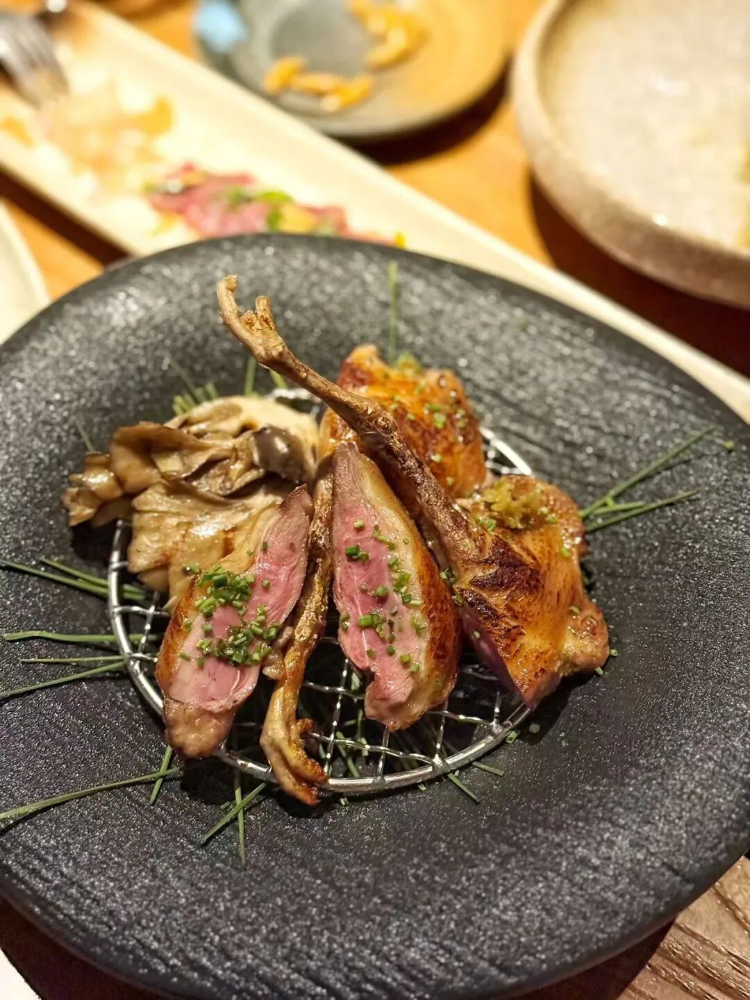

虽然下面垫了松针烤出香味

鸽嫩又入味，很香，好吃，

但我完全不会期待在一个有 18 块毛豆的

店里点到这种高级餐饮啊。。。

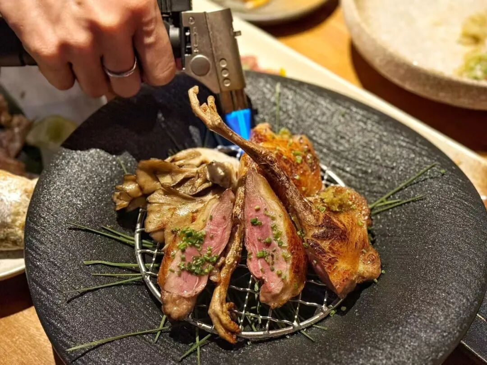

还有这个 58 块的茄子泥。。。

小小一坨，

你不要问，问就是：

主厨用了一整根茄子最精华的部分，

而且处理很复杂。。。。

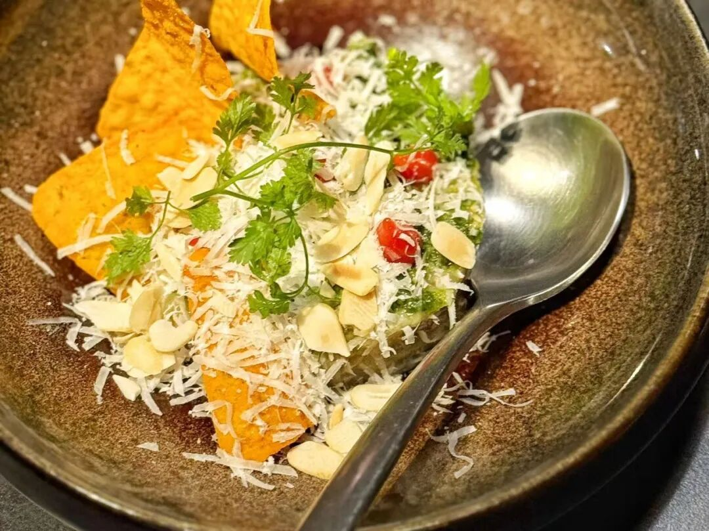

是的当时服务员一脸无奈的表情。。。

最搞笑的是，我提过意见后

甚至下次来更小了？？？？

但你别说，第一次有被吓到，

后面去吃得真得很开心！

比如这个 118 元仅 6 片的金枪鱼刺身，

西班牙金枪鱼出名筋多，

但主厨完全不计损耗，

给片到只有薄薄的最诱人的肥嫩位置，

带法餐功底的紫苏汁比日本人调得好多了！

二刷推荐hh

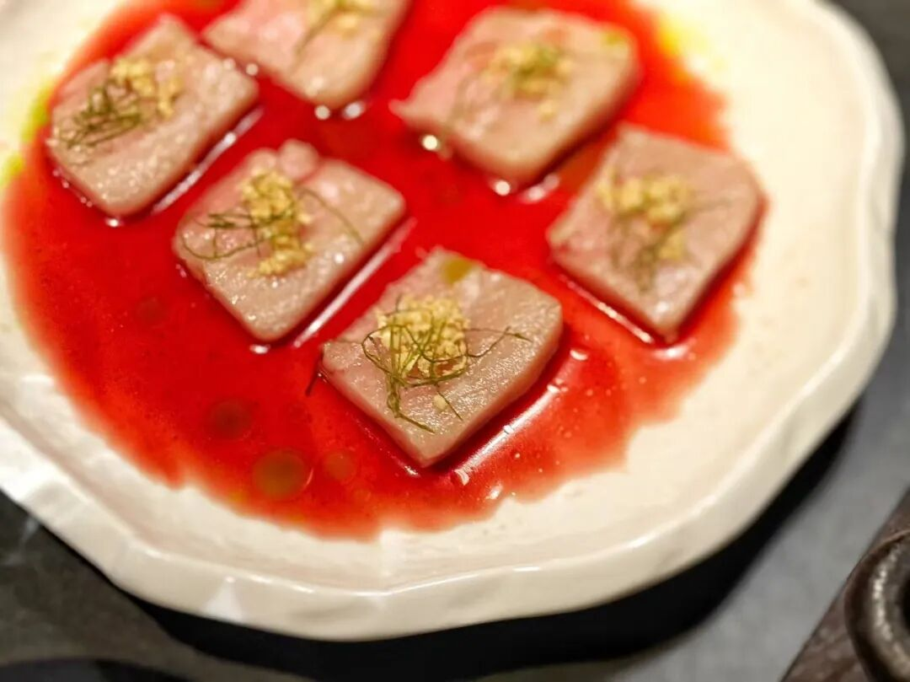

我第一次点了半份 68，上来只有三片，我：

其实后来发现，

能把主厨菜单上的价格刺客一次性点齐，

是我的问题。。。

因为我后来带薯角去，

她就只点了这一个：金枪鱼扇贝卷。

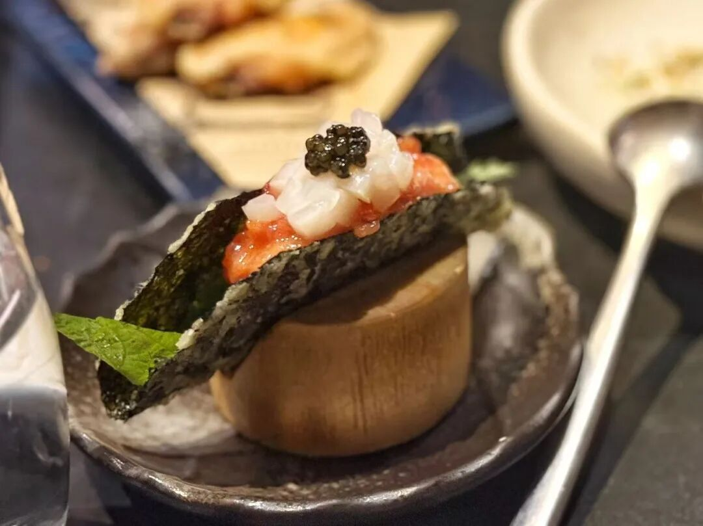

但是海苔外有天妇罗浆调味烤过，也比日本人精彩啊！

当时我们在讨论，

我也知道我们饱记粽子贵，

但成本就是高，也降不下来啊。。。。

比如顺丰冷链，

每份含冰袋平均费用要近 30 元。。。。

用急冻锁鲜工艺，普通 -18 度不能冻哦米会被冰晶撑破，要专门急冻设备做

还有那个敢说没人包进粽子里比我们好的蛋黄。。。

是独家的。

鸭子品种、吃和环境、蛋的大小和腌制天数，

全部是独家的。。。

不会卖给别家。

好了，当时薯角没说话。

但她的表情我领会了

因为我也不管顾客死活，

所以才这么喜欢这种餐馆吧。。。

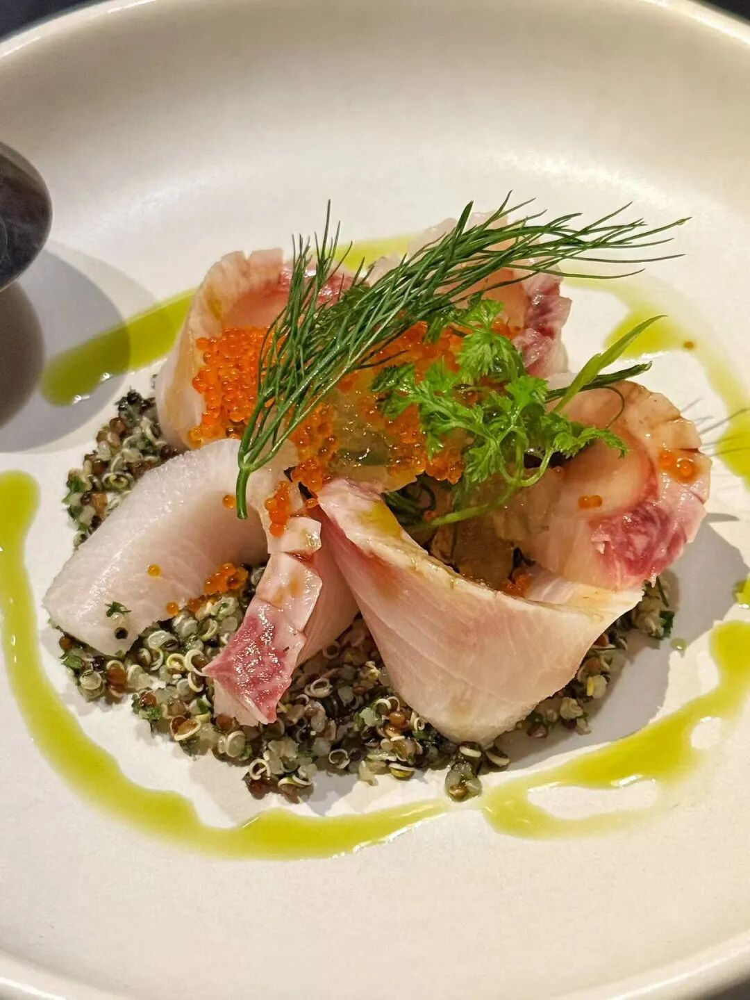

其它的一些刺身类，味道不错也不刺客，可以点

店名👇

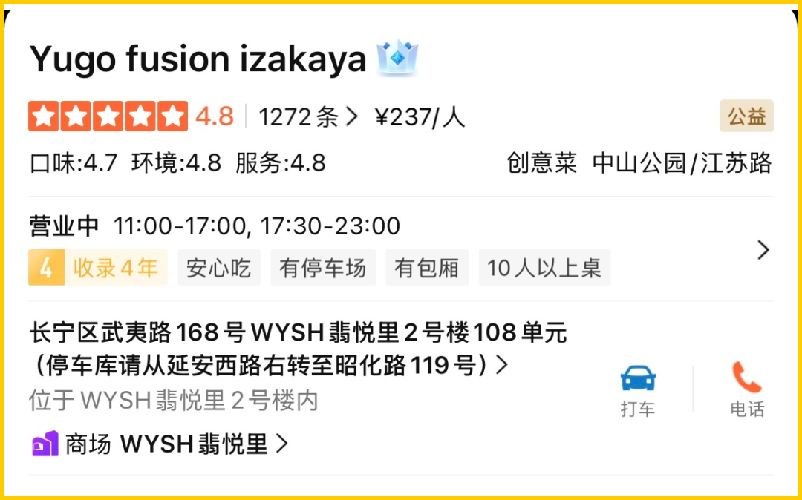

问过了，说评分完全没有运营，

有一千多条评论是之前在番禺路开了三年多，

刚搬到翡悦里。

放假到上海可以试一下，

在全上海的 bistro 界，

都是比较独特的存在。

题 外

朋友们！！要我说，

我司老板才是不顾人死活吧！！！

做粽子那会儿不计成本，

这下好了，

本薯卖粽不易啊啊啊啊啊！

但有一说一，

这些粽子都真材实料，

没有啥科技和狠活，

市面上的大家随便比没在怕的嘿嘿～

天🐱618活动今晚又开始了！

我司直截了当打折！

🍑平台全场 85 折！

今年的饱记粽子！限时吃粽 88 折！其他时令水果啥的，也都有限时 86 折！

饱记·湖州大粽&闽南葱香肉粽

现货中！！！

限时吃粽 88 折！！！！

戳图买它👇

饱记·苏州东山白玉枇杷

购买方式如下

限时早鸟 86 折！！

戳图购买👇

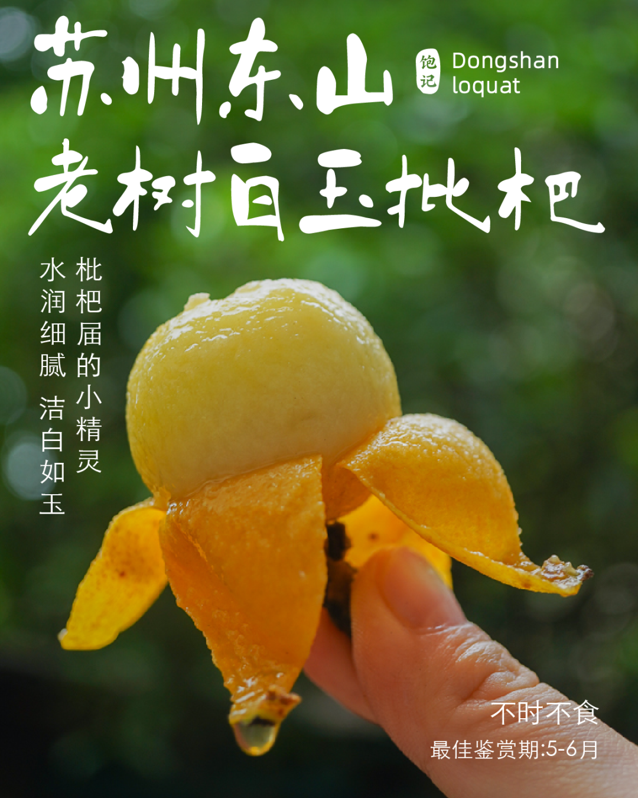

饱记·富硒白鹜鸭蛋

购买方式如下👇

限时吃蛋 86 折！！！！

戳图买它👇

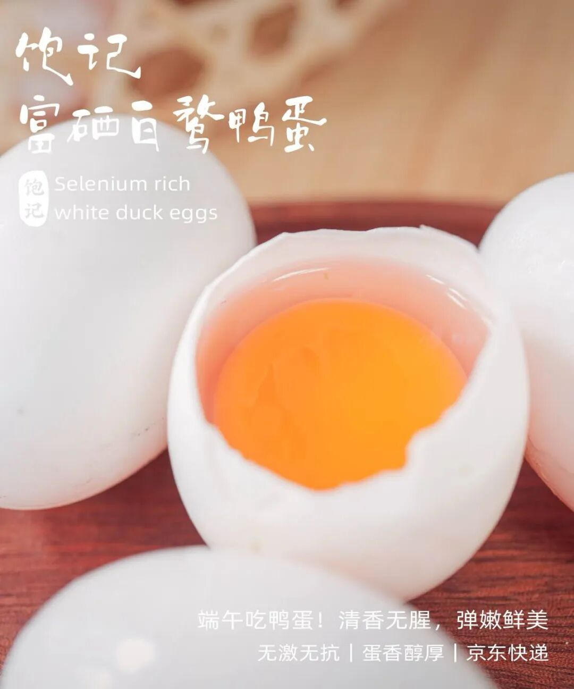

饱记·梅家坞龙井&蒙顶甘露限时单件 86 折！！！两件 8 折！！

戳图购买👇

饱记·金山小皇冠西瓜

购买方式如下

限时早鸟 86 折！！！！

戳图买它👇

饱记·云南西红柿

购买方式如下

限时早鸟 86 折！！

戳图购买👇

饱记·多汁泰国金柚

购买方式如下

限时吃水果 86 折！！

戳图购买👇

饱记·金山五彩小番茄购买方式如下限时 86 折！！
戳图购买👇

饱记·翡翠冰淇淋甜瓜购买方式如下限时吃水果 86 折！！
戳图购买👇

饱记·海南金钻凤梨

购买方式如下

限时吃水果 86 折！！

戳图购买👇

饱记·海南红玉芒果购买方式如下限时吃水果 86 折！！！
戳图购买👇

饱记·湛江雷州木瓜

购买方式如下

限时吃水果 86 折！！

戳图购买👇

本文的研究员

闻 佳就是那个研究院嘴里「挑剔的老板」。关于食物，不是比你懂得更多一些，只是比你花了更多的冤枉钱。

用好吃的方式吃一生

祖国各地好风物

文章转载请加微信「baojiclub」

