# 巨巨甜的咖啡杯，回归了。

- 原文链接: https://mp.weixin.qq.com/s?__biz=MjM5NTYxODQyMA==&mid=2653452100&idx=1&sn=71a2e94723e900b78a7f96c2bdeaf8b3&chksm=bcc8efd93d70bbc7fad5395140de8ca82e249bd417fa6bbbde9715d659b17f89847f592910c7&scene=27#wechat_redirect
- 浏览量: N/A
- 点赞数: N/A
- 评论数: N/A
- 转发数: N/A

## 正文

两个夯货！

一个尽情安利自我的公众号
以下是没事干研究院的风物研究报告请放心食用
巨巨甜的咖啡杯，回归了。

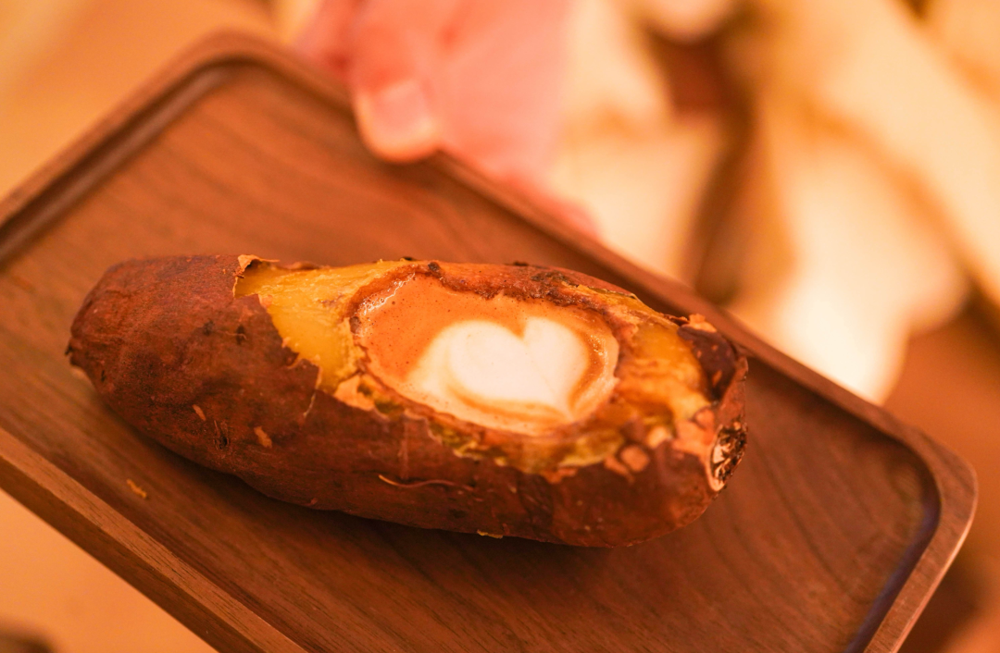

是的，就是这个吉田鎏金红薯。。我再只多亮一张图，就跟你说明这个红薯的厉害之处：

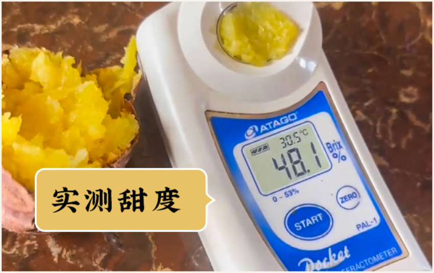

糖度 48 是什么概念呢？
熟透的西瓜 11-12，我司去年巨甜的融安金桔在 20 上下，红玉芒果在 13 -15，
总之，一般糖度 15 以上的水果，我们就觉得是王炸产品。48 ，那得是爆表级的啊！！！！我去年烤过，一戳破皮，一包蜜！！！

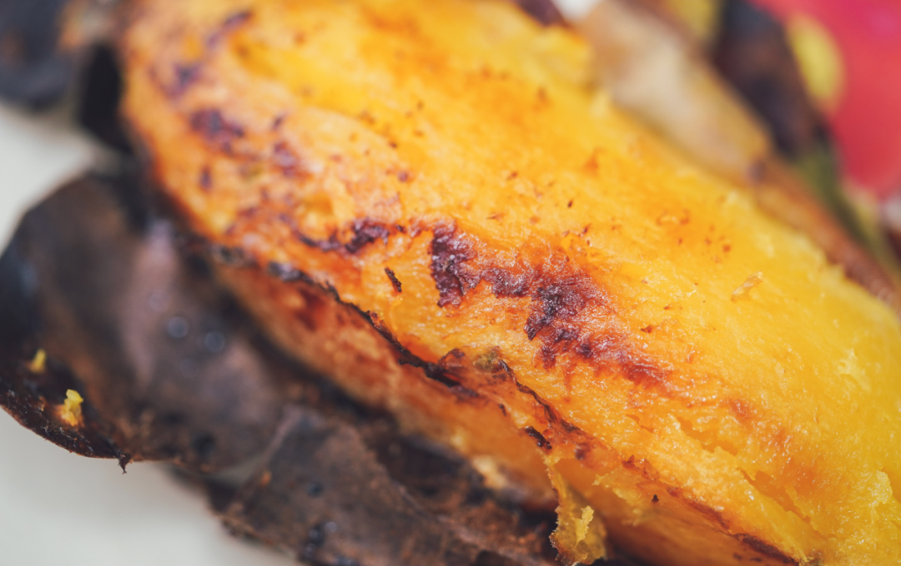

好了今天卖两个货，我抄一下之前的稿子。（反正都是我写的，都是我 KPI一个是这个吉田鎏金红薯，一个是一对打工人王炸小组合。

这个卷王红薯，是个混血儿，专挑市面上认可度最高的品种来杂交。（取精华去劣势，会玩会玩把红薯的甜度、口感、果形卷完了。

红尧甜，鸣门金口感好，玛莎莉果形好，好，那就统统拿来杂交培育，变成我吉田地瓜的。（更卷的是，比红尧更甜了，是业内认可的高甜度

这个矜贵小品种，对土壤挑剔得很。试用三年，从海南到山东都不行，最后在云南，划了一块地，七分泥三分沙，红土地里给种了出来。

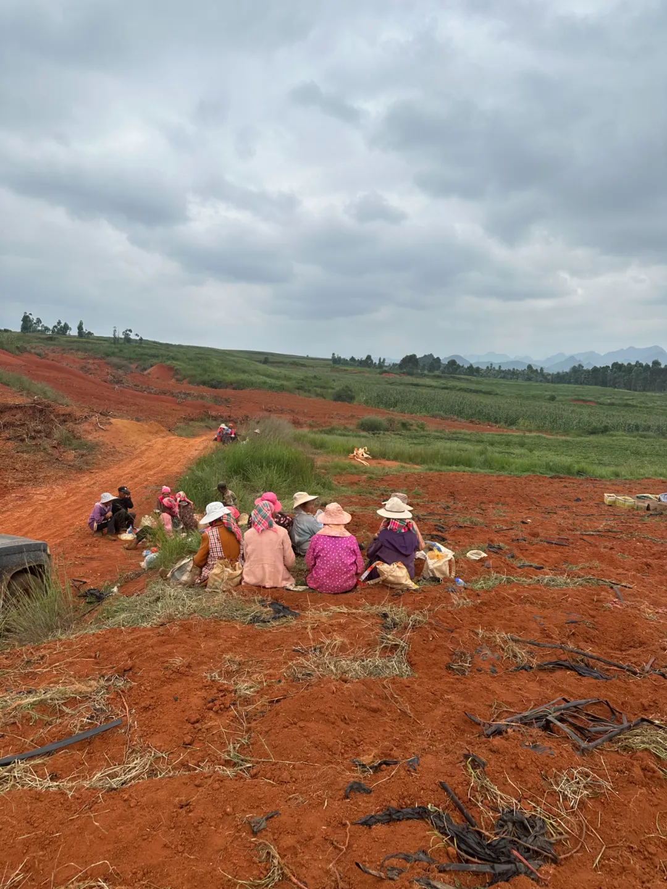

新鲜现挖，到手还带着红沙土。18天高温自然糖化处理再发货，拿到的就是最佳口感了。

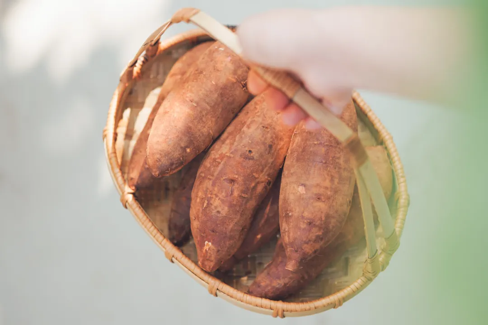

吆喝完了，剩下的你们看看详情，看着买。
饱记·吉田鎏金红薯购买方式如下早鸟价 86折！！！
戳图或去🍑🍑🍑搜索「艾格吃饱了」下单购买👇

然后是这个打工人王炸组合！！！喏，就是这个高甜火龙果家族：红澄澄的海南红心火龙果以及冰糖甜心稀奇货燕窝果双拼。

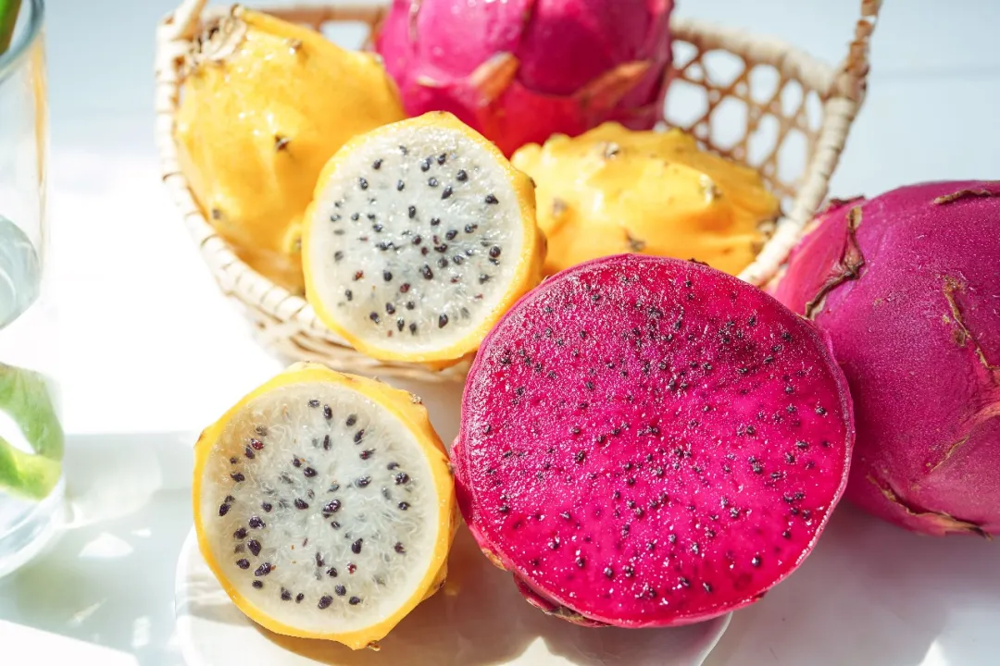

还是我司冲到海南实地考察，跑遍几个山头卷出来的小产地生态高山果园。

先说火龙果，非常规商超进口货，纯正海南树上熟！

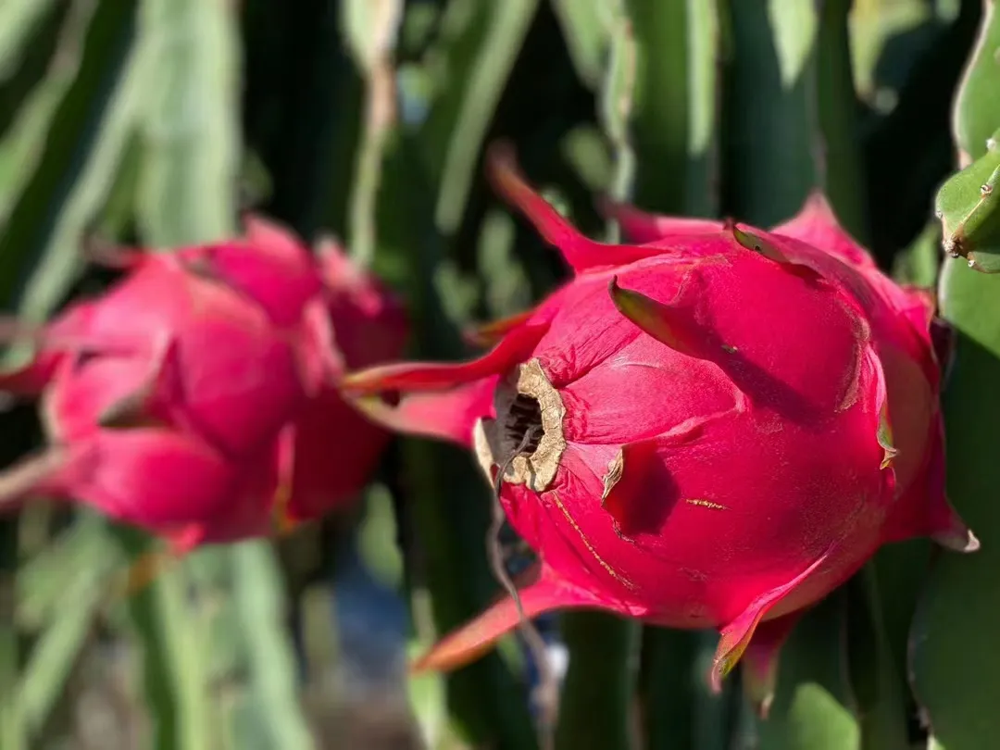

为啥要强调这一点呢，因为你在超市常见的进口火龙果往往五分熟就摘了，经历长途运输，再上架喷水。

而我饱记的海南红心火龙果，九分树熟鲜采发货。特点是叶薄皮皱，（这是树熟独特的标志，不是不新鲜哈!且是高山生态种植，

你一尝就知道，口感糯甜！糖度可达20以上!

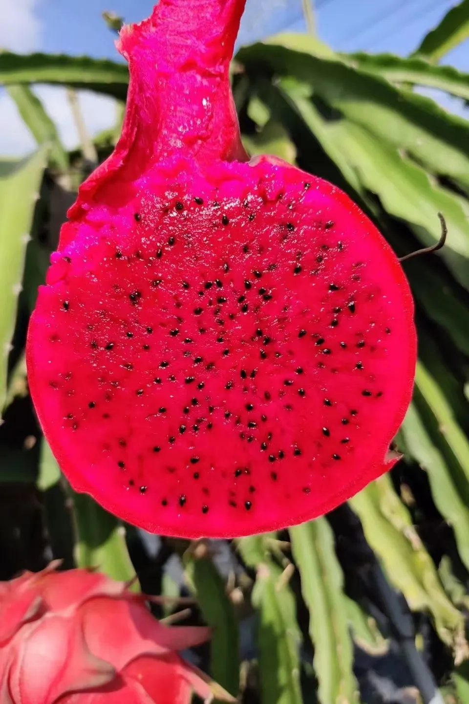

水分很足！
至于这个长得像佛头一样的燕窝果呢，是个稀奇货，老家在厄瓜多尔，

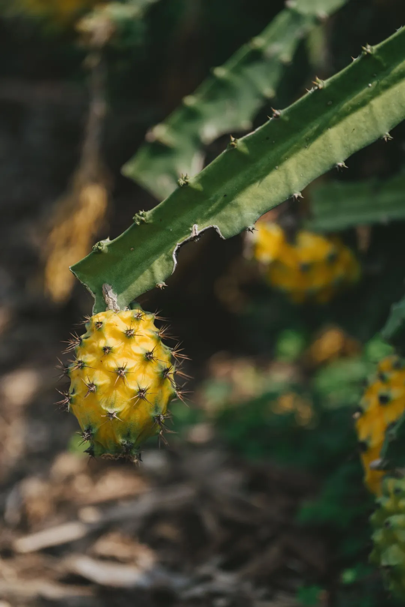

近几年才开始在海南种植，甜度比红心火龙果更高！！

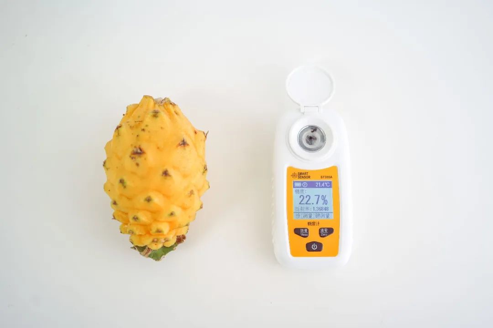

长相虽然猎奇，但口感甚好，入口有冰糖甜味，口感像滑嫩的燕窝，（本薯觉得有点像荔枝的香甜感

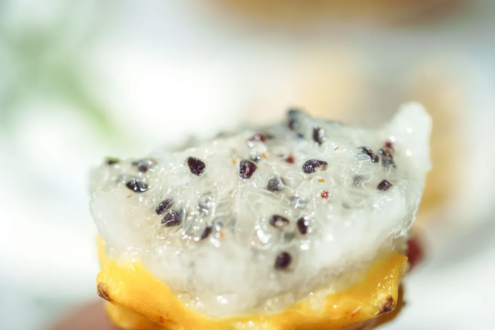

比起常规的火龙果，更上一层楼。

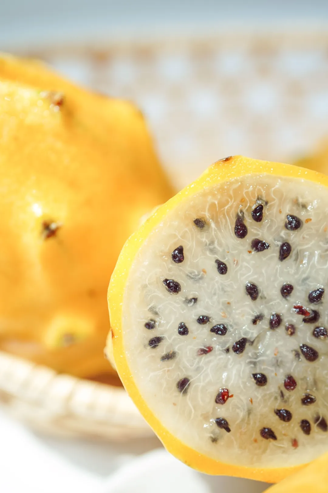

之所以没有大面积推广开来，单纯因为非常难种，损耗率极高！

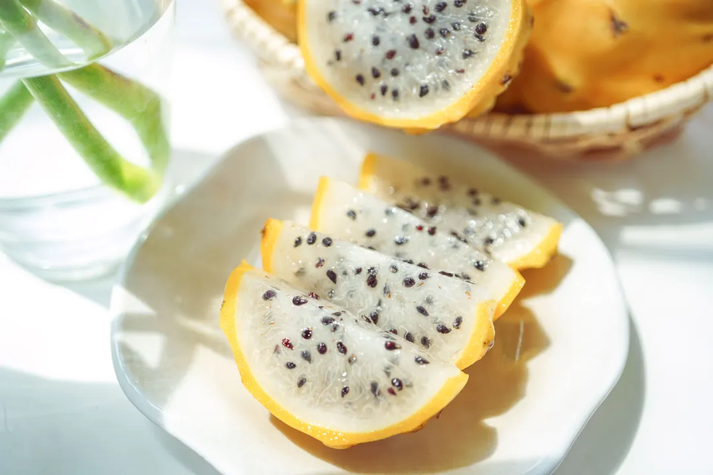

我饱记给大家找到的这家生态小果园，产量也极其有限，卖完就没！

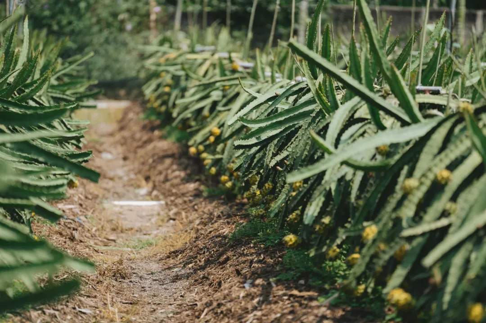

就这么些。
我强烈建议大家买它一买，尝上一尝！仙品！

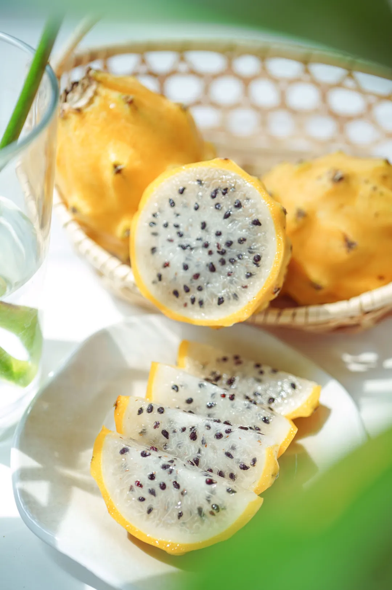

为啥说是打工人王炸组合呢？Hhhhh,因为它俩的膳食纤维含量高得吓人。不是随便说说哦，请看专业文献。👇
火龙果是一种热带水果，含有一般水果少有的植物性白蛋白及花青素，丰富的维生素和水溶性膳食纤维,因此又被誉为长寿果。火龙果还是一种低能量、高纤维水果，其水溶性膳食纤维含量十分丰富，具有很好的减肥、降低胆固醇、润肠作用。高血脂患者及便秘的人可常食用。文献来源：《心血管病防治知识》 · 2010年第4期81-81,共1页
其它的不多展开了，你们自行想象！我看所有上班族以及久坐不动的开车族，以及家里有老人的！都应该买回去，调理一番！哈哈哈哈哈哈哈哈以上，下课！
饱记·高甜火龙果家族购买方式如下限时9折！！！！

戳图下单购买👇

本文的研究员

薯角
数着指头等五一。。。

用好吃的方式吃一生

祖国各地好风物

文章转载请加微信「baojiclub」

