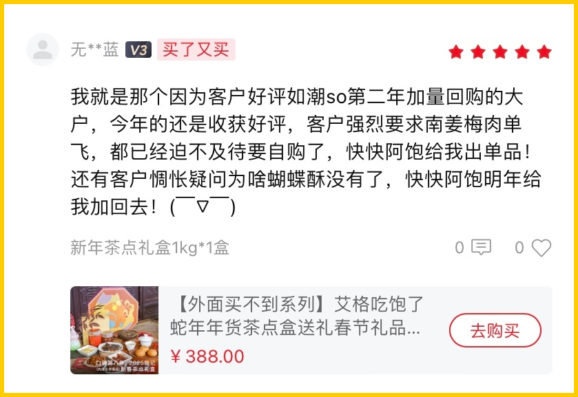
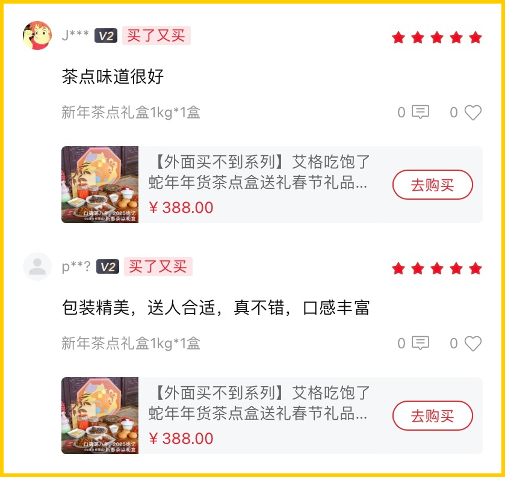
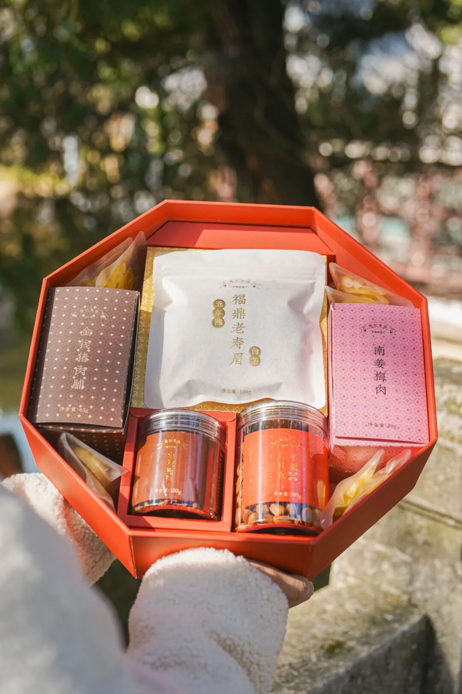
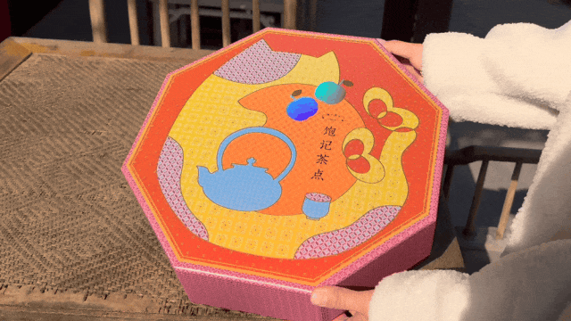
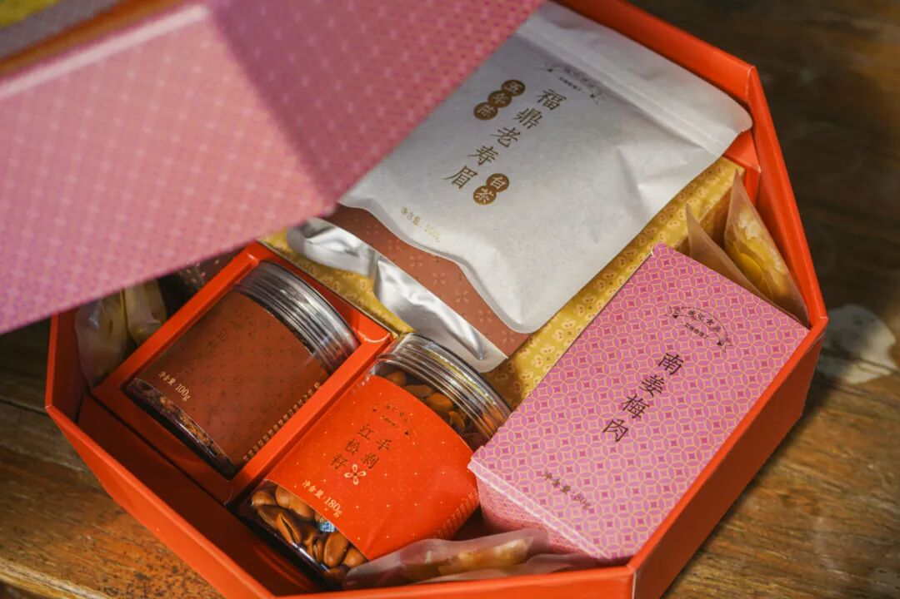
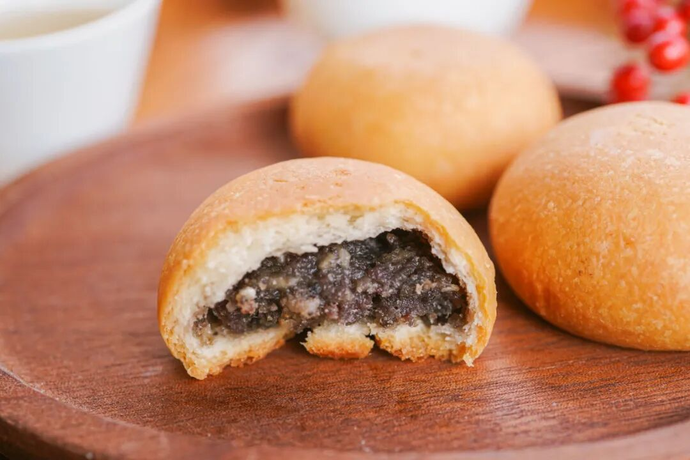
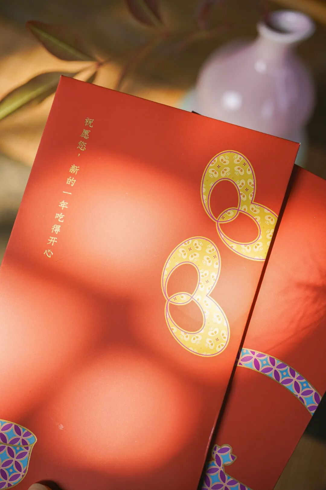
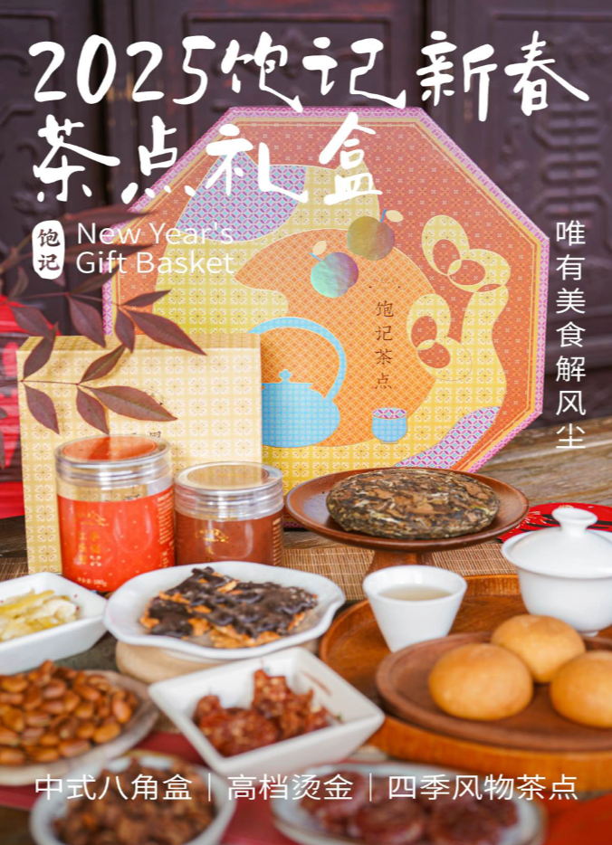
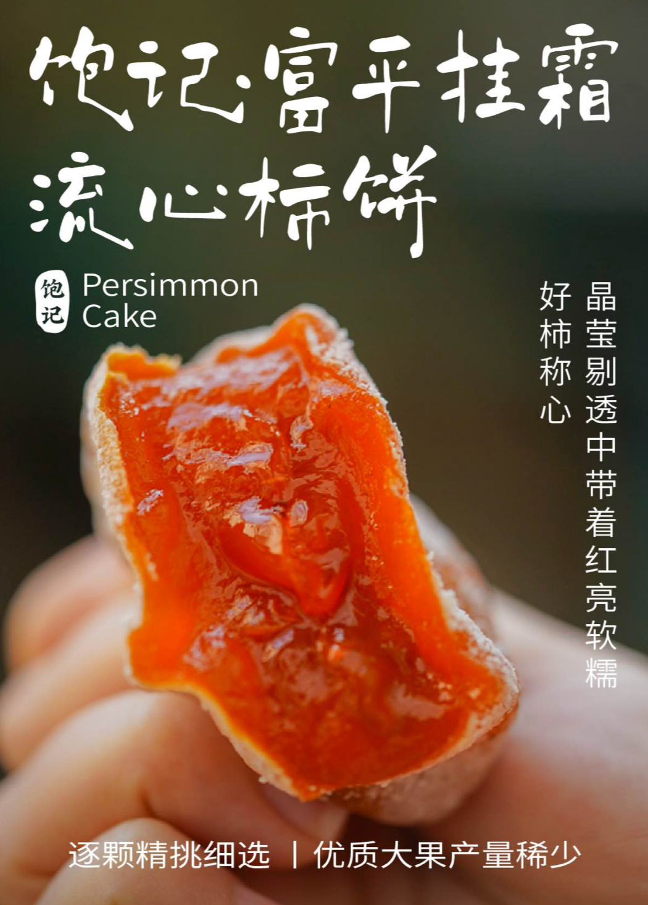

# 年底了，缺钱了吧。。。

- 原文链接: https://mp.weixin.qq.com/s?__biz=MjM5NTYxODQyMA==&mid=2653465362&idx=1&sn=8173e87ec98bf2de7c6f464177b7af12&chksm=bce8eacfad5e5a2ae50b0c9146a676e90edb30b701c631468369fa00b5bc7222e311045568e6&scene=27#wechat_redirect
- 浏览量: N/A
- 点赞数: N/A
- 评论数: N/A
- 转发数: N/A

## 正文

还不是为了生活

一个尽情安利自我的公众号

以下是没事干研究院的风物研究报告请放心食用
今日标题仅代表薯角心声！毕竟自打来了这司，本薯的钱包一点没闲着

可谓是这司赚钱这司花。
就说马上过年，又恨不得到处给朋友们塞精美绝伦的年货盒啊啊啊啊！

就一句：

我司年货盒，你送任何人，

收礼的那人一定给你竖大拇指！！！

上线八九年，

抗住了 10w+ 用户的检验。

你可以不相信本薯，

但你要相信尊贵的饱记客人

老客人亲笔写下的证据在此👇

有夸外包装美丽的，也有夸茶点风味好的，
主打一个内外兼修

总之我司年货盒最大的卖点：体面又实在。

市面上做套盒的思路，

主要是研究包装。

但我司不仅要长得美，还得吃得美！

老板很是下了一些血本，

实话说真的不挣几个钱！！！

中式八角食盒设计，表面烫金工艺处理，寓意吉祥平安～

配色灵感源于香港中环老钱基金的红包们，

添红更添福嘿嘿！

不仅包装能打，

内容物更是我司的拿手好戏

aka 老本行了

八样茶与食，风味来自大江南北，

都由产品经理费时费力卷出来，

许多王牌产品，

经得起时间的考验。

打开以后长这样👇

哪家好人搞八个花样放里面啊？？？？？

过年摆出这一桌的含金量你懂！

礼盒里一共 8 件各地美食风物。

来，请查收👇

1. 黑松露云腿小酥
今年礼盒新增的厉害东西！在宣威海拔 1800 米左右的仓库里自然发酵的火腿，配上云南当地采的杂花蜂蜜，再佐以餐厅常用的黑松露酱，浓郁地拌出香甜馅儿。每一颗的皮都云南老师傅亲手揉！这样的云腿酥，约等于在吃肉。越嚼越香，市面上随便比啊！

2. 南姜梅肉同样是今年的新品！！优质青梅自然日晒、干制糖渍后，拌入广东优质南姜干制打粉！南姜广东人应该比较熟悉，没有生姜那么辣口，酸甜微辛，
衬得梅子味道层次丰富，一颗一颗根本停不下来！

3.临安山核桃仁老朋友！全家人都能吃。今年换了免剥的山核桃仁，聚在一起喝茶吃更简单省事！十一年前老板与浙江农林大学「山核桃研究所」合作研发的山核桃，外面绝对买不到。选的是「中国山核桃第一镇」临安岛石镇薄壳山核桃，每个批次生产日期控制在最新鲜的45天，只加轻盐糖调味，吃得到浓浓的山核桃原香，完全没有负担。

4. 手剥红松籽看图，品相看的见哦，果肉饱满，粒粒大颗，轻松就能手剥。果仁自带松子油脂的醇香，吃得满嘴生香，快乐停不下来。松子来自长白山原始森林红松树，15 年结果，两年果实才能成熟，经五道筛选工序，开口率高达约 96%。

5. 金钱猪肉脯独立小包装的厚土猪肉片，精选猪后腿肉，整块厚切，肉质紧实，细腻少筋。传统工艺制作，荔枝果木炭烤，辅以冰糖及广东汕头鱼露简单调味，保留了最原始的炭烤香气！一口下去，肉香扑鼻，鲜美溢汁。

6.黄金柚子条这个黄金柚子条，我愿称之为柚子口香糖！适合揣兜里随时来一根。初入口是淡淡的柑橘味，越嚼越浓烈的柚香直冲大脑，各种风味在味蕾上瞬间脱缰，爆发后，只留下满口的清新余味。

冬天嘛，还可以加点蜂蜜泡柚子茶，柔滑甜蜜，清新！选用高品质沙田柚，采用低温真空原汁、原糖浸糖工艺制作而成，柚香十足，回味无穷。

7.杏仁黑巧薄脆哦比我在烘焙店里吃的好。超过45%杏仁片添加，坚果香气浓郁，口感酥脆，手工精选坚果原料 ，片片饱满香脆。

8.五年陈福鼎老寿眉（白茶）王牌产品了。饱记选茶，首选发源地，气候、海拔、土质一一记录在案，采自白茶发源地福建福鼎管阳，海拔 700 米以上高山茶区鲜叶，手工日晒，低温炭焙，陈化五年，香气纯正，汤色橙黄明亮，滋味醇厚甜爽。不炒不揉，最大地保留茶叶中的成分。制成茶饼，存起来慢慢喝。

另外！！！

每一盒里还都配有

2025 年历一张与红包两个！

算是我饱记的一点小小心意！

最后！！！

如果有送礼需求，

可以直接购买年货礼盒提货卡，

家人朋友只需输入收货信息就能提货！

详情可以咨询客服小姐姐哦～

提货卡长这样👆

发自内心地说一句，

这礼盒就是我司的抗鼎之作。

不管是自留还是走亲访友，

都不掉档次。

好看，排面有了。

好吃，里子又了。

一点不让大家操心～

趁现在年货节最后两天，

如此美丽大方的年货盒，

单盒立减 58 元！！！！两盒立减 126 元！！

发自肺腑地说，

真的不挣钱性价比很高！！！

冲冲冲！！！！

（就这我已经被老板追杀三条街了。。

饱记·年货礼盒单盒立减 58 元双盒立减 126 元天🐱有赞同折扣
戳图下单购买👇或🍑🍑🍑搜索「艾格吃饱了」

题 外

敲锣打鼓，

今年冬天的富平柿饼现货了！

年货节限时 85 折！

刚补货的 75% 木姜子黑巧克力，

90 天短保质期的大师凤梨酥，

都有限时 9 折！

适合空调房吃吃的水果看这里👇

拿过金奖的上海白鹤红颜草莓，

来自广西融安的脆蜜金桔。足以颠覆自小到大的金桔风味印象！

一次尝俩的广西双拼芭乐，

扎实的冰激凌球口感！

还有今年份的象山红美人，

入口似果冻般嫩嫩滑滑～

现在都有限时 9 折！

饱记·富平柿饼

购买方式如下

年货节限时 85 折！！！

戳图购买👇

饱记·新鲜到货凤梨酥

限时 9 折！！！
戳图购买👇

饱记·云南木姜子75%黑巧克力

购买方式如下

限时 9 折！！

戳图下单购买👇

或🍑🍑🍑搜索

「艾格吃饱了」

饱记·融安脆蜜金桔

限时吃水果 9 折！！！

新年大桔大利！！！

戳图购买👇

饱记·红颜草莓限时吃水果 9 折！！！新年莓有烦恼！！
戳图购买👇

饱记·象山红美人柑橘

限时吃水果 9 折！！！

戳图购买👇

饱记·广西双拼芭乐限时吃水果 9 折！！！
戳图购买👇

本文的研究员

薯角多吃点，好过冬

用好吃的方式吃一生

祖国各地好风物

文章转载请加微信「baojiclub」

