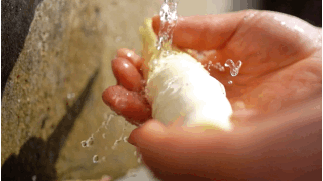
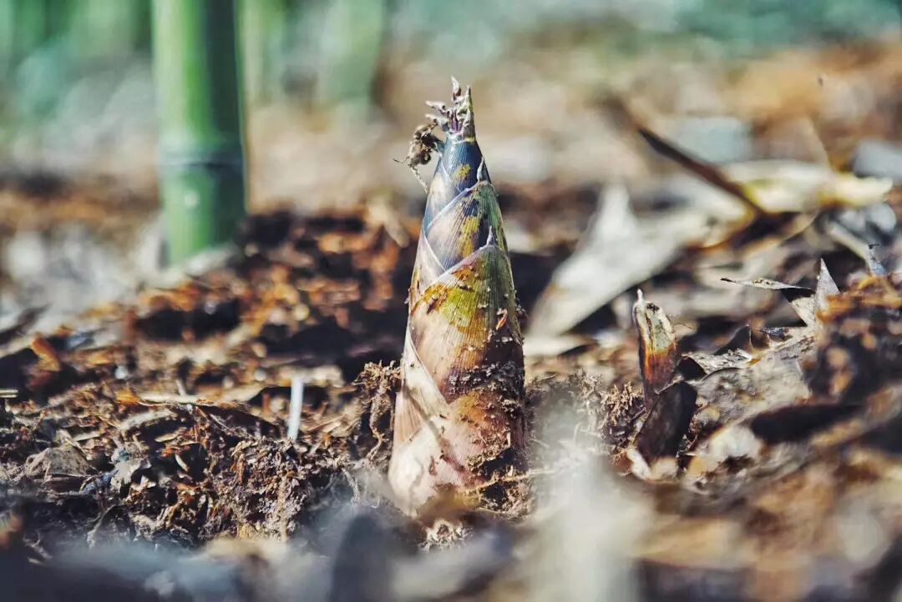
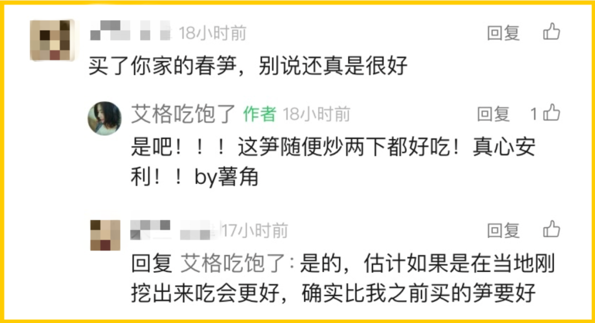
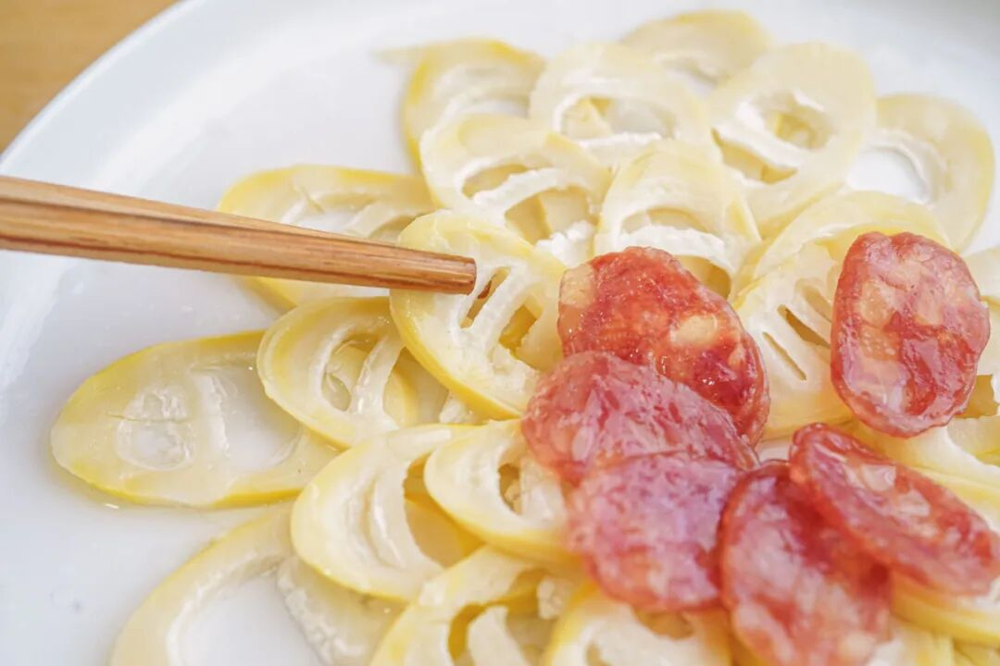
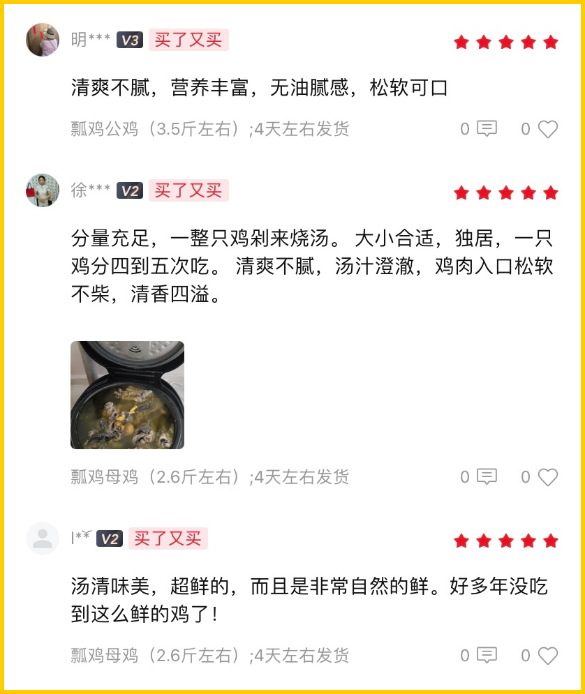

# 彩云易散琉璃脆，世间好物不坚牢。。。

- 原文链接: https://mp.weixin.qq.com/s?__biz=MjM5NTYxODQyMA==&mid=2653469347&idx=1&sn=7db26d815201411068f247b8d333b5f2&chksm=bc53592de7b3329a68588eca96bdfc437ccfcea10758d4927464e8ab3a6c3dfc1e2fd6d3da44&scene=27#wechat_redirect
- 浏览量: N/A
- 点赞数: N/A
- 评论数: N/A
- 转发数: N/A

## 正文

很爱过谁会舍得

一个尽情安利自我的公众号

以下是没事干研究院的风物研究报告请放心食用
朋友们，世间好物不坚牢哇。有一些春鲜还没吃够呢，差不多就要下架了！！错过只能明年见

就这打遍天下无敌手的春笋！差不多要挖没了

只剩最后一波！今年照旧有米其林餐厅师傅问过来，向我司预定了好几批。有多好吃呢？照之前的经验，每周餐厅客人都要吃掉七八十斤！

前阵子几场春雨后，这笋冒得起劲。所以我们也顺应天时，降价啦！！且有尾声限时 9 折！！

看看之前推文底下的真实留言👇

你就算不相信我，

也要信我们尊贵的饱记客人👇

托老板的福，

本薯今年也大吃了几次

无需任何厨艺，

随便炒就超脆甜，

感觉还没长大，就被从土里薅出来了。。。

千言万语汇成一句，

大家快来买啊！！！买完把它带回家，炒，煲，蒸，焖！随便糊弄熟就好吃！

毕竟这自然笋实在难得！

临安天目山核心产区

运用了「妈妈去菜市场挑笋」的家传智慧，

只选大小、嫩度适中的青年笋，人手精挑，属于是笋中精品的存在了。。

每年就卖一两个月，卖完就没了！想吃的，快冲啊！！

真的很鲜甜，

是外面买不到的那种鲜甜。

现在尾声了！！

限时 9 折！

去买。

饱记·2025 临安天目山雷笋降价了！！！限时尾声 9 折！！！

戳图购买👇

还有就是这只

让全公司好吃到哭的一年以上老母鸡！

只剩最后几十只！！

想喝鸡汤的有福了！

本薯赶着下班，

快来人把它们买空啊啊啊！！

我们给大家搞到了足足养了一年的真·老母鸡，买了和春笋随便炖一炖，鲜到掉眉毛👇

不需要任何厨艺，就拿拿电饭锅炖，出来汤色就漂亮得不得了👇

图片来自后台用户评论返图

它们五六个月才能长成一批，

所以每次都数量有限。

划一下重点：这一批分为两个规格：1 年老母鸡净重 2.3 斤以上。1 年老公鸡净重 3.4 斤以上。

此鸡是非常小众稀有的品种。本在云南逍遥，2020 年成了上海援滇对口协作的产物！全金山上下是金尊玉贵地养着：

比如为了保留它的野性和肉质，金山区直接在养殖区域内模拟了云南林地地貌，让它能撒欢，打架，睡觉。还要搭配玉米、豌豆、高粱这种天然粗粮和青绿蔬菜去喂。最终，把它养得比在云南老家还好吃！

所以这鸡，吃起来一点腥味都没有！油脂和胶原蛋白含量都非常丰富。

非我薯角自夸，看看此前后台的真实评价👇公鸡、母鸡都有！

之前给家里人寄了两只，

他们直接搬出了花雕酒来做，说这样才不浪费。。。

总之，老母鸡油多脂肪厚，超滋补！老公鸡肉更有韧劲，比普通公鸡含有更多蛋白质，炖汤都鲜得很！大家按自身需求来选就好。趁现在限时 7 折！请吧！

饱记·云南稀有品种瓢鸡

限时吃鸡 7 折！！！

戳图下单购买👇

题 外

朋友们，

吃完山里养的，还有海里游的。

昨天刚上的饱记·舟山野生海鲜盲盒！

舟山码头鲜捕现发，都是冰鲜发货！

当地人都买不到的品质，

来自湛江的红膏青蟹。不仅有红膏，而且满到了蟹壳的角角落落。

都有限时早鸟 86 折！

其他的东海野生海鲜，

还有肥美的银鲳和红膏梭子蟹，

都是高级餐厅水平！

限时吃海鲜 9 折！

春季茶中硬通货西湖龙井，今年照旧是「梅家坞」和「狮峰」两款，一款性价比之选自家喝不心疼，一款上好龙井送人包体面，

也是限时早鸟 86 折！

还有些只有最近这一阵可吃的水果👇

甜蜜嘎嘣脆的花香小弹珠蓝莓，

无渣不麻嘴的海南金钻凤梨，

连盐水都不用泡。

难得回归的泰国超甜多汁金柚，

卷中卷红玉芒果，

来自湖北的超甜晚熟红橙，

娇艳可人的雷州木瓜，

来自精品小果园的云南沃柑，

好吃不怕胖的广西芭乐，

人称「水果冰淇淋」的凤梨释迦！

现在也有限时 9 折！

饱记·舟山野生海鲜盲盒购买方式如下限时早鸟 86 折！！！
戳图下单购买👇

饱记·湛江红膏青蟹购买方式如下限时早鸟 86 折！！！
戳图下单购买👇

饱记·东海冰鲜鲳鱼购买方式如下限时 9 折！！！
戳图下单购买👇

饱记·东海春季红膏梭子蟹购买方式如下限时 9 折！！！
戳图下单购买👇

饱记·梅家坞西湖龙井

限时早鸟 86 折！！！

戳图下单购买👇

饱记·狮峰头采明前龙井购买方式如下👇限时早鸟 86 折！！！
戳图下单购买👇

饱记·花香脆甜蓝莓

购买方式如下

限时吃水果 9 折！！

戳图购买👇

饱记·海南金钻凤梨

购买方式如下

限时吃水果 9 折！！

戳图购买👇

饱记·多汁泰国金柚

购买方式如下

限时吃水果 9 折！！

戳图购买👇

饱记·海南红玉芒果购买方式如下限时吃水果 9 折！！！
戳图购买👇

饱记·晚熟超甜红橙购买方式如下限时吃水果 9 折！！！
戳图购买👇

饱记·湛江雷州木瓜

购买方式如下

限时吃水果 9 折！！

戳图购买👇

饱记·凤梨释迦购买方式如下限时吃水果 9 折！！！
戳图购买👇

饱记·云南晚熟沃柑购买方式如下限时吃水果 9 折！！！
戳图购买👇

饱记·广西芭乐

双拼&奶油芭乐

限时吃水果 9 折！！

戳图购买👇

本文的研究员

薯角我想我知道春天的味道

用好吃的方式吃一生

祖国各地好风物

文章转载请加微信「baojiclub」

