# 很多人寄予厚望，却对他破口大骂。。。

- 原文链接: https://mp.weixin.qq.com/s?__biz=MjM5NTYxODQyMA==&mid=2653471237&idx=1&sn=3e0632e610373e8f9791640ebec4a1dc&chksm=bce15b842253e941e399224f33a3af869b8431e6c5256bf8146c3bf6c32915fe2da8cbdcd157&scene=27#wechat_redirect
- 浏览量: N/A
- 点赞数: N/A
- 评论数: N/A
- 转发数: N/A

## 正文

神奇

没有广告软文

所有消费笔记均经多次匿名测试请放心食用

上周终于预约上了热门的 Oncue，

也就是以前的 Lunar 大厨新开的店。

加上再之前的 Pine，

这位大厨有很多粉丝。

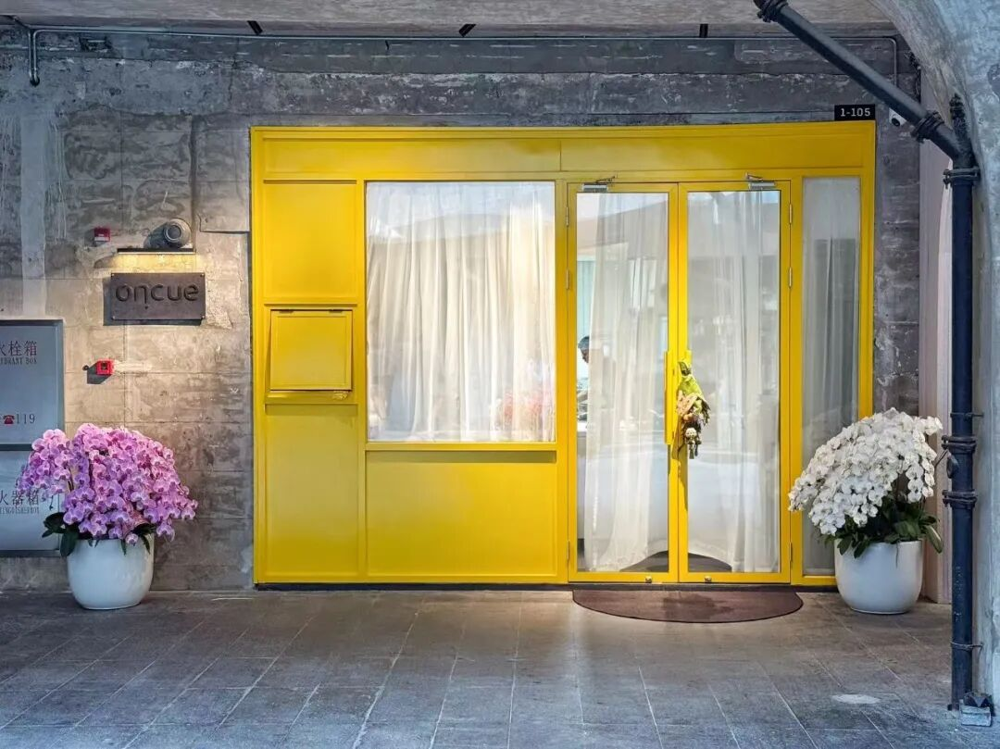

结果去的路上翻了下点评却看到他被骂惨了。。。

说他卖高价炸猪排，488 一块，

味道和上海炸猪排差不多，

好得也有限，吃他还不如吃日式猪排饭！

当时我就激动了呀，

这题我会，

日式炸猪排我在东京和福冈都排过长队

吃过名店，上海高岛屋有家很好吃，

七八年前就有住这附近的老饭搭子带我去吃。

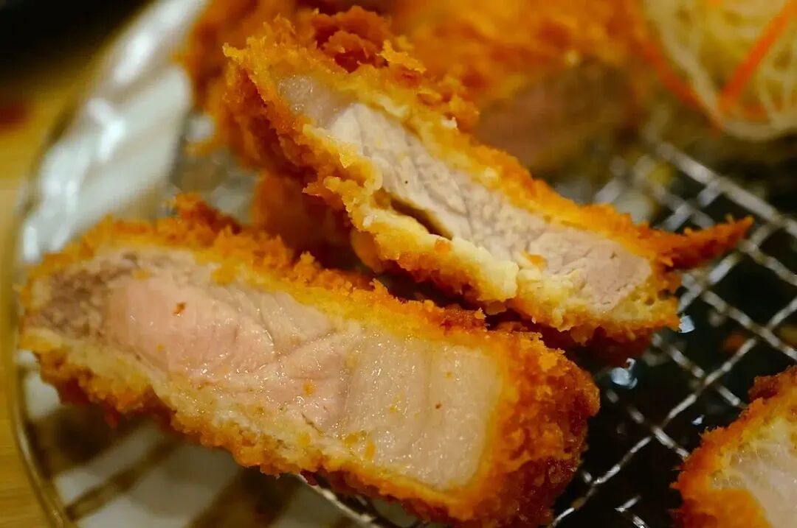

Pine 和 Lunar 我也都吃过，

尤其是 Lunar，在大厨充满焦虑地上 menu，

15 道菜里每道菜都做出三个味型的时候，

我对他做的牛肉印象极为深刻，

没记错的话和我在法国吃到的一家二星大厨水平不相伯仲了，

而且很有自己特色！

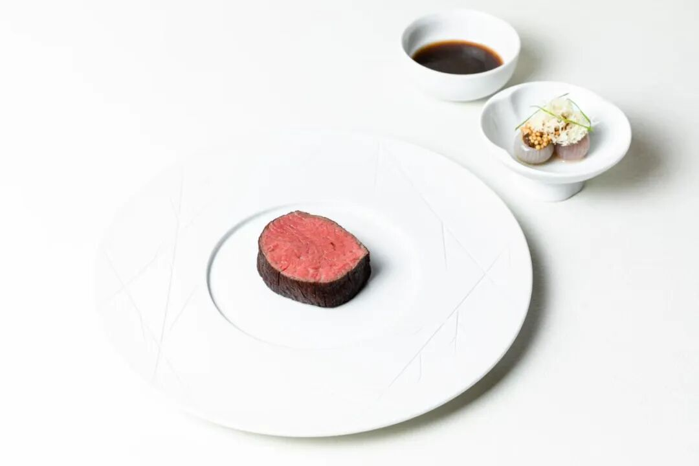

当时 Lunar 的餐厅官网图

结果他的店忽然戛然而止了。。。

事隔几年，突然在遥远的虹口开了新店，

又是这么难约，好容易约上了，

又这么多争议，我得去亲口吃吃看看热闹hhhhh

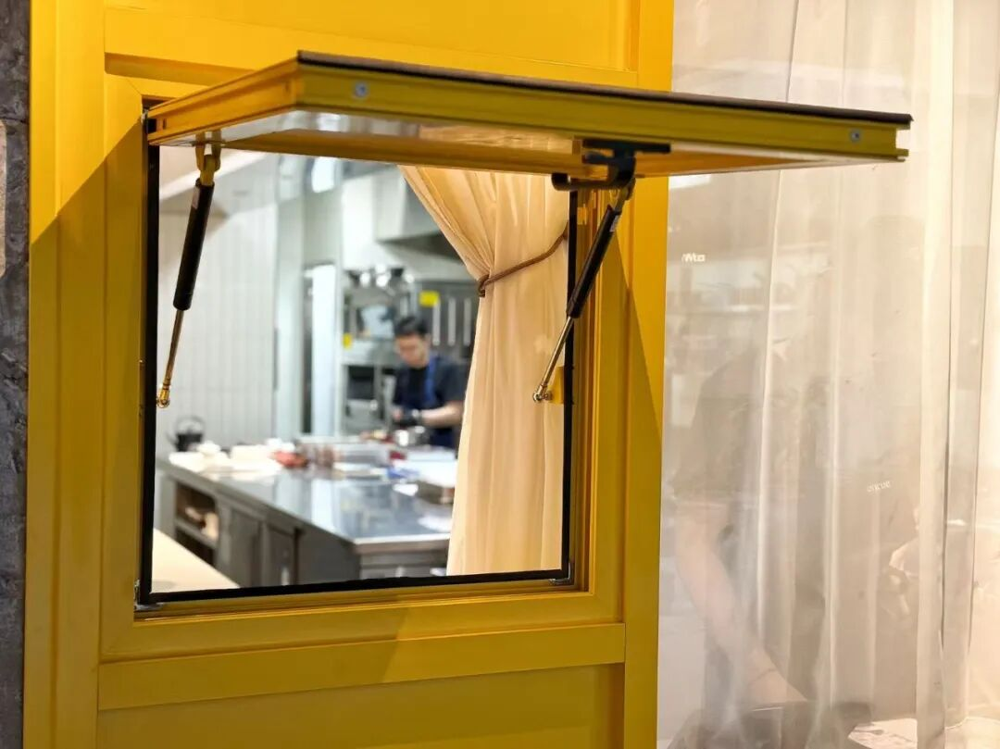

大厨本厨

先说说这个炸猪排吧。。。

这什么上海炸猪排日本炸猪排啊。。。。

这个猪肉太好吃了啊！！！！！！！

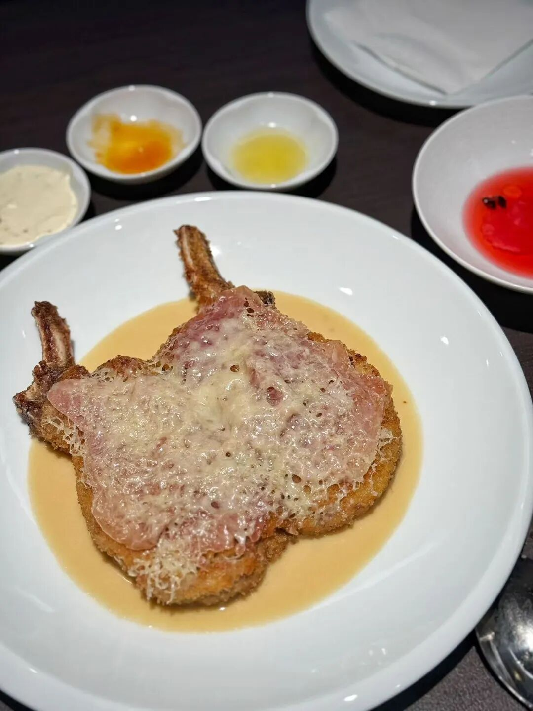

首先这个厚度，位于两块肋排骨之间，

完美的熟度，

很嫩但没有血水，

恰好是他念念不忘，

他想做的「中餐」的最合适程度！

这么厚，真的非常难。

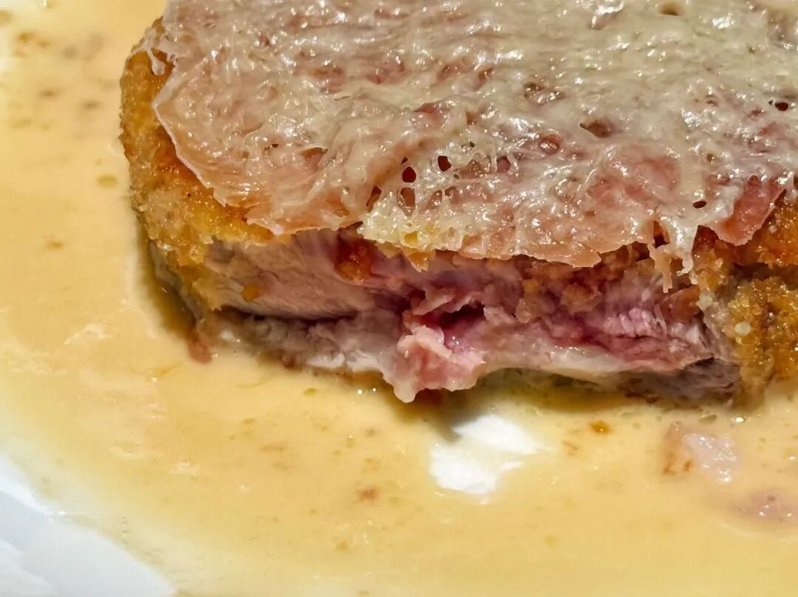

然后是入味。

熟成，调味，上面加了极薄的贵火腿片

和某种法国贵芝士（我酒蒙子，喝了没听清。。。

一起烤的，

一片片贴好加上芝士水煎，美味极了！

（哈哈哈好像就是冰花饺子那个水煎

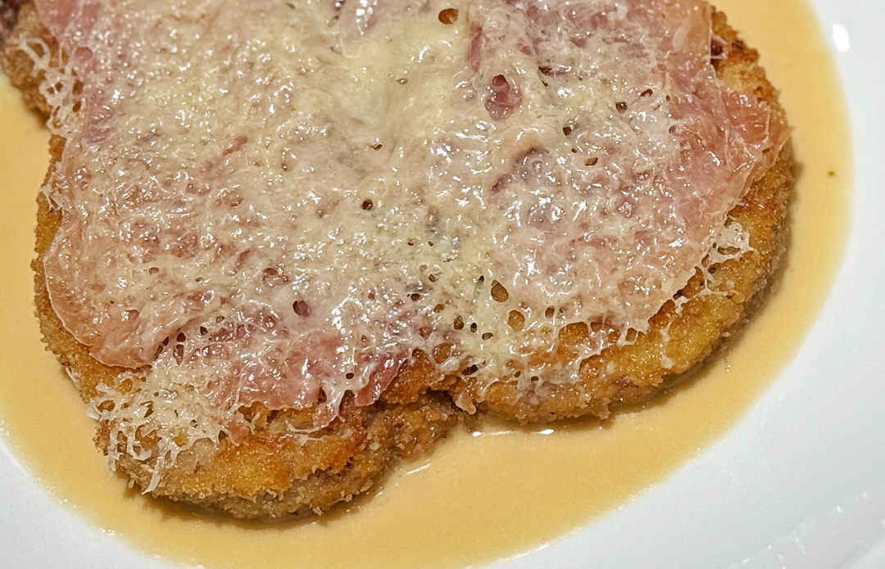

上海炸猪排是不值钱的部位用面包糠增香，

日本炸猪排再嫩也会有点血水味儿，

更不要说在这个猪排厚度下，

加上这个完美的调味。

我拿我十几年吃掉的几百万作证吧，

我没在世界上任何其它店里吃到过这个水平的猪排

而且很明显，这位老哥这几年，

厨艺又精进了。

他现在店里不做套餐，

是做他梦想中的「中餐馆」的单点，

你把他和上海所有小酒馆居酒屋横向比较，

这一个主菜 488 元，两个人给我们吃到撑爆炸，

不贵吧。。。。

主菜里另外有个鰲虾。

我作证，我吃过最好的是巴黎四季酒店三星餐厅的，

用的爱尔兰海域鳌虾，

调了个最简单的蛋黄酱——日本人叫美乃滋的，

丘比甚至有瓶装的。但他调的这个，

真的太好吃了！！

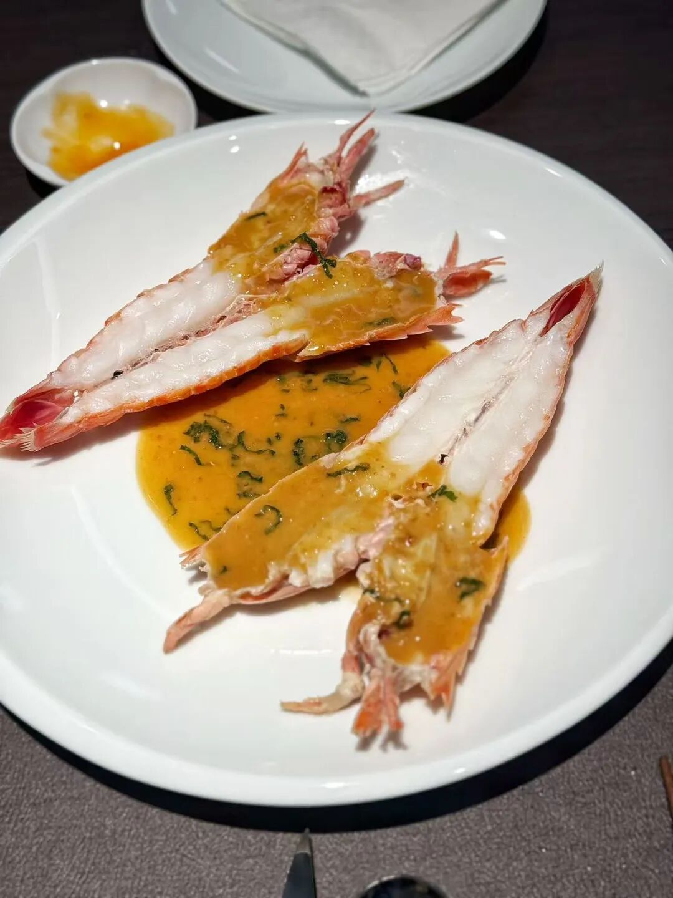

我们这位大厨，调了四个酱，

我选了一个亚洲口味的沙姜紫苏酱，

功力极佳。我就着虾酱和虾脑，

吃了两碗米饭。。。

这个菜，也可以两个人吃。

我吃到就立刻预订了下一个时间！

也是三周以后了。。。

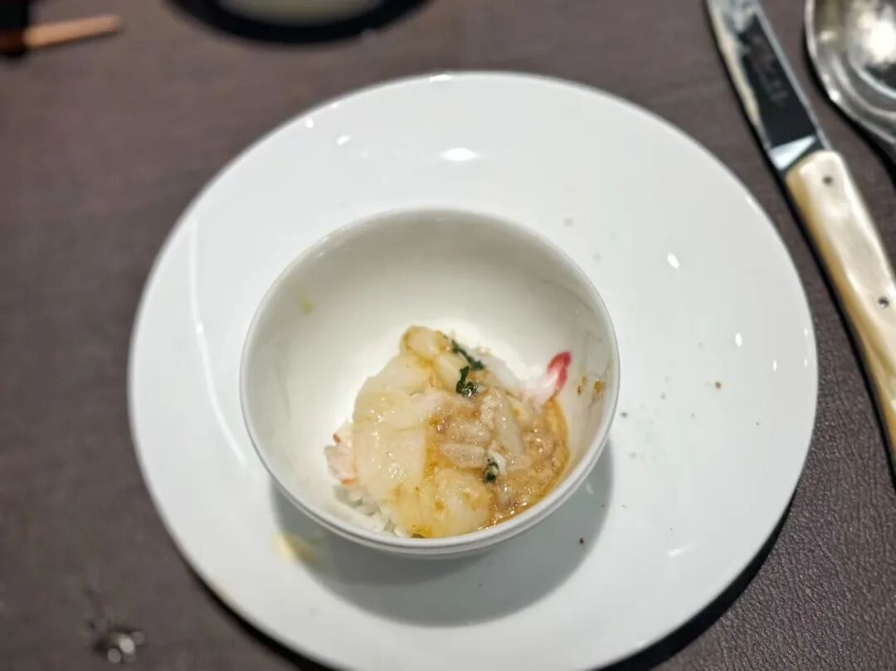

另外吃了两个菜，

腌过的海胆，

我不知道他怎么处理的，

奇妙地去掉了那一股后味的涩味。

（也就是新鲜整板海胆必会浇的明矾水。。

（反正我是不怎么吃木板海胆的。。。

香，甜，微鲜，

和他搭配的华夫饼一起，

极妙。

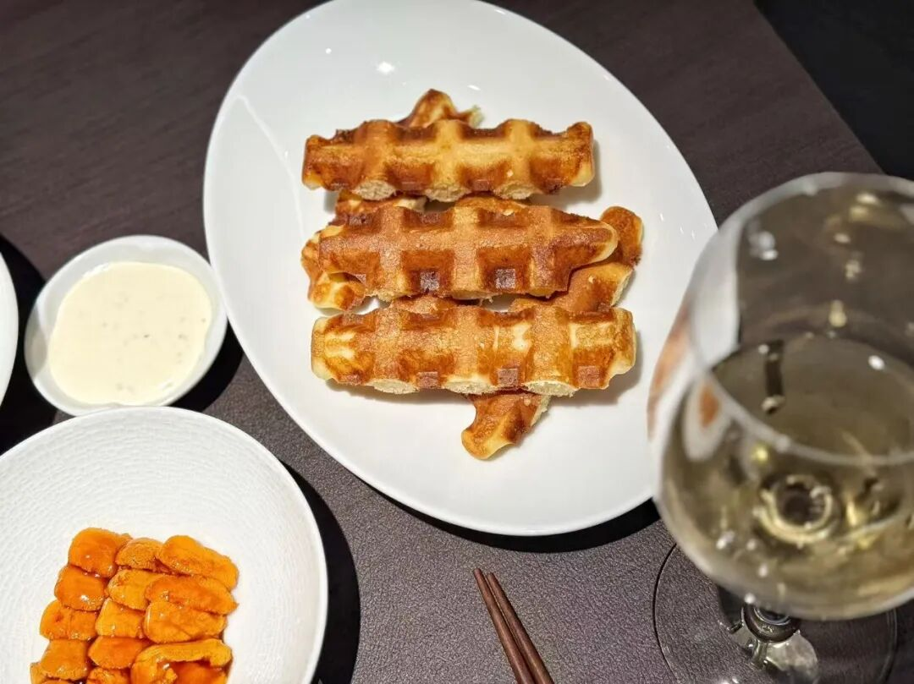

另外是他自己腌的三文鱼，

也配了两个酱汁，

好得不得了。

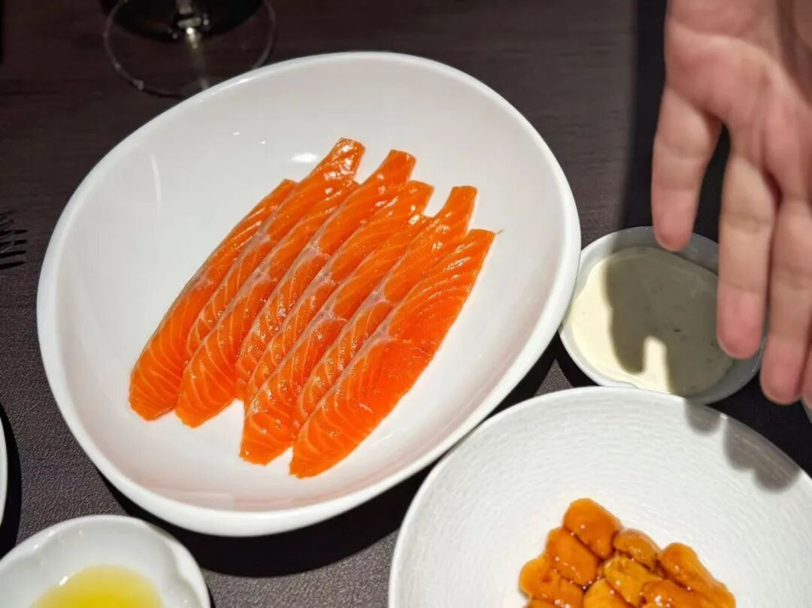

这里我不是只会瞎吹，

只是因为我自己学过法餐，

法餐的酱汁说起来全是黄油、蘑菇、

香料、高汤吊的，

但优秀大厨的酱汁里加点啥，

一靠天分，二靠勤奋。

我就算会吊我也不知道里面是个啥。

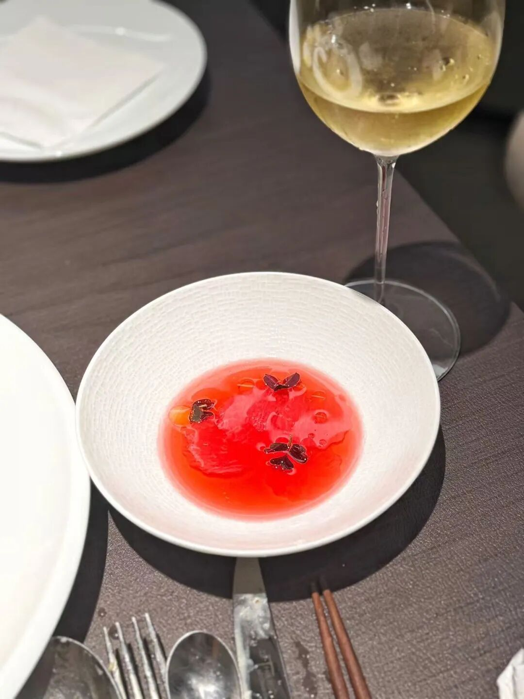

以前写过一家西班牙车祸米其林时

有读者评论，

每位优秀的大厨都需要这样的舌头和嗅觉：

敏感和耐操，但两者是相反的。

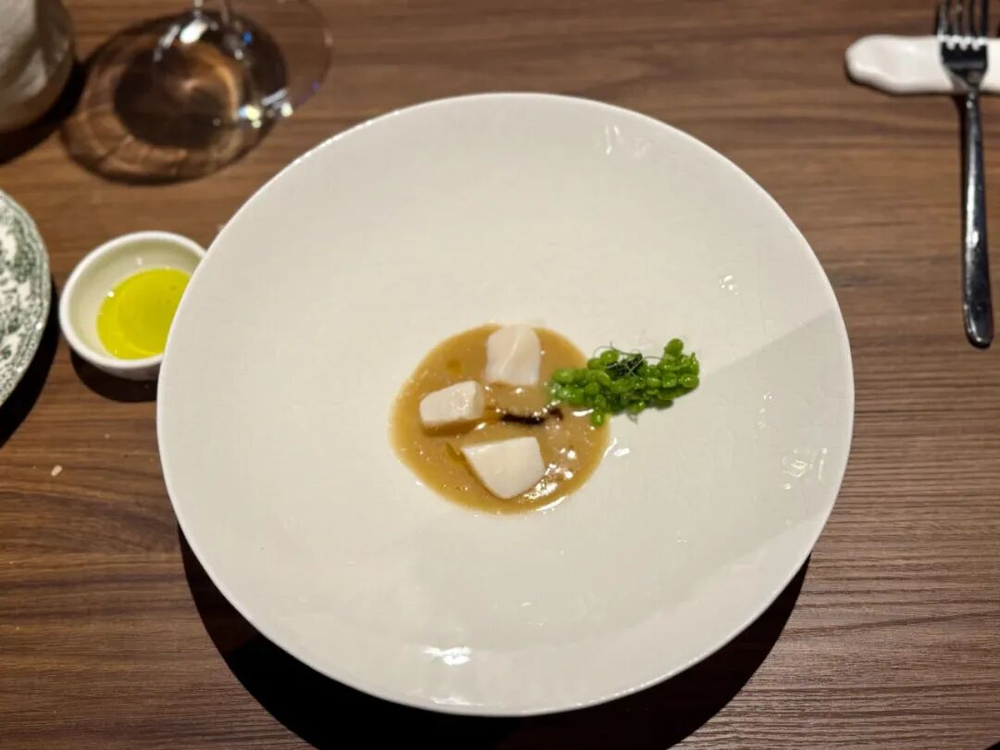

在西班牙车祸米其林吃到新鲜但调味极腥的扇贝

我的味觉和嗅觉是敏感的，但你让我试几百个样，

每做一锅都几个小时搭进去，

我干不了。

西班牙那位大厨，我真心希望他入门就放弃，

不要折腾我们顾客。

但 Oncue 这位大厨，

我真诚希望他永远努力，一定会越来越好吃！！！！

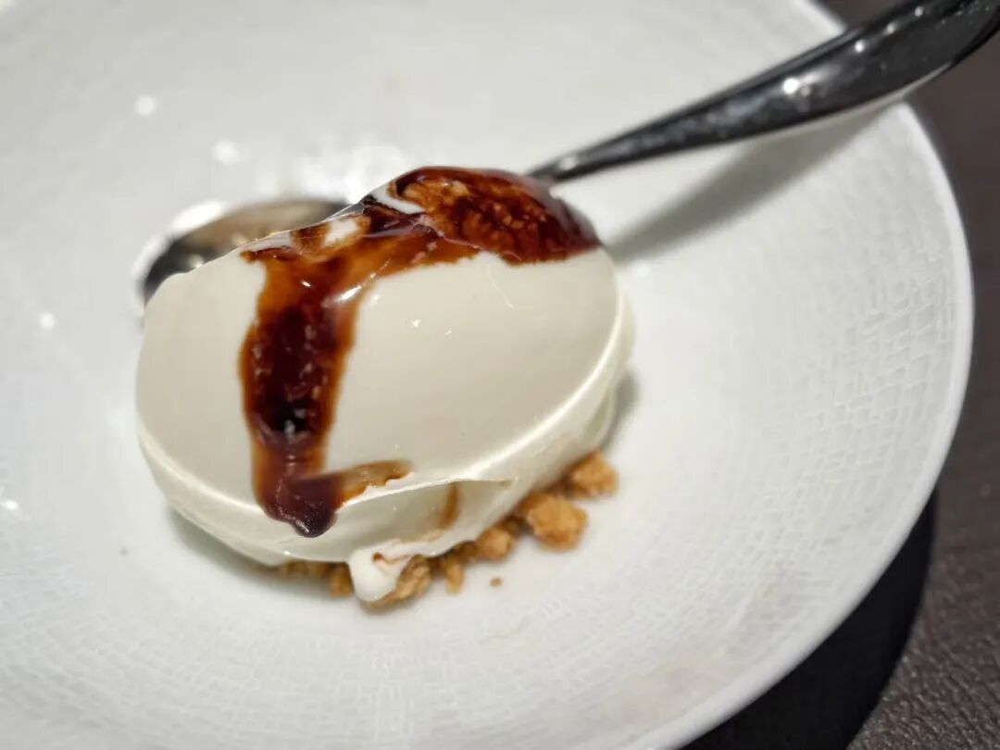

Pine 先后两位大厨，

另一位现在的餐厅已经评上 Best 50 了。

我觉得花样繁多，人也很努力。

但在调味和火候上仍可精进，学习这位。

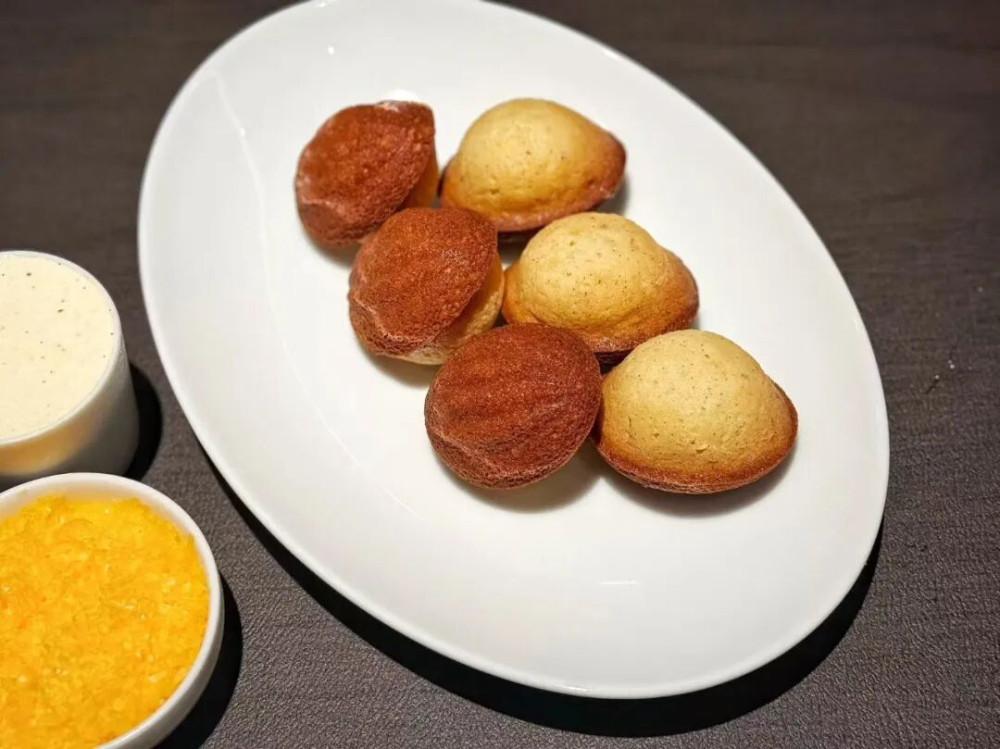

目前看来，

我是认的。。。他的一些老客人不认，

Best 50 的评委不知认不认。

米其林嘛哈哈，听说要吸收更多本地评委，

那我不如看黑珍珠的，

毕竟老登的关系也登得堂而皇之的不是？

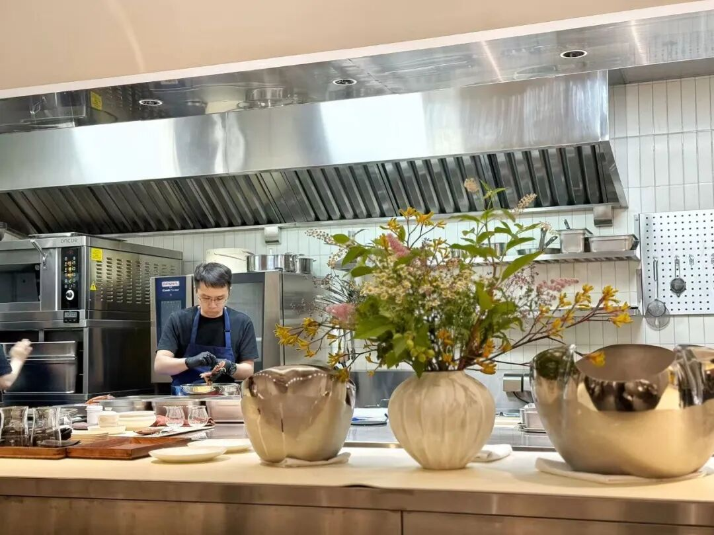

一笑。

请大家都去试试 Oncue。

我认为本城今年和明年我最喜欢的餐厅，

重新出现了！！

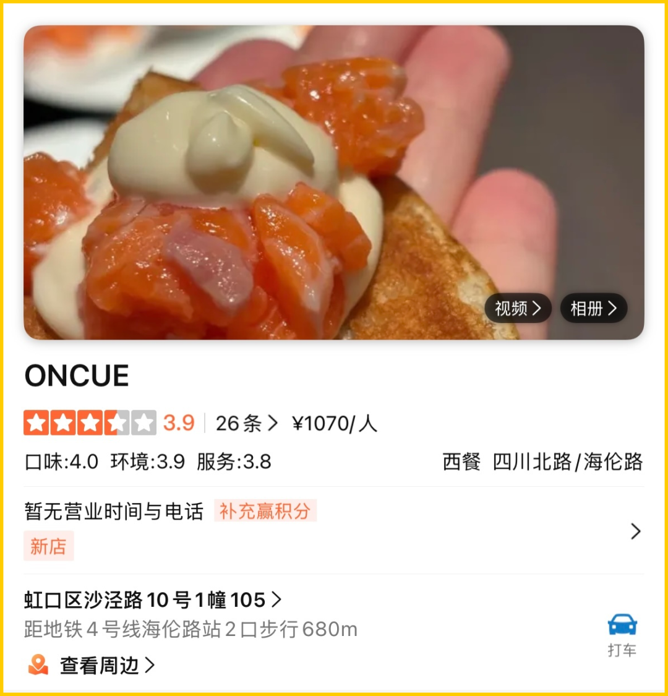

题 外

朋友们！！接下来是我，

忙着给你们打折的薯角。

我司今年份的粽子五君子，

只剩最后一点点，

给大家巨折 7 折清仓出！

本薯卖粽不易啊啊啊啊啊！

有一说一，这些粽子都真材实料，

市面上的大家随便比没在怕的嘿嘿～

此外天🐱618活动又又来了，

我司直截了当打折！

🍑平台全场 85 折！

以下为有赞折扣直通车！如果你还想趁此机会囤好茶，蒙顶甘露&梅家坞龙井，单件 86 折两件 8 折！突然熟了的云南西红柿，配鸭蛋炒正正好，是小时候阳光里长大的浓郁番茄味儿，
限时早鸟 86 折！！拿过上海金奖的金山小皇冠西瓜，

爆汁清甜还有瓜鲜味！

也拿过上海金奖的金山小番茄，

难得回归的泰国超甜多汁金柚，

卷中卷红玉芒果，

娇艳可人的雷州木瓜，

现在都有限时活动 86 折！

饱记·湖州大粽&闽南葱香肉粽

现货中！！！

限时尾声 7 折！！！！

戳图买它👇

饱记·富硒白鹜鸭蛋

购买方式如下👇

限时吃蛋 86 折！！！！

戳图买它👇

饱记·梅家坞龙井&蒙顶甘露限时单件 86 折！！！两件 8 折！！

戳图购买👇

饱记·金山小皇冠西瓜

购买方式如下

限时早鸟 86 折！！！！

戳图买它👇

饱记·云南西红柿

购买方式如下

限时早鸟 86 折！！

戳图购买👇

饱记·多汁泰国金柚

购买方式如下

限时吃水果 86 折！！

戳图购买👇

饱记·金山五彩小番茄购买方式如下限时 86 折！！
戳图购买👇

饱记·海南红玉芒果购买方式如下限时吃水果 86 折！！！
戳图购买👇

饱记·湛江雷州木瓜

购买方式如下

限时吃水果 86 折！！

戳图购买👇

本文的研究员

闻 佳就是那个研究院嘴里「挑剔的老板」。关于食物，不是比你懂得更多一些，只是比你花了更多的冤枉钱。

用好吃的方式吃一生

祖国各地好风物

文章转载请加微信「baojiclub」

