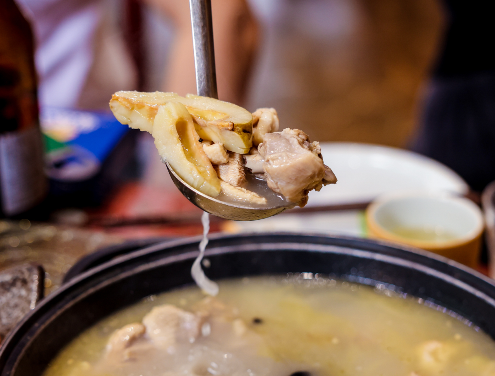
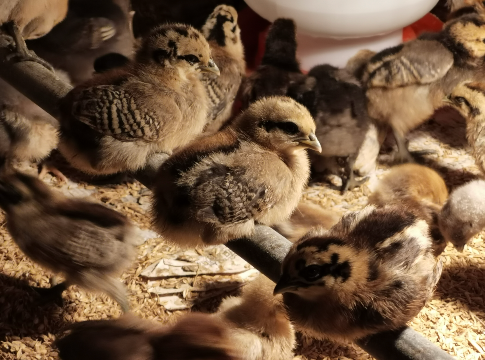
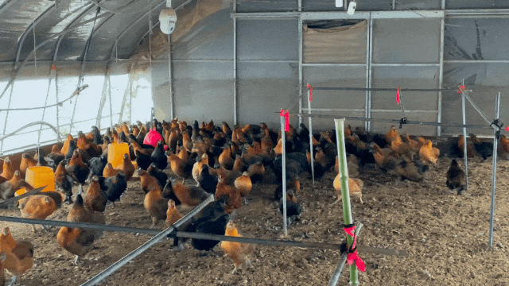
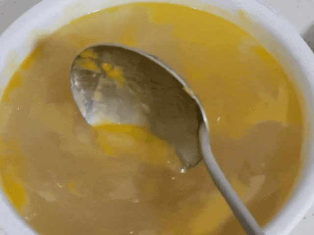
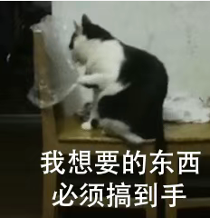
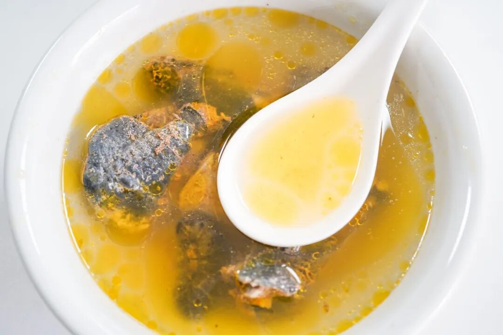
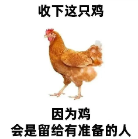
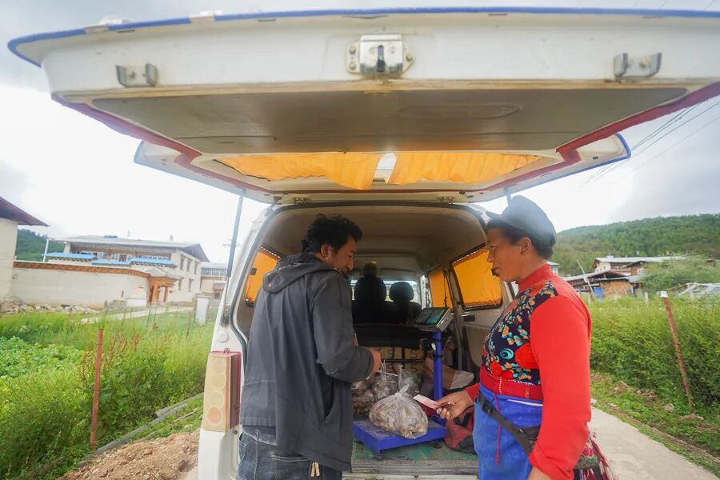
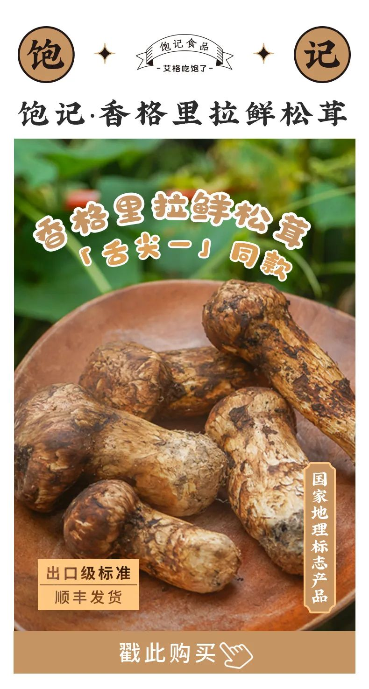

# 急需 132 个上海人，抓一只鸡

- 原文链接: https://mp.weixin.qq.com/s?__biz=MjM5NTYxODQyMA==&mid=2653456899&idx=2&sn=3a7ae6b7991958d0f884ef5b60a502ba&chksm=bc2d76aa5e36aa4a4ef7d41db0e9059be31cea48296ed0fb99bf28095d6b125bb5444fb650bd&scene=27#wechat_redirect
- 浏览量: N/A
- 点赞数: N/A
- 评论数: N/A
- 转发数: N/A

## 正文

南鸡北调？

一个尽情安利自我的公众号

以下是没事干研究院的风物研究报告请放心食用

啊啊啊我要闹了，

这只香晕全司的鸡，

本薯吆喝了一天，

它怎么还赫然在架？

我看你们是不想让我下班？

好了，

就剩最后一百来只，

卖完就可以收工！

上海半日达，

希望下周不再见了，

感谢🙏

我司荣耀之鸡，

——云南稀有瓢鸡，

和松茸一起炖汤，

鲜到掉眉毛！

说到此鸡，

可谓大有来头。

它们是上海援滇对口协作的产物！自 2020 年开始，飞出云南大山，落户上海金山。
（凭实力赢来一个户口？

全区上下不敢怠慢，金尊玉贵地养着：

比如为了保留它的野性和肉质，金山区直接在养殖区域内模拟了云南林地地貌，搭起了高床，让它能撒欢，打架，睡觉。

又比如这鸡在老家喜欢呆在树上，就专门搞了运动场和栖息架，满足它喜欢运动打架的天性。（要不就你肉质那么紧实呢

且搭配着玉米、豌豆、高粱这类天然粗粮和青绿蔬菜去喂。

这还不够，金山区比老家再卷一层，筛除致病基因，提高蛋白百分点，经过一轮一轮地淘汰，最终，把它养得比在云南还好吃！

一点腥味都没有！

油脂和胶原蛋白含量都非常丰富。

区里自己拿回家做过实验，这鸡完全可以支持加水烧上六次，到了后期，汤色会变白，冷却之后，QQ弹弹，duang~duang~duang~

你别看这图渣，你就看这蛋白含量吧。。
不过呢，这鸡数量真的有限，五六个月才能长成一批，一批就几百只，没货了就是没货了。外面完全买不到👌

这次我们好不容易补到了，目前仅剩 100 只左右，都是公鸡！！！卖完就下架。
只限上海地区购买，因为太热了别的发不了。。。

别担心！公鸡也一样油润！
且清香！个头也更大！

强烈建议之前没试过公鸡的这次选它，炖汤一样无碍！(本薯作为年轻人，甚至更喜欢公鸡的汤hh，

为给公鸡正名，限时 82 折！！！上海人民速冲！
今天下单，明天就能炖上～

饱记·云南稀有品种瓢鸡

和松茸一起炖鸡汤

只发上海地区

限时 82 折！！！

云南稀有品种黑脚鸡，

人称“人间小凤凰”。

上海定向引进，

吃天然粗粮长大。

目前只有公鸡，

目前只发上海，

（因为太热

上海地区半日达。

PS：瓢鸡蛋白质高血气味大，

宰杀时已经尽量放血，

但收到有可能还会有气味，

冲洗干净即可不影响食用！

戳图下单购买👇

可搭配瓢鸡一起炖汤的松茸，是雨季里的天赐美味。
饱记只发 1-2 级。有虫洞的、开伞的，都不符合标准，所以你吃到的，都是肉质弹力足的好松茸。

每天采摘后，

先送去冷库「打冷保鲜」，

让它们休眠，然后顺丰发货。

不经大宗交易市场，

都是第一手货源。

（有些没有打冷保鲜操作，松茸在路上就会腐烂老化！

所以放心吧，

你在家收到的松茸也是新鲜的！

谢谢老天爷赏菌子吃！下次要能多赏点就更好了！今年还是好贵，所以打不起折hhhh
饱记·香格里拉野生鲜松茸一口价！打不起折！购买方式如下
饱记的鲜松茸，采自海拔 3500 米以上原始松木林。只发 1-2 级符合出口标准的松茸。
新鲜采下送冷库保鲜，冰袋+吸水纸保鲜，顺丰发出。
戳图买它👇或🍑🍑🍑搜索「艾格吃饱了」

题 外 一

云南真好啊，

除了松茸和瓢鸡，

还有酥香的云腿酥，

拌着黑、白松露酱，

越嚼越香！

早鸟 86 折！！

饱记·滇式云腿小酥

预售中！！！

早鸟 86 折！！！

传统滇味经典，新鲜手作，浓情四溢。
🥮四个口味：经典云腿、蛋黄云腿，黑松露云腿、白松露云腿。
🥮三种规格：云腿酥礼盒全家福（四个口味各 2 枚）云腿酥礼盒双拼（经典云腿小酥*4 枚+蛋黄云腿小酥*4 枚）
云腿酥礼盒囤货装
（经典云腿小酥*30 枚）
现在是预售！预计 8 月初发货！

戳图买它👇

本文的研究员

薯角恐禽的朋友有难了

用好吃的方式吃一生

祖国各地好风物

文章转载请加微信「baojiclub」

