# 总有一些食物，是来报恩的

- 原文链接: https://mp.weixin.qq.com/s?__biz=MjM5NTYxODQyMA==&mid=2653457980&idx=1&sn=312be330592ab3429f476709c556e57f&chksm=bc5799b5ebb42fc36c718f821c706672a8334f599097a528586b7678b0a2358a85635e70f426&scene=27#wechat_redirect
- 浏览量: N/A
- 点赞数: N/A
- 评论数: N/A
- 转发数: N/A

## 正文

散装养生

一个尽情安利自我的公众号

以下是没事干研究院的风物研究报告请放心食用

如题。

总有一些食物，

是来报恩的。

好吃，不贵，

看上去一个比一个水灵，

还健康得没有负担，

馋了多吃几口也无妨。

说的便是我司这一枚

蜜蜜甜的

——饱记·黄金百香果！

周末从老板那里薅来一箱，

香啊～

打开后仿佛倒了一整瓶花果香水，

整个房间充盈着一种蜂蜜柠檬的清香。

徒手就能掰开，
取来勺子直接挖着吃，简直是行走的蜂蜜维 C 小炸弹！在丰富的香气和微微的酸度之外，有一种很浓的蜂蜜甜！

买了便知，比市面上的普通黄金百香果赢了多少。
毕竟我司卷的是正儿八经的钦蜜 9 号，
据说是农科院研制品种，还是海南核心产区。

在糖度和香气上，

和市面上的紫皮、黄皮，

你比，你随便比。

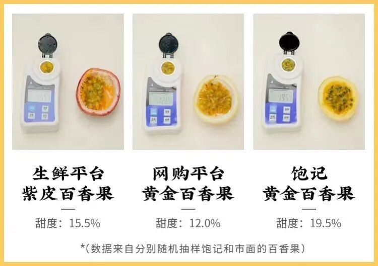

钦蜜 9 号声名在外

常有假货。

当地种植大哥说：

有的人会拿小黄金、大黄金来冒充。

便宜，但就适合饮品店怼糖浆，纯吃不行，口感一般。

饱记这个品种正宗，而且还是海南的陵水县种植，树上熟采摘。

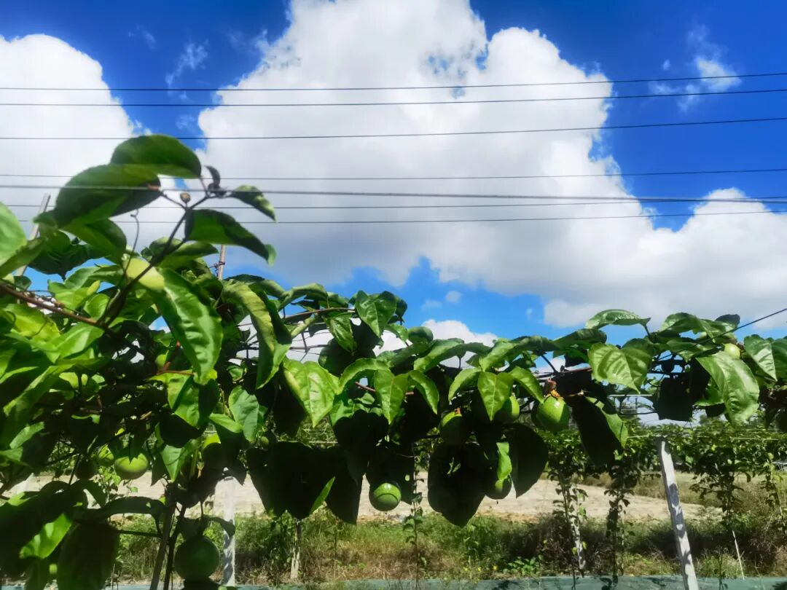

买吧，这司同事吃起来都是以箱计。
老规矩早鸟 86 折！
顺丰，海南原产地直发。到手就知道多厉害！

饱记·海南黄金百香果购买方式如下限时早鸟 86 折！！
正宗钦蜜 9 号，来自海南热带水果原产地
不同于紫皮品种，吃的就是这口甜。
戳图买它👇

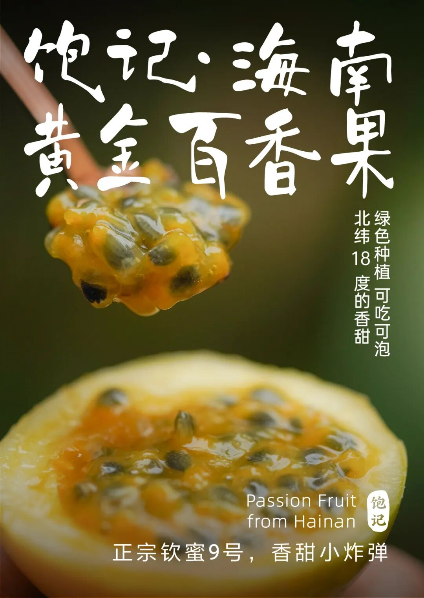

此外还有两位「减肥圣果」，（没有科学依据🙏只是，呃，你懂的曾于我司风靡一时，近期终于回归！
看似平平无奇，实则深藏不露！

喏，先说这个稀奇货，长得像佛头似的的燕窝果，老家在南美的厄瓜多尔，近几年才开始在海南种植。

面苦心甜，长得刺人，其实甜度高得吓人！！口感甚好，尝起来像滑嫩嫩的燕窝，入口有冰糖甜味～（本薯觉得有点像荔枝的香甜感

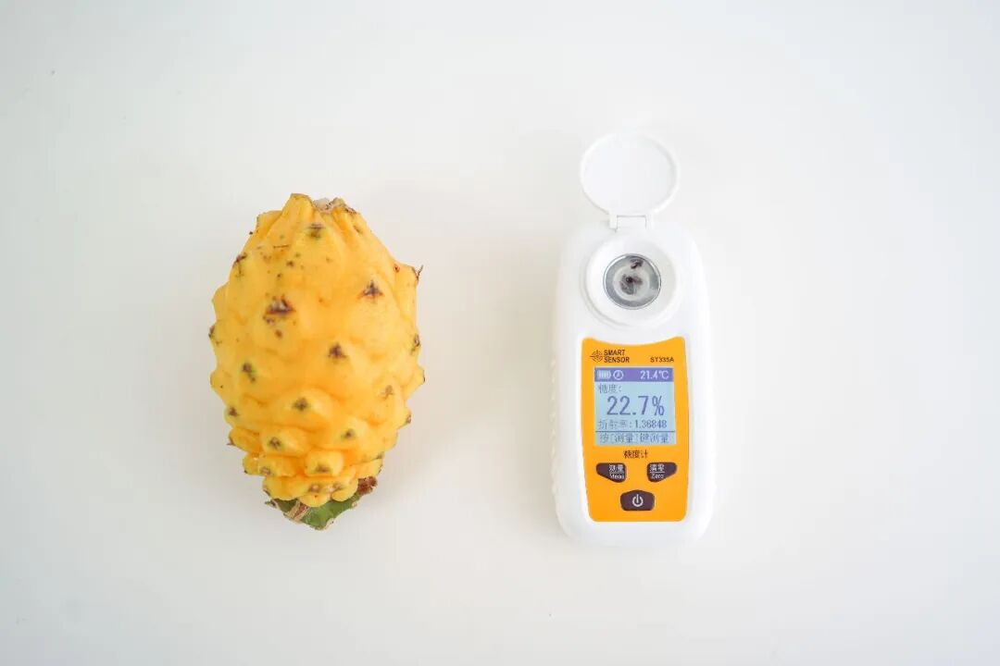

再到这个红艳艳的、高饱和的海南红心火龙果！一开始，本薯对老板的选择不屑一顾。尝一口：嚯～也是没想到火龙果还能这么糯甜！！糖度居然也有 20 以上啊啊啊～（老板：呵呵

原来它是非常规商超进口货，
纯正海南树上熟！

产自我司冲到海南实地考察，跑遍几个山头卷出来的小产地生态高山果园！九分树熟鲜采发货。特点是叶薄皮皱。

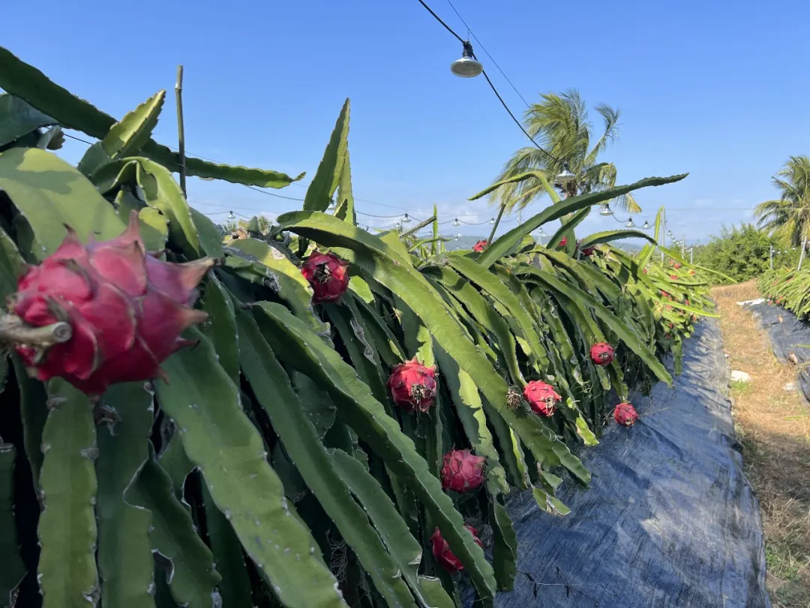

入口水分好足！强烈建议大家买它一买，尝上一尝！仙品！

靠天吃饭，回归不易！也给大家薅来了一个限时 86 折！！
饱记·高甜火龙果家族
购买方式如下限时回归 86 折！！
膳食纤维小能手！打工人王炸组合！！！
高甜火龙果家族！饱记指定小果园，海南阳光里养出来的熟甜！
戳图下单购买👇

最后是这非常懂事的冰糖水果玉米，

来自云南西双版纳，

多汁，清甜，

免煮可生吃！

到手直接开啃。

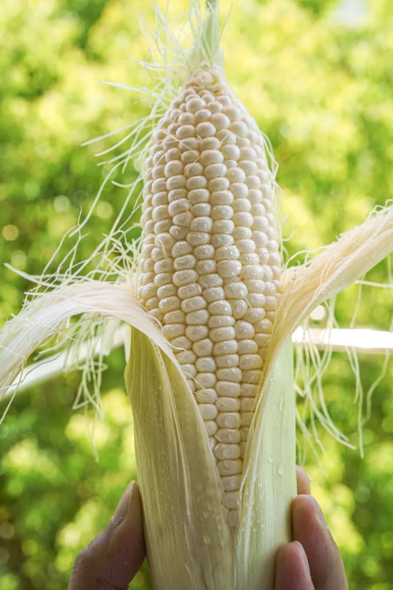

一口咬下去，

清爽的汁水在唇齿间爆开，

嚼起来又脆又嫩。

完全无渣！

表皮存在感极低，

感觉每一口都是玉米肉。

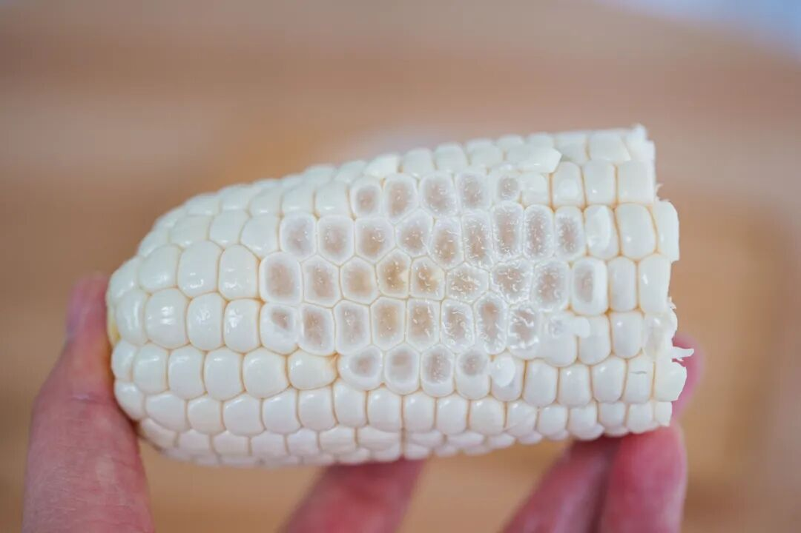

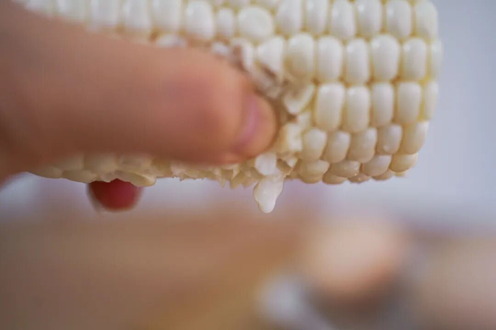

再随手测一下糖度，

都在 15 以上，

（普通玉米糖度通常只有 4！

但不是那种齁甜！

比雪梨还清爽，

甜而不腻哦～

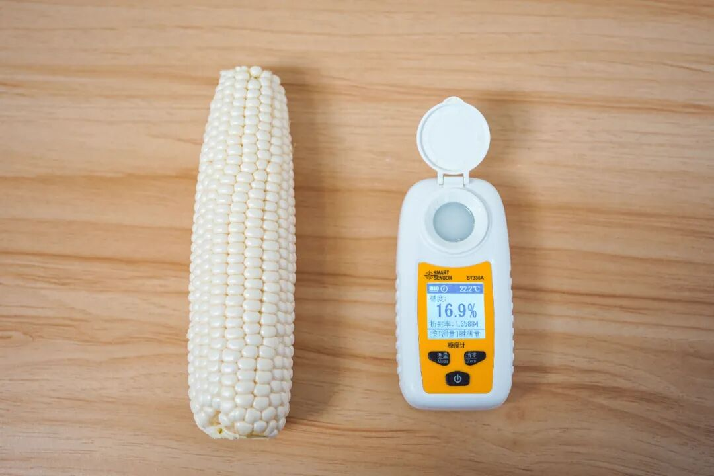

和我司摄影师边拍边炫，

不知不觉，

两个小胃人士炫了五六个，

换成普通黄玉米，

一个不能再多了

这么难得的好吃，

最推荐剥叶生吃！

尤能体验玉米的原汁原味，

且非常适合我等懒人～

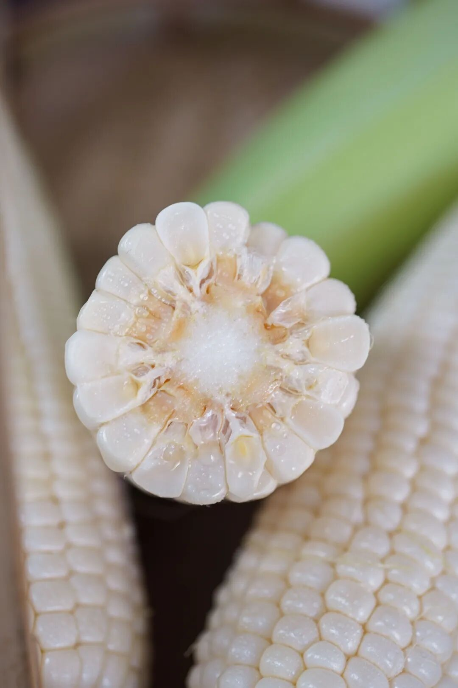

实在想吃熟的，

也可以水煮 5-10 分钟！

入口一样是脆的哦！

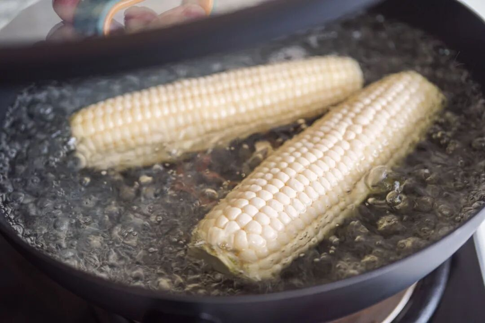

好吃不怕胖，现在还有

限时 9 折！！

要说这散装养生，

还是得看我薯角啊～

饱记·水果玉米购买方式如下限时 9 折！！
剥叶即食，

亦可煮熟当粗粮！

🌽两个规格

3 斤中果装，6-8 根

（单果重200-250g净重2.8斤+）

3 斤大果装，5-7 根

（单果重250-300g，净重2.8斤+）

水果玉米自西双版纳采摘后

将优先冷链发往福建，

经智能化专业包装处理，

加入冰袋保鲜，

再极速寄出，

最大程度保证新鲜～

戳图或去🍑🍑🍑搜索「艾格吃饱了」下单购买👇

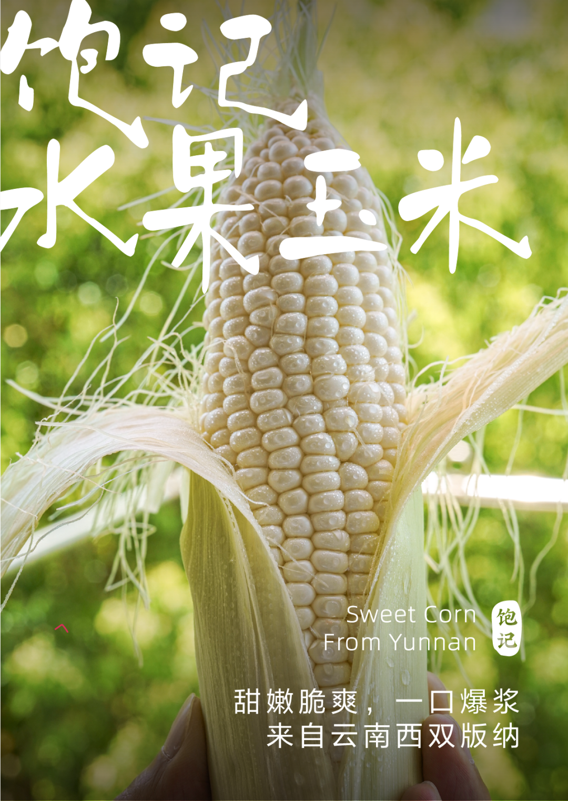

题 外 一

无所谓胖不胖的继续往下看。

外面买不到的奶黄月饼，

半岛嘉某楼奶黄月饼的创始配方，

邀请米其林大厨调整减糖，

趁还在预售，早鸟 86 折！！

还有卷了三年的云腿酥，

嚼得出宣威火腿的鲜甜，

限时 9 折！！！

好吃得不得了，

但是别问热量🙏

饱记·奶黄月饼礼盒
预售中！！！限时早鸟 86 折！！
饱记独家配方，外面买不到！
🥮 新鲜手作，外皮酥脆，内里奶香浓郁～
每日限量 100 份。预计八月底按下单顺序发货～
戳图买它👇

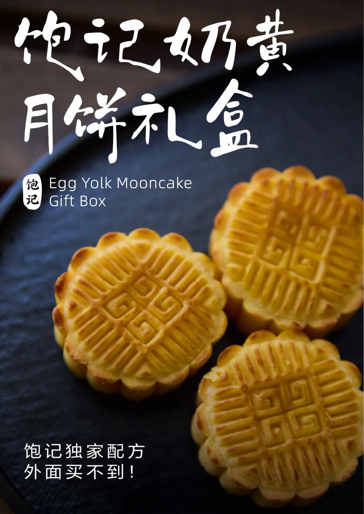

饱记·滇式云腿小酥
现货！！！限时 9 折！！
传统滇味经典，新鲜手作，浓情四溢。
🥮四个口味：经典云腿、蛋黄云腿，黑松露云腿、白松露云腿。
🥮三种规格：云腿酥礼盒全家福（四个口味各 2 枚）云腿酥礼盒双拼（经典云腿小酥*4 枚+蛋黄云腿小酥*4 枚）
云腿酥礼盒囤货装
（经典云腿小酥*30 枚）
戳图买它👇或到🍑🍑🍑搜索「艾格吃饱了」

题 外 二

有时真为一些食物不平，
这么好吃怎么无人问津？？天然酸甜的空心山楂球，
越啃越香脆的圆墩墩玉米浪，以及招牌南乳香葱蛋卷等，
含泪临期清仓，都是实打实的折扣！！无需凑满减！⚠️PS：清仓产品临近效期，介意慎拍～

饱记·临期清仓专区
5 折起！

清仓产品临近效期，所以巨折，但自家吃吃没问题！介意慎拍～
「临期清仓」专区，5 折起！！清仓产品临近效期，介意慎拍哦～戳图买它们！！👇

本文的研究员

薯角很高兴为您服务！

用好吃的方式吃一生

祖国各地好风物

文章转载请加微信「baojiclub」

