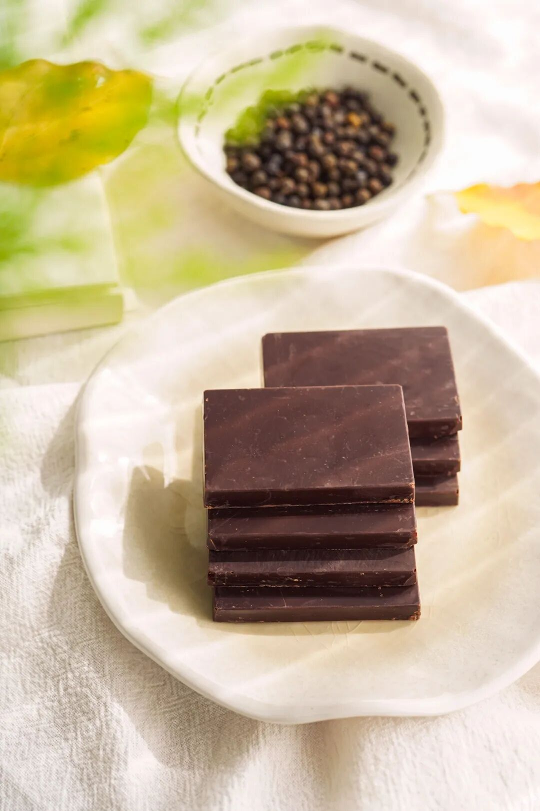
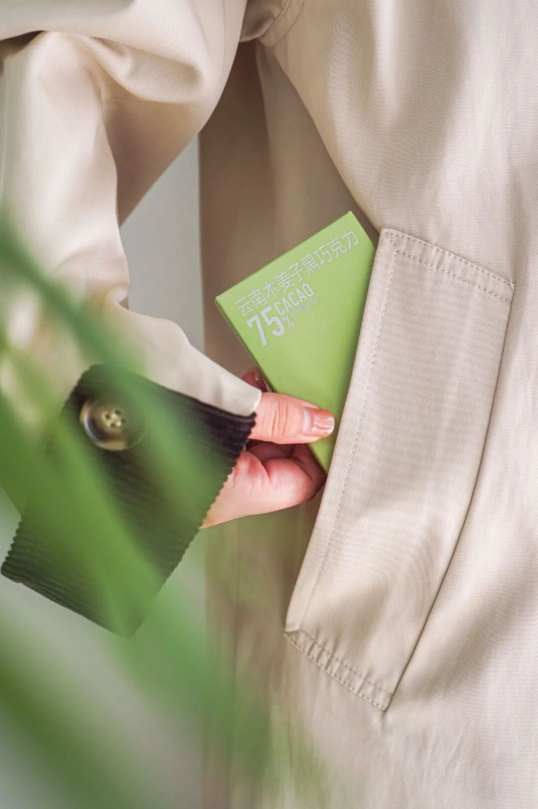
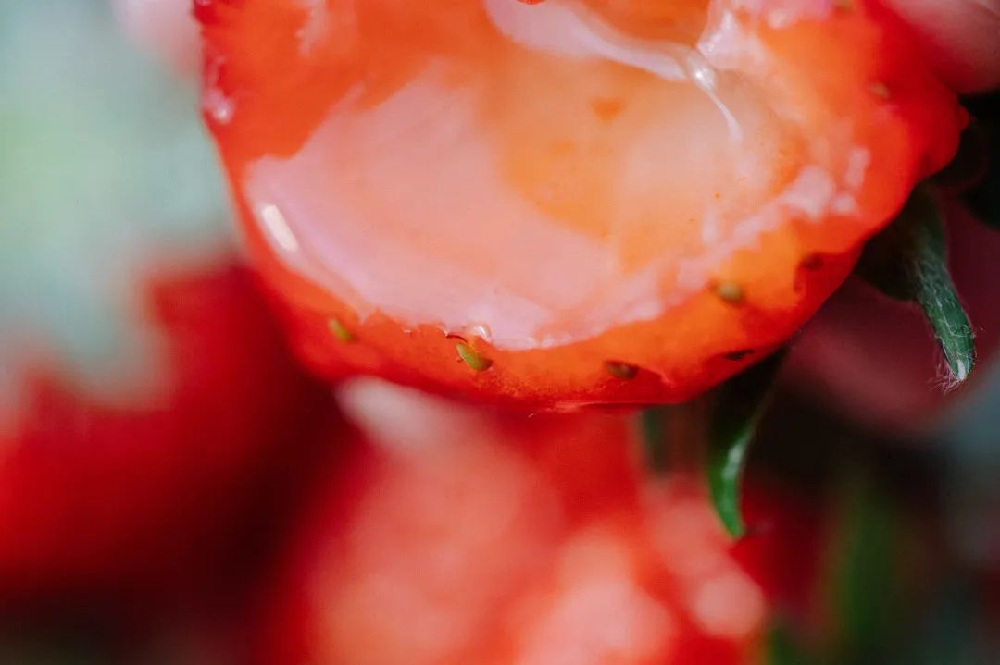
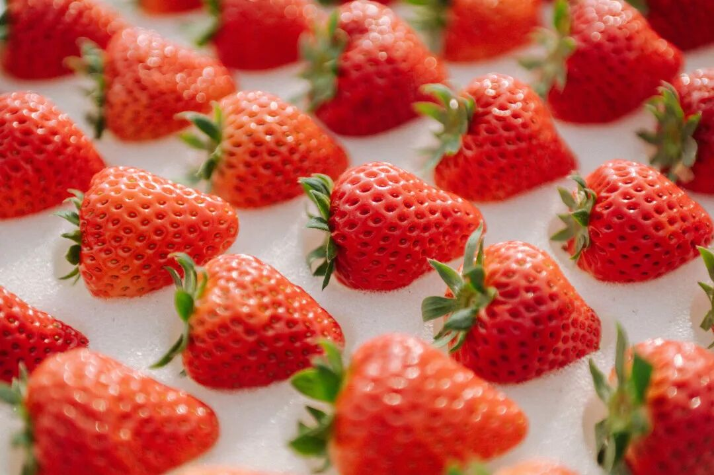
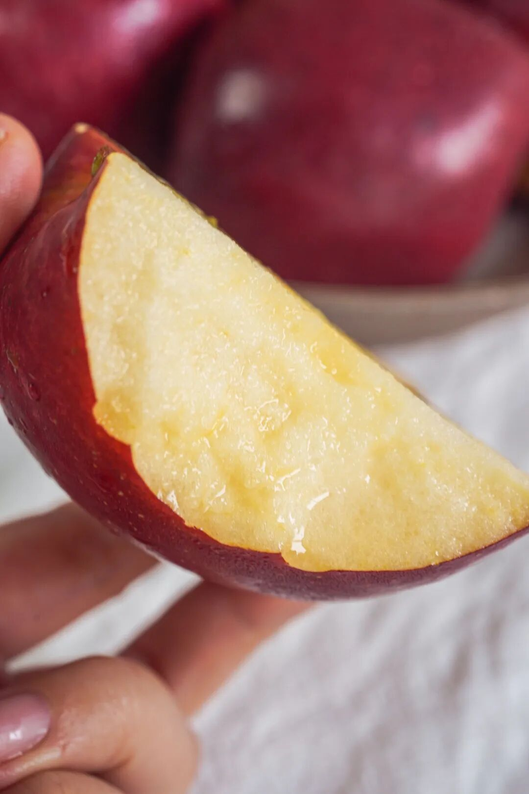
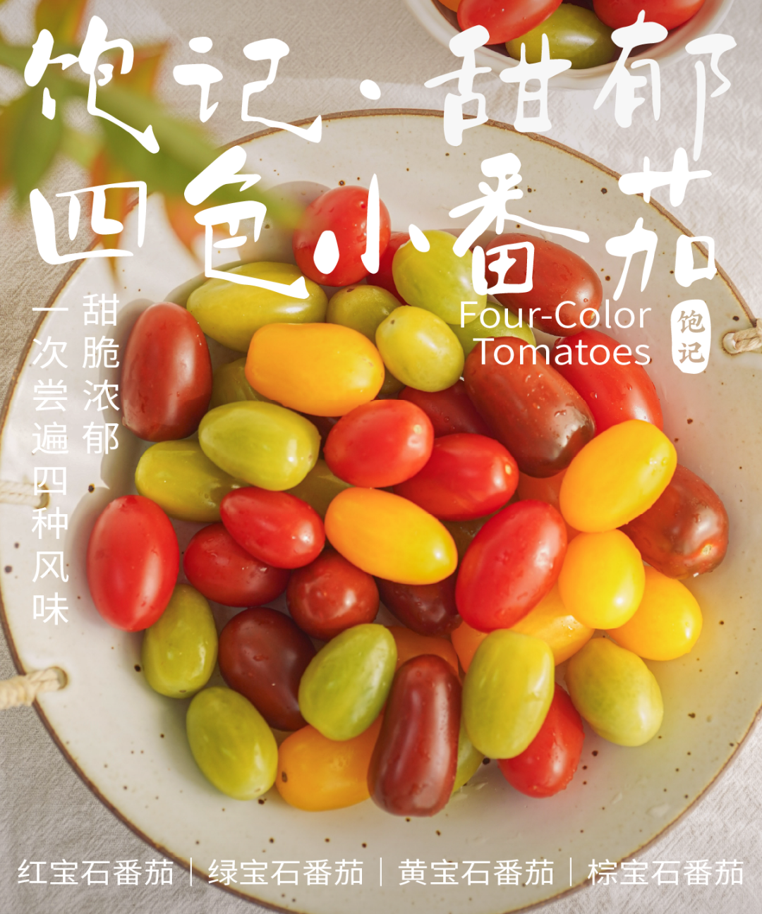

# 情人节你们过，这种好东西留给我

- 原文链接: https://mp.weixin.qq.com/s?__biz=MjM5NTYxODQyMA==&mid=2653466486&idx=1&sn=aec90894f94035f47733f04df221628d&chksm=bc5b3069a8091efce43673e05bb3bdc803cc4ab545f7e5c6f732aa46c50780590b693964b683&scene=27#wechat_redirect
- 浏览量: N/A
- 点赞数: N/A
- 评论数: N/A
- 转发数: N/A

## 正文

智者不入爱河

一个尽情安利自我的公众号

以下是没事干研究院的风物研究报告请放心食用
朋友们明晚怎么过？？在本薯看来，不放假的节都不值得一过

但为表一番诚意，今天也拎三样东西应应景啊！有情人互相送，打工人（？）周末吃！

爱的礼物其一：

外面根本买不到的
饱记·云南木姜子 75% 黑巧克力！够特别！有记忆点！又美丽！完美满足送礼需求嘿嘿，
还是那种浑然天成的好吃！

重要的话放前面说！
配料表简单，
没有大家关心的“代可可脂”

来，配料表都给大家直接呈上👆
很多人买黑巧，最怕入口有涩酸味，这样嚼起来就不香。

所以产品同事这次在开发的时候，只想纯粹去还原大家心中可可该有的感觉！香味要足，入口不过分甜腻也不会涩口。最后选的这款 75% 的高可可含量奶巧，包容度更高，适口度更好，平衡奶巧的甜和黑巧的苦且保证顺滑，
总之，就是那种方方面面都让家长顺心顺意的“好小孩”！

这款黑巧的特别之处，还在于加入了云南香料木姜子油！常吃西南菜的朋友一嚼就会想起来了。
木姜子的香气清新得不得了，有点像柠檬和香茅的结合体？这次调试了很多次，
最后让木姜子主要呈现出的就是香气，尤其尾调，醇厚的可可过后，有明亮欢快的木姜子清香收尾！

之前有朋友问：减肥能吃吗？感觉减肥其实什么都能吃。。。
只是吃啥都得适量吃？这款一盒 45g 的参考热量是 281 卡，大家自行判断哈！

看这清新自然的纸盒设计，送礼自留两相宜👇

塞口袋里不占地，随身揣着走，随时充能！

每盒里有 4 小块，平时聚餐饭后给朋友分分，夺松弛惬意的小甜点啊～

好了，剩下你们自行看商详吧！给大家来个限时节日 9 折！！都给我买啊啊啊啊啊！

饱记·云南木姜子75%黑巧克力购买方式如下限时节日 9 折！！
戳图下单购买👇或🍑🍑🍑搜索「艾格吃饱了」

爱的礼物其二：

比丹东草莓还要卷的上海白鹤红颜草莓！保证吃完甜到心里哦！

它又可称之为，看了就想偷吃、吃完就会下单的万人迷草莓👇

不是来了这司，本薯属实不知，上海，竟是个种草莓比丹东还卷的地方。。。作为中国最早栽培草莓的地区之一，种植技术早已卷到飞起，却一直不声不响！

「白鹤草莓」，

乃上海草莓之代表，

被评为「中国农产品地理标志」，

青浦更是当下国内外主要的草莓产区之一。

我饱记选的，拿过上海地产优质草莓品鉴评优活动的金奖！

完全按评金奖要求挑的，

评委吃的啥我们也吃的啥～

（是的，就是这么骄傲！

这金奖草莓，还没有入口，就能闻到剧烈的香气。

咬一口，汁水在口腔里蔓延，

鼻腔同时又被弥漫的香气包裹。

真的会上头。

此外，它还品相极佳，个头秀丽，颗颗都饱满红艳，
因为还是饱记标准，每一颗都要经过人工精筛嘿嘿～

大家关心的草莓农残问题，

这一点，请放一百个心！

上海对地产草莓的监管很严格，

是要纳入上海市种植业生产信息管理系统的，

所以都是有据可查，几乎没什么农残。

合作社的果农们说，

自己平时在地里渴了，

也会随手吃点草莓当水喝。

（hhhhhh我一点都不羡慕

白鹤各家合作社种植户遵从绿色种植原则，

采取有机种植方式，

比如会在大棚内养蜂，让蜜蜂给草莓自然授粉，

设置捕虫袋，通过物理的方式来抓虫，

有的还会利用合作社种的玉米杆子，

给草莓土壤补充营养。

最重要的是，如果你和本薯一样生活在包邮区，
这草莓有压倒性的优势！丹东的草莓当然不差，

可能大家不知道，买草莓，

本地能吃到是最好的。

这里主要是运输上的损耗。。。

丹东草莓发货一般在六七成熟，

但是白鹤草莓可以做到八九成熟再采摘发货，

那当然是更软糯更浓郁啦。

（所以大家现在可以打开地图看看距离了。。。

非我薯角自夸，

看看后台去年真情实感的好评👇

好了，

今天真是唠深了，

你们看着点买吧。

要本薯说，

这一盒可比花美多了。。。

饱记·红颜草莓

限时吃水果 9 折！！！

节日莓有烦恼！！

戳图购买👇

爱的礼物其三：

便是来自陕西的瑞香红苹果，嘎嘣脆！入口像在吃苹果味的蜂蜜！一股迷人的浓香和浓甜👇
红彤彤的好吃！

来头不小，

是西北农林科技大学团队用 20 年时间

培育出来的优质晚熟苹果品种。

拿“富士”苹果和“粉红佳人”苹果杂交而来。

只挑双方的优点长！

所以每一颗都遍体通红，

一口下去果肉在唇齿间崩开！

之前给大家上过云南产区，
这个季节换到陕西产区。

饱记合作果园

由西北农林科技大学团队管理指导哦！

科学种植，物理防虫。

不催熟、不打蜡、不套袋，

让苹果在大自然里自在生长。

毕竟没什么狠活，

老人小孩才能放心吃啊！

入口是那种温柔的脆感，

略微带一点粉度。

所以完全不磕牙！

还是饱记标准，发货前要人工精筛数遍，

淘汰掉次果，

只留大果好果～

上海的干燥天气，
这苹果薯角我一天炫俩，不怕上火不怕齁甜，润得人心满意足！同样限时节日 9 折！一起甜蜜平安？

饱记·陕西蜂蜜红苹果限时吃水果 9 折！！节日苹苹安安！！！

戳图购买👇

题 外

还有一些节日之选，

没吃够的朋友看这里👇

饱记零食礼盒，

天🐱有赞同折扣！

限时开门红 85 折！

即将尾声的富平柿饼，吃完就没！

尾声限时 85 折！

回到童年的铁盒蛋卷，

产品经理卷出来的鸭舌、麻花、猪肉脯，

都给一个限时 7 折！！

还有些适合空调房吃吃的水果👇

七彩玲珑的四色小番茄，

趁现在限时早鸟 86 折！！

个头基本都在18mm+的云南露天蓝莓，

微甜饱腹、没啥热量的广西双拼芭乐，

现在也有限时 9 折！

此外 90 天短保质期的大师凤梨酥，

也都有限时 9 折冲冲！

还有刚补货新到的饱记腊味们，

也都有限时 9 折冲冲！

饱记·零食礼盒

购买方式如下

开门红限时 85 折！！

戳图下单购买👇

饱记·富平柿饼购买方式如下尾声限时 85 折！！！
戳图购买👇

饱记·限定铁盒酥酥蛋卷

购买方式如下

限时开门红 7 折！！！

戳图购买👇

饱记·年味零食7 折专区！！
购买方式如下
戳图购买👇

饱记·甜郁四色小番茄

购买方式如下

限时早鸟价 86 折！！！

戳图购买👇

饱记·云南高原蓝莓限时吃水果 9 折！！！新年莓开眼笑！！！
戳图购买👇

饱记·广西双拼芭乐

限时吃水果 9 折！！

新年健康快乐！！！
戳图购买👇

饱记·新鲜到货凤梨酥

限时 9 折！！！
戳图购买👇

饱记·手工腊肠购买方式如下👇限时全年地板价
戳图下单购买👇或🍑🍑🍑搜索「艾格吃饱了」

饱记·玫瑰露酒腊肉&腊排骨购买方式如下👇限时全年地板价
戳图下单购买👇或🍑🍑🍑搜索「艾格吃饱了」

本文的研究员

薯角只过劳动节

用好吃的方式吃一生

祖国各地好风物

文章转载请加微信「baojiclub」

