# 我为什么讨厌当时装编辑。。。

- 原文链接: https://mp.weixin.qq.com/s?__biz=MjM5NTYxODQyMA==&mid=2653459482&idx=1&sn=07377b6ca088b0eac887ee935884b9d9&chksm=bc1ad67d5e079f616286f6a1567250051756911a928cc3536d41e05d7fd27f6dedd2f3b95990&scene=27#wechat_redirect
- 浏览量: N/A
- 点赞数: N/A
- 评论数: N/A
- 转发数: N/A

## 正文

吐槽一下更健康

每周消费报告
均没有广告软文请放心食用

最近三不五时周日在实习直播，

效果嘛。。。

据说一场已达小某书腰部主播营收？？？

啊这才一场几千啊，

腰部主播看来肯定要有正职工作的，

上班摸鱼下班播，

不然怎么活？

但身为一名做题家，

我其实还是蛮想继续卷一卷的，

本周日打算上一位 02 年出生的助播。

情感、职场和穿衣服话题都可以投稿，

你问我答，啥都可以答哦。

为啥我可以答呢？

比如情感问题，因为我是中年人，

爱八卦，

各种年纪情况都看得多。

职场嘛，因为我之前采编经历里

有好几年的大公司办公室八卦报道，

每周一收牛马们朋友各种匿名职场吐槽，

还采访过很多高管、HR，

双方角度齐全，定有一款方案可以给您解决。

至于穿衣服，

我做过七八年时装编辑。

当时本报发行量蛮好的，辐射全上海中产，

一溜奢侈品牌比如香奈儿威登，

都希望我们多多报道。

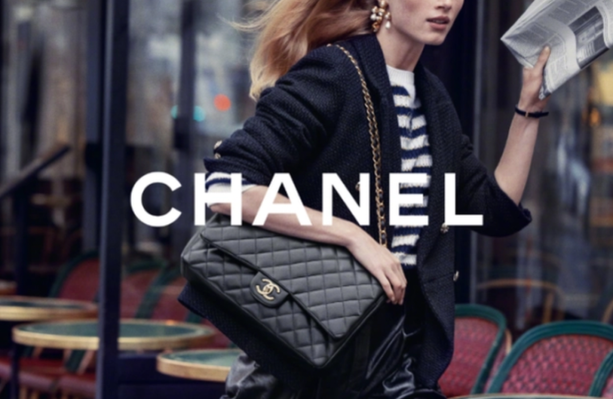

香奈儿和路易威登当年承包了本报时尚叠的全年封底广告

而不理我们报纸的品牌比如爱马仕，

感觉我可以黑它终生了hhh

看起来我个中产，以后也不会买它！

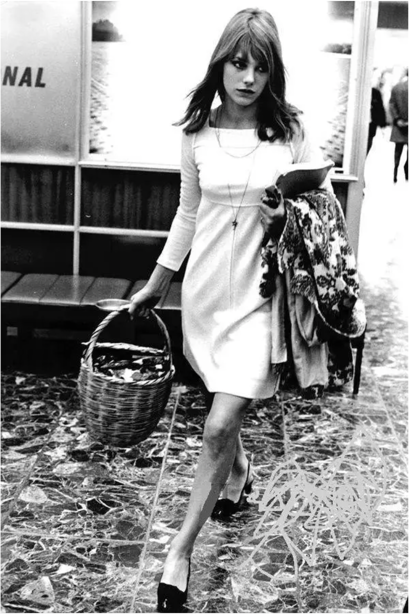

但我们也会友情写一些爱马仕的内容：比如 Jane Birkin 生性爱菜篮子，爱马仕就给她设计了一个 Birkin 包放奶瓶尿布，当年也就三万多hhh

不过我没想到，时装编辑的从业，

直接催生了我开写美食：

08 年起写的餐厅评论「一个人点评网」。

现在想来，

它实际上是在对冲我的职场内耗啊。

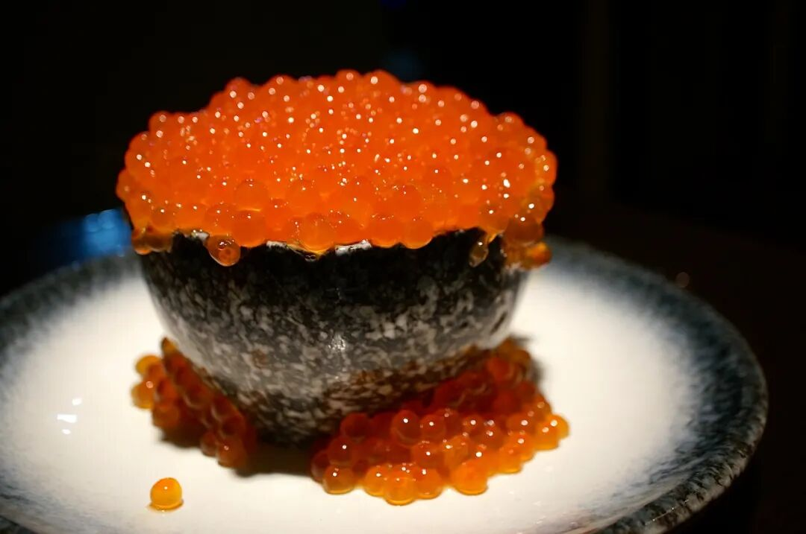

2012 年，小居酒屋吃的鱼子饭

我当时真的超讨厌做时装编辑～

因为这是一个真正【以貌取人】的行业。

而且当时很多从业者，

无论是品牌还是编辑，眼睛势利，

嘴还很欠。

当时我混得还行，全靠朋友捧场，

吃饭看秀一般位次能混到

五大时装杂志之后

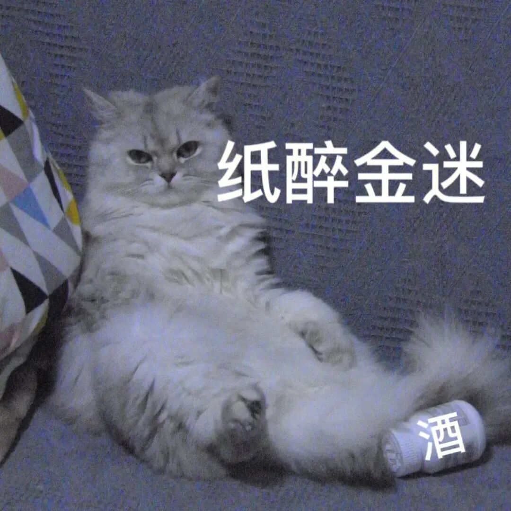

一方面是我确实可以被以貌取人。。。

当时身高 172 ，体重 52 公斤。

穿上 10CM 高跟鞋

烫个爆炸头涂上枯木红口红冷冷站那儿，

自露大长腿。

很多贱里贱气的人看到我：弹开。

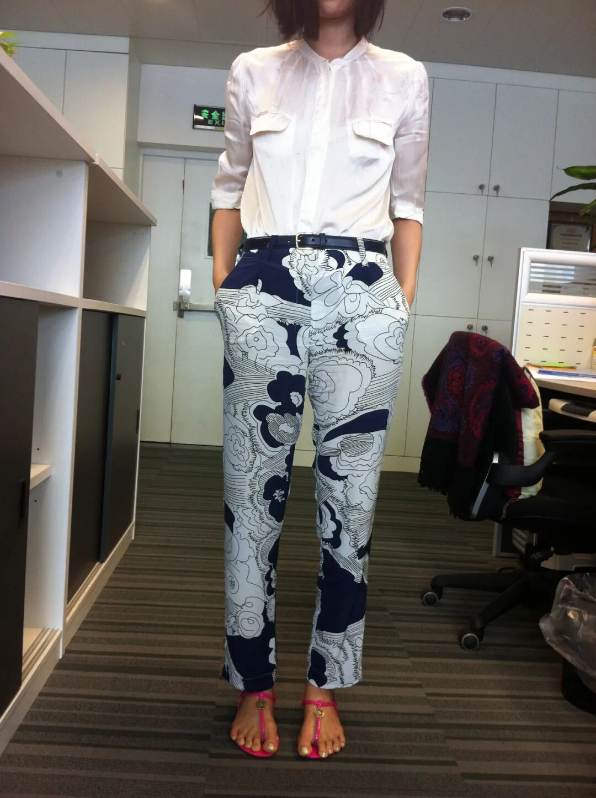

2011 年上班日常。现在我快乐地重了 10 公斤，都不感冒了！

另一方面，就像《穿 Prada 女魔头》里

那个误入时装界的做题家女孩一样，

我也很快学会如何穿着打扮。

碰到装里装气外带 PUA 路数的人，

我有模有样，气场装得比他还势利，

导致对方完全不敢对我动手hhhh

由于高跟鞋穿起来实在太累，

我还经常从活动上早退。

可能就是跑出去吃饭再写餐厅评论了hhh

但因为我写得好嘻嘻嘻，

确实也有很多同行看。

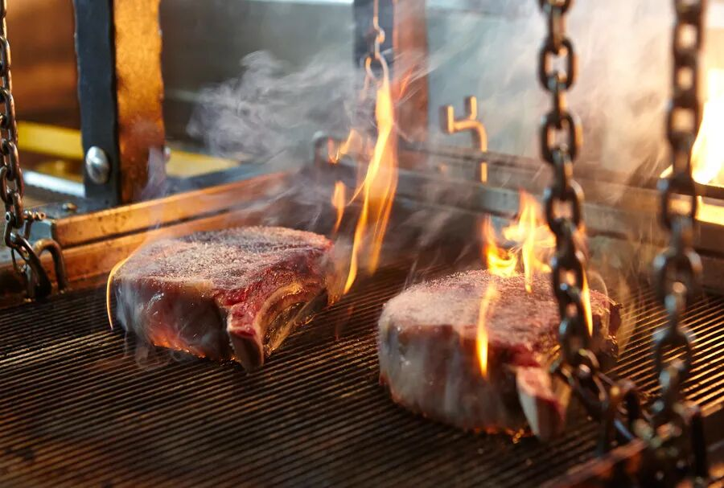

2010 年静安香格里拉牛排馆请了澳洲 Butcher 来主持。其切割、熟成和烹饪的专业度，上海目前热门的黑珍珠牛排馆我认为是颇有不如的

没想到这也成了我的一个人设：

很多年后，有做活动的品牌小伙伴说，

「我们内部是这么看当天的餐食和点心质量的：如果闻佳留到最后，就说明合格了。」

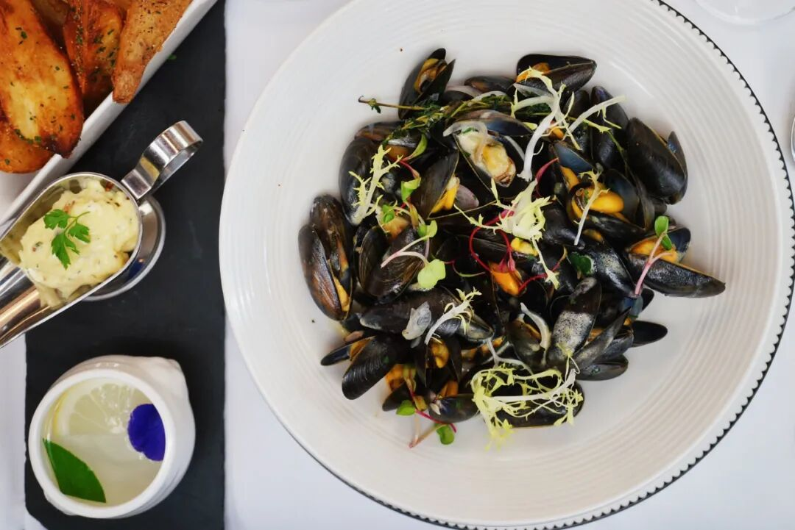

上海最早开业的正经归国米其林厨师法餐厅，已歇业

我：？？？

哈哈哈哈其实我是装得太辛苦了才早跑路好吗

在这个行业的职业内耗，

在我身为做题家

总结出了行业势利眼的逻辑后，

达到顶峰。

他们动辄管人叫乡下人，

是在挑剔啥？

是得体。

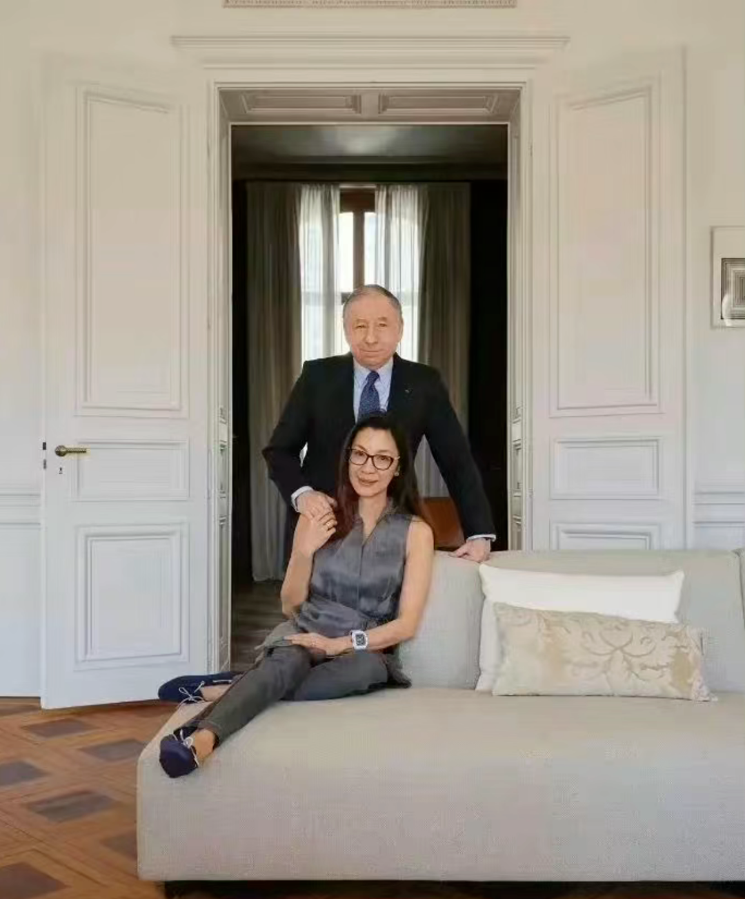

杨紫琼和夫君合影，注意她脚上的 TOD's 豆豆鞋，是室内 / 开车穿的。想当年我们白领谁不是买来穿出过门觉得脚疼hhhh

这个得体包括衣着得体和举止得体，

比如去游艇上穿高跟鞋就是乡下人，

出差坐飞机头等舱带龙骧的包包就是白领，

看秀时穿貂简直可怕，

英文口音不准的绝对不许送去采访法国老板……

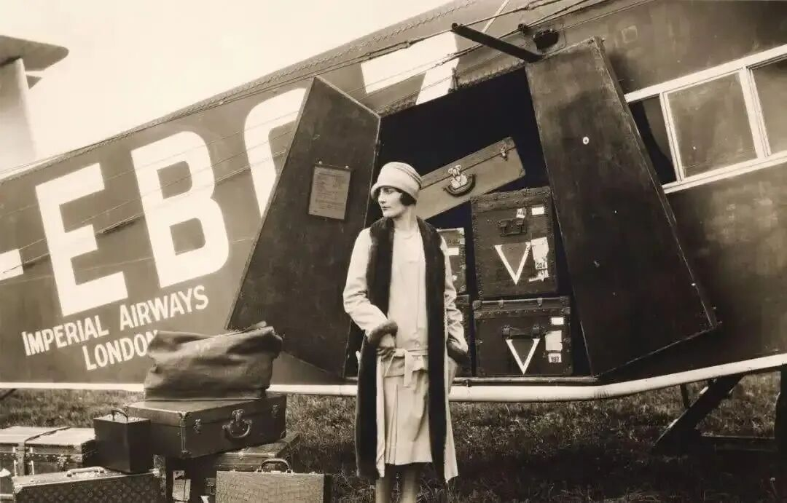

路易威登的硬箱，最早都是有钱人旅行时仆从搬。所以现在你最好只买来当家具，出门如果没有佣人自己搬，时装界势利眼就会认为你是乡下人

总结下来，实际上就是你要在任何场合，

都要游刃有余，【看起来很习惯的样子】。

在此基础上，还要潮流时髦，

不能很白领。。。。

你得【看起来像老钱】。

《继承之战》剧照，这都很老钱，但在当年混时装界，还不合格哦（不时髦hh

。。。

理解了这一点我就非常无语。

放眼我们时装行业，

从品牌到编辑小伙伴圈子，

全是中产，

咱装什么老钱？？？？

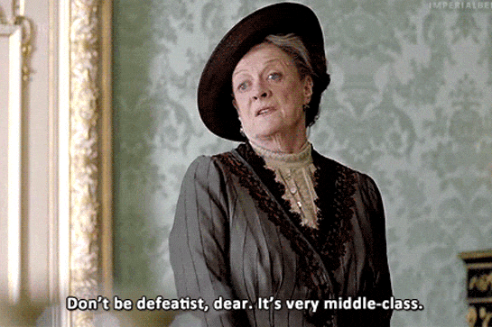

客观地说，甚至你是中国人，

你就没有老钱。

我国曾经的老钱住所哈哈，图源《中华英才半月刊》

所以现在每次小某书教你「老钱风穿搭」，

我就摇头无语。

因为所谓老钱穿搭，

其实完全无法通过平价衣服来完成。

剪裁面料，一看就透。。。

《继承之战》里有钱人穿 Brunello Cucinelli，公司高管穿中产品牌 Armani 西装，而穿 Moncler 露 LOGO 的会被嘲笑

在周围人 PUA + 鄙视链的组合拳里，

（而且这些人完全不动脑，都不知道自己鄙视人的逻辑是啥。。。

我在其中混得还挺好，

那我可不得精神内耗啊。。。。

所以我就通过写餐厅评论，

培养吃餐厅的爱好，

来对冲这种内耗。

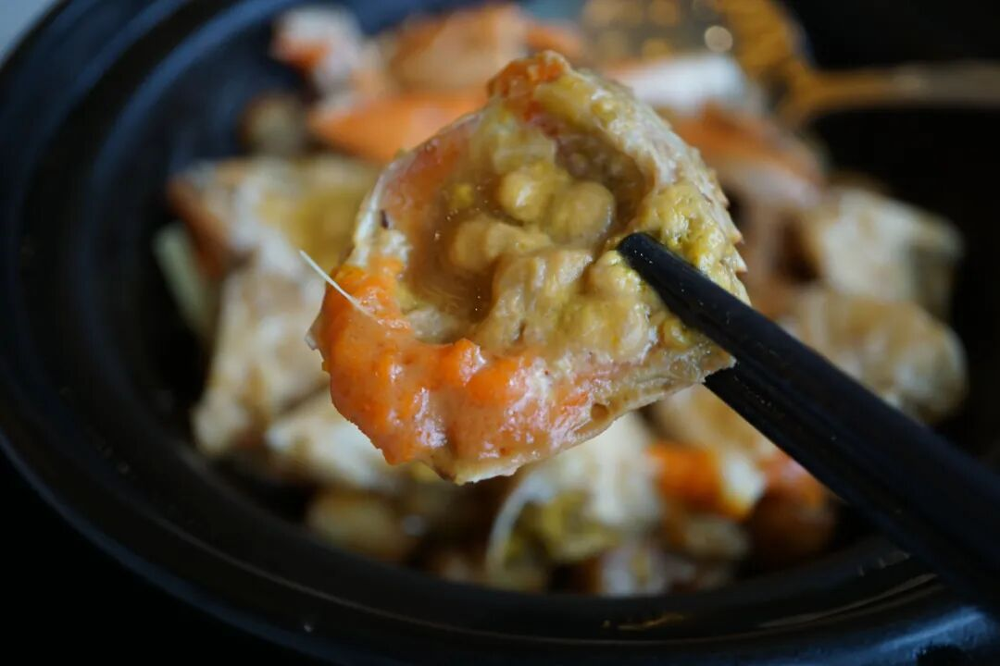

爱吃各种膏蟹，结论是潮汕人烹得最妙，食材是湛江膏蟹最好！

你看《纽约时报》《金融时报》的餐厅评论，

都有严格的编辑守则而且很严肃，

那我也希望在工作之余

进行一些严肃的编辑工作呀～

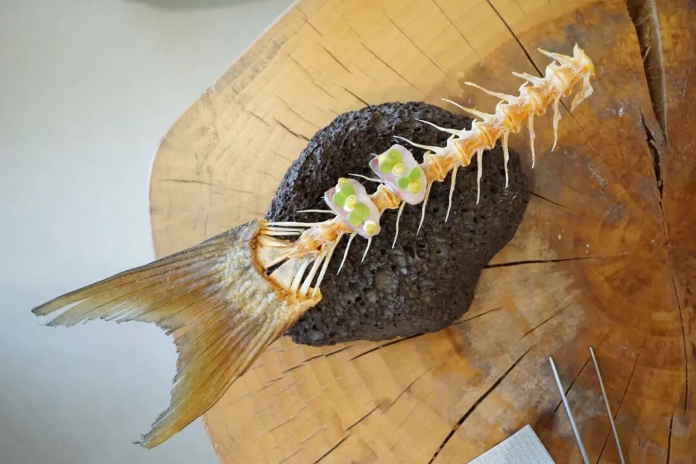

出去玩就是吃吃吃，这是西班牙一家米一

严肃到什么程度呢，

我认为要点评某个餐厅，就需要懂这个菜系。

为此我包邮区菜系跟了毛老师好几年，

粤菜请教的是米其林大厨，

全套法餐和甜点我都和米厨学过，

葡萄酒我去考了 WSET 三级。

就这样我还不敢随便点评川菜和云南菜，

因为很多香料我不熟悉。。。

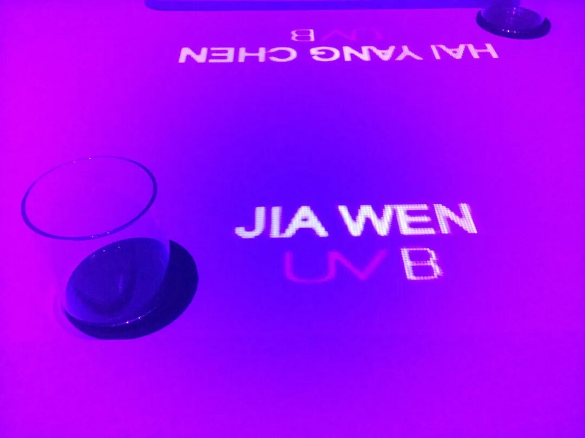

2014 年第一次吃 UV，后来滚完了它的四套菜单。很喜欢～但要点评法餐，最后还是去跟欧洲回来的米其林二星餐厅大厨学了五天全职课程

所以后来看到那种法餐意餐广东菜

包邮区全敢点评的「真探」。

我都不知道说什么好。

后来看了几下，结论是，

观众吃不起的店他大力拉踩，

观众日常吃的他精心点评。

和时装圈儿的中产从业者都爱演老钱一样，

没了。

话说我这么讨厌时装行业，

为什么不改行？

还是因为当时吃得太好了。。。

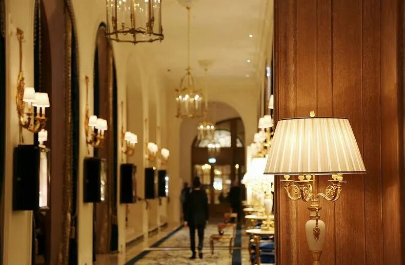

图源：巴黎丽兹酒店官网

出门商务舱起步，

住奢华酒店（万豪之类出差普通五星不算好吧？

就连吃个海南鸡饭，

都是在新加坡文华酒店的高楼旋转餐厅里，

给你娓娓说这个盒饭它卖 300 块，

究竟好在哪里？

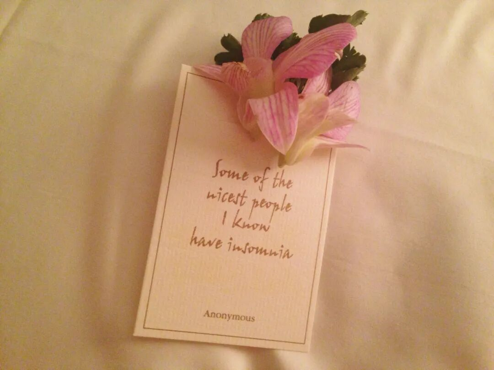

这么多酒店里最喜欢文华酒店，他们每家店都有很有趣的服务小技巧

没事明星随便排队送到面前拍照 + 聊天采访，

有时我们编辑还要搭个架子。

十年前我和梁朝伟面对面无话可说，

他这个 i 人只好冲我眨他的电眼时

我感觉整个人膝盖发软好吗！！！！！

就是这种类似代言手表的活，酒店房间场景hhh

虽然工资全部交给工作，

（你觉得演老钱不需要真的花钱吗

但我当时真舍不得这纸醉金迷的行业啊～～

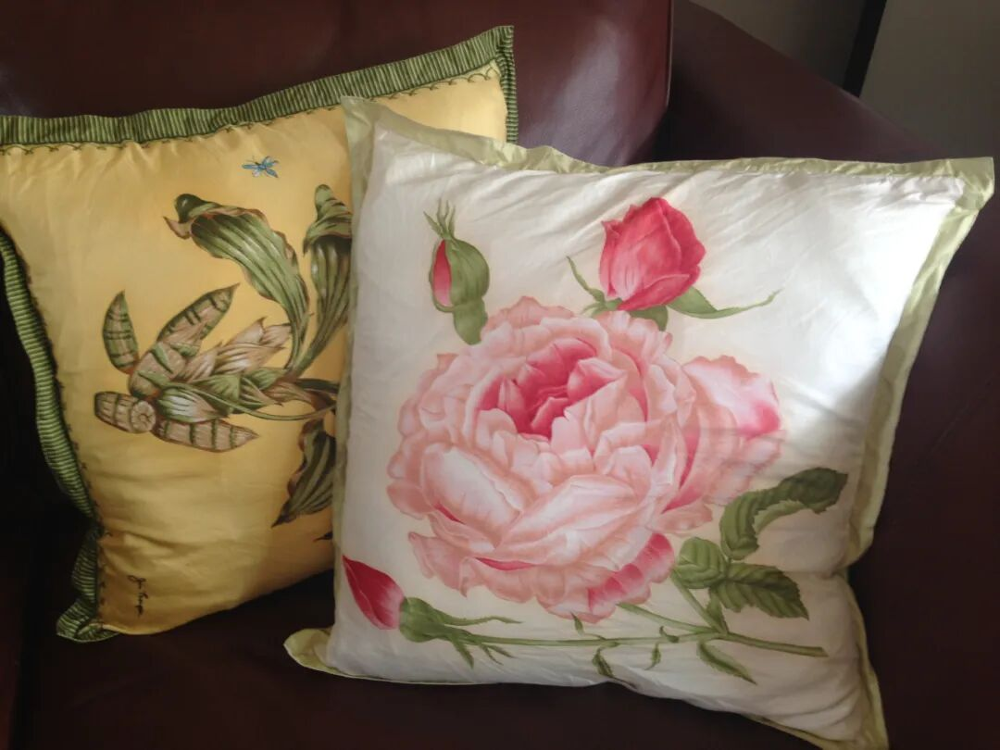

出差时顺手买的泰丝靠垫套，贵但是能用十几年，确实好买

但后来 12 年行业一点小波折，

我这种不爱行业的立刻就暴露了：跑路！

而直到现在，

我很多热爱行业的小伙伴还留在行业里。

经过几个起落，

大家也都成熟了。

现在 mean 里 mean 气的人几乎没有了，

大家聊起来，都很务实。

那种还在赶很 mean 潮流的博主，

现在只存在 G 某杂志奇怪的年度人物里。

真的，现在我们看到就也会友善地眨眨眼睛：

宝贝你太用力了，

会像乡下人哦：）））））

哈哈哈吐槽一番，

请大家不吝为我周日直播投稿！

情感、职场和时装，

什么问题都可以聊～～

当然吃的也可以随便问，

不算我花在学上的时间。。。光吃，

全世界吃花了几百万这样吧。

实实在在吃出来的，咱随便聊

最后预告一下直播：

周日下午 4 点起在小红书我司官号，

不见不散哟～

题 外

看完老板的吐槽回顾，

轮到我薯角登场！

献上三款早秋好风味，

一是来自云南石林核心产区的

不一样人参果，

清甜多汁，还有浓郁奶香。

二是云南 30 年老树上的

绿籽石榴，

果味极浓且层次丰富！

都给一个限时早鸟 86 折！

三是比高级餐厅都好吃的

上海马陆阳光玫瑰！

来自我司合作多年的马陆铜奖果园，

有很好的玫瑰的香气，

市面上的随便比！

给大家薅一个限时 9 折！

不时不食！快吃！

饱记·云南不一样人参果

购买方式如下限时早鸟 86 折！！！
戳图买它！！👇

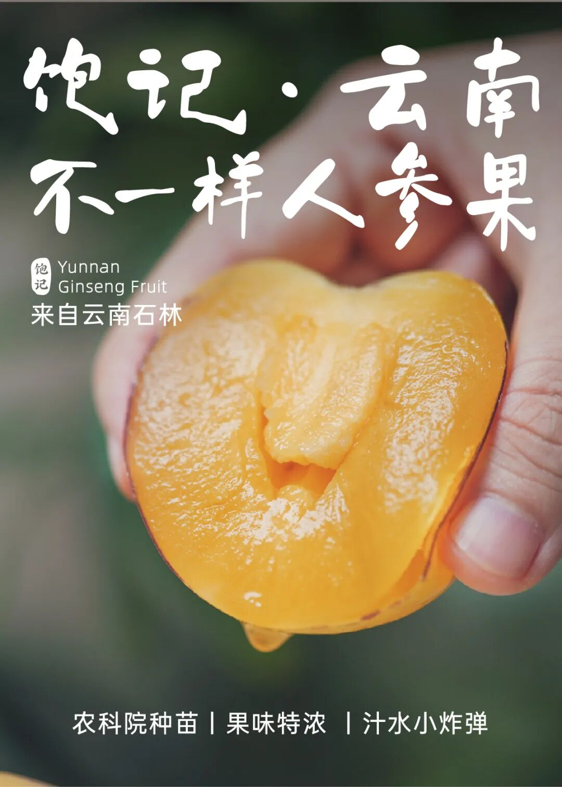

饱记·云南老树绿籽石榴

购买方式如下限时早鸟 86 折！！！
戳图买它！！👇

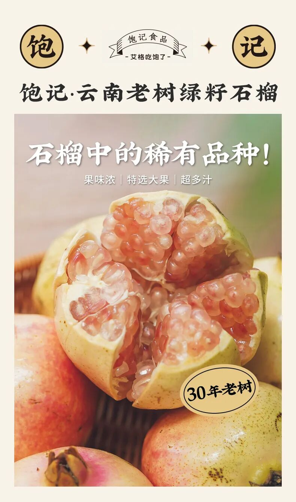

饱记·马陆阳光玫瑰
购买方式如下👇限时 9 折！

皮薄多汁，

爽脆又清新，

口感一级棒，

基本上是全国的天花板👍

发的顺丰，

让大家省心安心。

每箱都是充气包装，

尽可能减少运输途中的磕碰

戳图买它👇

本文的研究员

闻 佳就是那个研究院嘴里「挑剔的老板」。关于食物，不是比你懂得更多一些，只是比你花了更多的冤枉钱。

用好吃的方式吃一生

祖国各地好风物

文章转载请加微信「baojiclub」

