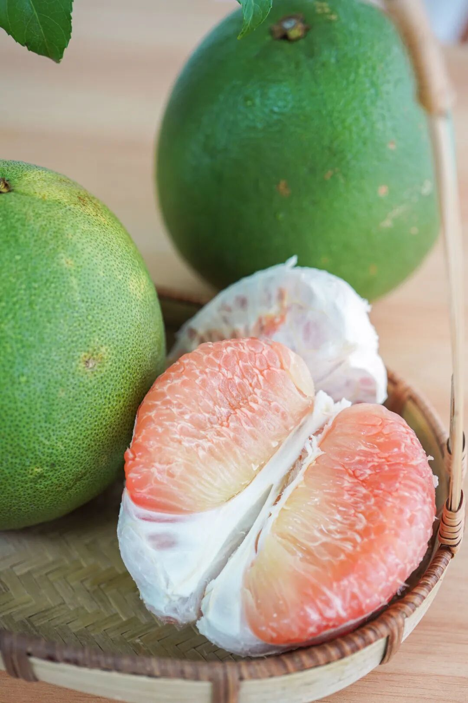
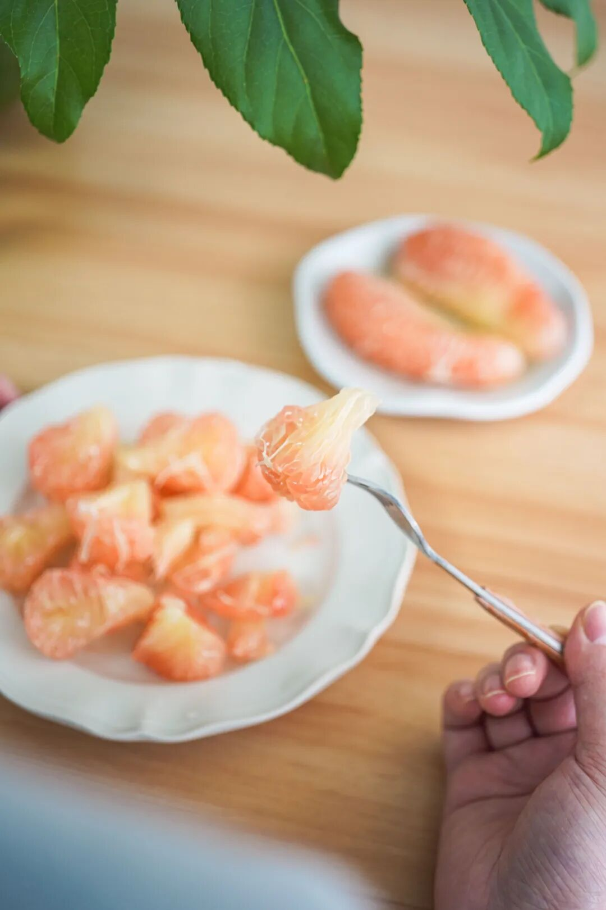
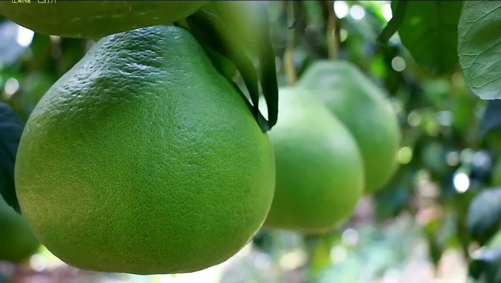
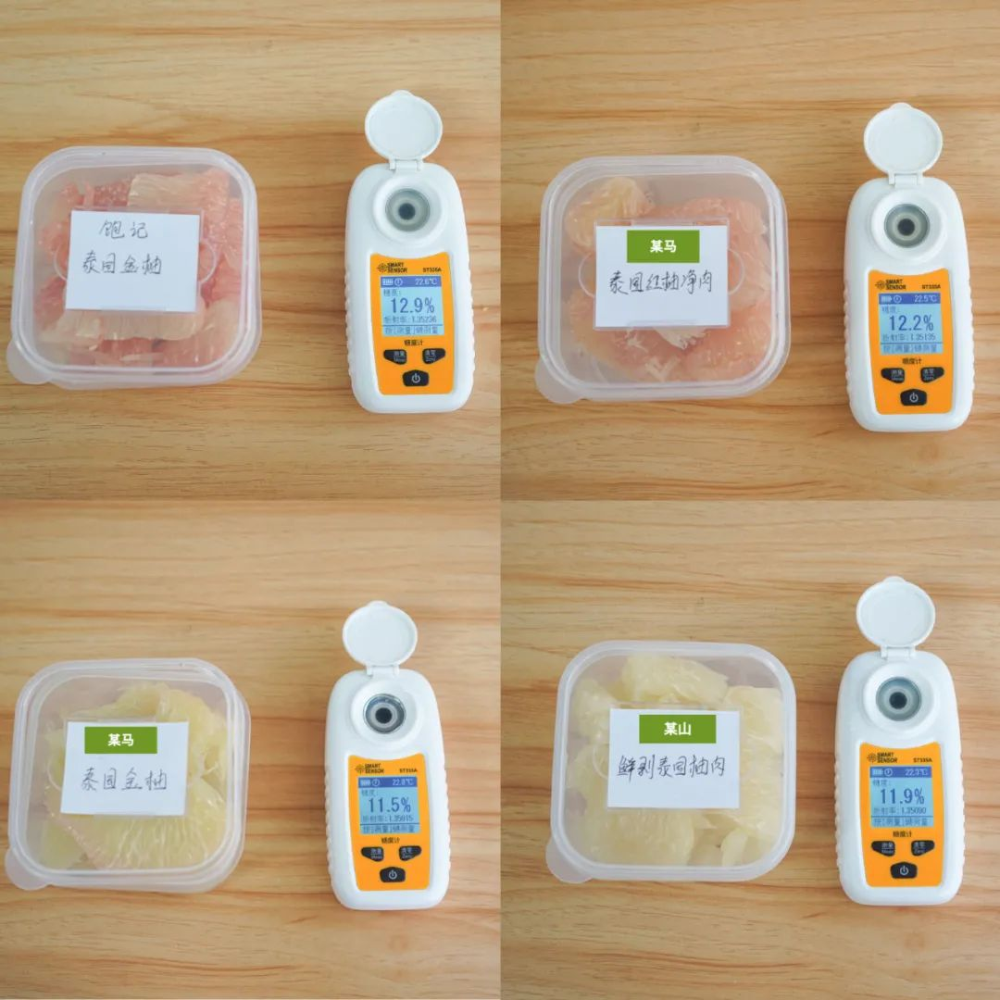
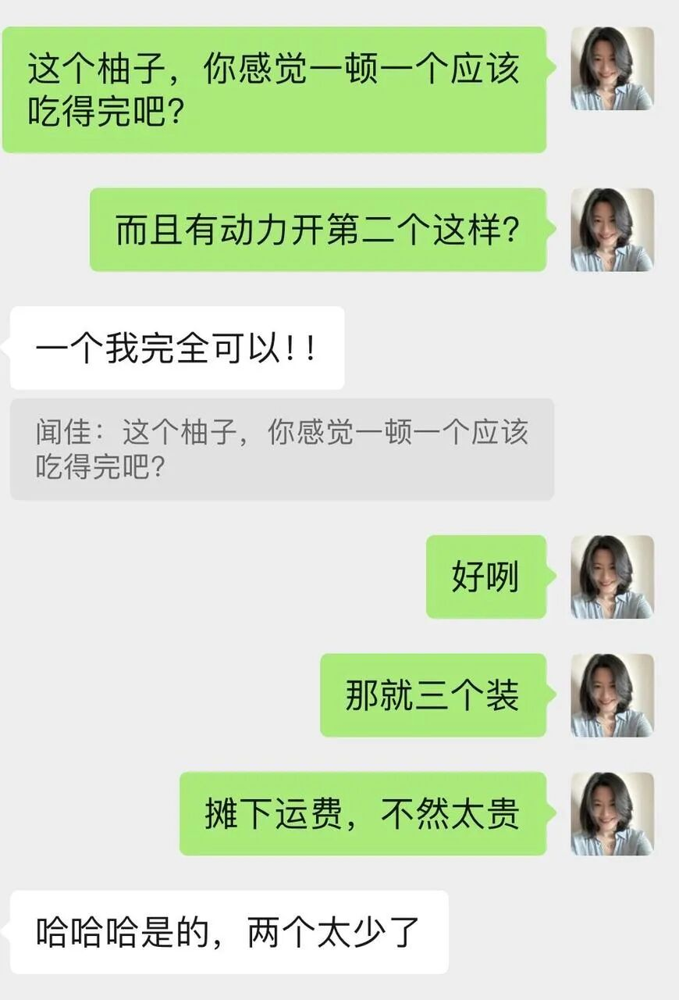
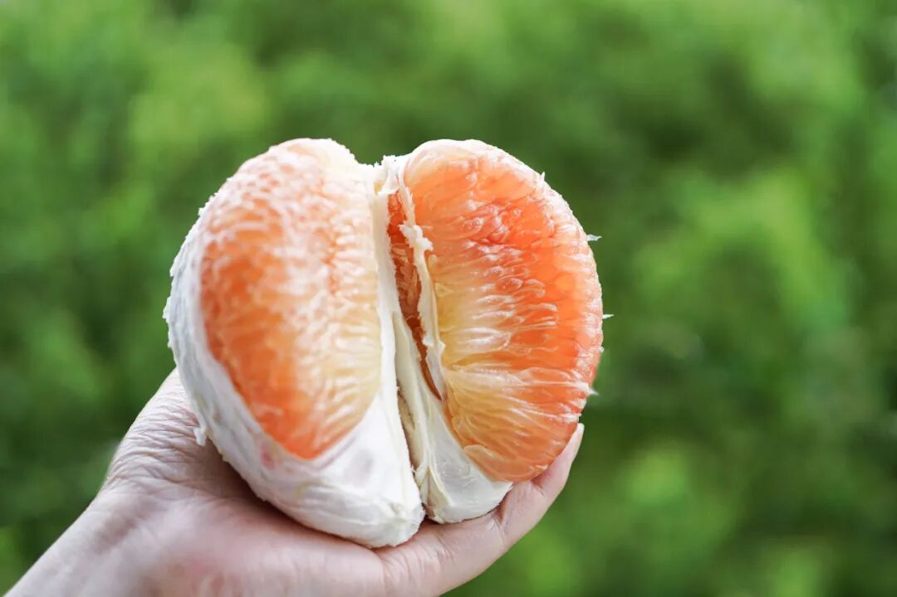
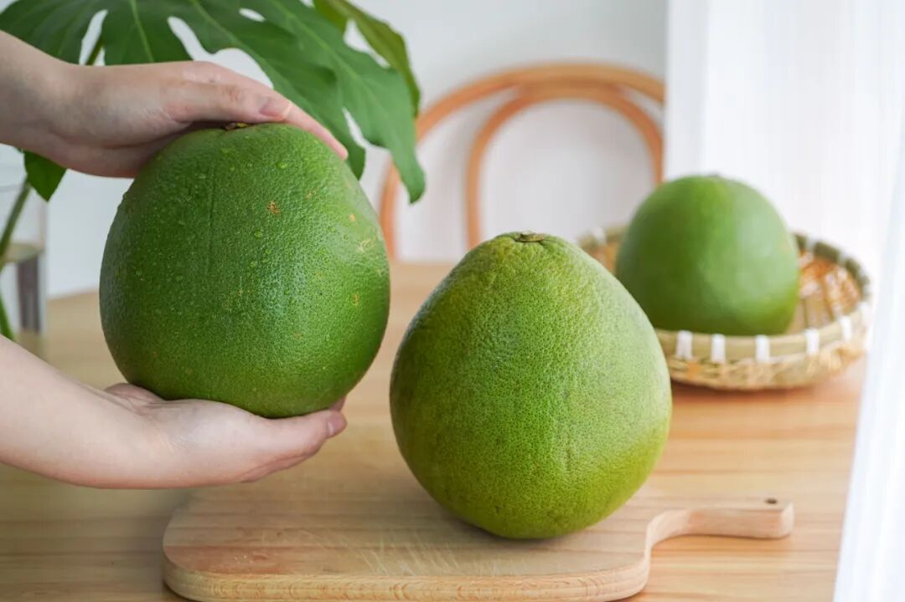
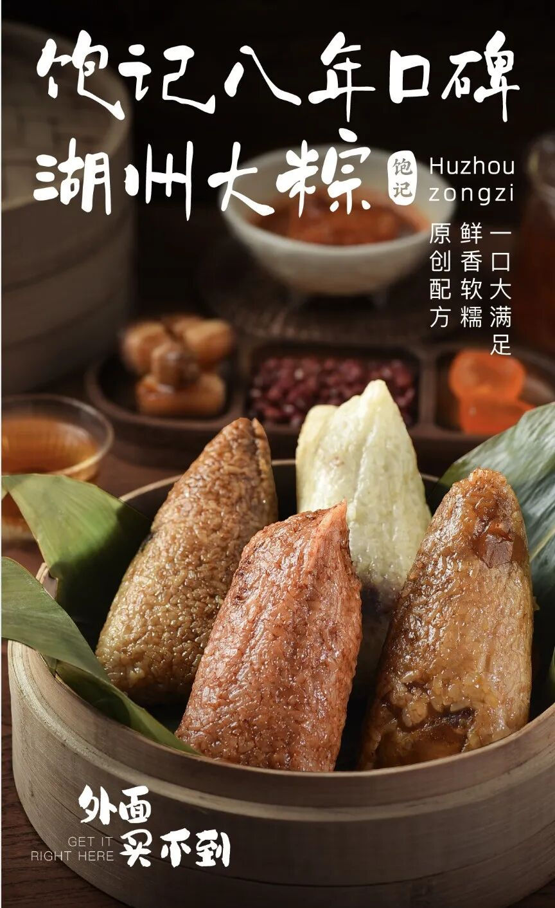

# 我柚来了，biubiu 爆汁

- 原文链接: https://mp.weixin.qq.com/s?__biz=MjM5NTYxODQyMA==&mid=2653452594&idx=1&sn=ca7d934213b837126a7babcabf27fde6&chksm=bcc107618612e852d0c106b7e5e12a898af9234241b0b0c266cdd48d4f18181f74ab38abd24a&scene=27#wechat_redirect
- 浏览量: N/A
- 点赞数: N/A
- 评论数: N/A
- 转发数: N/A

## 正文

好心态决定老板一生

一个尽情安利自我的公众号
以下是没事干研究院的风物研究报告请放心食用
我，是一个非常懂你们的人！为啥呢，老板叫我吃完这个【饱记多汁甜甜泰国金柚】（学名泰国青柚写一篇非常促销激动人心的推文～
我：打开了淘宝卖柚子商家的「问大家」！

这柚子酸吗？干吗？苦吗？

抱着替大家主持公道排忧解难的态度，我替大家一口气吃了一箱 3 个！妈耶～～～～～～～完美避开所有大家的雷区！

一箱 3 颗，每颗净重在 1.8-2.4 斤～别看这个外皮青青的，其实是甜果儿！
咬起来，biubiu 爆汁！口感，好甜好甜，基本是纯甜不带酸味！

感觉每一粒里都注满了汁水（等摄影师对焦的间隙，本薯差点馋晕了。。。
一边切，柚子皮清香四溢，家里香气氛不要钱～

剥完的柚子皮不急着扔，在家里放个一两天当作天然香薰，谁还分得清我和祖某珑呀～～～
老板这次搞水果，首次搞去泰国。说都是半山坡的果园，每一颗果子都晒得到热带的阳光！

（晒晒更健康～～
饱记约定的发货标准，是到手必须糖度 12 以上，这在柑橘柚子界已算小圣手。本薯拿到手就切了两个，实测糖度：和购买的某山某马的对比！（他们可不比我们便宜，有些还更贵！

秉着公平公正的科学精神！先称出同样的 200g 果肉～～～

（拥有糖度仪的感觉真的好哇现在本薯去水果店装一下都带它。。。（啊不是

顺便把多汁水平也对比了下

这是每 200g 果肉出的果汁量对比，薯制作人宣布饱记一位出道（八卦看多了最近
而这柚子不拆封放两天还会更甜，本薯用数据说话！

上面两张是刚收到的，下面两张是常温避光状态下放了两天的（科学实验薯

发给摄影师拍摄，

她说！！！！

哇何止火锅，我觉得随时都可以炫嘴里一个！请看老板和摄影师对话！

总之吧，这次的柚子，不能算便宜，但老板说是比照当年静安久光超市泰国红柚的标准选的。

收到就可以吃啦～品种本身就是青皮，不是还没熟哦～
价格确实远比它低！老规矩，我给你们申请了上新早鸟价！但本批还在关口，只能预售，15 日前会全部发货完成！

（柚柚柚～～切克闹～～谐音烂梗来一套（心里柚你——听天柚命——欲言柚止——柚见炊烟？

饱记·多汁泰国金柚 86 折！！购买方式如下

戳图「艾格吃饱了」下单购买👇

同时还在打折的有：现货限时 9 折饱记·口碑大粽！！！

嘿嘿饱记四个口味八年口碑湖州大粽，有现货了！！现在九折～仅次于预售的早鸟价八六折哦～～能忍住不买，算你赢。‍

关于卖点，老粉可能都会背了：咸蛋黄现挖的，会流沙；黑猪腿肉不干柴，弹弹的，浸润了肥膘；豆沙不齁甜，还加了陈皮解腻；南乳咸香带微甜，别的地方吃不到。

我来总结下，一句话：比老字号的要好吃。反正嘛，有这个自信，随便比。

4种口味共计8枚，3种组合可选，顺丰冷运包邮，发货时会用保温箱，宁波发货（到货后务必及时冷冻保存哦现在是现货限时折扣价，9 折！！！
💡 饱记说明：粽子中的原料，如蛋黄、陈皮、粽叶，均为农产品；粽子必须手工生产，世上并无包粽子机；尽管饱记产品组同事常驻前方工厂品控，但仍可能少量存在：蛋黄硬芯、欠油、漏放 / 肉偏咸、漏馅、少放……饱记承诺安心售后，有任何问题可以找客服！

戳图或去🍑🍑🍑搜索「艾格吃饱了」下单购买👇

饱记·云南西红柿购买方式如下
以及最后一点点云南西红柿，昨天调到 200 份上架到现在还有几十份～～～
懂你们，买起来！！！
戳图「艾格吃饱了」下单购买👇

本文的研究员

薯角勇敢薯角不怕困难！

摄影师 大米没有拍摄的日子，都在外面溜达。

用好吃的方式吃一生

祖国各地好风物

文章转载请加微信「baojiclub」

