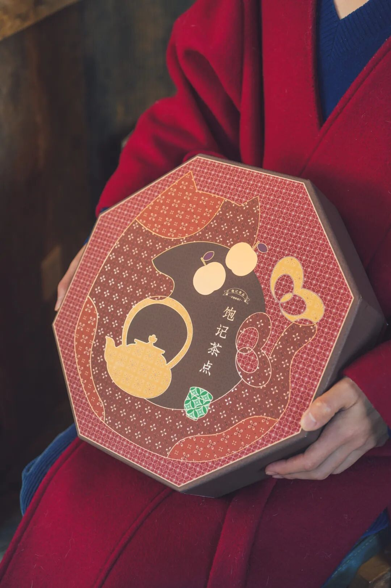
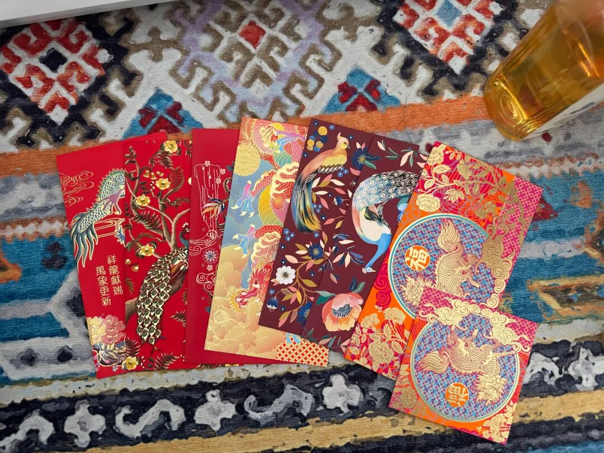
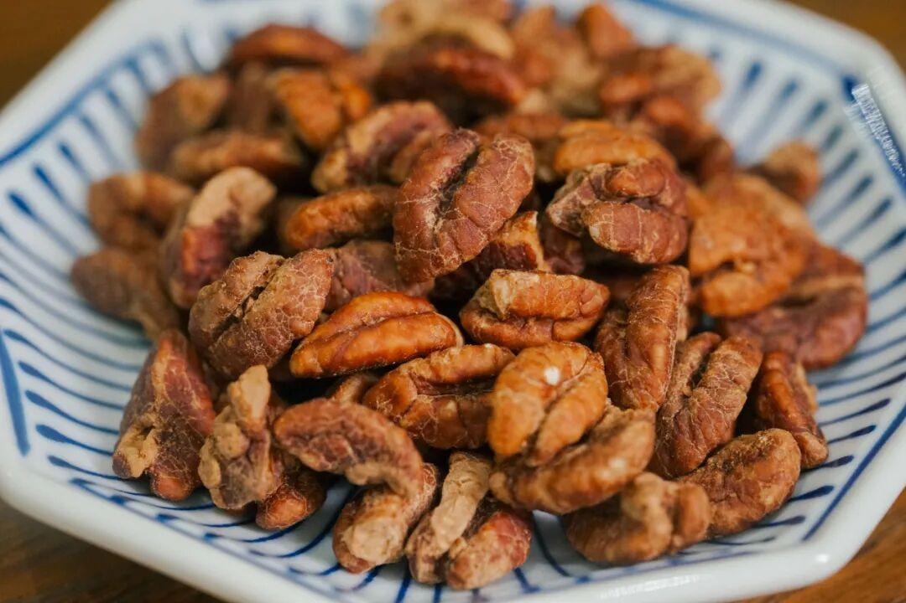
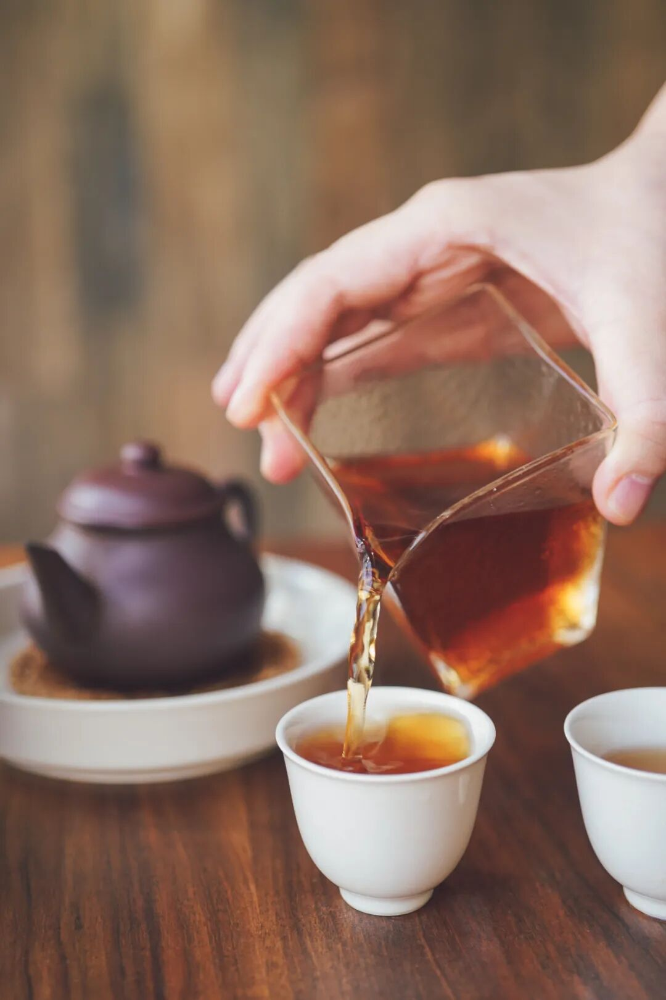
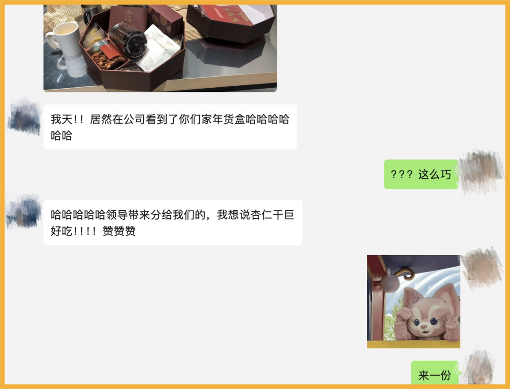
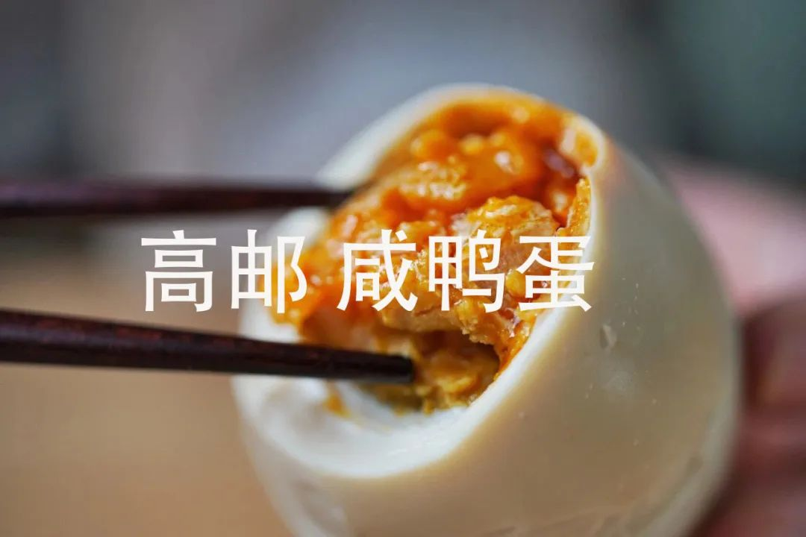

# 我要猛烈地吐槽我的同事

- 原文链接: https://mp.weixin.qq.com/s?__biz=MjM5NTYxODQyMA==&mid=2653464339&idx=1&sn=7da723fcdb5323759a9c6f087e507f2a&chksm=bcb15785f82e50a3346d583518bf17e87dc5bc798d607181ccdca59d5956c62c83dfa55f1ea4&scene=27#wechat_redirect
- 浏览量: N/A
- 点赞数: N/A
- 评论数: N/A
- 转发数: N/A

## 正文

它来了它来了

一个尽情安利自我的公众号

以下是没事干研究院的风物研究报告请放心食用
眼瞧着再过几天马上新年，后台每天都能收到的留言如下👇

实不相瞒，由于这司产品同事光顾着卷包装卷产品，（说什么工艺复杂颜色要更准的。。。这礼盒年前根本来不及拍照。。。啊啊啊啊啊啊啊，薯角我好急！卷归卷咱们倒是先卖啊！

不管同事了，千呼万唤的饱记·新春茶点礼盒 2025 版，今天开始预售，1.3 起按下单顺序给大家发货！全国顺丰包邮哦～～由于这礼盒打样太多次，我们还没来得及拍新的照片，以下为去年的旧图示意啊！！

此图仅为盒型示意，今年的配色不同哦！
今年的盒型延续了去年的中式八角食盒设计，寓意吉祥平安～但更换了新的配色版本！

配色灵感源于香港中环老钱基金的红包们，

添红更添福！

暂且保密，大家可以猜猜看👇

不想说没有用的，就一句：

我司年货盒，你送任何人，

收礼的那人一定给你竖大拇指！！！

里面每一件单拎出来都是王炸产品。一共 8 样茶与食，请查收。
1. 黑松露云腿小酥今年礼盒新增的厉害东西！在宣威海拔 1800 米左右的仓库里自然发酵的火腿，配上云南当地采的杂花蜂蜜，再佐以餐厅常用的黑松露酱，浓郁地拌出香甜馅儿。每一颗的皮都云南老师傅亲手揉！这样的云腿酥，约等于在吃肉。越嚼越香，市面上随便比啊！

2. 南姜梅肉同样是今年的新品！！还没来得及拍照，先由本薯口述一番这让人上头的风味：优质青梅自然日晒、干制糖渍后，拌入广东优质南姜干制打粉！南姜广东人应该比较熟悉，没有生姜那么辣口，酸甜微辛，
衬得梅子味道层次丰富，一颗一颗根本停不下来！

3.临安山核桃仁老朋友！全家人都能吃。今年换了免剥的山核桃仁，聚在一起喝茶吃更简单省事！十一年前老板与浙江农林大学「山核桃研究所」合作研发的山核桃，外面绝对买不到。选的是「中国山核桃第一镇」临安岛石镇薄壳山核桃，每个批次生产日期控制在最新鲜的45天，只加轻盐糖调味，吃得到浓浓的山核桃原香，完全没有负担。

4. 手剥红松籽看图，品相看的见哦，果肉饱满，粒粒大颗，轻松就能手剥。果仁自带松子油脂的醇香，吃得满嘴生香，快乐停不下来。松子来自长白山原始森林红松树，15 年结果，两年果实才能成熟，经五道筛选工序，开口率高达约 96%。

5. 金钱猪肉脯独立小包装的厚土猪肉片，精选猪后腿肉，整块厚切，肉质紧实，细腻少筋。传统工艺制作，荔枝果木炭烤，辅以冰糖及广东汕头鱼露简单调味，保留了最原始的炭烤香气！一口下去，肉香扑鼻，鲜美溢汁。

6.黄金柚子条这个黄金柚子条，我愿称之为柚子口香糖！适合揣兜里随时来一根。初入口是淡淡的柑橘味，越嚼越浓烈的柚香直冲大脑，各种风味在味蕾上瞬间脱缰，爆发后，只留下满口的清新余味。冬天嘛，还可以加点蜂蜜泡柚子茶，柔滑甜蜜，清新！选用高品质沙田柚，采用低温真空原汁、原糖浸糖工艺制作而成，柚香十足，回味无穷。

7.杏仁黑巧薄脆哦比我在烘焙店里吃的好。超过45%杏仁片添加，坚果香气浓郁，口感酥脆，手工精选坚果原料 ，片片饱满香脆。

8.五年陈福鼎老寿眉（白茶）王牌产品了。饱记选茶，首选发源地，气候、海拔、土质一一记录在案，采自白茶发源地福建福鼎管阳，海拔 700 米以上高山茶区鲜叶，手工日晒，低温炭焙，陈化五年，香气纯正，汤色橙黄明亮，滋味醇厚甜爽。不炒不揉，最大地保留茶叶中的成分。制成茶饼，存起来慢慢喝。

别又说我薯角出来吹牛，

以下为我司历年年货盒真实用户好评👇

图源@我司同事聊天记录

嘻嘻，

但我薯角个人觉得，

我司年货盒最大的卖点还是体面又实在。

市面上做套盒的思路，

主要是研究包装。

但我司不仅包装要美，
里面的内容物也要经验证的样样能打！嘴馋的可以趁预售薅个限时早鸟价！单盒立减 60 元！！！！两盒立减 130 元！！
等拍完美照我还来！

饱记·年货礼盒（预售中）1.3 起按顺序发货限时早鸟价！单盒立减 60 元！两盒立减 130 元！
戳图购买👇

题 外

敲锣打鼓，

一样本薯较少吆喝的好东西在临期清仓，

巨折 6 折！自家吃吃不妨碍啊！

紫苏梅饼效期至明年 3 月，

介意慎拍哦！！

以及今年冬天的富平柿饼现货了！

限时 9 折！

后台千呼万唤喊着补货的

75% 木姜子巧克力，

也有限时 9 折！

其他适合空调房吃吃的水果也看这里👇

拿过金奖的上海白鹤红颜草莓，

卷过丹东！限时早鸟 86 折！

来自广西融安的脆蜜金桔。足以颠覆自小到大的金桔风味印象！从芯子到脆皮都是蜜蜜甜的。

一次尝俩的广西双拼芭乐，

扎实的冰激凌球口感！

现在也有限时 9 折！

最后今年大闸蟹已到尾声！

苏南蟹标杆美味：太湖流域大闸蟹

苏北蟹宝藏性价比之选：洪泽湖大闸蟹很快就没！

饱记·临期零食清仓专区

巨巨巨 6  折！！！介意慎拍～
戳图购买👇

饱记·富平柿饼

购买方式如下

限时过节 9 折！！！

戳图购买👇

饱记·红颜草莓

购买方式如下

限时早鸟 86 折！！！

戳图购买👇

饱记·云南木姜子75%黑巧克力购买方式如下限时 9 折！！
戳图下单购买👇或🍑🍑🍑搜索「艾格吃饱了」

饱记·融安脆蜜金桔限时吃水果 9 折！！！只到本周五！！
戳图购买👇

饱记·广西双拼芭乐限时吃水果 9 折！！！只到本周五！！
戳图购买👇

饱记·太湖流域大闸蟹

购买方式如下

三种搭配：

满足装，

3-3.4 两母蟹，4-4.4 两公蟹，

吃过解馋。

劲爽装，

3.5-3.9 两母蟹，4.5-4.9 两公蟹，

可以拍照发朋友圈争奇斗艳。

尊享装，

4-4.4 两母蟹，5-5.4 两公蟹，

顶格水准，适合送礼。

人工精挑，

上岸后静养一两日更鲜美，

每日限量 50 箱。

拼的就是手速。

顺丰快递发货，

新鲜看得见。

戳图下单购买👇或🍑🍑🍑搜索「艾格吃饱了」

饱记·洪泽湖大闸蟹

购买方式如下

满足装洪泽湖大闸蟹：

3 两母蟹，4 两公蟹。

性价比之选！

劲爽装洪泽湖大闸蟹：

3.5 两母蟹，4.5 两公蟹。

饱记热销款。

尊享装洪泽湖大闸蟹：

4 两母蟹，5 两公蟹；

或 5 两母蟹，6 两公蟹。

实际超重，量极极极少，送礼佳品。

人工精挑，

上岸后静养一两日更鲜美，

每日限量 100 箱。

顺丰快递发货，新鲜看得见。

戳图下单购买👇或🍑🍑🍑搜索「艾格吃饱了」

本文的研究员

薯角多吃点，好过冬

用好吃的方式吃一生

祖国各地好风物

文章转载请加微信「baojiclub」

