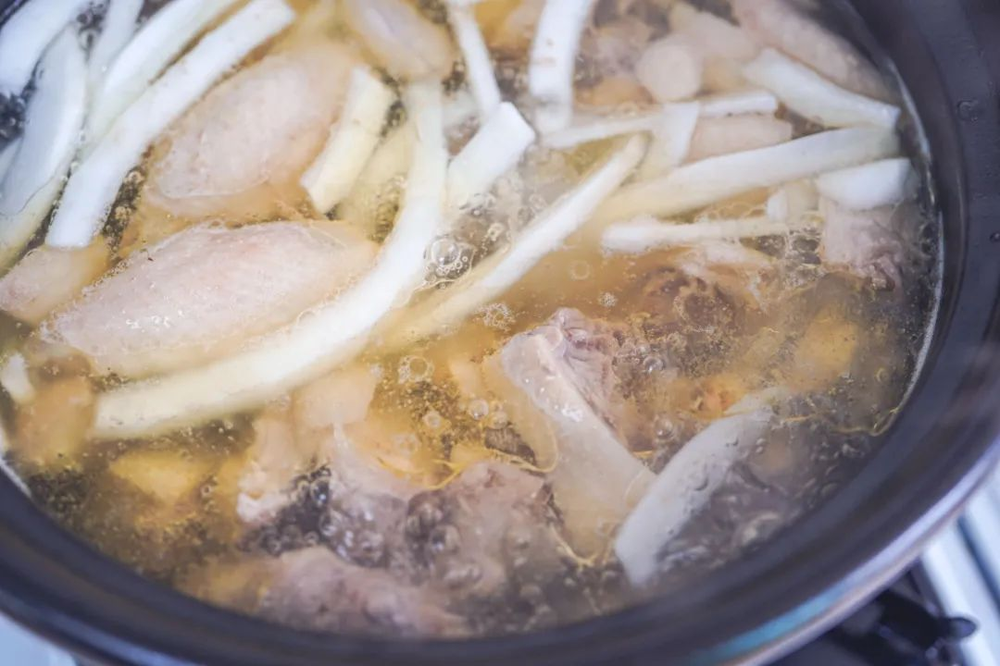
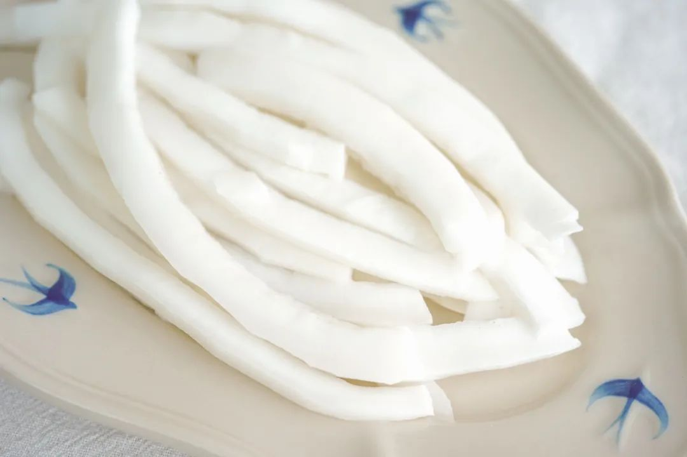
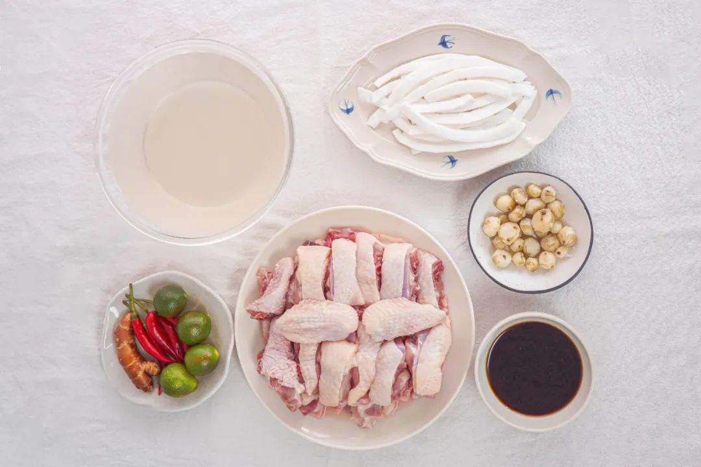
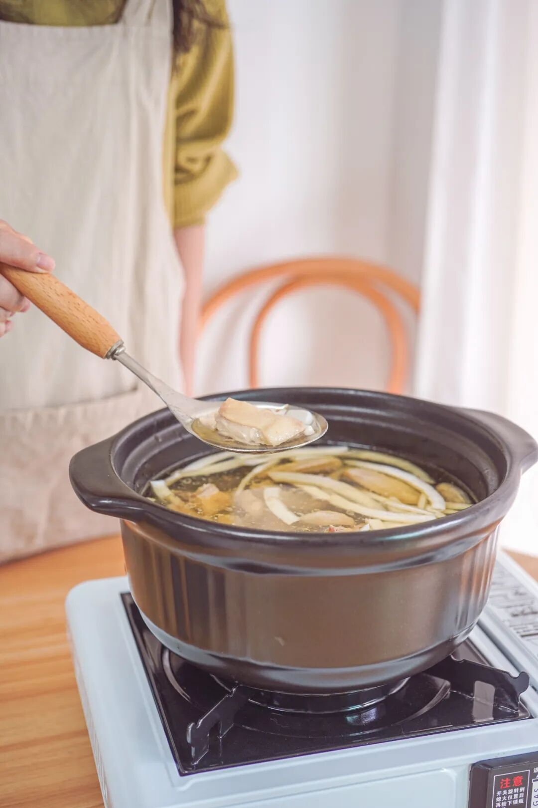

# 我要猛烈地吐槽我的老板

- 原文链接: https://mp.weixin.qq.com/s?__biz=MjM5NTYxODQyMA==&mid=2653462143&idx=1&sn=e3aafccdd5428d550389b6de17210693&chksm=bc19b021e8519f55d63074ae4080f7ad268b69346a7558d7372e548ed12cb0f6ab677acce3cd&scene=27#wechat_redirect
- 浏览量: N/A
- 点赞数: N/A
- 评论数: N/A
- 转发数: N/A

## 正文

不比不知道

一个尽情安利自我的公众号

以下是没事干研究院的风物研究报告请放心食用
上周跟大家吆喝了一只又嫩又弹又好吃的椰子鸡，结果老板说👇

啊啊啊啊啊啊，作为此鸡的铁粉，薯角我岂能服气？？手里正在摸的鱼突然不香了，今天就来给老板比上一比💅（挤出甜美的笑容

椰子鸡作为一种「天然去雕饰」的美食，要好吃无非看这三样：鸡新鲜吗？
椰子水清甜吗？调料正宗吗？

先说某马，本薯特意下单了一份双人套餐，139 元，到手发现鸡只有 450g

倒是也吃得饱！只是感觉钱都花在了配菜上。（白菜、响铃卷、芋头、玉米什么的

最重要的是这鸡！
虽然也写的文昌鸡，但它是冰冻的。。。换句话说：不知道啥时候杀的，没那么新鲜。

这样的鸡有什么问题呢？就是煮出来像这样👇容易起沫，不够清亮，入口直接吃容易起腥气，
需要蘸调料盖一下。

而我饱记的鸡汤，
长这样嘿嘿👇泛着一层漂亮的油花～

毕竟这鸡，是产品同事在一个爱吃鸡的文昌大叔指导下，找到的本土正宗文昌鸡！

且给大家保证，

每一只都是活鸡现杀！

再送入 -38 度以下的冷库急速冷冻，

冻实后按顺序顺丰空运发出。

到手时还新鲜得不得了

文昌大叔扎根当地数十年，对小岛的鸡了如指掌，给产品同事推荐的这群，
外面的大路货根本比不了！这鸡生活在文昌的田野林间，

先是在外头散养上 100 天，

再关到笼子里养 20 天，

放养的时候增肌，

笼养的时候增肥。

（难道这就是传说中的脂包肌？

煮完后皮薄、肉嫩，

吃起来弹牙爽滑，有鲜美鸡味的同时没有腥气。直接空口吃，
也有淡香回甘的清甜味～

好的，

接下来到椰子水！

某马给到两个新鲜的椰青，

确实也是清甜的，

就是略重，且自己刮椰肉比较麻烦。

我司为了长途运输，

配的 100% 纯椰子水，

过滤好分装，直接冷冻保存，

开盖后很香很香很香～

白嫩嫩的椰子肉，给大家剥好了，在风味不减的同时，尽可能方便快捷

最后一步，调一个灵魂蘸料！某马的调料包长这样👇
看着很方便，但这一步其实省不得。。。尤其金桔和沙姜，切开后长时间放置，风味就有所减损！没有那股子扑面而来的清新劲儿～

所以我们给到大家的是需要自己切一下但超新鲜的版本👇

再给大家推荐一个地道调法！青金桔不切开挤汁，
而是剥开后整瓣丢进去！这样做妙在何处呢？就是减少了金桔直接的呛，又保留了果实带来的清新感～（谁发明的？快出来受本薯一拜！

配的酱油，同样大有来头！独家配方的减盐版本，
里面还混了沙姜汁哦～外面根本买不到！成本高，但更健康，且吃多了也不会有口渴感，一瓶体贴细心的好酱油！

好了，最后展示一下我饱记·海南椰子鸡
完整全家福👇

看！啥都给你备好了！

厨艺方面，0 难度！

准备好一口锅，四步就能完成。1.所有食材解冻沥干备用；2.倒椰子水，倒椰肉、马蹄煮开；3.倒鸡肉，煮 5-7 分钟即可食用啦～
4.调一个海南传统风味蘸料！

热腾腾、暖乎乎，清甜得能连喝三五碗～

还能吃到脆脆糯糯的珍珠马蹄，每一颗都清甜有滋味～

老规矩！为了保证新鲜，我司跟鸡场约定，攒够 200 只就给大家新鲜现杀发货！所以现在还是预售！
限时开放三天闪购！这一批攒够 200 只就给大家现杀发货！下一批预计 11.20 当天能发，快，加入这个文昌吃鸡小队！

饱记·海南椰子鸡

限时早鸟 86 折！！！

限时闪购三天！

预计 11.20 起发货

戳图买它👇

题 外

大家好，

这个时节好东西不少（单押

双十一过后的心意返场折扣直接来！

不用凑单不用研究！

苏南蟹标杆美味：太湖流域大闸蟹苏北蟹宝藏性价比之选：洪泽湖大闸蟹

终于回归的有小时候番茄味的云南西红柿，

坚持真材实料、天然肠衣的手工腊肠，
能做煲仔饭和火锅的玫瑰露酒腊肉&腊排骨还有打遍天下无敌手的山核桃！我司卷中卷产品，
拿到外面去都能打得很！具体你们看商详，最重要是还有些限时返场折扣再薅老板一回！冲！

饱记·云南西红柿购买方式如下双十一同价 86 折！！
戳图购买👇

饱记·太湖流域大闸蟹购买方式如下👇限时 9 折
戳图下单购买👇或🍑🍑🍑搜索「艾格吃饱了」

饱记·洪泽湖大闸蟹购买方式如下👇限时 9 折
戳图下单购买👇或🍑🍑🍑搜索「艾格吃饱了」

饱记·手工腊肠购买方式如下👇
三款口味，各有各的特点。用的黑猪肉、天然肠衣、玫瑰露酒...酒香腊肠，酒香浓郁，
有四六和二八这两个肥瘦比例可选。
滇式腊肠用了不少贵价的辛香料，同事说超适合拿来做西班牙海鲜饭，
试过加辣肠后升华了。
戳图下单购买👇或🍑🍑🍑搜索「艾格吃饱了」

饱记·玫瑰露酒腊肉&腊排骨购买方式如下👇
戳图下单购买👇或🍑🍑🍑搜索「艾格吃饱了」

饱记·临安山核桃

购买方式如下👇

戳图买它👇

或到🍑🍑🍑

搜索「艾格吃饱了」

本文的研究员

薯角想去海南过冬

用好吃的方式吃一生

祖国各地好风物

文章转载请加微信「baojiclub」

