# 打折这种事，有什么好等的。。。

- 原文链接: https://mp.weixin.qq.com/s?__biz=MjM5NTYxODQyMA==&mid=2653464687&idx=1&sn=59e2602cc28f602b3f154888c207b795&chksm=bc97496cf05a1f173c5f2ac989c628b062b6ab562b905fb9d97e46c47bfd2ec8fcb18f6374dc&scene=27#wechat_redirect
- 浏览量: N/A
- 点赞数: N/A
- 评论数: N/A
- 转发数: N/A

## 正文

提前过节

一个尽情安利自我的公众号

以下是没事干研究院的风物研究报告请放心食用
啊啊啊啊啊啊，今年春节来得如此早，

本薯今天放肆一回，

不等年货节了，

就今天，大家千呼万唤的

各种礼盒和各地风物

折扣都给我上！！

首先点名我司呕心沥血的春晚作品，

年货盒。

预售地板价最后一天，

今天起按下单顺序给大家发货！全国顺丰包邮哦～～

我司年货盒最大的卖点：体面又实在。

市面上做套盒的思路，

主要是研究包装。

但我司不仅包装要美，
里面的内容物也要经验证的样样能打！

老板很是下了一些血本，

实话说真的不挣几个钱！！！

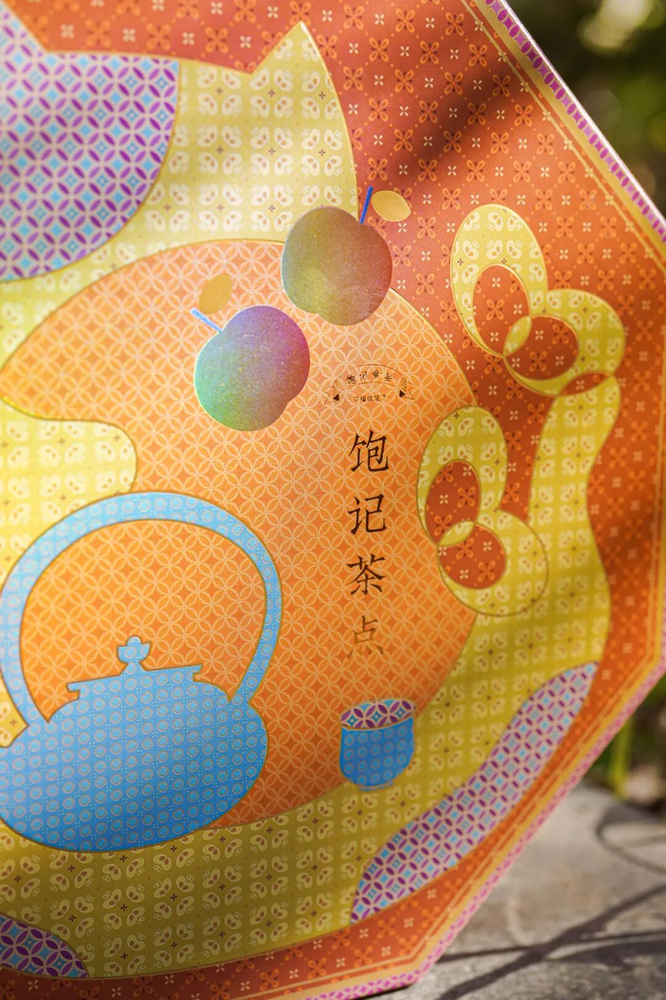

今年的盒型延续了去年的中式八角食盒设计，表面烫金工艺处理，寓意吉祥平安～但更换了新的配色版本！

配色灵感源于香港中环老钱基金的红包们，

添红更添福！

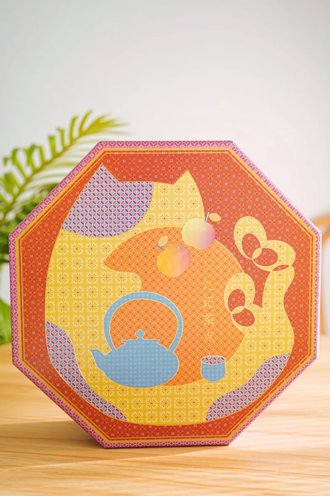

每一盒里都配有

2025 年历一张与红包两个！

算是我饱记的一点小小心意！

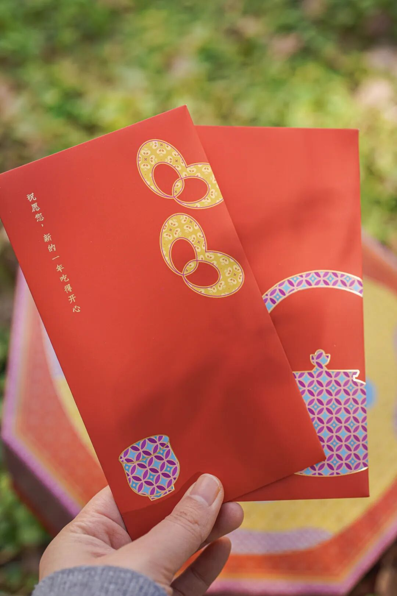

礼盒里一共 8 件各地美食风物，

包括我司有口皆碑的黑松露云腿小酥、

山核桃仁、金钱猪肉脯，

市面上随便比！

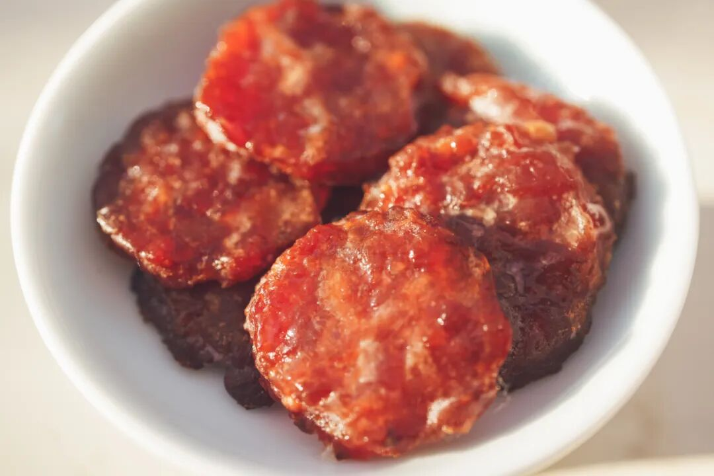

蜜饯两样，

除了老朋友黄金柚子条，

还有今年的新品南姜梅肉，

没有生姜那么辣口，酸甜微辛，
衬得梅子味道层次丰富，一颗一颗根本停不下来！

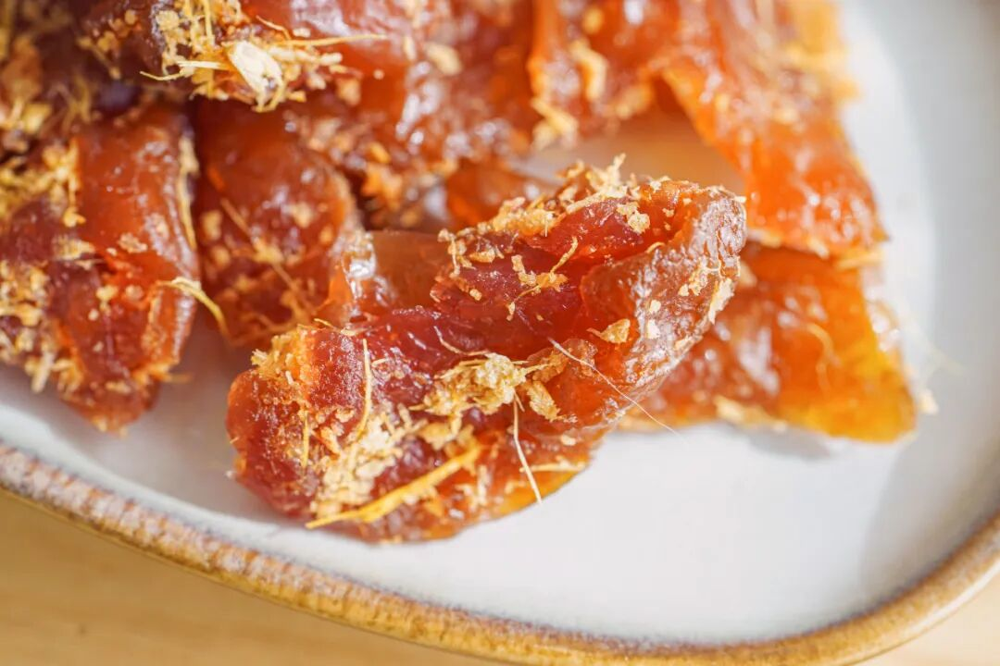

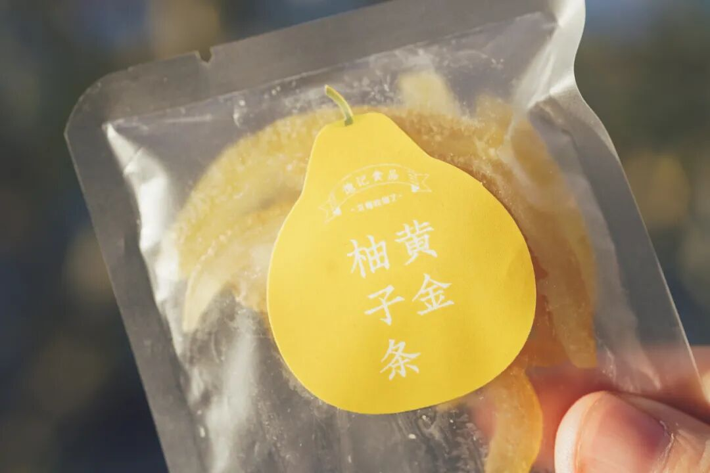

此外还有限定的手剥红松籽、

杏仁黑巧薄脆以及王牌产品

五年陈福鼎老寿眉（白茶），

样样都好。

全家老少都能挑到自己喜欢的！

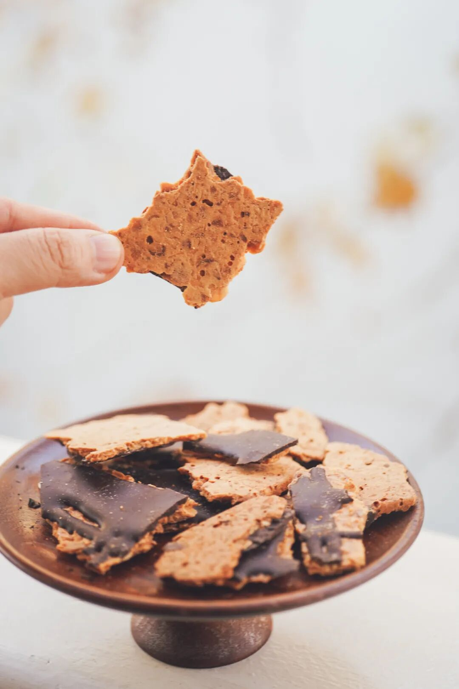

最后！！！

如果有送礼需求，

可以直接购买年货礼盒提货卡，

家人朋友只需输入收货信息就能提货！

详情可以咨询客服小姐姐哦～

趁现在最后一天预售地板价，

如此精美绝伦的年货盒，

单盒立减 60 元！！！！两盒立减 130 元！！

发自肺腑地说，

真的不挣钱性价比很高！！！

冲冲冲！！！！

饱记·年货礼盒（预售中）1.3 起按顺序发货限时早鸟价！单盒立减 60 元！两盒立减 130 元！
戳图购买👇

其次！！！

口碑第九年的饱记·富平流心柿饼，

今年三种规格，

中果款延续了去年的设计，大果款和稀有的特大果款，
更换了新的礼盒装👇

寓意好，红得饱满细致，
送礼都显得咱大大方方儿的！每一枚都是独立包装！一袋一颗，
这阵子聚会分分正合适！

市面上富平柿饼众多，不夸张地说，
我饱记始终是第一梯队水平！

历史上也比遍了所有的网购货，

永远赢很大。

核心产区，

个头大，流心，挂霜厚这些就不说了。

我司柿饼，

还有一重独一无二的三明治夹心口感。

柿子皮略带韧劲儿，内里流心软糯，

不是纯软塌的口感。

绝了。

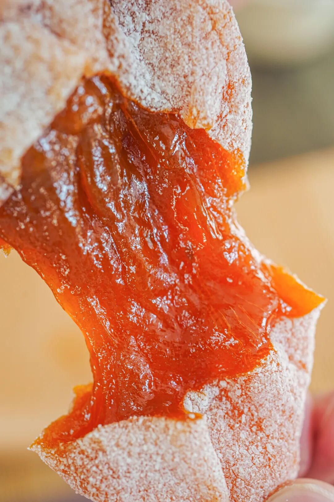

整个过程：挑选顶配柿果👉削皮👉晾晒👉古法揉捏，一共要经历 60 天，这样出来的柿饼才符合饱记标准！相比 40 天的汁肉混合更充分

一枚完美的富平柿饼，就是特别讲究这绵密的柿子糖霜！这也意味着时间与背后的人工。但我司一向卷生卷死，
力求「打遍天下无敌手」，成本上去了也没在怕的！

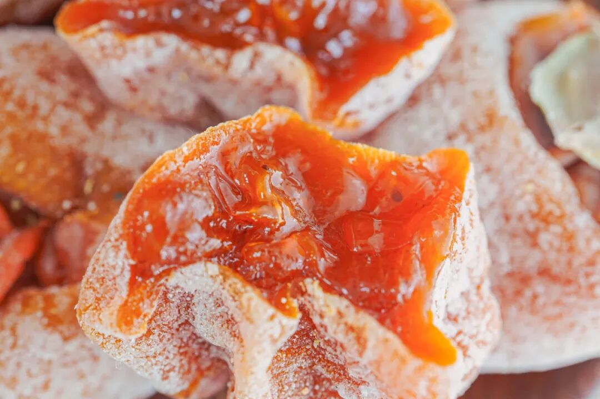

接下来和家人好友的聚会少不了它，

设计同事卷出来的两种礼盒奉上，

送礼自留两相宜。

囤吧，记得放冰箱里！

上：中果款礼盒装；下：大果款、特大果款礼盒装

本薯整不来满减数学题，有折扣都是直接上！秉着过节沾沾喜气的原则，给大家薅来年货节提前购 85 折啊！吃吧！吃到你就懂了！

饱记·富平柿饼

购买方式如下

年货节提前购 85 折！！！

戳图购买👇

还有！我司这米其林餐厅师傅都年年订货的饱记·手工腊肠！

这周滇味腊肠、二八腊肠都有新到货！

一共三种选择！口味一：手工广式腊肠，

有四六和二八这两个肥瘦比例可选。

口味二：滇式腊肠

用了不少贵价的辛香料，各种香味在唇齿间乱窜。亲测怕辣的人也能吃！

风味暂且按下不表。就说这食材方面，我司一向没在怕的，都是真材实料！用的纯黑猪肉，产品同事说现在外面很多电商腊肠，都会加入部分大豆蛋白，和猪肉比起来简直成本可忽略不计。而这种添加甚至可以在配料表上并不体现。。。

除了猪肉，腊肠的肠衣也有讲究！饱记就是用中国人民几百年晒腊肠用的，猪肠衣。成本高，但是架不住口感好！嚼起来 Q 弹有韧劲，最后又会在口腔里化开。而便宜货可以用科技品：胶原蛋白肠衣。就是蒸完嚼不大烂可以整条脱下来吐出来的那种！

天然肠衣一眼就能看出来，比较薄和透

两种手工广式腊肠是甜口的，

即大家更熟悉的广府糖酒风调味。

滇式腊肠则偏咸辣，肉香&麻香&辣香&酒香交织。

可蒸，可焖，

也可以和青菜炒，

实在懒得摆弄，简单蒸熟，

用来下酒，都很适宜。

一样东西，能有千万种变化，全凭心意。

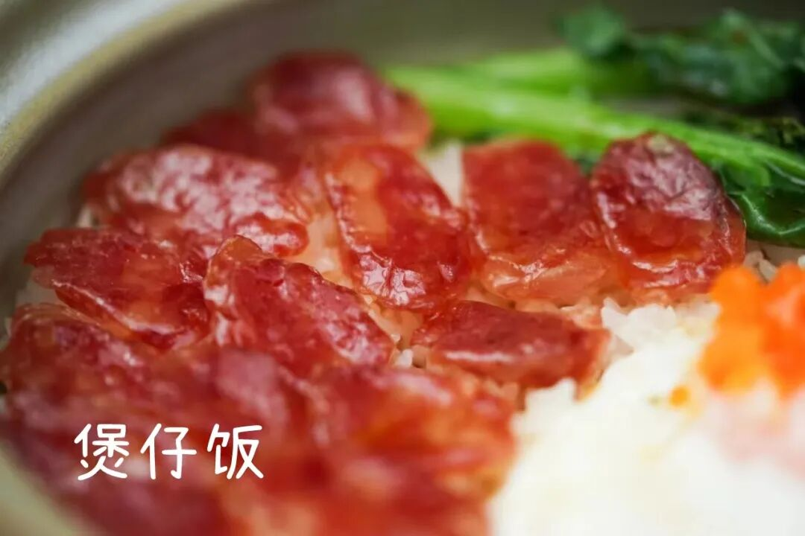

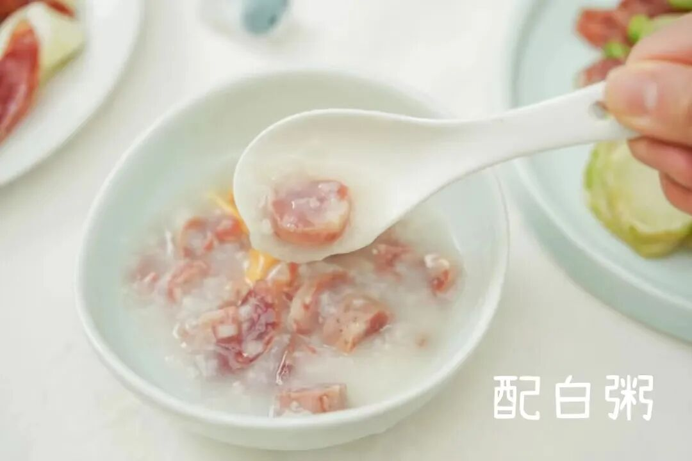

别急，还有！

最新到货的腊排骨火锅，

是地道的云南丽江美食。

热气腾腾中带着肉的原香和烟熏味，

我愿将其与辣火锅、牛肉火锅

并为冬天的三大火锅

不到百元，教你在家复刻！

就是把腊排骨放锅里炖煮 1 个半小时，

直到炖煮到这样的浓汤。

加入韭黄番茄大葱玉米，

腊排骨的汤底就完成了！

其他和吃火锅一样，

想涮什么下什么，

菌类啦蔬菜啦都很好，

还能带来一点甜味。

提醒一下，

排骨提前浸泡 3-4 个小时再下锅煮，

否则会太咸。总之，

不需要任何厨艺，

不到一百块钱，

你就能做出这样的冬日暖锅！

同样限时全年地板价！！！

冲！

饱记·手工腊肠

购买方式如下👇

年货节提前购地板价

戳图下单购买👇

或🍑🍑🍑搜索

「艾格吃饱了」

饱记·腊排骨

购买方式如下👇

年货节提前购地板价

戳图下单购买👇

或🍑🍑🍑搜索

「艾格吃饱了」

最后是我司打遍天下都不怕的饱记·临安山核桃！不知不觉卷到第十一年，是真不想赘述背景啊工艺啊，反正懂的都懂～

在我司这种卷到飞起的环境里，它能长期当顶流也是有原因的！
首先香得不得了。本薯入冬尤其喜欢拿它配茶，又脆又酥，还有坚果本身那种油脂和回甘！配一壶红茶或者乌龙都美得不行～

这山核桃是十一年前老板自己都还在打工时，

就找到浙江农林大山核桃系科班开发的。

我们商定用临安山核桃品种，

直径、克重和日晒时间都有山核桃系本系的专业要求，浙江农林大信誉保证！

盐添加很少，糖也添加很少，爸妈吃了都要说好！轻调味有多轻呢？每 100 斤只给放 1.5 斤糖，因为健康。

好了，趁此机会囤起来！总之现在买就是最划算！

饱记·临安山核桃

年货节提前购

单罐 9 折！！！

双罐 86 折！！！

戳图买它👇

或到🍑🍑🍑

搜索「艾格吃饱了」

题 外

敲锣打鼓，

刚补货的 75% 木姜子黑巧克力，

90 天短保质期的大师凤梨酥，

都有限时 9 折！

适合空调房吃吃的水果也看这里👇

拿过金奖的上海白鹤红颜草莓，

来自广西融安的脆蜜金桔。足以颠覆自小到大的金桔风味印象！

一次尝俩的广西双拼芭乐，

扎实的冰激凌球口感！

还有今年份的象山红美人，

入口似果冻般嫩嫩滑滑～

现在都有限时 9 折！

最后今年大闸蟹已到尾声！

苏南蟹标杆美味：太湖流域大闸蟹

苏北蟹宝藏性价比之选：洪泽湖大闸蟹马上就没！

饱记·新鲜到货凤梨酥

限时 9 折！！！
戳图购买👇

饱记·云南木姜子75%黑巧克力

购买方式如下

限时 9 折！！

戳图下单购买👇

或🍑🍑🍑搜索

「艾格吃饱了」

饱记·融安脆蜜金桔

限时吃水果 9 折！！！

新年大桔大利！！！

戳图购买👇

饱记·红颜草莓限时吃水果 9 折！！！新年莓有烦恼！！
戳图购买👇

饱记·象山红美人柑橘

限时吃水果 9 折！！！

戳图购买👇

饱记·广西双拼芭乐限时吃水果 9 折！！！
戳图购买👇

饱记·太湖流域大闸蟹

购买方式如下

三种搭配：

满足装，

3-3.4 两母蟹，4-4.4 两公蟹，

吃过解馋。

劲爽装，

3.5-3.9 两母蟹，4.5-4.9 两公蟹，

可以拍照发朋友圈争奇斗艳。

尊享装，

4-4.4 两母蟹，5-5.4 两公蟹，

顶格水准，适合送礼。

人工精挑，

上岸后静养一两日更鲜美，

每日限量 50 箱。

拼的就是手速。

顺丰快递发货，

新鲜看得见。

戳图下单购买👇或🍑🍑🍑搜索「艾格吃饱了」

饱记·洪泽湖大闸蟹

购买方式如下

满足装洪泽湖大闸蟹：

3 两母蟹，4 两公蟹。

性价比之选！

劲爽装洪泽湖大闸蟹：

3.5 两母蟹，4.5 两公蟹。

饱记热销款。

尊享装洪泽湖大闸蟹：

4 两母蟹，5 两公蟹；

或 5 两母蟹，6 两公蟹。

实际超重，量极极极少，送礼佳品。

人工精挑，

上岸后静养一两日更鲜美，

每日限量 100 箱。

顺丰快递发货，新鲜看得见。

戳图下单购买👇或🍑🍑🍑搜索「艾格吃饱了」

本文的研究员

薯角多吃点，好过冬

用好吃的方式吃一生

祖国各地好风物

文章转载请加微信「baojiclub」

