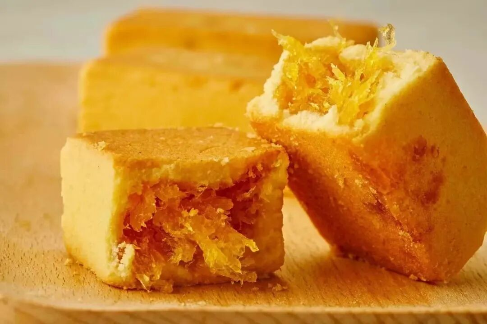
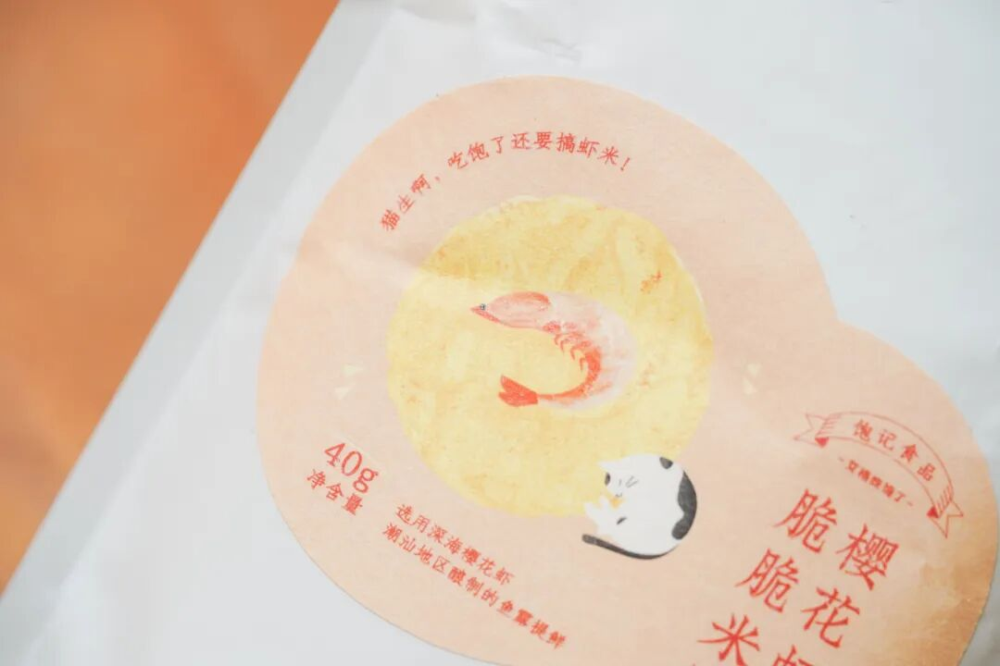
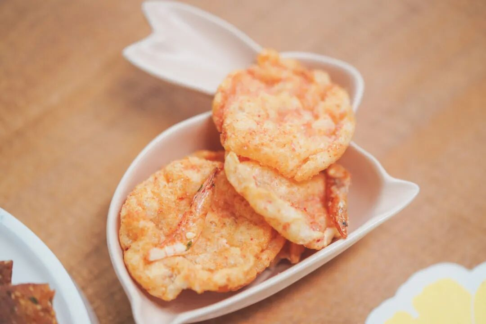
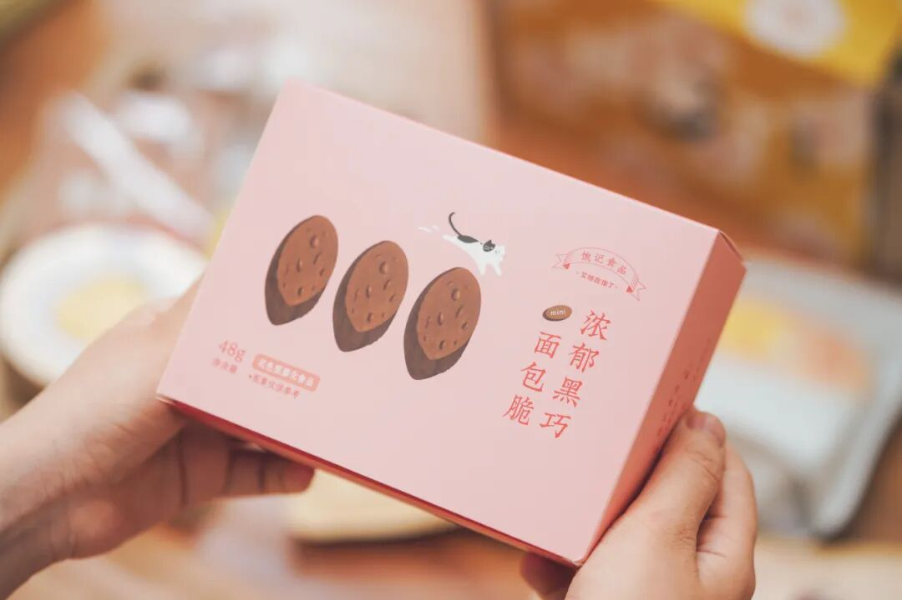
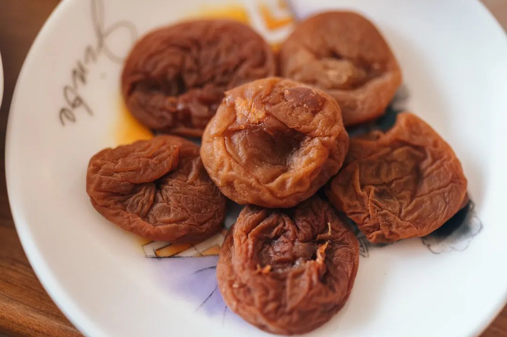
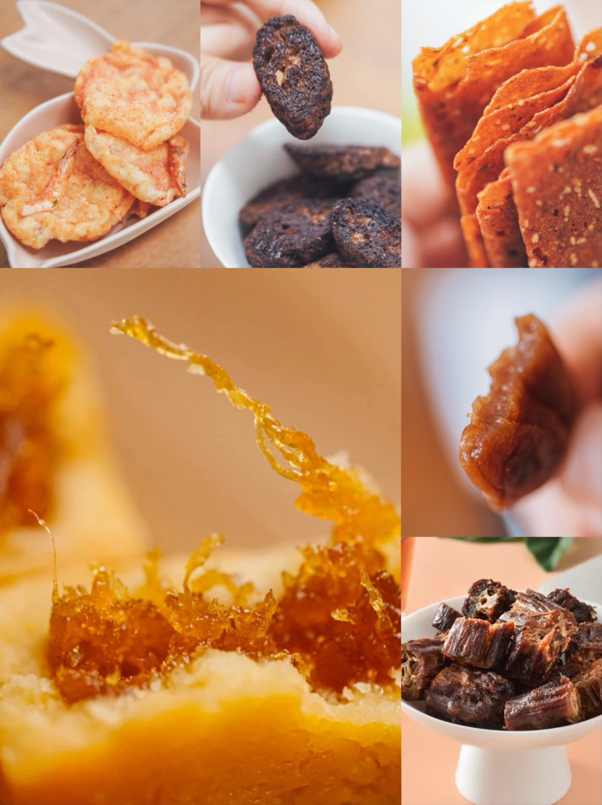
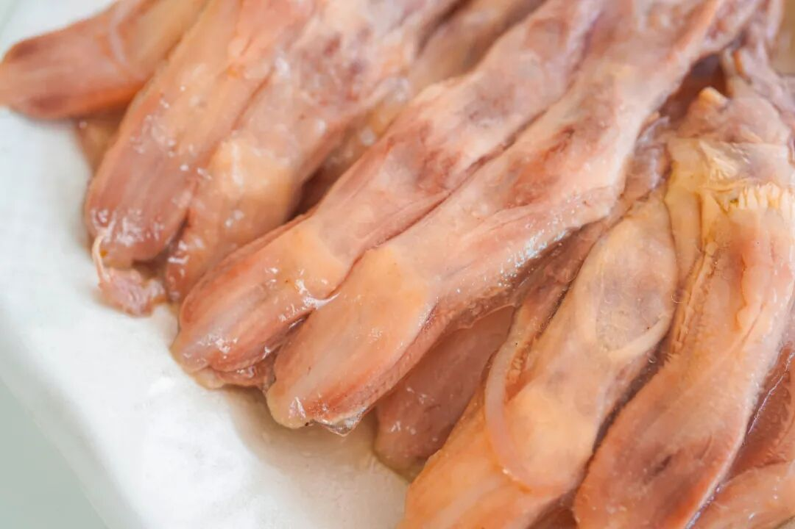
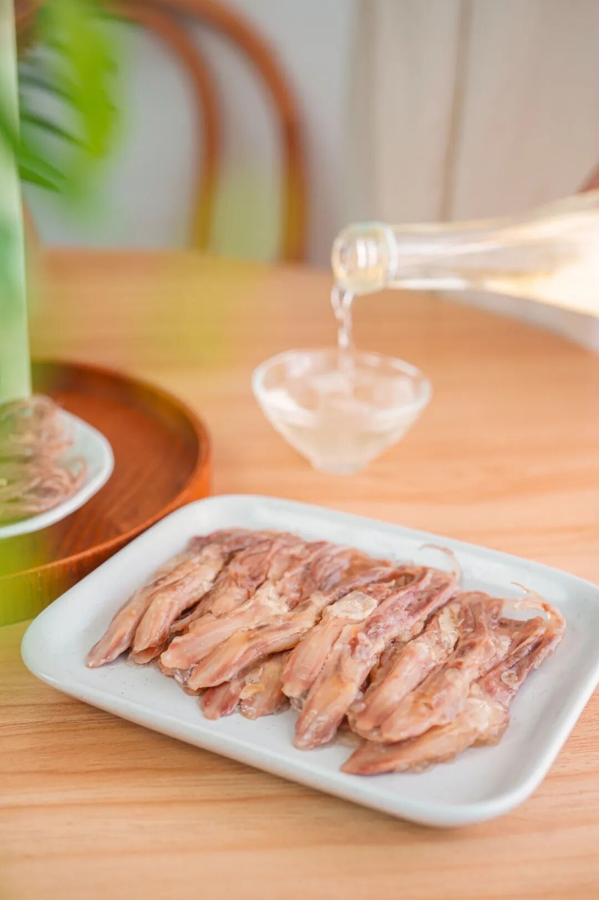
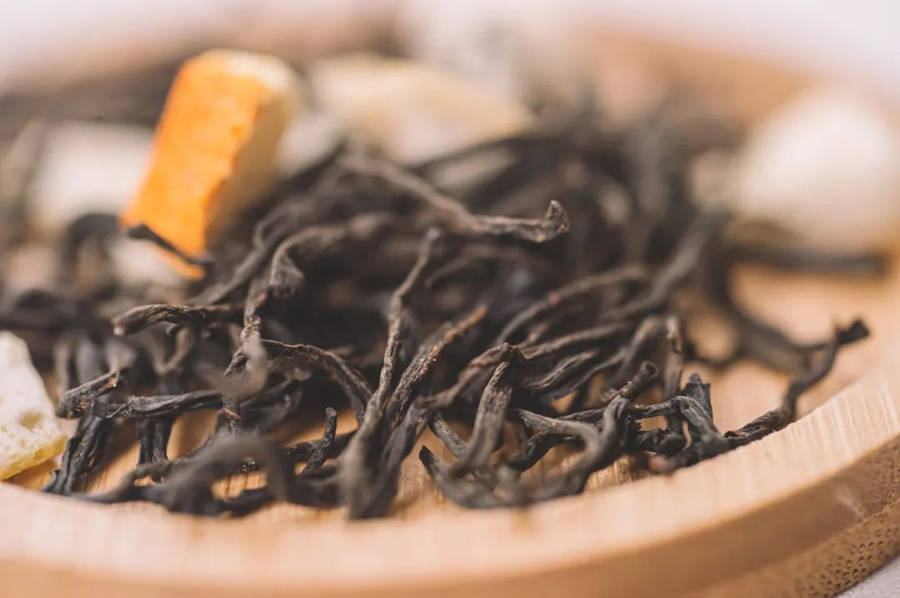

# 打折，让老板的生活雪上加霜：）

- 原文链接: https://mp.weixin.qq.com/s?__biz=MjM5NTYxODQyMA==&mid=2653461593&idx=2&sn=545422524e90c80fc8971866ea3e7c79&chksm=bc76604d50399f659211cfff8c3b70bb07bb87bfb01d3b05047bff79c0fd0e68471026c94bed&scene=27#wechat_redirect
- 浏览量: N/A
- 点赞数: N/A
- 评论数: N/A
- 转发数: N/A

## 正文

囤零食时间到

一个尽情安利自我的公众号

以下是没事干研究院的风物研究报告请放心食用
开门见山，就是打折！来，让老板本不轻松的生活，雪上加霜（？紧随双十一地板价，不管平台怎么算，现在小🍊序直接买最划算！限时八折走起！鸭舌、蛋卷、麻花、柚子小种红茶，直播价走起！！

1.大师凤梨酥
这款好评如流水的大师凤梨酥！最新一批 10 月底才到货！用料实在，
所以只有 90 天短保质期哦。

用的是台湾凤梨酥盲品大赛冠军配方，
选的都是新鲜土凤梨馅，
果肉含量大于 40%！
你一入口就能吃到浓浓的凤梨本味。

我司很喜欢吃凤梨酥的同事说，
吃过很多种凤梨酥，
芝士味浓郁的、果肉纤维多的、奶香味重的，
但都没有一口咬下去
酸甜跳跃的凤梨酥来得印象深刻。
是的，我饱记凤梨酥，
能让人吃出欣喜雀跃的感觉！

酸甜可口，果香浓郁，
真实会拉丝。
酥皮奶香饱满，酥润化渣，
像是在吃松软的黄油曲奇。

2.香脆肉纸

这个香脆肉纸，薄脆，吃起来很满足，而且肉含量高达70%！我个人已经吃了数不清几盒了。。（入手不亏！

3.樱花虾脆脆米饼

然后是樱花虾脆脆米饼，肉眼可见的海虾，而且非油炸！爽，还吃了没负担。

选用来自台湾野生的樱花虾，自带的鲜味，加上潮汕特制的鱼露提鲜。咔擦咔擦，比薯片好吃！

4.浓郁黑巧面包脆
不干硬，很酥脆，加了真正黑巧克力，
吃完一盒也不甜腻，然后还能配咖啡、蘸酸奶，完美。

5.紫苏梅饼

选用了广东普宁青梅，

果大、肉厚、核小！

我司以传统梅饼工艺结合当代蜜饯工艺，

22 道工序制作，

先盐腌后糖卤！

「厚厚的梅饼」表皮都带着点儿韧劲，

内里湿润带溏心！

紫苏梅饼用了紫苏新叶，

还以天然紫苏液调味，

吃得到浓郁且清新的紫苏香气，

开胃又解馋！

6.手撕鸭脖

长长长长长一条大鸭脖，

足足有 21cm！！

整根耐吃，

骨边活肉多，

越啃越有滋味。

码成下酒菜或者用来追剧吃，都超棒！

饱记·八折零食专区

购买方式如下

双十一地板价！！！

戳图下单购买👇

直播价专区 01：酥酥蛋卷

限时直播价 59.9 元/3 盒
香酥，极其香酥，好吃的秘诀无它，
就是舍得下料，手工制作！新鲜鸡蛋含量高达 27 %，入口化沙。

更推荐南乳葱香味！独家定制的口味，入口葱香浓郁，然后是南乳的咸香，味道平衡得刚刚好。

直播价专区 02：酒香鸭舌

限时直播价 129.9 元/3 袋
酒香鸭舌，包邮区糟卤口味！灵感来自《红楼梦》里宝玉喜爱的下酒小菜～秋冬里配杯小酒，超惬意！

专门盯着南京的厂找，因为全世界他们最懂鸭子。最后定的是一家老师傅开的厂，厂里有一锅 30 多年的老卤！这个就叫家底儿～

鸭舌原料舍近求远，用的内蒙古的鸭，吃草～鸭舌肥嫩没有腥气！

所有的香料，都直接从同仁堂、太乙堂两家中药房采买，不是市场上那些脏脏没味儿的糙货！传统方式吊糟，就真的是糟香鸭舌的包装版！

完全没有真空鸭袋的辣鸡食品味！
不腥，很香，微咸，带酒意～鸭舌边边上还有酒香味儿的冻～～包邮区的朋友肯定爱！

直播价专区 03：桂花乌龙

限时直播价 98 元/1 盒

非常适合秋日的桂花乌龙！按福州同事的原话，这茶完全经得起盖碗的考验！和市面上都是细末的调味茶不是一回事，必须细细品味！

这茶茶底好得很，翻出家里的盖碗，怎么泡铁观音就怎么泡它。揭盖一闻，哇～桂花的香气完全被激发，直窜入鼻尖！带着一点花的自然甜味～

入口茶汤微稠，舌侧香气余韵不绝，观音茶的回甘源源不断！总之，闻起来是甜的，喝起来却有烤过的醇厚滋味！本当它是办公茶叶，没想到茶底这么好，还耐泡得很！
立即决定囤几罐在家！

直播价专区 04：柚子小种红茶

限时直播价 59 元/1 盒

这款柚子小种红茶，

一个字：香。

清新柚果香混着茶香，

恨不得把它变成室内香薰使！

用的是武夷山的花香小种红茶。

传统手工精制，一芽一叶，

自带的鲜叶汁水也更丰富。

泡出来后，

远远都能闻到饱满的柚子香气！

你还可以像董洁一样，（是的它可是上了董洁直播间！拿出喜欢的杯子品品，
总之优雅永不过时

直播价专区 05：小麻花

限时直播价 59.9 元/5 袋

四川传统小零食：小麻花，

进口一级大豆油，

特制高筋粉。

一共三个口味：

用手工熬黑糖裹制的黑糖麻花，

用好花椒入味的椒盐麻花，

挂着白芝麻的芝麻麻花，

都不硬不腻不粘牙！

饱记·直播价专区购买方式如下双十一地板价！！！
戳图下单购买👇

题 外

以下这些折扣，

同样不容错过哇！

我司外面买不到的云南黑脚鸡，

还剩几十只 6 月龄公鸡！

物种有别！

公鸡很好啊啊！！（尖叫脸

肉多！油少！还清甜！

现在还给 65 折地板价！

此外还有这个时节不容错过的太湖流域大闸蟹&洪泽湖大闸蟹&山核桃，我司卷中卷产品，拿到外面去都能打得很！具体你们看商详，最重要是这些地板价折扣过几天就没！

饱记·云南稀有品种瓢鸡

购买方式如下

双十一同价 65 折！！

一种规格，最后一点点：6 月龄公鸡净重 3.4 斤以上。

下单前请注意：此鸡蛋白质含量丰富，宰杀时已尽量放血，但少量余血开包时气味仍会比较大，请冲洗再食用！鸡皮不发粘，就绝非变质～～～
戳图下单购买👇或🍑🍑🍑搜索「艾格吃饱了」

饱记·太湖流域大闸蟹

购买方式如下

双十一同价限时 86 折

戳图下单购买👇或🍑🍑🍑搜索「艾格吃饱了」

饱记·洪泽湖大闸蟹

购买方式如下

双十一同价限时 86 折

戳图下单购买👇或🍑🍑🍑搜索「艾格吃饱了」

饱记·临安山核桃

双十一同价

单罐限时 9 折！

双罐限时 8.3 折！

戳图买它👇

或到🍑🍑🍑

搜索「艾格吃饱了」

本文的研究员

薯角你好啊海绵宝宝

用好吃的方式吃一生

祖国各地好风物

文章转载请加微信「baojiclub」

