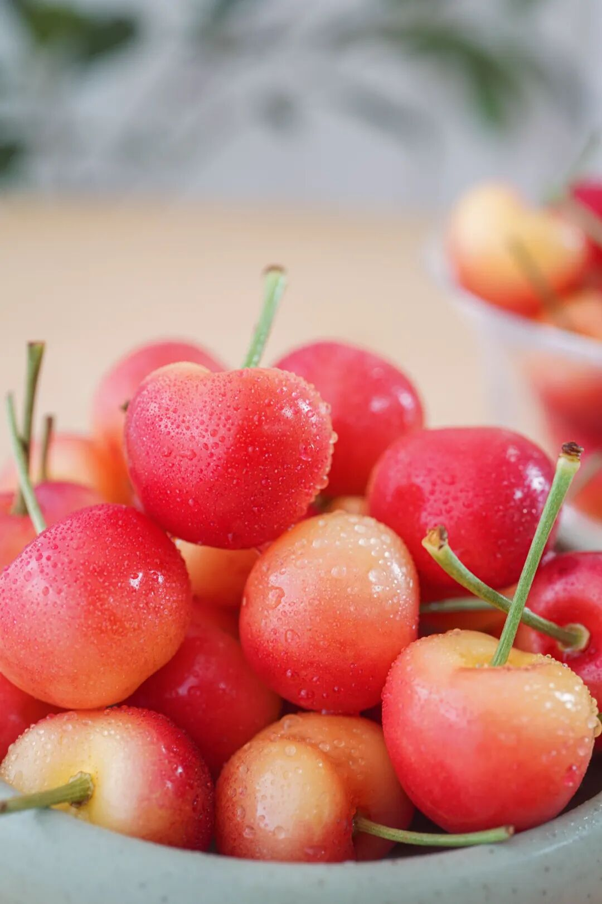
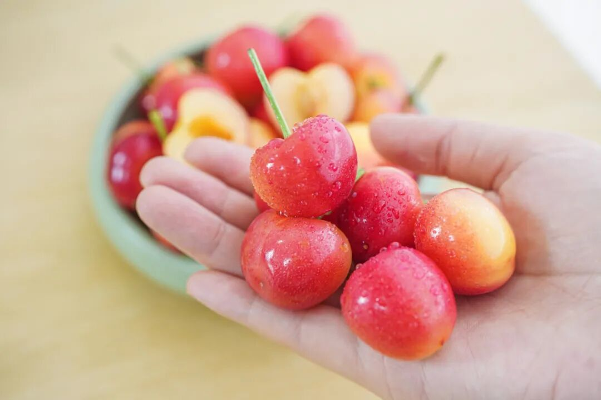
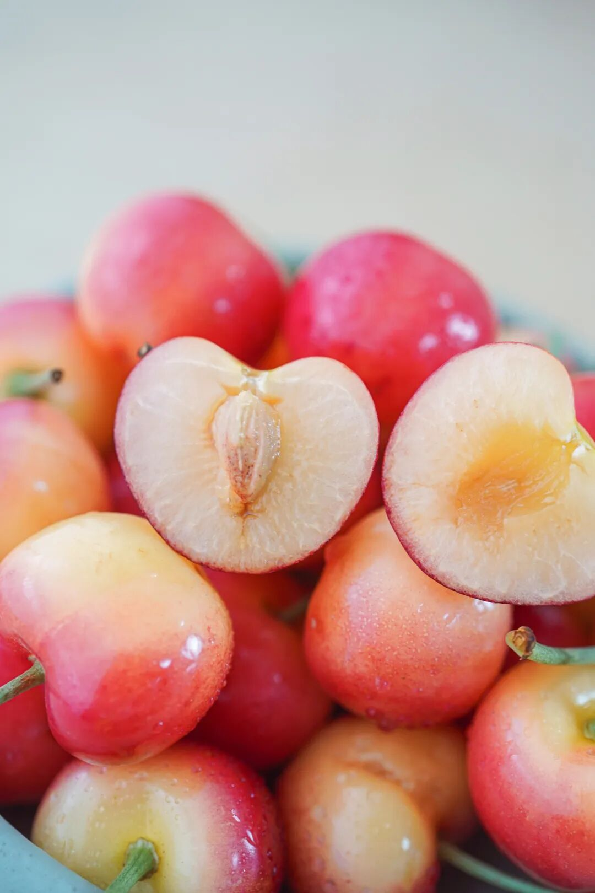
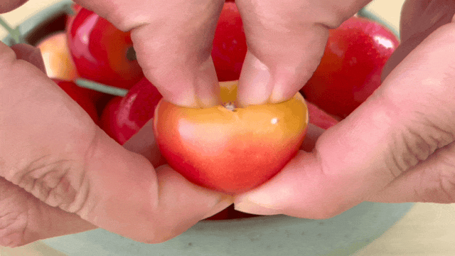
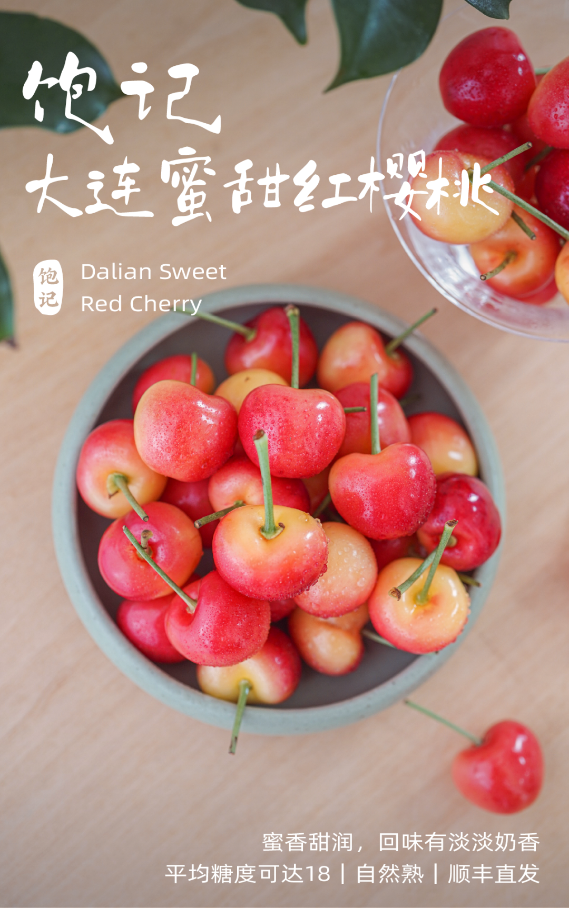
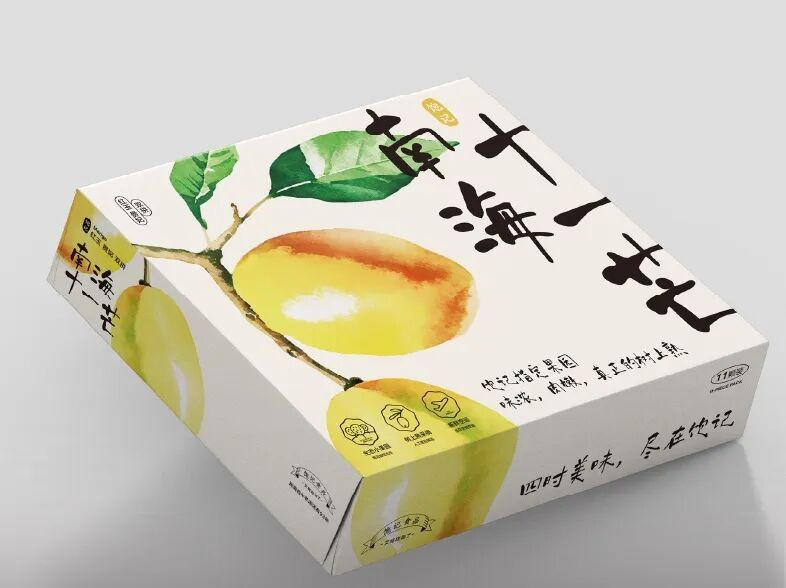
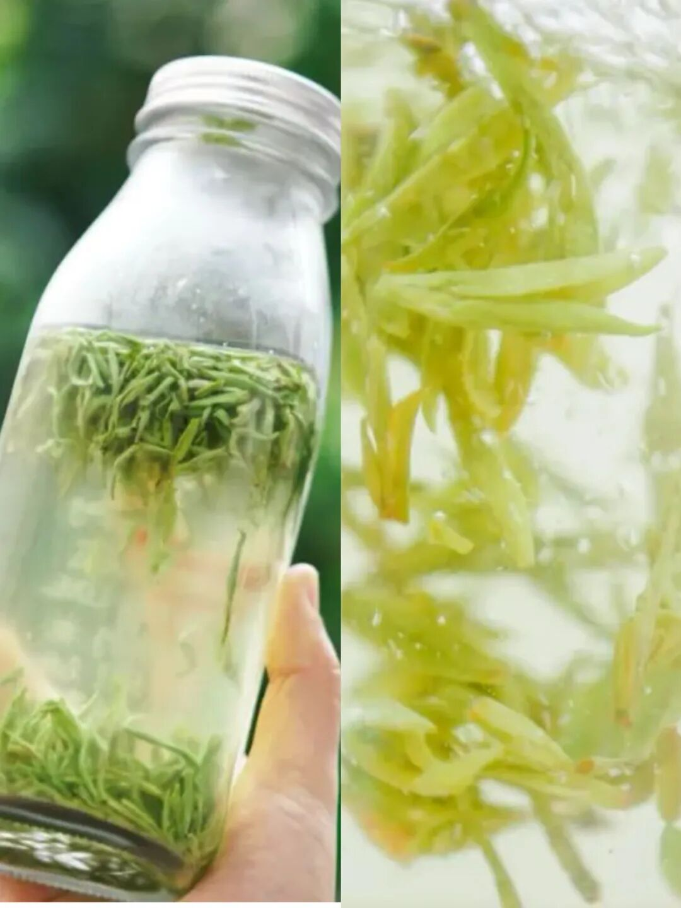

# 找了七八年，只能吃一两天。。。

- 原文链接: https://mp.weixin.qq.com/s?__biz=MjM5NTYxODQyMA==&mid=2653470703&idx=1&sn=341f4f30d2e472444bedf3cbca680b8e&chksm=bc721b88262911dfc8997dbfea57054bb2188109c69633d887f595dbaad22a0c47303591bd0f&scene=27#wechat_redirect
- 浏览量: N/A
- 点赞数: N/A
- 评论数: N/A
- 转发数: N/A

## 正文

伤春悲秋

一个尽情安利自我的公众号

以下是没事干研究院的风物研究报告请放心食用

五月才过一周，

又是说再见的时候。

一些时令好吃的，

嗖一下就到了尾声！

啊啊啊啊啊！！

说的正是我司寻了七八年的樱桃，今年终于有相中的果园！（真是不容易

果期却极为短暂，本周是最后一波，大家抓紧吃起来！

好吃貌美、风味鲜浓，

相信你们吃过以后，

也会雀跃得想吟诗一首。。。

它们来自大连北部的温室基地，表皮晕染红霞光泽。果实大！每一颗都经过人工精筛两遍，只给大家发好果、大果嘿嘿👇

入口蜜香甜润，甜，超甜，平均糖度可达 18！咬破的瞬间汁液就在口腔里爆开。

如果只是追求糖度，老板也不至于苦寻多年。这樱桃不仅大而甜，
更重要的是果味鲜浓，不是那种死甜哦！

而是入口脆嫩有滋味，回味还有一层淡淡奶香～

因为比起其他樱桃，
这果子蓄冷时间更长、亩产更低，不见阳光的枝条上基本不保留樱桃，保证足够养分供给。
产量低、成本高，才有这一口早春难得美味～

还是饱记标准，颗颗自然熟，九分熟给大家发，
到手洗洗就能吃，
冷藏个 2 小时左右更好吃！

从产地给大家顺丰直发，省心、安心，且新鲜吃得出嘿嘿～限时尾声 9 折！就这么短短几天，下次就是明年，客官们！请吧～

饱记·大连蜜甜红樱桃

购买方式如下

限时尾声 9 折！！

戳图购买👇

这 11 枚顶顶香甜的【南海十一芒】，

好评太多了，

顺手也提一下！

起因是我司和老板、果园提了这个问题：

如果做浓缩海南全岛精华的

红玉 + 贵妃

（金煌不要来碰瓷，风味差远了

有没有可能让全国的饱记用户，

吃到真正地头采摘、树上熟的双拼？

最后大家终于拿出了这个办法：

按照 2 枚红玉（每枚净重 1.3-1.5 斤）

9 枚贵妃（每枚净重 0.3-0.4 斤）

给它定制专属的珍珠棉格子，

果园给严格挑选外观，

只有身长瘦美、黄金比例的

美人芒果才能入选！

红玉芒果，

皮薄肉超厚，

这盒因为基本完熟，

开箱就香气四溢：

这是红玉，真的核薄！！！

贵妃，来自崖州小果园，

不打催熟药，

因空运 + 人手精挑，

真 · 树上熟贵妃芒。

箱子是饱记设计师精心手绘的，

可作送礼使用！

因为基本完熟，

所以绝对不要放冰箱，

常温最多两三天要吃完～

贵妃芒不以颜色判断熟度，

绿的也甜！

饱记·南海十一芒

购买方式如下

限时吃水果 9 折！！

戳图购买👇

题 外

朋友们！！！

今年的饱记粽子！买了吗？？除了经典四个口味湖州大粽，还有用了现榨葱油、葱酥的闽南肉粽！泉州妈妈配方！地道得不得了～限时吃粽 9 折！时令新鲜的春季茶中「梅家坞」和「蒙顶甘露」性价比高！自家喝不心疼！限时单件 86 折/双件 8 折！上好的「狮峰龙井」送人包体面！限时喝春茶 9 折突然熟了的云南西红柿，小时候阳光里长大的浓郁番茄味儿，
限时早鸟 86 折！！来自湛江的红膏青蟹。不仅有红膏，而且满到蟹壳角角落落。

其他的东海野生海鲜，

肥美银鲳和红膏梭子蟹，

都是高级餐厅水平！

限时吃海鲜 9 折！

还有些只有最近这一阵可吃的水果👇

拿过上海金奖的金山小番茄，

难得回归的泰国超甜多汁金柚，

瓜肉软糯的翡翠冰淇淋甜瓜，

无渣不麻嘴的海南金钻凤梨，

连盐水都不用泡。

卷中卷红玉芒果，

娇艳可人的雷州木瓜，

现在也有限时 9 折！

饱记·口碑湖州大粽预售中

现货中！！！

限时吃粽 9 折！！！！

戳图买它👇

饱记·云南西红柿

购买方式如下

限时 9 折！！

戳图购买👇

饱记·多汁泰国金柚

购买方式如下

限时吃水果 9 折！！

戳图购买👇

饱记·梅家坞龙井&蒙顶甘露

限时单件 86 折！！！

两件 8 折！！

戳图购买👇

饱记·狮峰头采明前龙井

购买方式如下👇

限时喝春茶 9 折！！！

戳图下单购买👇

饱记·金山五彩小番茄购买方式如下限时 9 折！！
戳图购买👇

饱记·翡翠冰淇淋甜瓜购买方式如下限时吃水果 9 折！！
戳图购买👇

饱记·花香脆甜蓝莓购买方式如下限时吃水果 9 折！！
戳图购买👇

饱记·湛江红膏青蟹购买方式如下限时吃海鲜 9 折！！！
戳图下单购买👇

饱记·海南金钻凤梨

购买方式如下

限时吃水果 9 折！！

戳图购买👇

饱记·海南红玉芒果购买方式如下限时吃水果 9 折！！！
戳图购买👇

饱记·湛江雷州木瓜

购买方式如下

限时吃水果 9 折！！

戳图购买👇

本文的研究员

薯角我想我知道夏天的味道

用好吃的方式吃一生

祖国各地好风物

文章转载请加微信「baojiclub」

