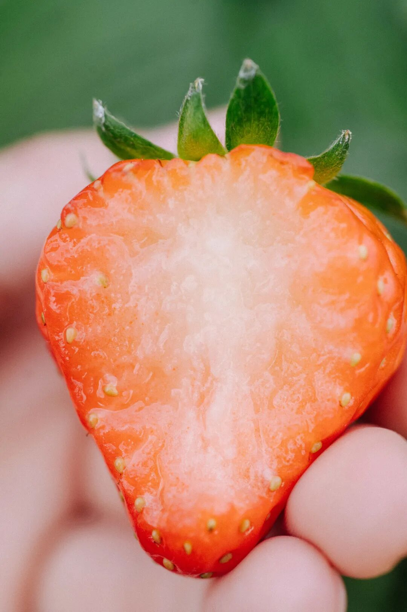
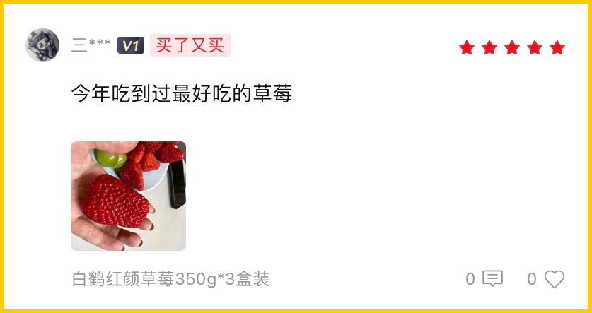
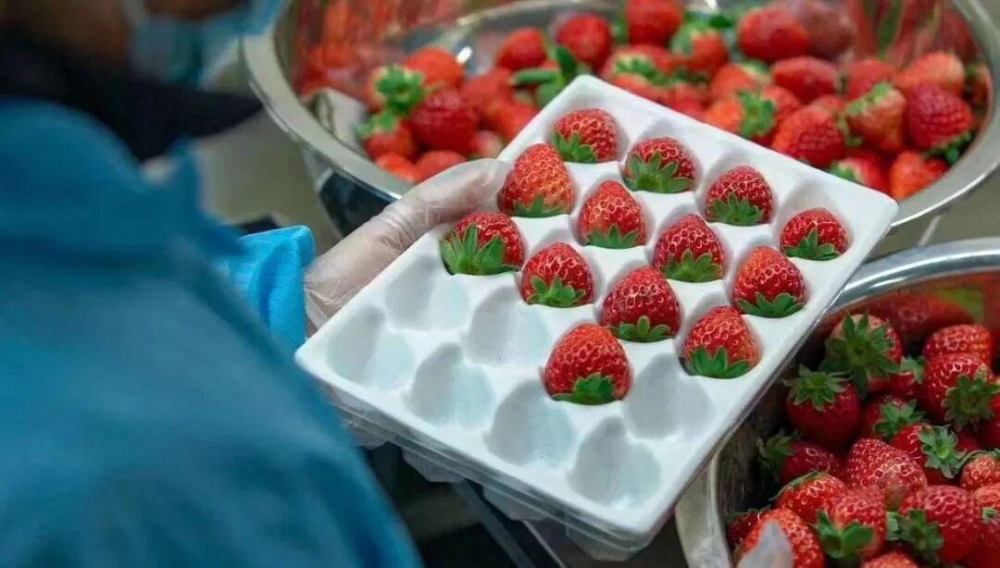
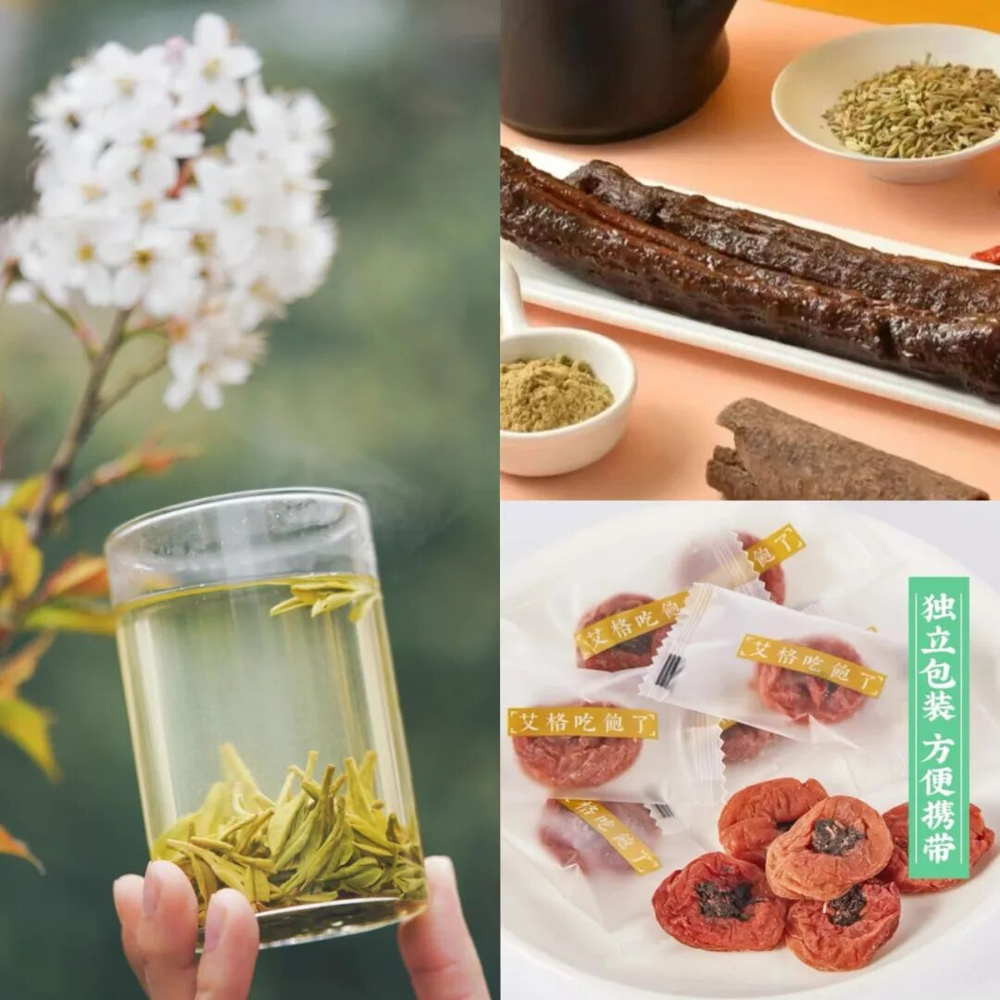

# 拿过金奖的草莓，就是不一样

- 原文链接: https://mp.weixin.qq.com/s?__biz=MjM5NTYxODQyMA==&mid=2653464248&idx=1&sn=a9d3abd027571f3dd6bb90bd782e3c46&chksm=bc7cd89915b216f9bab3bb74ce701d2f26d14459ec4fd8ab9b812f109eb93399fea53af1ca76&scene=27#wechat_redirect
- 浏览量: N/A
- 点赞数: N/A
- 评论数: N/A
- 转发数: N/A

## 正文

沪上草莓进击史！

一个尽情安利自我的公众号

以下是没事干研究院的风物研究报告请放心食用
不是来了这司，本薯属实不知，上海，竟是个种草莓比丹东还卷的地方。。。

作为中国最早栽培草莓的地区之一，种植技术早已卷到飞起，却一直不声不响！这怎么能忍？今天就来跟大家好好吆喝一番啊！

要说这上海的草莓种植历史，

还得追溯到 1928 年。

（算了一下，那会我太爷爷还没出生。。。

其实也就只比丹东晚了 4 年而已。

而其中，位于上海西北一角的青浦白鹤镇，

又把上海草莓推向了更高的位置。

早在上个世纪八十年代，

白鹤镇就引进了 5 棵

名为「宝交早生」的日本品种秧苗，

让本地农户尝试种植。

从成功种植，到农户自由种植，再到科研化，

前后也就花了十来年吧。

（咱们国人是有一些弯道超车的本事在身上的

有了成功案例，

2009 年，上海青浦白鹤镇从日本引进红颜草莓。

（红颜是我国草莓栽培最主流的品种，丹东99就是红颜

并于次年就拿下了全国草莓大会的一等奖，

相当于官方认证过，

品质完全可以和丹东一较高下。

有了身份之后，一路高歌猛进。

近几年，

上海草莓的代表「白鹤草莓」

被评为了「中国农产品地理标志」，

青浦更是成为了国内外主要的草莓产区之一。

但即便已经如此优秀，

上海政府每年都会搞草莓大赛，

为的就是把草莓卷起来，

从而让上海的草莓种植技术、以及口感越来越好～

（卷得好卷得妙。。。

2022年，由上海市农村农业委主办、

上海农业展览馆承办的上海地产优质草莓品鉴评优活动，

我们饱记只选了其中的金奖！

完全按评金奖要求挑的，

评委吃的啥我们也吃的啥～

（是的，就是这么骄傲！

这金奖草莓，还没有入口，就能闻到剧烈的香气。

咬一口，汁水在口腔里蔓延，

鼻腔同时又被弥漫的香气包裹。

真的会上头。

此外，它还品相极佳，个头秀丽，颗颗都饱满红艳，
因为还是饱记标准，每一颗都要经过人工精筛嘿嘿～

大家关心的草莓农残问题，

这一点，请放一百个心！

上海对地产草莓的监管很严格，

是要纳入上海市种植业生产信息管理系统的，

所以都是有据可查，几乎没什么农残。

合作社的果农们说，

自己平时在地里渴了，

也会随手吃点草莓当水喝。

（hhhhhh我一点都不羡慕

白鹤各家合作社种植户遵从绿色种植原则，

采取有机种植方式，

比如会在大棚内养蜂，让蜜蜂给草莓自然授粉，

设置捕虫袋，通过物理的方式来抓虫，

有的还会利用合作社种的玉米杆子，

给草莓土壤补充营养。

最重要的是，如果你和本薯一样生活在包邮区，
这草莓有压倒性的优势！丹东的草莓当然不差，

可能大家不知道，买草莓，

本地能吃到是最好的。

这里主要是运输上的损耗。。。

丹东草莓发货一般在六七成熟，

但是白鹤草莓可以做到八九成熟再采摘发货，

那当然是更软糯更浓郁啦。

（所以大家现在可以打开地图看看距离了。。。

非我薯角自夸，

看看后台去年真情实感的好评👇

好了，

今天真是唠深了，

你们看着点买吧。

冬天哪能不吃草莓！

这水果初上市最为矜贵，

目前价格比较高，

后续慢慢会降！

大家就当尝个鲜！

老规矩，薅一个限时早鸟 86 折，

本薯要折扣不易！

应吃尽吃哇！！！

饱记·红颜草莓购买方式如下限时早鸟 86 折！！！
戳图购买👇

题 外

敲锣打鼓，

几样本薯较少吆喝的好东西在临期清仓，

6 到 7 折！自家吃吃不妨碍啊！

超过瘾的手撕鸭脖效期至明年 1 月，

紫苏梅饼效期至明年 3 月，

最后 4 盒西湖龙井茶效期至明年 3 月，

介意慎拍哦！！

以及今年冬天的富平柿饼预售了！

趁还没发货给一个地板价！

限时 8 折！只剩一天！！

后台千呼万唤喊着补货的

75% 木姜子巧克力，

现在还有限时 9 折！

其他适合空调房吃吃的水果也看这里👇

来自广西融安的脆蜜金桔。足以颠覆自小到大的金桔风味印象！从芯子到脆皮都是蜜蜜甜的。

上周刚到的广西双拼芭乐，

扎实的冰激凌球口感！

现在也有限时 9 折！

最后今年大闸蟹已到尾声！

苏南蟹标杆美味：太湖流域大闸蟹

苏北蟹宝藏性价比之选：洪泽湖大闸蟹很快就没！

饱记·临期零食清仓专区

6 到 7 折！！！介意慎拍～
戳图购买👇

饱记·富平柿饼

预售中！！！

25 号起按顺序发！！

限时早鸟 8 折！！！
戳图购买👇

饱记·云南木姜子75%黑巧克力购买方式如下限时 9 折！！
戳图下单购买👇或🍑🍑🍑搜索「艾格吃饱了」

饱记·融安脆蜜金桔限时吃水果 9 折！！！只到本周五！！
戳图购买👇

饱记·广西双拼芭乐限时吃水果 9 折！！！只到本周五！！
戳图购买👇

饱记·太湖流域大闸蟹

购买方式如下

三种搭配：

满足装，

3-3.4 两母蟹，4-4.4 两公蟹，

吃过解馋。

劲爽装，

3.5-3.9 两母蟹，4.5-4.9 两公蟹，

可以拍照发朋友圈争奇斗艳。

尊享装，

4-4.4 两母蟹，5-5.4 两公蟹，

顶格水准，适合送礼。

人工精挑，

上岸后静养一两日更鲜美，

每日限量 50 箱。

拼的就是手速。

顺丰快递发货，

新鲜看得见。

戳图下单购买👇或🍑🍑🍑搜索「艾格吃饱了」

饱记·洪泽湖大闸蟹

购买方式如下

满足装洪泽湖大闸蟹：

3 两母蟹，4 两公蟹。

性价比之选！

劲爽装洪泽湖大闸蟹：

3.5 两母蟹，4.5 两公蟹。

饱记热销款。

尊享装洪泽湖大闸蟹：

4 两母蟹，5 两公蟹；

或 5 两母蟹，6 两公蟹。

实际超重，量极极极少，送礼佳品。

人工精挑，

上岸后静养一两日更鲜美，

每日限量 100 箱。

顺丰快递发货，新鲜看得见。

戳图下单购买👇或🍑🍑🍑搜索「艾格吃饱了」

本文的研究员

薯角多吃点，好过冬

用好吃的方式吃一生

祖国各地好风物

文章转载请加微信「baojiclub」

