# 整个冬天最好吃的水果（之一

- 原文链接: https://mp.weixin.qq.com/s?__biz=MjM5NTYxODQyMA==&mid=2653462974&idx=1&sn=8251907d63261993ef92982261fa721b&chksm=bc30cd5a60621f25b7c945bea04eff29be7805328cec29f8f740ba48e997c53459f1618e4463&scene=27#wechat_redirect
- 浏览量: N/A
- 点赞数: N/A
- 评论数: N/A
- 转发数: N/A

## 正文

它回来了！

一个尽情安利自我的公众号

以下是没事干研究院的风物研究报告请放心食用

啊啊啊啊啊啊，今天无心摸鱼，迫不及待想跟大家分享，每个冬天都要关在空调房、暖气房吃的它，终于回来了！！！！！

正是这一枚一见倾城、再见倾国、未见倾心的柑橘界皇后——饱记·象山红美人！

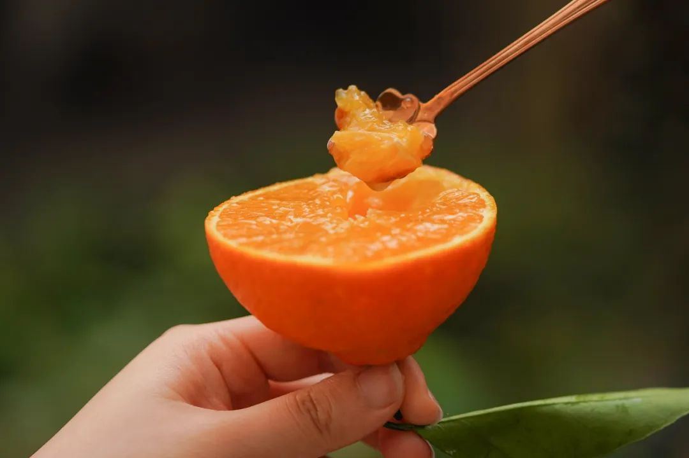

坊间又称之为果冻橙，

一点没夸大。

首先是细腻无籽，没有筋络，

入口似果冻般嫩嫩滑滑～

吸溜着抿一下，

汁水直接在唇齿间爆开！

拿手机拍了张图，晶莹剔透能透光。

结合了橘子+橙子+柚子的优点，

所以皮薄易剥，细嫩无渣，

又有浓郁的柑橘香气

堪称完美！

皮薄就算了，经络得拿放大镜找。。。

上大学那会，得托浙江同学的福，

每年才能蹭到几个，如今是满天飞啦。

线下商超，电商平台，楼下水果店，

随处可得，价格不等。

但是吃到嘴里，才能分辨真章。

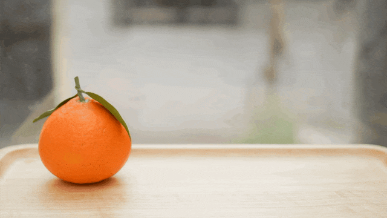

正宗红美人长这样，色泽艳丽，果肉饱满
为此，

本薯最近还特意跑了趟象山，

给大家看看核心产区的优选好果，

究竟正宗和好吃在哪里！

毕竟我司在水果这一块的实力，

也是有目共睹

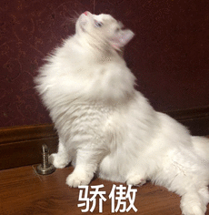

1.核心产区，小众精品果园，正宗！

众所周知，

比起市面上买得到的大路货，

饱记一向喜欢卷精品小众果园！

果子更好，产量更少，

每一棵果树都能得到细心的照料！

整个象山如今几乎家家户户都在种红美人。

几年前老板带着同事上山下乡，

挨家挨户拜访农户，

最后找到了一位六十多岁的老伯！

经验丰富，种了四十多年柑橘，

最关键还在于，

他的红美人就是比别家的浓郁清口风味足！

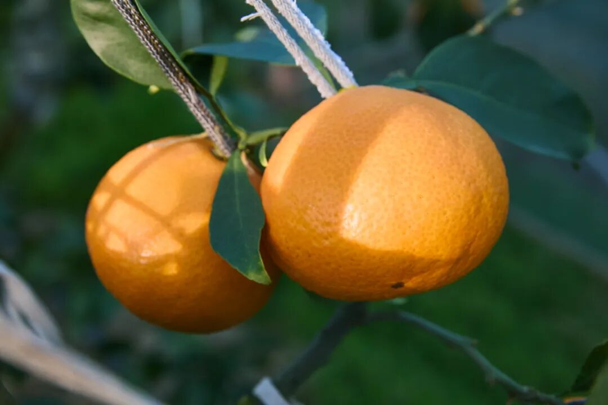

红美人这品种来自日本爱媛县，

据说二十几年前，

一名象山橘农将枝条从日本带回，

经过十来年的栽培，

才实现了规模化的种植。

我饱记合作的果园，

就是第一批象山农业局红美人联盟成员！

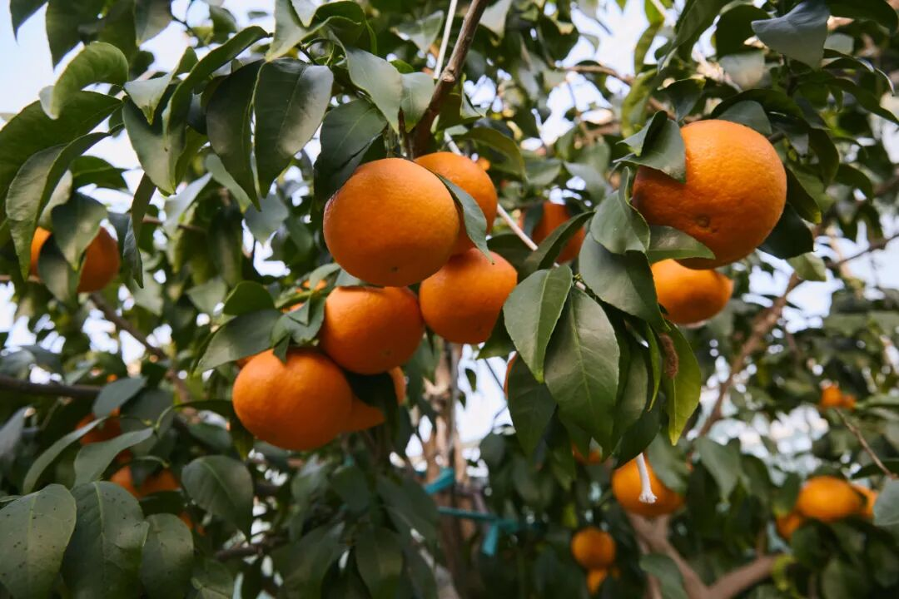

10-40 年老树嫁接技术，

还要大棚种植！

因为它太难种了！！！！

冷了不行，热了不行。

抗病性也差，任何一点污染、虫害，都会挂掉。

为了种好红美人，需要投入的精力，

真的太太太多了！！！！

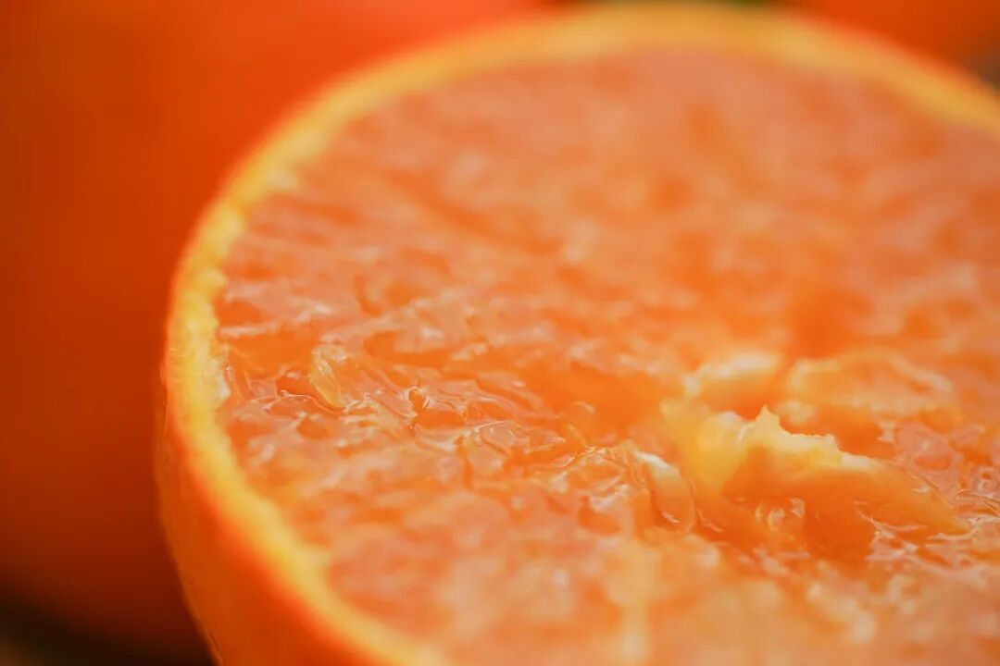

所以它的价格，

比起四川爱媛，

差的不是一点半点哦。

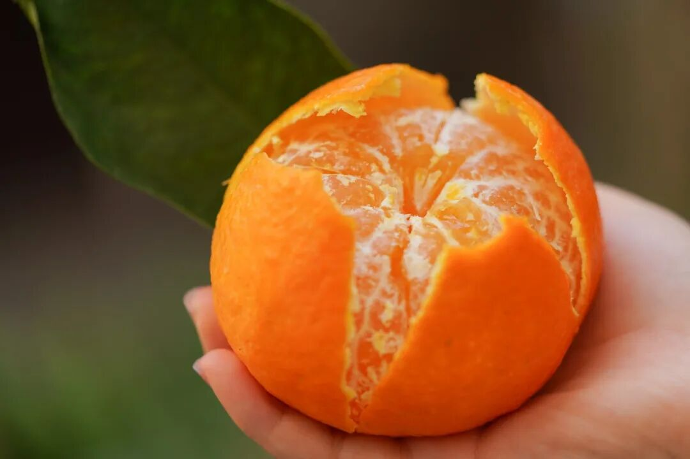

但你看星爸爸的NFC橙汁，一小瓶，

25 大元，

用的墨西哥进口橙，确实好喝。

（十块那种真的不能比，不理解一个橙汁为什么还麻嘴？

其实你要这么算算，

红美人也还好了。。。

2.橘中名品，自然树上熟，甜中带酸！

我司红美人的风味之美，

在于它糖度颇高，

果园里随手摘一颗就有 15.5👇

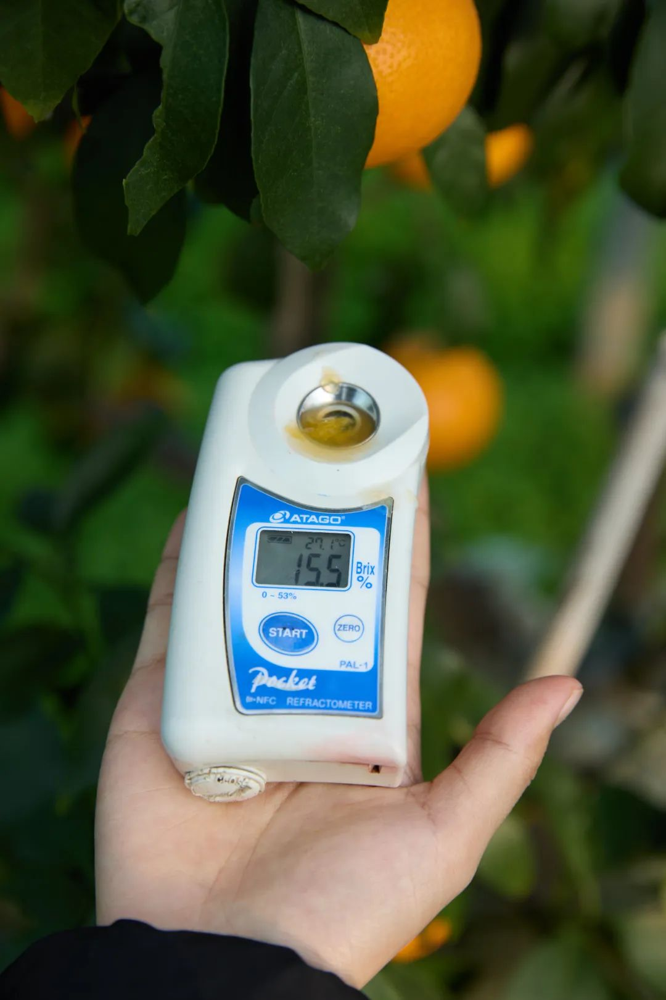

日常抽测一颗也有 12.8，

和网购的随便比👇

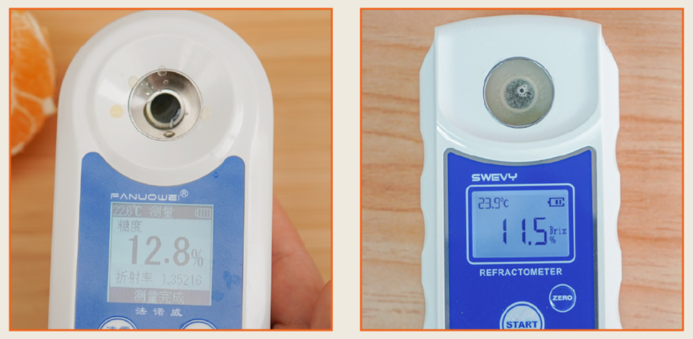

左：饱记，右：网购

但更值得骄傲的，

还在于它不是那种傻里傻气的死甜，

甜中略带一丝酸味。

这一丝酸的存在，

反而是画龙点睛之笔。

稳稳打败所有对手。

这里插播一条老板的评价，

高甜的同时带酸，

所以非常鲜浓，不然就是齁甜，

这才是橘子届的王者，要给它尊严！

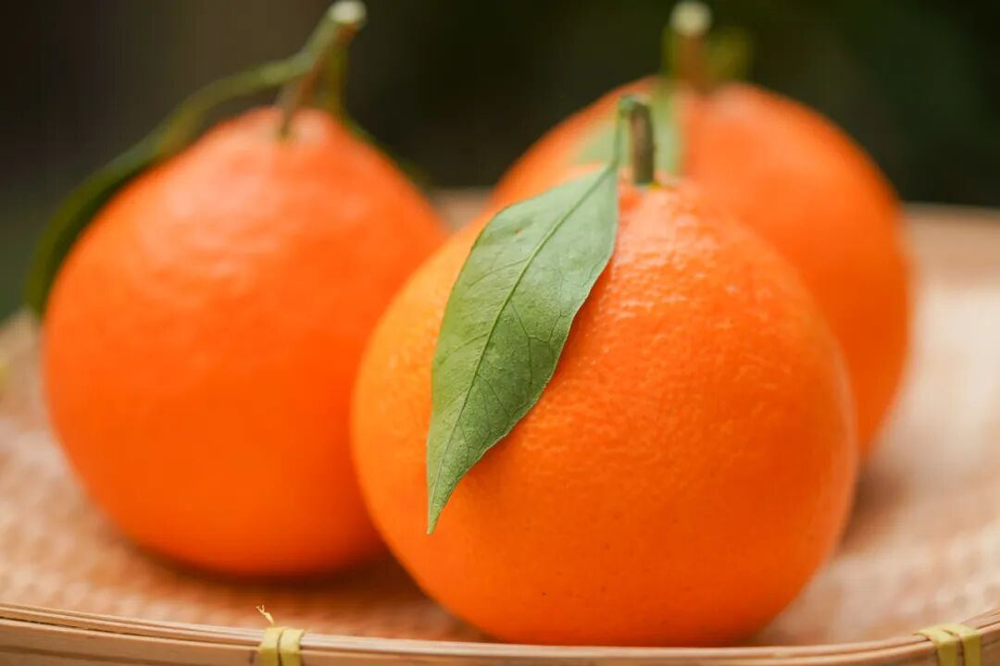

看看这薄如蝉翼的薄膜，一撕就破，

入口根本无阻力，

绝对比德芙巧克力丝滑。

轻轻咬下一口，

体验一下什么叫一发入魂。

水分多到爆汁，

满满的汁水缓缓滑过口腔喉头～～～

爽～飞～

冬天暖气这么足，

就是要吃水份多的小可人们才能缓解干燥呀。

这里说句得罪人的话，

那种白筋很多的、汁少的所谓红美人，

都是为寻找平替的韭菜准备的。：）

以本薯扎扎实实踩过的坑来说，

红美人“买精不买多”。

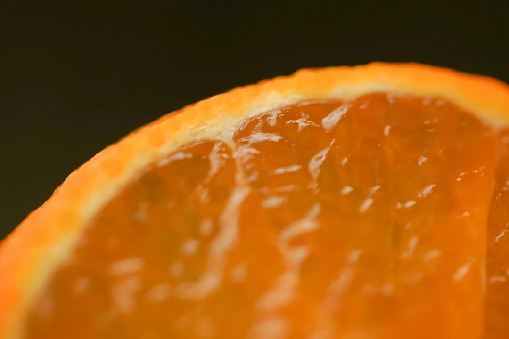

得房率真高。。

仍是饱记标准，

只选自然树上熟的果子，

再经过数道人工精筛，

确保颗颗都是好果、优果～

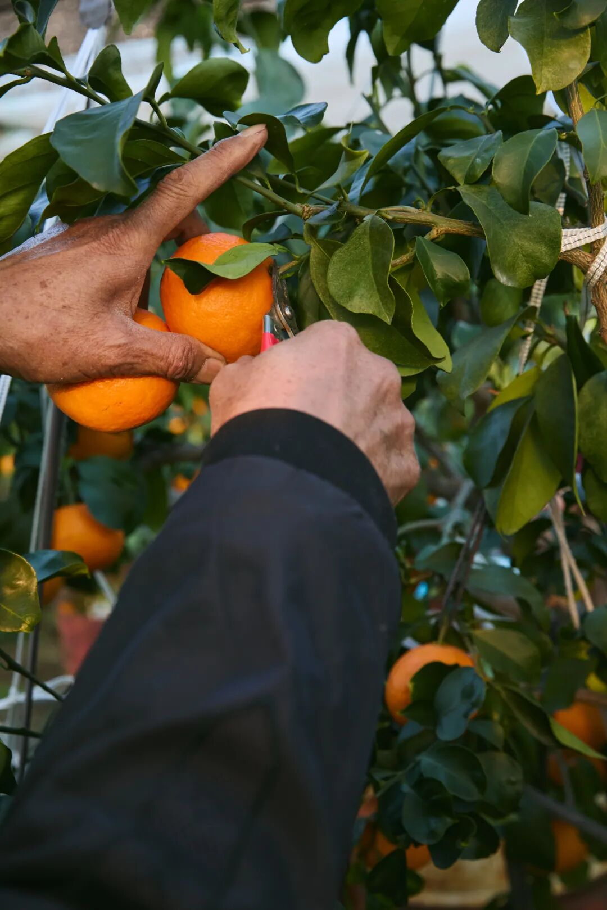

每日顺丰新鲜发货，

从果园直达你家里的餐桌。

再卷一下礼盒包装，

送礼也显得咱大大方方儿！

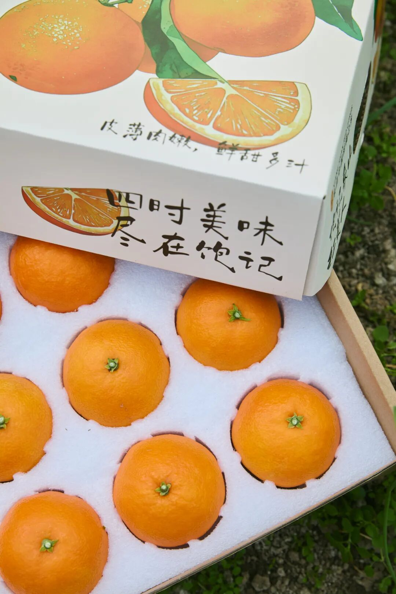

最后提醒一下大家，

这会儿正值红美人的最佳赏味期，

接下来的一个月左右就是成色最好的时候。

价格上，也是现在最划算。

因为本薯给大家薅来一个，

限时早鸟 86 折！

红美人培育和种植都不容易，

贵的时候 60 多一斤！

咱们刚好趁此机会品品啊！

饱记·象山红美人柑橘购买方式如下限时早鸟 86 折！！
戳图购买👇

题 外

大家好，

这个时节好东西不少（单押

今天的心意折扣直接来！

不用凑单不用研究！

外面买不到的金山瓢鸡，

这批卖完下次得等半年了！

苏南蟹标杆美味：太湖流域大闸蟹苏北蟹宝藏性价比之选：洪泽湖大闸蟹现在都有吃蟹 9 折！！
坚持真材实料、天然肠衣的手工腊肠，
能做煲仔饭和火锅的玫瑰露酒腊肉&腊排骨

有小时候番茄味的云南西红柿（快没了，

还有打遍天下无敌手的山核桃！我司卷中卷产品，拿到外面去都能打得很！具体你们看商详，最重要是还有些限时返场折扣再薅老板一回！冲！

饱记·云南稀有品种瓢鸡

购买方式如下

限时突破价 7 折！！

规格第一档：6 月龄公鸡净重 3.4 斤以上 70 只，6 月龄母鸡净重 2.5 斤以上 140 只。规格第二档：
6 月龄公鸡净重 3 斤以上 160 只，6 月龄公鸡净重 2 斤以上 140 只。
下单前请注意：此鸡蛋白质含量丰富，宰杀时已尽量放血，但少量余血开包时气味仍会比较大，请冲洗再食用！鸡皮不发粘，就绝非变质～～～

戳图下单购买👇

或🍑🍑🍑搜索「艾格吃饱了」

饱记·云南西红柿购买方式如下限时 86 折！！
戳图购买👇

饱记·太湖流域大闸蟹购买方式如下👇限时 9 折
戳图下单购买👇或🍑🍑🍑搜索「艾格吃饱了」

饱记·洪泽湖大闸蟹购买方式如下👇限时 9 折
戳图下单购买👇或🍑🍑🍑搜索「艾格吃饱了」

饱记·手工腊肠

购买方式如下👇

戳图下单购买👇

或🍑🍑🍑搜索

「艾格吃饱了」

饱记·玫瑰露酒腊肉&腊排骨

购买方式如下👇

戳图下单购买👇

或🍑🍑🍑搜索

「艾格吃饱了」

饱记·临安山核桃

购买方式如下👇

戳图买它👇

或到🍑🍑🍑

搜索「艾格吃饱了」

本文的研究员

薯角沪上知名水果猎人

用好吃的方式吃一生

祖国各地好风物

文章转载请加微信「baojiclub」

