# 整个冬天，只守着这一家水果店（可网购

- 原文链接: https://mp.weixin.qq.com/s?__biz=MjM5NTYxODQyMA==&mid=2653463733&idx=1&sn=87ee055a919a91a446c30393c653ac89&chksm=bc2f88dd91222bf875e0d089b21c5a56aedd6b009391637ca243088f1f4100c78e3fb7b7bd4a&scene=27#wechat_redirect
- 浏览量: N/A
- 点赞数: N/A
- 评论数: N/A
- 转发数: N/A

## 正文

谁给我点个好运来

一个尽情安利自我的公众号

以下是没事干研究院的风物研究报告请放心食用
一不留神，双十二折扣进入倒计时，尾声给大家安排一个水果专场啊！这个季节的时令风味，又甜又润，
空调房、暖气房里吃吃岂不妙哉？？

玩归玩，闹归闹，

不拿卖货开玩笑。

请大家再看看本薯角要来的

水果地板价 86 折大福利啊。。

现在买就是最划算！

（过了这一波明年才有了。。。

点名一下我爱的几位佳丽，

都是倾情推荐，你们把握时机。

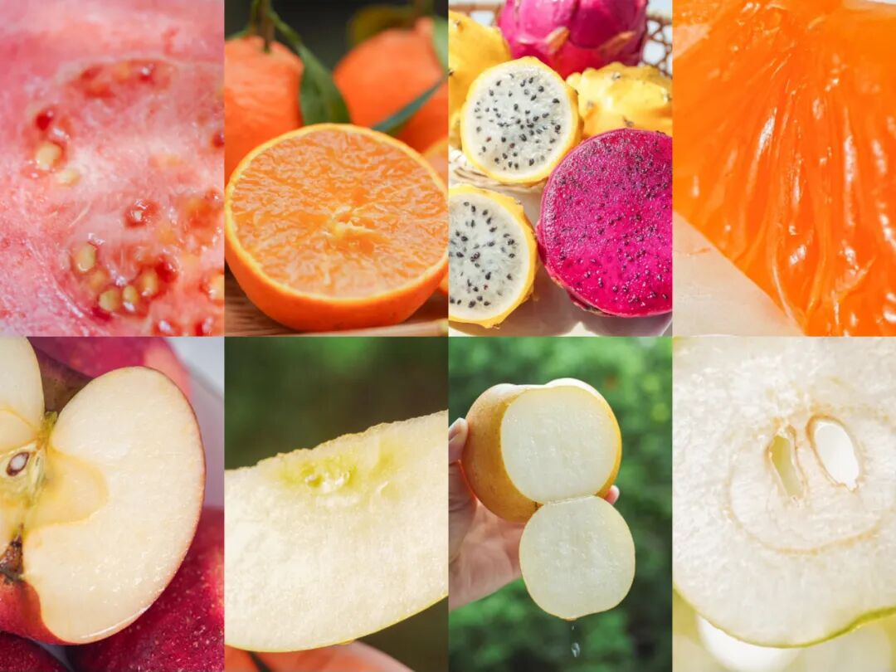

1.广西双拼芭乐
这个冬天，它它它它终于回来了！！奶茶店里的常客，
有人爱它美貌，有人爱它独有香气，更多的是贪图那一口：可以大口啃的丝滑~~~

微甜，饱腹，没啥热量，（多吃不胖，没啥负担还好吃，谁不爱呢但好吃的芭乐难寻~

但我司在生鲜水果上，一向没在怕的！这芭乐产自广西玉林民乐镇，
是国家首批生态家园建设示范点。（不用我说，国家认可的好山好水好环境！施农家肥，物理防虫，吃的就是一个原生态~

双拼，一次可以吃两种。奶油白心芭乐的几乎无酸，草莓红心芭乐更香。（个人感觉可以当天然香氛用吃起来都是扎实的冰激凌球口感，滑滑糯糯~

随赠酸梅粉哦，广西酸嘢吃法，还可以蘸辣椒盐。（推荐亮爷辣椒盐，这篇里有最近想买的便宜货（无广

饱记·广西双拼芭乐购买方式如下

双十二地板价 86 折！！！

戳图购买👇

2.象山红美人
整个冬天最值得一吃的水果（之一，正是这一枚一见倾城、再见倾国、未见倾心的柑橘界皇后——饱记·象山红美人！

坊间又称之为果冻橙，

一点没夸大。

首先是细腻无籽，没有筋络，

入口似果冻般嫩嫩滑滑～

吸溜着抿一下，

汁水直接在唇齿间爆开！

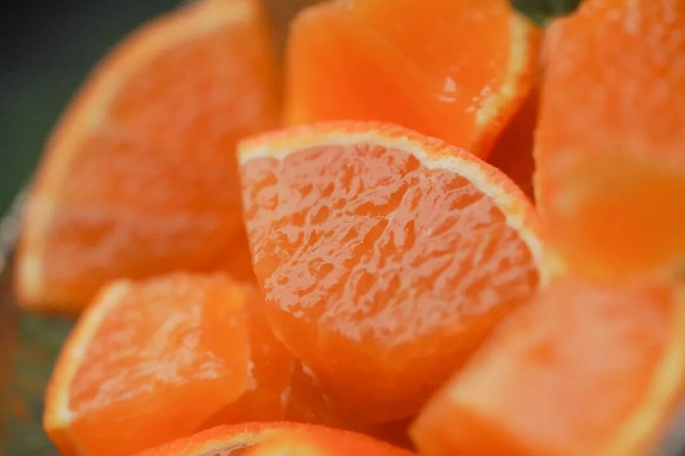

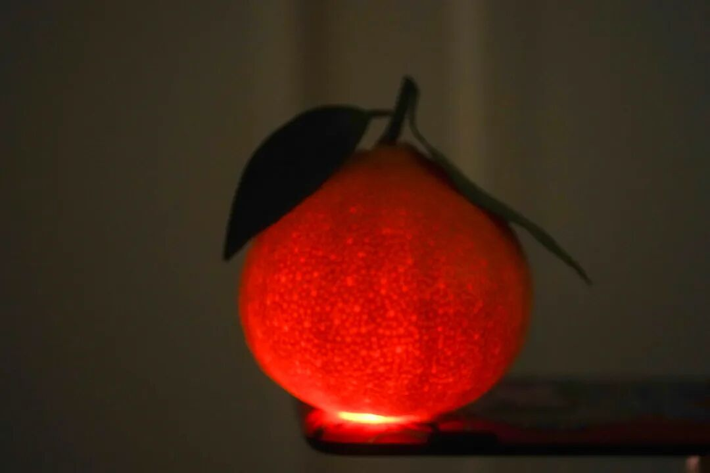

拿手机拍了张图，晶莹剔透能透光。

众所周知，

比起市面上买得到的大路货，

饱记一向喜欢卷精品小众果园！

果子更好，产量更少，

每一棵果树都能得到细心的照料！

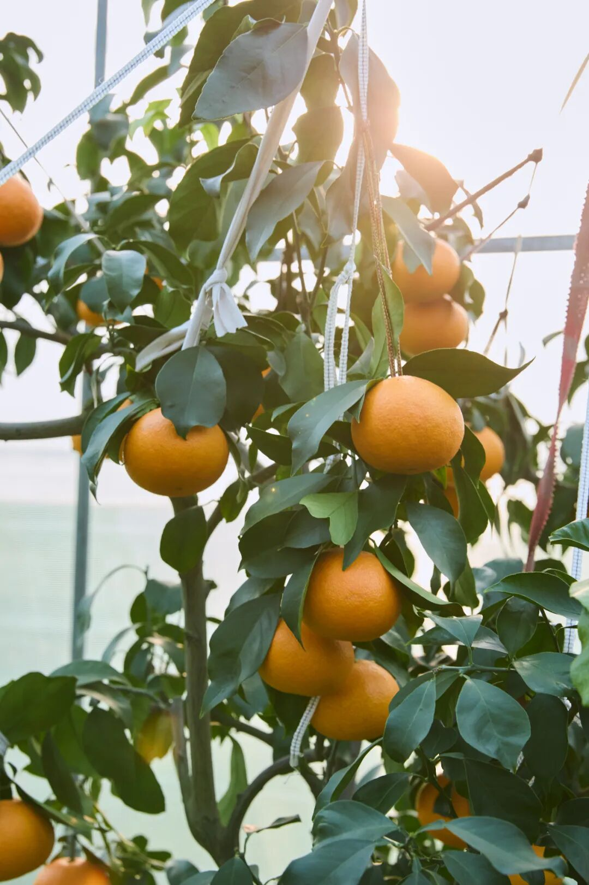

整个象山如今几乎家家户户都在种红美人。

几年前老板带着同事上山下乡，

挨家挨户拜访农户，

最后找到了一位六十多岁的老伯！

经验丰富，种了四十多年柑橘，

他的果园还是第一批象山农业局红美人联盟成员！

最关键还在于，

风味上总比别家的浓郁清口风味足！

不是那种傻里傻气的死甜，

甜中略带一丝酸味。

这一丝酸的存在，

反而是画龙点睛之笔。

稳稳打败所有对手。

这里插播一条老板的评价，

高甜的同时带酸，

所以非常鲜浓，不然就是齁甜，

这才是橘子届的王者，要给它尊严！

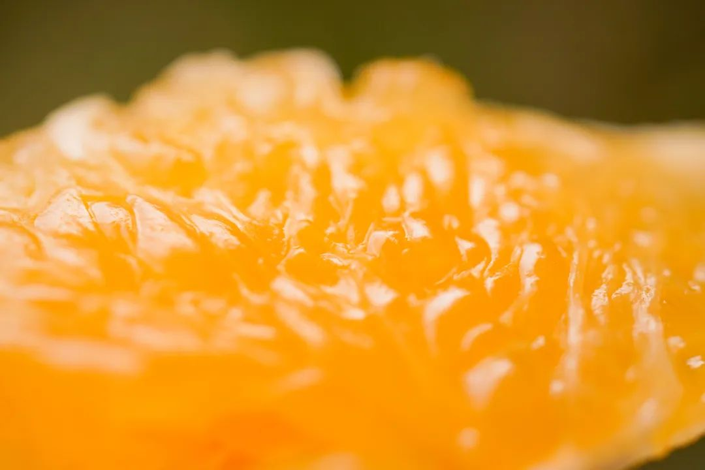

轻轻咬下一口，

体验一下什么叫一发入魂。

水分多到爆汁，

满满的汁水缓缓滑过口腔喉头～～～

爽～飞～

冬天暖气这么足，

就是要吃水份多的小可人们才能缓解干燥呀。

最后提醒一下大家，

这会儿正值红美人的最佳赏味期，

接下来的一个月左右就是成色最好的时候。

价格上，也是现在最划算。

双十二地板价 86 折！

红美人培育和种植都不容易，

贵的时候 60 多一斤！

咱们刚好趁此机会品品啊！

饱记·象山红美人柑橘购买方式如下

双十二地板价 86 折！！！

戳图购买👇

3.涌泉蜜桔
贴心如我薯角，
还给大家挖到一种宝藏风物，好吃，省心，方便！每天都能带点儿哄自己上班！且是米其林同款。正是这一枚皮薄无籽甜如蜜的饱记·涌泉蜜桔啊啊啊啊啊！

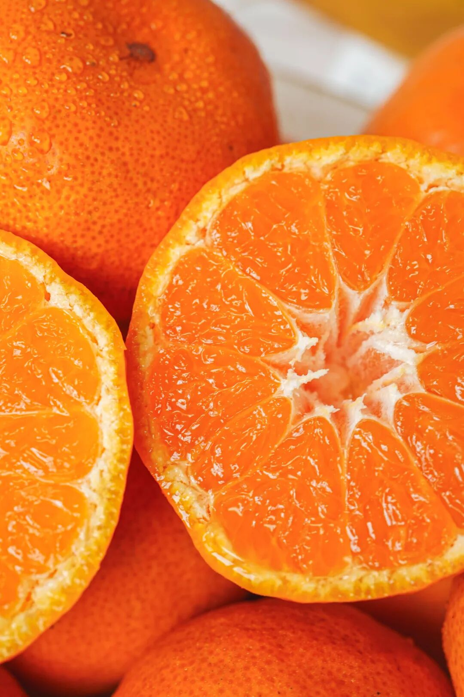

桔如其名！汁水如泉涌，入口抿一小下，就在唇齿间粒粒爆开，甜中带一丝丝俏皮的酸，
平衡得恰到好处！

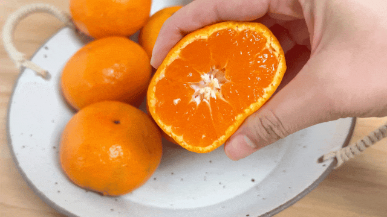

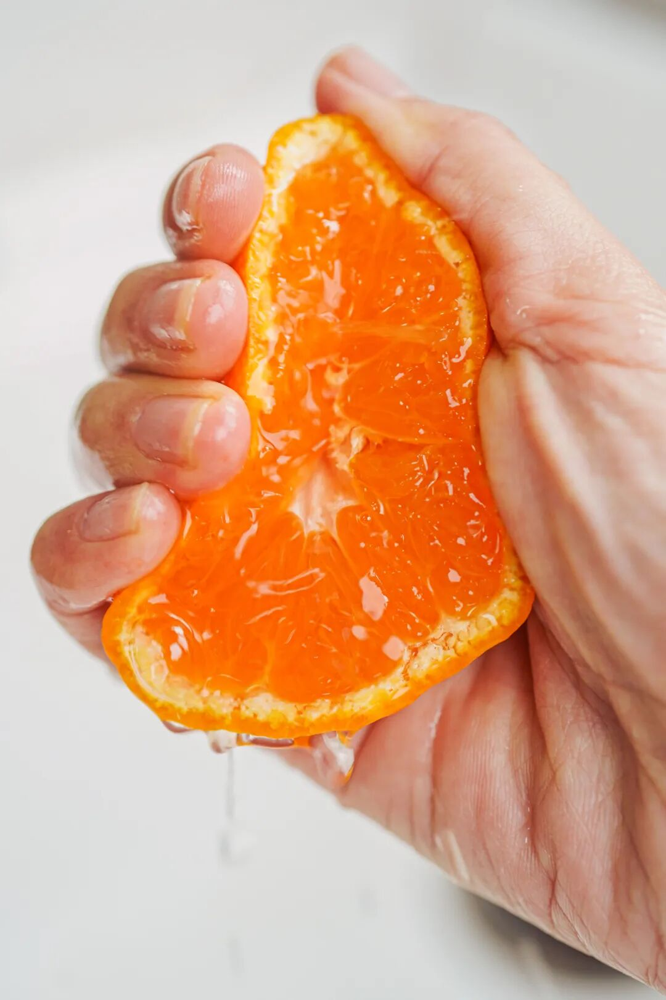

来自浙江台州临海涌泉，全国最会种蜜桔的地方（之一。仍是饱记标准，从核心产区里挑出精品小果园！只挑高山果园老树产的果子！保证市面上的比不了！树龄越长，桔子皮就会更薄，果肉化渣也更好！

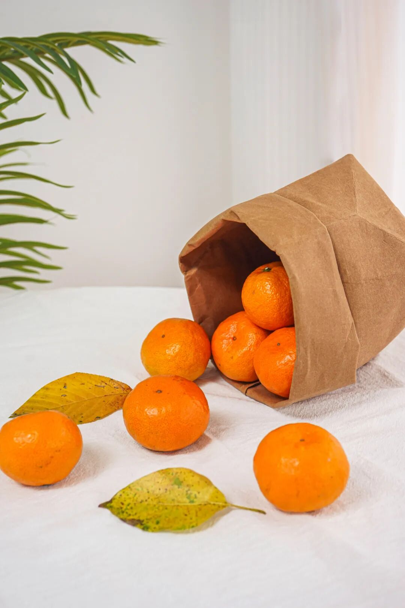

话说之前老板去新某记吃饭，就被餐前的涌泉蜜桔惊艳住。

但是，在美食届，

我们饱记也是有两把刷子的，

谁还不是个米其林餐厅供货商了？

（骄傲脸

生鲜水果这块，更是没认输过啊。。。。

这米其林的滋味，

本薯今年特地买了箱尝尝，

确实是皮薄肉厚入口化渣，

但这些我司蜜桔也能做到！

且糖度表现更优秀。。。

（新某记本薯测下来一箱平均糖度在 13.6，

（而我饱记一箱平均糖度 14.2！

最关键还是，

价格也帮大家打下来了啊！

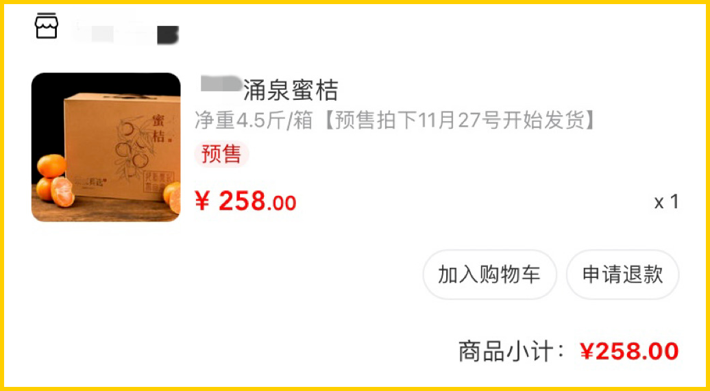

好吃你是好吃，贵你也是真贵啊。。。

且遵循老规矩，

果子都是树上自然熟，

每一颗蜜桔发出前都经过两道人工精筛，

确保你到手都是好果，

即使送人也显得咱体体面面的！

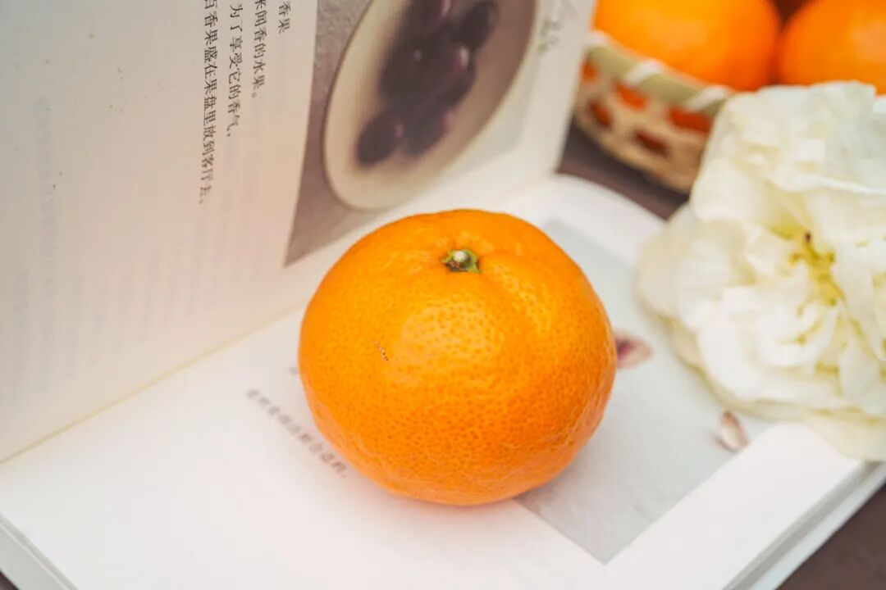

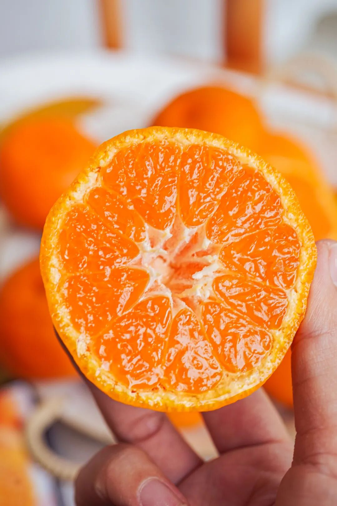

饱记·涌泉蜜桔购买方式如下

双十二地板价 86 折！！！

戳图购买👇

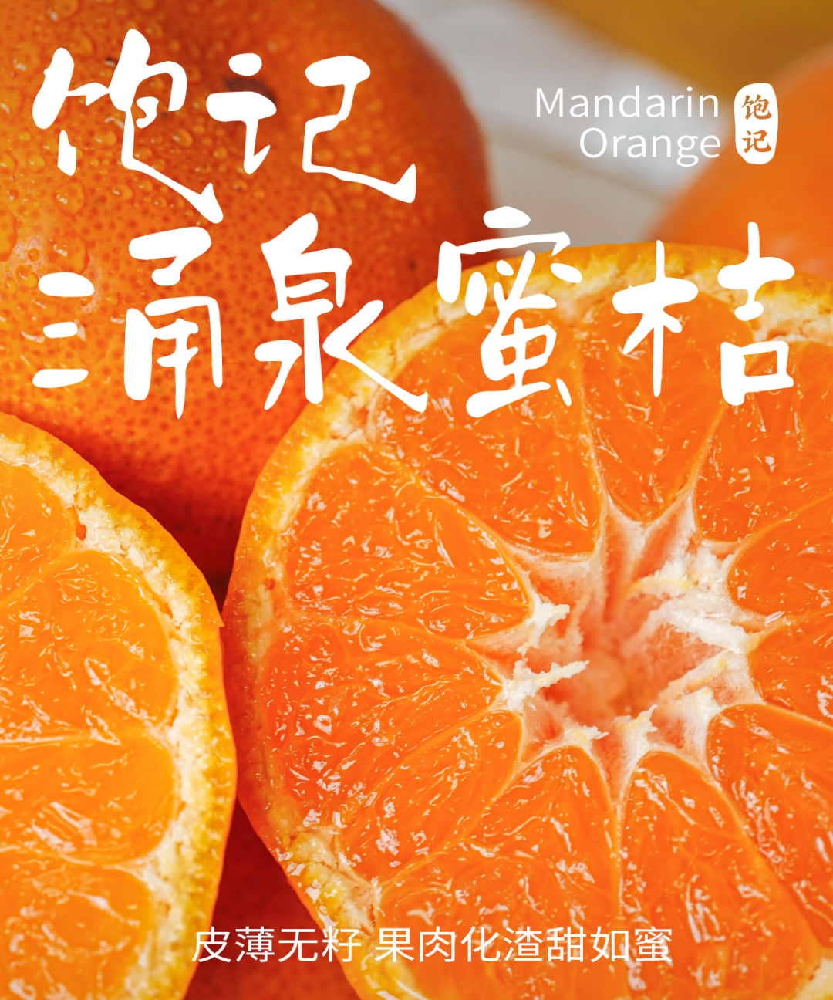

4.海南高甜火龙果家族
曾于我司风靡一时的两位「减肥圣果」！（没有科学依据🙏只是，呃，你懂的看似平平无奇，实则深藏不露！光看图：就这？
真正拿到手：怎么这么厉害！总之主打一个：不吃不知道，一吃吓一跳

（多重意义上的吓一跳

喏，先说这个稀奇货，长得像佛头似的的燕窝果，老家在南美的厄瓜多尔，近几年才开始在海南种植。

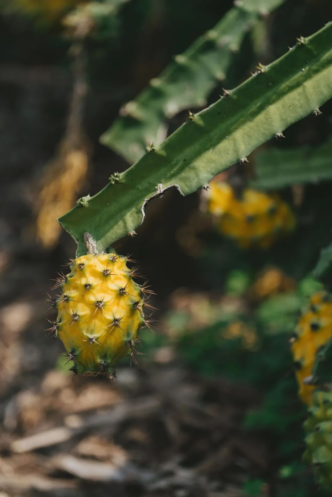

面苦心甜，
长得刺人，其实甜度高得吓人！！（你这为人处事很不讨喜呀我说～

虽然外表猎奇，但口感甚好，尝起来像滑嫩嫩的燕窝，入口有冰糖甜味～（本薯觉得有点像荔枝的香甜感比起常规的火龙果，更上一层楼。

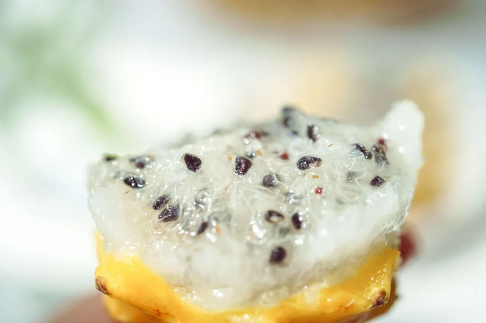

之所以没有大面子推广开来，单纯因为非常难种，损耗率极高！我饱记给大家找到的这家生态小果园，
产量也极其有限，卖完就没啦！

再到这个红艳艳的、高饱和的海南红心火龙果！一开始，本薯对老板的选择是不屑一顾的：啊？这我们家楼下也有啊？尝一口：嚯～也是没想到火龙果还能这么糯甜！！糖度居然也有 20 以上啊啊啊～（老板：呵呵

原来它是非常规商超进口货，
纯正海南树上熟！产自我司冲到海南实地考察，跑遍几个山头卷出来的小产地生态高山果园！为啥要强调这一点呢，因为你在超市常见的进口火龙果往往五分熟就摘了，经历长途运输，再上架喷水。

而我饱记的这颗海南红心火龙果，九分树熟鲜采发货。特点是叶薄皮皱，且是高山生态种植，（这是树熟独特的标志，不是不新鲜哈!入口水分好足！强烈建议大家买它一买，尝上一尝！仙品！

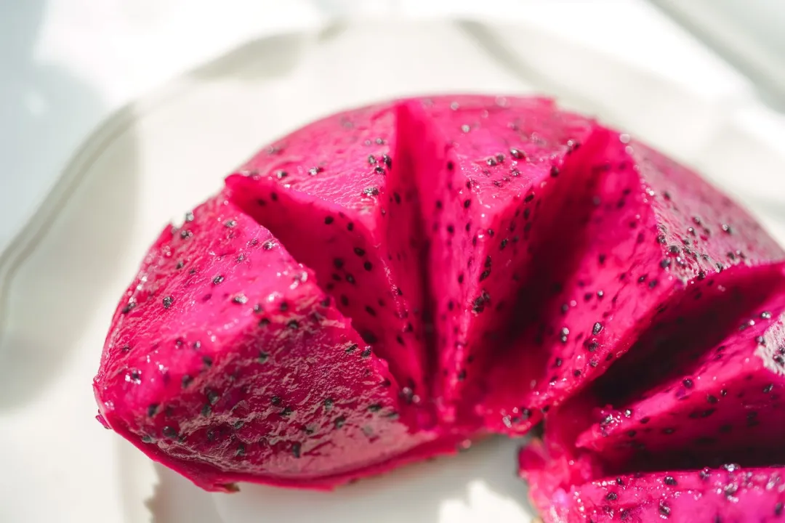

不过大家知道的，火龙果嘛，膳食纤维含量高得吓人。请看专业文献👇
火龙果是一种热带水果，含有一般水果少有的植物性白蛋白及花青素，丰富的维生素和水溶性膳食纤维,因此又被誉为长寿果。火龙果还是一种低能量、高纤维水果，其水溶性膳食纤维含量十分丰富，具有很好的减肥、降低胆固醇、润肠作用。高血脂患者及便秘的人可常食用。文献来源：《心血管病防治知识》 · 2010年第4期81-81,共1页
所以这俩的 CP 名就叫：打工人王炸组合hhhh,原因不多展开了！
你们自行想象！我看所有上班族以及久坐不动的开车族，以及家里有老人的！都应该买回去，调理一番！

饱记·高甜火龙果家族购买方式如下双十二地板价 86 折！！
膳食纤维小能手！打工人王炸组合！！！
高甜火龙果家族！饱记指定小果园，海南阳光里养出来的熟甜！
戳图下单购买👇

5.云南蜂蜜红苹果
嘎嘣脆的云南·瑞香红苹果。入口像在吃苹果味的蜂蜜！一股迷人的浓香和浓甜👇

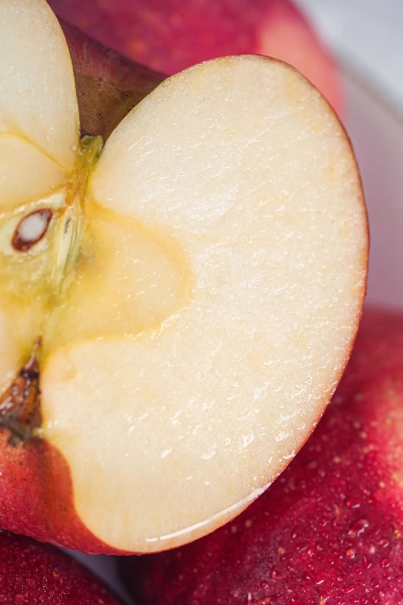

来头不小，

是西北农林科技大学团队用 20 年时间

培育出来的优质晚熟苹果品种。

拿“富士”苹果和“粉红佳人”苹果杂交而来。

只挑双方的优点长！

所以每一颗都遍体通红，

一口下去果肉在唇齿间崩开！

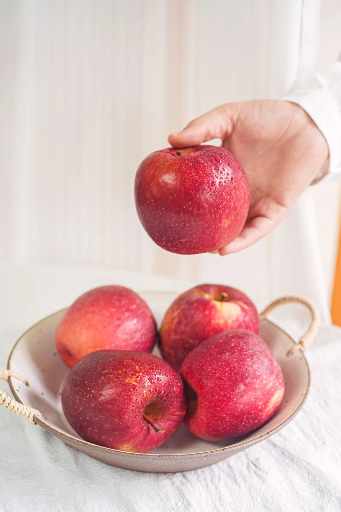

这苹果种在云南曲靖，
园区一半精养，一半放养。类似于那种只想你健康但不需要你努力的家长？

比如基地会自己配制农家肥，

给果树提供充足的营养，

每棵树都保持合理的种植间距，

全程机器化操作。

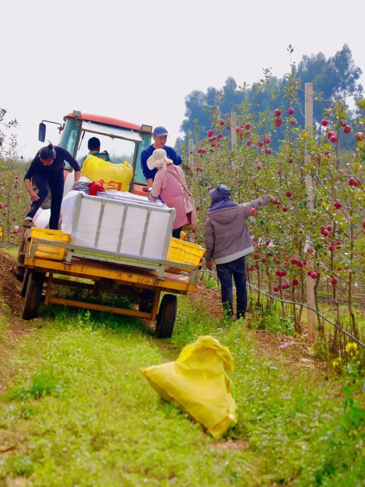

与此同时，

却又不催熟、不打蜡、不套袋，

让苹果在大自然里自在生长。

毕竟没什么狠活，

老人小孩才能放心吃啊！

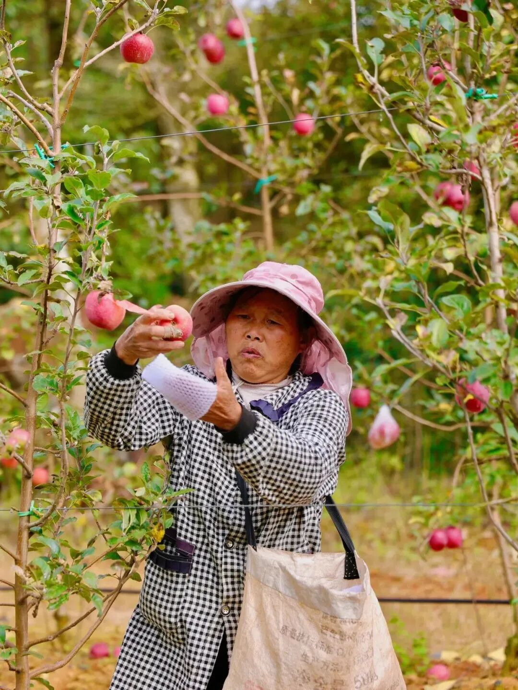

入口是那种温柔的脆感，

略微带一点粉度。

所以完全不磕牙！

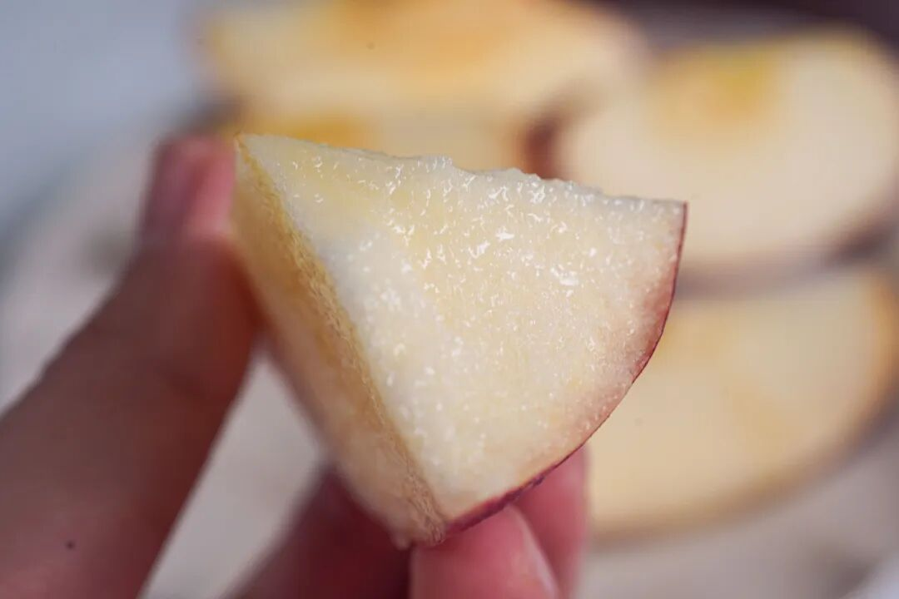

糖度能到 15 左右，

但回味又有清新的果香气，

甜而不腻。

还是饱记标准，发货前要人工精筛数遍，

淘汰掉次果，只留大果好果～

饱记·云南蜂蜜红苹果购买方式如下双十二地板价 86 折！！
戳图购买👇

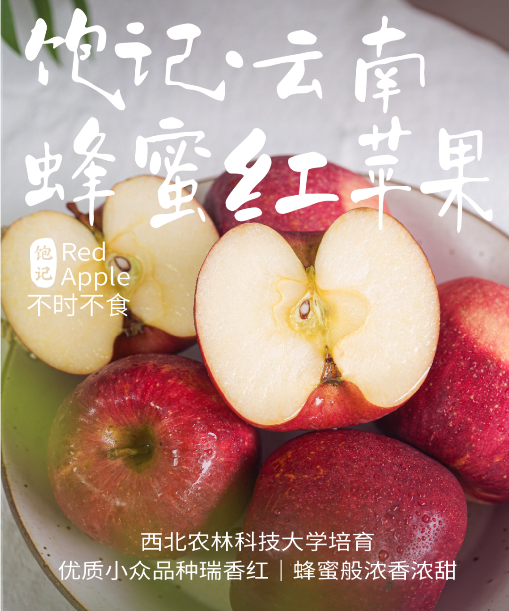

6.青森苹果

接下来这位嘉宾，哇～

那种清新脱俗，那种淡雅天成，

喏，

就是声名在外的青森苹果👇

颗颗圆润饱满，

散发着清新香气～

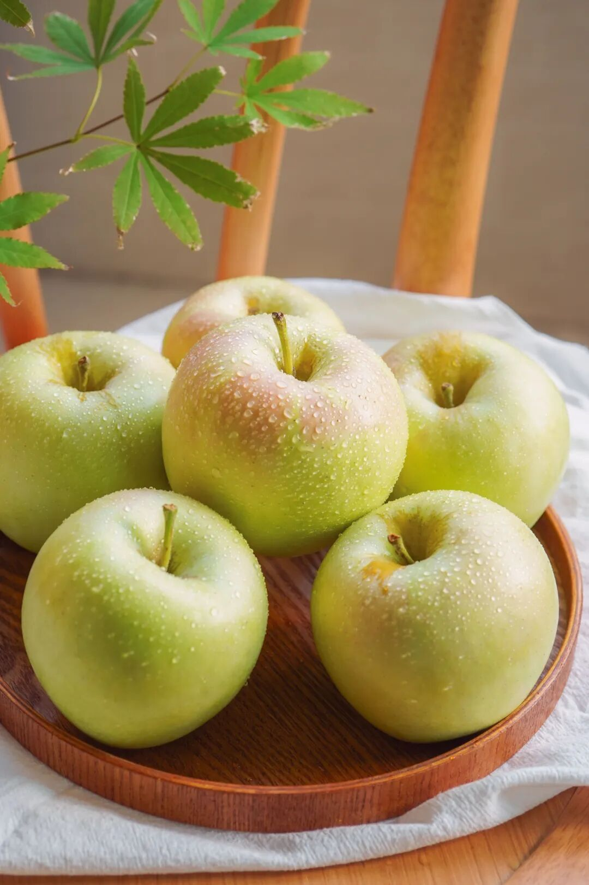

传说中「世界上最美味的苹果」之一！

源于日本青森县。

多亏了勤劳的山东人民，

成功将青森苹果引进种植！

风味不改，

但价格却实实在在打了下来

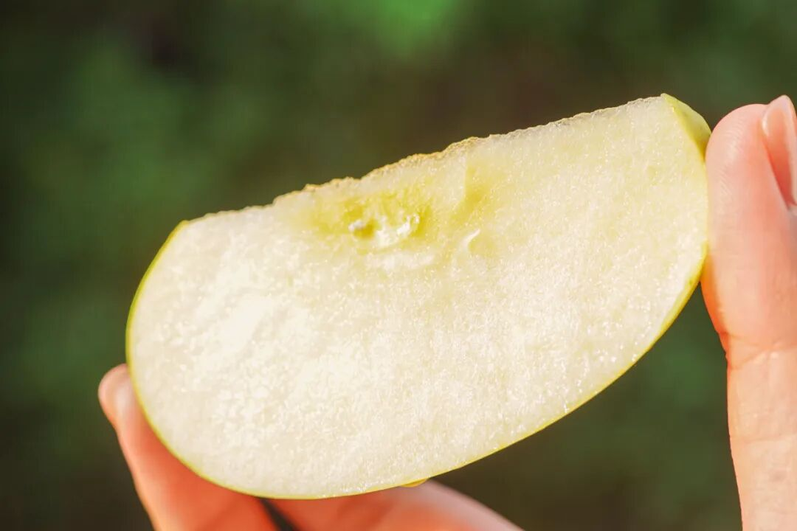

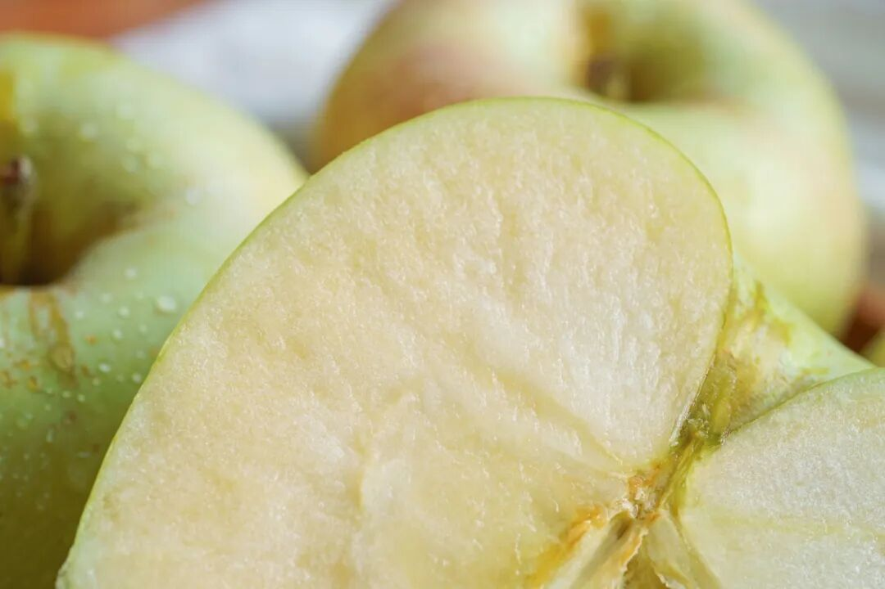

又水灵，又甘甜，

还像水蜜桃一般芬芳多汁，

一口咬下去汁水四溢～

不硬、不涩、不酸，

是那种松脆细腻的口感，

爽口且不费牙！

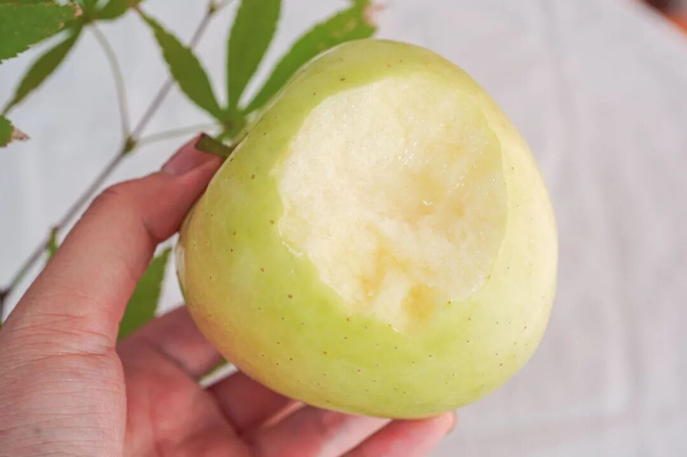

种植过程中不打蜡，

拒绝催熟剂、甜味剂，

老人小孩也放心吃！

还是老规矩，

给大家产地现摘现发，

当地经验丰富的阿姨们人工精挑，

新鲜看得见！

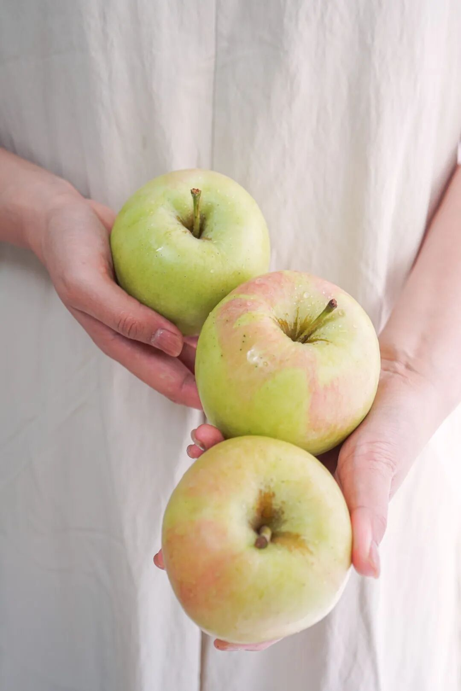

饱记·青森苹果

购买方式如下

双十二地板价 86 折！！

戳图下单购买👇或🍑🍑🍑搜索「艾格吃饱了」

7.秋月梨

还有这个六两一颗大胖梨，

也就是大名鼎鼎的

秋月梨，饱记做了几年了。

今年改了更卷的果园！

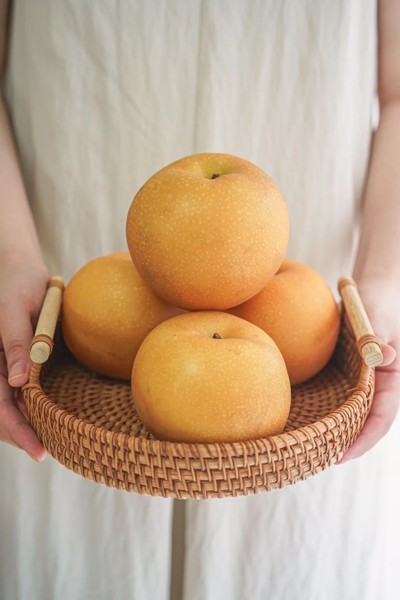

来自山东莱西，

又一个著名梨乡！

讲究自然环境+科学种植，

当地果农种植技术成熟，

全程都有合作社进行技术指导哦～

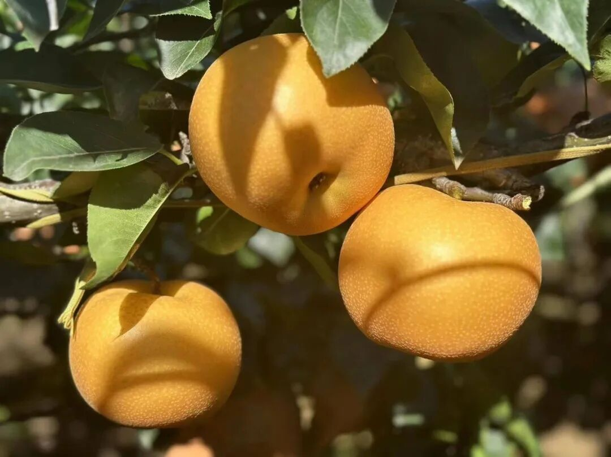

白白胖胖，

冰糖甜风味，

咬开都是一汪汪的甜汁儿，

随手抽一颗测测，

糖度 12 以上。

主要是脆嫩，

吃起来多汁，几乎无梨渣。

这个品质，

产地新鲜直发，

和水果店超市的随便比吧。。。

你看看多适合上班吃！

赶紧润润那骂老板的嗓子（？

饱记·秋月梨
购买方式如下双十二地板价 86 折！！
戳图买它！！👇

8.库尔勒香梨

最后是在大漠里，

长出来的库尔勒小香梨。

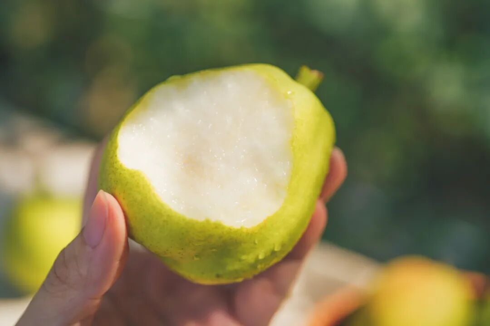

喝天山雪水长大，
四面环绕的是塔里木盆地、孔雀河，才形成这独有风味。（全国其他几十个产区都没法比肉质细嫩，汁水超充足所以当地人又称它为「落地碎」，

新鲜的嘞，杆子还是青的。
（当然果子是树上熟，完全成熟才采摘哦

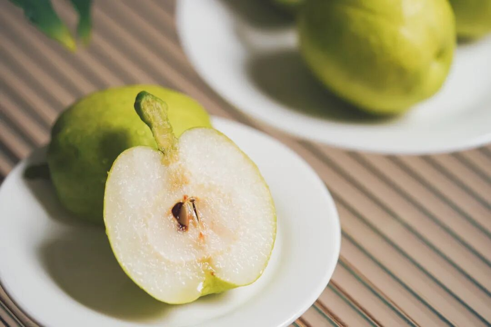

清甜、细腻，嫩得连皮也能吃！

饱记·新疆库尔勒香梨
购买方式如下双十二地板价 86 折！！
戳图买它！！👇

总之：

天🐱：满 300-40，小🍊序：直接全年地板价！现在买就是最划算！

关于天🐱满减如何凑，

本薯算了个

「红美人不要钱」购物车！

给大家打个样，

只要价格差不多都可以凑～

PS：这里说的不要钱，只是相对于原价来说，指的是天猫大促凑单满减折扣，真正拍下还是会显示支付金额的～
1. 「红美人不要钱」购物车
👇可用来作为冬日待客暖茶的桂花乌龙与我司打遍天下无敌手的山核桃，再加一份这个时令必吃的包邮区大闸蟹，搭配着买红美人等于白送！

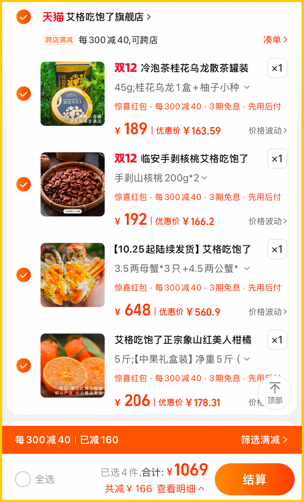

指路完毕！再说一次：直戳小🍊序购买或者去天🐱凑单都可以！今年最后一次薅老板羊毛！
别让她毫发无伤啊啊啊啊！！

题 外

还有还有！

其他值得一吃的时令风味看这里👇

不用凑单不用研究，

通通给到双十二全年地板价！

外面买不到的金山瓢鸡，

只剩一个规格！

这批卖完下次得等半年了！

坚持真材实料、天然肠衣的手工腊肠，
能做煲仔饭和火锅的玫瑰露酒腊肉&腊排骨

苏南蟹标杆美味：太湖流域大闸蟹

苏北蟹宝藏性价比之选：洪泽湖大闸蟹

有小时候番茄味的云南西红柿（快没了，

还有打遍天下无敌手的山核桃！我司卷中卷产品，
拿到外面去都能打得很！具体你们看商详，今年再薅老板最后一回！冲！

饱记·云南稀有品种瓢鸡

购买方式如下

双十二地板价 7 折！！

只剩它了！！！6 月龄母鸡净重 2 斤以上。
下单前请注意：此鸡蛋白质含量丰富，宰杀时已尽量放血，但少量余血开包时气味仍会比较大，请冲洗再食用！鸡皮不发粘，就绝非变质～～～

戳图下单购买👇

或🍑🍑🍑搜索「艾格吃饱了」

饱记·手工腊肠

购买方式如下👇

双十二限时全年地板价

戳图下单购买👇

或🍑🍑🍑搜索

「艾格吃饱了」

饱记·腊排骨

购买方式如下👇

双十二限时全年地板价

戳图下单购买👇

或🍑🍑🍑搜索

「艾格吃饱了」

饱记·洪泽湖大闸蟹

购买方式如下

双十二限时 86 折！！！

满足装洪泽湖大闸蟹：

3 两母蟹，4 两公蟹。

性价比之选！

劲爽装洪泽湖大闸蟹：

3.5 两母蟹，4.5 两公蟹。

饱记热销款。

尊享装洪泽湖大闸蟹：

4 两母蟹，5 两公蟹；

或 5 两母蟹，6 两公蟹。

实际超重，量极极极少，送礼佳品。

人工精挑，

上岸后静养一两日更鲜美，

每日限量 100 箱。

顺丰快递发货，新鲜看得见。

戳图下单购买👇或🍑🍑🍑搜索「艾格吃饱了」

饱记·太湖流域大闸蟹

购买方式如下

双十二限时 86 折！！！

三种搭配：

满足装，

3-3.4 两母蟹，4-4.4 两公蟹，

吃过解馋。

劲爽装，

3.5-3.9 两母蟹，4.5-4.9 两公蟹，

可以拍照发朋友圈争奇斗艳。

尊享装，

4-4.4 两母蟹，5-5.4 两公蟹，

顶格水准，适合送礼。

人工精挑，

上岸后静养一两日更鲜美，

每日限量 50 箱。

拼的就是手速。

顺丰快递发货，

新鲜看得见。

戳图下单购买👇或🍑🍑🍑搜索「艾格吃饱了」

饱记·云南西红柿购买方式如下

双十二限时 86 折！！！

戳图购买👇

饱记·临安山核桃

购买方式如下👇

双十二单罐 9 折！！！

双罐 86 折！！！

戳图买它👇

或到🍑🍑🍑

搜索「艾格吃饱了」

本文的研究员

薯角多吃点，好过冬

用好吃的方式吃一生

祖国各地好风物

文章转载请加微信「baojiclub」

