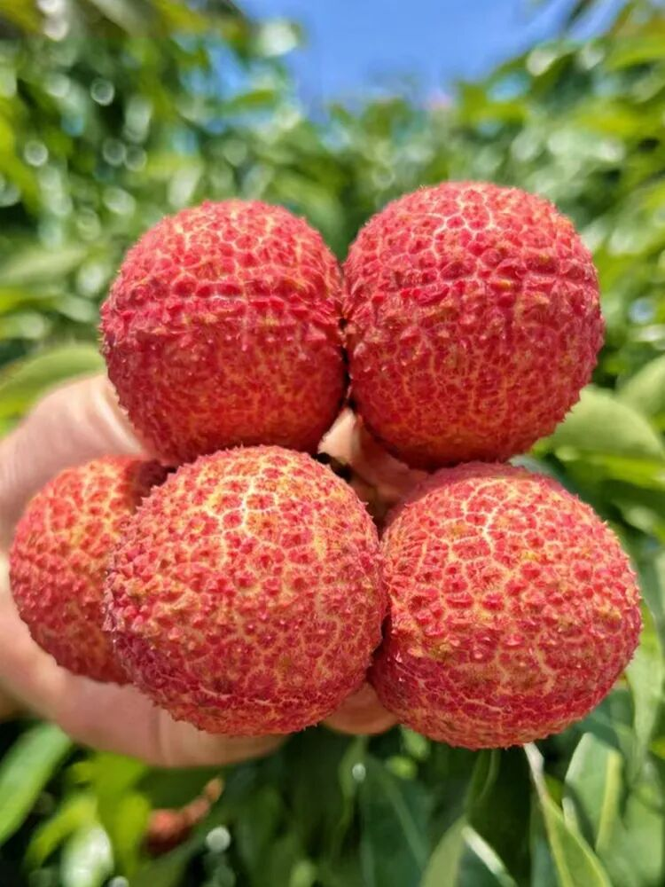
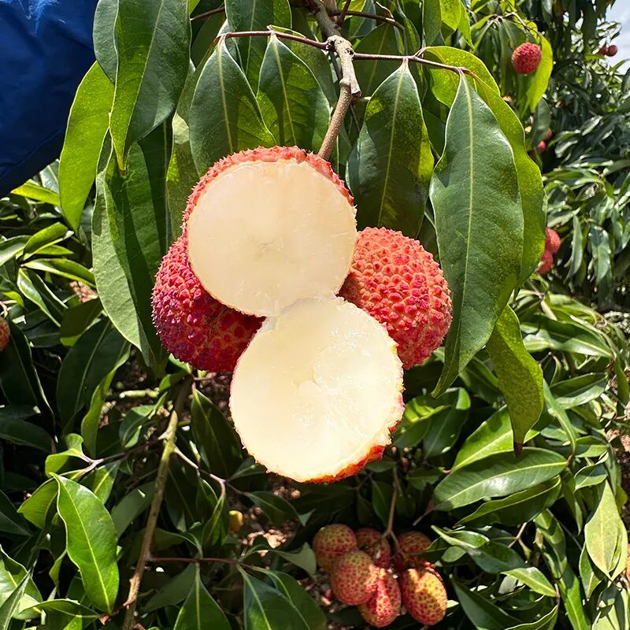
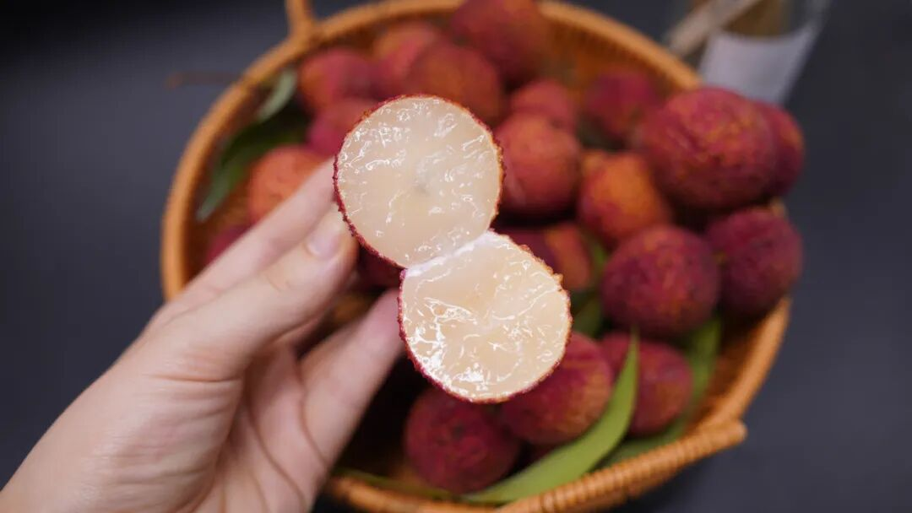
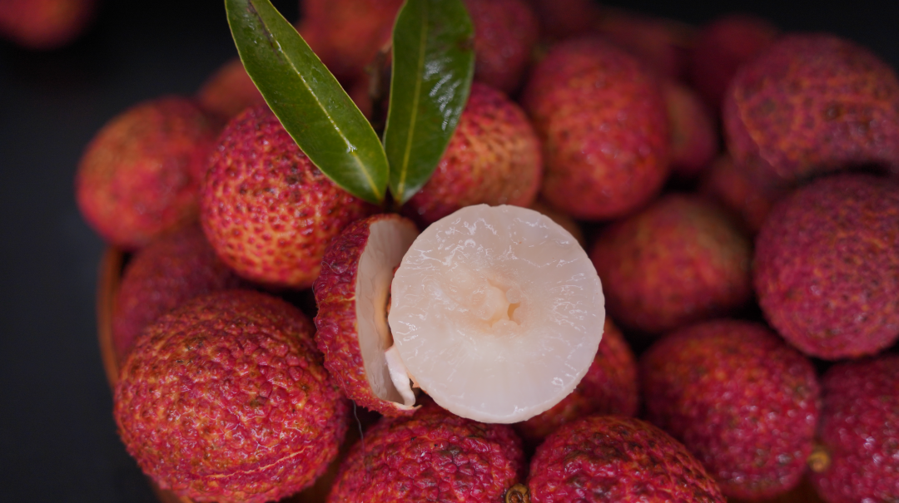
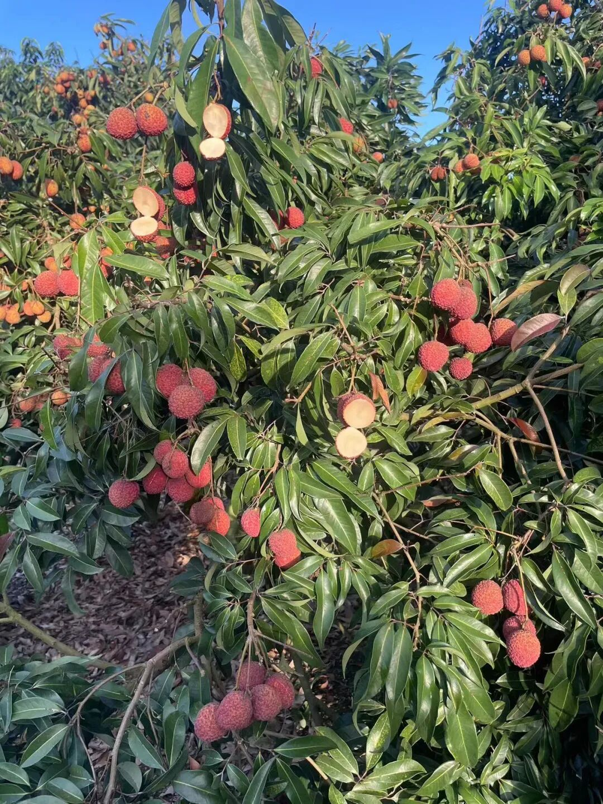
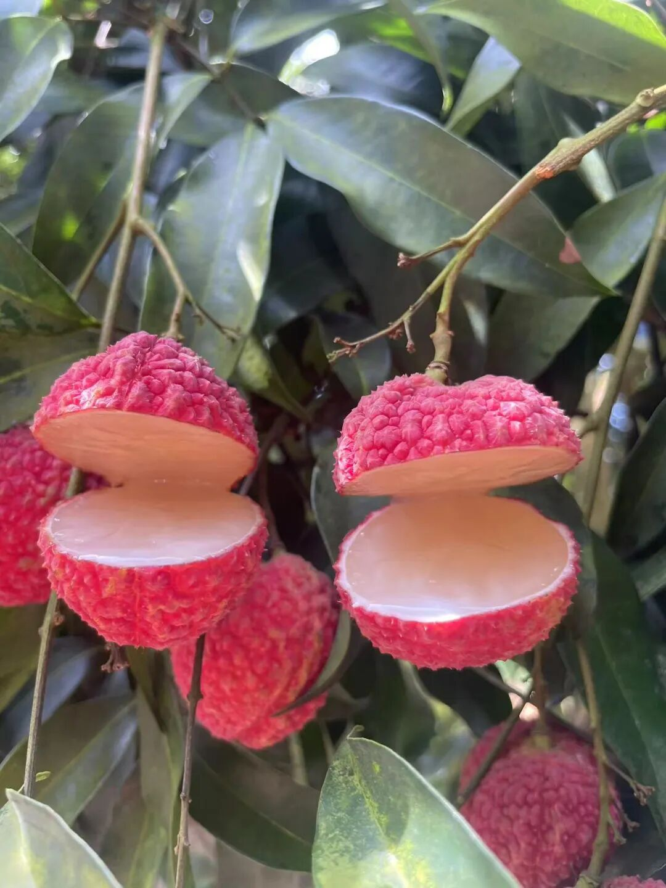
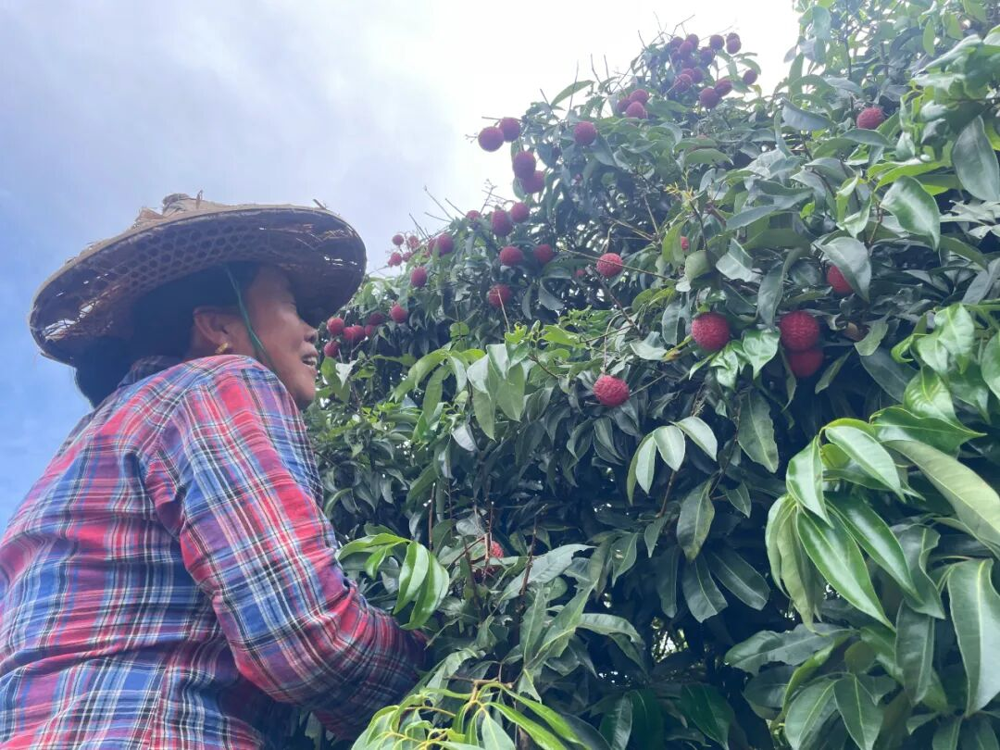
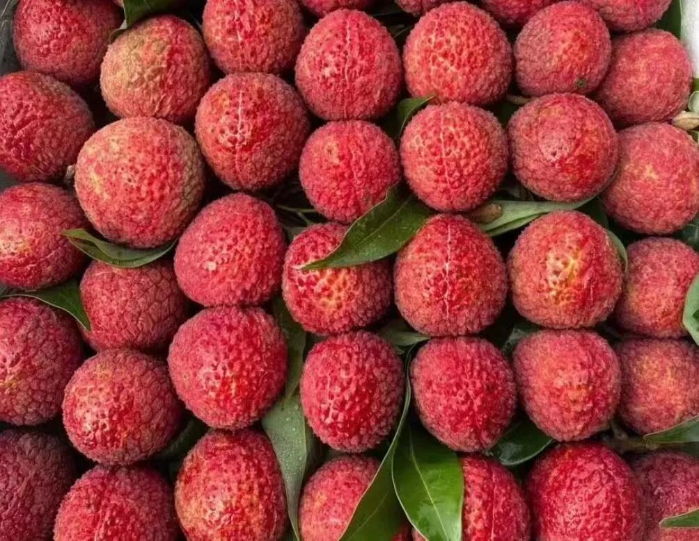
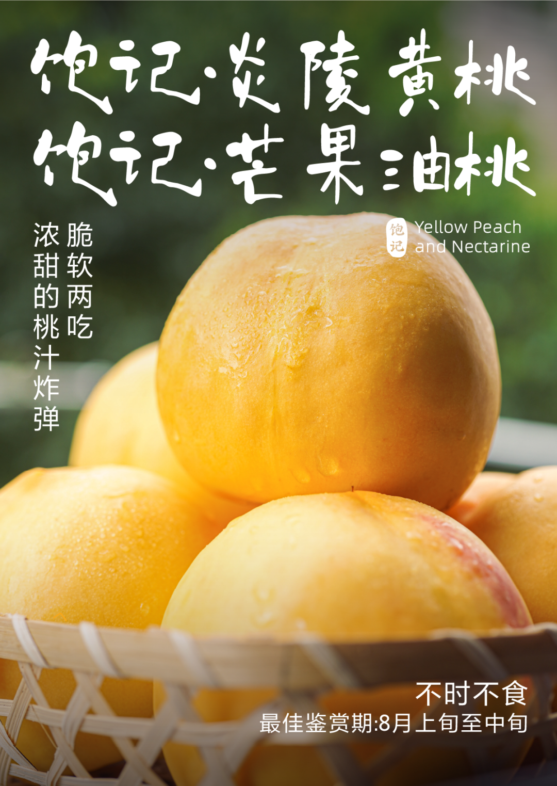

# 无核荔枝最后 1 天，增城荔枝最后 2 天，吃完明年见！

- 原文链接: https://mp.weixin.qq.com/s?__biz=MjM5NTYxODQyMA==&mid=2653457270&idx=2&sn=a74b8b9aeba075be6dd39f5fe5b8cf31&chksm=bc348014002440cf502c29e9a74dda7072c78d9f3dacb728155be0893175d6a36f5144bfce5b&scene=27#wechat_redirect
- 浏览量: N/A
- 点赞数: N/A
- 评论数: N/A
- 转发数: N/A

## 正文

报恩水果来也

一个尽情安利自我的公众号

以下是没事干研究院的风物研究报告请放心食用

如题！

今年荔枝最后一舞！

无核荔枝最后 1 天，

增城荔枝中的仙进奉、糯米糍，

也仅剩 2 天左右！

接下来，

表演一个我抄我自己，

买过的可以不用看，

直接拉到文末下单！！

这颗大如乒乓球的

——饱记·从化无核荔枝！

接班今年贵得让人破防的增城荔枝，

（就是它们👉荔枝两种拼法，今年最后几天

剥开满是水灵灵果肉，

一口咬下去，啧啧，

会懂得什么叫肉若凝脂～

但必须说一下，

无核荔枝并非完全无核，

只是它们的核小且软，

可以直接吞咽或咬碎。

全国有许多产区，

产品同事到处跑了跑，

最后还是选到了广东从化，

种植历史悠久的著名荔乡，

气候温和，黄土壤居多，

尤其适合荔枝生长～

甜，高甜，

糖度能达 17-18 左右，

入口细嫩无渣，汁水充盈，

冰一冰就是天然荔枝果冻！

还是饱记标准，

每一颗都是树上熟，

只让有经验的农户采摘，

这样摘下来的果子，

滋味更饱满。

每一颗都色泽红润，

品相绝佳，

用最近时兴的话来说：

送出去也显得咱大大方方儿的！

（此处请代入东北口音

不过呢，

从化临近增城，

今年同样受天气影响，

四五月份冰雹、暴雨接连落下，

直接导致荔枝大幅减产，

所以。。。还是巨贵！！！！

（我不吃了我宁愿馋死🙏

如果只是秉着来都来了的精神，

还是可以小尝一下！

但如果期待它有什么绝美风味，

本薯的意见供你参考：

仙进奉、糯米糍>从化无核荔枝王>海南早春无核荔枝

增城荔枝如今只余仙进奉、糯米糍，

贴心地罗列了许多拼法，

确保大家能把想吃的都吃上！

希望明年再见时我们恢复初见模样，

便宜点儿，好吗？

饱记·从化无核荔枝最后 1 天！！！购买方式如下
来自广东从化，地处北回归线，气候温和，黄土壤居多，更适宜荔枝生长～

并蒂双生果核，自然退化，

核小且软，

可吞咽或咬碎，

剥开皆是水灵灵果肉。

凌晨采摘，放冷藏预冷，

当天直接从果园冷链车运输到机场，

减少荔枝脱温时间，

为的就是新鲜～

五种规格：双拼：无核荔枝 1.5 斤+糯米糍 1.5 斤

无核荔枝 1.5 斤+仙进奉 1.5 斤
糯米糍 1.5 斤+仙进奉 1.5 斤
三拼：无核荔枝 1 斤+糯米糍 1 斤+仙进奉 1 斤单品种：无核荔枝 3 斤装

下单后 5 天内发～

戳图买它👇

饱记·增城荔枝仙进奉+糯米糍！！！
最后 2 天左右！！购买方式如下
一骑红尘妃子笑，说的就是增城！自古以来的岭南荔枝名产地～
🍚想一颗就吃爽的选「糯米糍」；💦喜欢特别嫩多汁的选「仙进奉」；最后的数天，
吃完一起许愿明年好天气！别那么贵了你！！！
三种规格：双拼：
糯米糍 1.5 斤+仙进奉 1.5 斤
单品种：糯米糍 3 斤装
仙进奉 3 斤装

下单后 5 天内发～

戳图即可购买👇

题 外

旧果不去，新果不来！

更有性价比的

新疆三色葡萄，

依次为：玻璃翠、无核紫、无核白，

每一颗都嘎嘣脆还爆汁！

限时早鸟 86 折！！

还有脆软两吃的两种桃，

声名在外的炎陵黄桃，有热带芒果香气的芒果油桃，

限时 9 折！！

抓紧时间吃！！

饱记·新疆三色葡萄

购买方式如下

限时早鸟 86 折！！！

来自新疆吐鲁番的甜，

三种葡萄，三重风味，一次拼配。

玻璃翠·无核紫·无核白。

不吐皮不吐籽，

嘎嘣脆还爆汁！

甜度从低到高，

自酸甜过渡到纯甜，

完整体验不同酸甜配比惊喜。

天🐱活动

自今晚 8 点至 11 日 23：59，

全店跨店满 300 减 40，

相当于 86 折，

也可于天🐱下单！！！

戳图下单购买👇

或到🍑🍑🍑

搜索「艾格吃饱了

饱记·炎陵黄桃

饱记·芒果油桃

购买方式如下

限时 9 折！！！

脆软两吃！

浓甜的桃汁炸弹！

果期短暂，产量少，

一年仅有 20 天左右成熟期。

还是饱记标准，

只选树上熟，

果园现摘现发。

收货后喜欢脆桃直接吃，

偏爱软桃亦可

常温放置 1-2 天再食用。

戳图下单购买👇

本文的研究员

薯角吃荔枝不吐荔枝核儿

用好吃的方式吃一生

祖国各地好风物

文章转载请加微信「baojiclub」

