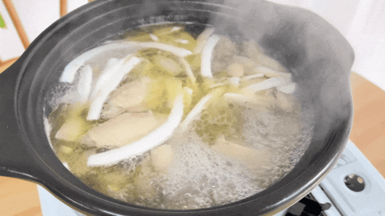
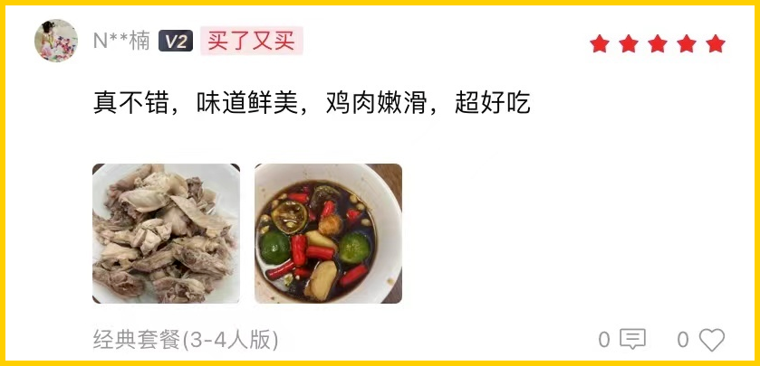
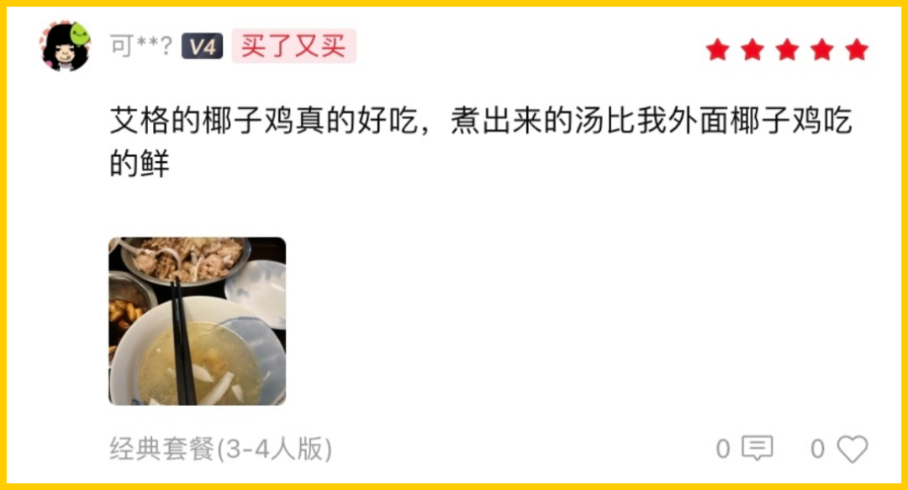
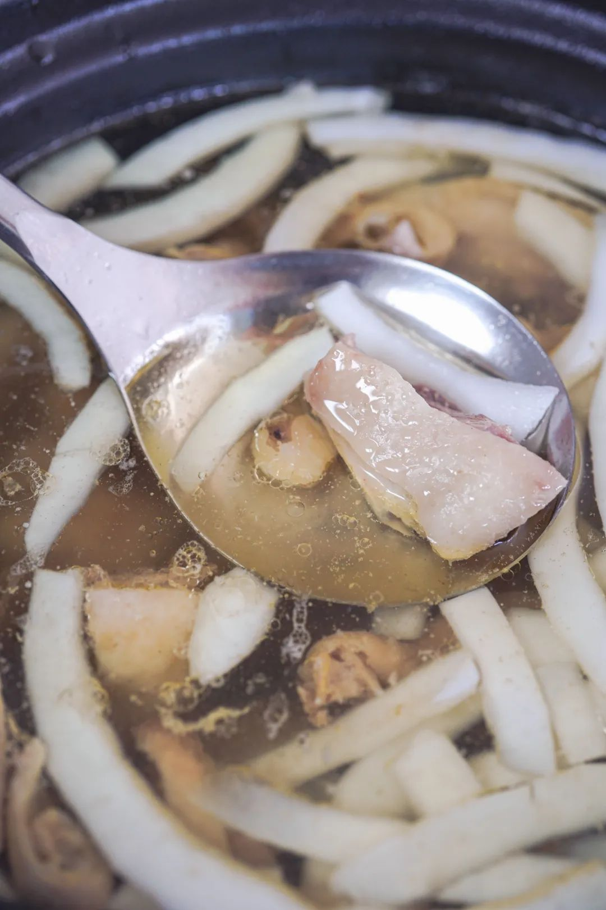
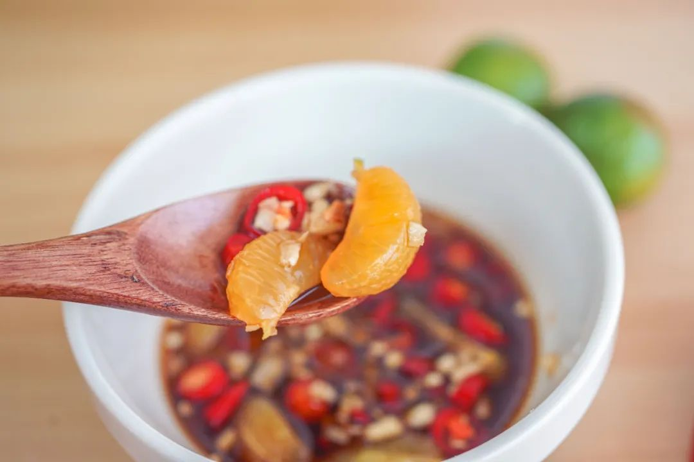
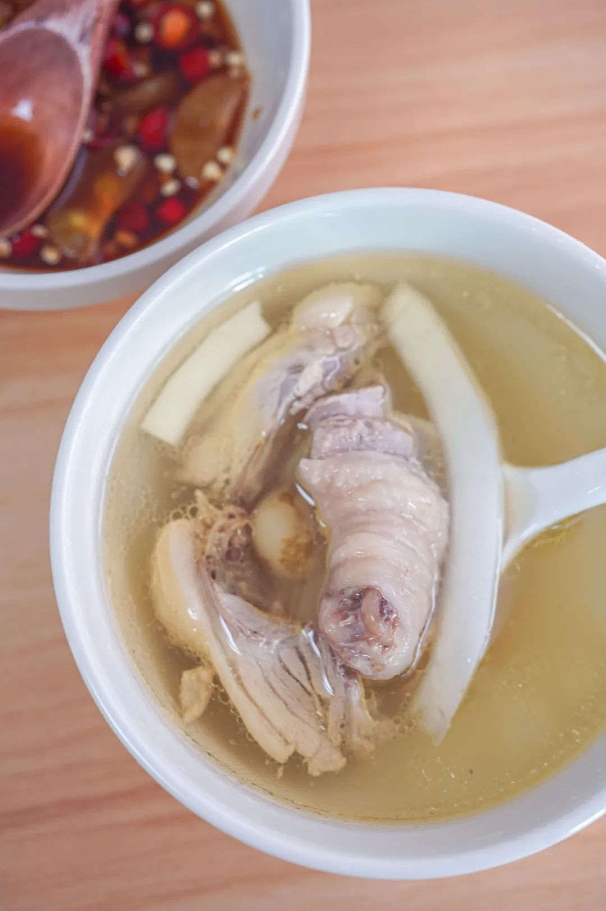
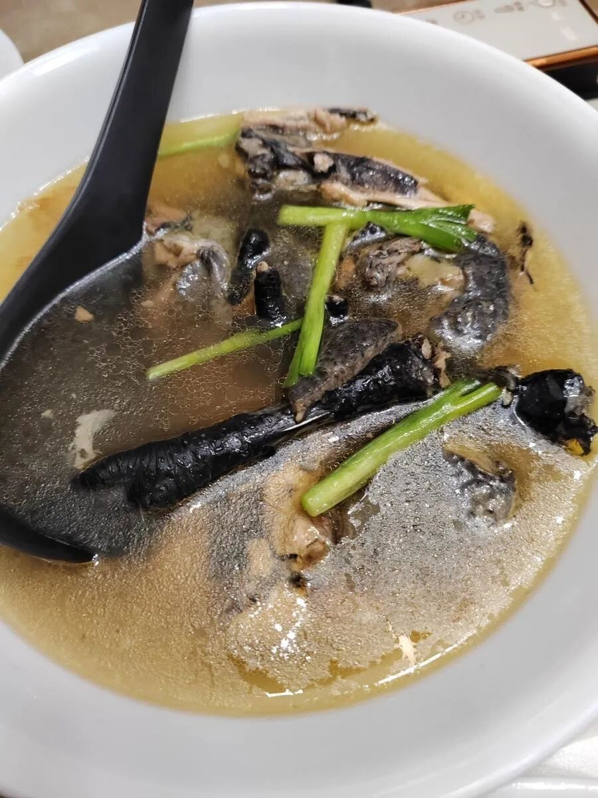
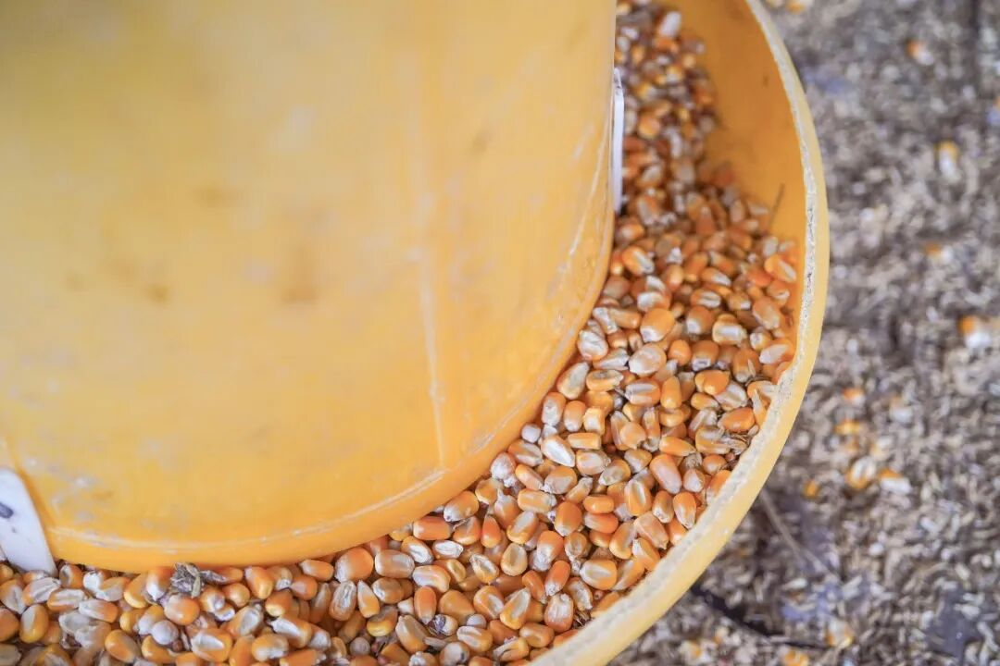
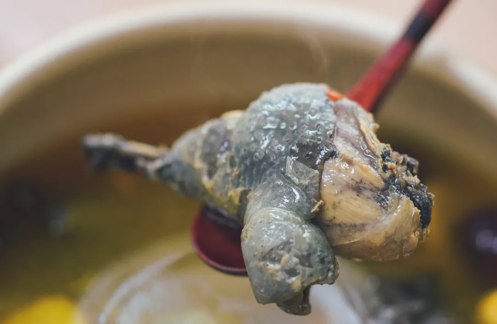

# 无限回购，但一个月只能吃上一次。。。

- 原文链接: https://mp.weixin.qq.com/s?__biz=MjM5NTYxODQyMA==&mid=2653469599&idx=1&sn=db600141bcbf2ace66b3876b7862dd5f&chksm=bc3223cb239313b022b7ff037923ac39fb988680d5bda41f92277cd2e49f8169b2138eb1d199&scene=27#wechat_redirect
- 浏览量: N/A
- 点赞数: N/A
- 评论数: N/A
- 转发数: N/A

## 正文

好久不见

一个尽情安利自我的公众号

以下是没事干研究院的风物研究报告请放心食用
嚯！周一给大家来点盼头！我司被无限回购的好东西，它它它它回来了

数量有限，一个月仅开放一次！周末窝在家里就吃这个嘿嘿～

没错！就是这一锅——清甜得能连喝三五碗的饱记·海南椰子鸡！

此鸡作为我司不定期返场嘉宾，后台常有人问起，请看真情实感的好评👇

自己在家煮，比外面餐厅还要好吃👇

椰子鸡作为一种「天然去雕饰」的美食，要好吃无非看这三样：鸡新鲜吗？
椰子水清甜吗？调料正宗吗？

作为此鸡的铁粉，本薯曾将它与某马椰子鸡进行过一番比对！先说结论：赢得很全面！客官请往下看👇

先说某马，本薯特意下单了一份双人套餐，139 元，到手发现鸡只有 450g

倒是也吃得饱！只是感觉钱都花在了配菜上。（白菜、响铃卷、芋头、玉米什么的

最重要的是这鸡！
虽然也写的文昌鸡，但它是冰冻的。。。换句话说：不知道啥时候杀的，没那么新鲜。

这样的鸡有什么问题呢？就是煮出来像这样👇容易起沫，不够清亮，入口直接吃容易起腥气，
需要蘸调料盖一下。

而我饱记的鸡汤，
长这样嘿嘿👇泛着一层漂亮的油花～

毕竟这鸡，是产品同事在一个爱吃鸡的文昌大叔指导下，找到的本土正宗文昌鸡！

且给大家保证，

每一只都是活鸡现杀！

再送入 -38 度以下的冷库急速冷冻，

冻实后按顺序顺丰空运发出。

到手时还新鲜得不得了

文昌大叔扎根当地数十年，对小岛的鸡了如指掌，给产品同事推荐的这群，
外面的大路货根本比不了！这鸡生活在文昌的田野林间，

先是在外头散养上 100 天，

再关到笼子里养 20 天，

放养的时候增肌，

笼养的时候增肥。

（难道这就是传说中的脂包肌？

煮完后皮薄、肉嫩，

吃起来弹牙爽滑，有鲜美鸡味的同时没有腥气。直接空口吃，
也有淡香回甘的清甜味～

好的，

接下来到椰子水！

某马给到两个新鲜的椰青，

确实也是清甜的，

就是略重，且自己刮椰肉比较麻烦。

我司为了长途运输，

配的 100% 纯椰子水，

过滤好分装，直接冷冻保存，

开盖后很香很香很香～

白嫩嫩的椰子肉，给大家剥好了，在风味不减的同时，尽可能方便快捷

最后一步，调一个灵魂蘸料！某马的调料包长这样👇
看着很方便，但这一步其实省不得。。。尤其金桔和沙姜，切开后长时间放置，风味就有所减损！没有那股子扑面而来的清新劲儿～

所以我们给到大家的是需要自己切一下但超新鲜的版本👇

再给大家推荐一个地道调法！青金桔不切开挤汁，
而是剥开后整瓣丢进去！这样做妙在何处呢？就是减少了金桔直接的呛，又保留了果实带来的清新感～（谁发明的？快出来受本薯一拜！

配的酱油，同样大有来头！独家配方的减盐版本，
里面还混了沙姜汁哦～外面根本买不到！成本高，但更健康，且吃多了也不会有口渴感，一瓶体贴细心的好酱油！

好了，最后展示一下我饱记·海南椰子鸡
完整全家福👇

看！啥都给你备好了！

厨艺方面，0 难度！

准备好一口锅，四步就能完成。1.所有食材解冻沥干备用；2.倒椰子水，倒椰肉、马蹄煮开；3.倒鸡肉，煮 5-7 分钟即可食用啦～
4.调一个海南传统风味蘸料！

热腾腾、暖乎乎，清甜得能连喝三五碗～

还能吃到脆脆糯糯的珍珠马蹄，每一颗都清甜有滋味～

老规矩！为了保证新鲜，我司跟鸡场约定，给大家新鲜杀鸡发货！所以现在还是预售！
限时开放 5 天闪购！下一批预计 4 月 19 号能发，快，加入这个文昌吃鸡小队！

饱记·海南椰子鸡

限时早鸟 86 折！！！

限时闪购 5 天！

预计 4.19 发货

戳图买它👇

想补补身体的，就挑这只

让全公司好吃到哭的一年以上老母鸡！

只剩最后几十只！！

我们给大家搞到了足足养了一年的真·老母鸡，买了和春笋随便炖一炖，鲜到掉眉毛👇

不需要任何厨艺，就拿拿电饭锅炖，出来汤色就漂亮得不得了👇

图片来自后台用户评论返图

它们五六个月才能长成一批，

所以每次都数量有限。

划一下重点：这一批分为两个规格：1 年老母鸡净重 2.3 斤以上。1 年老公鸡净重 3.4 斤以上。

此鸡是非常小众稀有的品种。本在云南逍遥，2020 年成了上海援滇对口协作的产物！全金山上下是金尊玉贵地养着：

比如为了保留它的野性和肉质，金山区直接在养殖区域内模拟了云南林地地貌，让它能撒欢，打架，睡觉。还要搭配玉米、豌豆、高粱这种天然粗粮和青绿蔬菜去喂。最终，把它养得比在云南老家还好吃！

所以这鸡，吃起来一点腥味都没有！油脂和胶原蛋白含量都非常丰富。

非我薯角自夸，看看此前后台的真实评价👇公鸡、母鸡都有！

之前给家里人寄了两只，

他们直接搬出了花雕酒来做，说这样才不浪费。。。

总之，老母鸡油多脂肪厚，超滋补！老公鸡肉更有韧劲，比普通公鸡含有更多蛋白质，炖汤都鲜得很！大家按自身需求来选就好。趁现在限时 7 折！请吧！

饱记·云南稀有品种瓢鸡

限时吃鸡 7 折！！！

戳图下单购买👇

题 外

朋友们！！！

我司一些卷里卷气的好东西，现有一批临期清仓 6 折，自家吃吃完全不影响，机会难得大家速冲！此外一些时令好风味，也一起吃起来！再不吃就没了的临安天目山雷笋，米其林餐厅师傅第三年回购，不焯水就鲜甜！现在有限时 9 折！

刚上的饱记·舟山野生海鲜盲盒！

舟山码头鲜捕现发，都是冰鲜发货！

当地人都买不到的品质，

来自湛江的红膏青蟹。不仅有红膏，而且满到蟹壳角角落落。

其他的东海野生海鲜，

肥美银鲳和红膏梭子蟹，

都是高级餐厅水平！

限时吃海鲜 9 折！

春季茶中硬通货西湖龙井，今年照旧是「梅家坞」和「狮峰」两款，一款性价比高自家喝，一款上好龙井送人包体面，

也是限时喝春茶 9 折！

还有些只有最近这一阵可吃的水果👇

甜蜜嘎嘣脆的花香小弹珠蓝莓，

无渣不麻嘴的海南金钻凤梨，

连盐水都不用泡。

难得回归的泰国超甜多汁金柚，

卷中卷红玉芒果，

来自湖北的超甜晚熟红橙，

娇艳可人的雷州木瓜，

来自精品小果园的云南沃柑，

好吃不怕胖的广西芭乐，

现在也有限时 9 折！

饱记·6 折临期清仓专区购买方式如下介意效期慎拍哦！！
戳图下单购买👇

饱记·2025 临安天目山雷笋

降价了！！！

限时尾声 9 折！！！

戳图购买👇

饱记·舟山野生海鲜盲盒购买方式如下限时吃海鲜 9 折！！！
戳图下单购买👇

饱记·湛江红膏青蟹购买方式如下限时吃海鲜 9 折！！！
戳图下单购买👇

饱记·东海冰鲜鲳鱼购买方式如下限时 9 折！！！
戳图下单购买👇

饱记·东海春季红膏梭子蟹购买方式如下限时 9 折！！！
戳图下单购买👇

饱记·梅家坞西湖龙井

限时喝茶 9 折！！！

戳图下单购买👇

饱记·狮峰头采明前龙井购买方式如下👇限时喝茶 9 折！！！
戳图下单购买👇

饱记·花香脆甜蓝莓

购买方式如下

限时吃水果 9 折！！

戳图购买👇

饱记·海南金钻凤梨

购买方式如下

限时吃水果 9 折！！

戳图购买👇

饱记·多汁泰国金柚

购买方式如下

限时吃水果 9 折！！

戳图购买👇

饱记·海南红玉芒果购买方式如下限时吃水果 9 折！！！
戳图购买👇

饱记·晚熟超甜红橙购买方式如下限时吃水果 9 折！！！
戳图购买👇

饱记·湛江雷州木瓜

购买方式如下

限时吃水果 9 折！！

戳图购买👇

饱记·云南晚熟沃柑购买方式如下限时吃水果 9 折！！！
戳图购买👇

饱记·广西芭乐

双拼&奶油芭乐

限时吃水果 9 折！！

戳图购买👇

本文的研究员

薯角我想我知道春天的味道

用好吃的方式吃一生

祖国各地好风物

文章转载请加微信「baojiclub」

