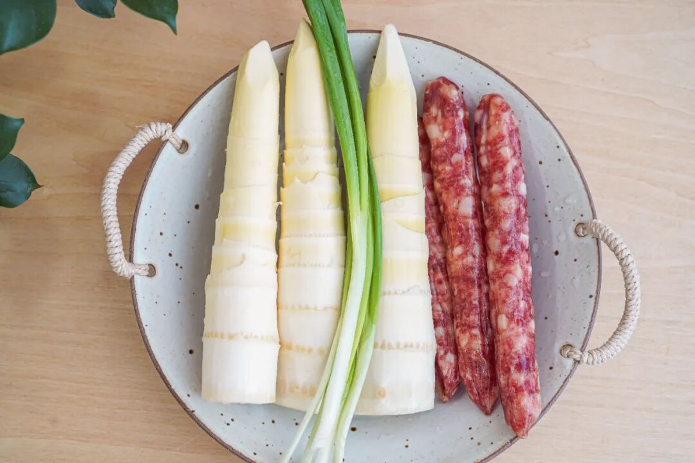
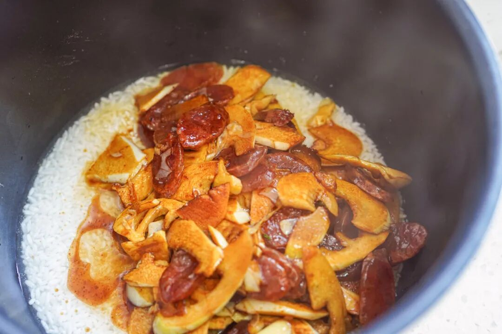
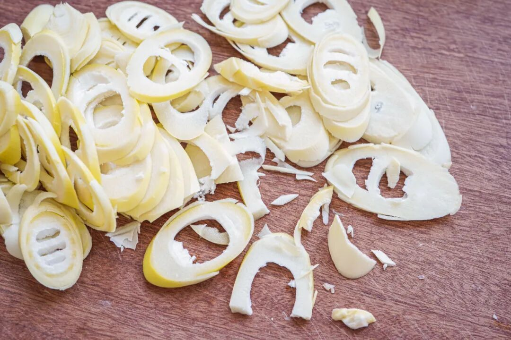
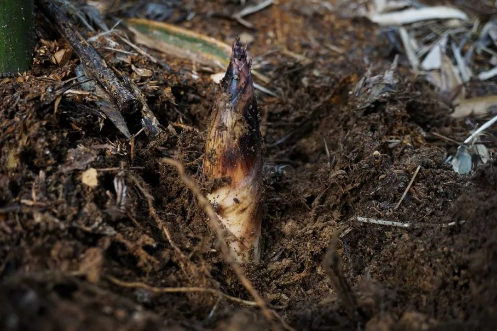
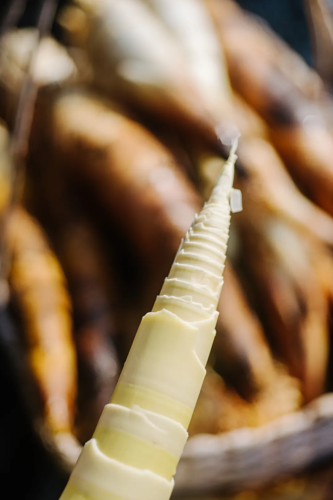

# 早春就馋这一口，好吃不贵

- 原文链接: https://mp.weixin.qq.com/s?__biz=MjM5NTYxODQyMA==&mid=2653467448&idx=2&sn=40421e9d5308fb4683bbe00e2ebc46cf&chksm=bc0a0ca1e2687eae8056f6e479bd4cd843ec89ecfdfa72c990975fd095eb30255f41460d85d8&scene=27#wechat_redirect
- 浏览量: N/A
- 点赞数: N/A
- 评论数: N/A
- 转发数: N/A

## 正文

又甜又多汁！

一个尽情安利自我的公众号

以下是没事干研究院的风物研究报告请放心食用
要我说，江南的春天，都是从春笋开始的！

过年的时候就在想了，

最近终于冒出来了！

说起我饱记雷笋，

一向非常出息。今年照旧有米其林餐厅师傅问过来，早早向我司预定了一批。有多好吃呢？照之前的经验，每周餐厅客人都要吃掉七八十斤！

托老板的福，

本薯也已大吃了几天

无需任何厨艺，

随便炒就超脆甜，

感觉还没长大，就被从土里薅出来了。。。

啥叫生命力？啥叫大自然的神奇力量？啥叫势如破竹，势不可挡？

千言万语汇成一句，

大家快来买啊！！！买完把它带回家，炒，煲，蒸，焖！随便糊弄熟就好吃！

就说这道春笋腊肠焖饭，

所需材料如下👇

用的我司雷笋和腊肠，

都是真材实料。

有多简单呢？

把食材切片，

下锅简单翻炒出香味👇

通通丢进电饭锅蒸熟即可！

两步到位！

出来就是香甜脆爽的一锅春鲜饭！

插播一下，

由于这笋太嫩太脆，

我司摄影师打下手时大惊：

好容易切烂掉👇

毕竟这自然笋实在难得！

在临安天目山核心产区

捂了一整个寒冬腊月。

老板只要那几个周边村子的笋，亲自跑到产区去挑的。

拒绝外地笋哦。

因为笋的品质好不好，

和土壤质地直接相关。

腐质高的土才能长出好笋。

所以，哪怕只是20公里之外，

就已经不一样了。

农产品非常玄妙，就算差一点点的位置，土壤和水文就会差很多，产出的笋就是不一样。

产区选对了，还要精挑！据说运用了「妈妈去菜市场挑笋」的家传智慧，只选大小、嫩度适中的青年笋，一开始都是拿尺子直接量，这几年下来阿姨们熟练了，才开始人手精挑，属于是笋中精品的存在了。。

所以我司春笋，外面根本买不到！即使是同一个产区，也不是同一层次的品质嘿嘿～

它几乎不用处理，

就有原汁原味的鲜甜感，

细嫩无渣，

跟市面上大多数笋都不同！

请看老板的抽样测评👇

每年就卖一两个月，卖完就没了！想吃的，快冲啊！！

最多焯水一分钟，

（其实不焯水也不麻嘴

尝尝早春江南时鲜的味道，

真的很鲜甜，

是外面买不到的那种鲜甜。

现在还有难得的限时 9 折！

去买。

你们不信本薯，

也要相信眼疾手快的

饱记客人啊！

饱记·2025 临安天目山雷笋购买方式如下限时吃笋 9 折！！！

戳图购买👇

题 外

朋友们春天好啊！

早春糯唧唧顶流，上周刚上架的我饱记青团买了吗？

趁现在限时 85 折！

上头说的的临安天目山雷笋，

刚好配真材实料的饱记腊肠，

限时地板价 8 折！

或者试试好吃不贵的

玫瑰露酒腊肉&腊排骨，

更是限时地板价 7 折！

回到童年的铁盒蛋卷，

产品经理卷出来的鸭舌、麻花、猪肉脯，

都给一个限时 7 折！！

还有些适合空调房吃吃的水果👇

娇艳可人的雷州木瓜，

口味浓甜的蒙自花长虹枇杷，

来自精品小果园的云南沃柑，

人称「水果冰淇淋」的凤梨释迦！

清新浓郁的万人迷上海金奖草莓👇

个头基本都在18mm+的云南露天蓝莓，

微甜饱腹、没啥热量的广西双拼芭乐，

现在也有限时 9 折！

此外 90 天短保质期的大师凤梨酥，

也都有限时 9 折冲冲！

饱记·妈妈牌青团

预售中！！

限时 85 折！！！

戳图或去🍑🍑🍑搜索

「艾格吃饱了」

下单购买👇

饱记·手工腊肠购买方式如下👇限时地板价 8 折！！！！
戳图下单购买👇或🍑🍑🍑搜索「艾格吃饱了」

饱记·玫瑰露酒腊肉&腊排骨购买方式如下👇限时地板价 7 折！！
戳图下单购买👇或🍑🍑🍑搜索「艾格吃饱了」

饱记·湛江雷州木瓜

购买方式如下

限时吃水果 9 折！！

戳图购买👇

饱记·蒙自花长虹枇杷购买方式如下限时吃水果 9 折！！！
戳图购买👇

饱记·云南晚熟沃柑购买方式如下限时吃水果 9 折！！！
戳图购买👇

饱记·凤梨释迦购买方式如下限时吃水果 9 折！！！
戳图购买👇

饱记·限定铁盒酥酥蛋卷

购买方式如下

限时开门红 7 折！！！

戳图购买👇

饱记·年味零食7 折专区！！
购买方式如下
戳图购买👇

饱记·云南高原蓝莓限时吃水果 9 折！！！新年莓开眼笑！！！
戳图购买👇

饱记·广西双拼芭乐

限时吃水果 9 折！！

新年健康快乐！！！
戳图购买👇

饱记·红颜草莓限时吃水果 9 折！！！节日莓有烦恼！！
戳图购买👇

饱记·新鲜到货凤梨酥

限时 9 折！！！
戳图购买👇

本文的研究员

薯角啊！赞美春天！

用好吃的方式吃一生

祖国各地好风物

文章转载请加微信「baojiclub」

