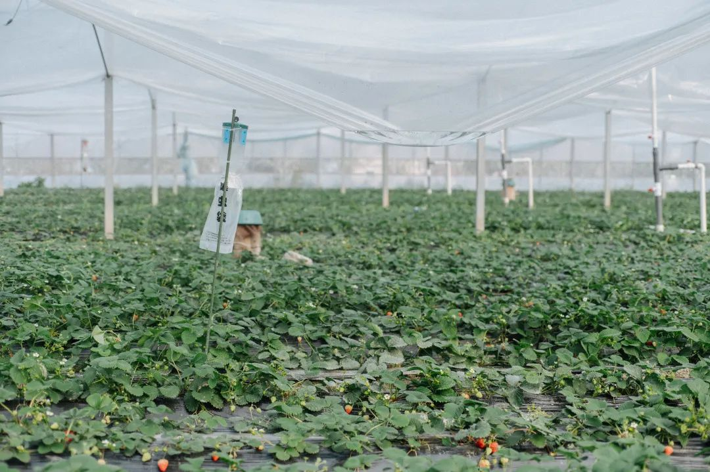
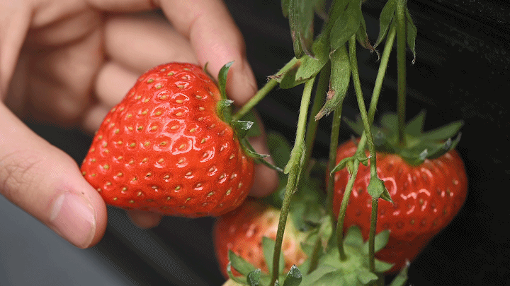
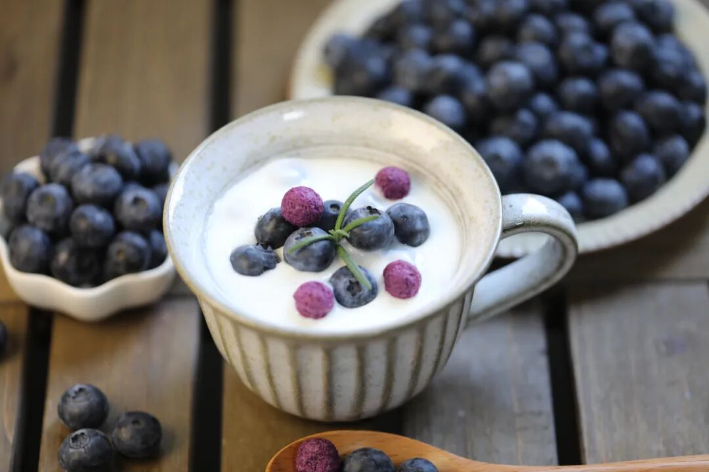
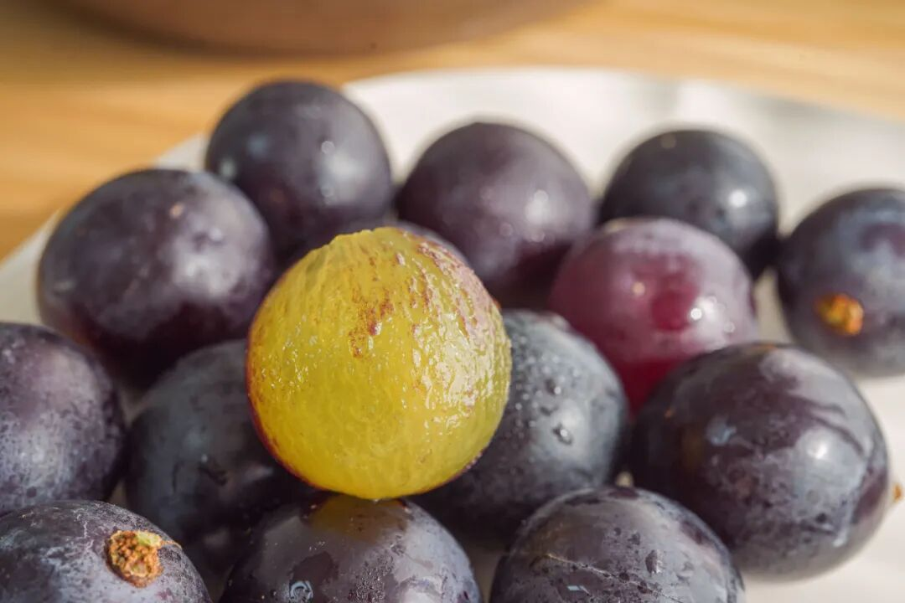
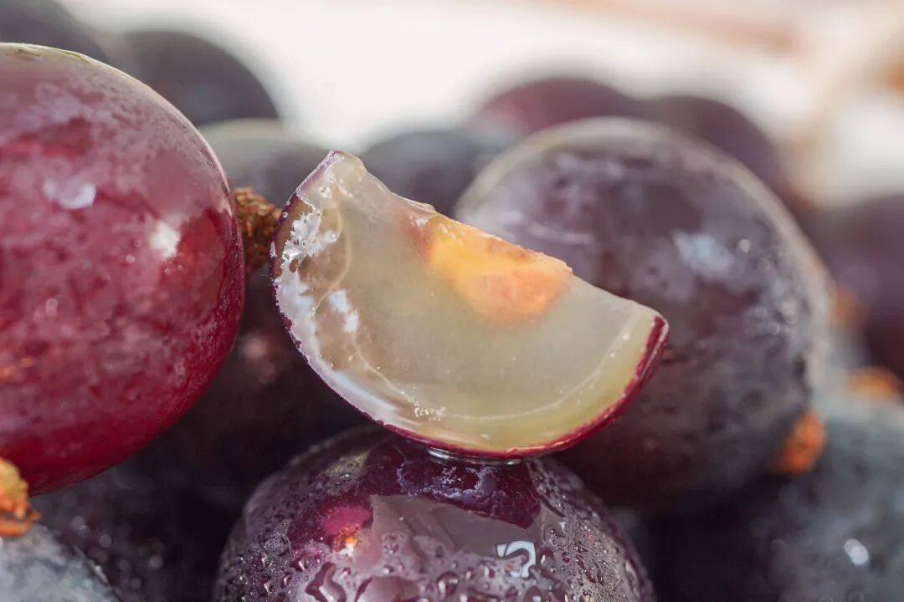
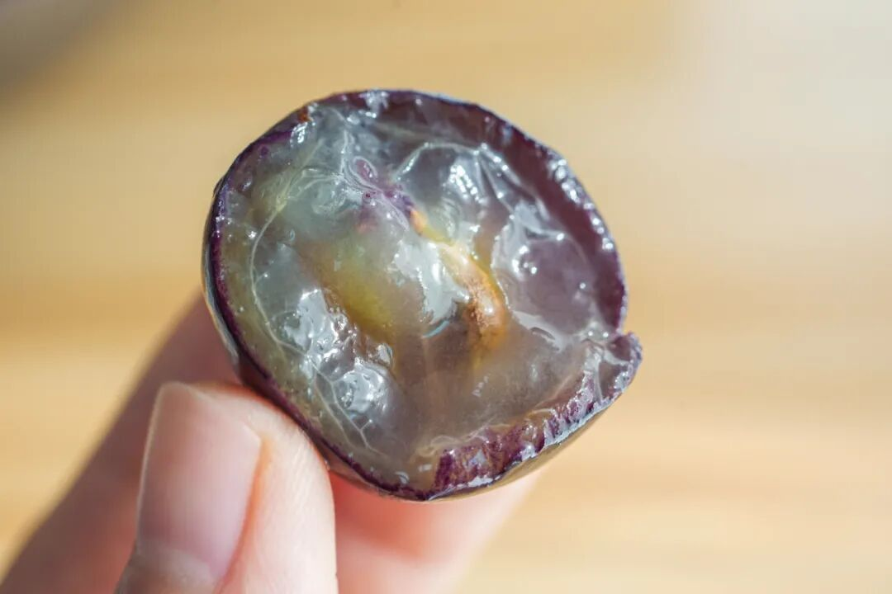
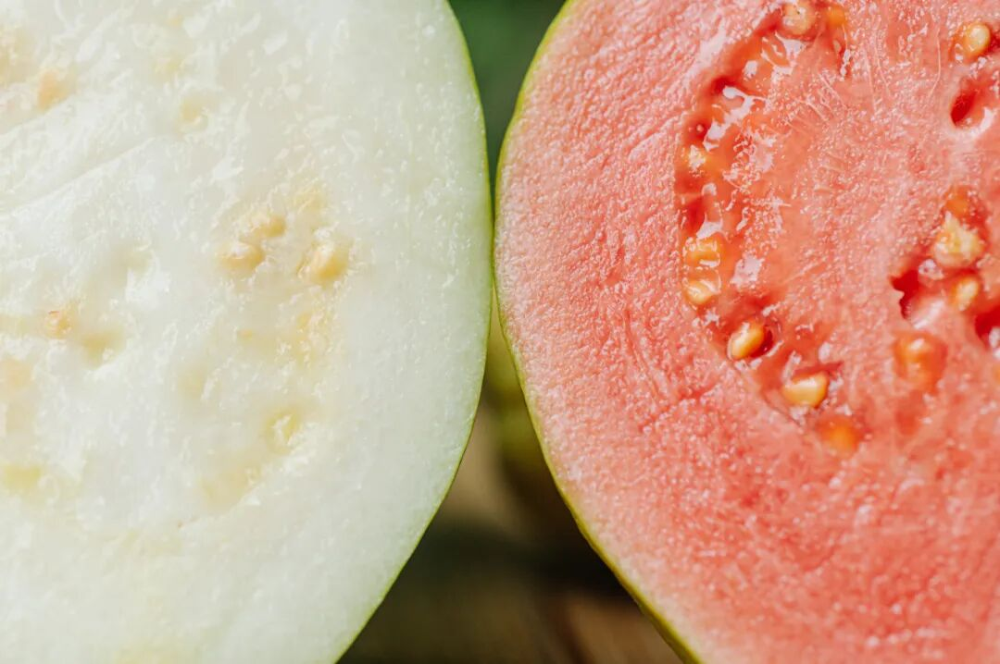
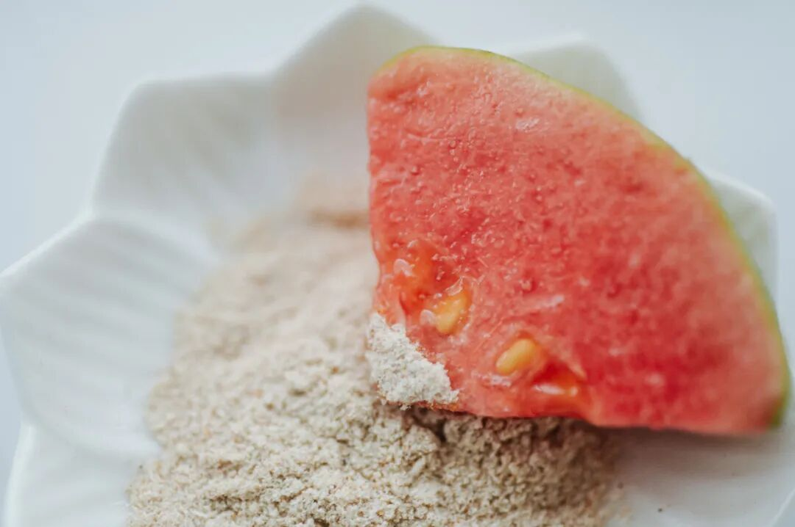
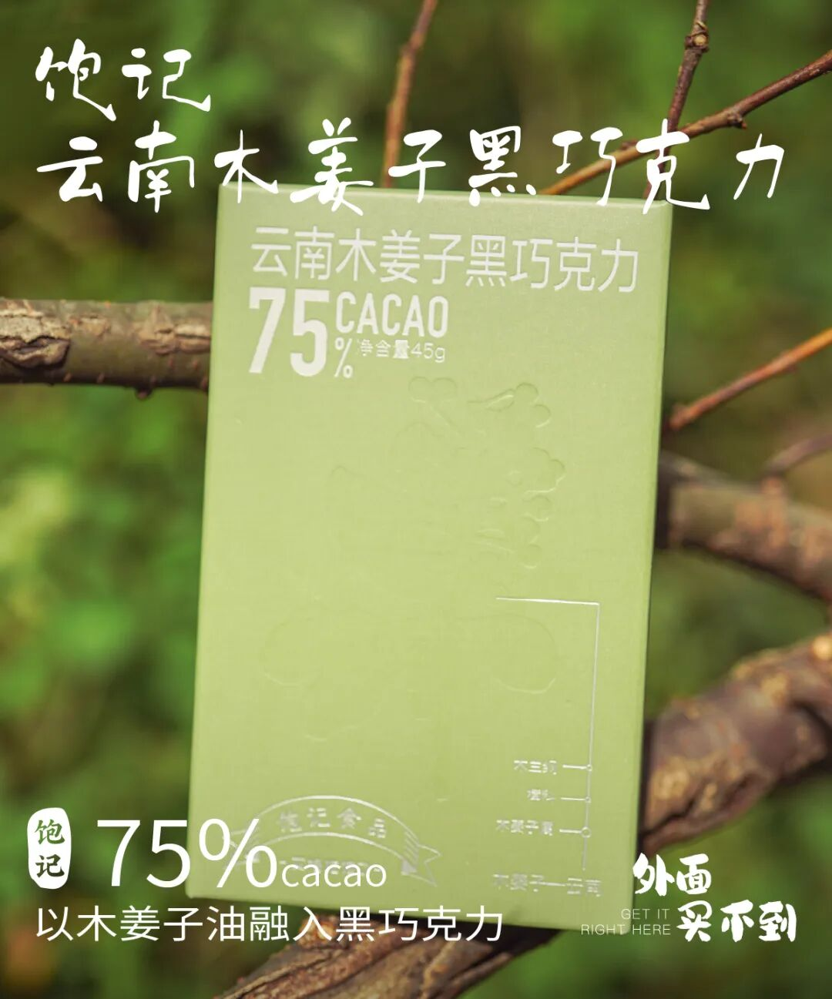

# 早春最清新好吃的水果之一（可网购

- 原文链接: https://mp.weixin.qq.com/s?__biz=MjM5NTYxODQyMA==&mid=2653466284&idx=1&sn=7fb64a96cde631c5da0bc6a51a9a989b&chksm=bc0b684504905ca402ae89ed192bbe4940f375e63a3dff9c9b218a1d4281abea330745399ed3&scene=27#wechat_redirect
- 浏览量: N/A
- 点赞数: N/A
- 评论数: N/A
- 转发数: N/A

## 正文

吃不腻，吃不胖

一个尽情安利自我的公众号

以下是没事干研究院的风物研究报告请放心食用
朋友们过完年上称了吗？本薯实打实重了五斤

（马上改名为薯饼了

硬菜暂且放下，

今天说几个早春好吃水果，

都清新不腻、多吃不胖，

重点是可网购！

你们看着买买！

1.上海金奖草莓
首先是比丹东草莓还要卷的上海白鹤红颜草莓！比初上市时终于降价啦！！

它又可称之为，看了就想偷吃、吃完就会下单的万人迷草莓👇

不是来了这司，本薯属实不知，上海，竟是个种草莓比丹东还卷的地方。。。作为中国最早栽培草莓的地区之一，种植技术早已卷到飞起，却一直不声不响！

「白鹤草莓」，

乃上海草莓之代表，

被评为「中国农产品地理标志」，

青浦更是当下国内外主要的草莓产区之一。

我饱记选的，拿过上海地产优质草莓品鉴评优活动的金奖！

完全按评金奖要求挑的，

评委吃的啥我们也吃的啥～

（是的，就是这么骄傲！

这金奖草莓，还没有入口，就能闻到剧烈的香气。

咬一口，汁水在口腔里蔓延，

鼻腔同时又被弥漫的香气包裹。

真的会上头。

此外，它还品相极佳，个头秀丽，颗颗都饱满红艳，
因为还是饱记标准，每一颗都要经过人工精筛嘿嘿～

大家关心的草莓农残问题，

这一点，请放一百个心！

上海对地产草莓的监管很严格，

是要纳入上海市种植业生产信息管理系统的，

所以都是有据可查，几乎没什么农残。

合作社的果农们说，

自己平时在地里渴了，

也会随手吃点草莓当水喝。

（hhhhhh我一点都不羡慕

白鹤各家合作社种植户遵从绿色种植原则，

采取有机种植方式，

比如会在大棚内养蜂，让蜜蜂给草莓自然授粉，

设置捕虫袋，通过物理的方式来抓虫，

有的还会利用合作社种的玉米杆子，

给草莓土壤补充营养。

最重要的是，如果你和本薯一样生活在包邮区，
这草莓有压倒性的优势！丹东的草莓当然不差，

可能大家不知道，买草莓，

本地能吃到是最好的。

这里主要是运输上的损耗。。。

丹东草莓发货一般在六七成熟，

但是白鹤草莓可以做到八九成熟再采摘发货，

那当然是更软糯更浓郁啦。

（所以大家现在可以打开地图看看距离了。。。

非我薯角自夸，

看看后台去年真情实感的好评👇

好了，

今天真是唠深了，

你们看着点买吧。

这时节哪能不吃草莓！

饱记·红颜草莓

限时吃水果 9 折！！！

新年莓有烦恼！！

戳图购买👇

2.云南露天蓝莓

哦这蓝莓真的绝了，

我必须要好好说一下！

个头基本都在18mm+，

人工挑选过，

送人也拿得出手。

不过如果你那里气温低于零下三度

不建议拍哦！

首先，

在吃我饱记蓝莓之前，

我是不知道原来蓝莓

是有浓浓花香味儿的！

后来一问产品经理，

才知道我们都是露天树上熟，

当天现摘现发的。。

你们去商场买，

就不可能给到你这个熟度。

要考虑出货周期的。

这都是产地实拍图哦。。。

另外，种植大哥还说了，

蓝莓就算是带点生，摘下来捂个两三天，

一样是甜的，只是脆度上差一点，

普通客人也不会挑剔这么多。。。

但我饱记的客人，岂是普通客人！给大家的蓝莓，就要是外面买不到的新鲜

这款蓝莓来自日照充足的云南高原，

选的是露天果园，物理种植。

无膨大，无催熟， 无农药，

老人孩子都可以放心吃。

对了，新鲜蓝莓表面会有一层白霜。

相当于蓝莓的保护剂，

新鲜的蓝莓才会有哦～

吃之前洗洗就行，不碍事。

饱记·云南高原蓝莓限时吃水果 9 折！！！新年莓开眼笑！！！

戳图购买👇

3.冬日蜜蜜甜葡萄
来自秦岭脚下的冬日蜜蜜甜葡萄！这个季节里的自然恩赐，产品经理找到的时候超惊喜！

每一颗都是爆汁小炸弹！皮薄肉厚，汁水超级足。

甜度高！糖度可达 17 左右，甜中又带着一丝酸，更显得果味浓郁且甜而不腻～

入口除了葡萄本身的果香，还有一层淡淡的玫瑰香，仿佛往嘴巴里喷了花香水，且留香时间还更长

要知道，冬天有这么好吃的葡萄不容易！感谢田间地头不断钻研的科学家和农人！
这葡萄全程采用科学种植，且施有机肥，老人小孩也可以放心吃哦！

为了更好地运输，这次还采用了单粒包装，先整串修剪下来，
再人工一颗颗拣选，只挑好果、大果👇到手吃起来更方便啦！

饱记·冬日蜜蜜甜葡萄限时吃水果 9 折！！！新年紫气东来！！！
戳图购买👇

4.广西双拼芭乐
这位小众选手，往北走就比较少见，但其实是奶茶店里的常客！
有人爱它美貌，有人爱它独有香气，更多的是贪图那一口：可以大口啃的丝滑~~~

微甜，饱腹，没啥热量，（多吃不胖，没啥负担还好吃，谁不爱呢但好吃的芭乐难寻~

不过我司在生鲜水果上，一向没在怕的！这芭乐产自广西玉林民乐镇，
是国家首批生态家园建设示范点。（不用我说，国家认可的好山好水好环境！施农家肥，物理防虫，吃的就是一个原生态~

双拼，一次可以吃两种。奶油白心芭乐的几乎无酸，草莓红心芭乐更香。（个人感觉可以当天然香氛用吃起来都是扎实的冰激凌球口感，滑滑糯糯~

随赠酸梅粉哦，广西酸嘢吃法，还可以蘸辣椒盐。（推荐亮爷辣椒盐，这篇里有最近想买的便宜货（无广

饱记·广西双拼芭乐限时吃水果 9 折！！

新年健康快乐！！！

戳图购买👇

题 外

来来来！

过年没吃够的朋友看这里👇

吃到元宵没问题的饱记年货礼盒，

天🐱有赞同折扣！

限时开门红 85 折！

今年冬天的富平柿饼现货中！

限时 85 折！

回到童年的铁盒蛋卷，

产品经理卷出来的鸭舌、麻花、猪肉脯，

都给一个限时 7 折！！

适合空调房吃吃的水果还有👇

还有今年份的象山红美人，

入口似果冻般嫩嫩滑滑～

现在也有限时 9 折！

此外稀奇货 75% 木姜子黑巧克力，

90 天短保质期的大师凤梨酥，

还有刚补货新到的饱记腊味们，

也都有限时 9 折冲冲！

饱记·年货礼盒

购买方式如下

开门红限时 85 折！！

戳图下单购买👇

饱记·富平柿饼

购买方式如下

限时开门红 85 折！！！

戳图购买👇

饱记·限定铁盒酥酥蛋卷购买方式如下限时开门红 7 折！！！
戳图购买👇

饱记·年味零食7 折专区！！
购买方式如下
戳图购买👇

饱记·象山红美人柑橘限时吃水果 9 折！！！
戳图购买👇

饱记·新鲜到货凤梨酥

限时 9 折！！！
戳图购买👇

饱记·云南木姜子75%黑巧克力

购买方式如下

限时 9 折！！

戳图下单购买👇

或🍑🍑🍑搜索

「艾格吃饱了」

饱记·手工腊肠

购买方式如下👇

限时全年地板价

戳图下单购买👇

或🍑🍑🍑搜索

「艾格吃饱了」

饱记·玫瑰露酒腊肉&腊排骨

购买方式如下👇

限时全年地板价

戳图下单购买👇

或🍑🍑🍑搜索

「艾格吃饱了」

本文的研究员

薯角多吃点，好过冬

用好吃的方式吃一生

祖国各地好风物

文章转载请加微信「baojiclub」

