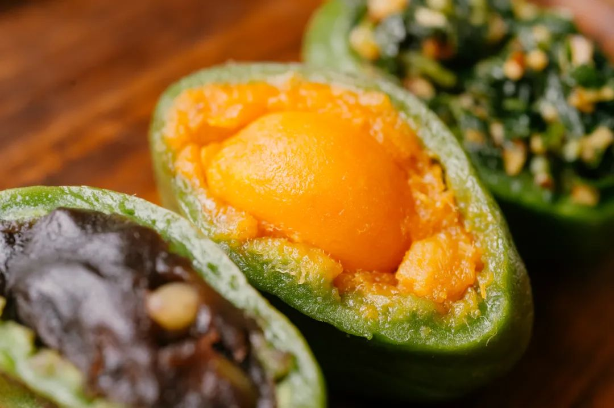
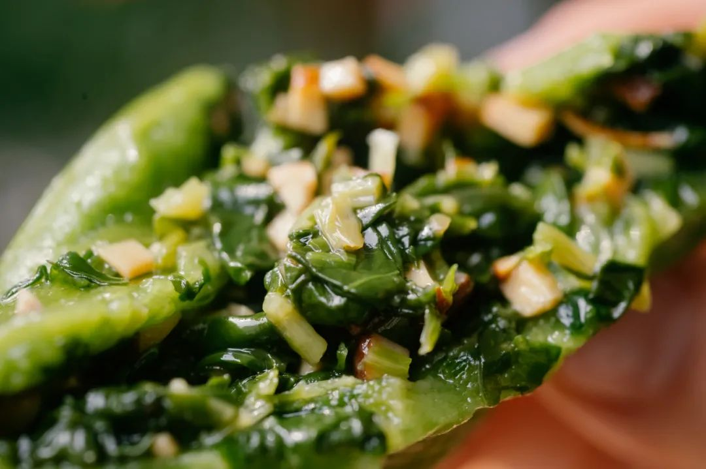
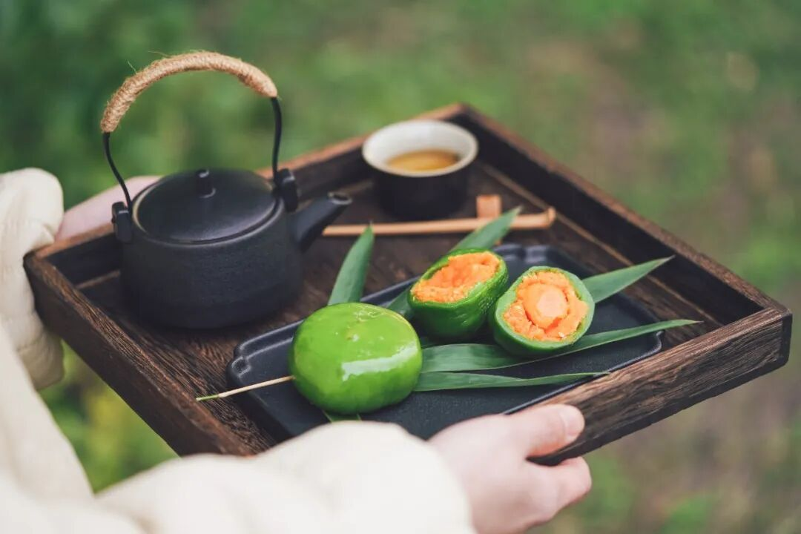
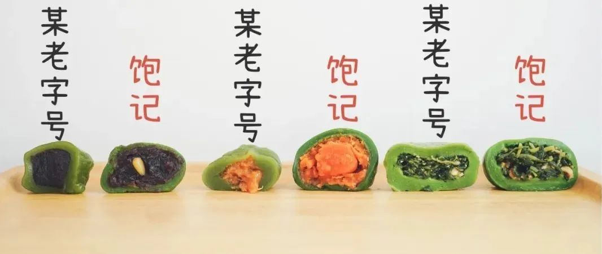

# 春和景明，她们说是莞莞类卿

- 原文链接: https://mp.weixin.qq.com/s?__biz=MjM5NTYxODQyMA==&mid=2653467496&idx=1&sn=7450751299574c197c27ebba0fc48a9b&chksm=bcf7e48c51fea32f797ab38cfe14c9781688cbba6e3d90746288952a6a30e252cbb914bef04d&scene=27#wechat_redirect
- 浏览量: N/A
- 点赞数: N/A
- 评论数: N/A
- 转发数: N/A

## 正文

实力给我底气

一个尽情安利自我的公众号

以下是没事干研究院的风物研究报告请放心食用
曾有尊贵的饱记客人发出过这样的感叹：「吃了你家青团，无视街上所有青团」。

真是爱吃人所见略同！

大家有所不知，每年青团还没发货，本薯就已经迫不及待让工厂给我寄样了！只要吃过，其他所有不过莞莞类卿。。（有更好的欢迎大力打脸。。。

为什么饱记青团值得？因为我们可以拍着胸脯说，都是真材实料，外面根本买不到的好吃！

咸蛋黄得从洞庭湖现运现蒸，

豆沙需提前炒制好，再搭配上饱满的松仁。

马兰头更不用说了，春天新鲜采摘，再同卤香干一起，切碎凉拌。

皮这么薄，馅这么大，每年还只能吃几十天！试问这谁能顶得住啊？？？

一共三个口味！先跟我尝一枚热乎乎的整颗咸蛋黄肉松，名副其实，肚子里有一整颗咸蛋黄！搭配猪肉松 + 白芝麻，塞得圆滚滚，软糯咸香！有趣。

再来一枚豆沙松子，皮又薄又弹，豆沙细腻爽滑，松子香喷喷，不喜甜的朋友说这是「梦中情团」。

最绝的是春季限定马兰头香干，（本薯强推！！！
就是江南春天那一盘经典的时鲜菜，比肉都好吃！入口清爽鲜美，一咬开，啧，这不就是春天的味道么？爽了。

皮子这一块，上海传统青团的皮子偏软粘嘴，不如江浙一带青团更带劲儿，糯糯的又不失嚼劲。

所以特别加入了泰国糯米粉，吃起来，QQ弹弹能拉丝。。。。

包好后的青团，就这样，排队等着穿上保鲜膜衣：（食品级耐高温的哈

装盒立马送去 -40 度极冻保鲜 1 小时以上，才最接近新鲜青团的口感。然后装箱发货，来到大家身边。（时间就是美味的敌人啊！！！

你要问配方从哪里来的？嘿嘿独家研制，所以你去外面买不到。所以本薯诚挚邀请，所有爱吃青团的朋友们，来品品我司亲妈青团。。。

和老字号做过对比，您自己看。
我饱记青团还是热加工工艺，需冷冻保存。

你拿回家蒸 20 分钟左右，

拿到手里看，

每个青团的皮子都软糯有韧劲，

也只有这样，

才能完美复刻江南菜市场的新鲜好口味。

即所谓妈妈的味道。

不愧是饱记积攒多年的亲妈配方，我服！！！

这青团现在已经现货！限时 85 折！！

收到货之后，

强烈建议大家尽快吃掉！

怎么吃？

无需解冻，无需拆保鲜膜，

蒸锅水开上锅蒸 23 分钟左右就行。

如果不立即吃，

收到后请立即放入冰箱冷冻（-18℃以下）保存，

冷冻保存60天。

饱记·妈妈牌青团现货中！限时 85 折！！！戳图或去🍑🍑🍑搜索「艾格吃饱了」下单购买👇

题 外

朋友们春天好啊！

没吃够的看这里👇刚冒出来的临安天目山雷笋，

米其林餐厅师傅第三年回购，

不焯水就鲜甜！

现在也有限时 9 折！

刚好配真材实料的饱记腊肠，

限时地板价 8 折！

或者试试好吃不贵的

玫瑰露酒腊肉&腊排骨，

更是限时地板价 7 折！

回到童年的铁盒蛋卷，

产品经理卷出来的鸭舌、麻花、猪肉脯，

都给一个限时 7 折！！

还有些适合空调房吃吃的水果👇

口味浓甜的蒙自花长虹枇杷，

娇艳可人的雷州木瓜，

来自精品小果园的云南沃柑，

人称「水果冰淇淋」的凤梨释迦！

清新浓郁的万人迷上海金奖草莓👇

个头基本都在18mm+的云南露天蓝莓，

微甜饱腹、没啥热量的广西双拼芭乐，

现在也有限时 9 折！

此外 90 天短保质期的大师凤梨酥，

也都有限时 9 折冲冲！

饱记·2025 临安天目山雷笋

购买方式如下

限时吃笋 9 折！！！

戳图购买👇

饱记·手工腊肠购买方式如下👇限时地板价 8 折！！！！
戳图下单购买👇或🍑🍑🍑搜索「艾格吃饱了」

饱记·玫瑰露酒腊肉&腊排骨购买方式如下👇限时地板价 7 折！！
戳图下单购买👇或🍑🍑🍑搜索「艾格吃饱了」

饱记·湛江雷州木瓜

购买方式如下

限时吃水果 9 折！！

戳图购买👇

饱记·蒙自花长虹枇杷购买方式如下限时吃水果 9 折！！！
戳图购买👇

饱记·云南晚熟沃柑购买方式如下限时吃水果 9 折！！！
戳图购买👇

饱记·凤梨释迦购买方式如下限时吃水果 9 折！！！
戳图购买👇

饱记·限定铁盒酥酥蛋卷

购买方式如下

限时开门红 7 折！！！

戳图购买👇

饱记·年味零食7 折专区！！
购买方式如下
戳图购买👇

饱记·云南高原蓝莓限时吃水果 9 折！！！新年莓开眼笑！！！
戳图购买👇

饱记·广西双拼芭乐

限时吃水果 9 折！！

新年健康快乐！！！
戳图购买👇

饱记·红颜草莓限时吃水果 9 折！！！节日莓有烦恼！！
戳图购买👇

饱记·新鲜到货凤梨酥

限时 9 折！！！
戳图购买👇

本文的研究员

薯角啊！赞美春天！

用好吃的方式吃一生

祖国各地好风物

文章转载请加微信「baojiclub」

