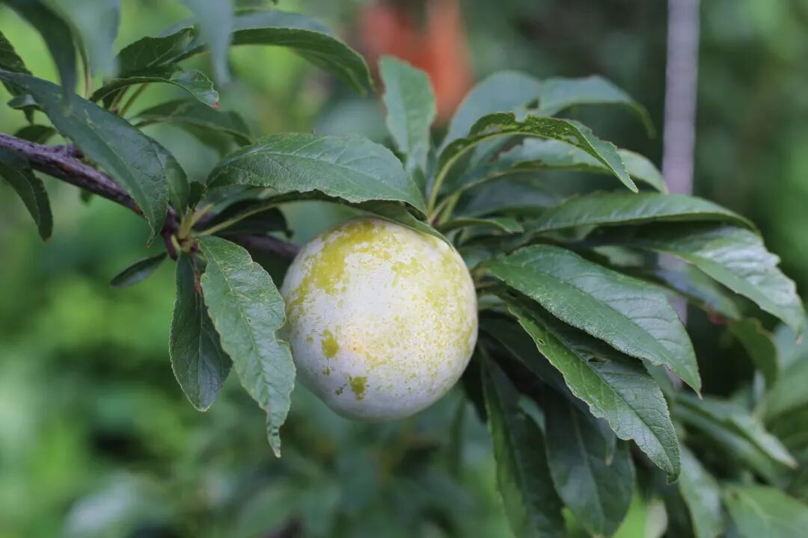
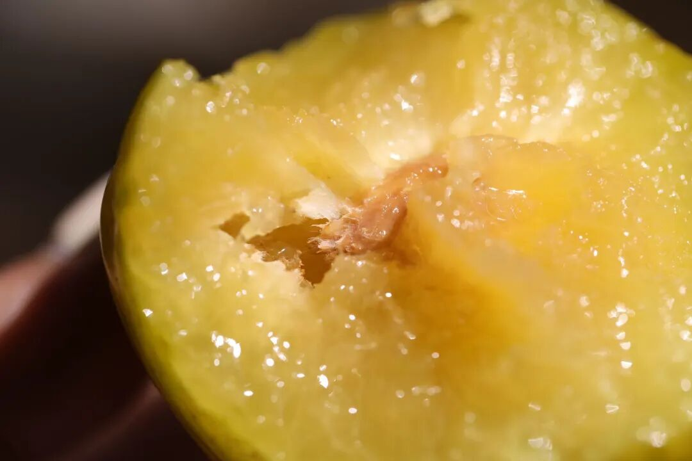
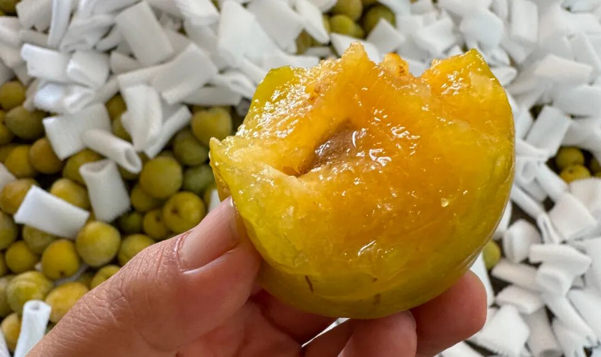
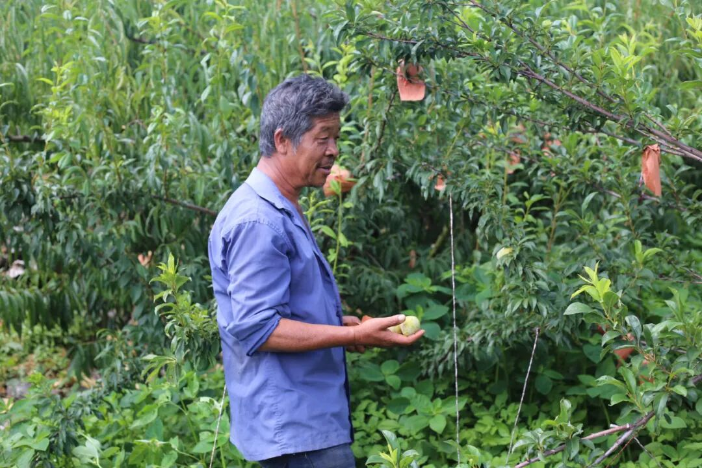
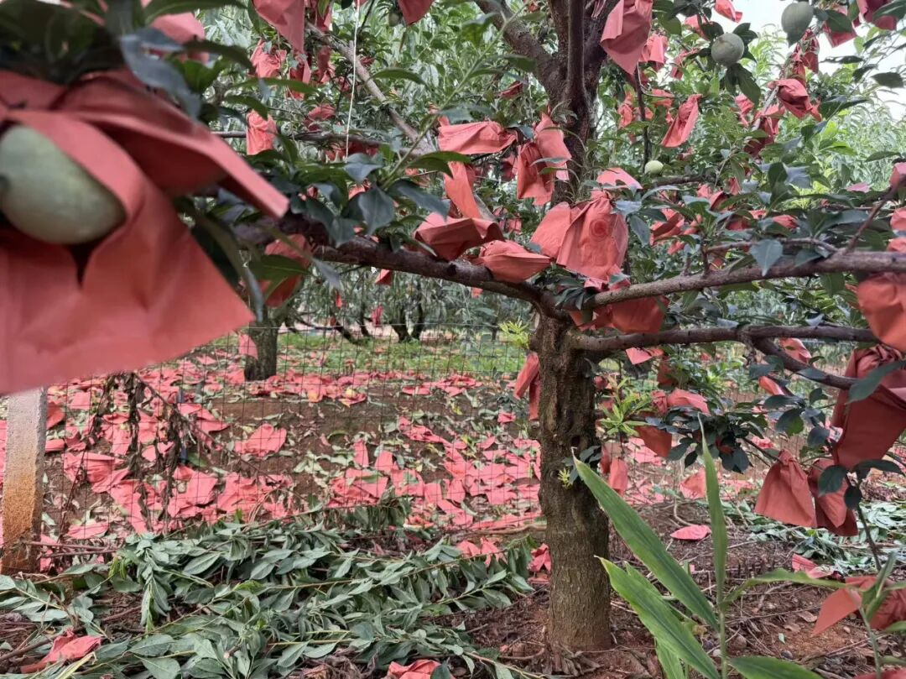
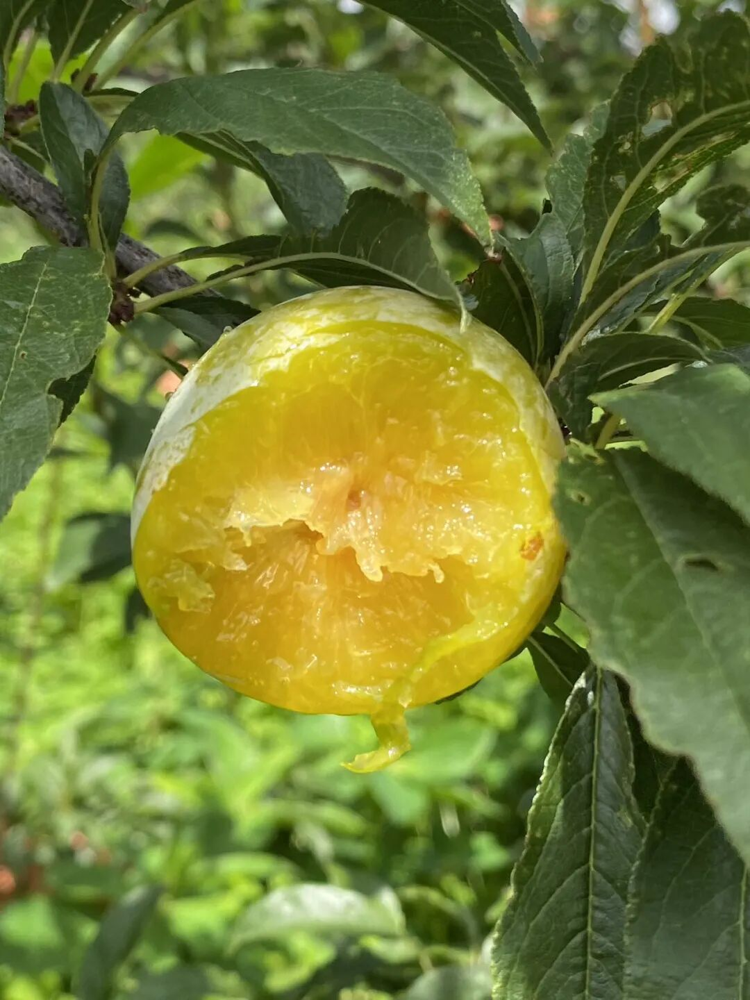
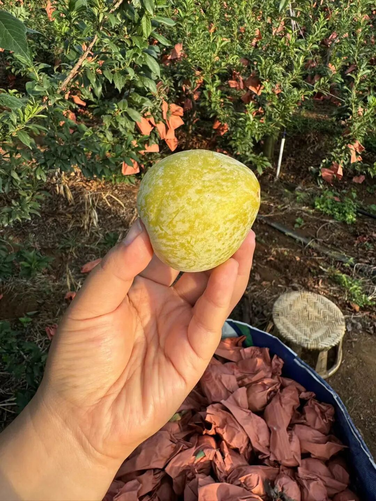
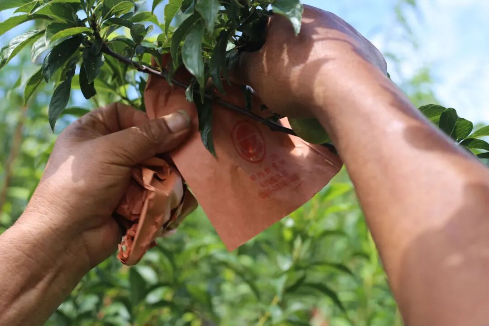
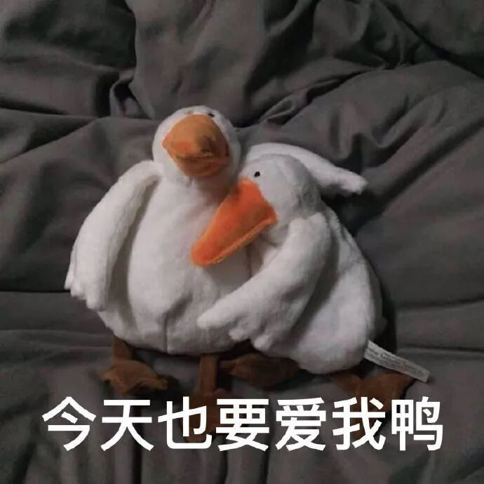

# 最后 48 小时，云南高山的蜜甜

- 原文链接: https://mp.weixin.qq.com/s?__biz=MjM5NTYxODQyMA==&mid=2653456788&idx=2&sn=393131478dc373d058c6e9f395ea34d2&chksm=bc54e399ac73b6b344698fba87685b8320a2c8e4f36669b33b49ab3c2cff20a756e850aff441&scene=27#wechat_redirect
- 浏览量: N/A
- 点赞数: N/A
- 评论数: N/A
- 转发数: N/A

## 正文

抖起来了抖起来了

一个尽情安利自我的公众号

以下是没事干研究院的风物研究报告请放心食用

前几天本薯整了个厉害的活，

邀大家一起包果园！！

原本限时 72 小时，

老板被我的努力感动，

答应再等两天🙏

所以今天再来吆喝一次，

能否拿下在此一举！

大家走过路过别错过，

以后一起拿下更多生态果园啊！

云南红河州蒙自顶流的一个

黄金蜜奈李果园👇

很小但是很精品，

一共只有 1000 箱产量。

饱记约定质量最优的 600 箱，

给到我们！

剩下 400 箱质量稍逊的，

让他们随便卖去哪里。

反正我尊贵的饱记客人有

最好的果子吃就行了！

先说这个蜜奈李，

其实就是贵州的蜂蜜李品种。

而首个在云南红河州种植的果园，

就是我们今年包的这一家。

这个果园坐落在海拔 1400 米

山顶石头缝里，红沙土的沙土种植，

给水果带来曼妙的风味。

‍

当地温差大，地貌多样，

气候上甚至可以讲核心小气候，

可以和勃艮第产区媲美了。

可惜红河缺水严重，不然葡萄酒肯定厉害爆炸！

而这个果园大哥，

之前是国营林场的种植高手，

更是把蜜奈李引种红河的第一人。

他特别擅长修枝，

能把树修成盆景？？？？

这样，每个枝条上的蜜奈李，

都能晒到红河州热烈清透的阳光，

而在冰凉的夜晚里，

默默累积糖分。

很多人问这个和贵州蜂糖李有什么区别？

基于以上种植方式，

它除了甜，风味极浓，

有浓郁的李子香味，

咬开可以闻一下哦～～～

果肉偏脆，之后是满嘴的汁水

蔓延在口腔。

且饱记要求每一颗蜜奈李都成熟到糖度

约在 20 才可采摘发货！

这是饱记第一次完整地包果园。

6 成我们拿走。

原本仅限 72 小时，

果园被我们的努力打动，

愿意再等两天！

（因为卖不完，果子又成熟的话，

果园就得想办法自己消化了。

因为赶时间，

所有的照片都是果园手机拍的，

大家随便看看。

商详是本薯手撸的，

有一种不管大家死活纯天然的美感。

最后 48 小时，是否能包成果园，

看你们的了！！！

价格就是直接 86 折底价，

再过 48 小时下架！

本薯比了，

某园贵马都比本薯开价贵 2-3 成，

他们还拿不到这个蜜奈李首创果园的果子！

好了，如果本次能搞定，

饱记可以包下更多的生态精品小果园，

大家买起来！

饱记·云南限定黄金蜜奈李购买方式如下48 小时后下架，全程 86 折！！！

点我点我点我包果园 86 折 86 折 86 折 86 折

题 外

生怕你不知道，

本薯上周悄悄上了

这几枚卷了好几年的云腿酥，

黑松露、白松露、蛋黄及经典原味，

都是越嚼越香！

现在预售中，

早鸟 86 折！！！

饱记·滇式云腿小酥
预售中！！！早鸟 86 折！！！

传统滇味经典，

新鲜手作，浓情四溢。

🥮四个口味：

经典云腿、蛋黄云腿，

黑松露云腿、白松露云腿。

🥮三种规格：

云腿酥礼盒全家福

（四个口味各 2 枚）

云腿酥礼盒双拼

（经典云腿小酥*4 枚+蛋黄云腿小酥*4 枚）

云腿酥礼盒囤货装

（经典云腿小酥*30 枚）

现在是预售！

预计 7 月底到 8 月初发货！

戳图买它👇

本文的研究员

薯角吃吧你就

用好吃的方式吃一生

祖国各地好风物

文章转载请加微信「baojiclub」

