# 最后六小时，有什么适合摸鱼吃的零食在打折？

- 原文链接: https://mp.weixin.qq.com/s?__biz=MjM5NTYxODQyMA==&mid=2653463841&idx=1&sn=783578ca49ededfbd413b942fc00f9a6&chksm=bcdec7b76158e95cb60a11f6d5a46f4d27b2c4ed85992996438e8d536b6948cc84956c2ef1b9&scene=27#wechat_redirect
- 浏览量: N/A
- 点赞数: N/A
- 评论数: N/A
- 转发数: N/A

## 正文

冲啊！！！

一个尽情安利自我的公众号

以下是没事干研究院的风物研究报告请放心食用
如题！双十二最后 6.5 小时！用这司卷里卷气的零食、茶饮来收尾！助力大家在工作日下午快乐摸鱼，刻不容缓啊啊啊啊！

本年度最后一次，

薅光老板羊毛的机会，

请大家看看本薯要来的

零食茶饮地板价 88 折大福利啊。。

现在买就是最划算！

（过了这一波明年才有了。。。

凤梨酥、蛋卷、麻花及各类茶走起！

你们把握时机。

1.大师凤梨酥

这款好评如流水的大师凤梨酥！用料实在，
所以只有 90 天短保质期哦。

用的是台湾凤梨酥盲品大赛冠军配方，
选的都是新鲜土凤梨馅，
果肉含量大于 40%！
你一入口就能吃到浓浓的凤梨本味。

我司很喜欢吃凤梨酥的同事说，
吃过很多种凤梨酥，
芝士味浓郁的、果肉纤维多的、奶香味重的，
但都没有一口咬下去
酸甜跳跃的凤梨酥来得印象深刻。
是的，我饱记凤梨酥，
能让人吃出欣喜雀跃的感觉！

酸甜可口，果香浓郁，
真实会拉丝。
酥皮奶香饱满，酥润化渣，
像是在吃松软的黄油曲奇。

2.酥酥蛋卷

香酥，极其香酥，

好吃的秘诀无它，

就是舍得下料，手工制作！

新鲜鸡蛋含量高达 27 %，入口化沙。

更推荐南乳葱香味！

独家定制的口味，入口葱香浓郁，

然后是南乳的咸香，

味道平衡得刚刚好。

3.酒香鸭舌

酒香鸭舌，

包邮区糟卤口味！

灵感来自《红楼梦》里宝玉喜爱的下酒小菜～

冬天配杯热酒，超惬意！

专门盯着南京的厂找，

因为全世界他们最懂鸭子。

最后定的是一家老师傅开的厂，

厂里有一锅 30 多年的老卤！

这个就叫家底儿～

鸭舌原料舍近求远，

用的内蒙古的鸭，

吃草～鸭舌肥嫩没有腥气！

所有的香料，

都直接从同仁堂、太乙堂两家中药房采买，

不是市场上那些脏脏没味儿的糙货！

传统方式吊糟，

就真的是糟香鸭舌的包装版！

完全没有真空鸭袋的辣鸡食品味！

不腥，很香，微咸，带酒意～

鸭舌边边上还有酒香味儿的冻～～

包邮区的朋友肯定爱！

4.四川小麻花

这个四川传统小零食：小麻花，是好吃到让我们一个自家做糕点酥类的大厂供应商都好奇的程度。

用的进口一级大豆油，和特制高筋粉。一共三个口味：
用手工熬黑糖裹制的黑糖麻花，
用好花椒入味的椒盐麻花，唇齿留香的芝麻麻花，
都不硬不腻不粘牙！

确实是市面上少见，重点是酥，脆，甜却不腻口，面粉配比讲究得很，别看就卖你十几块，有功夫在身上的。一定要去买！

5.手撕牛肉

这台湾金门口味的手撕牛肉干，超大片！！！
味道是咸鲜浓郁中带点甜，好嚼过瘾。
不像市面上又干又硬的牛肉干，
难嚼得像在啃橡皮筋。它是微微湿润的，一条一条撕着吃。

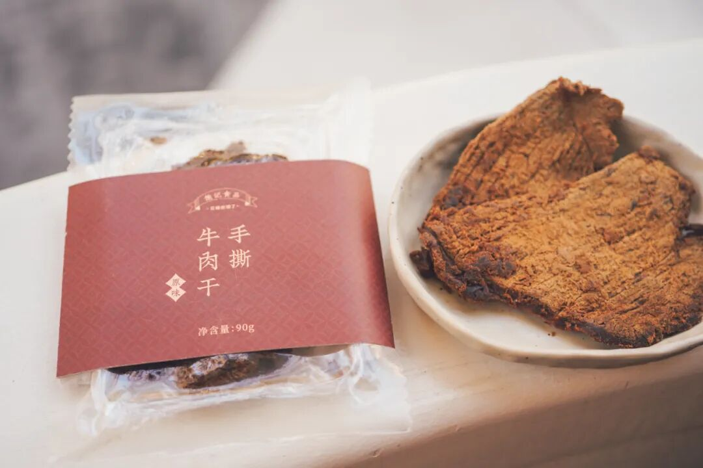

选用南美洲进口草饲牛、特挑部位制炒，台湾老师傅传承手工艺，慢火焙炒烤，真材实料！重点！柔韧鲜香，老人和小孩子都能嚼得动！

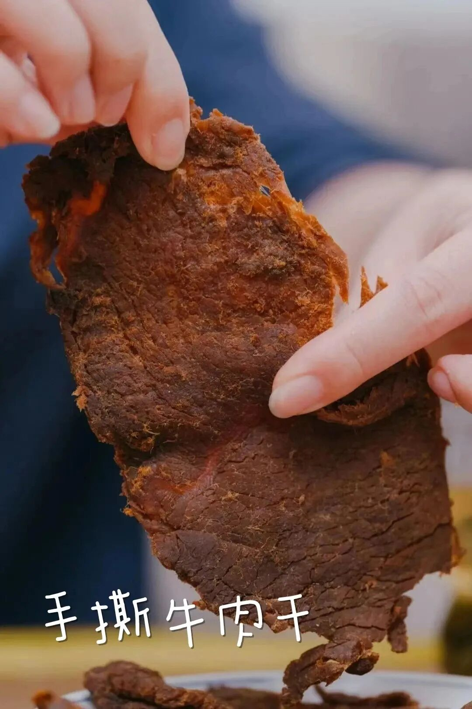

6.麻辣无骨鸭掌

只选 6 斤以上的活鸭制作，

鸭掌大，且不添加任何防腐剂。

基本就是家庭厨房的配料，干干净净。喏，你自己看。

味道，就是一个字，绝！！！！比现做的都好吃，爱吃辣卤的，你没吃过我司这款鸭掌，我会为你 feel sorry～

7.樱花虾饼

透着光的虾饼，质地轻薄酥脆。最新一批 11 月才到的货！选用来自台湾野生的樱花虾，自带的鲜味，加上潮汕特制的鱼露提鲜。

比薯片好吃，一口咬下去咔擦咔擦让人馋得不行！

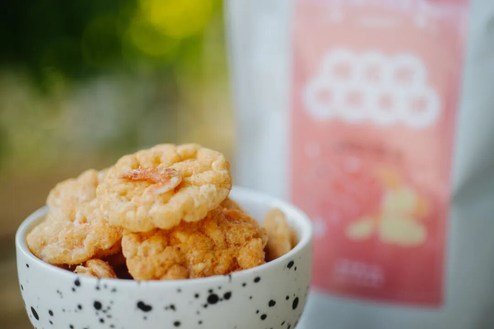

8.蜜桔干

产自世界柑橘始祖地之一的台州黄岩，
10斤蜜桔才能出一斤蜜桔干，选的无核品种、酸酸甜甜，可以配茶吃。

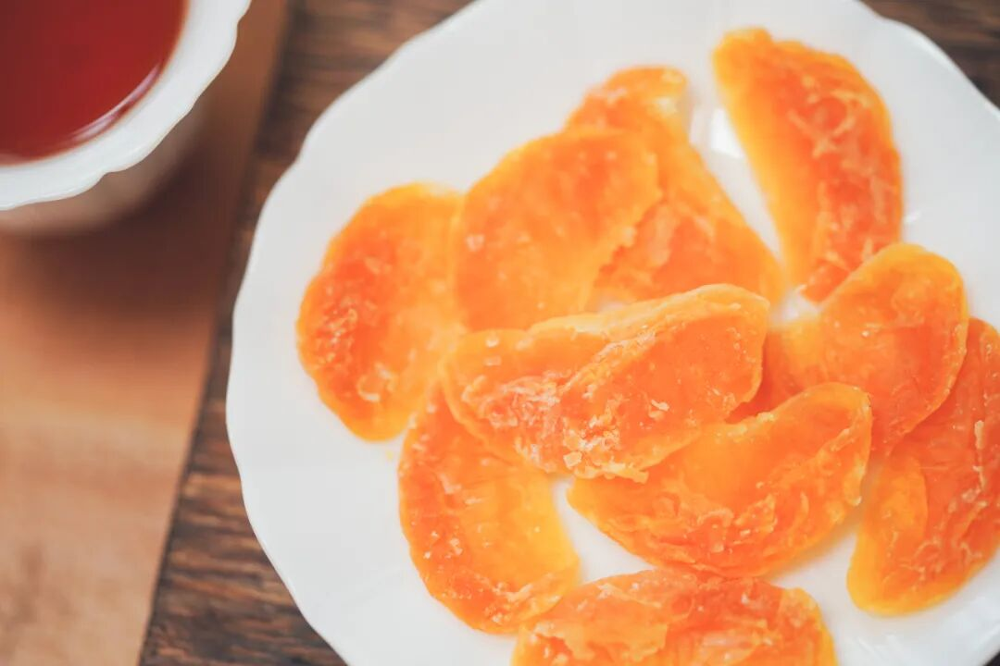

9.陈皮小话梅

有被大家催的陈皮小话梅，
没有怎么吆喝却意外超受欢迎的单品。
选的广东、福建地区的青梅，
以传统工艺腌制而成，
裹以清香橘子粉。

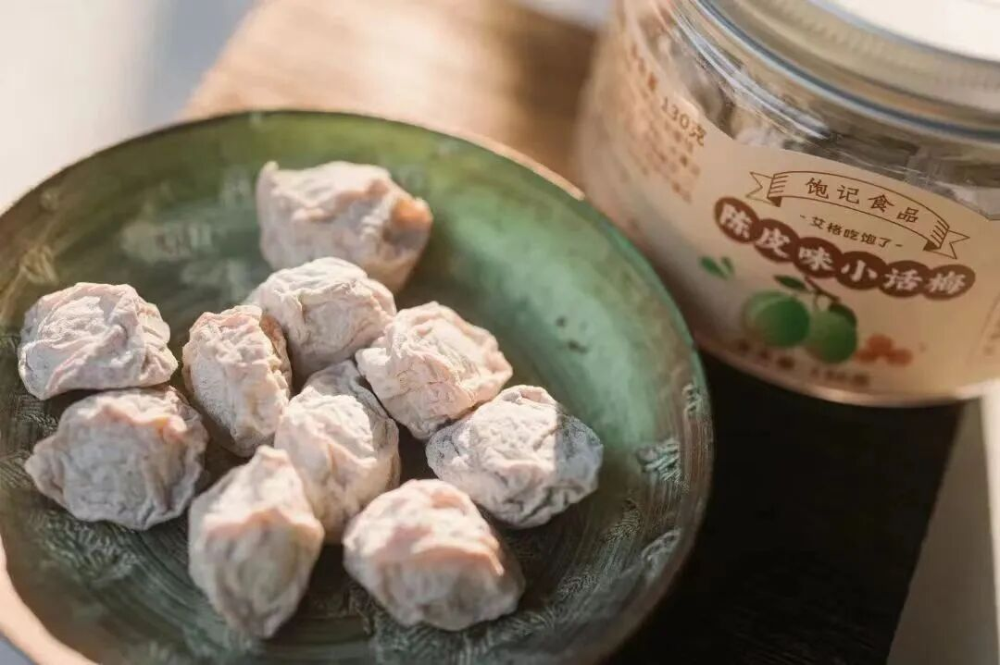

酸甜可口，回味悠长生津，
就是那种小时候爱的话梅，
吃了还想吃！

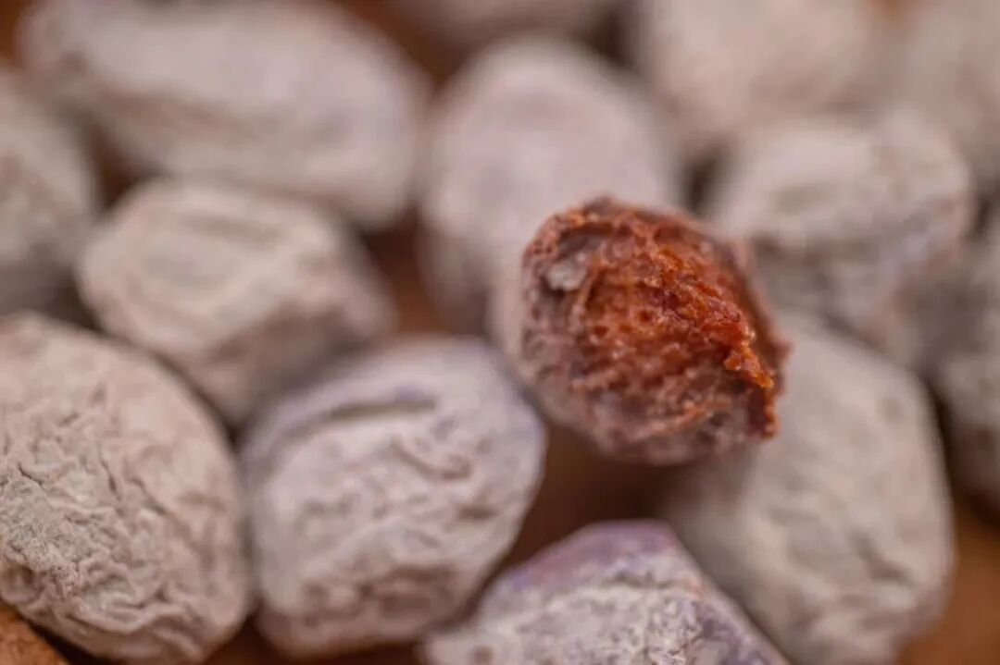

10.黄金柚条

我愿称之为柚子口香糖！

初入口是淡淡的柑橘味，

越嚼越浓烈的柚香直冲大脑，

各种风味在味蕾上瞬间脱缰。

选用高品质沙田柚，

采用低温真空原汁、原糖浸糖工艺制作而成，

柚香十足，回味无穷。

却又不会有柚子蜜饯容易出现的苦味。

一根解腻，

在唇齿间回味好久好久。

泡个水就是柚子茶！

清新又好喝，

还可以多次续杯hhhh

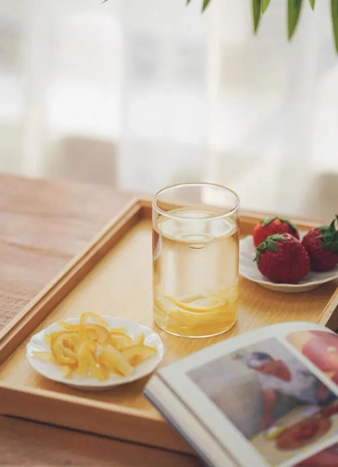

以上摸鱼美食，

通通给到全年地板价 88 折！

趁此机会囤一波，冲！！！

饱记·摸鱼零食折扣专区
购买方式如下

双十二限时 88 折！！！

戳图购买👇

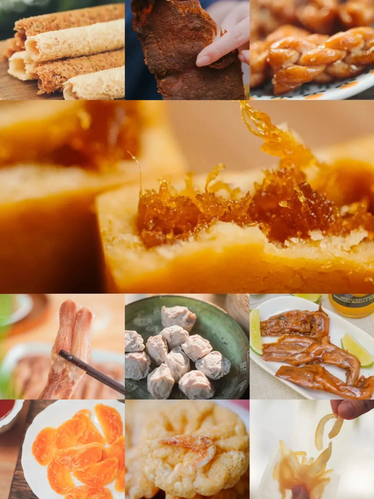

接下来是喝茶时间。

有一说一，我司茶真的不错，
都是自己卷自己的傲人成果。

1.重瓣玫瑰红茶

这个茶，本月才新鲜到货！请我司所有女性用户都买回家喝好吗？不为别的，就喝它真的会有幸福感啊。。。选的是整朵的进口重瓣玫瑰，香气特别馥郁，

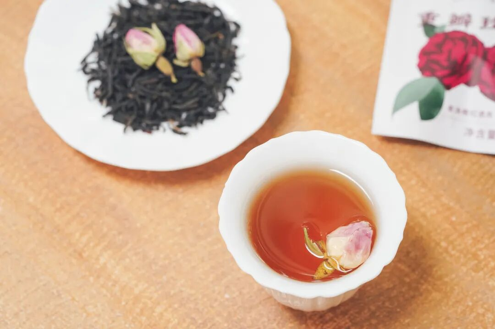

色泽乌润，外形饱满的茶叶制成的福建红茶，茶汤喝起来一点都不涩，一泡就能闻到鲜灵的花香。

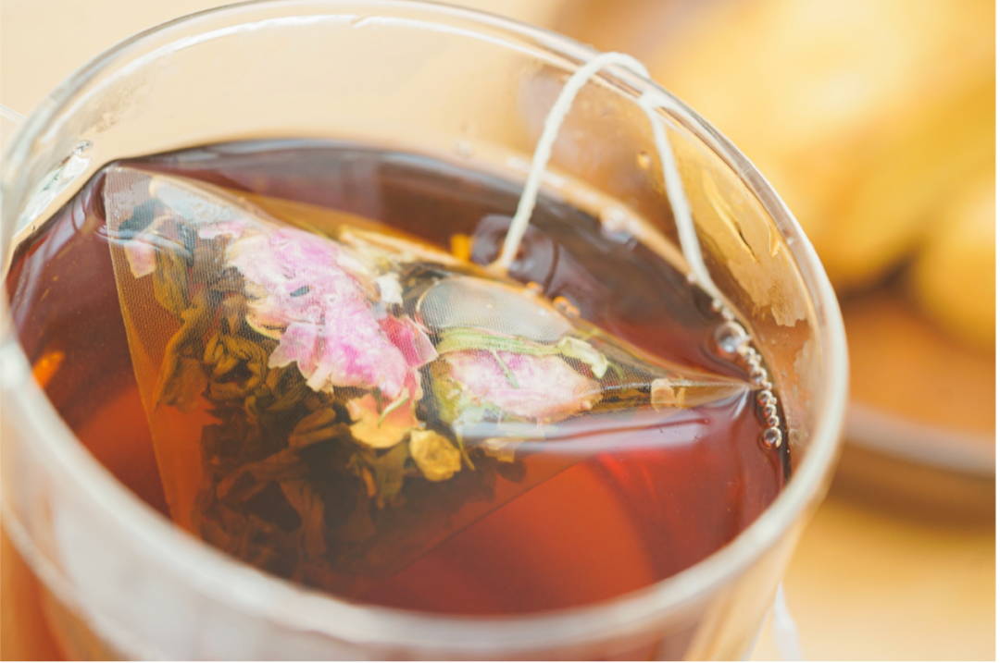

哦，为了玫瑰干花保持完整，花和茶包是分装进去的。（哎有人和我一样容易被这种小细节打动吗？一盒 8 包，每小包 3 g，随手泡一杯，室内都是玫瑰甜香。

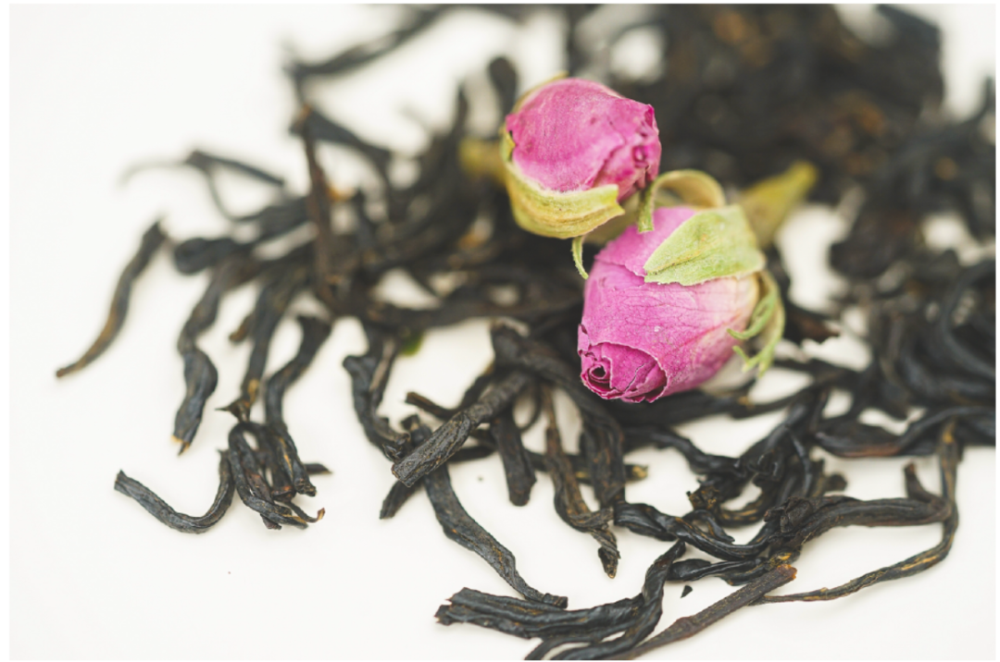

2.桂花九曲红梅

上过亚运会国宴茶清单的饱记·桂花九曲红梅，升级了小金罐！

这茶喝起来，就一个词，鲜甜！是那种水润、嗓子非常舒服的甜。
桂花巨巨巨香，暖而不涩，
一杯能泡四五泡，
像我这种人就能喝一天！

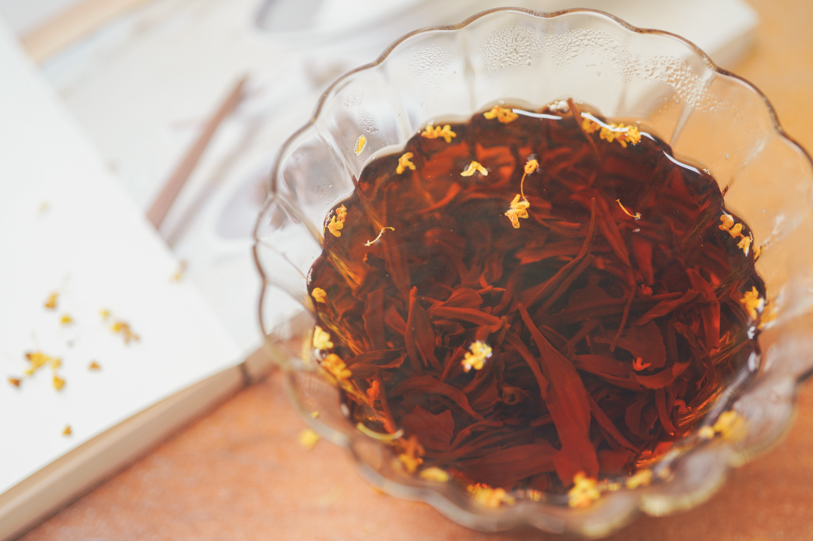

有 30 年制茶经验的老师傅，

以 2 斤桂花、10 斤茶的配比，

古法窨制 24 小时，

所以比普通窨制的花香更浓！

配料表超级干净，仅有九曲红梅和桂花！

大家放心喝起来啊！

由于此茶风味接受度颇高，

喝过的人都喜欢！

尤其推荐拿它当冬日里的待客暖茶。

3.桂花乌龙&柚子小种红茶

我司回购率极高的桂花乌龙小金罐！

福州同事的原话：

这茶完全经得起盖碗的考验！

和市面上都是细末的调味茶不是一回事，

必须细细品味！

来自后台用户的

真实反馈👇

茶叶用的是六年陈炭焙铁观音，

同事专程跑到福建安溪，在平均海拔超过 1200 米的戴云山脉深处卷出来。茶农分三次焙火逼出茶香，最后陈放六年，耐心等待火气褪去，把蜜韵养足～

金桂，是每年寒露前后新鲜打的，早上五六点日出前打下来，运回后剔除花梗树叶，仔细拣选后才可与茶叶拼和。

然后请来福州当地家中五代制茶的老茶人，以传统古法窨制，一层金桂一层茶～

早期刚开始，我们做的是一窨一提（下花量 70 斤），后来再到两窨一提（下花量 230 斤），这次老板下了血本，直接做了三道窨制的（下花量300斤）！100 斤的茶要用300 斤桂花分三次窨制！！

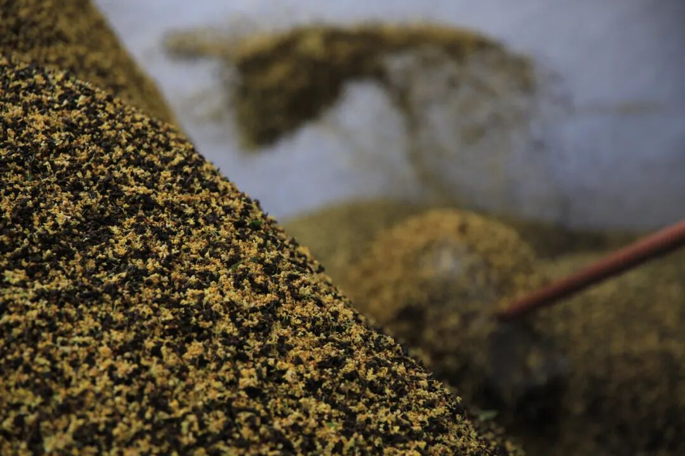

（洒的不是花，是钱。。。
但懂的都懂，老福州人做花茶，讲究见花香不见花，饱记也是同样标准，桂花萎蔫后都会以手工挑除，只在烘干后额外洒入干桂花～费时费力得很！

（这么好看，不要命啦？
用盖碗泡，哇～桂花的香气完全被激发，直窜入鼻尖！带着一点花的自然甜味～入口茶汤微稠，舌侧香气余韵不绝，观音茶的回甘源源不断！

总之，闻起来是甜的，喝起来却有烤过的醇厚滋味！本当它是办公茶叶，没想到茶底这么好，还耐泡得很！立即决定囤几罐在家！

还可以搭着柚子小种红茶买！组合更划算！用的是武夷山的花香小种红茶。茶叶鲜度很高，传统手工精制，一芽一叶。

泡出来是这样的，远远都能闻到饱满的柚子香气！冷热皆可。但同样最推荐盖碗泡法！

当然你也可以像董洁一样，（是的它可是上了董洁直播间！一个人的时候拿出喜欢的杯子品品，给自己小小的仪式感？总之优雅永不过时

4.罗汉果普洱茶

饱记·罗汉果普洱！

宅家时爱不释手，

是一杯容易被低估的小甜水。

里面是晒干了的罗汉果、

云南陈年熟普还有浙江胎菊！

没有另外加糖，

入口却甘润清新，

不自觉就一口接一口喝了好多！

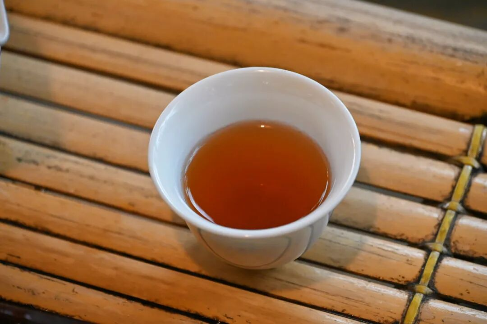

茶叶这东西，

做不了假，

好喝全来自于真材实料。

比如这枚神奇的罗汉果，

产自广西金江村。

有着香蕉和花生的清甜味。

选用云南临沧凤庆

陈放七八年的熟普洱，

条索紧细匀整，色泽红褐润显毫。

再配以整朵的上等胎菊。

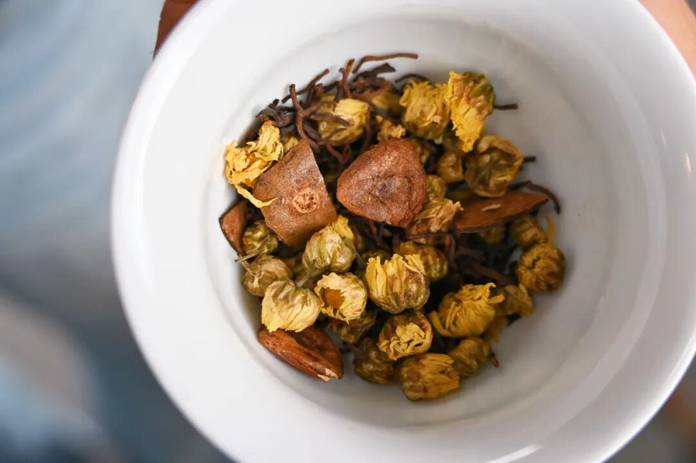

习惯性拿盖碗来泡，

倒茶，注水，

很快空气里就漫出普洱茶的香气～

入口有很明显的胎菊清甜，

罗汉果在其间若隐若现，

带一点点冰凉感，

像给嘴巴开了加湿器？

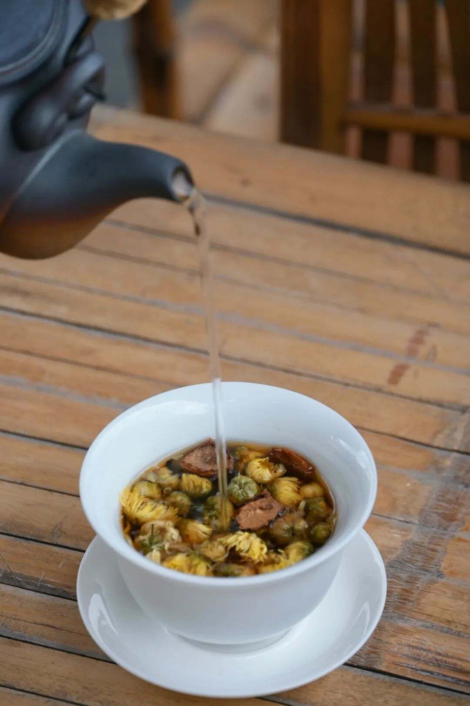

5.金桔蜂蜜酒

这一瓶「外面买不到」的
——饱记·金桔蜂蜜酒。堪称产品同事今年的得意之作。从上半年开始，费了好些功夫，跑完融安跑四川，跟酒厂磨出来。

倒出来直接喝，有浓郁的柑桔香气，入口顺滑，回味悠长，唇齿间会留有微微辛辣感。

金桔的风味，

是从融安自采了 3000 斤

正宗融安滑皮金桔，

果脆、芯甜、籽少，

拉到四川酒厂酿制。

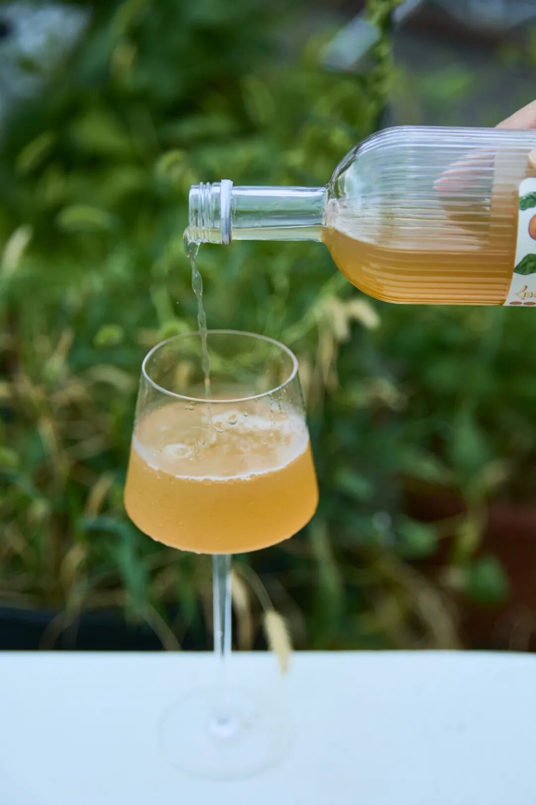

还用上了传统葡萄酒酿法，

整颗金桔浸皮萃取，

从而使更多果实风味向酒液转移，

带来浓郁柑桔香气。

蜂蜜也有来头，用的四川本土产蜂蜜，在高山凉爽的气候下发酵酿制，甜而不腻，鼻尖能闻到丰盈的蜂蜜香嗷～

最后卷了一下包装，设计了定制束口袋，送礼自留皆适宜，酒喝完了收杂物也没问题！

饱记·冬日茶饮折扣专区
购买方式如下

双十二限时 88 折！！！

戳图购买👇

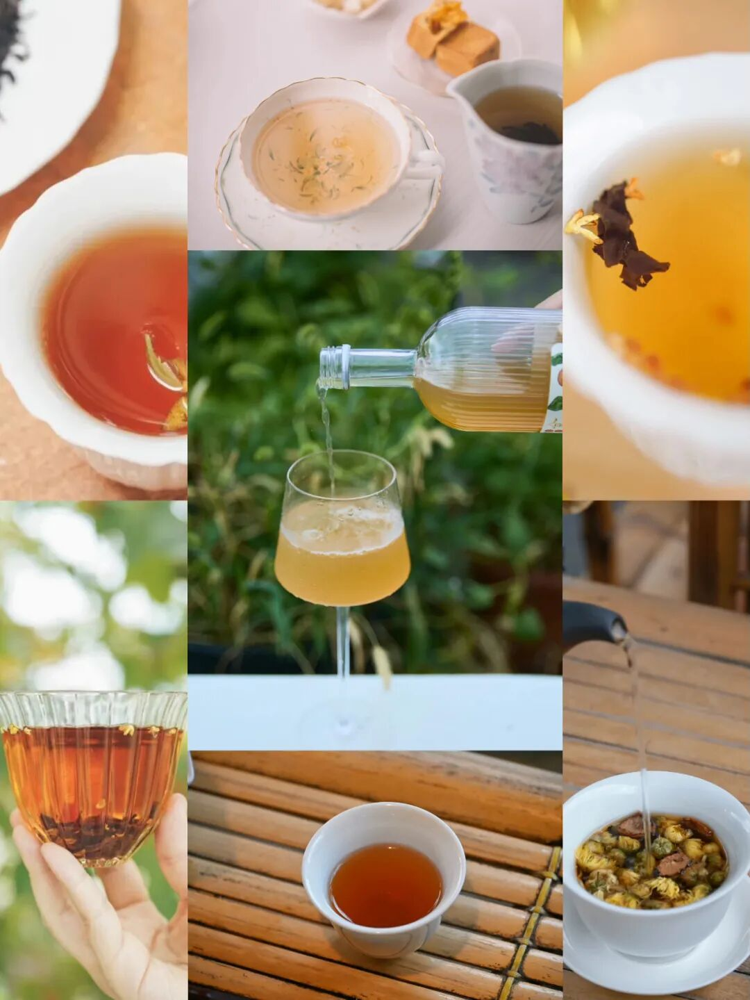

指路完毕！再说一次：直戳小🍊序购买或者去天🐱凑单（300-40）都可以！今年最后一次薅老板羊毛！
别让她毫发无伤啊啊啊啊！！

题 外

还有还有！

其他值得一吃的时令风味看这里👇

不用凑单不用研究，

通通给到双十二全年地板价！

昨天刚到的广西双拼芭乐，

扎实的冰激凌球口感！

上周刚来的涌泉蜜桔，

米其林同款！但价格却帮大家打了下来！

真正的汁水如泉涌！空调房里吃正合适！

此外还有今年份的象山红美人，

入口似果冻般嫩嫩滑滑～

坚持真材实料、天然肠衣的手工腊肠，
能做煲仔饭和火锅的玫瑰露酒腊肉&腊排骨

苏南蟹标杆美味：太湖流域大闸蟹

苏北蟹宝藏性价比之选：洪泽湖大闸蟹

有小时候番茄味的云南西红柿（快没了，

还有打遍天下无敌手的山核桃！我司卷中卷产品，
拿到外面去都能打得很！具体你们看商详，今年再薅老板最后一回！冲！

饱记·广西双拼芭乐购买方式如下

双十二地板价 86 折！！！

戳图购买👇

饱记·涌泉蜜桔
购买方式如下

双十二限时 86 折！！！

戳图购买👇

饱记·象山红美人柑橘购买方式如下

双十二限时 86 折！！！

戳图购买👇

饱记·手工腊肠

购买方式如下👇

双十二限时全年地板价

戳图下单购买👇

或🍑🍑🍑搜索

「艾格吃饱了」

饱记·腊排骨

购买方式如下👇

双十二限时全年地板价

戳图下单购买👇

或🍑🍑🍑搜索

「艾格吃饱了」

饱记·洪泽湖大闸蟹

购买方式如下

双十二限时 86 折！！！

满足装洪泽湖大闸蟹：

3 两母蟹，4 两公蟹。

性价比之选！

劲爽装洪泽湖大闸蟹：

3.5 两母蟹，4.5 两公蟹。

饱记热销款。

尊享装洪泽湖大闸蟹：

4 两母蟹，5 两公蟹；

或 5 两母蟹，6 两公蟹。

实际超重，量极极极少，送礼佳品。

人工精挑，

上岸后静养一两日更鲜美，

每日限量 100 箱。

顺丰快递发货，新鲜看得见。

戳图下单购买👇或🍑🍑🍑搜索「艾格吃饱了」

饱记·太湖流域大闸蟹

购买方式如下

双十二限时 86 折！！！

三种搭配：

满足装，

3-3.4 两母蟹，4-4.4 两公蟹，

吃过解馋。

劲爽装，

3.5-3.9 两母蟹，4.5-4.9 两公蟹，

可以拍照发朋友圈争奇斗艳。

尊享装，

4-4.4 两母蟹，5-5.4 两公蟹，

顶格水准，适合送礼。

人工精挑，

上岸后静养一两日更鲜美，

每日限量 50 箱。

拼的就是手速。

顺丰快递发货，

新鲜看得见。

戳图下单购买👇或🍑🍑🍑搜索「艾格吃饱了」

饱记·云南西红柿购买方式如下

双十二限时 86 折！！！

戳图购买👇

饱记·临安山核桃

购买方式如下👇

双十二单罐 9 折！！！

双罐 86 折！！！

戳图买它👇

或到🍑🍑🍑

搜索「艾格吃饱了」

本文的研究员

薯角多吃点，好过冬

用好吃的方式吃一生

祖国各地好风物

文章转载请加微信「baojiclub」

