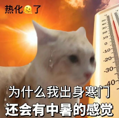
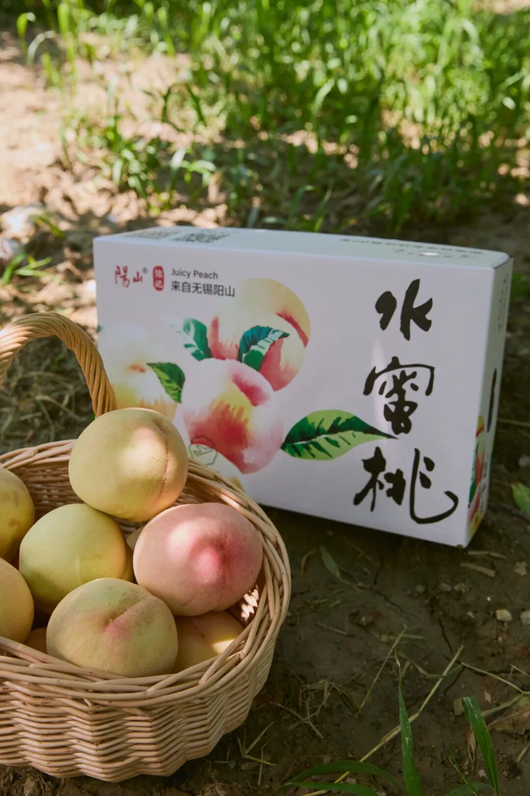

# 最好的季节，最仙的水蜜桃（最后几天

- 原文链接: https://mp.weixin.qq.com/s?__biz=MjM5NTYxODQyMA==&mid=2653455725&idx=1&sn=09e510f3628cf855a8f835d7113c7419&chksm=bc3c473e89b987cd9ff5315c950f5e9384e3e8ac460fc1c44c7f8c010e5497ac669985524386&scene=27#wechat_redirect
- 浏览量: N/A
- 点赞数: N/A
- 评论数: N/A
- 转发数: N/A

## 正文

正宗阳山水蜜桃

一个尽情安利自我的公众号

以下是没事干研究院的风物研究报告请放心食用

最近江浙沪的天气真「好」哇，好就好在性价比。
本薯从上海跑了一趟无锡阳山，便仿佛又到了火焰山，立省千元机票！真是给我赚到了

顶着大太阳出门，全为这一颗，——矜贵万分的阳山白凤水蜜桃～果期转瞬即逝，一不留神，只剩最后几天。

经历了漫长的梅雨季，此刻在树上晒得心满意足，当地果农说，要让它们晒足一两天再发货，静悄悄积累些糖分，更甜～

阳山白凤之所以闻名，主要因其个大形美，水灵灵，沉甸甸，白中微微透出一些粉，年年此时，都是外貌协会送礼首选～

吃起来嘛，最明显的是香气，桃林里刚摘下来，一进室内便散发浓郁的芬芳蜜香。且汁多清甜，
撕皮时像拧了水龙头，举起来吃桃汁直流到胳膊肘！

熟果徒手捏软后，

轻轻一挤就爆汁～

甜，但不是那种蜜蜜甜，入口是清爽的软嫩细腻，所以一个人也可以吃完一整颗，甜而不腻～

不同年份因为天气原因，
风味会有些许的差异，但随手拿几颗测测，糖度基本都在 12-13 左右。

不过吃阳山桃，还得分辨一下真假。市面上的阳山水蜜桃大多是假的，因为正宗阳山水蜜桃只占市场 30%，核心种植面积就那么 2w 多亩～

但卷产地这件事嘛～我司向来无所畏惧，首先是桃农协会的授权证书！

饱记合作多年的果园，是核心产区的基地，地下水喷灌，用机器代替人工，不打除草剂。

每一颗都由人工细心套袋长成，

让白凤水蜜桃光照均匀，色艳味美，

物理防虫、防鸟、防晒伤～

再由当地种植经验丰富的果农

担任挑桃师傅，

经三道人工逐粒筛选，

根据颜色、软硬程度，

只选七八分熟的好果。

虽经过精挑，

但为了避免果子在长途运输中过熟软烂，

收到手时会有一部分青绿色（左），

一部分白粉色（右），

优先食用软桃熟果，

较脆硬的果子可在通风干燥处存放 3-5 天。

两个规格，

特级单果约 6 两，限量只剩 100 份，

且发货要视果子情况等待～

优级单果 5-6 两，现货，

都是一箱 8 颗，

顺丰水蜜桃专线，

直接从果园送到你的手中！

本薯的差从不白出，

在果园里汗如雨下，

反手跟老板薅来一个高温折扣，

「这么热的天我还要卖货我容易吗？」

所以阳山白凤水蜜桃，现在 9 折！！

老板上火我降温！冲啊！！！

饱记·无锡阳山白凤水蜜桃购买方式如下👇限时 9 折！！
一年一季，久别重逢。
纯正无锡阳山核心产区，
一个枝头只结一只果。
每日清晨壮年树上现采，7-8 分熟，
挖一勺，像吃浓郁冰淇淋！
两种规格：特级·阳山白凤，单果约 6 两，限量 100 份，要等！一盒 8 颗装，适合分享送礼。优级·阳山白凤，单果 5-6 两，一盒 8 颗装，留家自己尝尝。

戳图买它！！！👇

题 外

同样降温解暑的还有，
比阳山白凤更为矜贵的增城荔枝，很贵，因为天气原因价格比往年翻了一倍，所以打不起折hhhh但依然甜润好吃！浓郁的荔枝味儿～还有接班小白杏的新疆阿克苏小红杏，全国最甜的杏子（之一也是降温 9 折！
饱记·增城荔枝购买方式如下
一骑红尘妃子笑，说的就是增城！自古以来的岭南荔枝名产地～桂味、糯米糍和仙进奉，3 个品种，都是 3 斤装，小家庭吃吃正适合！
桂味、糯米糍、仙进奉，都是下单后 5 天内发，
饱记多年合作果园，只让有经验的老农采摘，只选树上熟！甜度高！滋味更饱满！
凌晨采摘，放冷藏预冷，当天直接从果园冷链车运输到机场，
减少荔枝脱温时间，为的就是新鲜！
戳图即可购买👇

饱记·新疆阿克苏小红杏
购买方式如下限时 9 折！
小白杏根正苗红的接班人！——新疆小红杏，熟成啦！软糯绵甜！！糖度 26 左右，小白杏通常是 19～
长在阿克苏核心产区的小红杏，喝着天山雪水长大，
连肥料都是羔羊粪便混合谷子发酵成的天然农家肥料。
两个规格，都是三斤。家庭装：果子颗数多，但是小一些，单果在 13g 左右；果王装：杏如其名，单果能到 20g！

戳图买它👇

本文的研究员

薯角

软桃党有话说！

用好吃的方式吃一生

祖国各地好风物

文章转载请加微信「baojiclub」

