# 最灵的食材，清水烫烫也好吃

- 原文链接: https://mp.weixin.qq.com/s?__biz=MjM5NTYxODQyMA==&mid=2653457886&idx=1&sn=50effb745fa368bb08221f4bc33bf323&chksm=bc3d00fed8e7535b3786d81f8a0b88ef859babc117eea84f4edf833eacdd98ae33daeb121eff&scene=27#wechat_redirect
- 浏览量: N/A
- 点赞数: N/A
- 评论数: N/A
- 转发数: N/A

## 正文

菌子上架的前后

每周消费报告
除了宣传饱记均没有广告软文请放心食用

上个月去云南吃了一大圈菌子。

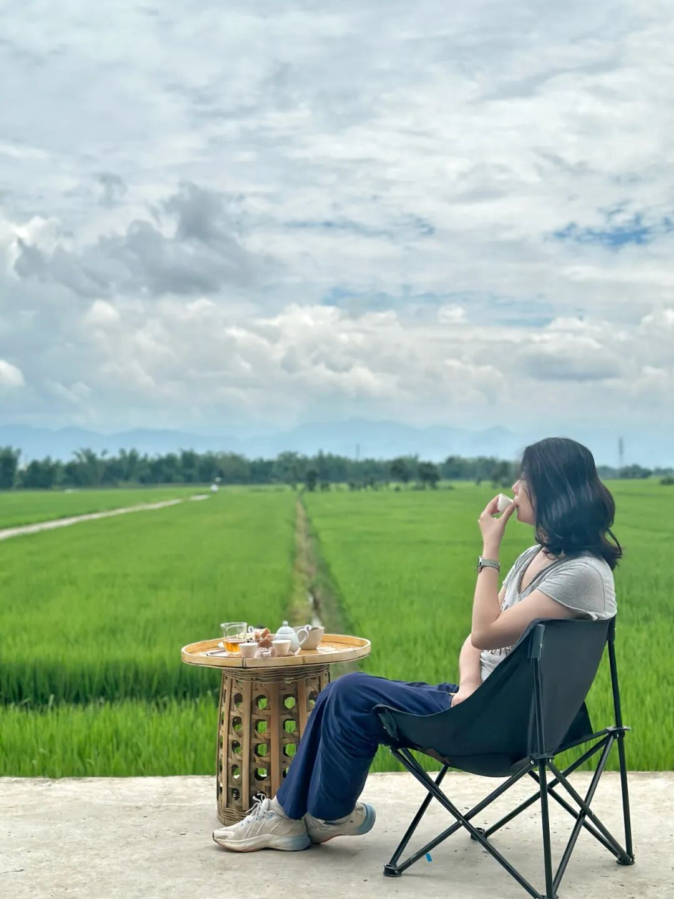

德宏芒市的稻田咖啡，真是来这里都获得人生照片

去了才真切感受到，

这个季节的云南人民是极度幸福的。

他们所谓的菌子，

全是山上野生的。

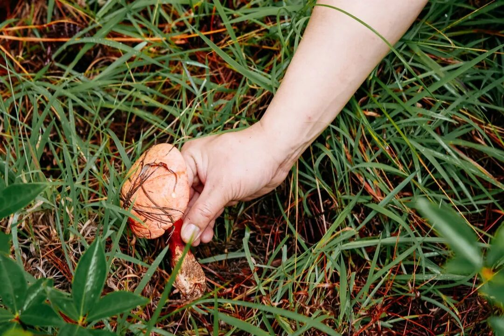

云南人认定野生的是菌、种植的是菇，

菌子全部是像靠这样的阿姨，

上山去拣的。

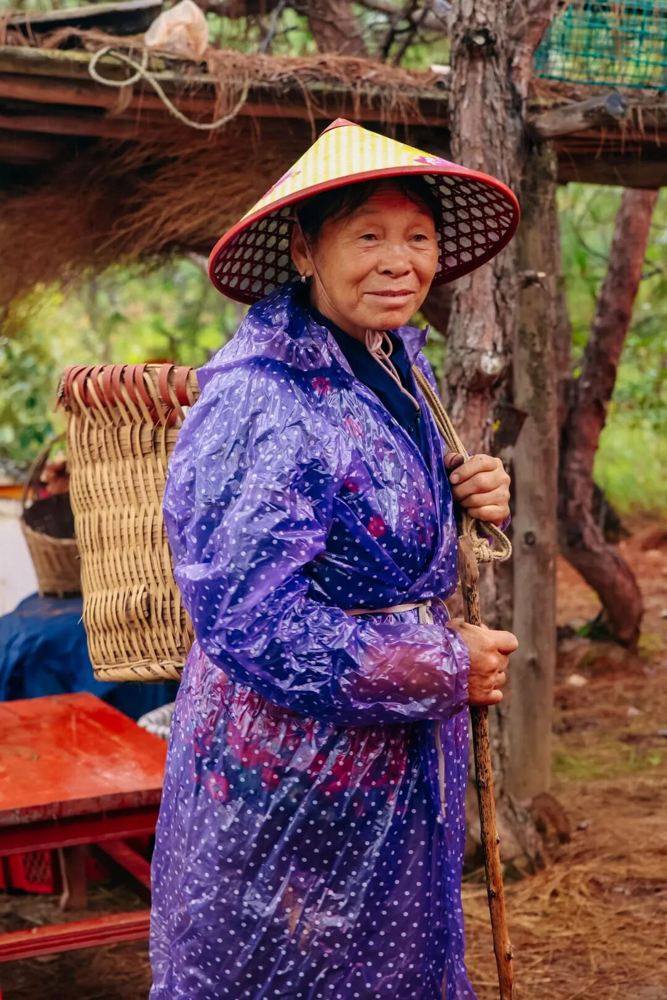

而菌子大量进入云南人民的生活，

也就是这几十年的事。

和其它林业资源丰富的省份一样，

云南此前经历了一波养山还林的工作，

在山上种植了大量的针叶林，

看，也就是各种松树。

固土防风保护生态不说，

同时催生了大量的野菌子。

勤劳勇敢的云南人民，

很快就在鲜美和迷幻中找到了不毒的那些！

有些微毒的则发明了合适的烹饪方式～

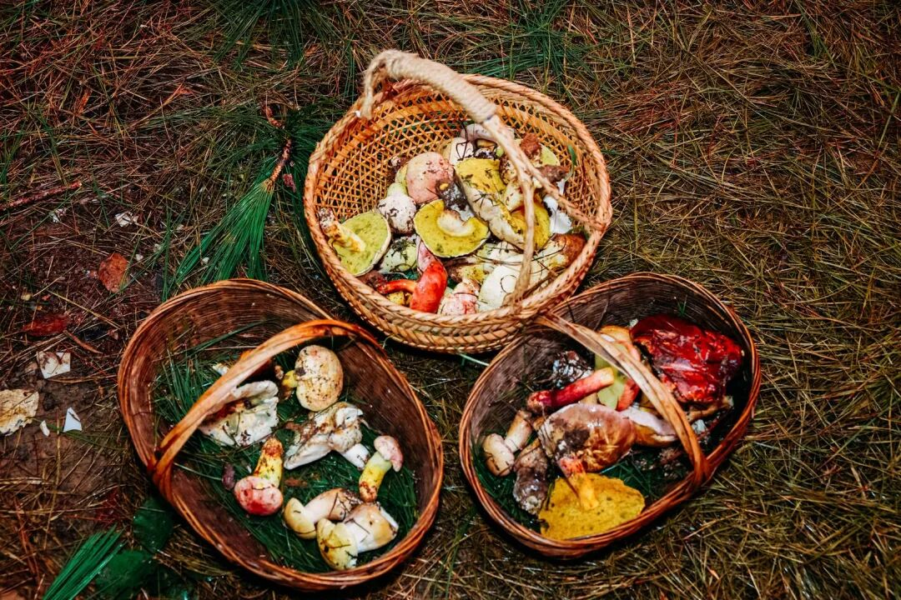

比如牛肝菌，大多有微毒。

大厨在柴火大灶上是先用猪油把菌子爆炒香，

再以没过菌子的水 / 鸡汤煮透。

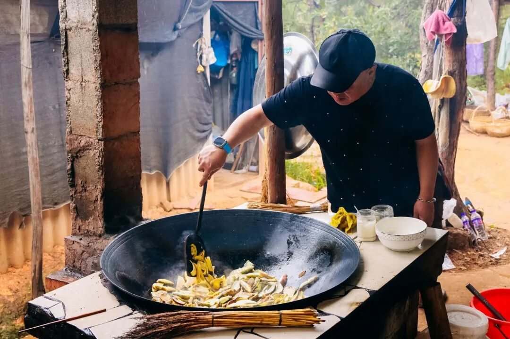

这是国内云南菜天花板、泓 0871 的主理人刘新师傅。他们每年夏天给餐饮同行做一次菌子认知团旅行，均为全程自费

最后再下干鲜辣椒等食材爆炒，

这样才入味又鲜嫩。

我一位香港朋友听了，

立即感叹还是跟大厨能学到东西，

之前她为了防毒都是硬生生炒透的，

牛肝菌便失去了肉感，干干的。

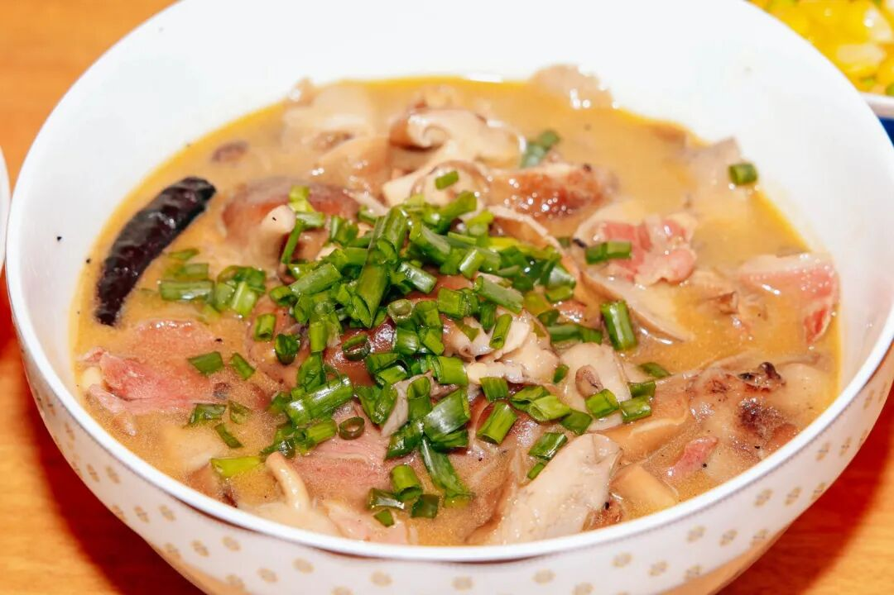

而好出品的菌山，

大多是承包的，类似果园。

所以最上等的菌子，

也不是昆明木水花批发市场里随便能买到的。

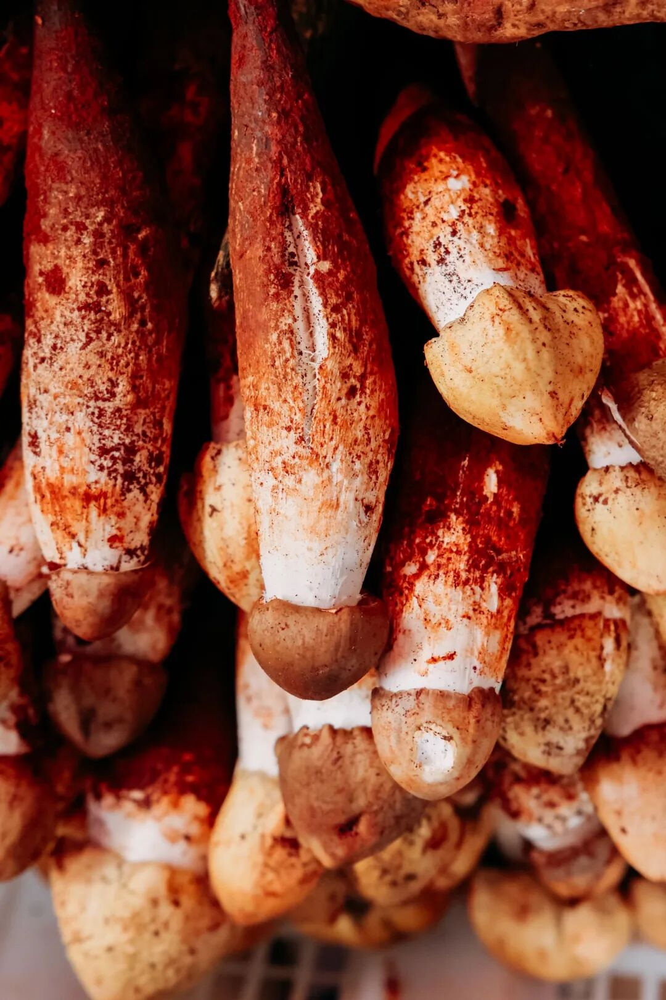

我被带去看的菌山，

供应以新某记为首的米其林黑珍珠餐厅，

像干巴菌这样难处理的菌子，

饱记是要求和新某家发货一样标准的，

全处理干净才能发。

云南人认为的上品菌子，

首属干巴菌。

高级云南馆子最新出品方式，

是让服务经理像淮扬米其林餐厅

出扬州炒饭一样，堂炒。

‍还是来自泓 0871

而干巴菌炒饭比扬州炒饭更惊人许多之处，

是它一边煸炒，一边就满屋浓郁的香气，

正如意大利白松露这种东西，

你的价钱一半花在刨在面条里时散发的香气，

参见大 S 那碗一万块的分手松露面

干巴菌的迷人之处，

也在于这种煸炒时逼人的香气！

如果天使有肉香（不是

那大概就是这个味道！（不是

但干巴菌也很贵，

像这样大朵优质、米其林同款的就更贵。

你可以从我们三拼和四拼野生菌

礼盒的价格里看出来。

饱记的来源和成本和餐厅都是一样的，所以，只要你愿意自己做，划算

另一种云南人当季的至爱，

是鸡枞。尤其像这种大枝的黑皮鸡枞菌。

这东西，吃的就是一个脆感，和甜感，

要不烫火锅，

要不和火腿切片蒙紧保鲜膜一起蒸。

好的油鸡枞，

我们是翻遍了云南地头工厂（尤其是文山一带

都没有人能做好的。

真认真做一份，也很贵。

我的文山朋友给我寄了几包油，自家制的，

他说没有秘诀，

就是找最大最好的当地鲜鸡枞，现做。

成本超过 1500 块。

这事儿吧，我回头也是想整的。

不过等大家今年先尝了鲜的再说呗。

我们也需要更深入云南地头，

才能有更多【外面买不到】的好东西。

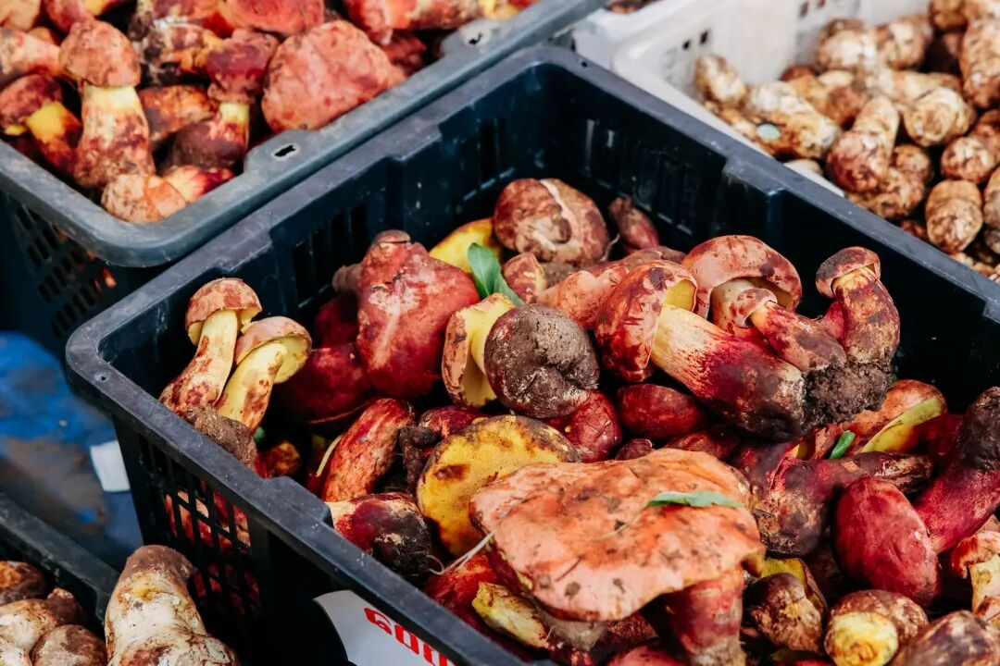

出了昆明，有一些农家乐做菌子，

他们就很简单：土鸡汤里放大红菌，

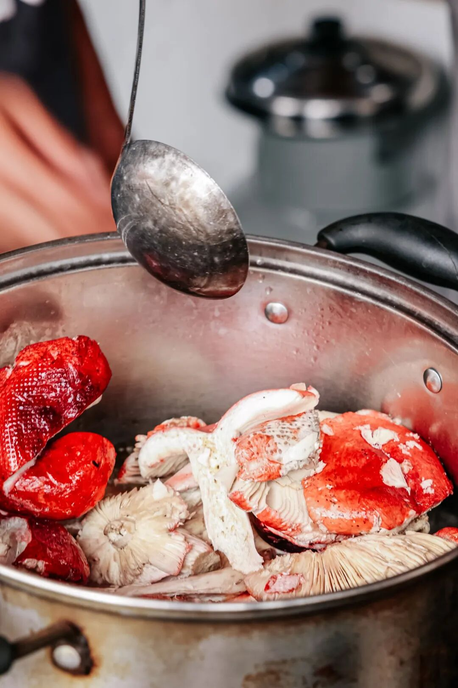

其它的菌子拣当天新鲜上好的炒几盆来，

很多配菜都雷同，不用说味型。

但云南菌子本身就够天然美貌，

这么吃一桌，居然不腻。

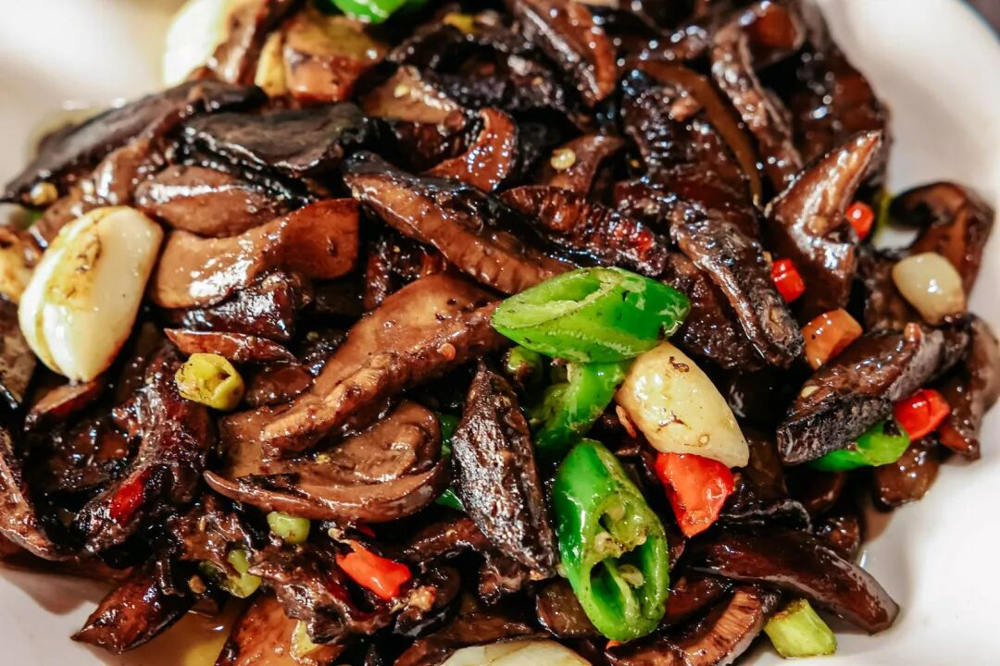

刘新师傅在昆明和另一位大厨

合伙了一家新餐厅，

当天搞了 28 道菌子菜。

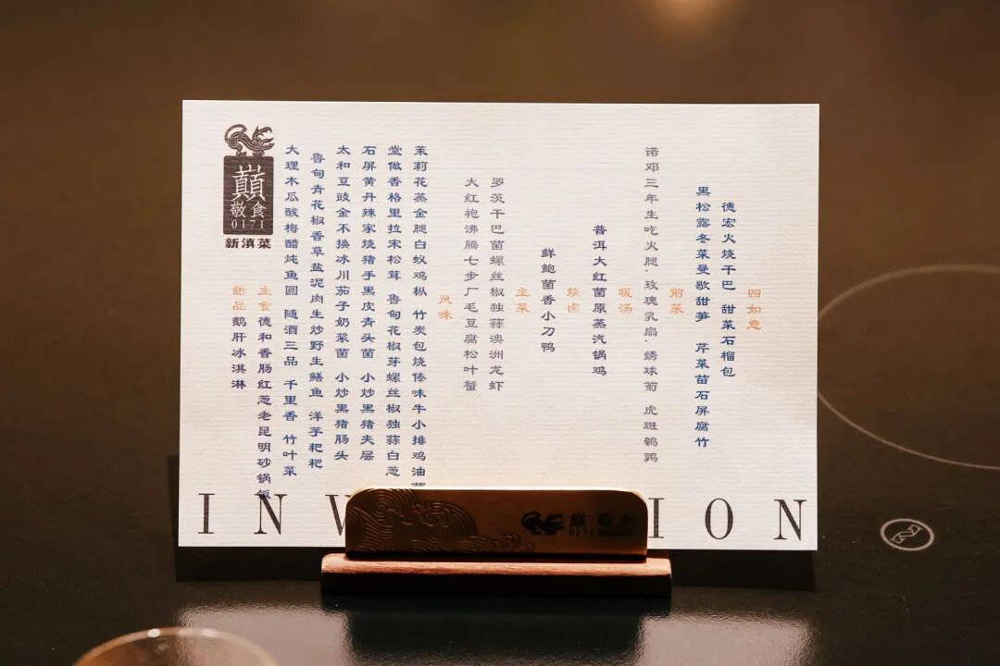

哈哈哈有吃到我扶墙，

昆明的朋友可吃，

颇有一些菜很不错。

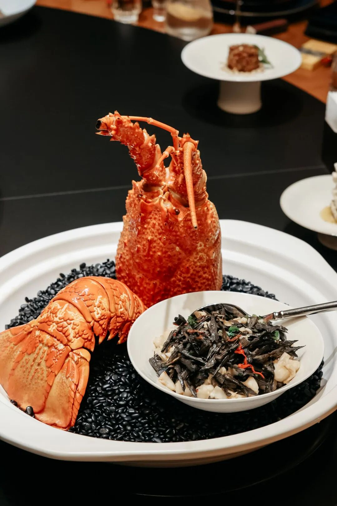

我喜欢这个干巴菌炒大澳龙，暴发户吃法hhhh但真香！

另外也还吃了一些店。

比如昆明的菌言，

用这种方式做大阉鸡和松茸汤：

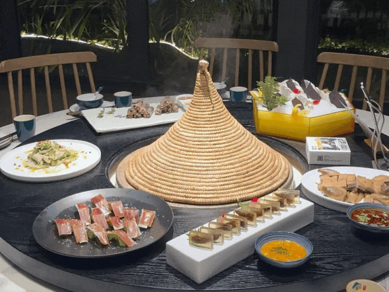

‍

打开香气直冲天灵盖，

其柔和鲜美，

像劈开脑海一般印象鲜明。

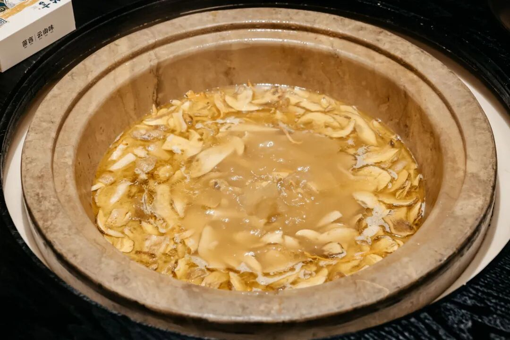

就是在这样的品尝和比较中，

我和刘新师傅及餐厅们的供应商

「菌王」林师傅讨论，

给饱记上架了 4 种野生菌。

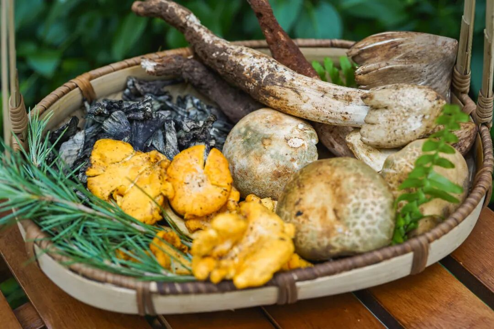

‍

松茸，是要香格里拉的好。

林师傅也说我们的多年合作伙伴有名气。

今年价格有比往年低的，

大家看看，这个在家就是刺身最好吃，

或者直接扔在鸡汤里，包管爽呆！

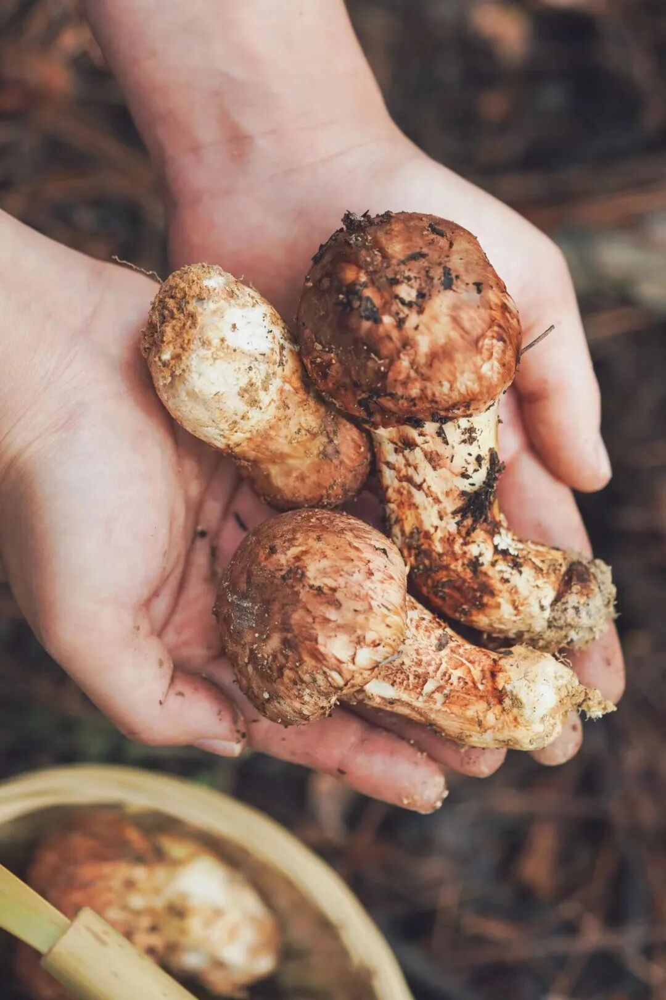

同时， 我们还请泓 0871 的主厨飞哥给

大家做了野生菌礼盒的菜谱。

四种菌子大厨家常做法戳👇

云南野菌子四种，米其林同款的鲜

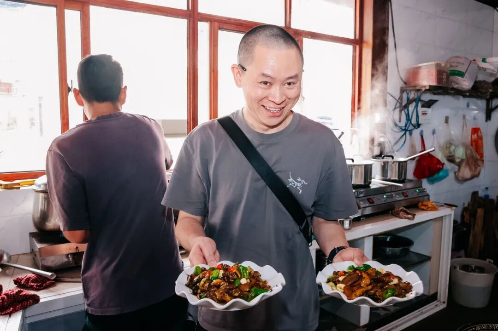

就是这位大哥hh 在农家乐给我们端菜

而我懒得下厨，

在家只拿干巴菌煸炒米饭，或者炒蛋，

闻个香气。

余下几种，直接下清汤火锅，

最后淘饭，鲜美无比。

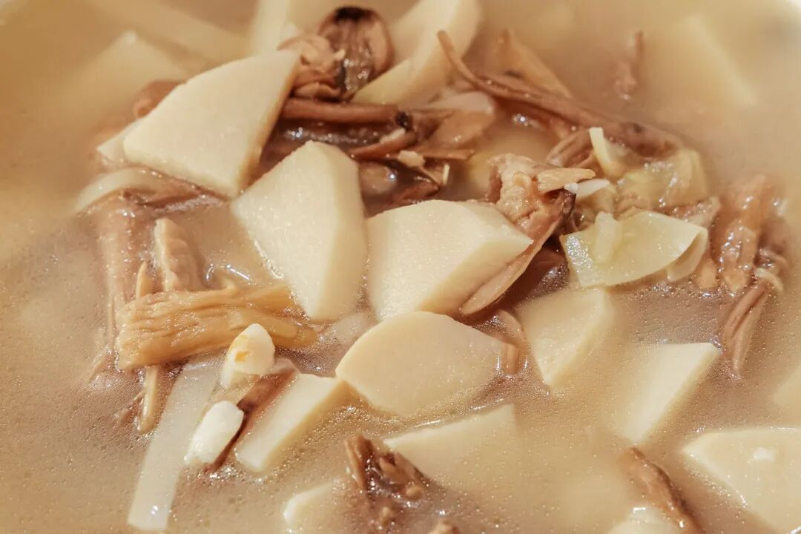

淘宝买点云南的大甜笋，切块和菌子们一起煮，也是鲜美无比

在朋友圈看到刘新师傅 po 了一碗野菌盖饭，

也请大家鉴赏！

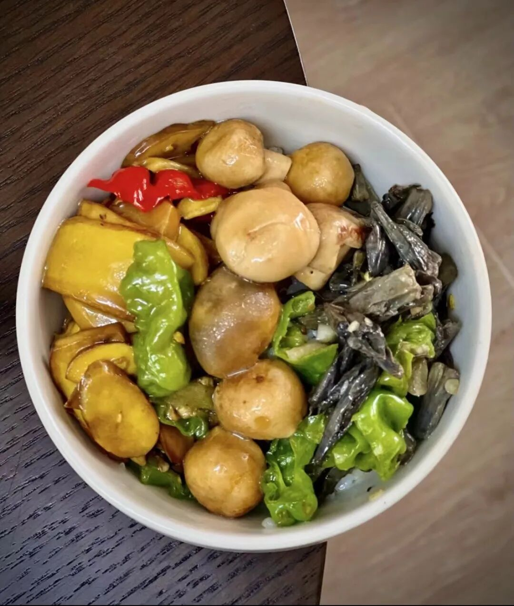

这是他当天的员工餐

总之，云南菌子，

就是一种本身天赋异禀的食材，

真正清水烫烫都好吃。

今年很多餐厅都有菌子季，我们也上了礼盒，

大家吃得开心～

饱记·野生菌子礼盒
购买方式如下

新上了两种规格，

每种菌各 100g，

适合家里一起尝尝鲜！！

分享装

野生菌四拼

（干巴菌/青头菌/鸡油菌/鸡枞菌各 200g）

野生菌三拼

（青头菌/鸡油菌/鸡枞菌各 200g）

体验装

野生菌四拼

（干巴菌/青头菌/鸡油菌/鸡枞菌各 100g）

野生菌三拼

（青头菌/鸡油菌/鸡枞菌各 100g）

顺丰空运次日达，

看得见的新鲜！

戳图买它👇

饱记·香格里拉野生鲜松茸

一口价！打不起折！

购买方式如下

饱记的鲜松茸，

采自海拔 3500 米以上原始松木林。

只发 1-2 级符合出口标准的松茸。

新鲜采下送冷库保鲜，

冰袋+吸水纸保鲜，顺丰发出。

戳图买它👇

或🍑🍑🍑搜索

「艾格吃饱了」

题 外 一

还有一些好折扣，

薯角我一并呈上！

外面买不到的奶黄月饼，

半岛嘉某楼奶黄月饼的创始配方，

邀请米其林大厨调整减糖，

趁还在预售，早鸟 86 折！！

卷了三年的云腿酥，

嚼得出宣威火腿的鲜甜，

限时 9 折！！！

以及非常懂事的
海南黄金百香果，正宗钦蜜 9 号，蜜蜜甜！限时早鸟 86 折！

饱记·奶黄月饼礼盒
预售中！！！限时早鸟 86 折！！
饱记独家配方，外面买不到！
🥮 新鲜手作，外皮酥脆，内里奶香浓郁～
每日限量 100 份。预计八月底按下单顺序发货～
戳图买它👇

饱记·滇式云腿小酥
现货！！！限时 9 折！！
传统滇味经典，新鲜手作，浓情四溢。
🥮四个口味：经典云腿、蛋黄云腿，黑松露云腿、白松露云腿。
🥮三种规格：云腿酥礼盒全家福（四个口味各 2 枚）云腿酥礼盒双拼（经典云腿小酥*4 枚+蛋黄云腿小酥*4 枚）
云腿酥礼盒囤货装
（经典云腿小酥*30 枚）
戳图买它👇或到🍑🍑🍑搜索「艾格吃饱了」

饱记·海南黄金百香果购买方式如下限时早鸟 86 折！！
正宗钦蜜 9 号，来自海南热带水果原产地
不同于紫皮品种，吃的就是这口甜。
戳图买它👇

题 外 二

有时真为一些食物不平，
这么好吃怎么无人问津？？两个口味的招牌梅饼，
天然酸甜的黄桃干与空心山楂球，
越啃越香脆的圆墩墩玉米浪，还有扎扎实实的午餐肉片～以及招牌南乳香葱蛋卷等，含泪临期清仓，都是实打实的折扣！！无需凑满减！⚠️PS：清仓产品临近效期，介意慎拍～

饱记·临期清仓专区
5 折起！

清仓产品临近效期，所以巨折，但自家吃吃没问题！介意慎拍～
「临期清仓」专区，5 折起！！清仓产品临近效期，介意慎拍哦～戳图买它们！！👇

本文的研究员

闻 佳就是那个研究院嘴里「挑剔的老板」。关于食物，不是比你懂得更多一些，只是比你花了更多的冤枉钱。

用好吃的方式吃一生

祖国各地好风物

文章转载请加微信「baojiclub」

