# 有什么好吃的时令风物在打折，可以囤了放假吃？

- 原文链接: https://mp.weixin.qq.com/s?__biz=MjM5NTYxODQyMA==&mid=2653459697&idx=1&sn=8d5daf297a993d7cc1ae2b385c088834&chksm=bc51904bf18ed438a11b72ebabb619110e4d52e0b6b5e5361d84d93a404711d1f2b361584a87&scene=27#wechat_redirect
- 浏览量: N/A
- 点赞数: N/A
- 评论数: N/A
- 转发数: N/A

## 正文

秋天的仪式感

一个尽情安利自我的公众号

以下是没事干研究院的风物研究报告请放心食用

今天还上啥班啊。。。

我看同事一个比一个溜得快！

敬业如我薯角，

生怕大家错过这些值得买的早秋风物，

来来来，你们关心一下卖货 KPI
放假躺在家里或带在路上吃，回来胖到惊艳所有人！

首先是后台千呼万唤的小零食——饱记临安山核桃！今年刚刚炒的，新鲜，不是陈货，已经跟农大合作 11 年了，而且不咋调味，减盐减糖，吃的就是原香，那滋味，不是市面一般山核桃可比的，今年雨水太多，产量只有去年四分之一，没办法，价格稍稍涨了些～趁现在还是预售，早鸟价单罐 9 折，两罐 8 折！5 号开始按顺序发货！
也划算呀！

舟山月岙梭子蟹，这种野生海蟹的海鲜味，
品质相当于米其林餐厅水准，饱记只要流网蟹，当地人都不一定能搞到的狠货，肉质那叫一个肥嫩鲜甜。吃起来满满的都是肉！靠海吃饭，一不小心就没！申来一个24 小时过节限定价，真正的手慢无！

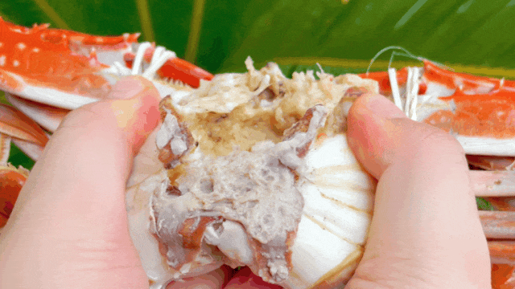

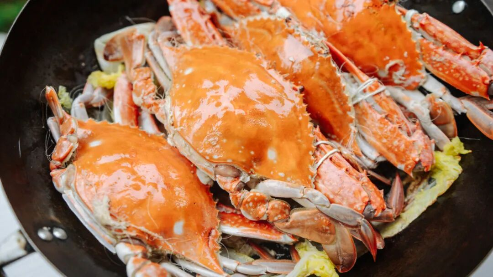

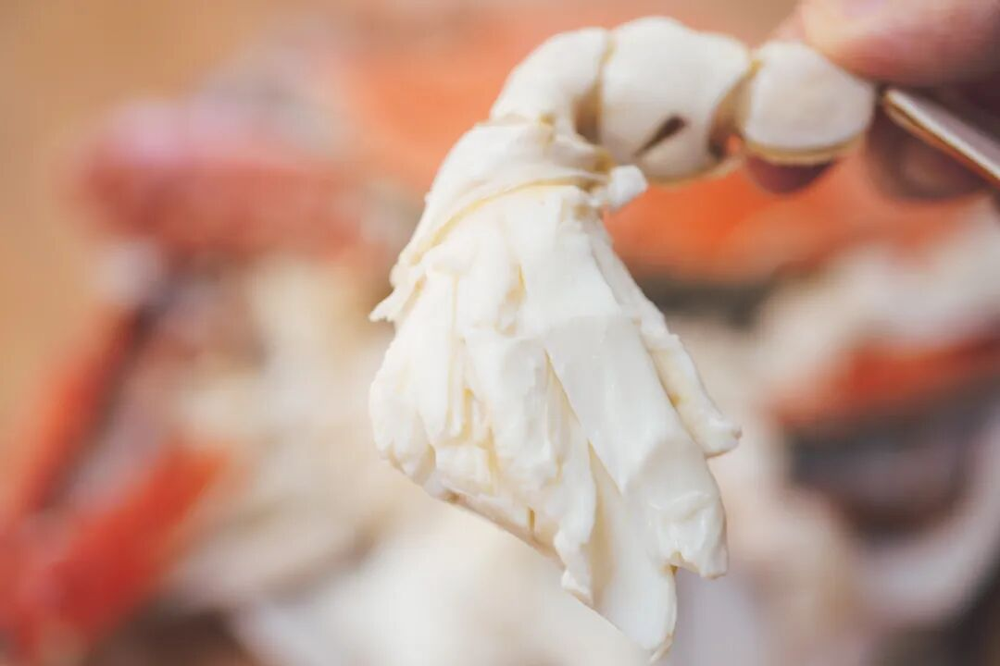

野生手钓东海大黄鱼回归！！

饱记多年合作船队，

保真 · 野生（都是纯手钓上来的

保东海海域钓的！（福建海域钓的还不如吃东海养殖

没有任何土腥气，鲜嫩油润。

大厨传授的家常零难度菜谱在这里👇

东海野生，早秋之鲜。附菜谱

同样是24 小时过节限定价，就这一天！冲！

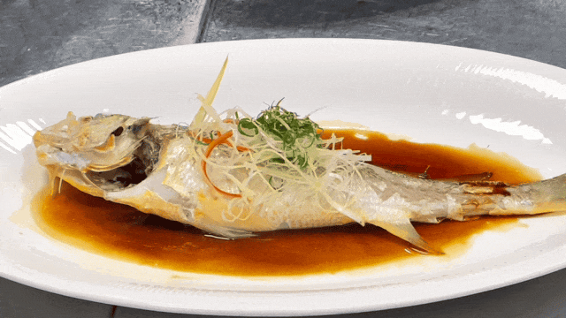

嗝，吃得差不多，肯定要来一波水果哇！都给大家薅来一个节日限时 9 折！！

阳光玫瑰，

来自多年合作的上海马陆铜奖果园。

几乎没有涩味，

而且有很好的玫瑰的香气。

皮薄多汁，爽脆又清新，

口感一级棒，

基本上是全国的天花板👍

秋月梨，

今年改了更卷的果园！

吃起来多汁，几乎无梨渣。

这个品质，

和水果店超市的随便比吧。。。

秋天吃梨，香香香～

绿籽石榴，来自云南红土地，是绿籽的珍稀品种，跟市面突尼斯石榴不同，果味很浓，而且是 30 年老树产的，个头更大，剥着吃贼带劲。

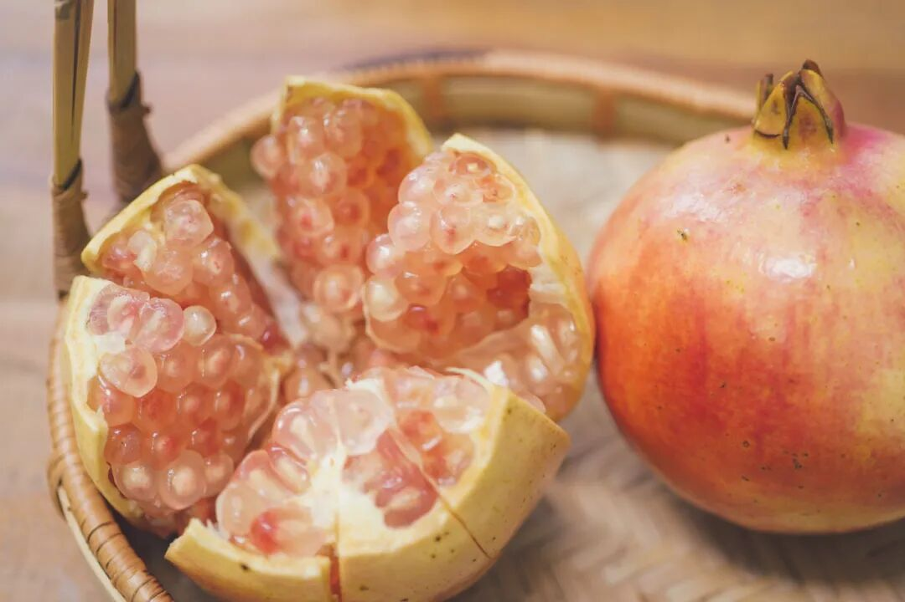

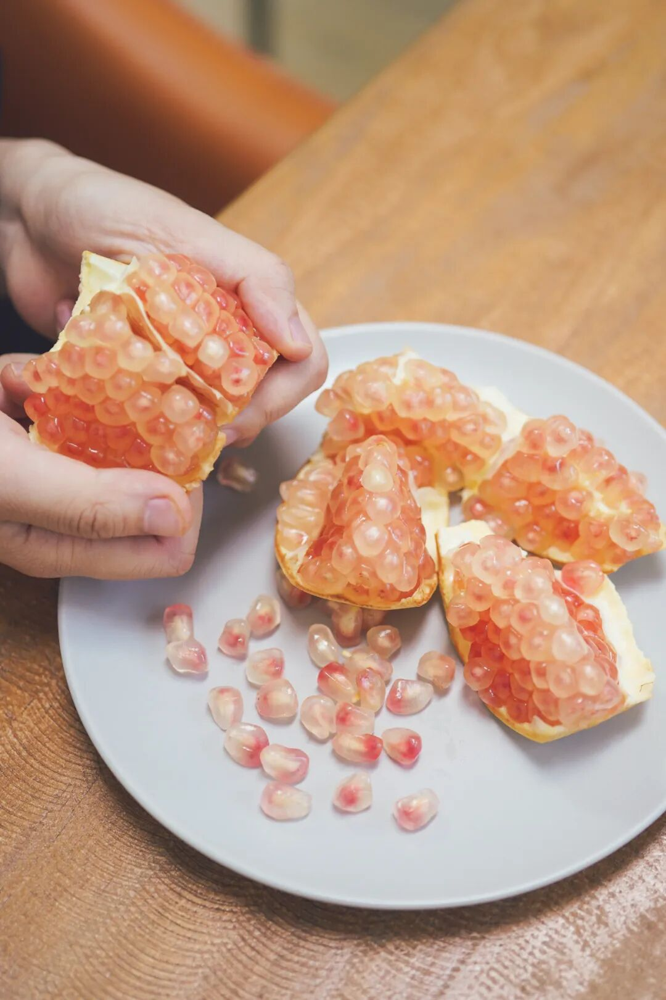

来自内蒙古的

——饱记·牛 3 网纹蜜瓜！

日本网纹蜜瓜，

到咱这以后进行改良，

这种牛 3 品种是种出来相对更甜的～

大货实测糖度 15 以上。

缺点就是到手要吃得快，

常温三天冷藏五天！

新疆至爱蜜瓜。

来自吐鲁番，

长在火焰山背面，

天山雪水浇灌长大。

蜜蜜甜，糖度高达 18 以上，

口感像吃冰淇淋！

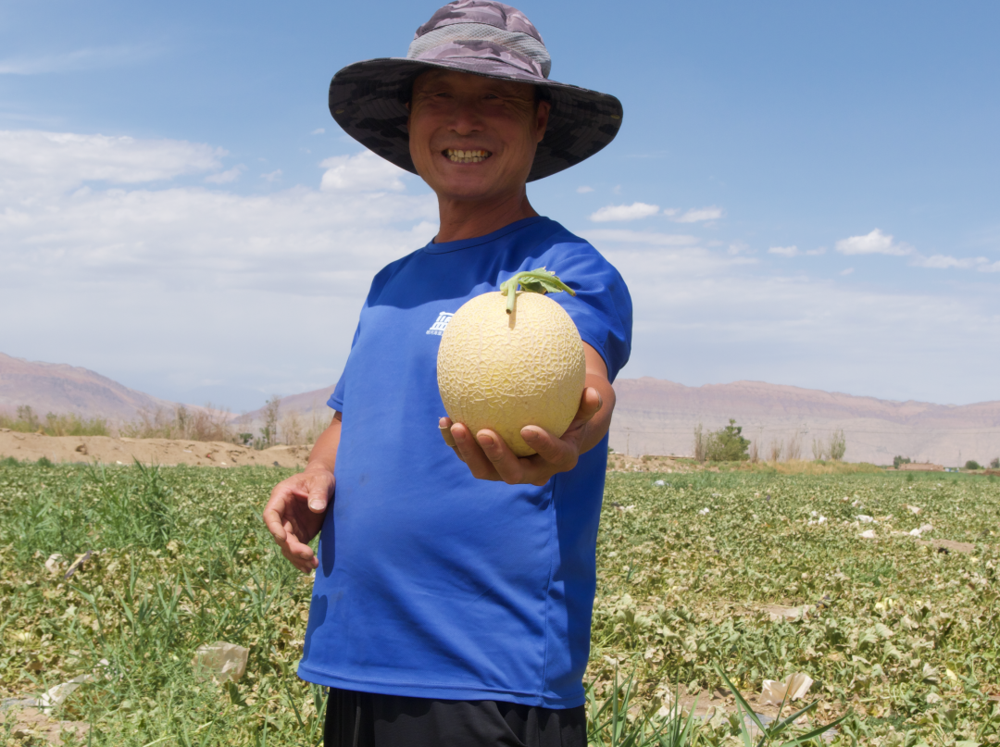

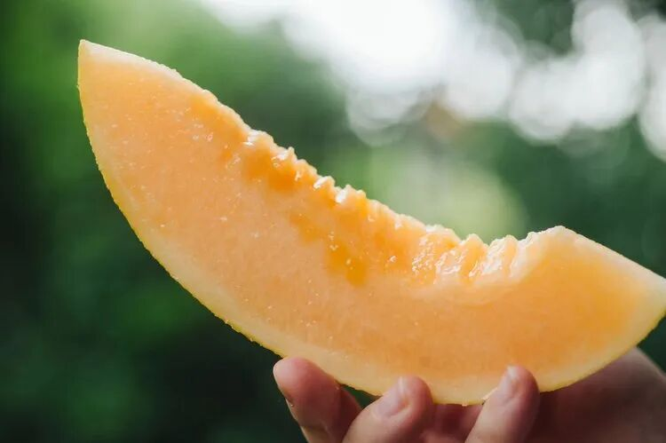

云南不一样人参果，水汪汪到爆汁。又大又甜又多汁，吃起更是奶香四溢，没有生腥味，颠覆你对人参果的想象！

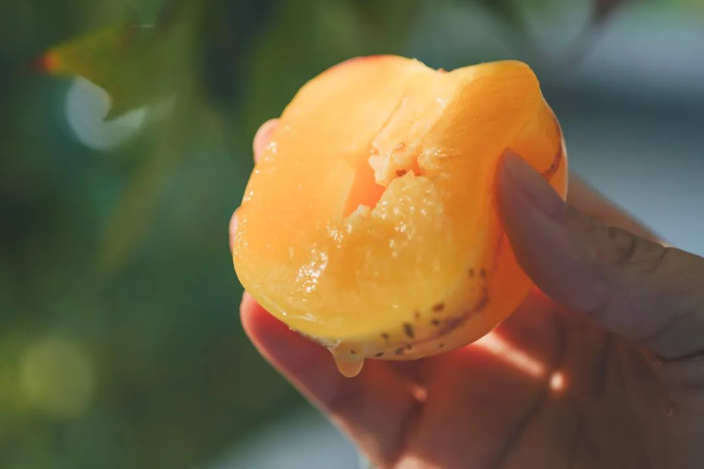

配茶可以选桂花乌龙小金罐！

按福州同事的原话，

这茶完全经得起盖碗的考验！

和市面上都是细末的调味茶不是一回事，

必须细细品味！

总之，闻起来是甜的，喝起来却有烤过的醇厚滋味！来！时令 9 折！

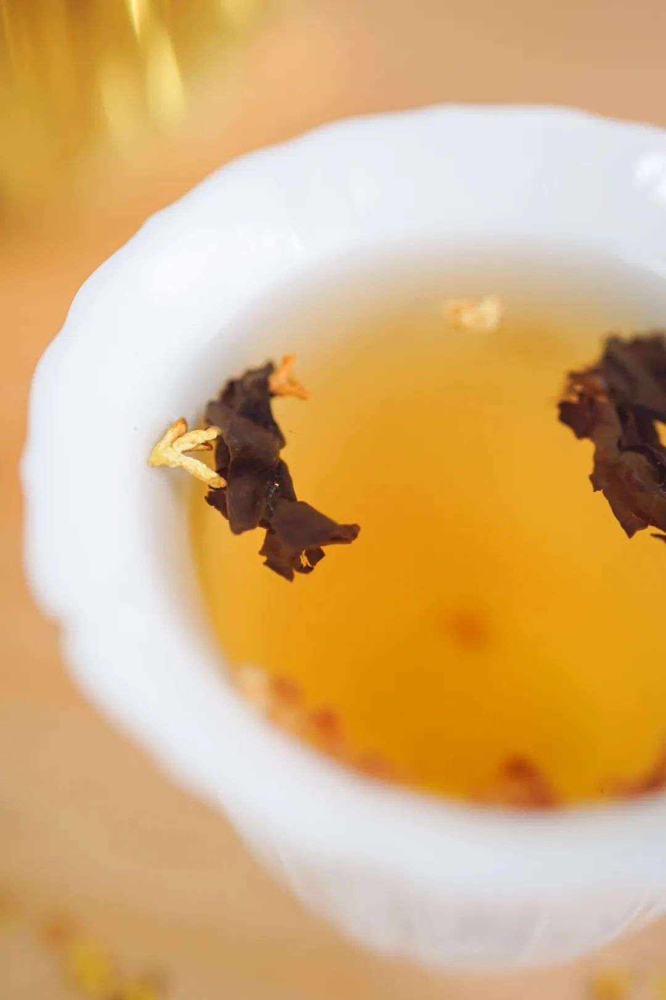

配酒，这款「外面买不到」的金桔酒，

从融安自采了 3000 斤

正宗融安滑皮金桔，

果脆、芯甜、籽少，

拉到四川酒厂酿制。

入口微辛还有浓郁的柑桔清香，

好喝到停不下来啊！

来！微醺 9 折！

诚意满满，最后也给天猫国庆折扣划下重点，
活动时间：即日起至 2024-10-7活动力度：跨店 300-30！

饱记·早秋时令风物
购买方式如下👇限时 8 折起！！
戳图买它👇
或🍑🍑🍑搜索
「艾格吃饱了」

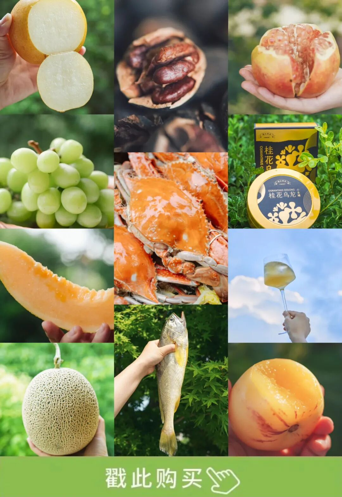

题 外

放假岂能不囤零食！

9 月新鲜到仓的大师凤梨酥，

果肉含量大于40%，

一入口就能吃到浓浓的凤梨本味。

还是最新日期！

如果只是自家吃吃，

不那么在乎效期，

也可以看看以下的

「随便清清专区」！

各种卷中卷零食茶饮，

都是限时 7 折！！

保质期都是 11 月往后，

平时提得比较少，

一次性拎出来打个折，

比员工价还划算！

不要错过，速冲！

饱记·大师凤梨酥
购买方式如下👇新鲜到货！！
戳图买它👇

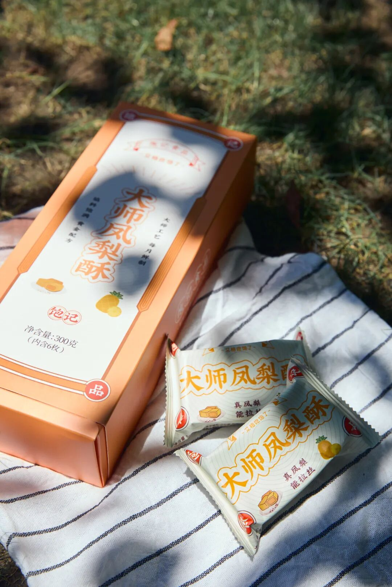

饱记·随便清清专区
购买方式如下👇限时 7 折！！！！
戳图买它👇

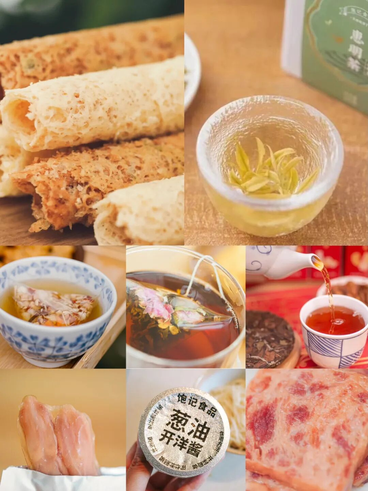

本文的研究员

薯角问山核桃的朋友人呢？

用好吃的方式吃一生

祖国各地好风物

文章转载请加微信「baojiclub」

