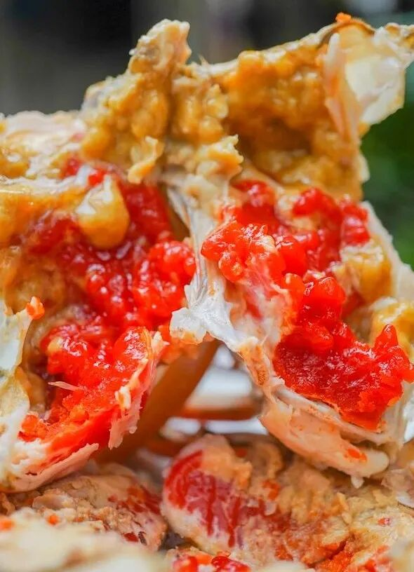
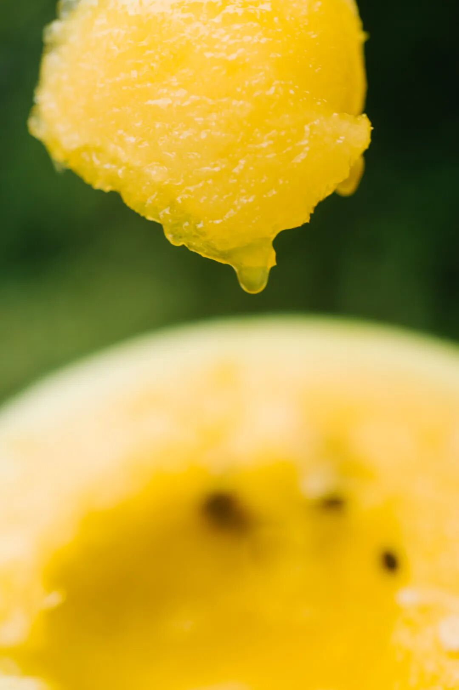
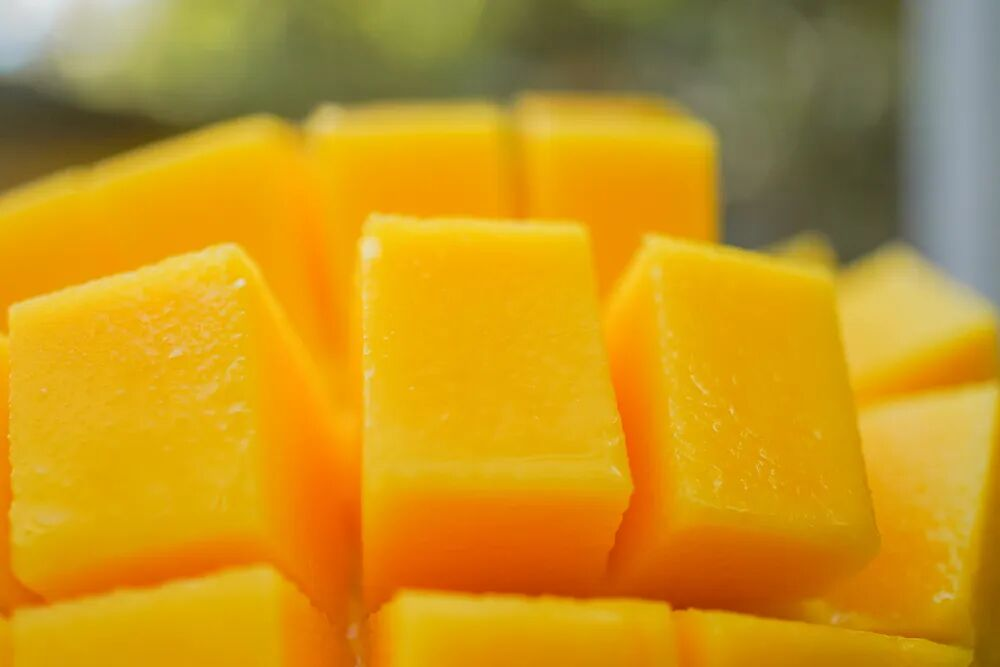
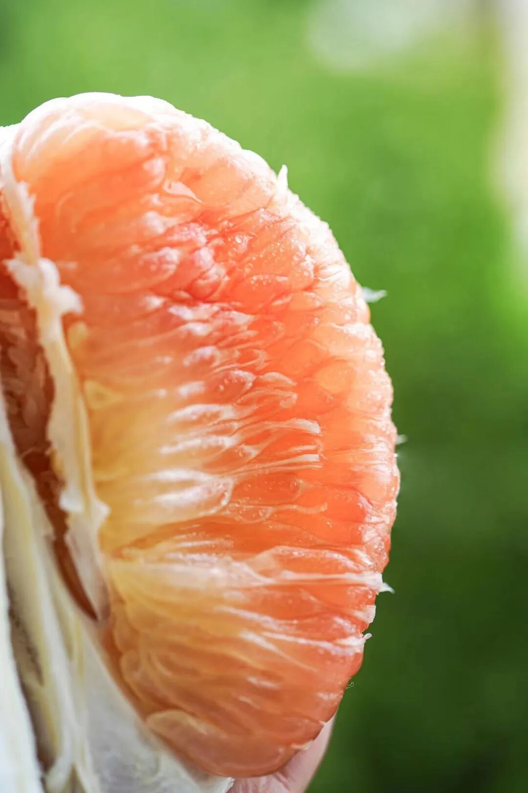
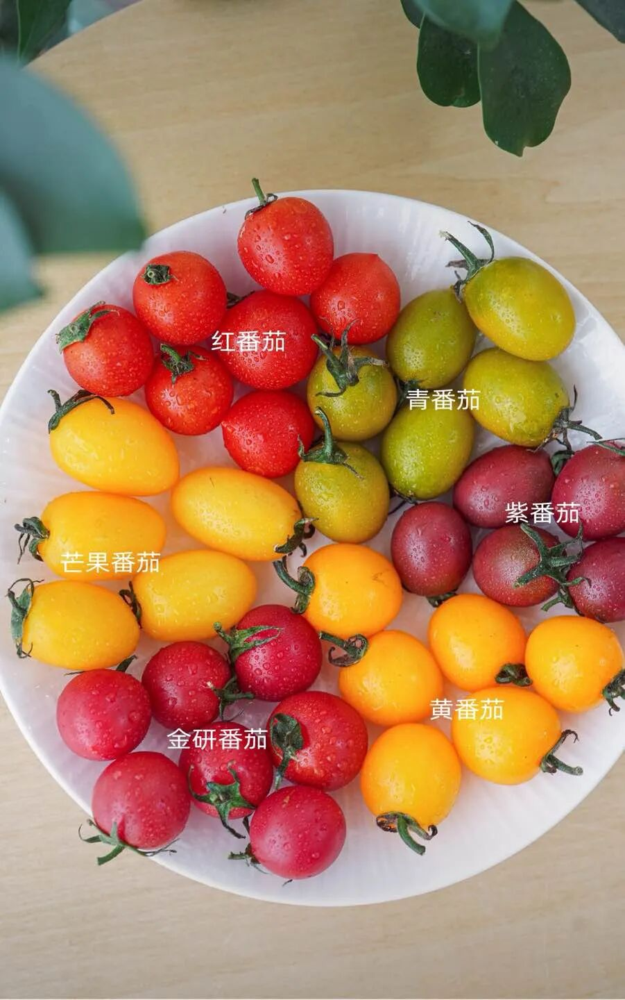
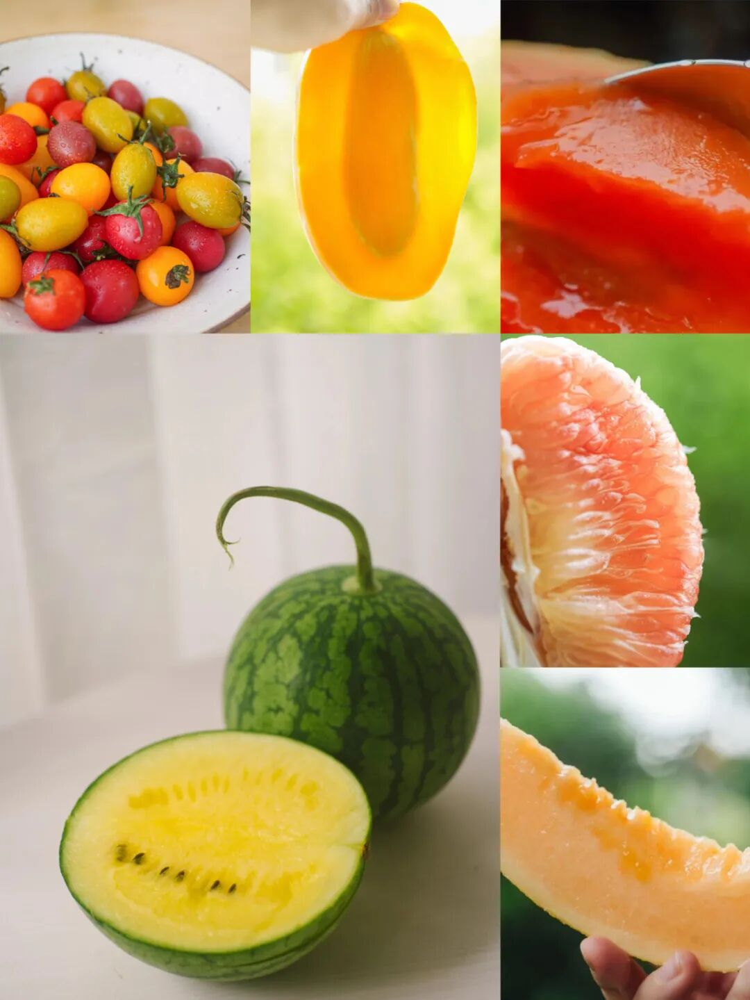
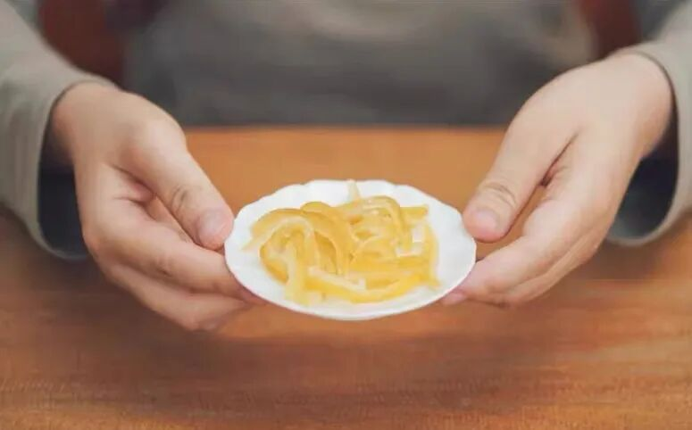
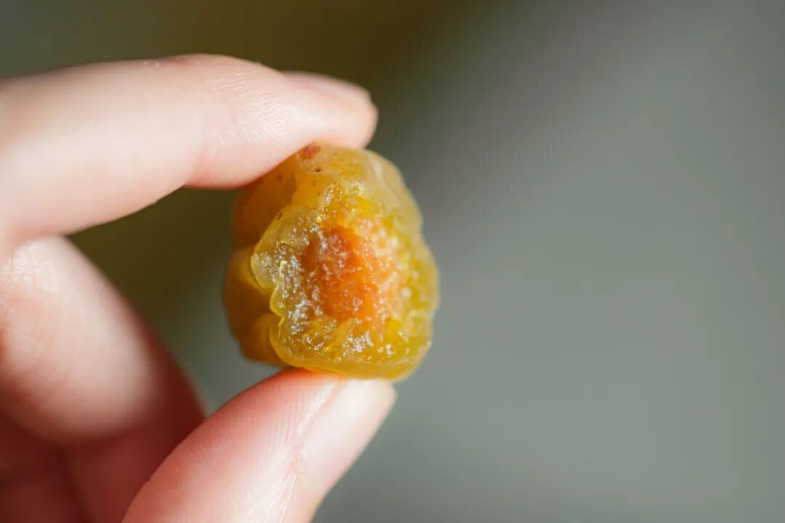
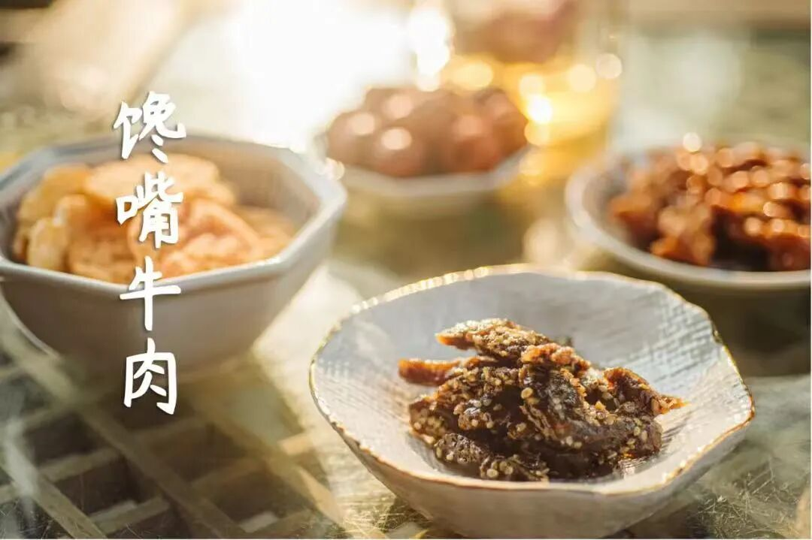
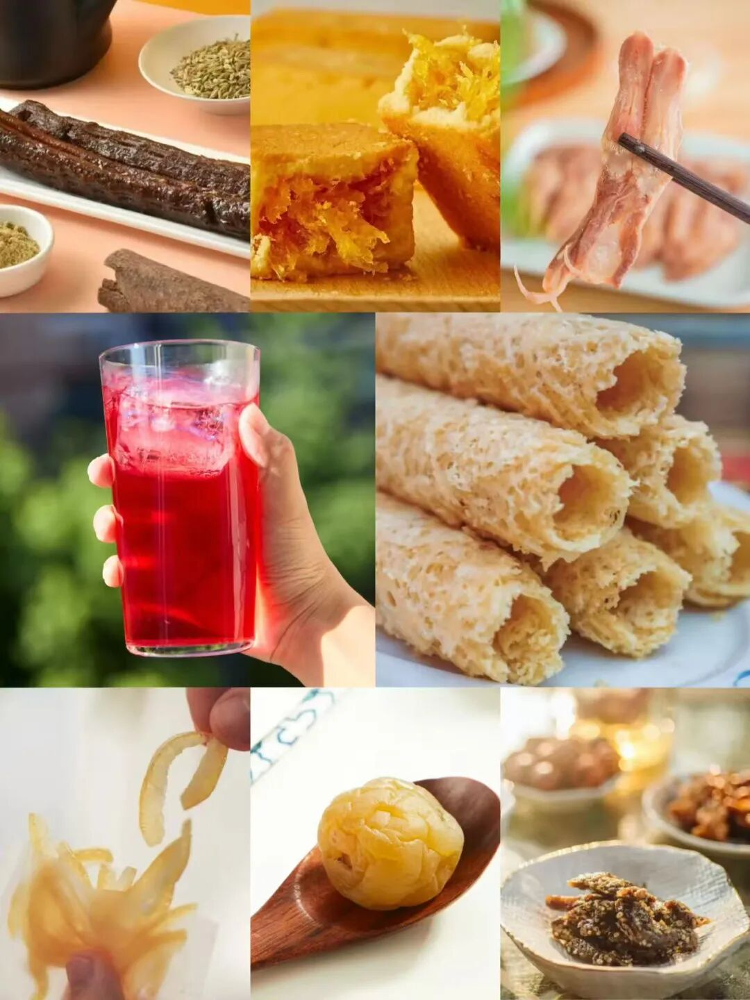

# 有什么诱人的水果生鲜在打折，适合这个假期吃吃？

- 原文链接: https://mp.weixin.qq.com/s?__biz=MjM5NTYxODQyMA==&mid=2653471126&idx=1&sn=ee6e091da062315e411d2d6fb23e61af&chksm=bc07d9f6f0e3820badbc9f751117db5953f34bd9a8301204e5bc2fbf7c6d82f16fe42b07e9ab&scene=27#wechat_redirect
- 浏览量: N/A
- 点赞数: N/A
- 评论数: N/A
- 转发数: N/A

## 正文

吃美了

一个尽情安利自我的公众号

以下是没事干研究院的风物研究报告请放心食用
是谁已经提前放假了，哦原来是薯角我呀

（嘿嘿求轻拍！生怕大家错过天🐱618巨巨折！今天海鲜零食水果应有尽有！这几天懒得出门人挤人的，好吃好喝囤起来呀～

1.

端午风味专区

第 1 件粽子！最后一波了！！

持平了早鸟价！！！

限时 88 折！！

（无法再低了。。。

我司今年五个口味，

咸蛋黄是高邮现挖的，豆沙粽里的陈皮专门托人到广东磨的，葱酥、葱油也是要跑去泉州现炸的，酱油要调三种，肉有黑猪腿肉，不干柴，浸润了肥膘。

不是我薯角吹，

看看后台的真实评价，

吃上的朋友如是说👇

总之到现在，

做了九年、卖了 90w+ 只，

攒下来好口碑，

收获很多年年买的老客户～

饱记·口碑湖州大粽预售中

现货中！！！

限时吃粽 88 折！！！！

戳图买它👇

第 2 件海鲜，也是必吃的。

东海已经禁渔，

你看这个来自湛江的凶猛红膏青蟹。

膏鲜红，黄流心👇

不仅有红膏，而且满到了蟹壳的角角落落。这种叫大红顶角膏蟹，每一只都是挑蟹佬用手电筒照着挑出来的，现在吃最香了。。。

这蟹养在湛江咸淡水交汇的地方，水的咸度刚刚好，蟹才不怎么腥。而且它们从小吃鱼和贝壳长大，伙食没话说，难怪这蟹美味啊。。

饱记·湛江红膏青蟹购买方式如下限时吃海鲜 86 折！！
戳图下单购买👇

2.时令水果专区
第 1 件这一颗上海本地市民都不一定能吃上的小品种西瓜！是在全国大赛都能拿第一的水平！上海市农科院精心选育培养的品种，个头小小一个，皮超薄，肉好脆！

相比红瓤西瓜，

水分含量更高更足，

入口多汁清爽～

再相较于其他黄瓤中小型瓜，

它能多年夺冠的核心即在于，

入口一抿即化，细嫩无渣哦～

第 2 件来自吐鲁番的至爱蜜瓜，

还是天山雪水浇灌。

就长在火焰山背面哦！

这里的昼夜温差能达到 15℃，

所以养出来的瓜，

甜度顶呱呱！

冰淇淋口感，

轻抿一口，还有甜津津的汁水。

果皮极薄，果肉细嫩无渣，

表皮酥脆，内里软糯。

第 3 件娇艳可人的雷州木瓜，扑面而来一股浓郁奶香。。咬一口，超甜超糯超多汁，而且完全不发苦。（随便比，有这个自信，嘿嘿！

第 4 件海南小众红玉芒果，开箱就香气四溢，

皮薄肉厚汁水足。

市面上的根本没法儿比，

本薯可以豪气万丈地说，

你试试，有更好的算我老板输！

这芒果吃起来，细嫩无渣一口滑，口感就像天然小布丁！果味巨巨巨巨巨浓甜。好吃也就算了，它核还小，超薄一片，（这得房率能有90%了我看。。

第 5 件这颗泰国金柚！咬起来，biubiu 爆汁！口感，好甜好甜，基本是纯甜不带酸味！

不能算便宜，但老板说是比照当年静安久光超市泰国红柚的标准选的。

收到就可以吃啦～品种本身就是青皮，不是还没熟哦～
第 6 件在上海的番茄大赛中厮杀出来的，上海金山小番茄，

由上海市农业科学院、

金山区农业技术推广中心提供技术支持。

曾获金山区小番茄品鉴评优活动金奖。

总的来说，

就是既有官方认证，

又是民心所向嘿嘿～

乃专家老师及市民的精挑细选～

后台天天问水果的朋友，这回吃吧就！都限时活动 86 折！不用凑单不用满减，假期招待起来！

饱记·时令水果专区限时活动 86 折！！！

戳图购买👇

3.零食新到货专区
第 1 件

酸梅汤，咱们中华儿女都熟。

这款用到了八味配料：

乌梅、橘皮、山楂、薄荷，

玫瑰茄（洛神花）、甘草、桂花，

还加了一点冰糖中和酸味！

没有乱七八糟的硫熏和色素，

即使是同某堂的师傅来看，

也是服气的。

第 2 件刚补货的酥酥蛋卷，

香酥，极其香酥，

好吃的秘诀无它，

就是舍得下料，手工制作！

新鲜鸡蛋含量高达 27 %，入口化沙。

第 3 件这款好评如流水的大师凤梨酥！用的是台湾凤梨酥盲品大赛冠军配方，
只有 90 天短保质期哦。

我司很喜欢吃凤梨酥的同事说，
吃过很多种凤梨酥，
芝士味浓郁的、果肉纤维多的、奶香味重的，
但都没有一口咬下去
酸甜跳跃的凤梨酥来得印象深刻。
是的，我饱记凤梨酥，
能让人吃出欣喜雀跃的感觉！

第 4 件酒香鸭舌，

包邮区糟卤口味！

灵感来自《红楼梦》里宝玉喜爱的下酒小菜～

定的是南京一家老师傅开的厂，

厂里有一锅 30 多年的老卤！

这个就叫家底儿～

第 5 件

长长长长长一条的大鸭脖，

足足有 21cm！！直接手撕着吃！

整根耐吃，骨边活肉多，

越啃越有滋味。

码成下酒菜或者用来追剧吃，都超棒！

第 6 件

黄金柚子条，

我愿称之为柚子口香糖！

选用高品质沙田柚，

初入口是淡淡的柑橘味，

越嚼越浓烈的柚香直冲大脑，

各种风味在味蕾上瞬间脱缰。

第 7 件甜青梅，非常妙的一款零食。青梅用的国家地理保护产品：广东普宁的梅子，用糖和盐调味。酸中带点咸，这个季节吃很清爽！

第 8 件

馋嘴牛肉，

五香的咸香味浓，

打游戏爱吃！

以上摸鱼聚会美食，

都是近期新鲜到货！

通通给到限时活动 85 折！

趁此机会囤一波，冲！！！

饱记·零食新鲜到货专区！

购买方式如下

限时活动 85 折！！！！

戳图买它👇

题 外

朋友们！！！

今年的天🐱618活动又开始了！

我司直截了当打折！

🍑平台全场 85 折！

有赞折扣及🔗如上文中所提～如果你还想趁此机会囤好茶，蒙顶甘露&梅家坞龙井，单件 86 折两件 8 折！
委托家中五代制茶的福州老茶人，

以传统古法窨制的茉莉花茶！

或是100 斤的茶要用

300 斤桂花分三次窨制的

桂花乌龙～

搭着柚子小种红茶买！组合更划算！今天都有限时活动 85 折！！
饱记·梅家坞龙井&蒙顶甘露限时单件 86 折！！！两件 8 折！！

戳图购买👇

饱记·六窨茉莉花茶购买方式如下限时活动 85 折！！！
戳图购买👇

饱记·桂花乌龙（小金罐）&柚子小种红茶
购买方式如下👇限时活动 85 折！

戳图即可购买👇或打开 🍑🍑🍑 搜索「艾格吃饱了」

本文的研究员

薯角我想我知道夏天的味道

用好吃的方式吃一生

祖国各地好风物

文章转载请加微信「baojiclub」

