# 有好消息会第一时间告诉大家，之前说过的

- 原文链接: https://mp.weixin.qq.com/s?__biz=MjM5NTYxODQyMA==&mid=2653464286&idx=1&sn=a4237ca7c69cd10d79cd2da7a5150b87&chksm=bc570498766cf3e40ae78d1d482f8d53bc21977d3b1b8786e63c652d86c3c932b56a33b89fb1&scene=27#wechat_redirect
- 浏览量: N/A
- 点赞数: N/A
- 评论数: N/A
- 转发数: N/A

## 正文

正式回归！

一个尽情安利自我的公众号

以下是没事干研究院的风物研究报告请放心食用
多亏了大家捧场，本薯带来好消息一则！口碑第九年！这枚后台千呼万唤的
饱记·富平流心柿饼，今天开始现货啦！！（之前下单的老客人第一时间按顺序给大家发！

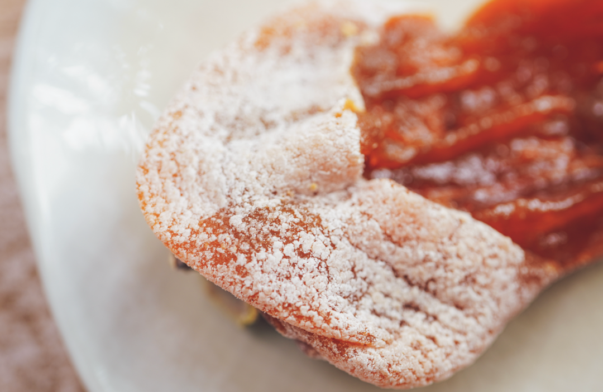

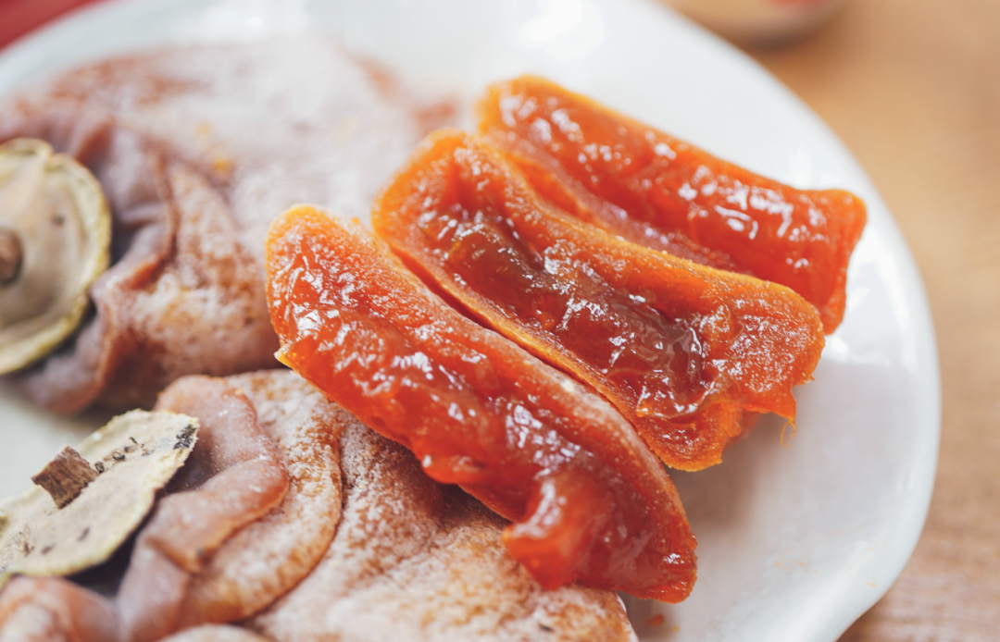

一整颗橙红透亮，

内芯的果肉和果汁充分融合，

流心的柿肉会在齿间跳跃。

历经 60 天的等待，

每一个被打包送到你手里的柿饼，

都是突破重重关卡，

一道一道严格筛选的勇士。

白霜丰厚，流心柔滑如蜂蜜。

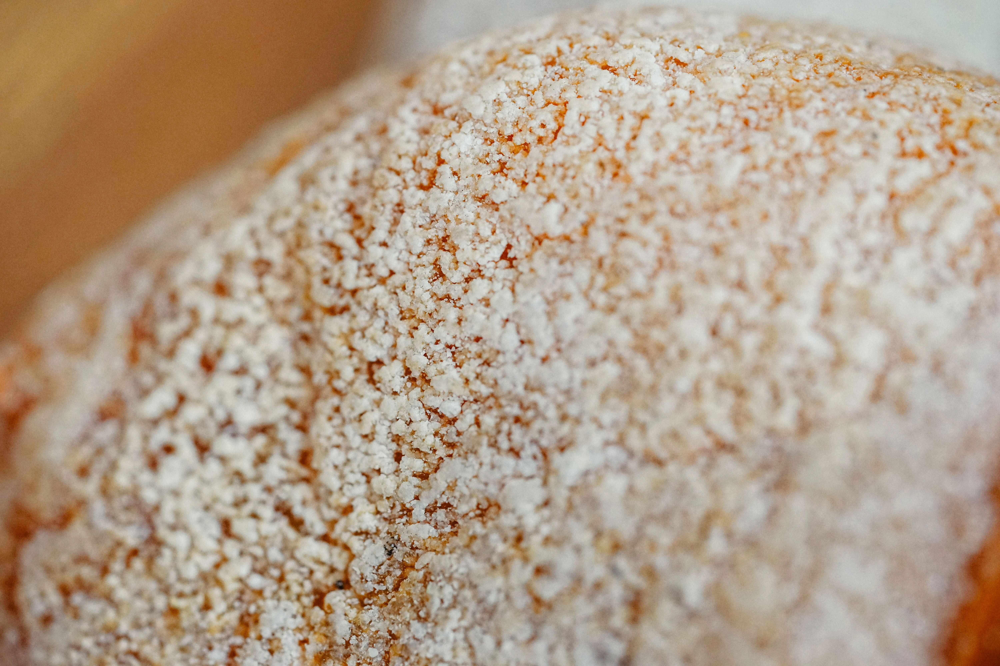

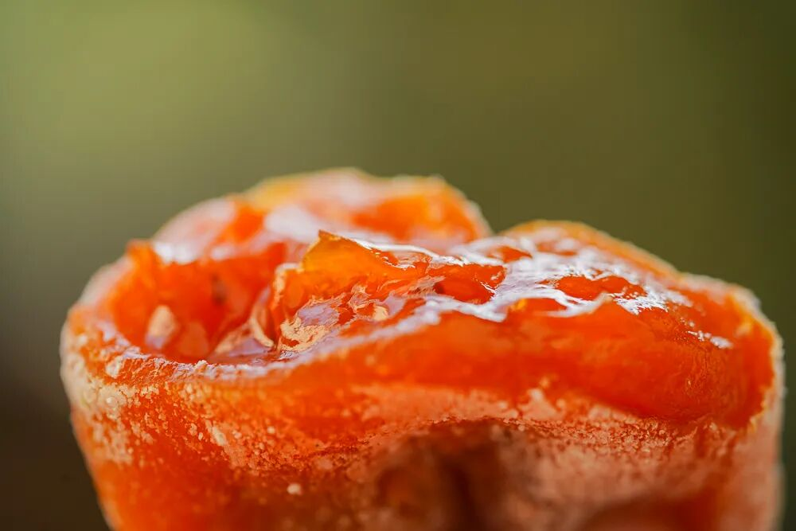

朋友们尽管放心，今年柿饼依旧饱满流心，一口大满足。满满绵密白霜、厚实果肉！吃起来才过瘾嘛！

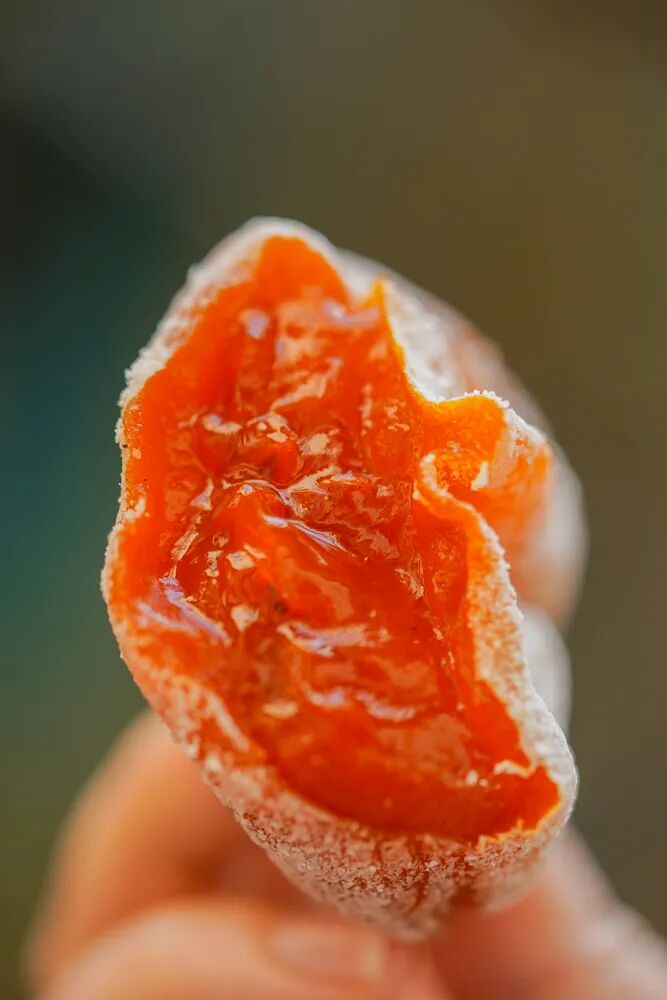

市面上富平柿饼众多，不夸张地说，
我饱记始终是第一梯队水平！

历史上也比遍了所有的网购货，

永远赢很大。

核心产区，独一无二的夹心三明治口感

九年前，

老板说当年先是比遍了全国产区，

然后又翻遍富平产区后、

才找到了这家愿意按我们要求做的果园。

（老板：这玩意儿比考研可累多了。。。

九年后，

这家村里的夫妻家庭合作社，

和我们共同发展成全面合规的规模工厂，

且企业拥有国家地理标志！

（这是什么双向奔赴的感人故事啊。。。

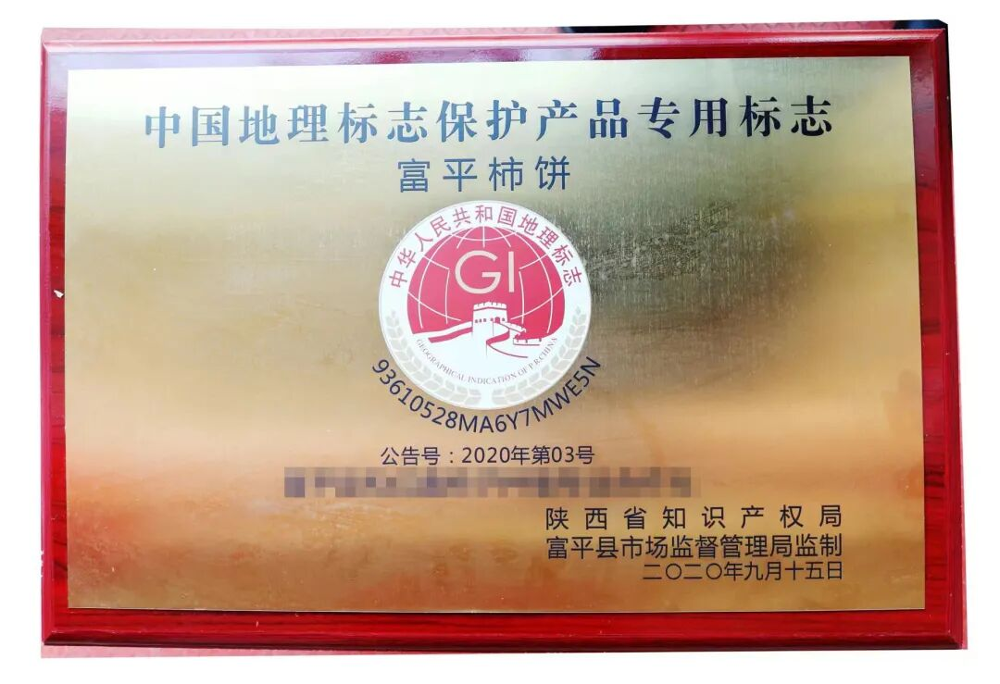

个头大，流心，挂霜厚这些就不说了。

之前不是买了市面上的几家回来横测么？

惊喜地发现，

我司柿饼，

还有一重独一无二的三明治夹心口感。

柿子皮略带韧劲儿，

内里流心软糯，

粗中有细，甜甜蜜蜜，

不是纯软塌的口感。

绝了。

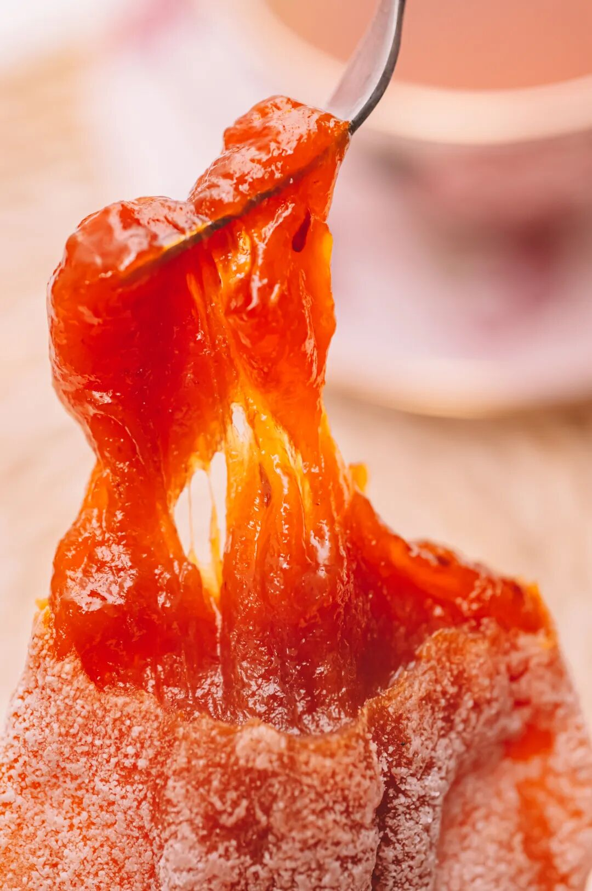

符合饱记标准的柿饼，是扔出来的

每年霜降后，

先人工逐颗挑选熟度、大小、外形

都合适的富平尖柿制作，

挂起来自然阴干。

但凡有一点不合适的都不要。

不只是单纯吊着哦，要经过老师傅不断捏捏捏，捏轻了不够软，
捏重了柿子容易烂！

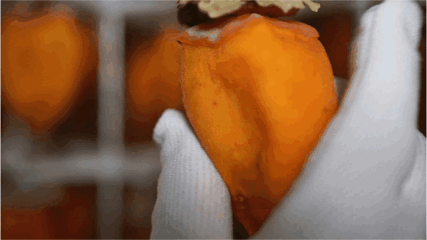

最关键是要将「果肉内硬块全部捏碎捏软👍且皮不破」，属于全靠经验的技术活！柿娘们都至少练了七八年了。

60 天自然挂霜，流心柿甜如蜜
整个过程：挑选顶配柿果👉削皮👉晾晒👉古法揉捏，一共要经历 60 天，这样出来的柿饼才符合饱记标准！相比 40 天的汁肉混合更充分

一枚完美的富平柿饼，就是特别讲究这绵密的柿子糖霜！这也意味着时间与背后的人工。但我司一向卷生卷死，
力求「打遍天下无敌手」，成本上去了也没在怕的！

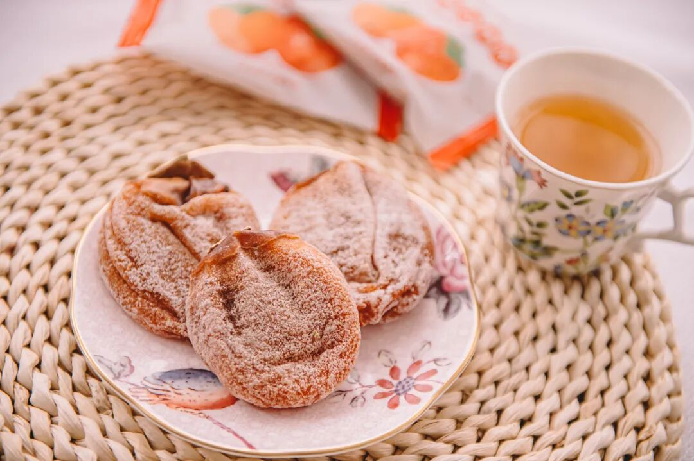

所以收到记得及时冷冻，

白霜化了就不好吃了，

别给我懒，

快递到了就去拿它！！

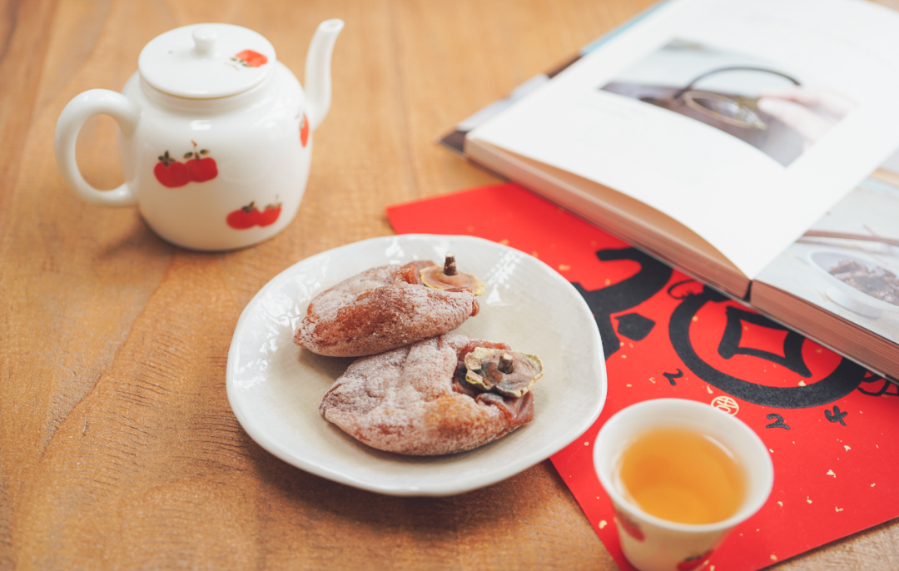

答应我，配我司的茶吃，真的绝。

马上要跨年了，

和家人好友的聚会少不了它，

囤吧，放冰箱里～

好不容易盼来的现货，接下来给大家按顺序发！且秉着过节沾沾喜气的原则，给大家薅来一个限时 9 折啊！吃吧！吃到你就懂了！

饱记·富平柿饼购买方式如下限时过节 9 折！！！
戳图购买👇

题 外

敲锣打鼓，

两样本薯较少吆喝的好东西在临期清仓，

巨折 6 折！自家吃吃不妨碍啊！

超过瘾的手撕鸭脖效期至明年 1 月，

紫苏梅饼效期至明年 3 月，

介意慎拍哦！！

后台千呼万唤喊着补货的

75% 木姜子巧克力，

现在还有限时 9 折！

其他适合空调房吃吃的水果也看这里👇

拿过金奖的上海白鹤红颜草莓，

卷过丹东！限时早鸟 86 折！

来自广西融安的脆蜜金桔。足以颠覆自小到大的金桔风味印象！从芯子到脆皮都是蜜蜜甜的。

一次尝俩的广西双拼芭乐，

扎实的冰激凌球口感！

现在也有限时 9 折！

最后今年大闸蟹已到尾声！

苏南蟹标杆美味：太湖流域大闸蟹

苏北蟹宝藏性价比之选：洪泽湖大闸蟹很快就没！

饱记·临期零食清仓专区

巨巨巨 6  折！！！介意慎拍～
戳图购买👇

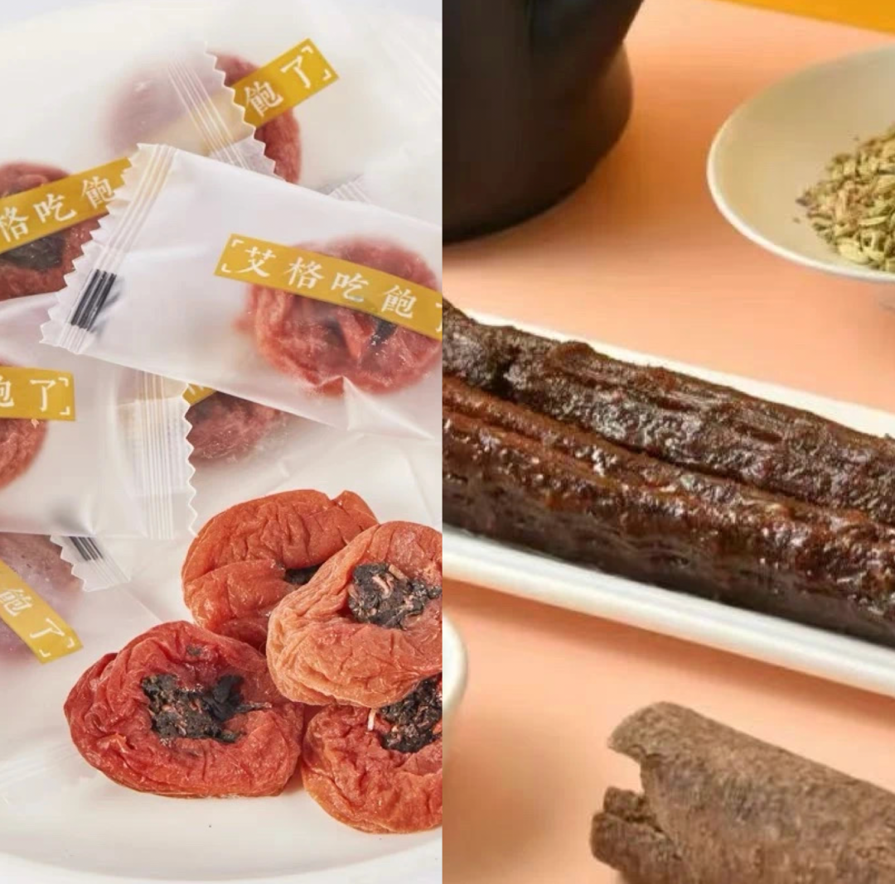

饱记·红颜草莓

购买方式如下

限时早鸟 86 折！！！

戳图购买👇

饱记·云南木姜子75%黑巧克力购买方式如下限时 9 折！！
戳图下单购买👇或🍑🍑🍑搜索「艾格吃饱了」

饱记·融安脆蜜金桔限时吃水果 9 折！！！只到本周五！！
戳图购买👇

饱记·广西双拼芭乐限时吃水果 9 折！！！只到本周五！！
戳图购买👇

饱记·太湖流域大闸蟹

购买方式如下

三种搭配：

满足装，

3-3.4 两母蟹，4-4.4 两公蟹，

吃过解馋。

劲爽装，

3.5-3.9 两母蟹，4.5-4.9 两公蟹，

可以拍照发朋友圈争奇斗艳。

尊享装，

4-4.4 两母蟹，5-5.4 两公蟹，

顶格水准，适合送礼。

人工精挑，

上岸后静养一两日更鲜美，

每日限量 50 箱。

拼的就是手速。

顺丰快递发货，

新鲜看得见。

戳图下单购买👇或🍑🍑🍑搜索「艾格吃饱了」

饱记·洪泽湖大闸蟹

购买方式如下

满足装洪泽湖大闸蟹：

3 两母蟹，4 两公蟹。

性价比之选！

劲爽装洪泽湖大闸蟹：

3.5 两母蟹，4.5 两公蟹。

饱记热销款。

尊享装洪泽湖大闸蟹：

4 两母蟹，5 两公蟹；

或 5 两母蟹，6 两公蟹。

实际超重，量极极极少，送礼佳品。

人工精挑，

上岸后静养一两日更鲜美，

每日限量 100 箱。

顺丰快递发货，新鲜看得见。

戳图下单购买👇或🍑🍑🍑搜索「艾格吃饱了」

本文的研究员

薯角多吃点，好过冬

用好吃的方式吃一生

祖国各地好风物

文章转载请加微信「baojiclub」

