# 有手就会的菌子菜谱，后悔没早点写出来

- 原文链接: https://mp.weixin.qq.com/s?__biz=MjM5NTYxODQyMA==&mid=2653460271&idx=1&sn=c0f4be2859c80bb1f5fcb93a94f7f652&chksm=bcaf9572a3c844243c59d77013756bd0603db08a6241dde11bd3d0dbc21edeff35406fc5ef54&scene=27#wechat_redirect
- 浏览量: N/A
- 点赞数: N/A
- 评论数: N/A
- 转发数: N/A

## 正文

米其林同款的鲜

一个尽情安利自我的公众号

以下是没事干研究院的风物研究报告请放心食用

周一不想做人了，

来教大家怎么做菌子啊！

（烂梗一则

完全靠老天爷赏着吃的
饱记·云南野生菌子礼盒，共五种菌子可选，都安全无毒，即将告别！当地农户阿姨们，

凌晨一颗颗上山去捡，

比肉更鲜的滋味谁懂？？？

呵呵这么美又如何，还不是被我轻松拿下？

本薯急得不行

快帮帮我的 KPI 啊啊啊啊！

菌子有何难！

今天给大家分享几道菜谱，

都是一个锅十分钟内解决，

真·零难度，真·有手就会。

尤其适合工作日自己加餐，

下锅炒炒就好吃！

发货时每箱都附赠了火腿和螺丝椒，不用怕找不着配菜！

🍃🍃🍃菜谱一老人头菌炒火腿盖饭，脆甜！

老人头菌，

这次新上的！

云南私家菌山的当地大哥说，

近期的老人头

品质尤其好。

这种菌长得肥硕厚实，

因为看起来有点像寿星公而得名。

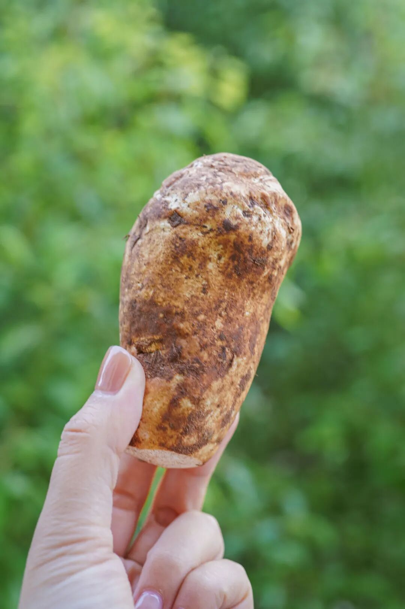

吃起来脆脆甜甜，

炒过后也风味不减，

带着一点点韧感。

还是性价比之王，

家常实惠的好吃！

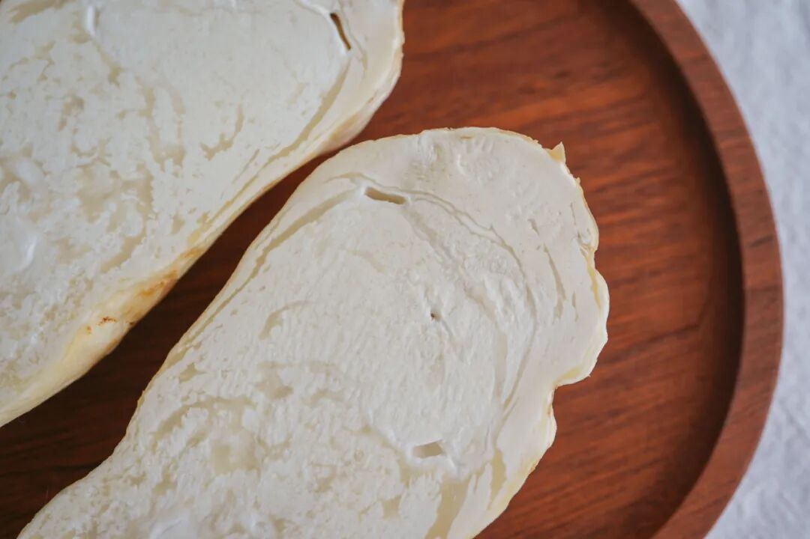

做起来也超简单，

切个薄片，

用猪油和螺丝椒、火腿一起炒，

盖到饭上就是一顿，

摄影师边拍边炫，

一勺一勺根本停不下来啊！

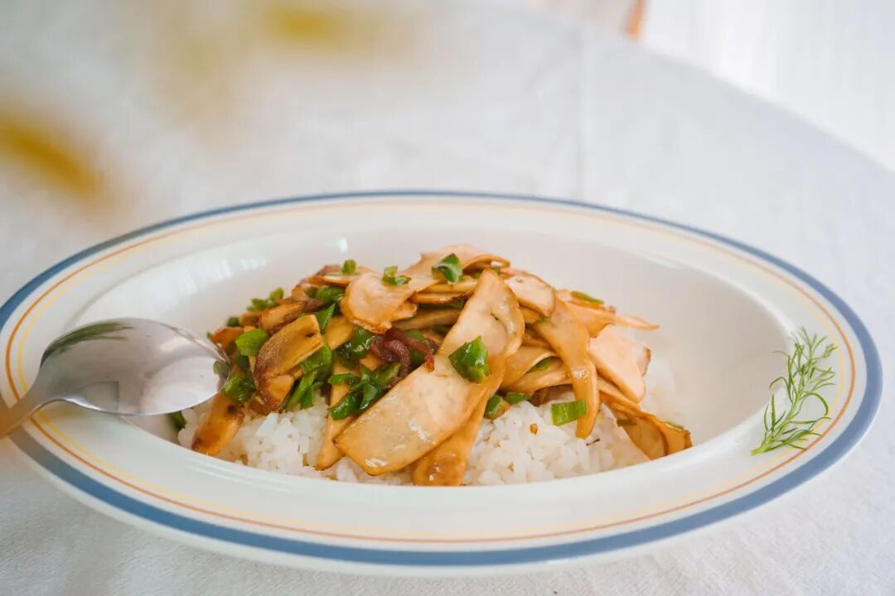

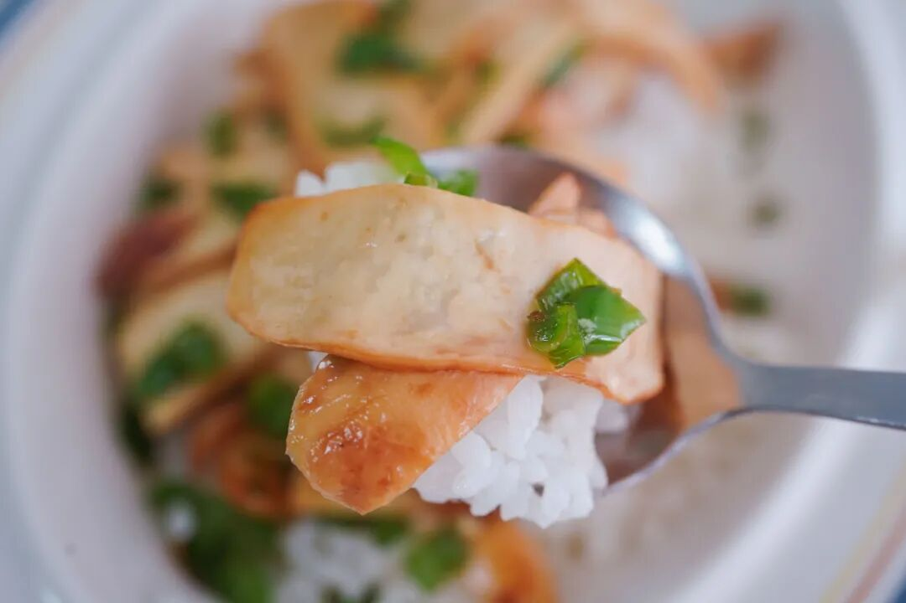

📙 做法：热锅下猪油，下螺丝椒丁、火腿爆香；下老人头菌（简单切薄片）炒熟，加盐调味；盛出后盖在饭上，开吃！
🍃🍃🍃菜谱二香得霸道的干巴菌炒饭

长得像枯木的干巴菌，

一直属于云南菌里最贵的一档。

看上去皱巴巴的，

其实内里藏着汁水。

闻起来有一股浓烈的干香。

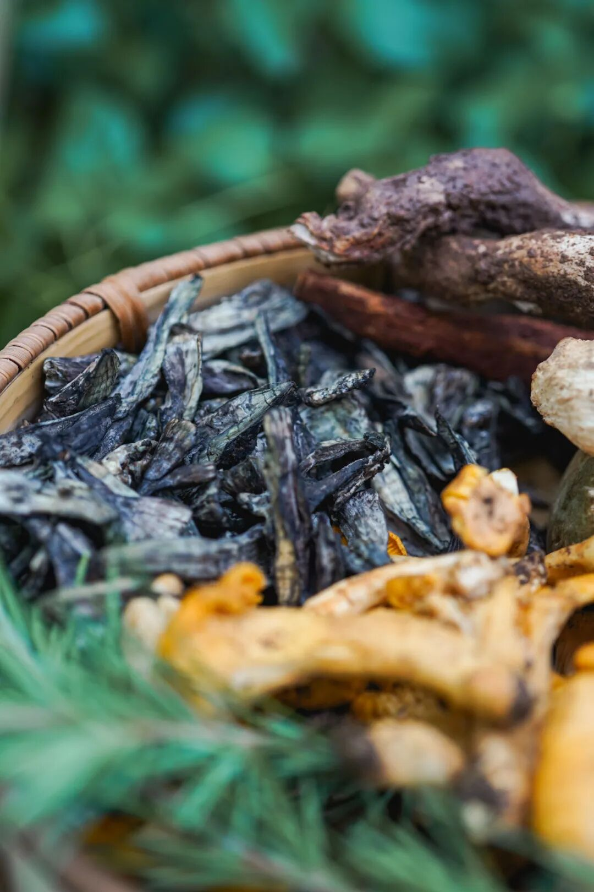

拿来炒最好吃，

炒鸡蛋、炒火腿都行，

这次我们拿来炒饭，

看起来其貌不扬的，

一入口唇齿间都是干巴菌的浓香，

大口吃超过瘾。

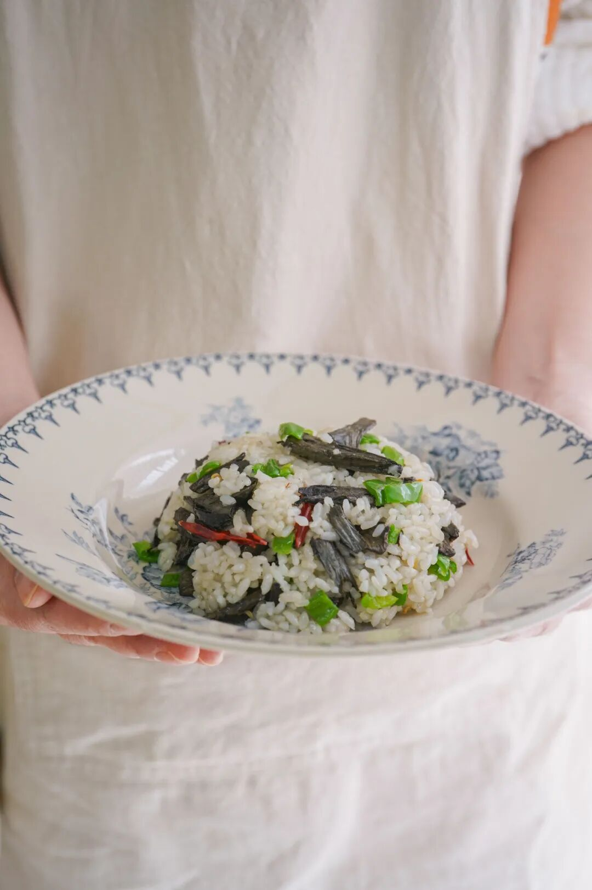

做法和老人头菌差不多，

同样热锅下猪油后，

加入干巴菌、螺丝椒翻炒，

喜欢吃辣的可以加点干辣椒丝，

油润中带着鲜香。

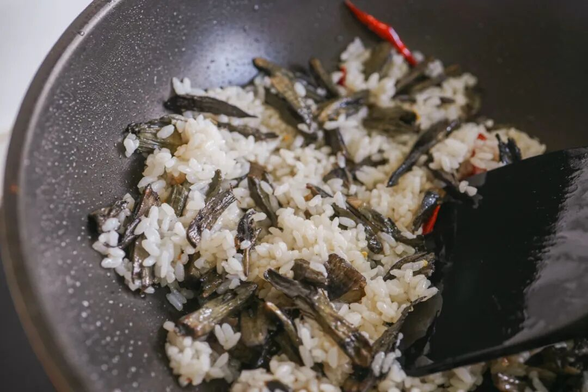

📙 做法：热锅下猪油，油热后下干巴菌爆香；炒出香气后，下米饭（最好是隔夜冷饭）翻炒几分钟，最后加螺丝椒丁及少许盐即可出锅。

🍃🍃🍃菜谱三鸡油菌火腿炒饭，软嫩鲜香

鸡油菌，外表金黄，像上好的鸡油，

口感同样类似于鸡肉，

特别香，

吃起来又甜又嫩。

很适合做砂锅煲，拿来炒饭也妙，口感巨巨巨软嫩，入口有滑润感！

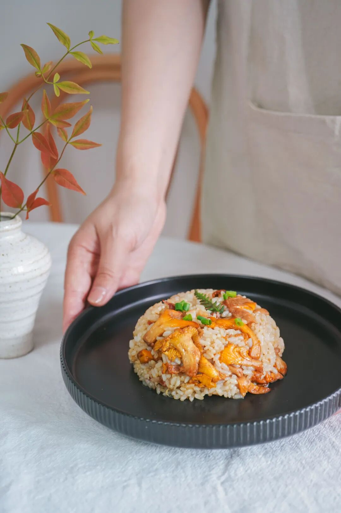

本薯大方分给同事吃，这碗竟是民选第一名！打败了干巴菌的香和老人头的脆，以其独特的口感取胜～

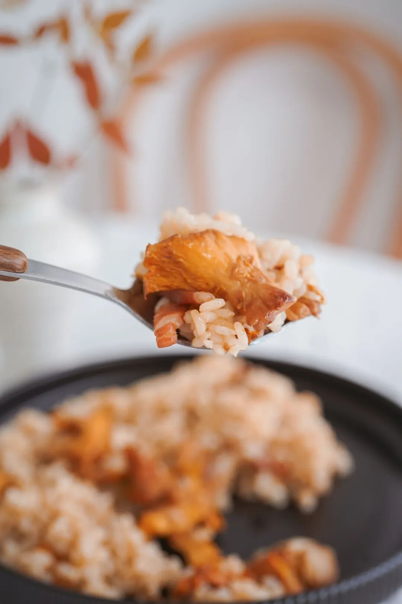

📙 做法：

热锅下猪油，先放蒜片、火腿丁炒出香气；再放切过的鸡油菌翻炒；最后放米饭（隔夜冷饭）翻炒均匀，可加入适当的盐调味。

🍃🍃🍃菜谱四青头菌拌面，菌甜融着葱香

青头菌，

肥肥圆圆，

像一把绿色小伞，

处理起来比较轻松，

云南人厨房里的家常食材。

这次拿它拌面吃，

搭配我司有口皆碑的葱油开洋酱，

五分钟就能完成的快手菜！

这酱好吃，

在于葱本身就挑得很好。

面下锅焯熟后捞出，

直接拿葱油酱拌开。

浇头就用青头菌和螺丝椒、火腿炒出来，

拌到面里一起吃，

吸溜之间，

菌甜里带着葱香。

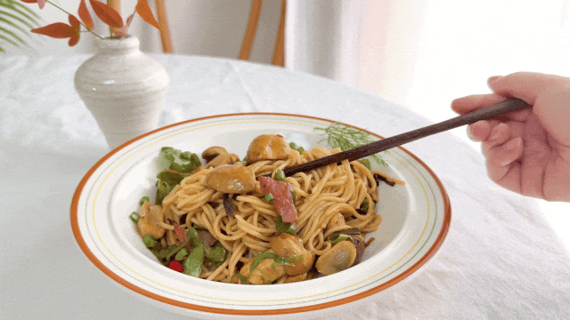

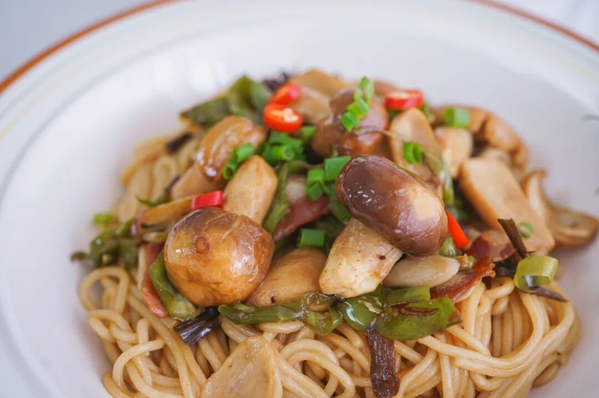

📙 做法：

热锅下猪油，下青头菌炒香；下蒜片、螺丝椒丝和火腿片同炒，炒熟后盛出备用；水开后下面条，熟后捞出，拌入开洋酱；将青头菌浇头码在面上，开动！

🍃🍃🍃菜谱四鸡枞菌汤，鲜就一个字！

鸡枞菌，

肉感很强，

鲜甜得仿佛嫩鸡肉，

与此同时汁水充盈。

到手洗净后直接开撕！

撕成细长条，

（但不要撕得太太细，菌子本身的汁水容易没掉

用来煮汤！

不用任何肉类就鲜。

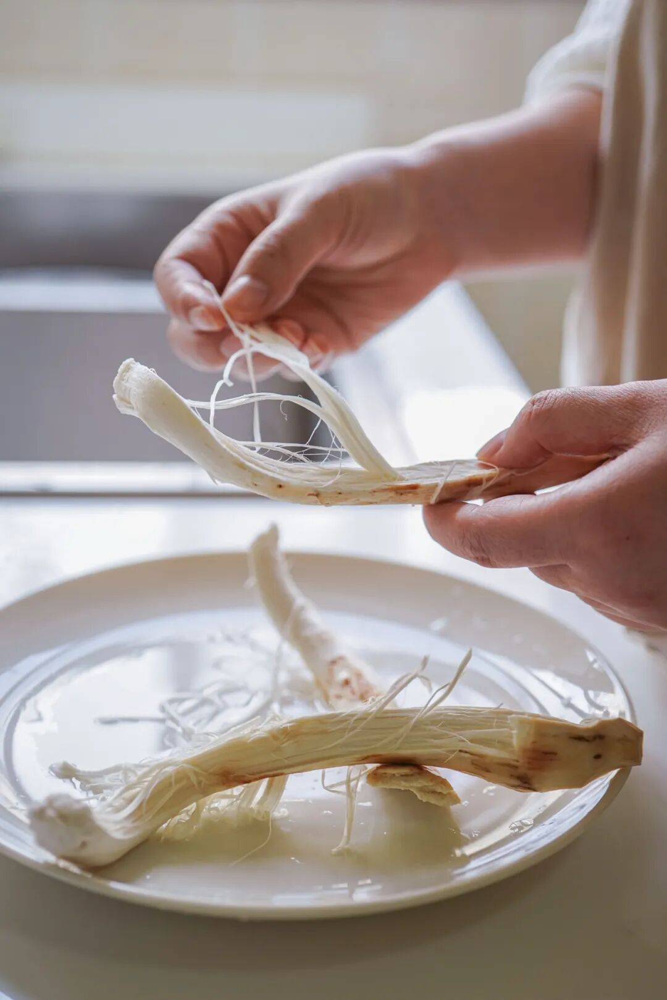

做法堪称懒人福音，

只需把菌子用猪油炒香，

再加入热水煮开，

撒点盐、白胡椒、葱花，

大功告成！

鲜到掉眉毛嘿嘿～

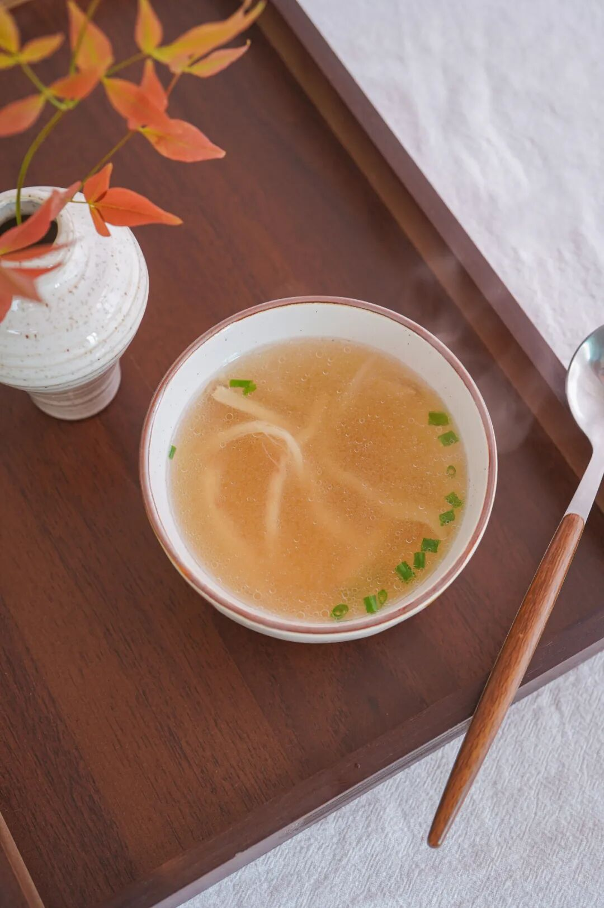

📙 做法：

鸡枞菌撕成条；热锅下猪油，加入鸡枞菌翻炒出香味，炒到菌子出汁；往锅中倒入适量开水，开大火滚煮个 8-10 分钟即可；再加适量盐、白胡椒，起锅前可撒入葱花！

🍃🍃🍃菜谱五杂菌炒饭，一锅出！
今年的五种菌子，干巴菌、鸡枞菌，

鸡油菌、青头菌，

老人头菌，

都安全无毒，

非云南人也可以安心吃！

懒得分开炒的，
直接五种菌子一锅出也没问题👇

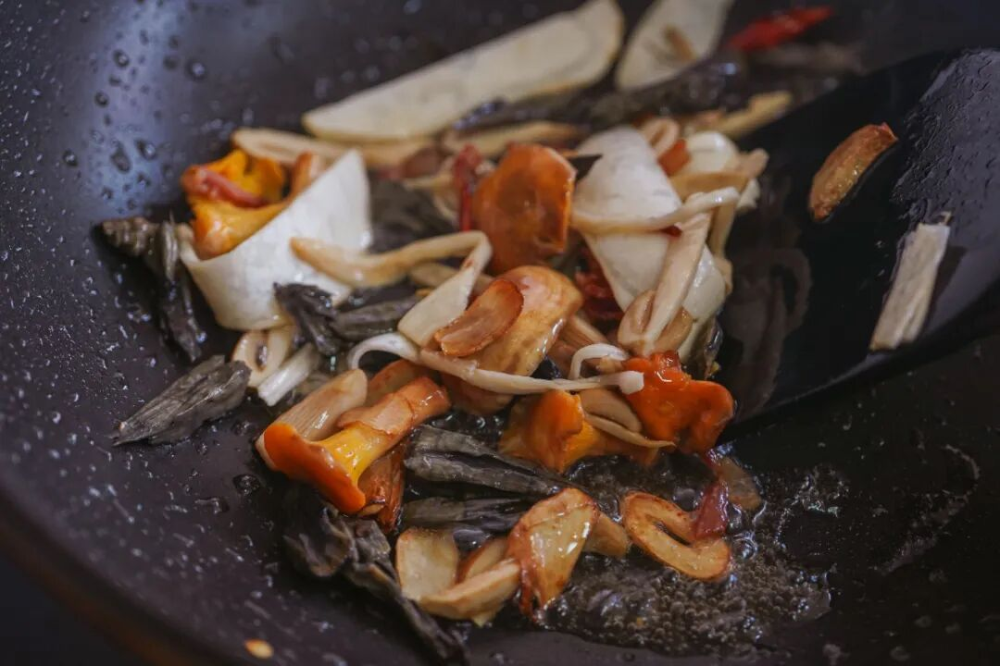

还是老方法，

该切的切，该撕的撕，

杂菌倒下去加螺丝椒、火腿同炒，

不需要再另外准备佐料，

每一口都像开盲盒，

各有各的组合惊喜。

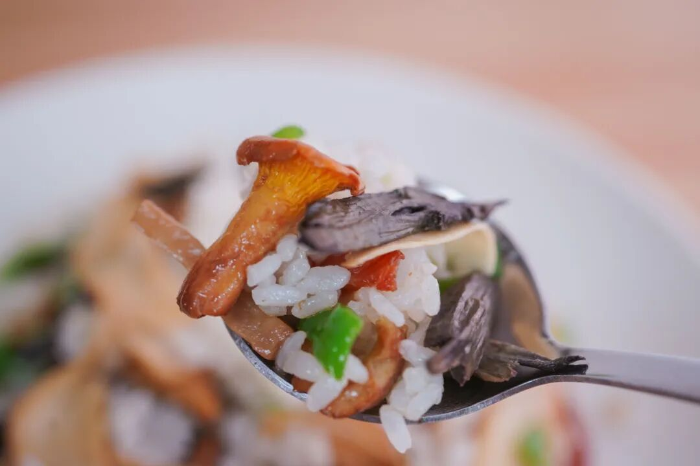

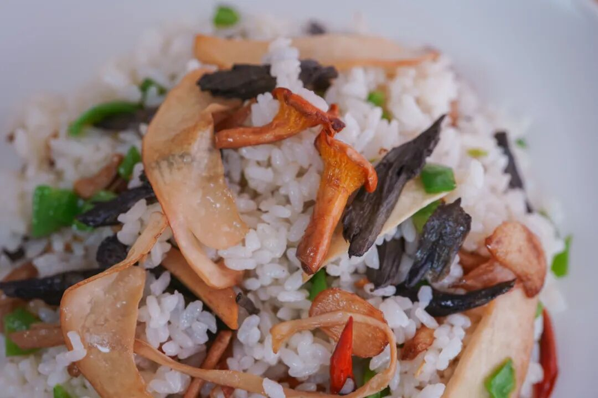

📙 做法：热锅下猪油，下蒜片和螺丝椒丁、火腿爆香；下杂菌炒熟炒香；炒出香气后，下米饭（最好是隔夜冷饭）翻炒几分钟，最后加一点盐即可出锅。
看到这里，想必你已经明白，终归还是那句老话，上好的食材，只需简单的烹饪。

我司五菌子，

和米其林餐厅们品质完全一样，

但价格却是店里吃的一半甚至 1/3！

都来自云南最大的高端野生菌批发商

包下来的私家菌山。

此山每年要卖出 2 亿多的菌子和云南特产。

划重点，谨记都用猪油去炒，再来点火腿、螺丝椒，（贴心如我司发货时给你一箱配好了小白一跃成主厨！

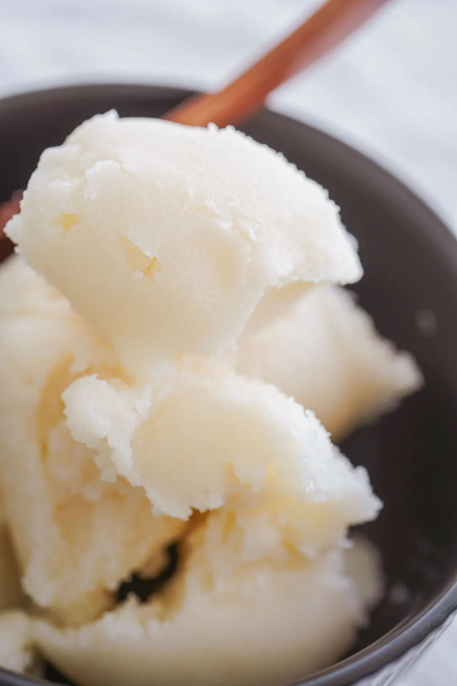

这次还都给大家准备了，

100g 的体验装，

价格更实惠，

适合新手初次尝试。

已经买过的可以直接上 200g,

分量更充足。

只剩最后几天，

吃完明年见，

冲！

饱记·野生菌子礼盒
购买方式如下

100g 体验装

野生菌四拼

（干巴菌/青头菌/鸡油菌/鸡枞菌各 100g）

野生菌经典三拼

（青头菌/鸡油菌/鸡枞菌各 100g）

野生菌尊享三拼

（干巴菌/鸡枞菌/老人头菌各 100g）

野生菌双拼

（鸡枞菌/老人头菌各 100g）

200g 分享装

野生菌四拼

（干巴菌/青头菌/鸡油菌/鸡枞菌各 200g）

野生菌经典三拼

（青头菌/鸡油菌/鸡枞菌各 200g）

野生菌尊享三拼

（干巴菌/鸡枞菌/老人头菌各 200g）

野生菌双拼

（鸡枞菌/老人头菌各 200g）

顺丰空运次日达，

看得见的新鲜！

戳图买它👇或到🍑🍑🍑搜索「艾格吃饱了」

题 外

还有一些时令风物，也完全不容错过啊！

比如今年新炒的山核桃，

和农大合作的第 11 年，

打遍天下无敌手！

闭眼买的程度，

现在还有限时 9 折！！

上周新来的丑苹果和库尔勒香梨，

大家买上了吗？来自云南的蒙自西北勒小苹果，
甜中带有酸度，果味极其浓郁，甚至还有溏心！喝天山雪水长大的新疆库尔勒香梨，又甜又润，嫩得连皮也能吃！

最后一天限时 86 折！！

快冲！

饱记·临安山核桃购买方式如下👇限时 9 折！！
戳图买它👇或到🍑🍑🍑搜索「艾格吃饱了」

饱记·西北勒小苹果购买方式如下限时早鸟 86 折！！
戳图买它！！👇

饱记·新疆库尔勒香梨
购买方式如下限时早鸟 86 折！！
戳图买它！！👇

本文的研究员

薯角雨季不再来

用好吃的方式吃一生

祖国各地好风物

文章转载请加微信「baojiclub」

