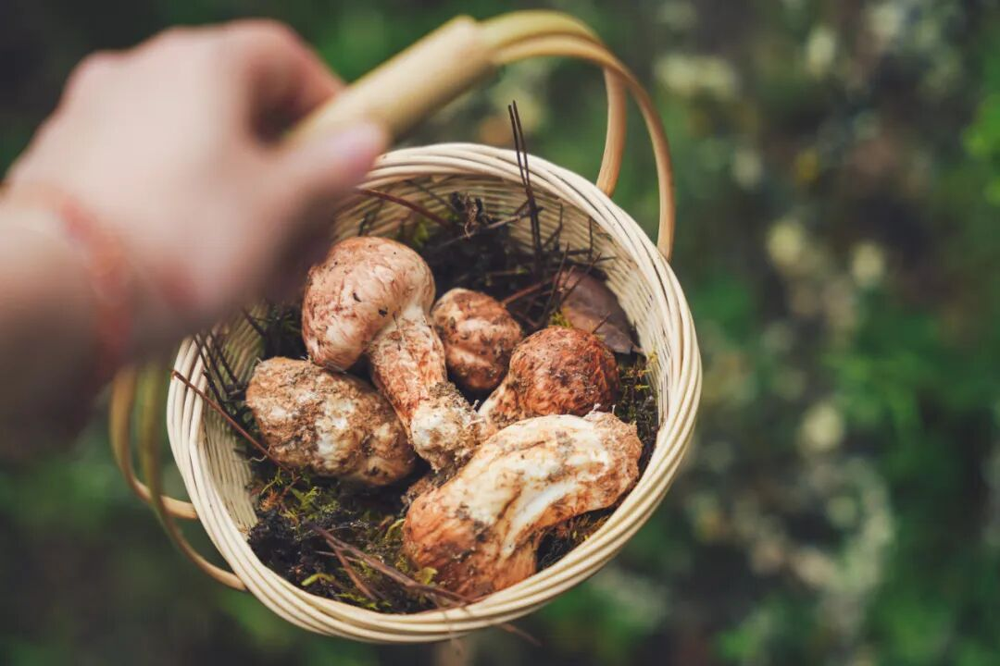
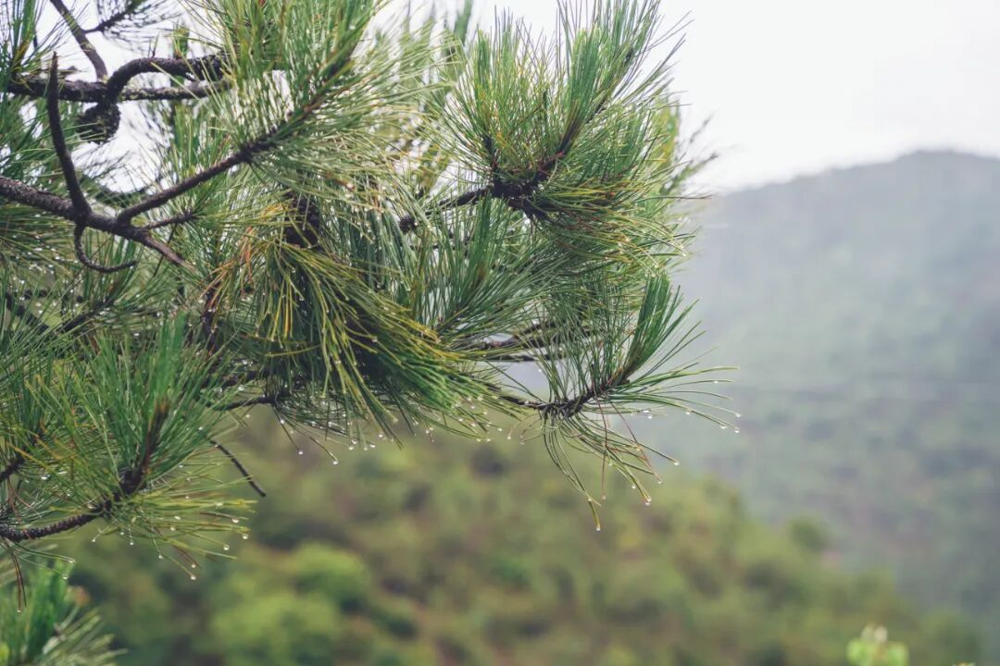
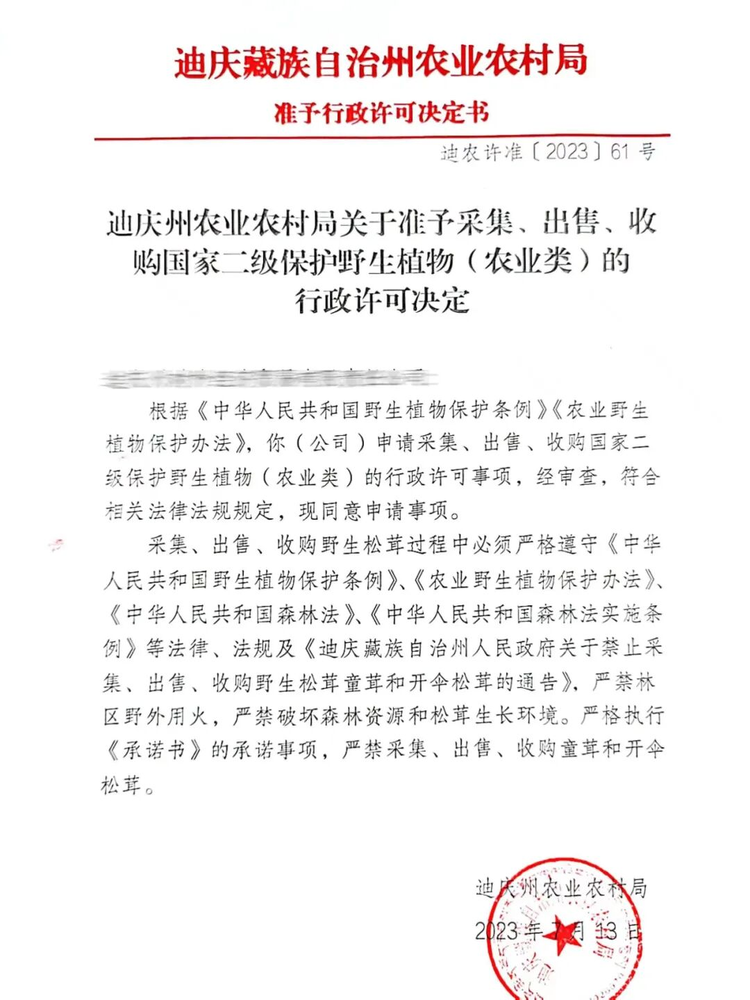
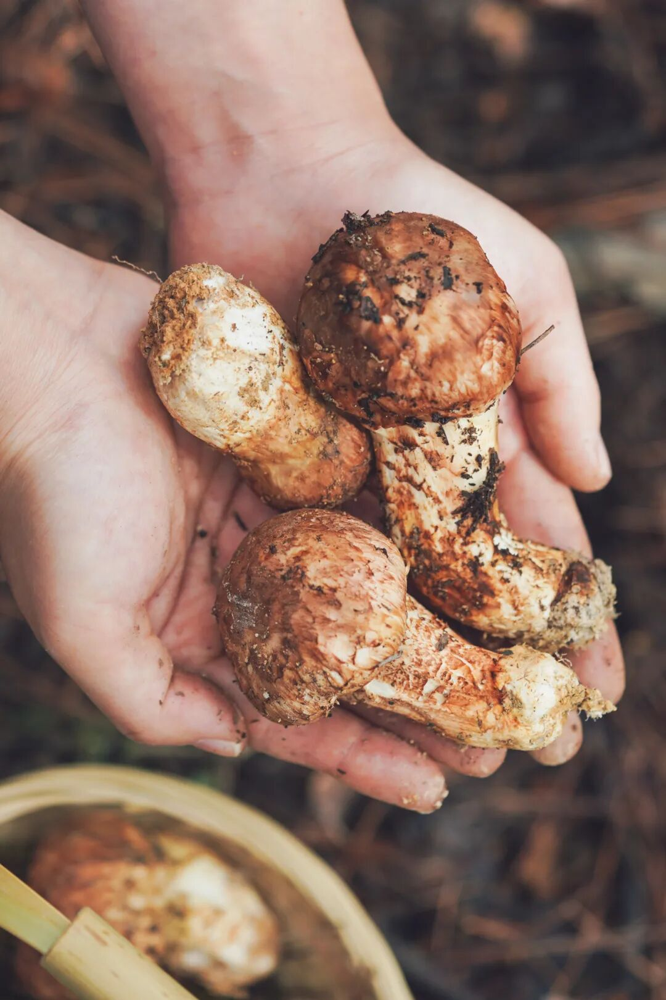
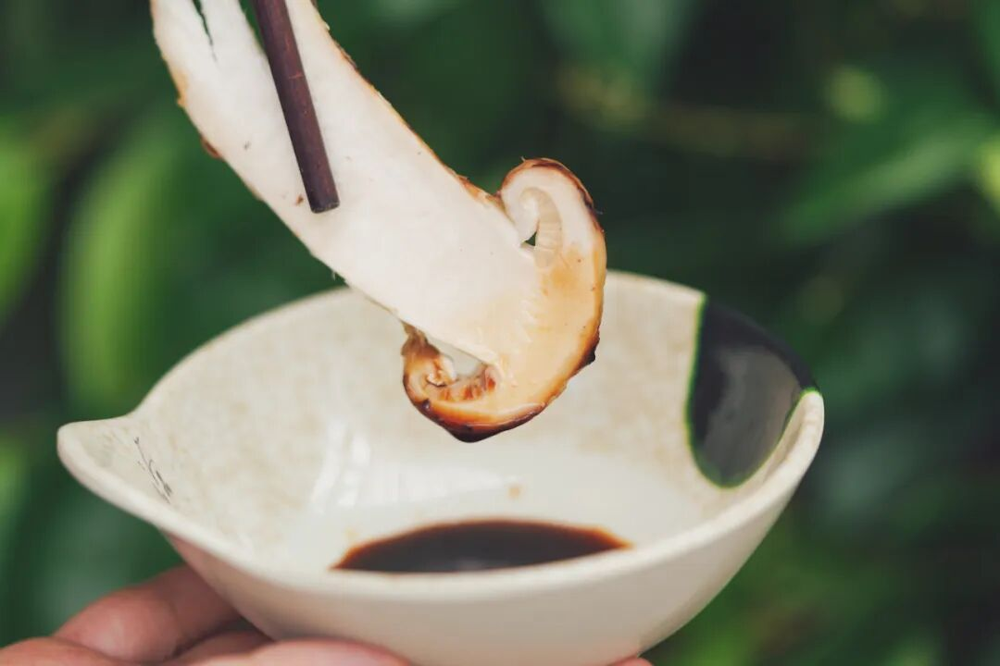
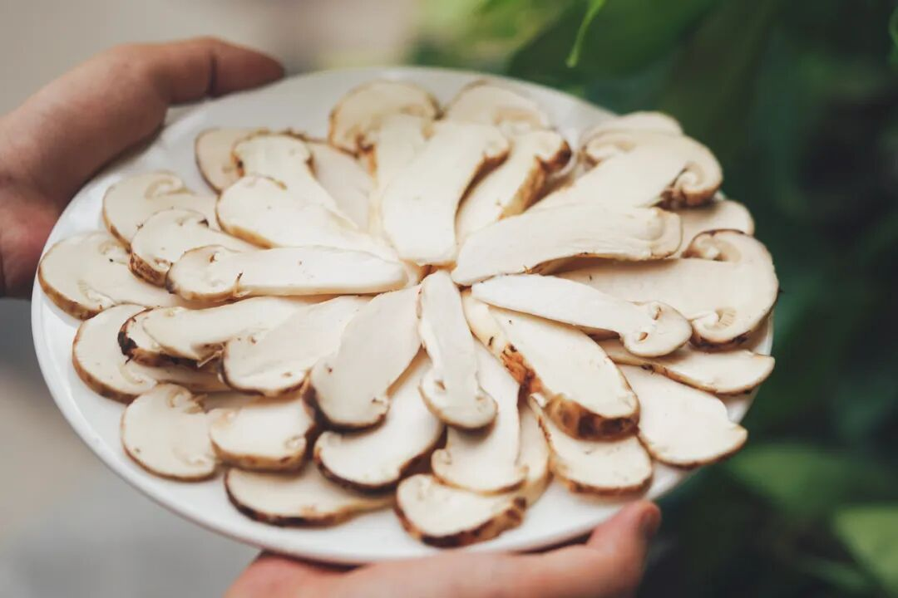
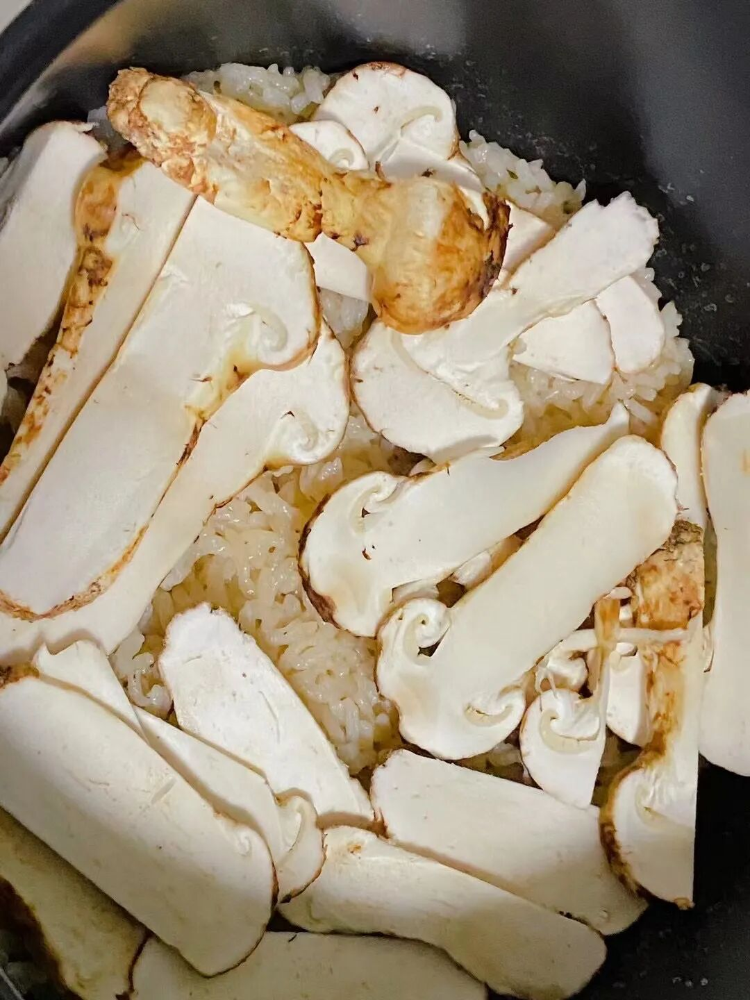
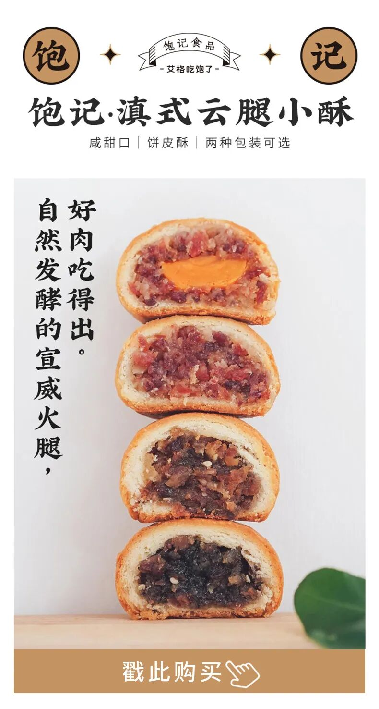

# 本季云南最鲜的天赐美食（之一

- 原文链接: https://mp.weixin.qq.com/s?__biz=MjM5NTYxODQyMA==&mid=2653456788&idx=1&sn=5935f8cdf53636bb53008ffbf6140e0a&chksm=bc929a45a710e4921e1017a3726b27aa31ad3e371e19daa071e5c72e0cd062f1148039593bb4&scene=27#wechat_redirect
- 浏览量: N/A
- 点赞数: N/A
- 评论数: N/A
- 转发数: N/A

## 正文

山珍知多少

一个尽情安利自我的公众号

以下是没事干研究院的风物研究报告请放心食用

好羡慕云南人啊～

总有老天爷赏饭吃。

每年雨季，

只要拎上篮子进山，

就能捡到鲜美无比的菌子！！

（虽然也是各凭本事hh

就说这个鲜松茸，

需要专门跑到迪庆香格里拉，

挨家挨户跟当地藏民收👇

（真的不够吃！！！

此地号称「云南松茸之乡」，海拔高，气温低，植被、土壤条件良好，松茸生长缓慢，虫害少，这样才能保证脆脆甜甜的口感和淡淡的松木清香。
（一个冷知识，松茸对生长环境要求特严格，   5-6 年才能破土

喏，采摘许可证在这👇童叟无欺！

卷完产地，还要卷品质。

饱记只发 1-2 级松茸。有虫洞的、开伞的，都不符合标准，所以你吃到的，都是肉质弹力足的好松茸。

每天采摘后，

先送去冷库「打冷保鲜」，

让它们休眠，然后顺丰发货。

不经大宗交易市场，

都是第一手货源。

（有些没有打冷保鲜操作，松茸在路上就会腐烂老化！

所以放心吧，

你在家收到的松茸也是新鲜的！

直接切片生吃，

就脆嫩鲜甜！

唇齿间还萦绕着一层清新香气，

感觉自己置身于松针林？

久久不散，幸福！

或者简单油煎，

（用黄油更香！

松茸在铁板上滋啦滋啦，

浓郁香味弥漫开来～

操作难度一颗星，

美味程度米其林八星（？

也可以用来焖饭🍚在米饭上平铺一层厚厚的松茸，简单焖一下，
出锅后再撒点葱花👇

拿来炖松茸鸡汤，会明白什么是真·鲜掉眉毛！（关于鸡汤明天细说！！（已经为大家贴心搭配👌

总之，「高端的食材只需用简单的烹饪方式」，生吃、煎、烤、焖、涮锅，都行，新手友好！让我们说：谢谢老天爷！！

饱记·香格里拉野生鲜松茸一口价！打不起折！购买方式如下
饱记的鲜松茸，采自海拔 3500 米以上原始松木林。只发 1-2 级符合出口标准的松茸。
新鲜采下送冷库保鲜，冰袋+吸水纸保鲜，顺丰发出。
戳图买它👇或🍑🍑🍑搜索「艾格吃饱了」

题 外 一

贴心如我薯角，

从不让大家费心。

及时迎回了那只香晕全公司的鸡

——云南瓢鸡，

和松茸一起炖，

鲜美到哭！

限时 82 折！！

还有酥香的云腿酥，

也是云南风味！

早鸟 86 折！！

另外今年的夏黑葡萄又到尾声，

来自上海马陆镇，

拿过铜奖，是高甜的爆汁小炸弹，

尾声 9 折！！

饱记·云南稀有品种瓢鸡和松茸一起炖鸡汤只发上海地区限时 82 折！！！

云南稀有品种黑脚鸡，
人称“人间小凤凰”。上海定向引进，吃天然粗粮长大。
目前只有公鸡，目前只发上海，（因为太热上海地区半日达。
PS：瓢鸡蛋白质高血气味大，宰杀时已经尽量放血，但收到有可能还会有气味，冲洗干净即可不影响食用！
戳图下单购买👇

饱记·滇式云腿小酥

预售中！！！

早鸟 86 折！！！

传统滇味经典，新鲜手作，浓情四溢。
🥮四个口味：经典云腿、蛋黄云腿，黑松露云腿、白松露云腿。
🥮三种规格：云腿酥礼盒全家福（四个口味各 2 枚）云腿酥礼盒双拼（经典云腿小酥*4 枚+蛋黄云腿小酥*4 枚）
云腿酥礼盒囤货装
（经典云腿小酥*30 枚）
现在是预售！预计 7 月底到 8 月初发货！

戳图买它👇

饱记·马陆夏黑葡萄购买方式如下尾声 9 折！！

马陆是上海的王牌葡萄产地，
获得了国家农产品地理标志，
饱记选择的果园曾于 2021 年获葡萄评比铜奖。
果肉饱满，风味浓郁。外皮紫黑，皮薄少籽。高甜！！！
🍇「饱记·马陆夏黑葡萄」两个规格：两串装·2.5 斤四串装·5 斤

建议放入冰箱冷藏，3 天内食用完。

戳下图购买👇

题 外 二

有时真为一些食物不平，

这么好吃怎么无人问津？？

两个口味的招牌梅饼，

天然酸甜的黄桃干与空心山楂球，

越啃越香脆的圆墩墩玉米浪，

还有扎扎实实的午餐肉片～

含泪临期清仓，

都是实打实的折扣！！

无需凑满减！

⚠️PS：清仓原味梅饼效期仅到8.6，

介意慎拍～

饱记·临期亏本清仓

4 折起！！

戳图买它👇

或🍑🍑🍑搜索

「艾格吃饱了」

本文的研究员

薯角下辈子想当一颗蘑菇

用好吃的方式吃一生

祖国各地好风物

文章转载请加微信「baojiclub」

