# 死贵但好吃的蔬菜，实测出一个便宜买的地方

- 原文链接: https://mp.weixin.qq.com/s?__biz=MjM5NTYxODQyMA==&mid=2653470970&idx=1&sn=c721b7b7a7508d3ba70703c119326667&chksm=bcb167abb2976ca68e79b286e48c107080b896cbd9a9b6361a3f3e1c4914c934a874a744651a&scene=27#wechat_redirect
- 浏览量: N/A
- 点赞数: N/A
- 评论数: N/A
- 转发数: N/A

## 正文

真材实料的好吃

一个尽情安利自我的公众号

以下是没事干研究院的风物研究报告请放心食用
众所周知，我司全司都是奥乐齐的粉，常买的比如小青柠汁一升只要 9.9，是某山价格一半！

喝起来还更不太甜～

鸡胸肉 5.79元 竟有两大块我一块猫一块。。。老板经常买特价葡萄酒。。。她说 39.9 元的奥地利琼瑶浆简直划算爆炸了！

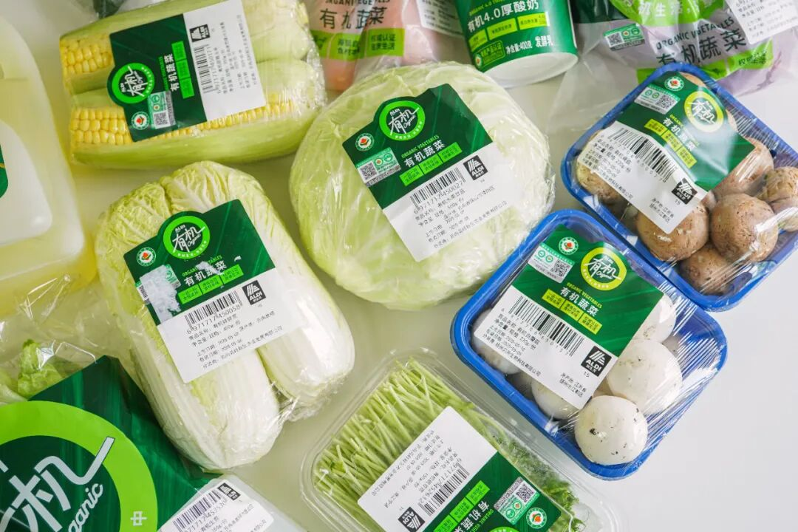

附历史上老板的奥家消费两篇，嘿嘿：
这货是山姆的好还是奥乐齐的好？
你们要的葡萄酒百年老店，闭眼买不踩坑

最近我司内部传唱的是他家的「干净饭」，全有机系列，做点夏天吃的，轻调味少油盐，主打吃食物本味，空口吃风味就超级浓郁！

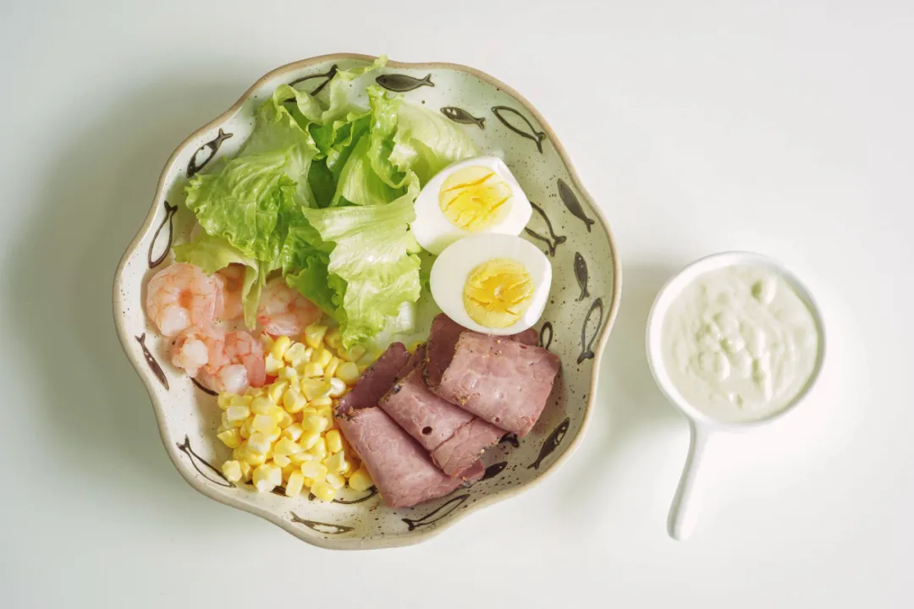

而且本薯看了一圈下来，确认奥乐齐的价格还是最实惠的。。。而且跟他家传统一样，要不是我一直买，简直觉得是假的。。。。

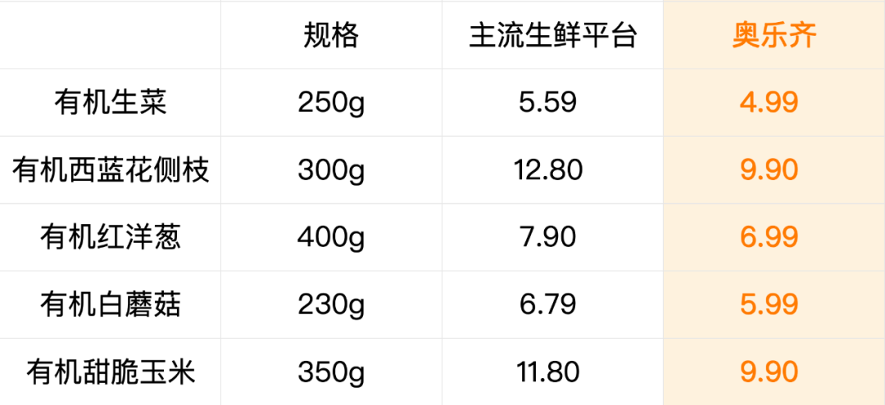

给个价格对比，你们感受下！
他家宣称正经国家有机认证，在土地自然生长和采摘，无农药直接吃。本薯应同事之要求，给你们全部买了遍，热炒轻食时髦榨汁奶昔都上，试下来，真的行～

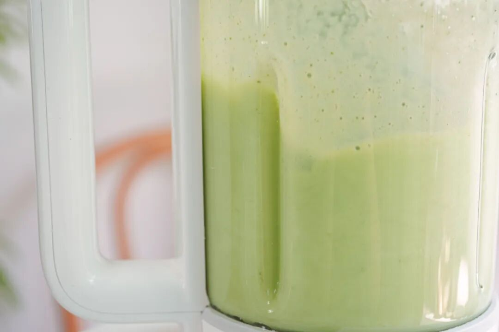

好吃，爱吃，以后都想一直吃！

食物最珍贵的

是能吃出它本身的滋味和价值

「有机系列」是奥乐齐自营产品线，

翻译：便宜，更便宜。

但光便宜不行，我给净水冲冲

都生吃 + 白灼了，

菜有菜味！

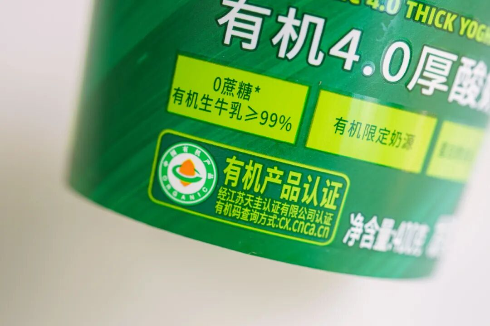

查了下，我国现在有机蔬菜的认证标准，是指生产过程中不使用化学合成的农药化肥、生长调节剂、转基因技术的食材。

以蔬菜为例，种植土地起码 3 年内不能使用化学化肥农药，从这片土地里生产出来的蔬菜，需通过数十个化学指标的检测，最后在有机认证的指定地点分拣、加工、包装，最后才能贴上有机标签。

奥乐齐这批自营有机标志产品，蔬果大部分都产自云南千米高海拔的品质农场，专门改良的有机土壤富含有机质，优质灌溉水源 + 年约 2000 多小时的超长日照， 0 化学农药、0 化学肥料、0 生长调节剂，本薯放心生吃了，甚好！

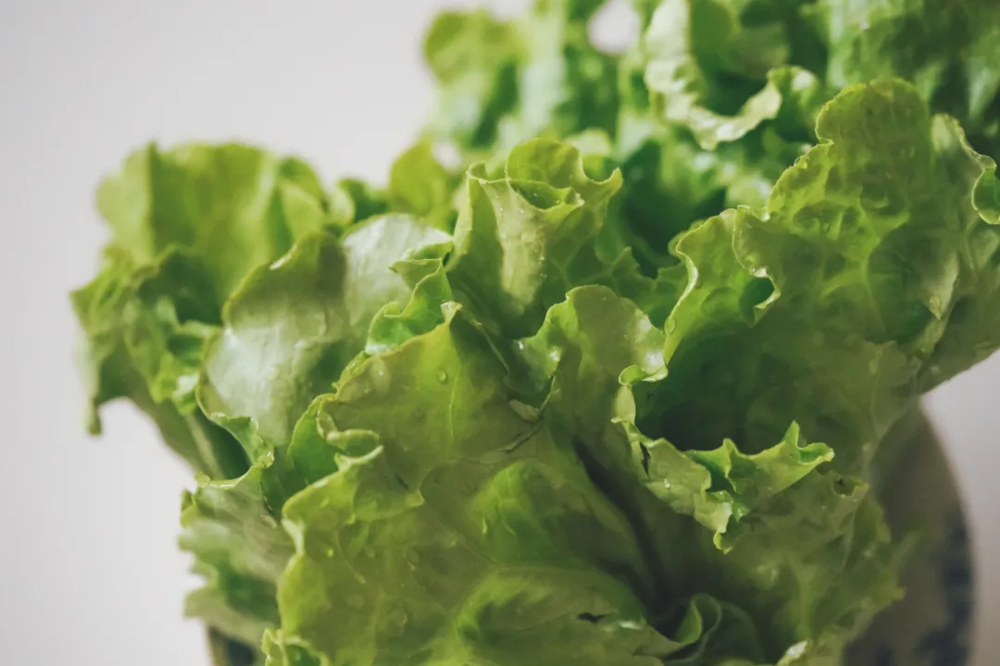

人工采收，人工挑拣，最快 48h 新鲜直达货架，所以到手的品相很不错，也挺新鲜扫个码就能了解到，这颗种子从播下地、长成苗、被包装、最后上架，都经历了什么，全程都能追溯。

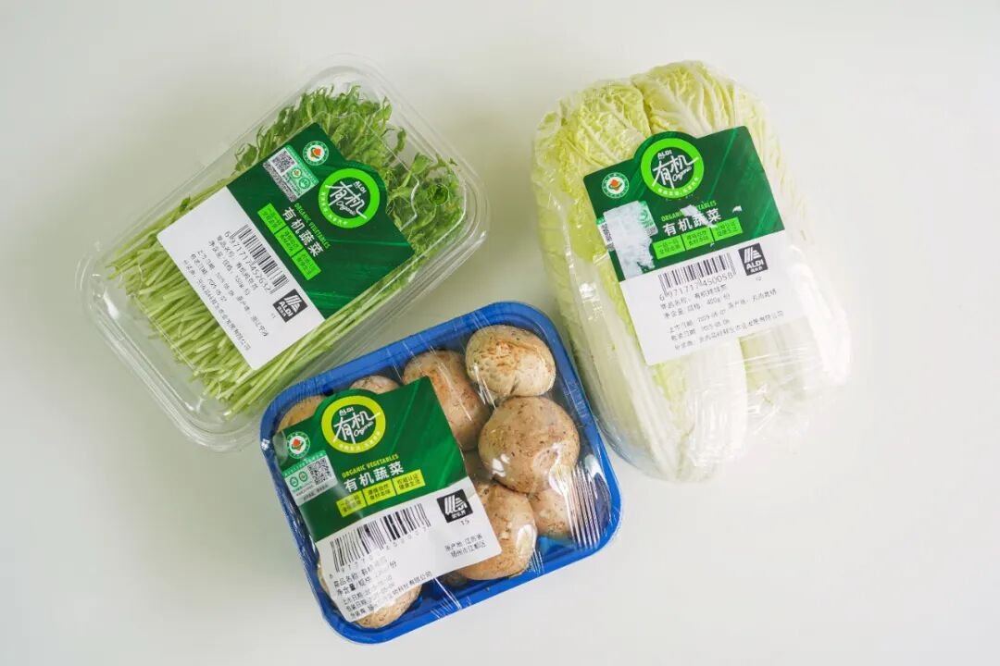

吃进嘴里就知道，啊小时候的味道～～～真实土地和大自然的味道～～感受最深的，是吃完一周有机食物带给身体的反馈！阳光雨露、绿水青山，本薯一边写稿，一边在咀嚼间感受到充沛的生命力hhhh

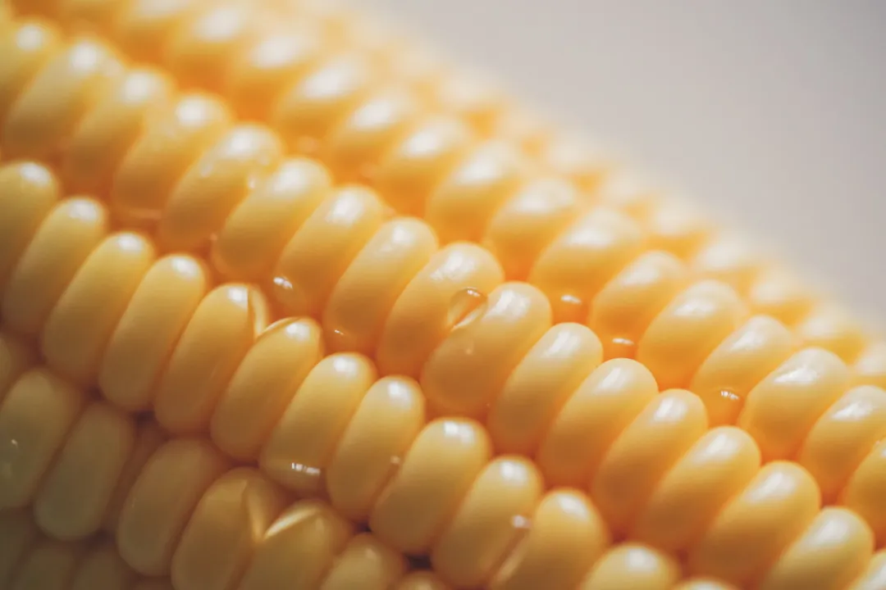

除了质量好而一直便宜到不像话之外。。。

奥乐齐还有一点要单独拎出来夸，

就是不用办会员卡 + 小份包装，

本薯和猫做三菜一汤能买十几种原料不浪费，

好评！

分享几个最近常吃的轻盈食谱

承包您家一整天

第一道轻食界大热：「甘蓝瘦瘦奶昔」
外食频率多的时候，第二天就会选择多吃点蔬菜能不开火就不开火懒癌患者薯，当然是选择榨成奶昔啦。

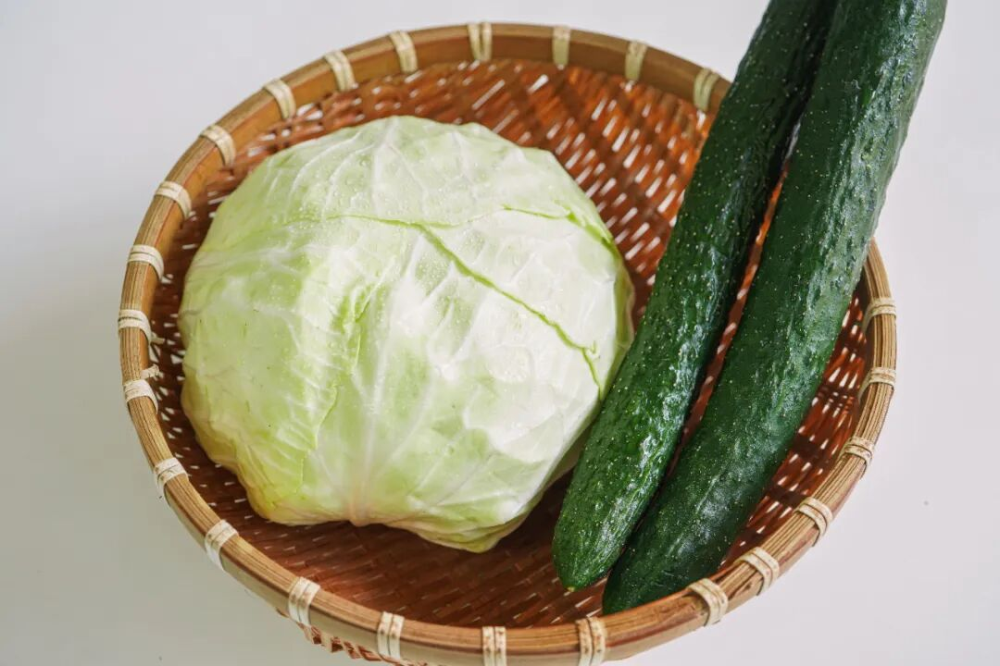

有机水果甘蓝自带蔬菜本身的清气，有一点苦涩感，干吃的话还比较硬，榨成奶昔后这些缺点居然消失了！！！信我，好喝！！！

有机黄瓜自带水分‍就像在喝一杯很有 juicy 感的水果。而且特别有饱腹感，味道和外面轻食餐厅里的完全没差！

喝的太习惯以后，以至于吃啥都喜欢配一杯，火锅、烧烤，或者随手买的简单早饭都很搭。

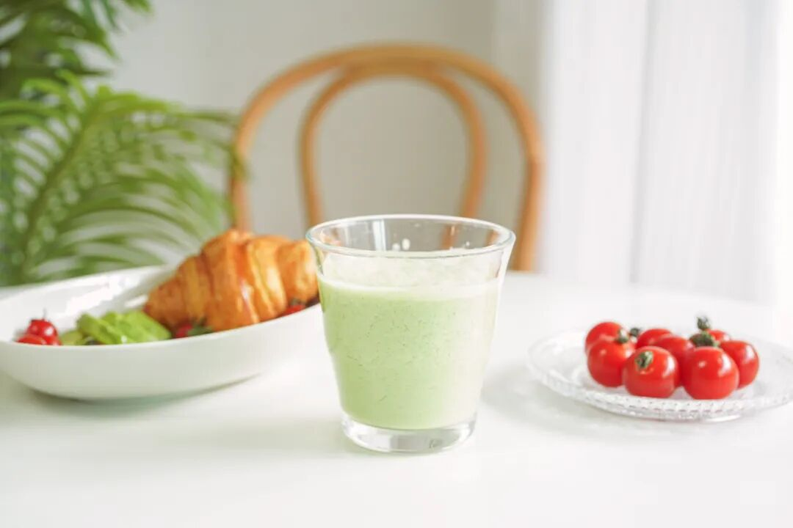

📙 做法：100g  有机水果甘蓝+ 半根有机黄瓜 +2 块冰，用榨汁机打到均匀即可。
💰价格参考：有机水果甘蓝（4.99元/500g）有机黄瓜（8.79元/300g）喝一杯「甘蓝瘦瘦奶昔」，成本约为 4 元。

第二道「牛肉时蔬沙拉」热量低，还肉多多
沙拉也是会吃的，特别是夏天太热的季节，就想吃点凉凉的甜甜的开胃的滋味。

沙拉好不好吃，取决于酱，怕胖的话，用牛油果和有机 4.0 厚酸奶替代沙拉酱。

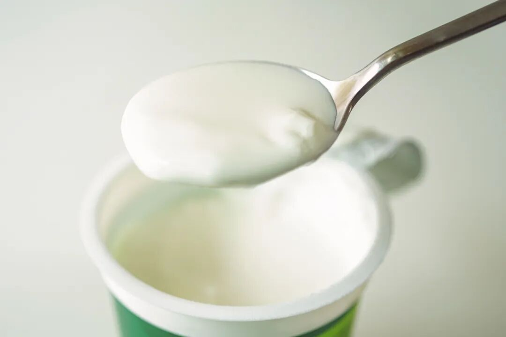

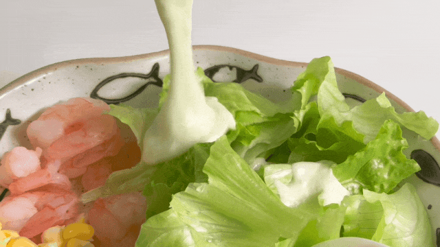

牛油果肥糯糯的，有机 4.0 厚酸奶自带小酸小甜，加一点点的有机茶籽油，好吃程度赢的不是一星半点。

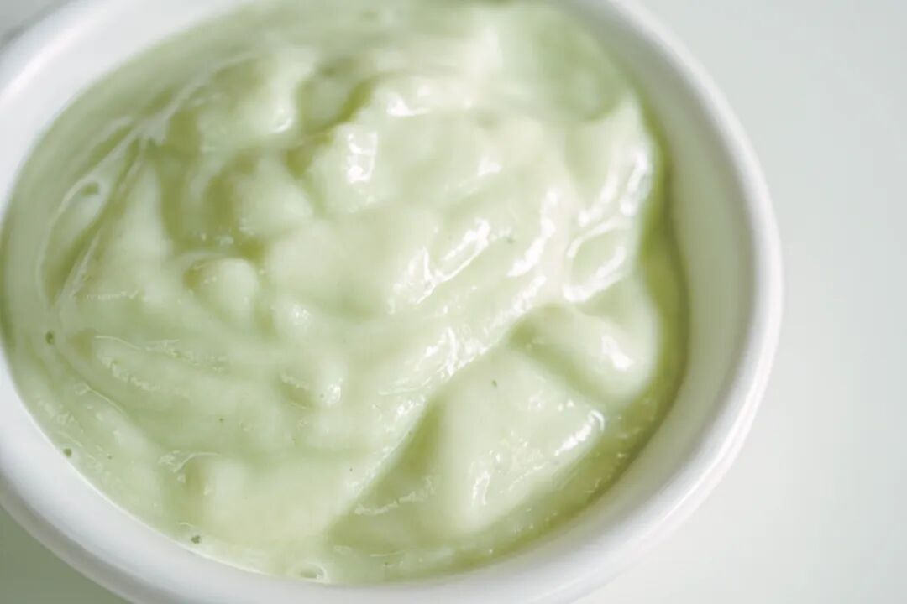

尤其是再搭他家有机甜脆玉米和有机生菜，脆生，嫩甜，真的是在嘴里嚼得出甜味。随手买点虾仁和即食牛肉片，撒点增香的香料粉，我可以吃一整个夏天！

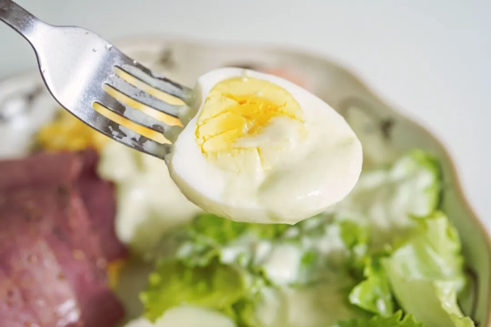

📙 做法：牛油果 1 个 + 有机 4.0 厚酸奶 2 勺 + 0 反式脂肪有机茶籽油 1 勺 + 一点点柠檬汁，撒黑胡椒、大蒜粉，打均匀，即可配任何沙拉。
💰价格参考：有机 4.0 厚酸奶（11.9元/400g） 0 反式脂肪有机茶籽油（125元/2L）有机甜脆玉米（9.9元/350g）有机生菜（4.99元/250g）吃一顿「牛肉时蔬沙拉」，成本约为 14~25 元，丰俭由人~

第三道「椰子小火锅」清爽开胃，酸酸甜甜
中国胃请在这里集合~不爱生冷还想靠吃变瘦的姐妹，我懂你！某红薯今年特别热门的椰子水煮菜，我试过了，很OK，值得一吃。

思路其实就是广东的椰子鸡，用椰子水作锅底，涮各种蔬菜和肉。可以配潮汕的牛肉丸，多煮一会儿汤底的肉味更浓郁一些。特别喜欢涮有机娃娃菜，口感格外水灵。还挑了一些有机褐菇，怎么煮都软嫩嫩的。

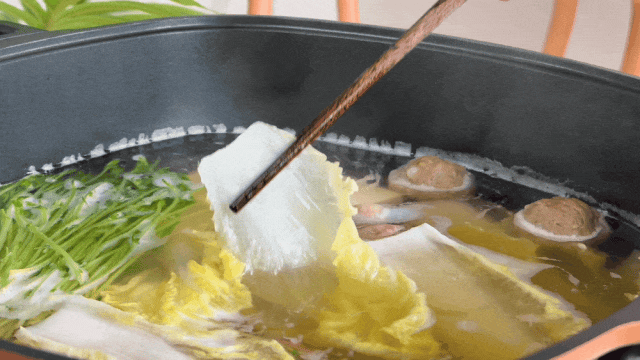

椰子火锅的灵魂，是用沙姜和小青柠调的蘸料。一口下去，瞬间回到夏天在广东吃鸡的街头。

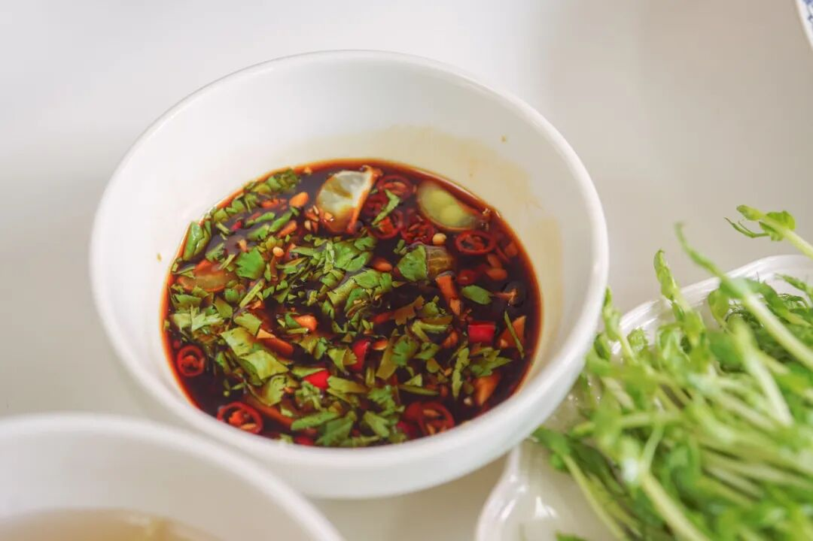

饭后再来碗汤，烫到将将断生的有机豌豆苗，浑身上下都舒坦极了~

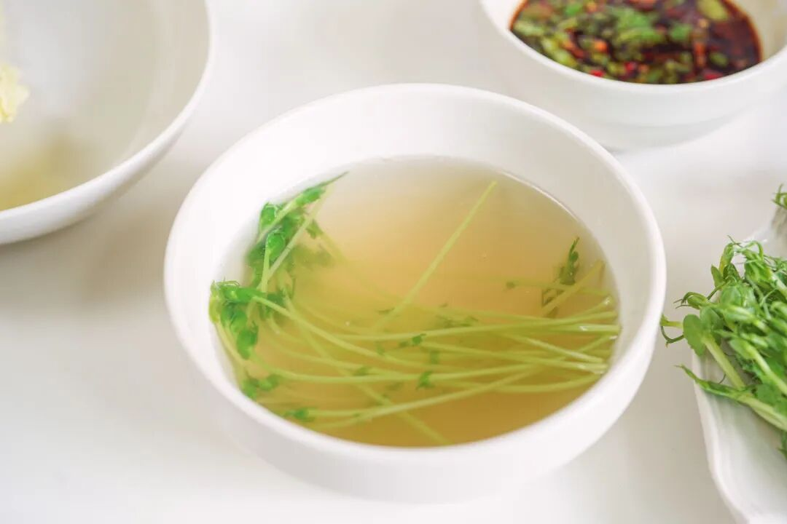

📙 做法：锅底是椰子汁和清水 1:1 的配比，蘸料主要是蒜末、沙姜末、小米辣和小青柠，再浇一点生抽就好，配什么蔬菜和肉都不错的。
💰价格参考：有机娃娃菜（6.89元/400g）有机褐菇（6.9元/230g）有机豌豆苗（6.8元/150g）吃一顿「椰子小火锅」，成本约为 12~20 元，丰俭由人~

第四道「低油小烧烤」空气炸锅就是永远的神！
最后当然是年年都要推荐的空气炸锅小烧烤啦，只需要刷一点点油，就能收获烧烤摊同款味道。

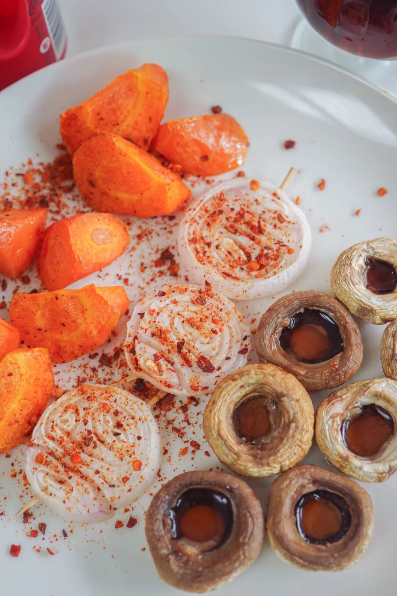

空气炸锅在我家简直就是劳模，每天都离不开它！
一定要吃有机白蘑菇，烤出来一汪鲜甜鲜甜的汁水，每次都和朋友抢着吃。

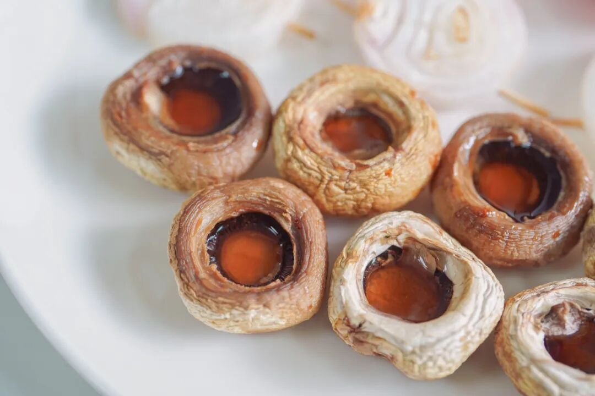

有机胡萝卜则是意外收获！经过高温烘烤后，质地变得软糯、绵香口感极像浓缩了香气的红薯。额外还烤了烤肉店同款的有机红洋葱。外层有脆脆的皮，内里是嫩脆嫩脆的，蘸点辣椒面可香了。

再来一杯无糖可乐，一边追剧一边吃，没错，吃烧烤也能健康且香喷喷~

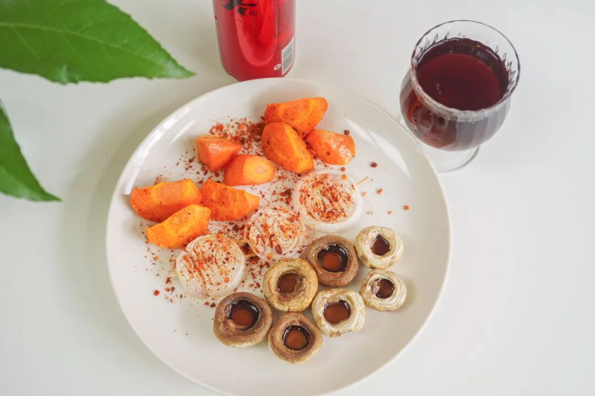

📙 做法：

有机胡萝卜切粗条或小块；有机红洋葱切片，用牙签串起来固定；有机白蘑菇去蒂

分别都刷一点 0 反式脂肪有机茶籽油，空气炸锅 180度 烤 20 分钟左右，拿出来看状态再加时间，出锅前可撒辣椒干料

💰价格参考：有机白蘑菇（5.99元/230g）有机胡萝卜（5.89元/400g）有机红洋葱（6.99元/400g） 0 反式脂肪有机茶籽油（125元/2L）吃一次「低卡小烧烤」，成本约为 7 元。
选购清单已经给你们整理好了
都是本薯吃过的，买！

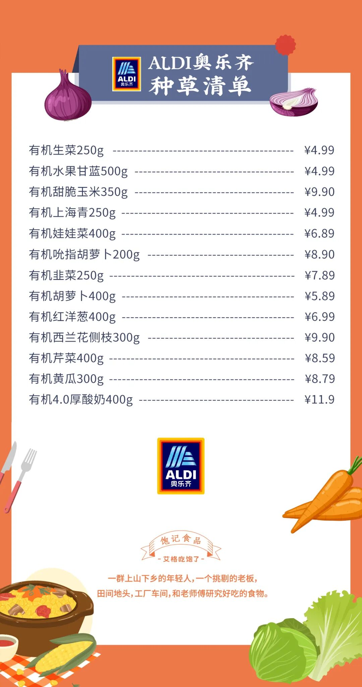