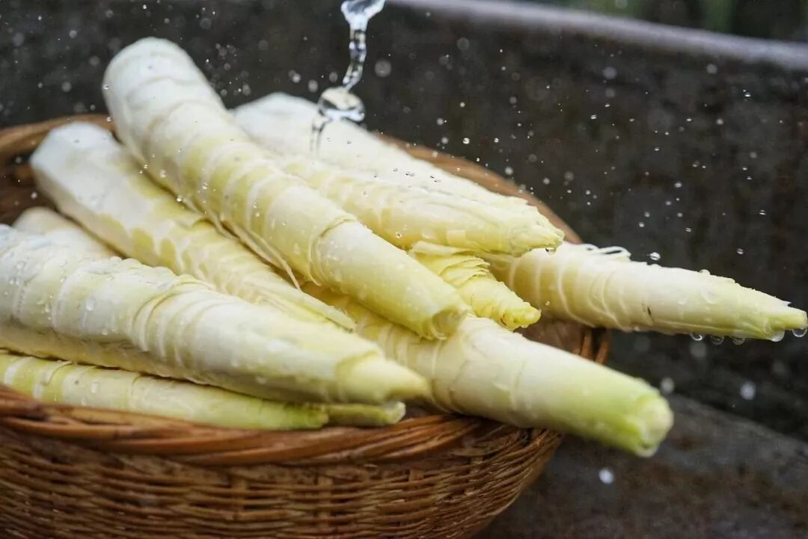
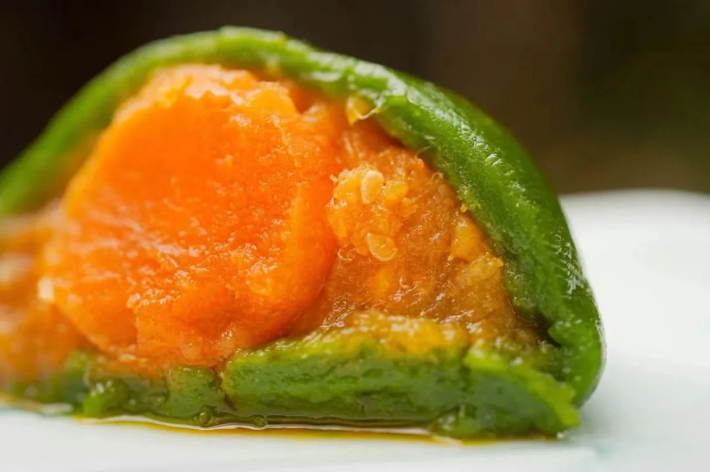
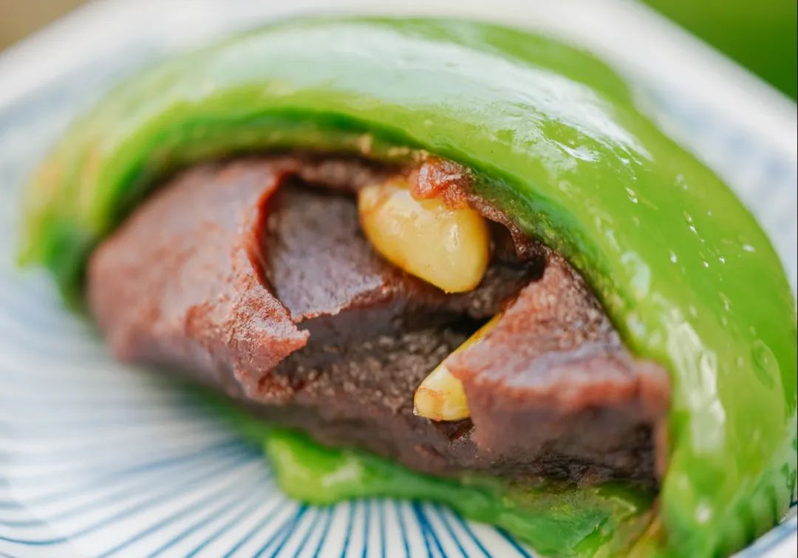
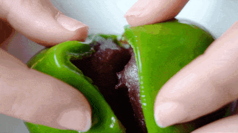
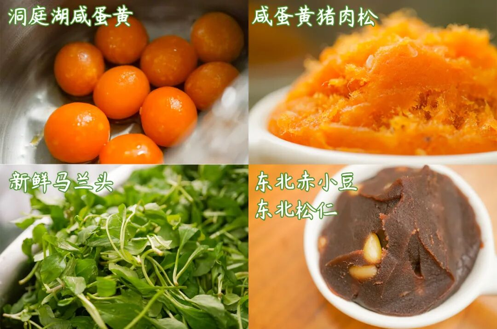
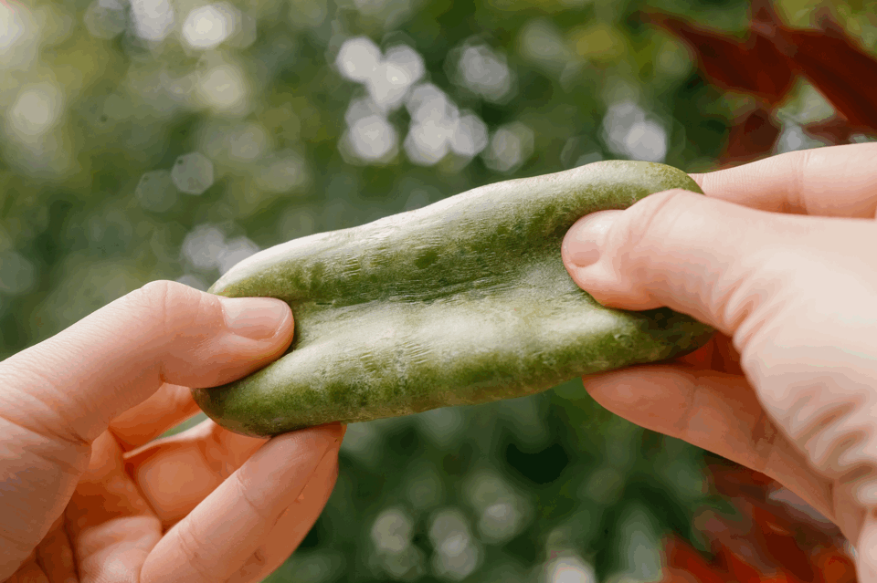
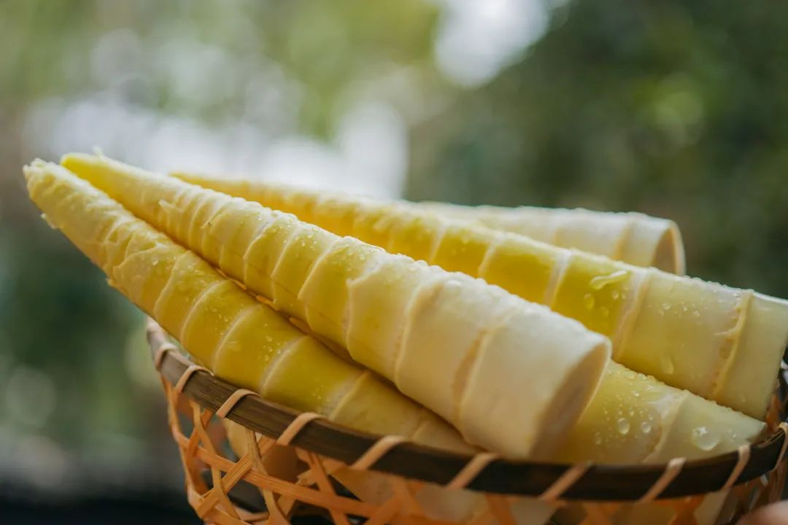
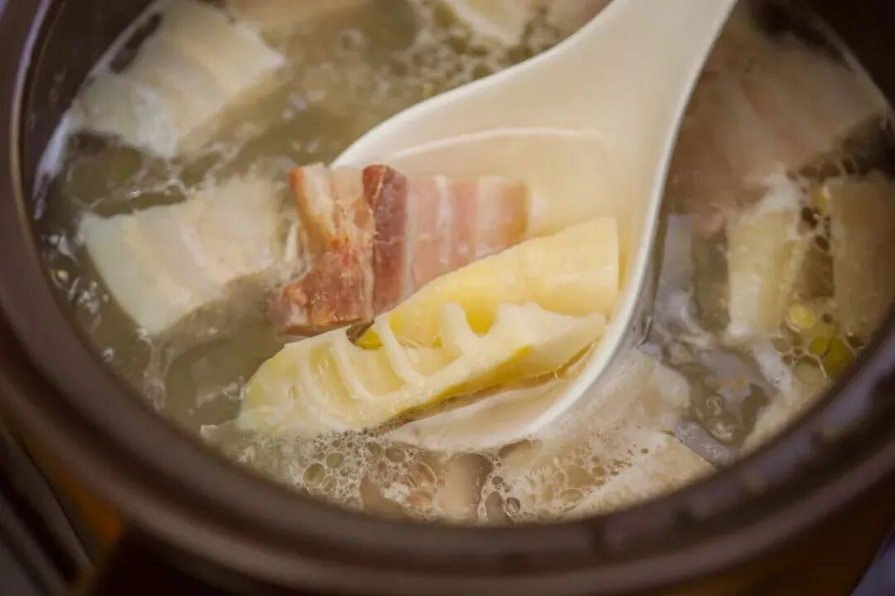
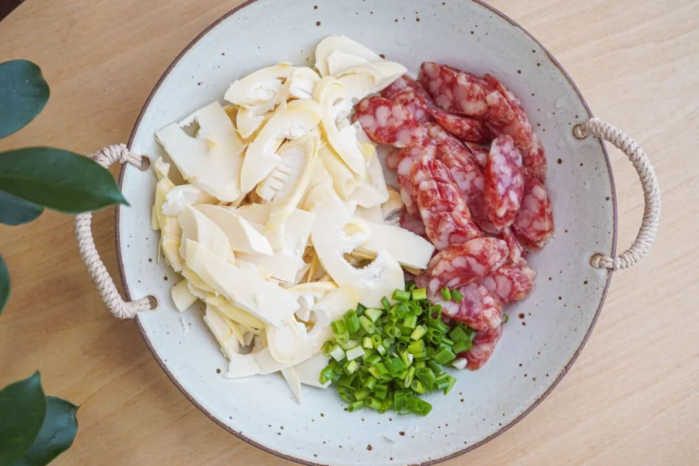
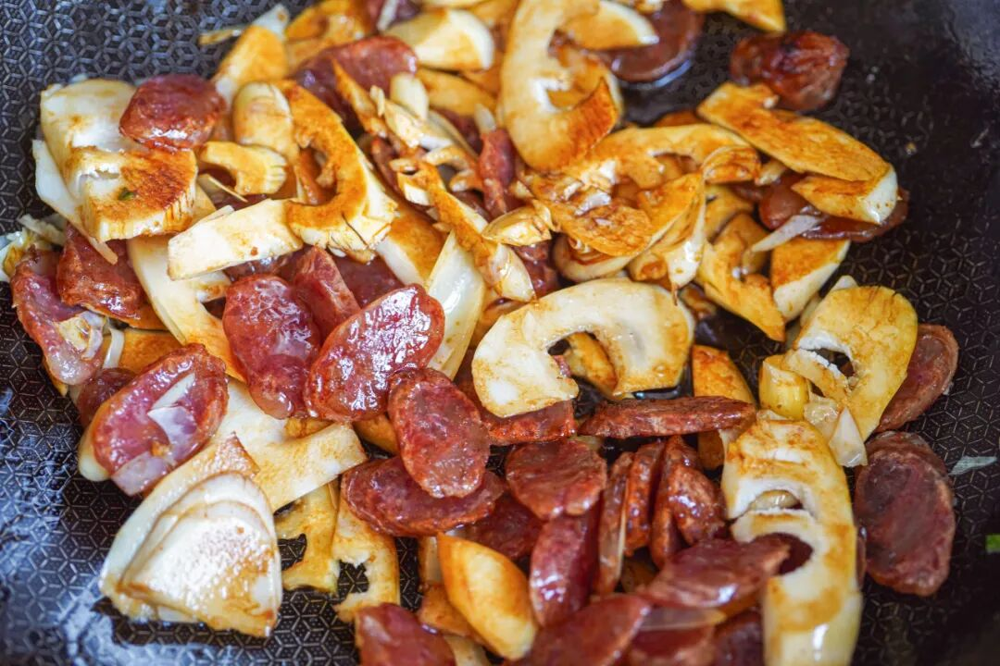

# 江南春天这一口，比肉还好吃。。。

- 原文链接: https://mp.weixin.qq.com/s?__biz=MjM5NTYxODQyMA==&mid=2653468018&idx=1&sn=c24daf4c2bdc213e34727a87ca657a45&chksm=bcaac88ed0a84f9cdb0ce47a89ea0d8980eb85c1228ffb2f007239ab2bb9a53d3c9890338ad4&scene=27#wechat_redirect
- 浏览量: N/A
- 点赞数: N/A
- 评论数: N/A
- 转发数: N/A

## 正文

好春光不如吃一场

一个尽情安利自我的公众号

以下是没事干研究院的风物研究报告请放心食用
要我说，这春光再美，也没有我尊贵的饱记客人好看呐！（谄媚脸最近本薯每每打开后台，好评根本截不过来。。。

一个个比我薯角还敢写。。。夸青团的👇

夸春笋的👇

都是老客人们真情实感的自发留言。产品同事不好意思吆喝，
但我薯角没在怕的！我司东西就是万里挑一的好！从产地卷到原料，市面上的你随便比嘿嘿～

先说这青团，怕甜怕油的放心冲，我们调味很克制，亲测吃完一整个都不腻。

一共三个口味！先跟我尝一枚热乎乎的整颗咸蛋黄肉松，名副其实，肚子里有一整颗咸蛋黄！搭配猪肉松 + 白芝麻，塞得圆滚滚，软糯咸香！有趣。

市面少见的整颗咸蛋黄还是从洞庭湖现运现蒸的！

再来一枚豆沙松子，哟呵，皮又薄又弹，豆沙细腻爽滑，松子香喷喷，一口流心，又是另外一种滋味。爽滑。

豆沙需提前炒制好，再搭配上饱满的松仁。

最绝的是春季限定马兰头香干，（本薯强推！！！
就是江南春天那一盘经典的时鲜菜，比肉都好吃！入口清爽鲜美，一咬开，啧，这不就是春天的味道么？爽了。

马兰头不用多说，春天新鲜采摘，再同卤香干一起，切碎凉拌。

对此我只想说，天南海北你是真不嫌麻烦啊！

当然皮子这一块也没放过，上海传统青团的皮子偏软粘嘴，不如江浙一带青团更带劲儿，糯糯的又不失嚼劲。

所以特别加入了泰国糯米粉，吃起来，QQ弹弹能拉丝。。。。

总有朋友留言，这青团一定要蒸吗？是的。且一定要蒸个二十分钟左右。因为饱记青团还是热加工工艺，需冷冻保存，相比市面冷加工青团，蒸好后皮子更为软糯有韧劲！

掀开一锅热气，才敢说是亲妈味道呀～～

这青团现在已经现货！限时 85 折！！

收到货之后，

强烈建议大家尽快吃掉！

怎么吃？

无需解冻，无需拆保鲜膜，

蒸锅水开上锅蒸 20 分钟左右就行。

如果不立即吃，

收到后请立即放入冰箱冷冻（-18℃以下）保存，

冷冻保存60天。

饱记·妈妈牌青团现货中！限时 85 折！！！
戳图或去🍑🍑🍑搜索「艾格吃饱了」下单购买👇

再说这春笋，每年春天，被米其林餐厅师傅复购数次，有多好吃呢？每周餐厅客人都要吃掉七八十斤！

虽是高级餐厅品质，但近期老天爷赏脸，价格已经帮大家打下来了！趁着时令速冲！

无需任何厨艺，

随便炒就超脆甜，

感觉还没长大，就被从土里薅出来了。。。

千言万语汇成一句，

大家快来买啊！！！买完把它带回家，炒，煲，蒸，焖！随便糊弄熟就好吃！

简单炖一锅超级鲜的腌笃鲜，笋白白嫩嫩的，一勺一勺里盛的全是春天独有的清香！

炒一盘油焖笋，酱香和笋的鲜香交织，一口下去鲜香脆爽，好下饭！

还有这道春笋腊肠焖饭，

所需材料如下👇

用的我司雷笋和腊肠，

都是真材实料。

有多简单呢？

把食材切片，

下锅简单翻炒出香味👇

通通丢进电饭锅蒸熟即可！

两步到位！

出来就是香甜脆爽的一锅春鲜饭！

插播一下，

由于这笋太嫩太脆，

我司摄影师打下手时大惊：

好容易切烂掉👇

毕竟这自然笋实在难得！

在临安天目山核心产区

捂了一整个寒冬腊月。

老板只要那几个周边村子的笋，亲自跑到产区去挑的。

拒绝外地笋哦。

产区选对了，还要精挑！据说运用了「妈妈去菜市场挑笋」的家传智慧，只选大小、嫩度适中的青年笋，一开始都是拿尺子直接量，这几年下来阿姨们熟练了，才开始人手精挑，属于是笋中精品的存在了。。

所以我司春笋，外面根本买不到！即使是同一个产区，也不是同一层次的品质嘿嘿～

它几乎不用处理，

就有原汁原味的鲜甜感，

细嫩无渣，

跟市面上大多数笋都不同！

每年就卖一两个月，卖完就没了！想吃的，快冲啊！！

最多焯水一分钟，

（其实不焯水也不麻嘴

尝尝早春江南时鲜的味道，

真的很鲜甜，

是外面买不到的那种鲜甜。

现在降价了！！

现在还有难得的限时 9 折！

去买。

饱记·2025 临安天目山雷笋购买方式如下限时吃笋 9 折！！！

戳图购买👇

题 外

朋友们春天好啊！

没吃够的看这👇上周上架的红膏梭子蟹，高级餐厅品质！满满都是膏！限时 9 折！

春笋刚好配真材实料的饱记腊肠，

限时地板价 8 折！

或者试试好吃不贵的

玫瑰露酒腊肉&腊排骨，

更是限时地板价 7 折！

回到童年的铁盒蛋卷，

产品经理卷出来的鸭舌、麻花、猪肉脯，

都给一个限时 7 折！！

还有些时令水果👇

难得回归的泰国超甜多汁金柚，

限时早鸟 86 折！

来自湖北的超甜晚熟红橙，

刚到不久的卷中卷红玉芒果，

娇艳可人的雷州木瓜，

口味浓甜的蒙自花长虹枇杷，

来自精品小果园的云南沃柑，

好吃不怕胖的广西芭乐，

人称「水果冰淇淋」的凤梨释迦！

清新浓郁的万人迷上海金奖草莓👇

现在也有限时 9 折！

此外 90 天短保质期的大师凤梨酥，

也都有限时 9 折冲冲！

饱记·东海春季红膏梭子蟹

购买方式如下

限时 9 折！！！

戳图下单购买👇

饱记·手工腊肠购买方式如下👇限时地板价 8 折！！！！
戳图下单购买👇或🍑🍑🍑搜索「艾格吃饱了」

饱记·玫瑰露酒腊肉&腊排骨购买方式如下👇限时地板价 7 折！！
戳图下单购买👇或🍑🍑🍑搜索「艾格吃饱了」

饱记·多汁泰国金柚

购买方式如下

限时早鸟 86 折！！

戳图购买👇

饱记·海南红玉芒果

购买方式如下

限时吃水果 9 折！！！

戳图购买👇

饱记·晚熟超甜红橙购买方式如下限时吃水果 9 折！！！
戳图购买👇

饱记·湛江雷州木瓜

购买方式如下

限时吃水果 9 折！！

戳图购买👇

饱记·凤梨释迦购买方式如下限时吃水果 9 折！！！
戳图购买👇

饱记·蒙自花长虹枇杷购买方式如下限时吃水果 9 折！！！
戳图购买👇

饱记·云南晚熟沃柑购买方式如下限时吃水果 9 折！！！
戳图购买👇

饱记·广西芭乐

双拼&奶油芭乐

限时吃水果 9 折！！

戳图购买👇

饱记·红颜草莓限时吃水果 9 折！！！节日莓有烦恼！！
戳图购买👇

饱记·限定铁盒酥酥蛋卷

购买方式如下

限时 7 折！！！

戳图购买👇

饱记·年味零食7 折专区！！
购买方式如下
戳图购买👇

饱记·新鲜到货凤梨酥

限时 9 折！！！
戳图购买👇

本文的研究员

薯角我想我知道春天的味道

用好吃的方式吃一生

祖国各地好风物

文章转载请加微信「baojiclub」

