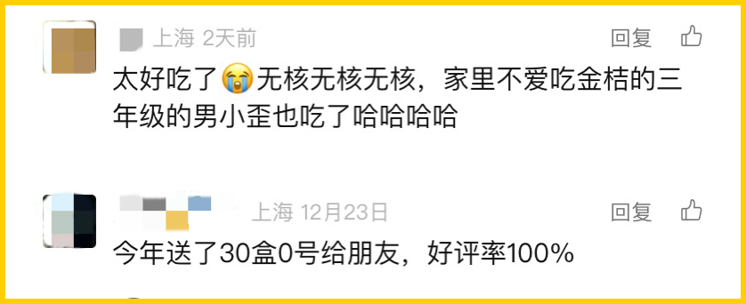
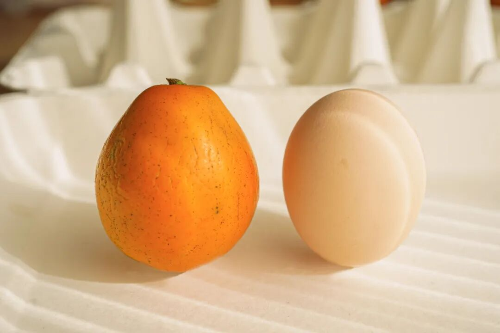
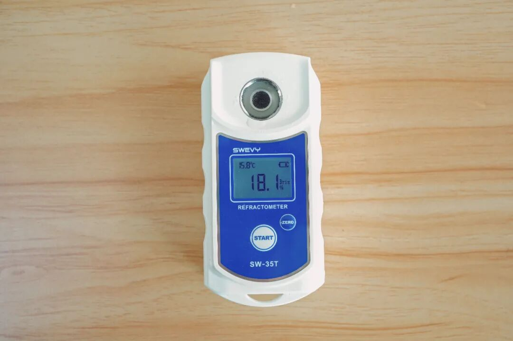
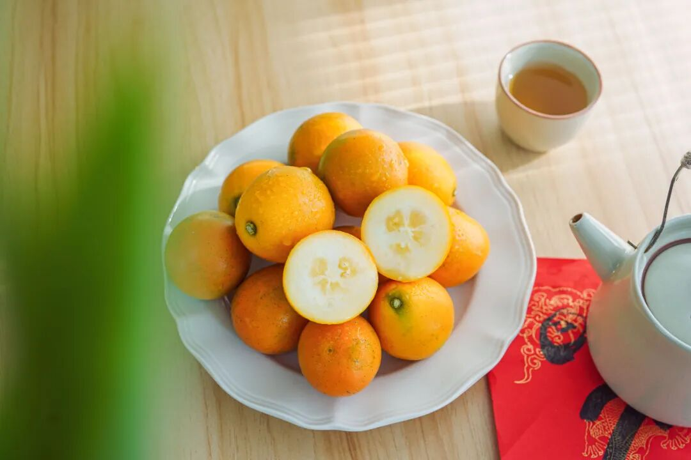
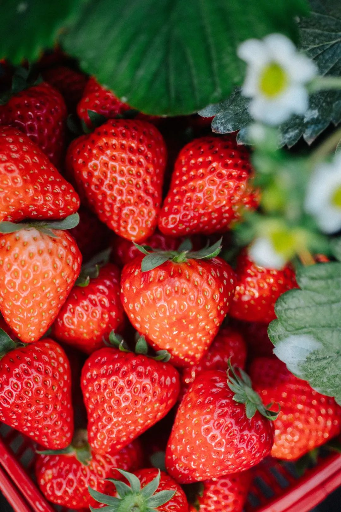
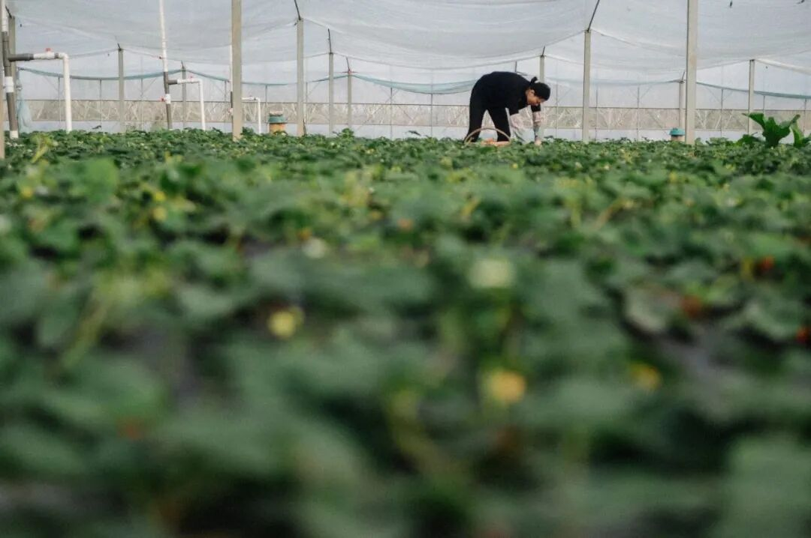

# 没心思上班了，买完这两种好东西就撤

- 原文链接: https://mp.weixin.qq.com/s?__biz=MjM5NTYxODQyMA==&mid=2653464499&idx=1&sn=615f5165c0c16d7429c7f436200f5551&chksm=bc991c7b2f3c99aaf9997d73ed3a11ec0f9640c22ee1893154e1ce2e053c823546c30e2d7ac5&scene=27#wechat_redirect
- 浏览量: N/A
- 点赞数: N/A
- 评论数: N/A
- 转发数: N/A

## 正文

明年见

一个尽情安利自我的公众号

以下是没事干研究院的风物研究报告请放心食用
如题！2024 年的最后一个工作日，给大家吆喝两款好东西，都寓意好、气质佳，这阵子聚会撑场子不在话下！

新年场面之选其一：这一枚来自广西融安的脆蜜金桔。足以颠覆自小到大的金桔风味印象！不麻嘴，不涩口，
从皮到芯都纯甜！

不是薯角我自夸，看看评论区的真实评价👇（大家会写多写！！！

此乃金桔界的第三代稀有品种，
个头大，我司选定四种规格，最大的 0 号果王大过鸡蛋！
送礼显得咱大方又体面。最小的 3 号中果都有乒乓球大小，自家吃吃或招待客人也没在输嘿嘿～

这果子不仅长得实诚，口感和以往吃过的也都不同，没有入口就让人龇牙咧嘴的桔皮味，从芯子到脆皮都是蜜蜜甜的，且无核化渣，一咬 biu 汁！随手一测糖度都能达 18！

还是骄傲地说，饱记的生鲜水果，是一定要保持所有渠道随便比的程度！我司永远会去卷产地，只卷核心产区的精品果园！融安金桔这家能入选，也是因其风土、品种与管理。

获得过柳州市脆蜜金桔优质果品质量评比“特等奖”。

它是融安县第一个

成功种出脆蜜金桔的果园（母本园），

果园里都是 8+ 年老树，

保证品种纯正果味浓。

老树果园平时都得上锁，以防被盗，这枝条在外一斤能卖 ¥1000！因为非母本园的果子，

就有更大的可能性不甜麻嘴、无水分。

自家吃推荐乒乓球一般的 3 号果，性价比高！多啃不心疼！送礼可以考虑鸡蛋大的 0 号果王，给朋友一点来自山里的震撼！
给大家吆喝来限时 9 折，只到本周五！买它！！！

饱记·融安脆蜜金桔限时吃水果 9 折！！！新年大桔大利！！！
戳图购买👇

新年场面之选其二：比丹东草莓还要卷的上海白鹤红颜草莓！

又可称之为，看了就想偷吃、吃完就会下单的万人迷草莓👇

「白鹤草莓」，

乃上海草莓之代表，

被评为「中国农产品地理标志」，

青浦更是当下国内外主要的草莓产区之一。

我饱记选的，拿过上海地产优质草莓品鉴评优活动的金奖！

完全按评金奖要求挑的，

评委吃的啥我们也吃的啥～

（是的，就是这么骄傲！

这金奖草莓，还没有入口，就能闻到剧烈的香气。

咬一口，汁水在口腔里蔓延，

鼻腔同时又被弥漫的香气包裹。

真的会上头。

此外，它还品相极佳，个头秀丽，颗颗都饱满红艳，
因为还是饱记标准，每一颗都要经过人工精筛嘿嘿～

大家关心的草莓农残问题，

这一点，请放一百个心！

上海对地产草莓的监管很严格，

是要纳入上海市种植业生产信息管理系统的，

所以都是有据可查，几乎没什么农残。

合作社的果农们说，

自己平时在地里渴了，

也会随手吃点草莓当水喝。

（hhhhhh我一点都不羡慕

白鹤各家合作社种植户遵从绿色种植原则，

采取有机种植方式，

比如会在大棚内养蜂，让蜜蜂给草莓自然授粉，

设置捕虫袋，通过物理的方式来抓虫，

有的还会利用合作社种的玉米杆子，

给草莓土壤补充营养。

最重要的是，如果你和本薯一样生活在包邮区，
这草莓有压倒性的优势！丹东的草莓当然不差，

可能大家不知道，买草莓，

本地能吃到是最好的。

这里主要是运输上的损耗。。。

丹东草莓发货一般在六七成熟，

但是白鹤草莓可以做到八九成熟再采摘发货，

那当然是更软糯更浓郁啦。

（所以大家现在可以打开地图看看距离了。。。

这水果初上市最为矜贵，

目前价格比较高，

后续慢慢会降！

大家就当尝个鲜！

大过年的，薅一个限时 9 折，

本薯要折扣不易！

应吃尽吃哇！！！

饱记·红颜草莓限时吃水果 9 折！！！新年莓有烦恼！！
戳图购买👇

题 外

敲锣打鼓，

千呼万唤的饱记年货礼盒也预售啦！！

地板价，过几天就没！

限时单盒立减 60 元！

以及刚补货的 75% 木姜子黑巧克力，

90 天短保质期的大师凤梨酥，

也有限时 9 折！

其他适合空调房吃吃的水果也看这里👇

一次尝俩的广西双拼芭乐，

扎实的冰激凌球口感！

还有今年份的象山红美人，

入口似果冻般嫩嫩滑滑～

现在也有限时 9 折！

最后今年大闸蟹已到尾声！

苏南蟹标杆美味：太湖流域大闸蟹

苏北蟹宝藏性价比之选：洪泽湖大闸蟹马上就没！

饱记·年货礼盒（预售中）

1.3 起按顺序发货

限时早鸟价！

单盒立减 60 元！

两盒立减 130 元！

戳图购买👇

饱记·富平柿饼购买方式如下限时过节 9 折！！！
戳图购买👇

饱记·新鲜到货凤梨酥

限时 9 折！！！
戳图购买👇

饱记·云南木姜子75%黑巧克力

购买方式如下

限时 9 折！！

戳图下单购买👇

或🍑🍑🍑搜索

「艾格吃饱了」

饱记·象山红美人柑橘

限时吃水果 9 折！！！

戳图购买👇

饱记·广西双拼芭乐限时吃水果 9 折！！！
戳图购买👇

饱记·太湖流域大闸蟹

购买方式如下

三种搭配：

满足装，

3-3.4 两母蟹，4-4.4 两公蟹，

吃过解馋。

劲爽装，

3.5-3.9 两母蟹，4.5-4.9 两公蟹，

可以拍照发朋友圈争奇斗艳。

尊享装，

4-4.4 两母蟹，5-5.4 两公蟹，

顶格水准，适合送礼。

人工精挑，

上岸后静养一两日更鲜美，

每日限量 50 箱。

拼的就是手速。

顺丰快递发货，

新鲜看得见。

戳图下单购买👇或🍑🍑🍑搜索「艾格吃饱了」

饱记·洪泽湖大闸蟹

购买方式如下

满足装洪泽湖大闸蟹：

3 两母蟹，4 两公蟹。

性价比之选！

劲爽装洪泽湖大闸蟹：

3.5 两母蟹，4.5 两公蟹。

饱记热销款。

尊享装洪泽湖大闸蟹：

4 两母蟹，5 两公蟹；

或 5 两母蟹，6 两公蟹。

实际超重，量极极极少，送礼佳品。

人工精挑，

上岸后静养一两日更鲜美，

每日限量 100 箱。

顺丰快递发货，新鲜看得见。

戳图下单购买👇或🍑🍑🍑搜索「艾格吃饱了」

本文的研究员

薯角多吃点，好过冬

用好吃的方式吃一生

祖国各地好风物

文章转载请加微信「baojiclub」

