# 没错，就是你们天天催的芒果。

- 原文链接: https://mp.weixin.qq.com/s?__biz=MjM5NTYxODQyMA==&mid=2653467537&idx=1&sn=97d46a0eca789a667646a0f674de2799&chksm=bc77ac15ce18660ad0656f65751b3eb15ad919f940f0995ffc1b546fb20207ad9cb4446cff68&scene=27#wechat_redirect
- 浏览量: N/A
- 点赞数: N/A
- 评论数: N/A
- 转发数: N/A

## 正文

勿辜负！

一个尽情安利自我的公众号

以下是没事干研究院的风物研究报告请放心食用
我司曾有一种芒果，

开箱就香气四溢，

皮薄肉厚汁水足。

今天，它终于回来了！！！

本薯可以豪气万丈地说，

你试试，有更好的算我老板输！

正是这一枚红玉芒果！海南当地小众品种，来自我饱记合作多年的精品小果园，不是大路货。

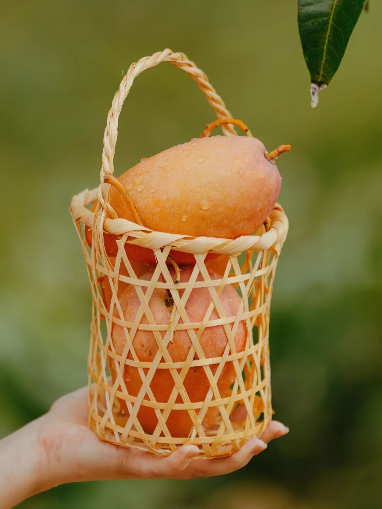

这芒果吃起来，细嫩无渣一口滑，口感就像天然小布丁！果味巨巨巨巨巨浓甜，实不相瞒，我吃完一个，手指上都是芒果香！

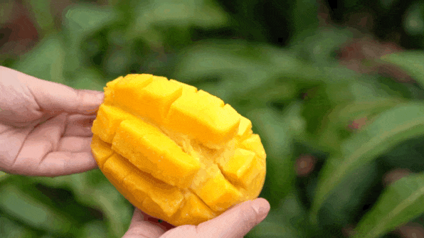

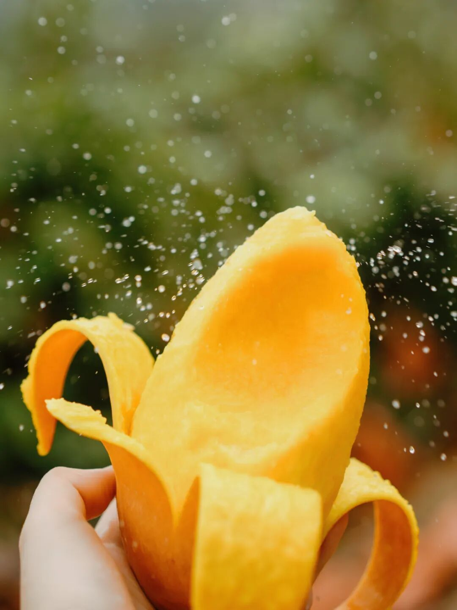

好吃也就算了，它核还小，超薄一片，（这得房率能有90%了我看。。

所以我劝你把皮剥了之后，直接拿勺挖着吃，那才叫一个爽啊。。。

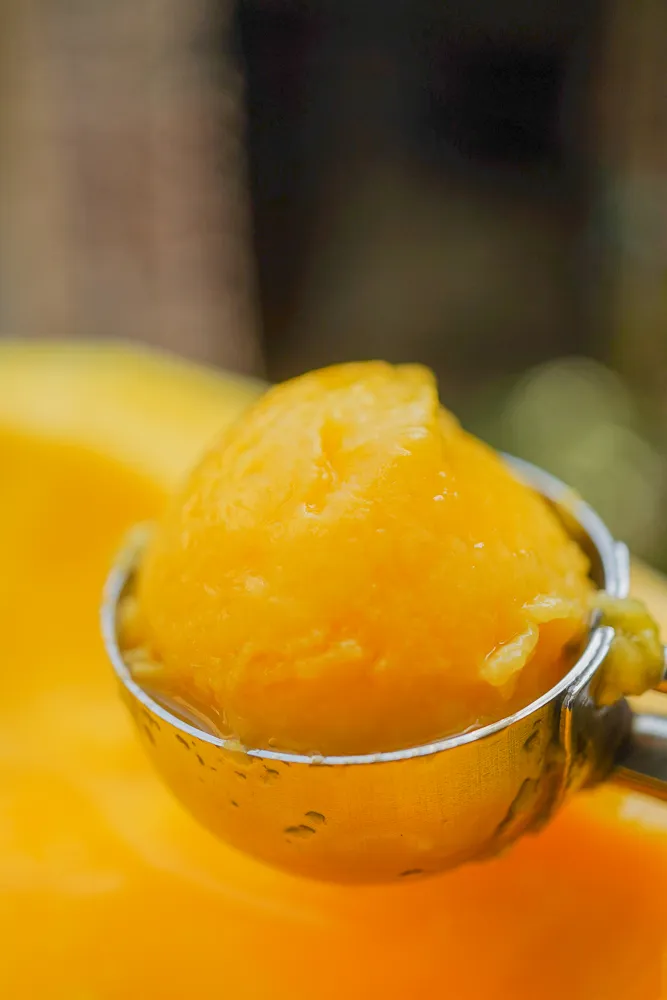

汁水也巨多，给你们看看市面上不同品种，取同等克数榨出来的对比图，
一目了然～

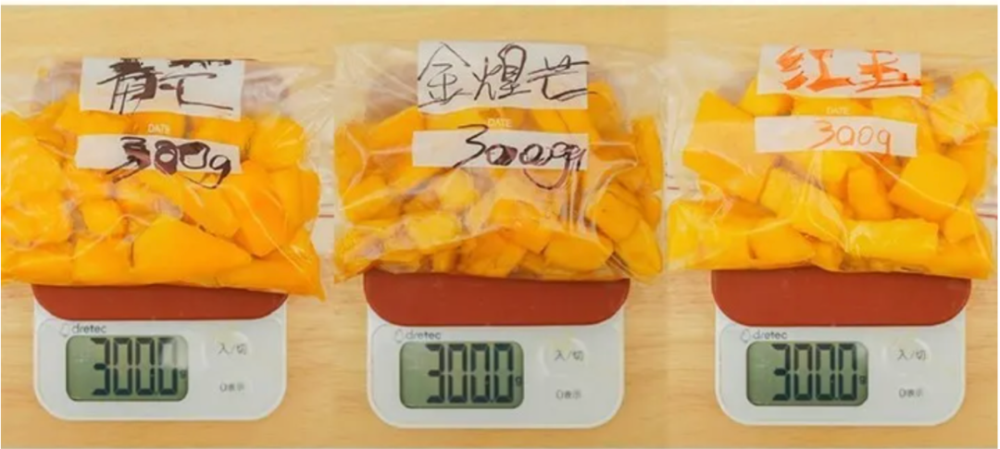

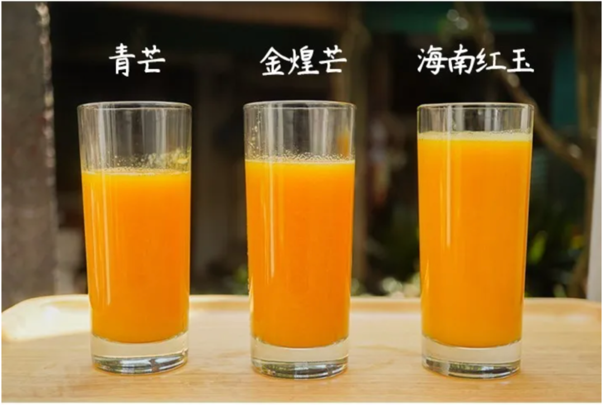

还贼能长个，每个到手个头超一斤，又大又圆，你说你搞得这么卷，真是不给其他芒果活路了啊！

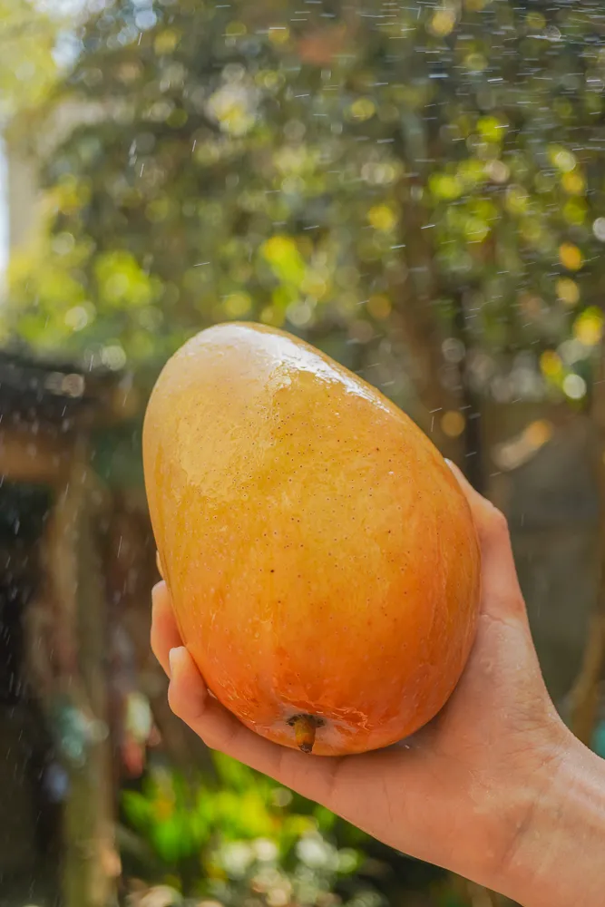

一只手拿不住，真大啊。。。
我饱记选的果园，海拔 600 米以上，昼夜温差大，种出来的果子风味就更足！

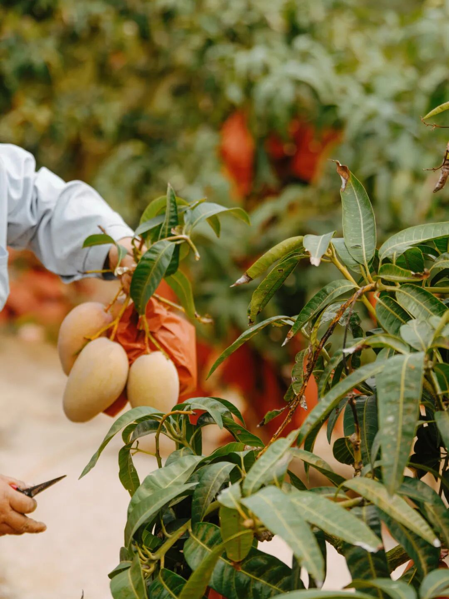

30 年老树，树上挂足 120 天，自然八分熟发货，果园鲜采现发，到你手上差不多刚刚好！

当地种芒果的大哥曾以他在水果届摸爬滚打了十几年的经验很诚恳地告诉我：
红玉芒树上熟市面上很少见，因为这个品种难伺候，本身种植的损耗率就高，此外运输过程中损耗也高，
综合以上原因，他很坚定地表示：90%的果农都不可能这么做。

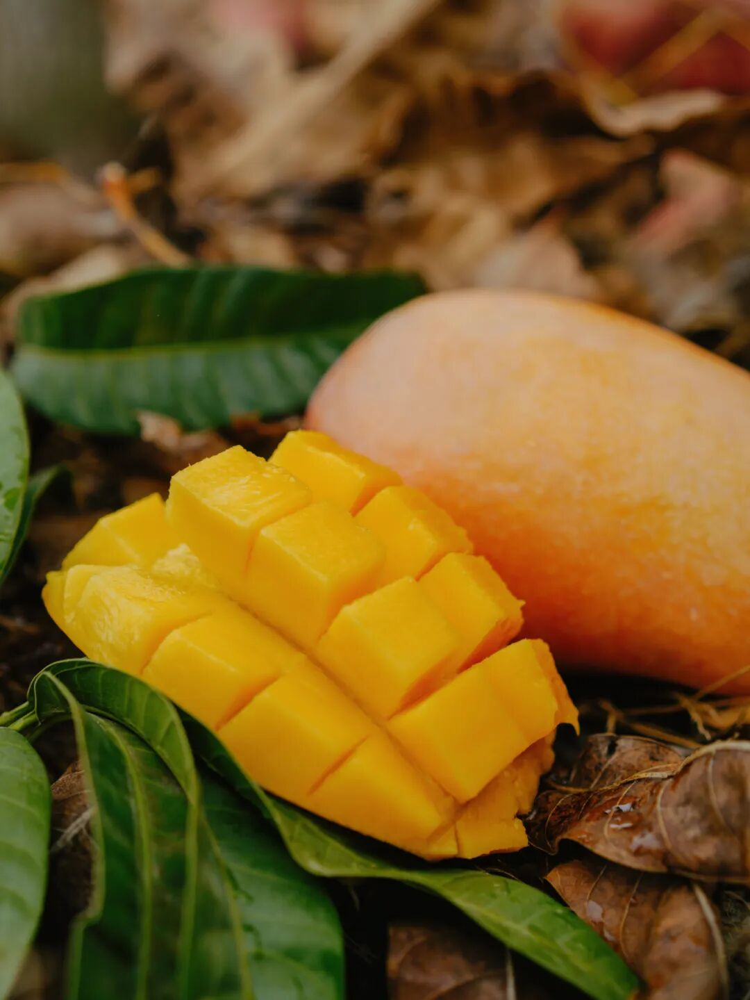

那为什么我饱记能做？也没啥。因为我司本来就只卷精品果，结论就是，你在外面很难买到。

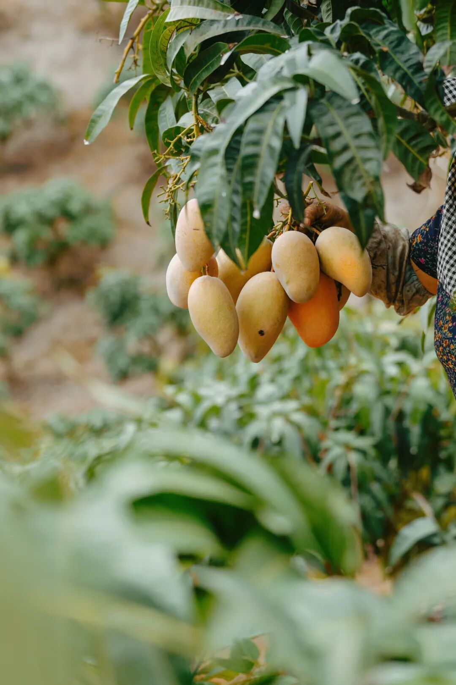

看看之前后台真情实感的好评👇

如此懂事的美味，现在还有限时早鸟 86 折！🔗我放这了，你们去买吧！

饱记·海南红玉芒果购买方式如下限时早鸟 86 折！！！
戳图或去🍑🍑🍑搜索「艾格吃饱了」下单购买👇

此外还有好消息一则！！我司小众选手广西芭乐，现在既可以买双拼，也可以单买奶油白心芭乐啦！

奶油白心芭乐的几乎无酸，草莓红心芭乐更香。（个人感觉可以当天然香氛用吃起来都是扎实的冰激凌球口感，滑滑糯糯~

芭乐往北走比较少见，但其实是奶茶店里的常客！
有人爱它美貌，有人爱它独有香气，更多的是贪图那一口：可以大口啃的丝滑~~~

微甜，饱腹，没啥热量，（多吃不胖，没啥负担还好吃，谁不爱呢但好吃的芭乐难寻~

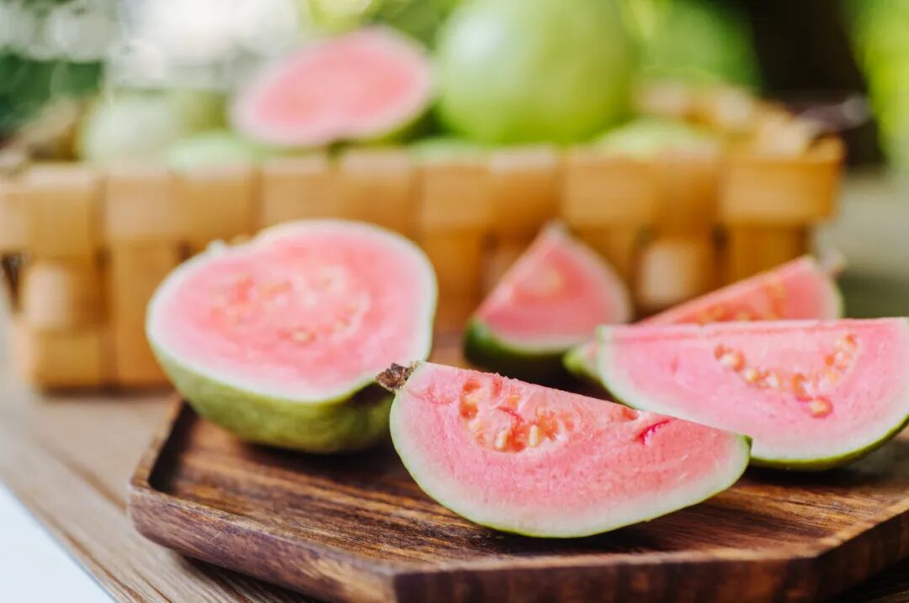

不过我司在生鲜水果上，一向没在怕的！这芭乐产自广西玉林民乐镇，
是国家首批生态家园建设示范点。（不用我说，国家认可的好山好水好环境！施农家肥，物理防虫，吃的就是一个原生态~

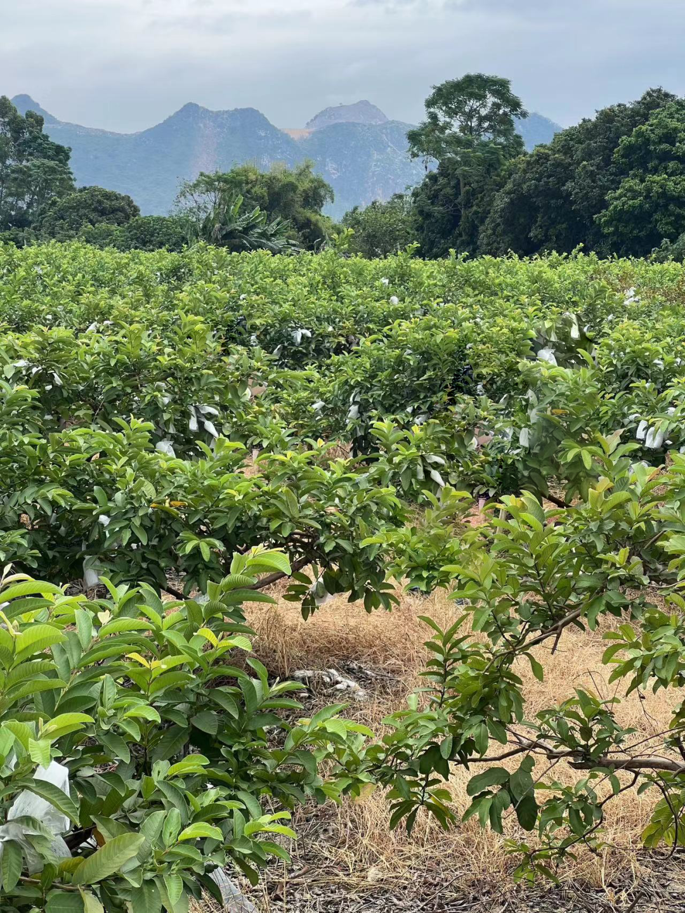

随赠酸梅粉哦，广西酸嘢吃法，还可以蘸辣椒盐。（推荐亮爷辣椒盐，这篇里有最近想买的便宜货（无广

饱记·广西芭乐双拼&奶油芭乐限时吃水果 9 折！！
戳图购买👇

题 外

朋友们春天好啊！

没吃够的看这里👇早春糯唧唧顶流，上周刚上架的我饱记青团买了吗？

趁现在限时 85 折！

刚冒出来的临安天目山雷笋，

米其林餐厅师傅第三年回购，

不焯水就鲜甜！

现在也有限时 9 折！

刚好配真材实料的饱记腊肠，

限时地板价 8 折！

或者试试好吃不贵的

玫瑰露酒腊肉&腊排骨，

更是限时地板价 7 折！

回到童年的铁盒蛋卷，

产品经理卷出来的鸭舌、麻花、猪肉脯，

都给一个限时 7 折！！

还有些适合空调房吃吃的水果👇

口味浓甜的蒙自花长虹枇杷，

娇艳可人的雷州木瓜，

来自精品小果园的云南沃柑，

人称「水果冰淇淋」的凤梨释迦！

清新浓郁的万人迷上海金奖草莓👇

个头基本都在18mm+的云南露天蓝莓，

现在也有限时 9 折！

此外 90 天短保质期的大师凤梨酥，

也都有限时 9 折冲冲！

饱记·妈妈牌青团

现货中！

限时 85 折！！！

戳图或去🍑🍑🍑搜索

「艾格吃饱了」

下单购买👇

饱记·2025 临安天目山雷笋

购买方式如下

限时吃笋 9 折！！！

戳图购买👇

饱记·手工腊肠购买方式如下👇限时地板价 8 折！！！！
戳图下单购买👇或🍑🍑🍑搜索「艾格吃饱了」

饱记·玫瑰露酒腊肉&腊排骨购买方式如下👇限时地板价 7 折！！
戳图下单购买👇或🍑🍑🍑搜索「艾格吃饱了」

饱记·湛江雷州木瓜

购买方式如下

限时吃水果 9 折！！

戳图购买👇

饱记·蒙自花长虹枇杷购买方式如下限时吃水果 9 折！！！
戳图购买👇

饱记·云南晚熟沃柑购买方式如下限时吃水果 9 折！！！
戳图购买👇

饱记·凤梨释迦购买方式如下限时吃水果 9 折！！！
戳图购买👇

饱记·限定铁盒酥酥蛋卷

购买方式如下

限时开门红 7 折！！！

戳图购买👇

饱记·年味零食7 折专区！！
购买方式如下
戳图购买👇

饱记·云南高原蓝莓限时吃水果 9 折！！！新年莓开眼笑！！！
戳图购买👇

饱记·红颜草莓限时吃水果 9 折！！！节日莓有烦恼！！
戳图购买👇

饱记·新鲜到货凤梨酥

限时 9 折！！！
戳图购买👇

本文的研究员

薯角啊！赞美春天！

用好吃的方式吃一生

祖国各地好风物

文章转载请加微信「baojiclub」

