# 淘宝是有什么毛病。。。。。。

- 原文链接: https://mp.weixin.qq.com/s?__biz=MjM5NTYxODQyMA==&mid=2653461048&idx=1&sn=1cab6c486368a33227f31b86ca472760&chksm=bc1df4692db651a08e1f71bf07f26d9e610b08179310fb4663f6a30c9968f9e0fa3b850201cc&scene=27#wechat_redirect
- 浏览量: N/A
- 点赞数: N/A
- 评论数: N/A
- 转发数: N/A

## 正文

羊毛薅起来！！

一个尽情安利自我的公众号

以下是没事干研究院的风物研究报告请放心食用

双十一到底什么毛病。。。

这个机制那个凑单，

一点开眼花缭乱，

看得我薯角快愁成薯饼

算了算了，摆烂走起！

随便平台怎么整，

反正我司躺平开卖的好风物就那些！

大闸蟹、山核桃、金山鸡、金桔酒

腊肠、时令水果以及今天刚刚新到货一批的

大师凤梨酥！

不管怎么算，总之现在买就是最划算！

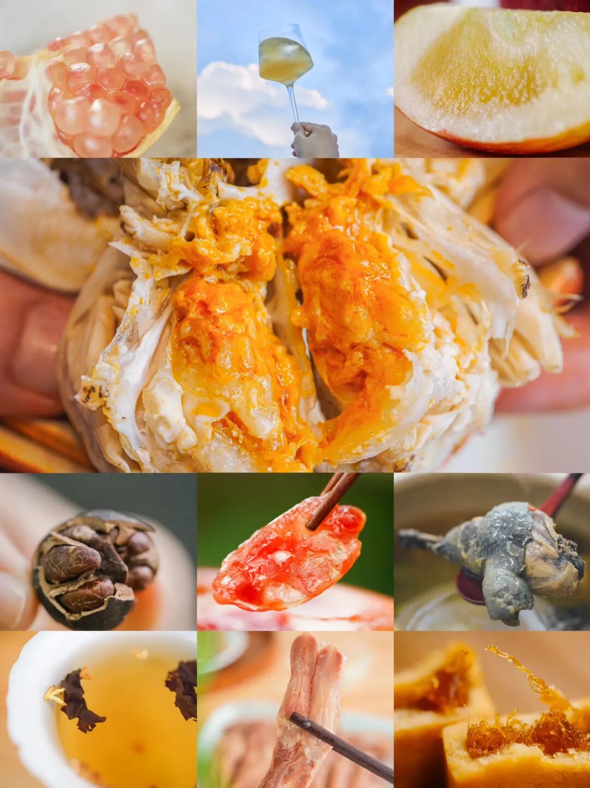

来！通通地板价走起！

直戳小🍊序购买

或者去天🐱凑单都可以！

必买榜 No.1：

后台被追杀追问了快一个月的大闸蟹👇

今年两个宝藏产区！

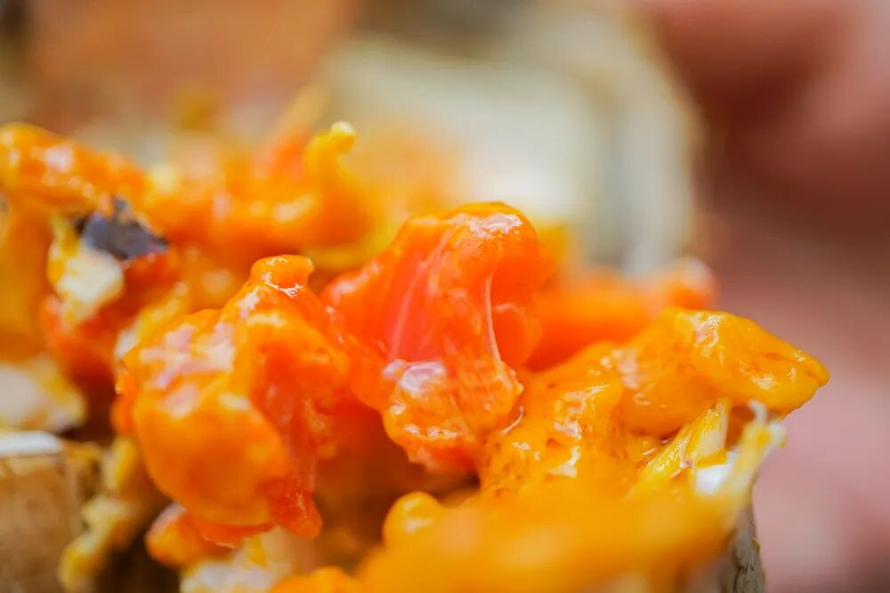

一是来自太湖流域的精挑大闸蟹！

名气响亮，专供星级大酒店，

是阳澄湖、太湖蟹口味流派，

蟹肉微微带甜，

一股子清新的蟹腥气久久不散，

吃完后指尖闻得到！

现在双十一同价限时 86 折！

（不过别担心，当地人教我们用牙膏洗一洗即可！

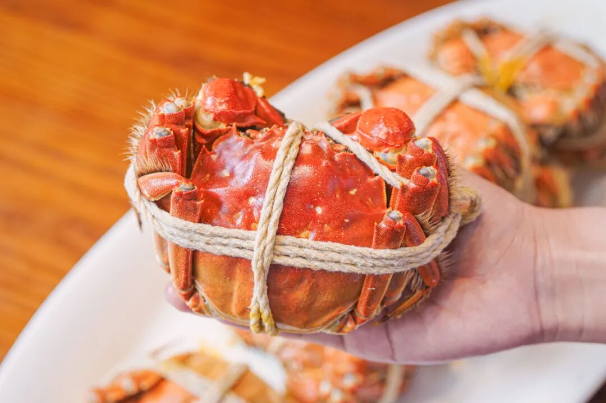

饱记·太湖流域大闸蟹

购买方式如下

双十一同价限时 86 折

人工精挑，

上岸后静养一两日更鲜美，

每日限量 50 箱。

拼的就是手速。

顺丰快递发货，新鲜看得见。

本周五起按顺序发，

这周末就能吃上。

戳图下单购买👇或🍑🍑🍑搜索「艾格吃饱了」

二是淮安洪泽湖大闸蟹，

已经是口碑第七年啦！一贯的饱记标准，酒店级品质，20年挑蟹佬精选。正宗洪泽湖大闸蟹，宝藏产区。

肉质紧鲜微带咸味，

蟹味浓鲜。（不是市面上一般苏北蟹！（洪泽大湖顶尖的蟹我们精挑 10% 的！

总结来说，就是好吃，不贵，猛吃不心疼！（保价双11，买贵退差

满黄流心啥的都是常规操作！

同样双十一同价限时 86 折！

机会难得！

饱记·洪泽湖大闸蟹

购买方式如下

双十一同价限时 86 折

人工精挑，

上岸后静养一两日更鲜美，

每日限量 100 箱。

顺丰快递发货，新鲜看得见。

本周五起按顺序发，

这周末就能吃上。

戳图下单购买👇或🍑🍑🍑搜索「艾格吃饱了」

必买榜 No.2：

一只外面买不到的鸡！

每次一出现就断货。

天气热的时候只能发包邮区，

这次顺丰次日达能到的地方都给发，

且老板因双十一打来

全年最低地板价 65 折！

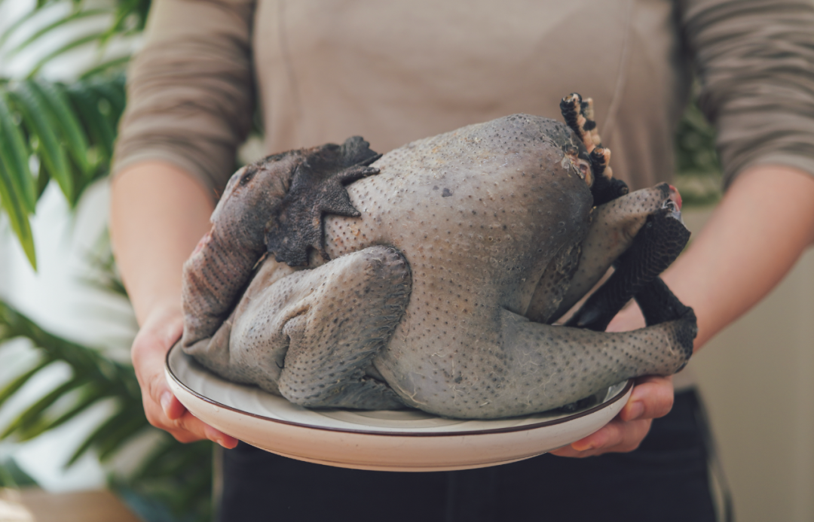

此鸡来头颇大，

有兴趣煲鸡汤的朋友戳👇复习。

什么鸡这么好吃？还要我亲自抢！！

这一批的母鸡已经卖光，

现在只剩下：

6 月龄公鸡：肉更多很清甜；

和 1 年 10 个月老公鸡：

肉更有韧劲，比普通公鸡含有更多蛋白质！

饱记·云南稀有品种瓢鸡

购买方式如下

双十一同价 65 折！！

两种规格：1 年 10 个月老公鸡净重 4 斤以上；
6 月龄母鸡净重 2.5 斤以上。
下单前请注意：此鸡蛋白质含量丰富，宰杀时已尽量放血，但少量余血开包时气味仍会比较大，请冲洗再食用！鸡皮不发粘，就绝非变质～～～
戳图下单购买👇或🍑🍑🍑搜索「艾格吃饱了」

必买榜 No.3：

卷里卷气的我司腊肠，

终于上线！三种口味都是真材实料，做煲仔饭、清蒸或爆炒都好吃。

吃过的人就会懂，

根本没有平替！

这腊肠做得费时费力，

现在也打一个限时 9 折，

快把老板薅光！

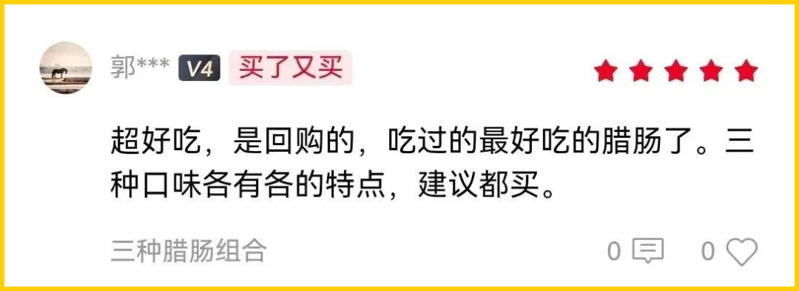

饱记·手工腊肠

购买方式如下👇

双十一同价 9 折！！

三款口味，各有各的特点。

用的黑猪肉、天然肠衣、玫瑰露酒...

酒香腊肠，酒香浓郁，

有四六和二八这两个肥瘦比例可选。

滇式腊肠用了不少贵价的辛香料，

同事说超适合拿来做西班牙海鲜饭，

试过加辣肠后升华了。

戳图下单购买👇

或🍑🍑🍑搜索

「艾格吃饱了」

必买榜 No.4：

我司山核桃！

给它排到这里，

纯粹因为这产品稳到不必多说。

都是今年刚炒的新货，

数量有限，先到先得，

现在单罐 9 折双罐 8.3 折

好吃！靠谱！划算！

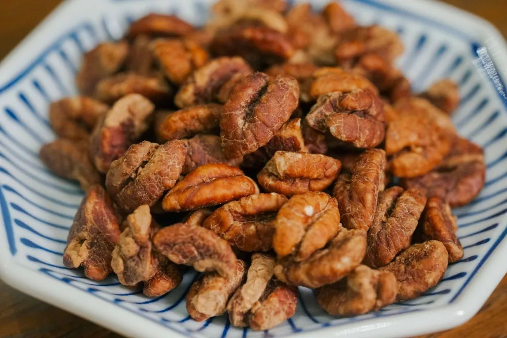

饱记·临安山核桃

双十一同价

单罐限时 9 折！

双罐限时 8.3 折！

戳图买它👇

或到🍑🍑🍑

搜索「艾格吃饱了」

必买榜 No.5：

这瓶金桔蜂蜜酒，

同事跑了多趟广西和四川才整出来，

一斤融安金桔才能换来一瓶酒，

真材实料，

外面根本买不到（叉腰

饱记·金桔蜂蜜酒购买方式如下双十一同价限时 76 折！！
正宗融安滑皮金桔，融入四川本地产土蜂蜜，
浸皮萃取，带来浓郁柑桔香气。
入口回味悠长，还有金桔的微微辛辣感，好喝得不得了！

戳图买它👇或到🍑🍑🍑搜索「艾格吃饱了」

还有水果两种！

正当季的丑苹果和库尔勒香梨，来自云南的蒙自西北勒小苹果。
甜中带有酸度，果味极其浓郁，甚至还有溏心！

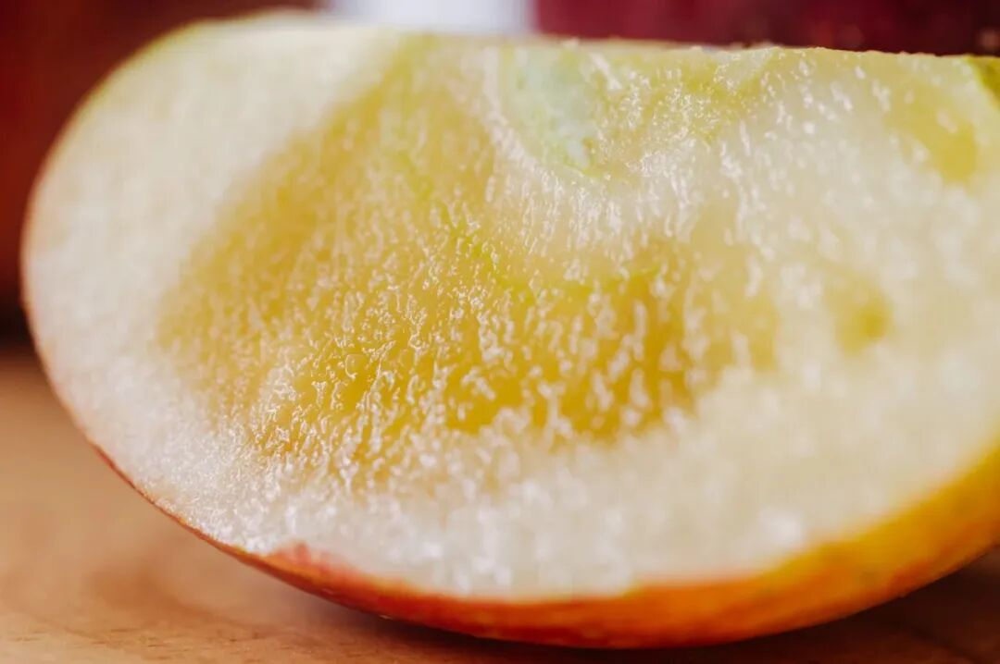

喝天山雪水长大的新疆库尔勒香梨，又甜又润，嫩得连皮也能吃！都有双十一同价限时 86 折！！

饱记·西北勒小苹果购买方式如下双十一同价限时 86 折！！
戳图买它！！👇
或到🍑🍑🍑搜索「艾格吃饱了」

饱记·新疆库尔勒香梨
购买方式如下双十一同价限时 86 折！！
戳图买它！！👇或到🍑🍑🍑搜索「艾格吃饱了」

以上时令好风物，
直接戳图片就能买！不怕麻烦的就点开🍑🍑🍑趁最后一天满 300-50，薯角我算了7 个购物车出来，有些东西约等于不要钱，

PS：这里说的不要钱，只是相对于原价来说，指的是天猫大促凑单满减折扣，真正拍下还是会显示支付金额的～
1. 「山核桃不要钱」购物车

简单明了的优等生作业在此👇

搭配着买山核桃等于白送。

山核桃可以买手剥版一颗一颗剥着吃，

又原始又清香！

当然也可以直接上懒人版，

简单省事的山核桃仁，

一把一把往嘴里丢！

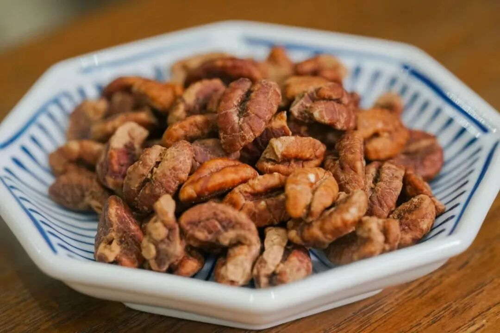

酒香鸭舌，包邮区肯定爱！

灵感来自《红楼梦》里宝玉喜爱的下酒小菜～

专门盯着南京的厂找，

因为全世界他们最懂鸭子。

最后定的是一家老师傅开的厂，

厂里有一锅 30 多年的老卤！

还有好评如流水的

大师凤梨酥！最新一批今天刚刚到货，选的都是新鲜土凤梨馅，
果肉含量大于 40%！
只有 90 天短保质期哦。

以及有大颗肉粒的午餐肉罐头，

几乎每个试过的用户都会回购。

囤着冬天煮各种锅时总能用上！

2. 「桂花乌龙不要钱」购物车

三款搭着买，

桂花乌龙等于白送👇

按福州同事的原话，

这茶完全经得起盖碗的考验！

和市面上都是细末的调味茶不是一回事，

必须细细品味！

入口茶汤微稠，舌侧香气余韵不绝，观音茶的回甘源源不断！

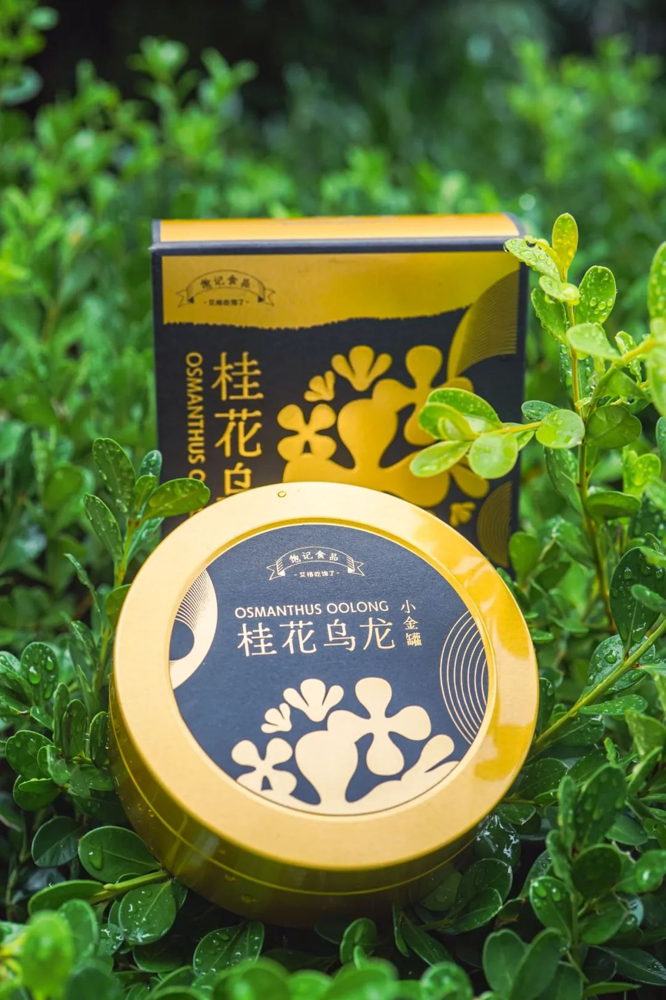

免煮酸梅汤，

没有乱七八糟的硫熏和色素，

都是中药房里常见食材，

工工整整码了八味。

冬天适合配辣火锅一起👇

3. 「蒙自小苹果不要钱」购物车

配上厚切猪肉片、山核桃，

还有大师凤梨酥、桂花乌龙一起买，

优惠满减下来，

约等于蒙自西北勒小苹果不要钱👇

4. 「云南绿籽石榴不要钱」购物车

香脆得根本停不下来的猪肉纸和小麻花，

加上我们的老伙计山核桃、桂花乌龙，

以下这个购物车，

8 斤云南老树绿籽石榴不要钱！👇

5. 「柚子小种红茶不要钱」购物车

搭上前面提到的厚切猪肉片、

桂花乌龙、山核桃还有大师凤梨酥，

直接省下一盒柚子小种的钱，薯角我都给你算好了👇

6. 「酥酥蛋卷、黄金柚条不要钱」购物车

正式进入我们的零食囤货环节！

搭配着必吃榜的山核桃一起买，

蛋卷和黄金柚条都不要钱！

爱零食的可以闭眼入！

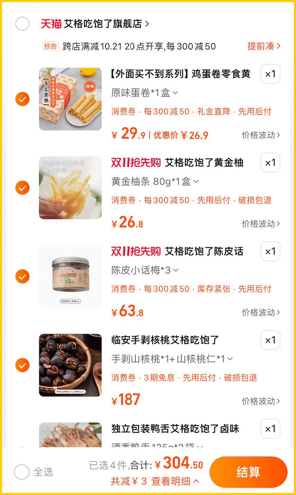

7. 「两袋麻花不要钱」购物车

和山核桃、陈皮小话梅一起买，

都是无负担的小零食，

算下来两袋麻花不要钱👇

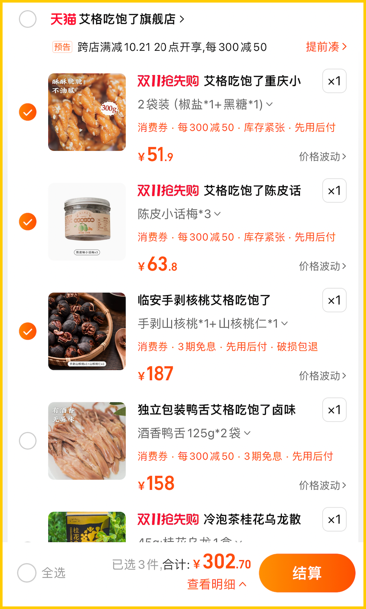

给你们指路完毕！

再说一次：

直戳小🍊序购买

或者去天🐱凑单都可以！

想在哪里买都行，

早买早享受！

第一波吃完还能赶上第二波回购！

题 外

还有人不知道我司线下活动已经开始了吗！！

本薯为了出门摸鱼，

已经提前给大家探过路了，

一句话总结：

逛得尽兴、玩得开心、吃得过瘾！

首先可以抽奖！

那种中奖率百分百的抽奖。

其次可以吃吃喝喝，

都是好吃正宗的云南小点，

还在现场学到了好些

云贵高原香料知识！

这就是我们为人气云南餐厅浩海火烧云设计承办的

的「香料花园」活动！

详情可戳今日次条哦～

即日起至本周末，

在上海市中心的芮欧百货一楼的

风之溪谷区域（静安公园隔壁）。

来玩来见面！

香料花园·超值门票

购买方式如下👇

戳图买它👇

本文的研究员

薯角秋天该很好

用好吃的方式吃一生

祖国各地好风物

文章转载请加微信「baojiclub」

