# 淘宝是有什么毛病吗。。。。。。

- 原文链接: https://mp.weixin.qq.com/s?__biz=MjM5NTYxODQyMA==&mid=2653470979&idx=1&sn=760469169e39a27c3594d2c7200a9a5d&chksm=bcaff81170c5f195a77156a1c3f375d2464e2819e0f81343e4af94e9357c46a2f3d82705fa67&scene=27#wechat_redirect
- 浏览量: N/A
- 点赞数: N/A
- 评论数: N/A
- 转发数: N/A

## 正文

机会难得！

一个尽情安利自我的公众号

以下是没事干研究院的风物研究报告请放心食用
周五还上啥班啊。。。今天话不多说，天🐱618 活动今晚 8 点开始啦！直接上🍑搜索「艾格吃饱了」，（咱也不懂为啥这么早。。。全场给大家 85 折！88 会员还有一张 200-20 券，再不买就不礼貌了吧！！！

1.

近期必吃榜NO.1

外面根本买不到！

粽子！

持平了早鸟价！！！

（无法再低了。。。

我司今年五个口味，

咸蛋黄流心，豆沙细腻，

现炸葱酥喷喷香，

口口是料

早餐就把自己吃美了～

不是我薯角吹，

看看后台的真实评价，

第一波吃上的朋友如是说👇

今年新做的闽南葱香烧肉粽，

我司产品经理找泉州妈妈要的配方，

料超多，馅超足！

用了泉州现炸红葱油、红葱酥

来炒制糯米，

再包入猪五花肉、干贝、

虾米、卤香菇、卤花生粒！

（快给我数不过来了

剩下都是湖州大粽，经典四个口味，

首先是包邮区的王：高邮咸蛋黄黑猪肉粽！

用高邮鲜挖的咸蛋黄，再称 40 克黑猪后腿瘦肉，10 克腰间肥膘，咸蛋流油起沙，油香混着肉香，市面上完全买不到！！

紧接着就是本薯今年的最爱：

新会三年陈皮豆沙粽！

今年四个口味里的唯一甜粽，甜而不腻。

因为取了正宗的广东新会三年陈皮，

每年端午前现磨包进粽子里。

看不见陈皮，但每一口都能感受到它的存在！

蒸过之后，香气清雅得想吟诗：啊～江南～

还有传统酱香黑猪肉粽，

用了三种酱油去浸米，其中一种是包邮区百年老字号日晒夜露的。
和蛋黄肉粽的米配方完全不同！老板说想要小时候土酱油的烟火气～（我只看得见一大块肉🙏

最后走一下小众复古路线：古法南乳黑猪肉粽，是想致敬包邮区南乳大肉的味道～南乳，就是红腐乳。翻遍包邮区、华北和广东的南乳酱，最后：广东古法南乳酱赛高！米和肉都能吃到咸香带微甜的腐乳味儿：（你看这个红！它是不是寓意着鸿运当头！！（我疯了

2.时令水果专区
第 1 件因为老天爷赏饭吃，刚降价的翡翠冰淇淋甜瓜！瓜如其名，入口蜜蜜甜，瓜肉软糯吃起来好似冰淇淋！

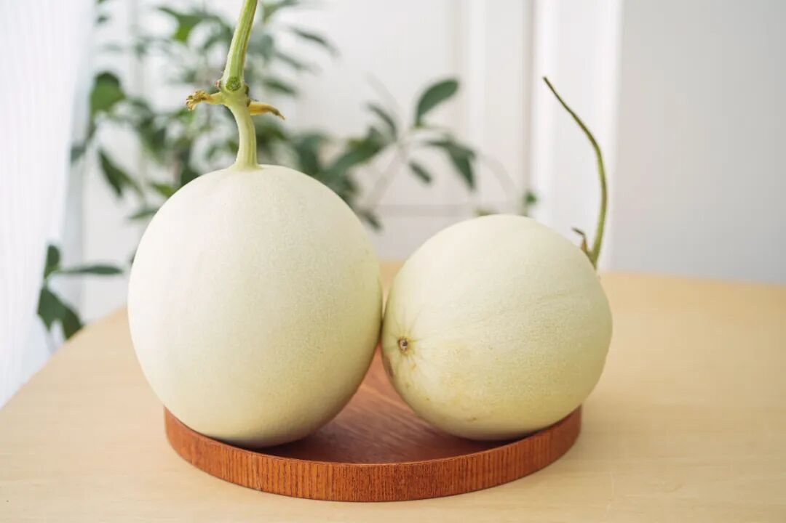

有多甜呢？中心糖度随手一测都有 15。

市面上许多瓜提前采摘，

加上上市前灌水增重，

导致收到后糖度太低。

而这瓜足足在藤上挂够 40 天，瓜老才够甜啊！

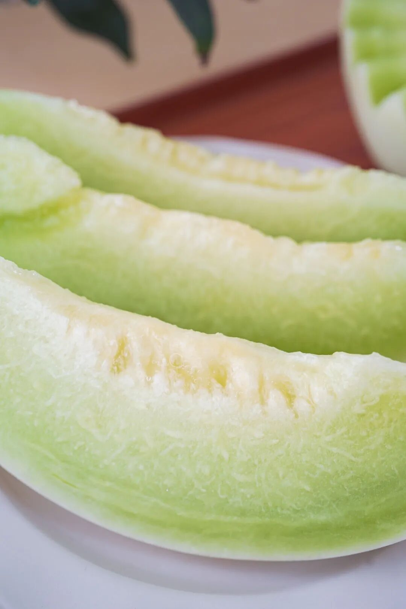

第 2 件娇艳可人的雷州木瓜，扑面而来一股浓郁奶香。。咬一口，超甜超糯超多汁，而且完全不发苦。（随便比，有这个自信，嘿嘿！

3.零食茶饮专区
第 1 件刚补完一批新货的酥酥蛋卷，

香酥，极其香酥，

好吃的秘诀无它，

就是舍得下料，手工制作！

新鲜鸡蛋含量高达 27 %，入口化沙。

更推荐南乳葱香味！

独家定制的口味，入口葱香浓郁，

然后是南乳的咸香，

味道平衡得刚刚好。

第 2 件这款好评如流水的大师凤梨酥！用料实在，
所以只有 90 天短保质期哦。

用的是台湾凤梨酥盲品大赛冠军配方，
选的都是新鲜土凤梨馅，
果肉含量大于 40%！
你一入口就能吃到浓浓的凤梨本味。

我司很喜欢吃凤梨酥的同事说，
吃过很多种凤梨酥，
芝士味浓郁的、果肉纤维多的、奶香味重的，
但都没有一口咬下去
酸甜跳跃的凤梨酥来得印象深刻。
是的，我饱记凤梨酥，
能让人吃出欣喜雀跃的感觉！

第 3 件酒香鸭舌，

包邮区糟卤口味！

灵感来自《红楼梦》里宝玉喜爱的下酒小菜～

冬天配杯热酒，超惬意！

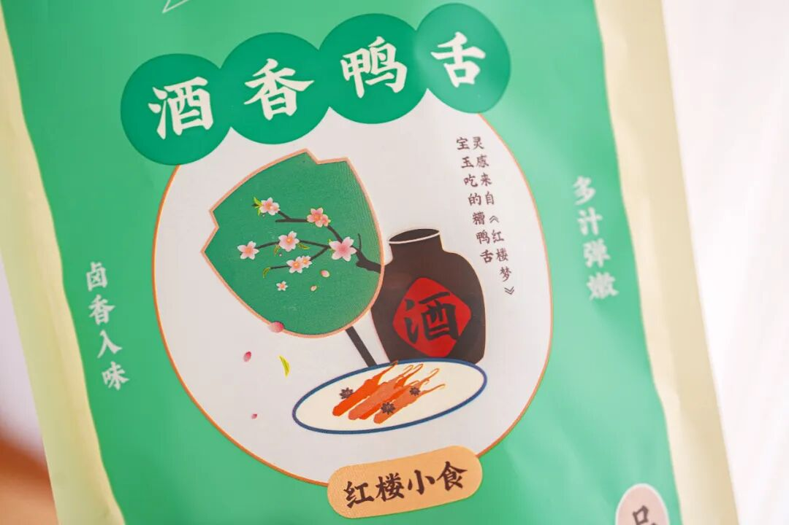

专门盯着南京的厂找，

因为全世界他们最懂鸭子。

最后定的是一家老师傅开的厂，

厂里有一锅 30 多年的老卤！

这个就叫家底儿～

鸭舌原料舍近求远，

用的内蒙古的鸭，

吃草～鸭舌肥嫩没有腥气！

所有的香料，

都直接从同仁堂、太乙堂两家中药房采买，

不是市场上那些脏脏没味儿的糙货！

传统方式吊糟，

就真的是糟香鸭舌的包装版！

完全没有真空鸭袋的辣鸡食品味！

不腥，很香，微咸，带酒意～

鸭舌边边上还有酒香味儿的冻～～

包邮区的朋友肯定爱！

第 4 件这个四川传统小零食：小麻花，是好吃到让我们一个自家做糕点酥类的大厂供应商都好奇的程度。

用的进口一级大豆油，和特制高筋粉。一共三个口味：
用手工熬黑糖裹制的黑糖麻花，
用好花椒入味的椒盐麻花，唇齿留香的芝麻麻花，
都不硬不腻不粘牙！

确实是市面上少见，重点是酥，脆，甜却不腻口，面粉配比讲究得很，别看就卖你十几块，有功夫在身上的。一定要去买！

接下来是喝茶饮酒时间。

有一说一，我司茶和酒真的不错，

都是自己卷自己的傲人成果。

第 1 件西湖龙井，先说梅家坞的明前龙井。杭州人自家会喝的龙井茶，性价比高。其实算下来单杯比奶茶还便宜。。。

独有的豆花香浓郁，与微甘的单宁味在一起，余韵悠长。许多人喜欢上龙井，都是从这款开始入坑的。

想喝喝看来自核心产区的正宗西湖龙井是什么样，从这款入门是一个很好的味觉基准线
五大核心产区中，梅家坞产量大，是西湖龙井性价比之选。老杭州人心目中的「硬通货」，不是最贵，但绝对拿得出手。

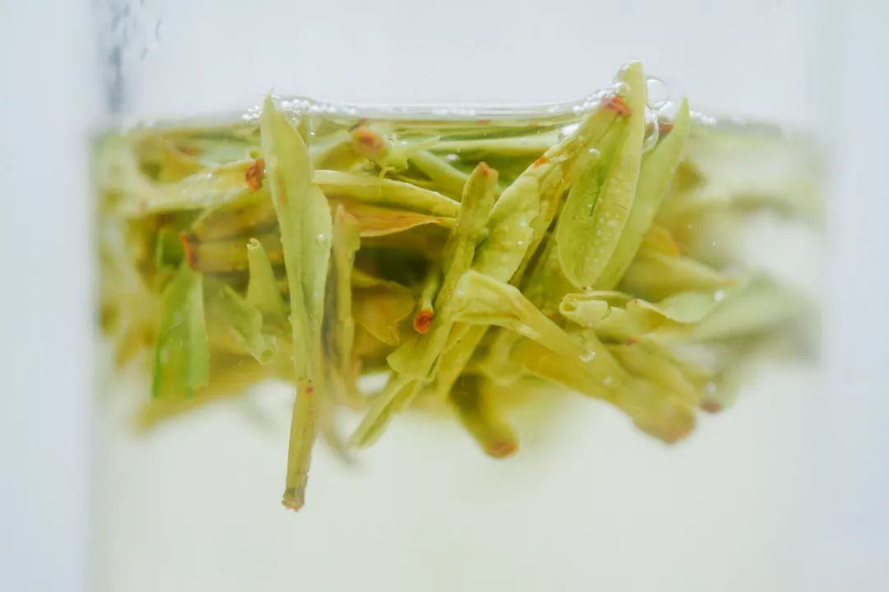

但如果你有一些送礼需求，

包体面的它来了！

西湖龙井核心产区中，

杭州人拿来送人的狮峰头采手工龙井，

我们做的是全手工茶，风味绝佳。

西湖龙井核心产区：狮、龙、云、虎、梅，狮为首，唯有严格限定的原叶产区，才可称「狮峰」之前我司和茶学硕士一起，筛选了一批狮峰产区茶企一一拜访，喝到这款，定了！明前头采、全手工炒制、除了典型的豆香，还有十分罕见的花香～

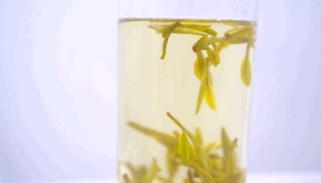

狮峰历来讲究豆香浓郁，但我们与制茶师傅约定这一泡，豆香要清雅，更有微微若兰的花香。

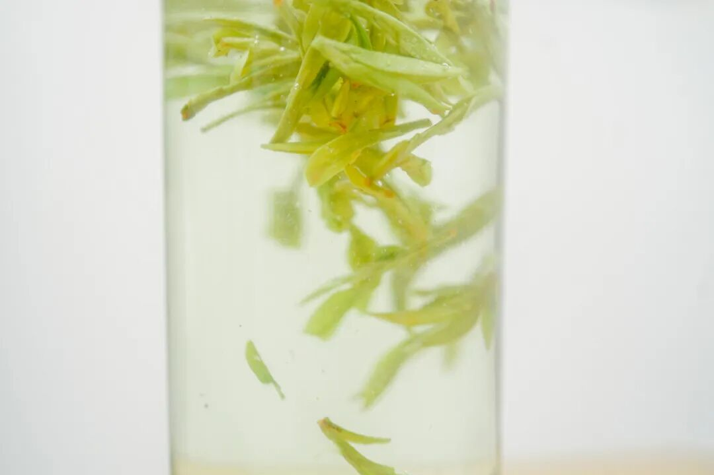

从小喝龙井，不太见到这种的。这是制茶师傅的创新，在整个核心产区也很罕见，但我们都觉得相当妙第 2 件继续说这一杯：蒙顶甘露！
小众但性价比高，四川朋友们应该更熟

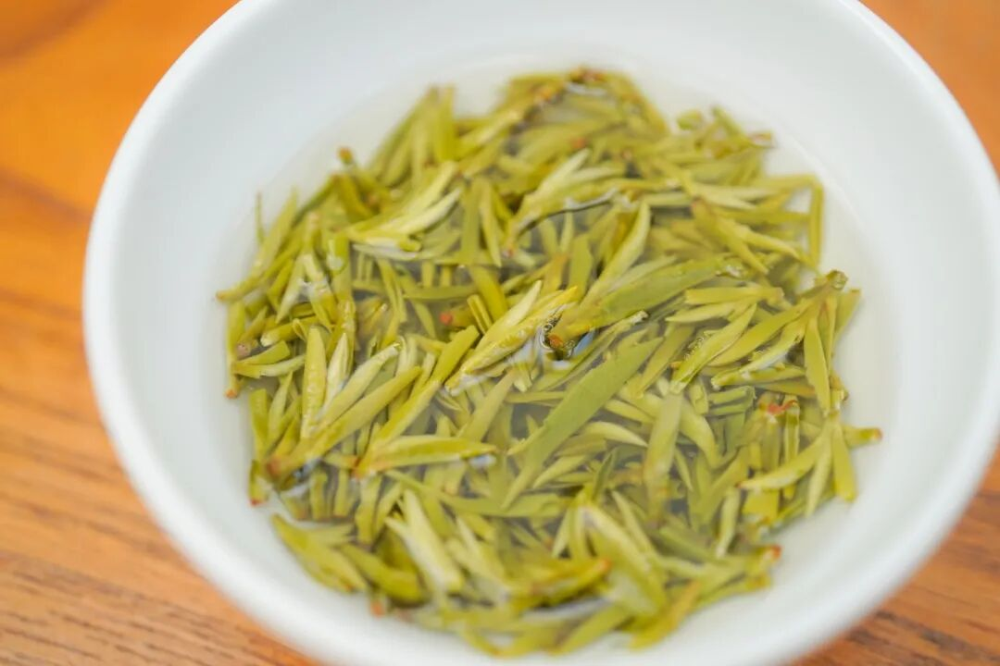

重点先说：我饱记的蒙顶甘露，均为审评特级茶。远高于市面普通茶品质，在四川的普通茶馆也喝不到。（以下来自茶学硕士前同事的认证

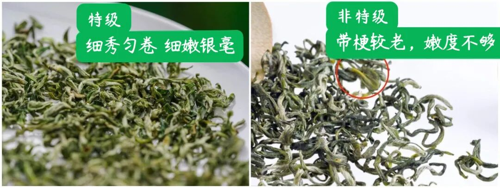

特级蒙顶甘露啥味道呢？真的好鲜！
因为蒙顶甘露制茶时需要保有的叶片白毫，含有的大量氨基酸物质。真的好甜！老茶人传统制茶，入口清香，回味微甜，千年前就这么甜。

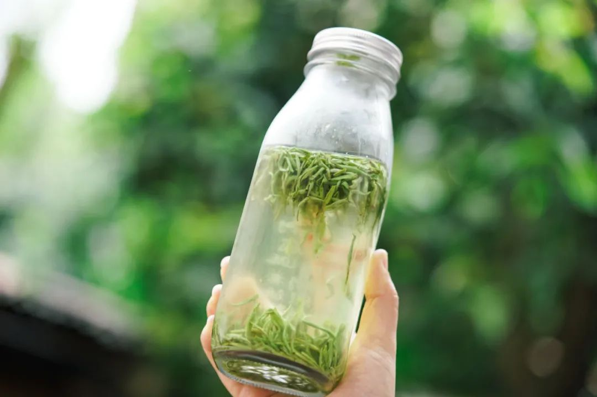

第 3 件入口有冰糖韵的小金罐·六窨茉莉花茶👇

福州乃茉莉花茶的发源地，

我司特地委托了

家中五代制茶的福州老茶人，

以传统古法窨制正宗茉莉花茶！

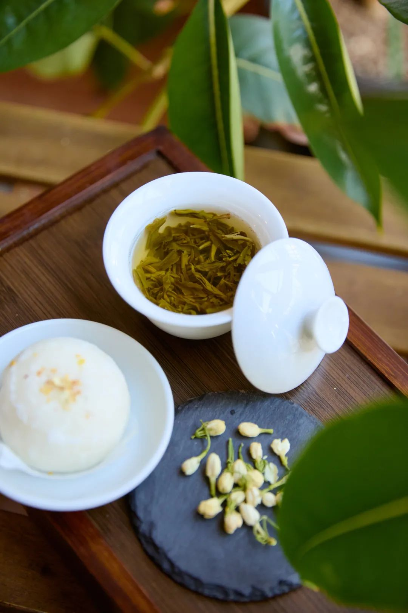

先要在夏季鲜采数百斤茉莉花，

因为那个时节温度高但雨水少，

茉莉花柔和鲜灵。

运回后再仔细拣选，

只留花苞、颜色、大小合适的茉莉花

与茶叶拼和。

再精选明前茶坯，

六窨一提传统窨制，

下花量高达 350 斤

这还没完！

福州古法做花茶，

见花香不见花，

茉莉花窨完后还要以手工挑除，

只留茶叶与花香～

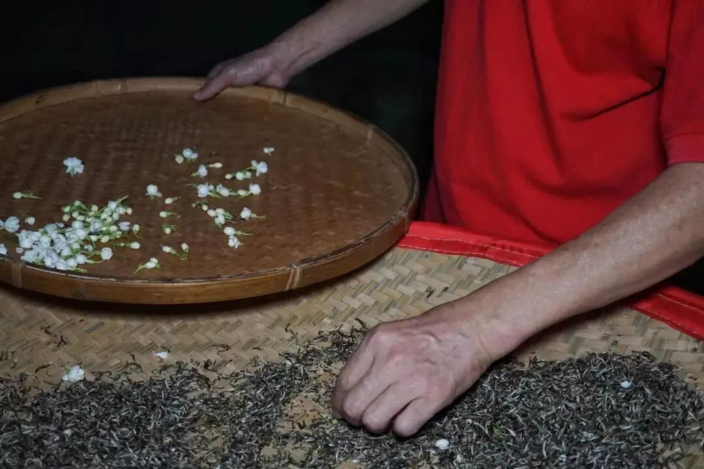

道道反复工序，

才有最后的舌尖一点冰糖韵，

抿一口茶汤，扑鼻香气～

鲜灵得让人神清气爽，

甘爽醇和，舌尖回甘～

第 4 件这一瓶「外面买不到」的——饱记·金桔蜂蜜酒。堪称产品同事的得意之作。费了好些功夫，跑完融安跑四川，跟酒厂磨出来。

倒出来直接喝，有浓郁的柑桔香气，入口顺滑，回味悠长，唇齿间会留有微微辛辣感。

金桔的风味，

是从融安自采了 3000 斤

正宗融安滑皮金桔，

果脆、芯甜、籽少，

拉到四川酒厂酿制。

还用上了传统葡萄酒酿法，

整颗金桔浸皮萃取，

从而使更多果实风味向酒液转移，

带来浓郁柑桔香气。

蜂蜜也有来头，用的四川本土产蜂蜜，在高山凉爽的气候下发酵酿制，甜而不腻，鼻尖能闻到丰盈的蜂蜜香嗷～

最后卷了一下包装，设计了定制束口袋，送礼自留皆适宜，酒喝完了收杂物也没问题！

以上，天🐱今晚 8 点起，统统 85 折走起！机会难得，都去给我薅老板羊毛嘿嘿～

题 外

但是朋友们，

如果你懒得去🍑下单，

以下给我司小🍊序直通车！

今年的饱记粽子！限时吃粽 88 折！这周刚上的海南椰子鸡，限时闪购 7 天！早鸟 86 折！突然熟了的云南西红柿，小时候阳光里长大的浓郁番茄味儿，
限时早鸟 86 折！！

还有些只有最近这一阵可吃的水果👇

拿过上海金奖的金山小皇冠西瓜，

爆汁清甜还有瓜鲜味！

也拿过上海金奖的金山小番茄，

难得回归的泰国超甜多汁金柚，

瓜肉软糯的翡翠冰淇淋甜瓜，

无渣不麻嘴的海南金钻凤梨，

连盐水都不用泡。

卷中卷红玉芒果，

娇艳可人的雷州木瓜，

现在也有限时 86 折！

饱记·口碑湖州大粽预售中

现货中！！！

限时吃粽 88 折！！！！

戳图买它👇

饱记·海南椰子鸡

限时早鸟 86 折！！！

限时闪购 7 天！

预计 5.23 发货

戳图买它👇

饱记·金山小皇冠西瓜

购买方式如下

限时早鸟 86 折！！！！

戳图买它👇

饱记·云南西红柿

购买方式如下

限时早鸟 86 折！！

戳图购买👇

饱记·多汁泰国金柚

购买方式如下

限时吃水果 86 折！！

戳图购买👇

饱记·金山五彩小番茄购买方式如下限时 86 折！！
戳图购买👇

饱记·翡翠冰淇淋甜瓜购买方式如下限时吃水果 86 折！！
戳图购买👇

饱记·花香脆甜蓝莓购买方式如下限时吃水果 86 折！！
戳图购买👇

饱记·海南金钻凤梨

购买方式如下

限时吃水果 86 折！！

戳图购买👇

饱记·海南红玉芒果购买方式如下限时吃水果 86 折！！！
戳图购买👇

饱记·湛江雷州木瓜

购买方式如下

限时吃水果 86 折！！

戳图购买👇

本文的研究员

薯角我想我知道夏天的味道

用好吃的方式吃一生

祖国各地好风物

文章转载请加微信「baojiclub」

